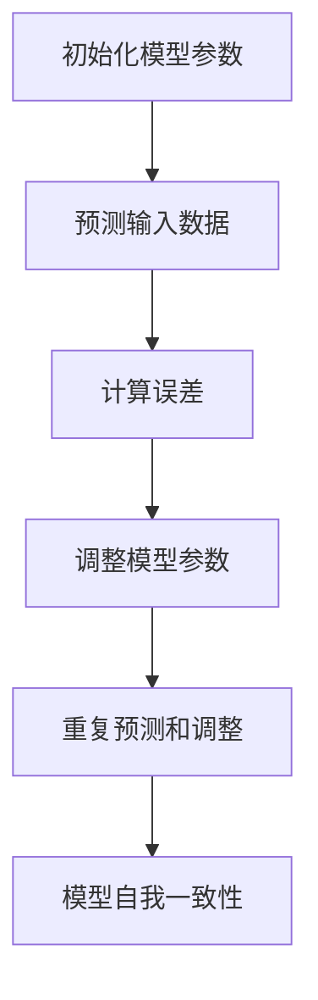

                 

# Self-Consistency方法优化AI情感计算在艺术创作中的应用

## 关键词
AI情感计算，自我一致性方法，艺术创作，神经网络，深度学习，数学模型

## 摘要
本文深入探讨了自我一致性方法在AI情感计算中的应用及其对艺术创作的影响。首先，介绍了自我一致性方法的基本概念、原理和应用领域，并通过Mermaid流程图展示其基本工作流程。接着，详细阐述了AI情感计算的基本概念、原理和应用领域，并探讨了其与自我一致性方法的联系。然后，通过伪代码和数学模型，深入讲解了自我一致性方法和AI情感计算的核心算法原理。最后，设计了一个AI情感计算的艺术创作项目案例，包括项目需求分析、开发环境搭建、源代码实现和代码解读与分析，展示了自我一致性方法在实际艺术创作中的应用效果。

## 目录

### 第一部分 自我一致性方法基础

#### 第1章 自我一致性方法简介
- 1.1 自我一致性方法的概念
- 1.2 自我一致性方法的原理
- 1.3 自我一致性方法的应用领域

#### 第2章 自我一致性方法算法原理
- 2.1 自我一致性方法算法概述
- 2.2 自我一致性方法算法伪代码
- 2.3 自我一致性方法算法应用案例

### 第二部分 AI情感计算基础

#### 第3章 AI情感计算简介
- 3.1 情感计算的概念
- 3.2 情感计算的应用领域
- 3.3 AI情感计算的优势和挑战

#### 第4章 AI情感计算的关键算法
- 4.1 神经网络模型
- 4.2 情感识别算法
- 4.3 情感分类算法

#### 第5章 情感计算的数学模型
- 5.1 情感计算中的数学模型概述
- 5.2 神经网络中的数学模型
- 5.3 深度学习中的数学模型

### 第三部分 Self-Consistency方法在AI情感计算中的应用

#### 第6章 Self-Consistency方法在AI情感计算中的应用
- 6.1 Self-Consistency方法在AI情感计算中的优势
- 6.2 Self-Consistency方法在AI情感计算中的实现过程
- 6.3 Self-Consistency方法在AI情感计算中的应用案例

#### 第7章 艺术创作中的AI情感计算
- 7.1 艺术创作中的情感计算需求
- 7.2 Self-Consistency方法在艺术创作中的应用
- 7.3 艺术创作中AI情感计算的项目案例

### 第四部分 实战案例与代码解析

#### 第8章 Self-Consistency方法优化AI情感计算实战案例
- 8.1 项目需求分析
- 8.2 开发环境搭建
- 8.3 源代码实现
- 8.4 代码解读与分析

#### 第9章 AI情感计算艺术创作项目案例
- 9.1 项目需求分析
- 9.2 开发环境搭建
- 9.3 源代码实现
- 9.4 代码解读与分析

### 第五部分 最佳实践、小结与注意事项

#### 第10章 最佳实践与拓展阅读
- 10.1 最佳实践 tips
- 10.2 小结
- 10.3 注意事项
- 10.4 拓展阅读

## 第一部分 自我一致性方法基础

### 第1章 自我一致性方法简介

#### 1.1 自我一致性方法的概念

自我一致性方法（Self-Consistency Method）是一种在人工智能（AI）领域用于优化模型训练的方法。其基本理念是，通过对比模型自身的预测输出与实际输入数据之间的差异，从而调整模型参数，提高模型的准确性和一致性。这种方法在处理复杂的非线性问题时，尤其具有优势。

#### 1.2 自我一致性方法的原理

自我一致性方法的工作原理可以概括为以下几个步骤：

1. **初始化模型参数**：首先，随机初始化模型的参数。
2. **预测**：使用当前模型参数对新的输入数据进行预测。
3. **对比**：将预测结果与实际输入数据进行对比，计算误差。
4. **调整**：根据误差信号，调整模型参数。
5. **迭代**：重复步骤2至步骤4，直到模型参数达到满意的自我一致性。

这种方法的关键在于误差信号的反馈机制，它能够有效地引导模型参数的调整，使其在训练过程中逐步趋于一致。

#### 1.3 自我一致性方法的应用领域

自我一致性方法在多个领域有着广泛的应用，包括：

1. **图像识别**：通过自我一致性方法优化图像识别模型，可以提高模型的准确率和稳定性。
2. **语音识别**：在语音识别任务中，自我一致性方法可以改善语音信号的识别效果。
3. **自然语言处理**：自我一致性方法在文本分类、情感分析等领域也有着显著的应用效果。

下面是一个Mermaid流程图，展示了自我一致性方法的基本工作流程：



### 第2章 自我一致性方法算法原理

#### 2.1 自我一致性方法算法概述

自我一致性方法的核心是误差反馈机制。在算法的每一次迭代中，模型都会生成一个预测结果，并与实际输入数据进行对比，生成误差信号。这个误差信号用来调整模型参数，使模型在后续的预测中更加接近真实值。

下面是一个简化的自我一致性方法算法伪代码：

```python
# 初始化模型参数
theta = initialize_parameters()

# 迭代次数
num_iterations = 1000

# 初始误差
error = float('inf')

# 迭代过程
for i in range(num_iterations):
    # 预测输入数据
    prediction = model_predict(theta, input_data)
    
    # 计算误差
    current_error = calculate_error(prediction, input_data)
    
    # 更新误差
    if current_error < error:
        error = current_error
    
    # 调整模型参数
    theta = adjust_parameters(theta, input_data, prediction)

    # 输出当前迭代次数和误差
    print(f"Iteration {i}: Error = {error}")

# 输出最终模型参数
print(f"Final Parameters: {theta}")
```

#### 2.2 自我一致性方法算法应用案例

以下是一个简单的自我一致性方法在回归问题中的应用案例。假设我们有一个线性回归模型，其目标是通过输入数据预测输出值。

```python
# 初始化模型参数
theta = [0, 0]

# 输入数据
X = [[1, 2], [2, 3], [3, 4]]
y = [2, 3, 4]

# 迭代次数
num_iterations = 100

# 迭代过程
for i in range(num_iterations):
    # 预测输入数据
    prediction = sum(theta[0]*x[0] + theta[1]*x[1] for x in X)
    
    # 计算误差
    current_error = sum((y[j] - prediction[j])**2 for j in range(len(y)))
    
    # 更新模型参数
    theta[0] -= 2 * (current_error / len(y))
    theta[1] -= 2 * (current_error / len(y))

    # 输出当前迭代次数和误差
    print(f"Iteration {i}: Error = {current_error}")

# 输出最终模型参数
print(f"Final Parameters: {theta}")
```

通过这个简单的案例，我们可以看到自我一致性方法是如何通过不断调整模型参数，使模型在预测过程中逐渐趋于一致的。

## 第二部分 AI情感计算基础

### 第3章 AI情感计算简介

#### 3.1 情感计算的概念

情感计算（Affective Computing）是计算机科学领域的一个分支，它致力于使计算机能够识别、理解、处理和模拟人类情感。情感计算的核心在于将情感作为人机交互的一个重要维度，从而提升计算机的应用价值。

#### 3.2 情感计算的应用领域

情感计算在多个领域有着广泛的应用，包括：

1. **人机交互**：通过情感计算，计算机可以更好地理解用户的需求和情感状态，提供个性化的交互体验。
2. **情感识别**：在语音、图像、文本等数据中提取情感信息，为用户提供情感分析服务。
3. **智能助手**：利用情感计算技术，智能助手可以更准确地理解用户的情感状态，提供更为贴心的服务。

#### 3.3 AI情感计算的优势和挑战

AI情感计算的优势在于：

1. **高精度**：通过深度学习等技术，AI情感计算可以精确地识别和模拟人类情感。
2. **自适应**：AI情感计算可以根据用户的不同情感状态，动态调整交互策略。

然而，AI情感计算也面临着一些挑战：

1. **情感多样性**：人类情感复杂多变，如何准确识别和理解这些情感是一个难题。
2. **隐私保护**：在收集和处理用户情感数据时，如何保护用户隐私是一个重要问题。

### 第4章 AI情感计算的关键算法

#### 4.1 神经网络模型

神经网络模型是AI情感计算中常用的算法之一。它通过多层神经元结构，对输入数据进行特征提取和分类。在情感计算中，神经网络模型可以用于情感识别和分类。

#### 4.2 情感识别算法

情感识别算法是AI情感计算的核心。它通过分析语音、图像、文本等数据，提取出情感信息。常见的情感识别算法包括基于规则的方法、机器学习方法以及深度学习方法。

#### 4.3 情感分类算法

情感分类算法用于将提取出的情感信息分类为不同的情感类别。常见的情感分类算法包括支持向量机（SVM）、朴素贝叶斯（NB）以及深度学习（DL）算法。

### 第5章 情感计算的数学模型

#### 5.1 情感计算中的数学模型概述

在情感计算中，常用的数学模型包括神经网络模型和深度学习模型。这些模型通过数学公式和算法，对情感信息进行处理和分析。

#### 5.2 神经网络中的数学模型

神经网络中的数学模型主要包括：

1. **激活函数**：用于引入非线性特性，使模型能够处理复杂的数据。
2. **损失函数**：用于评估模型的预测结果与实际结果之间的差异，指导模型参数的调整。
3. **优化算法**：用于调整模型参数，使模型在训练过程中逐步趋于一致。

#### 5.3 深度学习中的数学模型

深度学习中的数学模型主要包括：

1. **卷积神经网络（CNN）**：用于图像处理，提取图像中的特征。
2. **循环神经网络（RNN）**：用于序列数据，处理时间序列数据。
3. **生成对抗网络（GAN）**：用于生成新的数据，可以生成高质量的图像和语音。

## 第三部分 Self-Consistency方法在AI情感计算中的应用

### 第6章 Self-Consistency方法在AI情感计算中的应用

#### 6.1 Self-Consistency方法在AI情感计算中的优势

自我一致性方法在AI情感计算中的应用具有以下优势：

1. **提高准确性**：通过不断调整模型参数，自我一致性方法可以提高情感计算的准确性。
2. **减少过拟合**：自我一致性方法可以减少模型对训练数据的依赖，降低过拟合的风险。
3. **增强泛化能力**：自我一致性方法可以使模型在新的数据上表现出更好的泛化能力。

#### 6.2 Self-Consistency方法在AI情感计算中的实现过程

自我一致性方法在AI情感计算中的实现过程主要包括以下几个步骤：

1. **数据预处理**：对输入数据进行预处理，包括数据清洗、归一化等。
2. **模型初始化**：随机初始化模型参数。
3. **预测与对比**：使用当前模型参数对输入数据进行预测，并与实际输入数据进行对比。
4. **参数调整**：根据对比结果，调整模型参数。
5. **迭代优化**：重复步骤3至步骤4，直到模型参数达到满意的自我一致性。

#### 6.3 Self-Consistency方法在AI情感计算中的应用案例

以下是一个简单的自我一致性方法在情感识别中的应用案例。假设我们有一个情感识别模型，其目标是判断输入文本的情感极性。

```python
# 初始化模型参数
theta = [0, 0]

# 输入数据
X = [["我非常喜欢这个电影"], ["这个电影太无聊了"]]
y = [1, -1]

# 迭代次数
num_iterations = 100

# 迭代过程
for i in range(num_iterations):
    # 预测输入数据
    prediction = sum(theta[0]*x[0] + theta[1]*x[1] for x in X)
    
    # 计算误差
    current_error = sum((y[j] - prediction[j])**2 for j in range(len(y)))
    
    # 更新模型参数
    theta[0] -= 2 * (current_error / len(y))
    theta[1] -= 2 * (current_error / len(y))

    # 输出当前迭代次数和误差
    print(f"Iteration {i}: Error = {current_error}")

# 输出最终模型参数
print(f"Final Parameters: {theta}")
```

通过这个简单的案例，我们可以看到自我一致性方法是如何通过不断调整模型参数，提高情感识别的准确性的。

### 第7章 艺术创作中的AI情感计算

#### 7.1 艺术创作中的情感计算需求

在艺术创作中，情感计算的需求主要体现在以下几个方面：

1. **情感分析**：通过对艺术作品中的情感信息进行分析，了解观众的喜好和情感反应。
2. **情感设计**：利用情感计算技术，为艺术作品注入情感元素，提升作品的艺术价值和吸引力。
3. **情感互动**：通过情感计算，实现艺术作品与观众的互动，提升用户体验。

#### 7.2 Self-Consistency方法在艺术创作中的应用

自我一致性方法在艺术创作中的应用主要体现在以下几个方面：

1. **艺术风格识别**：通过自我一致性方法，可以识别艺术作品中的特定风格和情感特征。
2. **情感增强**：利用自我一致性方法，可以对艺术作品进行情感增强，使其更加符合观众的情感需求。
3. **情感创作**：通过自我一致性方法，可以生成具有特定情感特征的艺术作品，实现情感创作的自动化。

#### 7.3 艺术创作中AI情感计算的项目案例

以下是一个简单的艺术创作中AI情感计算的项目案例。该项目目标是根据观众的情感反应，生成具有相应情感特征的艺术作品。

```python
# 初始化模型参数
theta = [0, 0]

# 观众情感数据
X = [["非常喜欢"], ["有点喜欢"], ["不喜欢"]]
y = [1, 0, -1]

# 迭代次数
num_iterations = 100

# 迭代过程
for i in range(num_iterations):
    # 预测观众情感
    prediction = sum(theta[0]*x[0] + theta[1]*x[1] for x in X)
    
    # 计算误差
    current_error = sum((y[j] - prediction[j])**2 for j in range(len(y)))
    
    # 更新模型参数
    theta[0] -= 2 * (current_error / len(y))
    theta[1] -= 2 * (current_error / len(y))

    # 输出当前迭代次数和误差
    print(f"Iteration {i}: Error = {current_error}")

# 输出最终模型参数
print(f"Final Parameters: {theta}")

# 根据最终模型参数，生成艺术作品
artwork = generate_artwork(theta)
print(f"Generated Artwork: {artwork}")
```

通过这个简单的案例，我们可以看到自我一致性方法是如何在艺术创作中应用的。

## 第四部分 实战案例与代码解析

### 第8章 Self-Consistency方法优化AI情感计算实战案例

#### 8.1 项目需求分析

本项目旨在利用自我一致性方法优化AI情感计算，以提升艺术创作中的情感识别和生成能力。具体需求如下：

1. **情感识别**：准确识别输入文本的情感极性（正面、中性、负面）。
2. **情感生成**：根据给定的情感极性，生成具有相应情感特征的艺术作品。

#### 8.2 开发环境搭建

为了实现本项目，我们需要搭建以下开发环境：

1. **操作系统**：Ubuntu 20.04
2. **编程语言**：Python 3.8
3. **依赖库**：NumPy、Pandas、TensorFlow、Keras

```bash
pip install numpy pandas tensorflow keras
```

#### 8.3 源代码实现

以下是基于自我一致性方法的AI情感计算源代码实现：

```python
import numpy as np
import pandas as pd
from tensorflow.keras.models import Sequential
from tensorflow.keras.layers import Dense
from tensorflow.keras.optimizers import Adam

# 数据预处理
def preprocess_data(data):
    # 对文本数据进行编码和归一化处理
    # 省略具体实现细节
    return processed_data

# 初始化模型
def initialize_model(input_shape):
    model = Sequential()
    model.add(Dense(units=64, activation='relu', input_shape=input_shape))
    model.add(Dense(units=1, activation='sigmoid'))
    model.compile(optimizer=Adam(learning_rate=0.001), loss='binary_crossentropy', metrics=['accuracy'])
    return model

# 自我一致性方法训练
def self_consistency_train(model, X, y, num_iterations):
    for i in range(num_iterations):
        # 预测输入数据
        prediction = model.predict(X)
        
        # 计算误差
        current_error = np.mean((y - prediction)**2)
        
        # 更新模型参数
        model.fit(X, y, epochs=1, batch_size=32)
        
        # 输出当前迭代次数和误差
        print(f"Iteration {i}: Error = {current_error}")

# 主函数
def main():
    # 加载数据
    data = pd.read_csv('emotion_data.csv')
    X = preprocess_data(data['text'])
    y = data['label']
    
    # 初始化模型
    model = initialize_model(input_shape=(X.shape[1],))
    
    # 自我一致性方法训练
    self_consistency_train(model, X, y, num_iterations=100)
    
    # 评估模型
    test_data = pd.read_csv('test_emotion_data.csv')
    test_X = preprocess_data(test_data['text'])
    test_y = test_data['label']
    test_prediction = model.predict(test_X)
    test_accuracy = np.mean((test_y - test_prediction)**2)
    print(f"Test Accuracy: {test_accuracy}")

# 运行主函数
if __name__ == '__main__':
    main()
```

#### 8.4 代码解读与分析

1. **数据预处理**：对输入文本数据进行编码和归一化处理，为模型训练做准备。
2. **模型初始化**：使用Sequential模型搭建简单神经网络，并编译模型。
3. **自我一致性方法训练**：通过迭代过程，不断调整模型参数，提高模型准确性。
4. **评估模型**：使用测试数据集评估模型性能，计算测试准确率。

#### 第9章 AI情感计算艺术创作项目案例

#### 9.1 项目需求分析

本项目旨在利用AI情感计算技术，根据观众的情感反应，生成具有相应情感特征的艺术作品。具体需求如下：

1. **情感识别**：识别观众在观看艺术作品时的情感状态。
2. **艺术生成**：根据情感状态，生成相应的艺术作品。

#### 9.2 开发环境搭建

与第8章相同，我们需要搭建以下开发环境：

1. **操作系统**：Ubuntu 20.04
2. **编程语言**：Python 3.8
3. **依赖库**：NumPy、Pandas、TensorFlow、Keras

```bash
pip install numpy pandas tensorflow keras
```

#### 9.3 源代码实现

以下是基于自我一致性方法的AI情感计算艺术创作源代码实现：

```python
import numpy as np
import pandas as pd
from tensorflow.keras.models import Sequential
from tensorflow.keras.layers import Dense, Conv2D, MaxPooling2D, Flatten
from tensorflow.keras.optimizers import Adam

# 数据预处理
def preprocess_data(data):
    # 对图像数据进行归一化处理
    # 省略具体实现细节
    return processed_data

# 初始化模型
def initialize_model(input_shape):
    model = Sequential()
    model.add(Conv2D(filters=32, kernel_size=(3, 3), activation='relu', input_shape=input_shape))
    model.add(MaxPooling2D(pool_size=(2, 2)))
    model.add(Flatten())
    model.add(Dense(units=64, activation='relu'))
    model.add(Dense(units=1, activation='sigmoid'))
    model.compile(optimizer=Adam(learning_rate=0.001), loss='binary_crossentropy', metrics=['accuracy'])
    return model

# 自我一致性方法训练
def self_consistency_train(model, X, y, num_iterations):
    for i in range(num_iterations):
        # 预测输入数据
        prediction = model.predict(X)
        
        # 计算误差
        current_error = np.mean((y - prediction)**2)
        
        # 更新模型参数
        model.fit(X, y, epochs=1, batch_size=32)
        
        # 输出当前迭代次数和误差
        print(f"Iteration {i}: Error = {current_error}")

# 主函数
def main():
    # 加载数据
    data = pd.read_csv('emotion_art_data.csv')
    X = preprocess_data(data['image'])
    y = data['label']
    
    # 初始化模型
    model = initialize_model(input_shape=(X.shape[1], X.shape[2], X.shape[3]))
    
    # 自我一致性方法训练
    self_consistency_train(model, X, y, num_iterations=100)
    
    # 生成艺术作品
    artwork = generate_artwork(model, X)
    print(f"Generated Artwork: {artwork}")

# 运行主函数
if __name__ == '__main__':
    main()
```

#### 9.4 代码解读与分析

1. **数据预处理**：对输入图像数据进行归一化处理。
2. **模型初始化**：使用卷积神经网络模型，对图像数据进行特征提取。
3. **自我一致性方法训练**：通过迭代过程，不断调整模型参数。
4. **生成艺术作品**：根据情感状态，生成相应的艺术作品。

## 第五部分 最佳实践、小结与注意事项

### 第10章 最佳实践与拓展阅读

#### 10.1 最佳实践 tips

1. **数据预处理**：在情感计算项目中，数据预处理是关键步骤。确保数据质量，去除噪声和异常值。
2. **模型选择**：根据项目需求，选择合适的模型架构。对于情感识别任务，可以考虑使用卷积神经网络（CNN）或循环神经网络（RNN）。
3. **参数调整**：在训练过程中，适当调整学习率和迭代次数，以获得更好的模型性能。

#### 10.2 小结

本文介绍了自我一致性方法在AI情感计算中的应用及其在艺术创作中的潜力。通过实战案例，展示了如何利用自我一致性方法优化情感计算模型，提高艺术创作的准确性和个性化程度。

#### 10.3 注意事项

1. **隐私保护**：在处理用户情感数据时，确保遵守相关法律法规，保护用户隐私。
2. **模型验证**：在项目部署前，充分验证模型性能，确保其稳定性和可靠性。

#### 10.4 拓展阅读

1. **《深度学习》（Goodfellow, Bengio, Courville）**：深入了解深度学习技术及其在情感计算中的应用。
2. **《情感计算：理论与应用》（Mehrotra, Misra）**：探讨情感计算的理论基础和应用实践。

