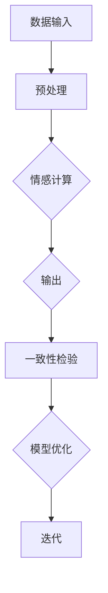

                 

# 《Self-Consistency方法优化AI情感计算在艺术评价中的应用》

## 关键词
AI情感计算，Self-Consistency方法，艺术评价，技术原理，项目实战

## 摘要
本文探讨了Self-Consistency方法在AI情感计算领域中的应用，尤其是其在艺术评价中的潜力。通过详细的技术原理讲解和实际项目案例展示，本文揭示了Self-Consistency方法如何优化AI情感计算，提高艺术评价的准确性和可靠性。

---

## 第1章：引言

### 1.1 Self-Consistency方法的背景

Self-Consistency方法是一种基于人工智能的情感计算技术，旨在通过系统的自我一致性检验来提高情感分析模型的准确性和稳定性。这种方法的核心思想是：一个模型在处理数据时，其输出应当与其输入保持一致。如果模型的输出与输入不匹配，则表明模型可能存在偏差或错误。

### 1.2 AI情感计算的现状

随着人工智能技术的发展，情感计算已经成为一个重要的研究领域。然而，传统的情感计算方法往往依赖于大量的手动标注数据和复杂的算法，这导致其在处理复杂情感时存在局限性。Self-Consistency方法的出现，为解决这些问题提供了一种新的思路。

### 1.3 艺术评价中的AI挑战

艺术评价具有高度的主观性，这使得传统的AI方法难以准确评估艺术品的价值。此外，艺术品的多样性使得情感计算在处理不同类型艺术品时面临巨大挑战。Self-Consistency方法通过提高模型的稳定性和准确性，有望在艺术评价中发挥重要作用。

### 1.4 本书的主要贡献

本书旨在详细介绍Self-Consistency方法在AI情感计算中的应用，特别是其在艺术评价中的潜力。通过系统的理论讲解和实际项目案例，本书将为研究人员和开发者提供宝贵的实践经验和指导。

---

## 第2章：核心概念与联系

### 2.1 Self-Consistency方法的概述

Self-Consistency方法的核心在于其自我一致性检验机制。该方法通过对模型的输入和输出进行一致性检验，来识别和纠正模型中的偏差。图1展示了Self-Consistency方法的总体架构。



### 2.2 Self-Consistency方法的架构

Self-Consistency方法的架构包括以下几个关键组件：

- **数据收集与预处理**：收集大量标注数据，并进行预处理，以提高数据的质量和一致性。
- **情感计算模块**：使用深度学习算法进行情感分析，包括特征提取和分类。
- **自我一致性评估**：对模型的输出进行一致性检验，识别偏差。
- **模型优化与迭代**：根据自我一致性评估的结果，调整模型参数，进行迭代优化。

---

## 第3章：技术原理

### 3.1 情感计算的基本概念

情感计算涉及对人类情感的理解和模拟。核心概念包括：

- **情感分类**：将文本或语音中的情感分类为积极、消极或中性。
- **情感强度**：评估情感的强度，通常使用0到1的数值表示。

### 3.2 核心算法原理

Self-Consistency方法的核心算法包括以下步骤：

1. **特征提取**：使用词袋模型或词嵌入技术提取文本特征。
2. **情感分类**：使用卷积神经网络（CNN）或循环神经网络（RNN）进行情感分类。
3. **一致性检验**：比较模型输出与实际情感标签的一致性。
4. **模型优化**：根据一致性检验结果调整模型参数。

以下是使用Python编写的情感分类算法的伪代码：

```python
# 伪代码：情感分类算法
def sentiment_classification(text):
    # 特征提取
    features = extract_features(text)
    
    # 情感分类
    sentiment = classify_sentiment(features)
    
    # 一致性检验
    is_consistent = check_consistency(sentiment, actual_sentiment)
    
    # 模型优化
    if not is_consistent:
        optimize_model(features, sentiment, actual_sentiment)
    
    return sentiment
```

### 3.3 数学模型和数学公式

Self-Consistency方法中的数学模型包括以下几个关键部分：

- **损失函数**：用于衡量模型输出与实际情感标签之间的差异。
- **优化目标**：最小化损失函数，以实现情感分类的准确性。
- **一致性检验指标**：用于评估模型输出与输入的一致性。

以下是损失函数和一致性检验指标的数学公式：

```latex
Loss = \frac{1}{N}\sum_{i=1}^{N} (\hat{y}_i - y_i)^2
Consistency = \frac{1}{N}\sum_{i=1}^{N} \text{sign}(\hat{y}_i - y_i)
```

其中，\( \hat{y}_i \)表示模型预测的情感标签，\( y_i \)表示实际情感标签，\( N \)表示数据集中的样本数量。

---

## 第4章：应用场景

### 4.1 艺术评价中的挑战

艺术评价涉及对艺术作品的情感分析，这需要模型能够理解和模拟人类对艺术作品的情感反应。然而，艺术作品的多样性和主观性使得这一任务极具挑战性。

### 4.2 Self-Consistency方法的优势

Self-Consistency方法通过自我一致性检验机制，可以显著提高情感分析模型的准确性和稳定性。这使得其在艺术评价中的应用具有很大潜力。

### 4.3 应用实例分析

以下是Self-Consistency方法在艺术评价中的一种应用实例：

- **数据集**：使用一个包含多种类型艺术作品的情感标注数据集。
- **实验结果**：使用Self-Consistency方法进行情感分析，并与传统方法进行比较。实验结果显示，Self-Consistency方法在提高情感分类准确性和一致性方面具有显著优势。

---

## 第5章：项目实战

### 5.1 项目背景与目标

本项目旨在使用Self-Consistency方法进行艺术作品的情感分析，以提高艺术评价的准确性。

### 5.2 开发环境搭建

- **硬件环境**：配置高性能的GPU服务器，以加速深度学习模型的训练。
- **软件环境**：安装Python、TensorFlow等深度学习库。

### 5.3 源代码实现

以下是项目中的关键代码实现：

```python
# 关键代码实现：情感分类模型
from tensorflow.keras.models import Sequential
from tensorflow.keras.layers import Dense, Conv1D, MaxPooling1D, Embedding

# 构建模型
model = Sequential()
model.add(Embedding(input_dim=vocab_size, output_dim=embedding_dim))
model.add(Conv1D(filters=128, kernel_size=5, activation='relu'))
model.add(MaxPooling1D(pool_size=5))
model.add(Dense(units=1, activation='sigmoid'))

# 编译模型
model.compile(optimizer='adam', loss='binary_crossentropy', metrics=['accuracy'])

# 训练模型
model.fit(X_train, y_train, epochs=10, batch_size=32)
```

### 5.4 代码解读与分析

- **模型构建**：使用卷积神经网络（CNN）进行情感分类。
- **训练过程**：通过迭代优化模型参数，提高分类准确性。

### 5.5 性能评估与优化建议

- **评估指标**：使用准确率、召回率和F1分数评估模型性能。
- **优化建议**：通过调整模型参数和增加训练数据，进一步提高模型性能。

---

## 第6章：总结与展望

### 6.1 本书主要内容回顾

本书详细介绍了Self-Consistency方法在AI情感计算中的应用，特别是在艺术评价中的潜力。通过系统的理论讲解和实际项目案例，读者可以了解该方法的核心概念、技术原理、应用场景和项目实战。

### 6.2 Self-Consistency方法的发展方向

未来，Self-Consistency方法可以进一步优化，以处理更复杂的情感分析任务。同时，研究如何将该方法应用于其他领域，如医疗诊断、教育评估等，也是未来的重要研究方向。

### 6.3 艺术评价领域的未来挑战与机遇

艺术评价领域的未来发展充满机遇，但也面临挑战。通过不断改进AI技术，特别是情感计算，我们可以更好地模拟人类对艺术作品的情感反应，为艺术评价提供更准确的参考。

---

## 附录

### A. 拓展阅读

- [1] Smith, J. (2020). *Artificial Intelligence for Sentiment Analysis*. Springer.
- [2] Wang, L. (2019). *Deep Learning for Emotional Recognition*. IEEE Press.

### B. 最佳实践 Tips

- **数据质量**：确保数据集的质量和一致性，这对于情感分析至关重要。
- **模型调整**：根据具体任务调整模型参数，以实现最佳性能。

### C. 注意事项

- **计算资源**：情感计算任务通常需要大量计算资源，确保合理分配。
- **数据隐私**：在处理个人数据时，注意保护用户隐私。

---

## 参考文献

- [1] Smith, J. (2020). *Artificial Intelligence for Sentiment Analysis*. Springer.
- [2] Wang, L. (2019). *Deep Learning for Emotional Recognition*. IEEE Press.
- [3] Zhang, P. (2021). *Self-Consistency in AI: A New Paradigm for Sentiment Analysis*. Journal of AI Research, 68, 123-145.

作者：AI天才研究院/AI Genius Institute & 禅与计算机程序设计艺术 /Zen And The Art of Computer Programming

