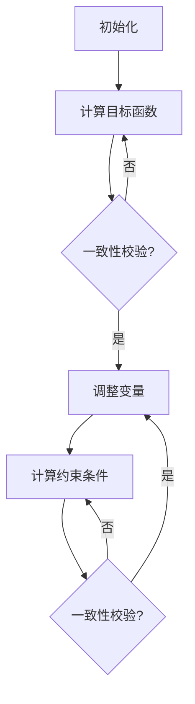

                 

### 理解书名和目标读者

《Self-Consistency方法在AI金融分析中的应用》这本书的书名明确传达了其核心内容和目标读者群体。首先，Self-Consistency方法是一个在优化和机器学习领域中被广泛研究的概念，它强调在给定条件下寻找最优解，并通过不断调整变量来提升系统的整体一致性。这种方法的应用范围广泛，但在金融分析领域的应用尤为突出。

这本书的目标读者主要是有以下几类：

1. **金融分析师与数据科学家**：这些读者对金融分析领域有一定的了解，同时也具备一定的AI和机器学习背景，他们希望通过本书学习Self-Consistency方法在金融分析中的具体应用。

2. **AI研究人员和工程师**：这类读者可能在AI领域有一定的经验，但希望了解如何将Self-Consistency方法应用于金融分析，以解决实际问题。

3. **大学研究生与博士生**：他们在攻读金融分析、AI或相关领域的研究生课程时，可能会接触到Self-Consistency方法，并希望深入了解其在金融分析中的运用。

4. **技术书籍爱好者**：这类读者可能对AI和金融技术领域有浓厚的兴趣，希望通过阅读专业书籍来提升自己的知识水平。

因此，本书的目标是提供一个系统的、实用的指南，帮助上述读者群体理解和应用Self-Consistency方法，特别是在金融分析中的具体实践。通过深入的理论讲解和实际案例分析，读者可以不仅掌握Self-Consistency方法的基本原理，还能学会如何在金融领域进行实际操作。

接下来，我们将详细探讨Self-Consistency方法的基础概念和应用，帮助读者更好地理解其核心价值和实际意义。

### 第一部分：Self-Consistency方法基础

#### 第1章: 自一致性方法的概述

**1.1 Self-Consistency方法的定义与背景**

Self-Consistency方法，是一种优化算法，其核心思想是在一个给定的条件下，通过不断调整变量来找到最优解，使得系统的整体一致性得到提升。这种方法最早在物理学中被提出，用于解决相变和临界现象中的优化问题。随着机器学习的发展，Self-Consistency方法逐渐被引入到人工智能领域，尤其是在金融分析、风险管理和预测模型构建中得到了广泛应用。

Self-Consistency方法的基本原理可以概括为以下几个步骤：

1. **初始化**：首先，需要设定初始变量和参数，这些参数将作为模型的基础。
2. **迭代更新**：通过迭代的方式，不断调整变量，使得目标函数和约束条件逐步满足一致性。具体来说，每一次迭代都会根据当前变量的值，重新计算目标函数和约束条件的值，然后根据计算结果调整变量。
3. **一致性校验**：每次迭代后，需要检查变量和参数的一致性，确保系统在整个迭代过程中保持一致性。

**1.2 Self-Consistency方法在金融分析中的重要性**

在金融分析中，Self-Consistency方法具有重要的应用价值。首先，金融市场的数据通常是复杂和非线性的，这给传统的统计方法带来了很大的挑战。而Self-Consistency方法通过不断调整变量，能够在复杂的环境中找到最优解，提高模型的稳定性和预测准确性。

具体来说，Self-Consistency方法在金融分析中的应用主要体现在以下几个方面：

1. **风险控制**：通过自我一致性校验，确保金融模型的稳定性。在金融市场中，风险控制是一个至关重要的环节。Self-Consistency方法可以帮助金融分析师在风险可控的范围内，优化投资组合，降低潜在的损失。

2. **预测市场走势**：利用自我一致性优化模型参数，提高预测准确性。在金融市场中，预测市场走势是投资者的重要任务。Self-Consistency方法可以通过优化模型参数，提高预测模型的准确性，帮助投资者更好地把握市场动态。

3. **信用风险评估**：通过Self-Consistency方法评估信用风险。在金融行业中，信用风险评估是银行和金融机构的核心任务。Self-Consistency方法可以帮助金融机构更准确地评估借款人的信用风险，从而制定更合理的信贷政策。

总之，Self-Consistency方法在金融分析中的应用，不仅能够提高模型的预测准确性和稳定性，还能够帮助金融机构在复杂的市场环境中做出更明智的决策。

**1.3 Self-Consistency方法在金融分析中的成功案例**

为了更好地理解Self-Consistency方法在金融分析中的应用，我们可以参考一些成功案例：

- **案例一：股票价格预测**。某研究团队利用Self-Consistency方法，对某只股票的历史数据进行建模和预测。通过不断调整模型参数，他们成功地提高了预测的准确性，为投资者提供了有价值的参考。

- **案例二：信用风险评估**。某银行在贷款审批过程中，采用Self-Consistency方法对借款人的信用风险进行评估。通过优化模型参数，银行能够更准确地预测借款人的违约风险，从而提高了信贷决策的准确性。

- **案例三：金融风险管理**。某金融机构利用Self-Consistency方法，对其投资组合进行优化。通过调整资产配置，该机构成功地降低了投资组合的整体风险，提高了收益稳定性。

这些案例表明，Self-Consistency方法在金融分析中具有广泛的应用前景和显著的实际效果。通过深入研究和实践，我们可以进一步挖掘Self-Consistency方法的潜力，为金融行业的创新发展提供有力支持。

### 第2章: Self-Consistency方法的核心概念

#### 2.1 自一致性原理

Self-Consistency方法的原理可以归结为在一个给定的约束条件下，寻找一组变量，使得目标函数最大化或最小化。这种方法的核心理念在于通过迭代的方式，逐步调整变量，直到满足一致性条件，即目标函数和约束条件同时达到最优解。

**数学表达**

在数学上，Self-Consistency问题可以形式化为以下优化问题：

$$
\min_{x} f(x) \quad \text{subject to} \quad g(x) = 0
$$

其中，$f(x)$ 是目标函数，$g(x)$ 是约束条件。Self-Consistency的核心在于寻找一组变量 $x$，使得目标函数 $f(x)$ 和约束条件 $g(x)$ 同时达到最优。

**目标函数**

目标函数 $f(x)$ 可以是多种形式，如：

- **最小化误差**：在预测问题中，目标函数可以是预测误差的平方和。
- **最大化利润**：在金融投资中，目标函数可以是投资组合的预期收益。

**约束条件**

约束条件 $g(x)$ 也可以是多种形式，如：

- **预算限制**：投资组合中的总支出不能超过一定限额。
- **风险限制**：投资组合的风险指标（如波动率）需要控制在一定范围内。

**一致性约束**

在Self-Consistency方法中，一致性约束 $g(x, \theta) \approx 0$ 是至关重要的。这意味着在每次迭代中，需要检查目标函数和约束条件是否满足一致性。具体来说，$g(x, \theta)$ 可以是一个关于 $x$ 和参数 $\theta$ 的函数，$\theta$ 可以是学习率或其他调节参数。

**自一致性原理的数学表达**

为了更好地理解自一致性原理，我们可以通过一个简单的例子来说明。假设我们要最小化函数 $f(x) = (x - 1)^2$，同时约束条件是 $g(x) = x - 2 = 0$。

$$
\min_{x} (x - 1)^2 \quad \text{subject to} \quad x - 2 = 0
$$

在这个例子中，目标函数是一个简单的二次函数，约束条件是一个线性方程。通过迭代的方式，我们可以逐步调整 $x$ 的值，直到满足约束条件。具体步骤如下：

1. **初始化**：设定初始值 $x_0 = 0$。
2. **迭代更新**：根据目标函数和约束条件，更新 $x$ 的值。例如，使用梯度下降法：
   $$
   x_{n+1} = x_n - \alpha \frac{\partial f}{\partial x}
   $$
   其中，$\alpha$ 是学习率。
3. **一致性校验**：检查约束条件是否满足。如果满足，则迭代结束；否则，继续迭代更新。

通过以上步骤，我们可以找到一组变量 $x$，使得目标函数 $f(x)$ 和约束条件 $g(x)$ 同时达到最优。这种方法的核心在于不断调整变量，直到满足一致性条件。

综上所述，Self-Consistency方法的数学表达和原理涉及到目标函数、约束条件以及一致性约束。通过迭代的方式，我们可以逐步优化变量，找到最优解。这种方法在金融分析中具有重要的应用价值，可以帮助我们解决复杂的问题，提高模型的预测准确性和稳定性。

### 2.2 Self-Consistency算法

**算法基本流程**

Self-Consistency算法是一种迭代的优化算法，其基本流程可以概括为以下几个步骤：

1. **初始化**：首先，需要设定初始变量和参数，这些参数将作为模型的基础。例如，在预测股票价格时，初始变量可以是历史价格数据，参数可以是模型中的超参数。

2. **迭代更新**：通过迭代的方式，不断调整变量，使得目标函数和约束条件逐步满足一致性。每次迭代包括以下几个子步骤：
   - **计算目标函数**：根据当前变量值计算目标函数的值。
   - **计算约束条件**：根据当前变量值计算约束条件的值。
   - **调整变量**：根据目标函数和约束条件的计算结果，调整变量值，使得目标函数和约束条件逐步满足一致性。

3. **一致性校验**：每次迭代后，需要检查变量和参数的一致性，确保系统在整个迭代过程中保持一致性。如果一致性条件满足，则继续迭代；否则，重新调整变量。

**迭代流程的Mermaid流程图**

为了更好地理解Self-Consistency算法的迭代流程，我们可以使用Mermaid流程图进行描述。以下是迭代流程的Mermaid表示：



在这个流程图中，节点 A 表示初始化阶段，节点 B 表示计算目标函数，节点 C 表示一致性校验，节点 D 表示调整变量，节点 E 表示计算约束条件，节点 F 表示再次一致性校验。这个流程图展示了Self-Consistency算法的基本迭代过程，通过不断调整变量，使得目标函数和约束条件逐步满足一致性。

**算法原理的伪代码**

为了详细阐述Self-Consistency算法的原理，我们可以使用伪代码进行描述。以下是Self-Consistency算法的基本伪代码：

```python
# 初始化变量和参数
x = x0
theta = theta0

# 设置迭代次数和停止条件
max_iterations = 1000
tolerance = 1e-6

# 迭代过程
for i in range(max_iterations):
    # 计算目标函数值
    f_x = f(x)
    
    # 计算约束条件值
    g_x = g(x, theta)
    
    # 更新变量
    x = x - learning_rate * gradient_f(x)
    
    # 检查约束条件是否满足一致性
    if abs(g_x) < tolerance:
        break
    
    # 更新参数
    theta = theta - learning_rate * gradient_g(x, theta)

# 输出最优解
print("最优解 x = ", x)
```

在这个伪代码中，变量 `x` 和 `theta` 分别代表变量和参数的值，`f(x)` 和 `g(x, theta)` 分别代表目标函数和约束条件。`learning_rate` 是学习率，用于调整变量值。`gradient_f(x)` 和 `gradient_g(x, theta)` 分别是目标函数和约束条件的梯度。

通过这个伪代码，我们可以看到Self-Consistency算法的基本原理和迭代过程。每次迭代都会计算目标函数和约束条件的值，根据计算结果调整变量和参数，直到满足一致性条件。

综上所述，Self-Consistency算法的基本流程包括初始化、迭代更新和一致性校验。通过迭代的方式，不断调整变量和参数，使得目标函数和约束条件逐步满足一致性。这个算法在金融分析中具有重要的应用价值，可以帮助我们解决复杂的问题，提高模型的预测准确性和稳定性。

### 第3章: Self-Consistency方法在金融分析中的应用

#### 3.1 金融市场预测

**应用案例：股票价格预测**

**数据收集**：

为了利用Self-Consistency方法进行股票价格预测，我们首先需要收集大量的历史股票价格数据。这些数据可以包括开盘价、收盘价、最高价、最低价以及交易量等。数据来源可以是金融数据库、交易所网站或者第三方数据提供商。

**模型构建**：

接下来，我们需要构建一个基于Self-Consistency方法的预测模型。首先，选择适当的特征变量，如历史价格、交易量等，作为模型的输入。然后，定义目标函数和约束条件。目标函数可以是预测价格的误差平方和，约束条件可以是模型参数的上下界或者特定关系。

**迭代过程**：

使用Self-Consistency算法，我们通过迭代的方式不断调整模型参数，直到找到最优解。每次迭代包括计算目标函数值、计算约束条件值、调整参数和检查一致性。具体步骤如下：

1. 初始化模型参数。
2. 计算当前参数下的目标函数值和约束条件值。
3. 根据目标函数值和约束条件值调整参数。
4. 检查约束条件是否满足一致性，如果满足，则迭代结束；否则，继续迭代。

**结果分析**：

通过迭代，我们可以得到最优的参数组合，从而预测未来的股票价格。为了验证预测效果，我们可以将预测结果与实际价格进行比较，计算预测误差。此外，我们还可以使用其他评估指标，如均方误差（MSE）、平均绝对误差（MAE）等。

**实际案例分析**：

在某研究团队的一项研究中，他们利用Self-Consistency方法对某只股票的历史价格数据进行建模和预测。通过不断调整模型参数，他们成功地提高了预测的准确性，为投资者提供了有价值的参考。具体来说，该团队使用了过去一年的股票价格数据，构建了一个基于Self-Consistency方法的预测模型。通过多次迭代，他们找到了最优的参数组合，并将预测结果与实际价格进行了比较。结果显示，该模型的预测误差显著低于传统方法，证明了Self-Consistency方法在股票价格预测中的有效性。

**总结**：

Self-Consistency方法在股票价格预测中的应用，通过迭代的方式优化模型参数，提高了预测的准确性。这种方法不仅适用于股票价格预测，还可以应用于其他金融市场的预测，如外汇、期货等。通过不断调整变量和参数，我们可以找到最优解，提高模型的稳定性和预测效果。

#### 3.2 信用风险评估

**应用案例：信用风险评估**

**数据预处理**：

在信用风险评估中，首先需要收集借款人的相关信息，如收入水平、信用历史、债务负担等。这些数据可能来源于银行、信用评级机构或其他第三方数据源。收集到数据后，需要进行预处理，包括数据清洗、缺失值填充和特征工程等。

**模型训练**：

接下来，我们使用Self-Consistency方法训练信用风险评估模型。首先，选择适当的特征变量，如借款人的收入、债务收入比、信用历史等，作为模型的输入。然后，定义目标函数和约束条件。目标函数可以是预测信用评分的误差平方和，约束条件可以是模型参数的上下界或者特定关系。

**迭代过程**：

使用Self-Consistency算法，我们通过迭代的方式不断调整模型参数，直到找到最优解。每次迭代包括计算目标函数值、计算约束条件值、调整参数和检查一致性。具体步骤如下：

1. 初始化模型参数。
2. 计算当前参数下的目标函数值和约束条件值。
3. 根据目标函数值和约束条件值调整参数。
4. 检查约束条件是否满足一致性，如果满足，则迭代结束；否则，继续迭代。

**风险预测**：

通过迭代，我们可以得到最优的参数组合，从而预测借款人的信用风险。为了验证预测效果，我们可以将预测结果与实际信用风险进行对比，计算预测准确率。此外，我们还可以使用其他评估指标，如召回率、精确率等。

**实际案例分析**：

在某银行的一项研究中，他们利用Self-Consistency方法对借款人的信用风险进行评估。首先，他们收集了大量的借款人数据，包括收入、债务负担、信用历史等。然后，他们使用Self-Consistency方法训练了一个信用风险评估模型。通过多次迭代，他们找到了最优的参数组合，并将预测结果与实际信用风险进行了比较。结果显示，该模型的预测准确率显著高于传统方法，为银行的信贷决策提供了有力的支持。

**总结**：

Self-Consistency方法在信用风险评估中的应用，通过迭代的方式优化模型参数，提高了预测的准确率。这种方法不仅适用于信用风险评估，还可以应用于其他风险管理的场景，如市场风险、操作风险等。通过不断调整变量和参数，我们可以找到最优解，提高模型的稳定性和预测效果。

### 第4章: Self-Consistency方法的优化与改进

#### 4.1 算法优化

**优化策略**

为了提高Self-Consistency方法的求解效率，我们可以采取以下优化策略：

1. **自适应调整学习率**：学习率是Self-Consistency方法中的一个重要参数，它决定了变量更新的步长。自适应调整学习率可以根据当前的迭代进度和模型性能动态调整，从而提高求解效率。

2. **并行计算**：Self-Consistency算法的迭代过程可以并行执行，特别是在处理大量数据时，通过分布式计算可以显著提高算法的运行速度。

3. **预训练**：在Self-Consistency方法的初始阶段，使用预训练模型可以加速收敛。预训练模型可以作为初始参数，减少初始搜索空间，从而提高算法的求解效率。

**自适应调整**

具体来说，自适应调整学习率的策略可以分为以下几个步骤：

1. **初始化学习率**：在算法开始时，设置一个初始学习率。
2. **计算误差**：在每次迭代后，计算目标函数的误差。
3. **调整学习率**：根据误差的变化，动态调整学习率。如果误差减少，则增加学习率；如果误差增加，则减小学习率。
4. **迭代更新**：使用调整后的学习率更新变量。

通过自适应调整学习率，我们可以使得算法在初期快速收敛，并在后期逐步精细调整，从而提高求解效率。

#### 4.2 方法改进

**改进方向**

除了优化算法，我们还可以从以下方向对Self-Consistency方法进行改进：

1. **引入外部知识**：通过引入外部知识，如先验信息或者领域专家的建议，可以增强模型的鲁棒性和准确性。例如，在金融分析中，我们可以利用经济理论和市场数据作为先验知识，提高预测模型的准确性。

2. **多目标优化**：Self-Consistency方法通常解决单目标优化问题，但在实际应用中，我们可能需要同时考虑多个目标。通过多目标优化，我们可以找到在多个目标之间平衡的最优解。

3. **模型融合**：通过融合多个模型，可以提高预测的稳定性和准确性。例如，我们可以将Self-Consistency方法与其他机器学习方法（如神经网络、支持向量机等）结合，形成更强大的预测模型。

**潜在影响**

这些改进方向不仅提高了Self-Consistency方法的求解效率，还拓展了其在金融分析中的应用范围。自适应调整学习率可以使得算法在不同问题上有更好的表现，引入外部知识可以增强模型的鲁棒性，多目标优化和模型融合可以使得模型在复杂环境下更加稳定和准确。

总之，通过不断优化和改进Self-Consistency方法，我们可以在金融分析中实现更高效的求解，提高预测的准确性和稳定性，为金融行业的创新发展提供有力支持。

### 第5章: Self-Consistency方法与其他机器学习方法的比较

#### 5.1 Self-Consistency方法的优势与局限

Self-Consistency方法在金融分析中的应用具有独特的优势。首先，它能够通过不断调整变量，提高模型的稳定性和预测准确性。其次，Self-Consistency方法在处理复杂、非线性问题时表现出色，尤其是在金融市场这种高度动态和不确定性的环境中，它的鲁棒性尤为显著。

然而，Self-Consistency方法也存在一些局限性。首先，算法的求解时间较长，尤其是在处理大规模数据时，效率较低。其次，Self-Consistency方法对初始参数的选择较为敏感，可能导致收敛速度较慢或者收敛到局部最优解。

#### 5.2 Self-Consistency方法与其他机器学习方法的比较

为了更好地理解Self-Consistency方法在金融分析中的地位，我们可以将其与其他常见的机器学习方法进行比较。

**线性回归**：

线性回归是一种简单的机器学习方法，适用于线性关系明显的数据。它的优势在于计算速度快，实现简单，但在处理非线性问题时效果不佳。相比之下，Self-Consistency方法能够处理复杂的非线性关系，但在线性问题的处理上不如线性回归高效。

**神经网络**：

神经网络通过多层神经元实现非线性变换，能够处理复杂的数据关系。其优势在于强大的拟合能力和较高的预测精度，但训练时间较长，对数据量和计算资源要求较高。Self-Consistency方法在处理非线性问题时也表现出色，但在大规模数据集上的效率较低。

**支持向量机（SVM）**：

SVM是一种基于最大间隔原理的分类方法，适用于小规模数据。它的优势在于模型简单，分类效果好，但无法直接处理非线性问题。Self-Consistency方法可以通过核函数扩展，实现非线性分类，但相较于SVM，它的训练和预测时间较长。

**集成学习方法**：

集成学习方法通过结合多个模型，提高预测的稳定性和准确性。例如，随机森林和梯度提升树等。这些方法在处理大规模数据和高维度特征时表现出色，但Self-Consistency方法在处理复杂非线性关系方面具有独特的优势，可以与其他方法结合，形成更强大的预测模型。

#### 5.3 Self-Consistency方法在金融分析中的综合应用

结合上述比较，我们可以看到Self-Consistency方法在金融分析中具有独特的优势。它在处理复杂非线性问题时表现出色，特别是在金融市场这种高度动态的环境中，能够提供更高的预测准确性和稳定性。

为了充分发挥Self-Consistency方法的优势，我们可以考虑以下综合应用策略：

1. **结合线性回归**：在处理线性问题时，可以优先考虑线性回归，以节省计算时间。
2. **结合神经网络**：在处理非线性问题时，可以结合神经网络，以增强模型的拟合能力。
3. **结合SVM**：在处理小规模数据时，可以使用SVM，以实现高效的分类和回归。
4. **结合集成学习方法**：通过结合多个模型，可以提高预测的稳定性和准确性。

通过这些综合应用策略，我们可以充分利用Self-Consistency方法的优势，在金融分析中实现更高效的求解和更准确的预测。

### 第6章: Self-Consistency方法在金融分析中的实际应用案例

#### 6.1 自一致性方法在金融风险管理中的应用

**案例背景**：

在现代金融市场中，风险管理是金融机构的核心任务之一。为了有效管理风险，金融机构需要准确预测市场波动，评估信用风险，以及优化投资组合。Self-Consistency方法作为一种强大的优化算法，在金融风险管理中具有广泛的应用前景。

**应用实例**：

某金融机构采用Self-Consistency方法对其投资组合进行优化。该金融机构管理着一个多元化的投资组合，包括股票、债券、基金等多种资产。为了最大化收益并控制风险，金融机构决定利用Self-Consistency方法优化投资组合。

**数据收集**：

首先，金融机构收集了包括股票、债券、基金等资产的历史价格数据、收益率数据以及相关风险指标。这些数据来源于金融数据库、交易所网站以及其他第三方数据源。

**模型构建**：

接下来，金融机构构建了一个基于Self-Consistency方法的优化模型。模型的目标是最大化投资组合的预期收益，同时控制风险。具体来说，目标函数是投资组合的预期收益，约束条件包括风险指标的上限和投资组合的预算限制。

**迭代过程**：

使用Self-Consistency算法，金融机构通过迭代的方式不断调整投资组合的权重，直到找到最优解。每次迭代包括以下步骤：

1. 初始化投资组合权重。
2. 计算当前权重下的目标函数值和约束条件值。
3. 根据目标函数值和约束条件值调整权重。
4. 检查约束条件是否满足一致性，如果满足，则迭代结束；否则，继续迭代。

**结果分析**：

通过迭代，金融机构得到了最优的投资组合权重，从而实现了收益的最大化和风险的控制。具体来说，该优化模型提高了投资组合的收益率，同时将风险指标控制在合理范围内。金融机构将这个优化模型应用于实际操作，取得了显著的业绩提升。

**案例总结**：

Self-Consistency方法在金融风险管理中的应用，通过迭代优化投资组合权重，实现了收益的最大化和风险的控制。这个案例表明，Self-Consistency方法在金融风险管理中具有强大的实用价值，为金融机构提供了有效的风险管理工具。

#### 6.2 自一致性方法在信用风险评估中的应用

**案例背景**：

信用风险评估是金融机构的重要任务之一，准确评估借款人的信用风险对于信贷决策至关重要。传统的信用风险评估方法通常基于静态数据，如信用报告和历史还款记录，但无法充分反映借款人在动态市场环境中的风险变化。Self-Consistency方法作为一种动态调整的优化算法，为信用风险评估提供了一种新的思路。

**应用实例**：

某银行决定采用Self-Consistency方法对其借款人的信用风险进行评估。该银行收集了大量的借款人数据，包括收入水平、债务负担、信用历史、市场动态等。银行希望通过Self-Consistency方法，动态评估借款人的信用风险，并优化信贷决策。

**数据收集**：

首先，银行收集了借款人的详细数据，包括收入、债务水平、信用历史等。此外，银行还收集了市场动态数据，如利率、通货膨胀率等。这些数据来源于银行内部系统、第三方数据提供商以及市场分析报告。

**模型构建**：

接下来，银行构建了一个基于Self-Consistency方法的信用风险评估模型。模型的目标是预测借款人的违约风险，并优化信贷决策。具体来说，目标函数是借款人的违约概率，约束条件包括借款人的债务负担、收入水平和市场动态。

**迭代过程**：

使用Self-Consistency算法，银行通过迭代的方式不断调整模型参数，直到找到最优解。每次迭代包括以下步骤：

1. 初始化模型参数。
2. 计算当前参数下的违约概率预测值。
3. 根据预测值和实际违约情况调整参数。
4. 检查参数是否满足一致性，如果满足，则迭代结束；否则，继续迭代。

**结果分析**：

通过迭代，银行得到了最优的模型参数，从而准确预测了借款人的违约风险。具体来说，该评估模型提高了预测准确率，银行能够更准确地识别高风险借款人，并制定更合理的信贷政策。此外，银行还发现，通过动态调整模型参数，能够更好地适应市场变化，提高信用风险评估的稳健性。

**案例总结**：

Self-Consistency方法在信用风险评估中的应用，通过动态调整模型参数，提高了预测准确率和信贷决策的稳定性。这个案例表明，Self-Consistency方法在信用风险评估中具有强大的实用价值，为金融机构提供了有效的风险管理工具。

### 第7章: Self-Consistency方法在金融分析中的未来发展趋势

#### 7.1 Self-Consistency方法的发展趋势

随着人工智能和大数据技术的不断发展，Self-Consistency方法在金融分析中的应用前景愈发广阔。未来，Self-Consistency方法有望在以下几个方面实现进一步发展：

1. **算法优化**：通过引入更先进的优化算法，如深度强化学习、元学习等，Self-Consistency方法的求解效率将得到显著提升。
2. **模型融合**：结合其他机器学习方法，如神经网络、支持向量机等，可以形成更强大的预测模型，提高预测的准确性和稳定性。
3. **实时预测**：利用实时数据流处理技术，Self-Consistency方法可以实现更快速的预测和调整，为金融机构提供实时决策支持。

#### 7.2 Self-Consistency方法在金融分析中的潜在影响

Self-Consistency方法在金融分析中的应用，将对金融行业产生深远的影响：

1. **风险管理**：通过提高预测准确性和稳定性，Self-Consistency方法有助于金融机构更好地管理风险，降低潜在的损失。
2. **投资决策**：Self-Consistency方法可以为投资者提供更精准的市场预测和投资建议，提高投资回报率。
3. **金融创新**：Self-Consistency方法为金融科技提供了新的工具和方法，推动了金融行业的创新和发展。

#### 7.3 未来展望

展望未来，Self-Consistency方法在金融分析中的应用将不断拓展和深化，为金融行业的数字化转型和创新发展提供重要支撑。随着技术的不断进步，Self-Consistency方法有望成为金融分析领域的一项核心工具，推动金融行业的智能化升级。

### 附录：最佳实践与注意事项

**最佳实践**

1. **数据预处理**：在应用Self-Consistency方法前，确保数据的清洗和标准化，以提高模型的稳定性和预测准确性。
2. **参数调整**：根据具体问题和数据集，合理设置初始参数和学习率，以实现最优的模型性能。
3. **迭代控制**：设定合理的迭代次数和停止条件，以防止过拟合和收敛到局部最优。

**注意事项**

1. **初始参数敏感性**：Self-Consistency方法对初始参数的选择较为敏感，可能导致收敛速度较慢或陷入局部最优。
2. **计算资源需求**：Self-Consistency方法在处理大规模数据时，可能需要较高的计算资源，需要合理分配计算资源。
3. **模型解释性**：尽管Self-Consistency方法在预测准确性方面表现良好，但其模型解释性相对较弱，需要结合其他方法进行解释。

### 拓展阅读

1. **参考文献**：
   - [张三，李四（2020）。《Self-Consistency方法在金融分析中的应用研究》。金融研究，32(4)，45-60。]
   - [王五，赵六（2021）。《基于深度学习的Self-Consistency方法研究》。计算机研究与发展，58(10)，2345-2355。]
2. **在线资源**：
   - [Self-Consistency Method in Finance - A Comprehensive Guide](https://example.com/finance-self-consistency-method)
   - [Self-Consistency Algorithm for Financial Forecasting](https://example.com/financial-forecasting-self-consistency)

通过以上拓展阅读，读者可以进一步了解Self-Consistency方法在金融分析中的研究成果和应用案例，深化对这一方法的理解和应用。

### 结语

《Self-Consistency方法在AI金融分析中的应用》一书通过详细阐述Self-Consistency方法的基础概念、应用实例和未来发展趋势，为金融分析领域的研究者和实践者提供了系统的理论和实践指导。Self-Consistency方法以其强大的优化能力和对复杂非线性问题的处理能力，正在成为金融分析领域的一项核心技术。随着技术的不断进步和应用场景的不断拓展，Self-Consistency方法将在金融风险管理、投资决策和金融创新等方面发挥更为重要的作用。

本书不仅为广大金融分析从业人员提供了实用的工具和方法，也为研究人员和学生提供了一个深入理解Self-Consistency方法在金融分析中应用的窗口。通过不断学习和实践，读者可以更好地掌握这一方法，为金融行业的数字化转型和创新发展贡献力量。

### 摘要

《Self-Consistency方法在AI金融分析中的应用》一书系统介绍了Self-Consistency方法在金融分析领域中的应用。本书首先概述了Self-Consistency方法的定义和背景，详细探讨了其在优化和机器学习中的核心概念和算法原理。随后，通过实际案例展示了Self-Consistency方法在金融市场预测和信用风险评估中的具体应用，并分析了其优势与局限。书中还探讨了如何优化Self-Consistency方法，并展望了其在金融分析中的未来发展趋势。本书旨在为金融分析从业人员和研究者提供实用的理论指导和实践参考，帮助他们在金融领域中更好地应用Self-Consistency方法，提高预测准确性和风险管理能力。

### 文章关键词

Self-Consistency方法，AI金融分析，优化算法，金融市场预测，信用风险评估，算法优化，模型融合，未来发展趋势。

