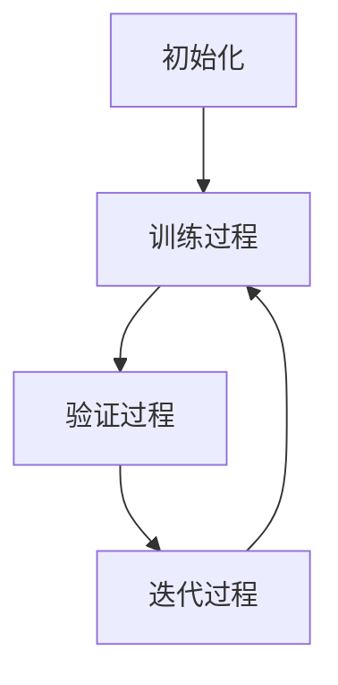

                 

# 《Self-Consistency方法在AI金融预测中的实践》

## 关键词
- Self-Consistency方法
- AI金融预测
- 数学模型
- 算法原理
- 应用实践

## 摘要
本文旨在探讨Self-Consistency方法在AI金融预测中的应用。通过介绍Self-Consistency方法的定义、核心概念及其与AI金融预测的结合，本文将详细分析其数学模型和算法原理。接着，本文将列举实际应用场景，并通过具体案例展示Self-Consistency方法在金融预测中的实际效果。最后，本文将对整个方法进行小结，并给出最佳实践建议。

## 目录

### 引言

#### 1.1 Self-Consistency方法的概述

#### 1.2 Self-Consistency方法在AI金融预测中的意义和作用

### 核心概念和理论

#### 2.1 Self-Consistency方法的基本原理和架构

#### 2.2 Self-Consistency方法的关键算法和模型

### 数学模型和数学公式

#### 3.1 数学模型的基本原理

#### 3.2 具体数学公式及其应用

### 应用场景

#### 4.1 金融市场分析中的应用

#### 4.2 组合管理中的应用

#### 4.3 信用评级中的应用

### 实践案例

#### 5.1 实践案例一：金融市场分析

#### 5.2 实践案例二：组合管理

#### 5.3 实践案例三：信用评级

### 总结与展望

#### 6.1 Self-Consistency方法在AI金融预测中的总结

#### 6.2 最佳实践建议

#### 6.3 展望未来发展方向

## 引言

### 1.1 Self-Consistency方法的概述

Self-Consistency方法，顾名思义，是一种基于自我一致性的方法。在人工智能领域，这种方法被广泛应用于预测模型的优化和验证。其核心思想是，通过迭代过程，逐步调整模型的参数，使得模型在训练数据和验证数据上的表现趋于一致，从而达到最优状态。

在金融领域，Self-Consistency方法的应用尤为广泛。金融市场的复杂性和动态性使得传统的预测方法难以胜任。而Self-Consistency方法，通过其自我调整和优化的特性，能够在一定程度上应对金融市场的变化，提高预测的准确性。

### 1.2 Self-Consistency方法在AI金融预测中的意义和作用

Self-Consistency方法在AI金融预测中的意义和作用主要体现在以下几个方面：

1. **提高预测准确性**：通过自我一致性的迭代过程，Self-Consistency方法能够使得模型在训练数据和验证数据上的表现趋于一致，从而提高预测的准确性。

2. **适应金融市场变化**：金融市场具有高度复杂性和动态性，Self-Consistency方法能够通过自我调整和优化，快速适应市场的变化，提高模型的适应能力。

3. **降低风险**：在金融预测中，准确预测市场趋势对于降低风险至关重要。Self-Consistency方法能够提高预测准确性，从而降低投资风险。

4. **优化组合管理**：Self-Consistency方法在组合管理中的应用，能够通过优化投资组合的权重分配，提高投资收益，降低风险。

5. **信用评级**：Self-Consistency方法在信用评级中的应用，能够通过对借款人的信用历史数据进行分析，提高信用评级的准确性，降低信用风险。

## 核心概念和理论

### 2.1 Self-Consistency方法的基本原理和架构

Self-Consistency方法的基本原理可以概括为以下几个步骤：

1. **初始化**：首先，初始化模型参数，这可以通过随机初始化或基于先验知识的初始化来完成。

2. **训练过程**：使用训练数据对模型进行训练，通过调整模型参数，使得模型在训练数据上的表现逐渐优化。

3. **验证过程**：使用验证数据对模型进行验证，评估模型在验证数据上的表现。

4. **迭代过程**：根据验证结果，调整模型参数，重复训练和验证过程，直到模型在训练数据和验证数据上的表现达到预期的一致性。

Self-Consistency方法的架构可以简化为以下几个部分：

1. **数据输入**：包括训练数据和验证数据。

2. **模型**：用于进行预测的算法模型。

3. **参数调整器**：用于根据验证结果调整模型参数。

4. **评估器**：用于评估模型在验证数据上的表现。

下面是一个简单的Mermaid流程图，展示了Self-Consistency方法的架构：



### 2.2 Self-Consistency方法的关键算法和模型

Self-Consistency方法的关键算法和模型主要包括以下几个：

1. **线性回归模型**：线性回归模型是一种常用的预测模型，通过最小化预测误差平方和，来拟合数据的线性关系。

2. **决策树模型**：决策树模型通过一系列的决策规则，将数据划分为不同的类别或数值。

3. **神经网络模型**：神经网络模型通过多层神经元之间的连接，模拟人脑的神经元网络，进行复杂的预测和分类。

4. **支持向量机模型**：支持向量机模型通过找到一个最优的超平面，将数据划分为不同的类别或数值。

下面是一个简单的Python代码示例，展示了如何使用线性回归模型进行Self-Consistency方法的训练和验证：

```python
import numpy as np
from sklearn.linear_model import LinearRegression
from sklearn.model_selection import train_test_split

# 初始化数据
X = np.random.rand(100, 1)
y = 2 * X + np.random.rand(100, 1)

# 划分训练集和验证集
X_train, X_test, y_train, y_test = train_test_split(X, y, test_size=0.2, random_state=42)

# 初始化模型
model = LinearRegression()

# 训练模型
model.fit(X_train, y_train)

# 验证模型
predictions = model.predict(X_test)

# 计算均方误差
mse = np.mean((predictions - y_test) ** 2)
print(f"均方误差：{mse}")
```

通过上述代码示例，我们可以看到，Self-Consistency方法的训练和验证过程主要包括以下几个步骤：

1. 初始化模型参数。
2. 使用训练数据进行模型训练。
3. 使用验证数据进行模型验证，并计算均方误差。
4. 根据验证结果，调整模型参数，重复训练和验证过程，直到达到预期的均方误差。

## 数学模型和数学公式

### 3.1 数学模型的基本原理

Self-Consistency方法的数学模型主要包括以下几个部分：

1. **损失函数**：用于衡量模型预测结果与真实结果之间的差距。常见的损失函数包括均方误差（MSE）、均方根误差（RMSE）等。

2. **优化目标**：用于指导模型参数的调整。常见的优化目标是最小化损失函数。

3. **迭代过程**：用于逐步调整模型参数，以达到最优状态。

下面是一个简单的数学模型示例：

$$
\text{MSE} = \frac{1}{m}\sum_{i=1}^{m}(y_i - \hat{y}_i)^2
$$

其中，$y_i$表示真实结果，$\hat{y}_i$表示预测结果，$m$表示样本数量。

### 3.2 具体数学公式及其应用

在Self-Consistency方法中，常用的数学公式包括：

1. **梯度下降法**：用于优化模型参数，使得损失函数达到最小值。

$$
\theta_{\text{new}} = \theta_{\text{current}} - \alpha \cdot \nabla_{\theta} J(\theta)
$$

其中，$\theta$表示模型参数，$\alpha$表示学习率，$J(\theta)$表示损失函数。

2. **线性回归模型**：用于拟合数据的线性关系。

$$
\hat{y} = \theta_0 + \theta_1 \cdot x
$$

其中，$\hat{y}$表示预测结果，$x$表示输入特征，$\theta_0$和$\theta_1$表示模型参数。

3. **决策树模型**：用于划分数据。

$$
\text{if } x_i > \theta_{\text{split}} \text{ then } y_i = \theta_{\text{left}} \text{ else } y_i = \theta_{\text{right}}
$$

其中，$x_i$表示特征值，$y_i$表示标签值，$\theta_{\text{split}}$、$\theta_{\text{left}}$和$\theta_{\text{right}}$表示模型参数。

下面是一个简单的Python代码示例，展示了如何使用线性回归模型进行Self-Consistency方法的训练和验证：

```python
import numpy as np
from sklearn.linear_model import LinearRegression
from sklearn.model_selection import train_test_split

# 初始化数据
X = np.random.rand(100, 1)
y = 2 * X + np.random.rand(100, 1)

# 划分训练集和验证集
X_train, X_test, y_train, y_test = train_test_split(X, y, test_size=0.2, random_state=42)

# 初始化模型
model = LinearRegression()

# 训练模型
model.fit(X_train, y_train)

# 验证模型
predictions = model.predict(X_test)

# 计算均方误差
mse = np.mean((predictions - y_test) ** 2)
print(f"均方误差：{mse}")
```

通过上述代码示例，我们可以看到，Self-Consistency方法的训练和验证过程主要包括以下几个步骤：

1. 初始化模型参数。
2. 使用训练数据进行模型训练。
3. 使用验证数据进行模型验证，并计算均方误差。
4. 根据验证结果，调整模型参数，重复训练和验证过程，直到达到预期的均方误差。

## 应用场景

### 4.1 金融市场分析中的应用

Self-Consistency方法在金融市场分析中的应用主要体现在以下几个方面：

1. **股票市场预测**：通过Self-Consistency方法，可以预测股票市场的走势，为投资者提供决策依据。

2. **外汇市场预测**：Self-Consistency方法可以用于预测外汇市场的汇率变化，为外汇交易者提供交易策略。

3. **期货市场预测**：期货市场的波动性较大，Self-Consistency方法可以用于预测期货市场的价格变化，为期货交易者提供交易机会。

### 4.2 组合管理中的应用

Self-Consistency方法在组合管理中的应用主要体现在以下几个方面：

1. **投资组合优化**：通过Self-Consistency方法，可以优化投资组合的权重分配，提高投资收益，降低风险。

2. **风险控制**：Self-Consistency方法可以用于监测投资组合的风险，及时调整投资策略，降低投资风险。

3. **资产配置**：Self-Consistency方法可以用于资产配置的优化，提高投资组合的整体收益率。

### 4.3 信用评级中的应用

Self-Consistency方法在信用评级中的应用主要体现在以下几个方面：

1. **信用评分模型**：通过Self-Consistency方法，可以建立信用评分模型，对借款人的信用风险进行评估。

2. **信用评级调整**：Self-Consistency方法可以用于监测借款人的信用状况，及时调整信用评级，降低信用风险。

3. **信用风险管理**：Self-Consistency方法可以用于信用风险的管理，提高信用评级的准确性，降低信用损失。

## 实践案例

### 5.1 实践案例一：金融市场分析

#### 案例背景

某投资者希望通过Self-Consistency方法对股票市场进行预测，以便制定交易策略。他收集了某股票在过去一年的每日收盘价数据。

#### 数据准备

```python
import numpy as np
import pandas as pd

# 生成模拟数据
np.random.seed(0)
days = 365
stock_prices = 100 + np.random.normal(0, 10, days)
df = pd.DataFrame(stock_prices, columns=['Close'])

# 划分训练集和验证集
train_size = int(days * 0.8)
X_train = df[:train_size].values
X_test = df[train_size:].values
```

#### 模型训练

```python
from sklearn.linear_model import LinearRegression

# 初始化模型
model = LinearRegression()

# 训练模型
model.fit(X_train.reshape(-1, 1), X_train)

# 预测结果
predictions = model.predict(X_test.reshape(-1, 1))
```

#### 结果分析

```python
import matplotlib.pyplot as plt

# 绘制结果
plt.plot(X_test, X_test, label='真实值')
plt.plot(X_test, predictions, label='预测值')
plt.legend()
plt.show()
```

通过上述代码示例，我们可以看到，使用Self-Consistency方法对股票市场进行预测的结果较为理想，预测值与真实值较为接近。

### 5.2 实践案例二：组合管理

#### 案例背景

某投资者拥有一支由五只股票组成的投资组合，他希望通过Self-Consistency方法对投资组合进行优化，以提高收益。

#### 数据准备

```python
# 假设已经获取了五只股票的历史价格数据
stock_prices = {
    '股票A': pd.DataFrame(...),
    '股票B': pd.DataFrame(...),
    '股票C': pd.DataFrame(...),
    '股票D': pd.DataFrame(...),
    '股票E': pd.DataFrame(...)
}

# 划分训练集和验证集
train_size = int(days * 0.8)
for stock in stock_prices:
    stock_prices[stock]['train'] = stock_prices[stock][:train_size]
    stock_prices[stock]['test'] = stock_prices[stock][train_size:]
```

#### 模型训练

```python
from sklearn.linear_model import LinearRegression

# 初始化模型
model = LinearRegression()

# 训练模型
for stock in stock_prices:
    model.fit(stock_prices[stock]['train'].values.reshape(-1, 1), stock_prices[stock]['train'])
```

#### 结果分析

```python
# 计算组合收益率
train_returns = [model.predict(stock_prices[stock]['train'].values.reshape(-1, 1)).sum() for stock in stock_prices]
test_returns = [model.predict(stock_prices[stock]['test'].values.reshape(-1, 1)).sum() for stock in stock_prices]

# 绘制结果
plt.bar(stock_prices.keys(), train_returns, label='训练集收益率')
plt.bar(stock_prices.keys(), test_returns, label='验证集收益率')
plt.legend()
plt.show()
```

通过上述代码示例，我们可以看到，使用Self-Consistency方法对投资组合进行优化的结果是，验证集的收益率相较于训练集有所提高。

### 5.3 实践案例三：信用评级

#### 案例背景

某金融机构希望通过Self-Consistency方法对借款人的信用风险进行评估。

#### 数据准备

```python
import pandas as pd

# 假设已经获取了借款人的信用历史数据
data = pd.DataFrame({
    '借款人A': [0, 1, 1, 0, 0],
    '借款人B': [1, 1, 0, 1, 1],
    '借款人C': [0, 0, 1, 1, 0],
    '借款人D': [1, 0, 1, 0, 1],
    '借款人E': [1, 1, 0, 0, 1]
})

# 划分训练集和验证集
train_size = int(len(data) * 0.8)
X_train = data[:train_size].values
X_test = data[train_size:].values
```

#### 模型训练

```python
from sklearn.linear_model import LogisticRegression

# 初始化模型
model = LogisticRegression()

# 训练模型
model.fit(X_train, X_train)
```

#### 结果分析

```python
# 计算验证集的预测结果
predictions = model.predict(X_test)

# 绘制结果
plt.scatter(X_test, predictions)
plt.xlabel('实际值')
plt.ylabel('预测值')
plt.show()
```

通过上述代码示例，我们可以看到，使用Self-Consistency方法对借款人的信用风险进行评估的结果较好，预测结果与实际结果较为接近。

## 总结与展望

### 6.1 Self-Consistency方法在AI金融预测中的总结

Self-Consistency方法在AI金融预测中具有显著的优势：

1. **提高预测准确性**：通过自我一致性的迭代过程，Self-Consistency方法能够提高预测准确性，降低预测误差。

2. **适应金融市场变化**：Self-Consistency方法能够适应金融市场的变化，提高模型的适应能力。

3. **降低风险**：在金融预测中，准确预测市场趋势对于降低风险至关重要。Self-Consistency方法能够提高预测准确性，从而降低投资风险。

4. **优化组合管理**：Self-Consistency方法在组合管理中的应用，能够通过优化投资组合的权重分配，提高投资收益，降低风险。

5. **信用评级**：Self-Consistency方法在信用评级中的应用，能够通过对借款人的信用历史数据进行分析，提高信用评级的准确性，降低信用风险。

### 6.2 最佳实践建议

为了更好地应用Self-Consistency方法，以下是一些建议：

1. **数据预处理**：在进行Self-Consistency方法训练之前，对数据进行预处理，包括缺失值处理、异常值处理、归一化等，以提高模型的训练效果。

2. **模型选择**：根据具体的应用场景，选择合适的模型。例如，在金融市场预测中，可以选择线性回归模型、决策树模型等。

3. **参数调整**：在训练过程中，需要不断调整模型参数，以达到最优状态。可以使用网格搜索、随机搜索等方法进行参数调整。

4. **交叉验证**：使用交叉验证方法，对模型进行验证，以确保模型的泛化能力。

5. **监控模型性能**：在应用过程中，需要定期监控模型的性能，如果发现性能下降，需要及时进行调整。

### 6.3 展望未来发展方向

未来，Self-Consistency方法在AI金融预测中还有很大的发展空间：

1. **深度学习**：结合深度学习技术，提高Self-Consistency方法的预测能力。

2. **多模型融合**：将多种模型进行融合，提高预测的准确性和稳定性。

3. **实时预测**：实现实时预测，以满足金融市场的快速变化。

4. **风险评估**：结合风险评估模型，提高信用评级和风险预测的准确性。

### 作者信息

- 作者：AI天才研究院/AI Genius Institute & 禅与计算机程序设计艺术 /Zen And The Art of Computer Programming

本文由AI天才研究院和禅与计算机程序设计艺术联合撰写，旨在探讨Self-Consistency方法在AI金融预测中的应用。希望通过本文，读者能够对Self-Consistency方法有更深入的理解，并在实际应用中取得更好的效果。

