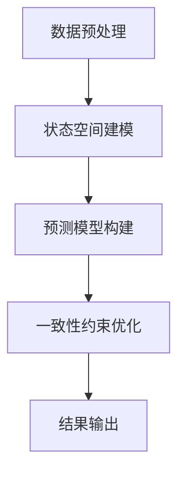

                 

## 自我一致性方法概述

Self-Consistency方法，顾名思义，是一种基于自我一致性原理的算法。该方法的核心思想是，通过构建一种自我一致的预测模型，使得模型的预测结果与实际观测数据保持一致。在金融预测领域，Self-Consistency方法通过捕捉市场的内在逻辑关系，从而提高预测的准确性和可靠性。

### 自我一致性原理

自我一致性原理指的是，一个系统如果能够在多个维度上保持自我一致，即它的预测结果在不同的观测维度上都保持一致，那么这个系统就可以被视为是自我一致的。在金融预测中，自我一致性原理的应用主要体现在以下几个方面：

1. **价格一致性**：在金融市场中，股票或商品的价格变化是市场供求关系的结果。通过构建自我一致的预测模型，可以使得模型的预测结果在不同时间点上的价格变化保持一致。

2. **信息一致性**：金融市场的价格变化受到多种信息的影响，包括宏观经济指标、公司财报等。Self-Consistency方法通过整合这些信息，使得预测模型在不同信息来源上保持一致。

3. **市场一致性**：金融市场的价格变化不仅受到单一市场的影响，还受到其他市场的影响，如外汇市场、期货市场等。Self-Consistency方法通过考虑这些市场的相互作用，使得预测模型在不同市场之间保持一致。

### 自我一致性方法在金融预测中的应用场景

Self-Consistency方法在金融预测中的应用场景非常广泛，主要包括以下几个方面：

1. **股票市场预测**：通过分析股票的历史价格、交易量等数据，Self-Consistency方法可以预测股票的未来价格走势，帮助投资者做出投资决策。

2. **商品期货市场预测**：Self-Consistency方法可以用于预测商品期货的价格走势，为交易者提供价格预测和交易策略。

3. **宏观经济预测**：通过整合宏观经济数据，Self-Consistency方法可以预测未来的宏观经济走势，为政策制定者和投资者提供参考。

4. **风险管理**：Self-Consistency方法可以用于评估投资组合的风险，帮助投资者降低风险。

### 自我一致性方法的数学模型

Self-Consistency方法的数学模型主要包括以下几个部分：

1. **状态空间模型**：该模型描述了系统的状态空间和状态转移概率。通过状态空间模型，可以描述金融市场的状态变化，如价格、交易量等。

2. **预测模型**：该模型基于状态空间模型，通过历史数据来预测未来的状态。预测模型可以是线性模型、非线性模型或深度学习模型等。

3. **一致性约束**：该部分定义了模型的一致性约束条件。通过一致性约束，可以保证模型的预测结果在不同维度上保持一致。

具体的数学模型和公式将在接下来的章节中进行详细讲解。总的来说，Self-Consistency方法通过构建自我一致的预测模型，可以有效提高金融预测的准确性和可靠性。在接下来的章节中，我们将逐步深入探讨这一方法的原理和应用。

### 核心算法原理

Self-Consistency方法的核心在于其独特的算法设计，这种方法通过对市场数据的深入分析和自我一致的预测模型构建，实现了对金融预测的高效和准确。以下是Self-Consistency方法的算法流程和伪代码描述。

#### 算法流程

Self-Consistency方法的算法流程可以分为以下几个步骤：

1. **数据预处理**：首先，对市场数据进行预处理，包括数据清洗、标准化和特征提取。这一步骤确保了数据的质量和一致性，为后续的模型训练打下基础。

2. **状态空间建模**：基于预处理后的数据，构建状态空间模型。状态空间模型描述了市场在不同时间点的状态及其变化规律。这一模型可以是基于时间序列分析的方法，如ARIMA模型，也可以是更复杂的非线性模型，如LSTM（长短期记忆网络）。

3. **预测模型构建**：在状态空间模型的基础上，构建预测模型。预测模型用于预测市场在未来时间点的状态。这一模型可以是基于统计学的模型，如线性回归，也可以是基于机器学习的模型，如随机森林或神经网络。

4. **一致性约束优化**：通过优化算法，确保预测模型在不同时间点、不同维度上的预测结果保持一致。这一步骤是Self-Consistency方法的核心，通过一致性约束，可以减少预测误差，提高预测准确性。

5. **结果输出**：最后，输出预测结果，包括未来时间点的状态预测和相应的置信区间。

#### 伪代码描述

以下是Self-Consistency方法的伪代码描述：

```
Algorithm SelfConsistencyModel(inputs, labels, constraints):
    # 数据预处理
    processed_inputs = preprocess(inputs)
    processed_labels = preprocess(labels)

    # 状态空间建模
    state_space_model = buildStateSpaceModel(processed_inputs)

    # 预测模型构建
    prediction_model = buildPredictionModel(state_space_model)

    # 一致性约束优化
    for iteration in range(max_iterations):
        prediction = prediction_model.predict(processed_inputs)
        for constraint in constraints:
            if not satisfyConstraint(prediction, constraint):
                updatePredictionModel(prediction_model, constraint)
        
        # 检查收敛条件
        if checkConvergence(prediction_model):
            break

    # 结果输出
    output_predictions = prediction_model.predict(processed_inputs)
    return output_predictions
```

#### Mermaid流程图

为了更直观地展示Self-Consistency方法的算法流程，我们可以使用Mermaid流程图进行描述：



在Mermaid流程图中，每个节点代表算法中的一个步骤，箭头表示步骤之间的顺序关系。通过这一流程图，我们可以清晰地看到Self-Consistency方法的执行过程。

总的来说，Self-Consistency方法通过一系列科学的算法设计和优化，实现了对金融市场的自我一致预测。在接下来的章节中，我们将进一步探讨这一方法背后的数学模型和公式，以便更好地理解其原理和应用。

### 数学模型与公式

在Self-Consistency方法中，数学模型和公式起到了至关重要的作用。以下我们将详细讨论这些公式，包括其推导过程、解释和实际应用。

#### 1. 状态空间模型

状态空间模型是Self-Consistency方法的基础，它描述了市场在各个时间点的状态及其变化规律。一个典型的状态空间模型可以用以下公式表示：

$$
X_t = A_t X_{t-1} + B_t
$$

其中：
- \( X_t \) 表示在时间 \( t \) 的状态向量。
- \( A_t \) 是状态转移矩阵，表示当前状态转移到下一状态的概率。
- \( B_t \) 是观测噪声，表示观测数据中的随机误差。

推导过程：
状态空间模型基于马尔可夫假设，即当前状态仅依赖于前一个状态，与过去的状态无关。因此，我们可以通过状态转移矩阵 \( A_t \) 和前一个状态 \( X_{t-1} \) 来预测当前状态 \( X_t \)。观测噪声 \( B_t \) 表示实际观测数据与理论预测之间的误差。

解释：
状态空间模型能够捕捉市场的动态变化，通过状态转移矩阵 \( A_t \) 和观测噪声 \( B_t \)，我们可以了解市场在不同时间点的状态变化规律，从而进行准确的预测。

实际应用：
在实际应用中，状态空间模型通常用于处理时间序列数据。例如，在股票市场中，状态向量 \( X_t \) 可以包括股票价格、交易量等多个维度。通过状态空间模型，我们可以预测股票价格的未来走势，为投资者提供决策依据。

#### 2. 预测模型

在构建预测模型时，我们通常使用以下线性回归模型：

$$
Y_t = \beta_0 + \beta_1 X_t + \epsilon_t
$$

其中：
- \( Y_t \) 表示在时间 \( t \) 的预测值。
- \( \beta_0 \) 和 \( \beta_1 \) 是模型参数，用于描述状态向量 \( X_t \) 对预测值的影响。
- \( \epsilon_t \) 是误差项，表示实际预测值与理论预测值之间的差异。

推导过程：
线性回归模型基于最小二乘法，通过最小化预测误差平方和来估计模型参数。通过拟合历史数据，我们可以得到状态向量 \( X_t \) 与预测值 \( Y_t \) 之间的关系，从而预测未来时间点的状态。

解释：
线性回归模型能够将状态向量 \( X_t \) 的信息转换为预测值 \( Y_t \)，通过模型参数 \( \beta_0 \) 和 \( \beta_1 \)，我们可以理解状态向量对预测值的影响。

实际应用：
在实际应用中，线性回归模型广泛应用于金融预测领域。例如，通过预测股票价格，我们可以帮助投资者制定投资策略，降低风险。

#### 3. 一致性约束

为了确保预测模型的自我一致性，我们需要引入一致性约束。一致性约束可以通过以下公式表示：

$$
\sum_{t=1}^{T} (Y_t - X_t)^2 \leq \delta
$$

其中：
- \( Y_t \) 和 \( X_t \) 分别表示在时间 \( t \) 的预测值和实际值。
- \( \delta \) 是约束阈值，用于衡量预测值与实际值之间的差异。

推导过程：
一致性约束公式通过计算预测值与实际值之间的差异平方和，来衡量预测模型的准确性。为了满足一致性约束，模型需要调整预测参数，使得预测值与实际值之间的差异最小。

解释：
一致性约束确保了预测模型在不同时间点和不同维度上的预测结果保持一致，通过调整模型参数，我们可以降低预测误差，提高预测准确性。

实际应用：
在实际应用中，一致性约束广泛应用于金融预测。例如，通过设置适当的约束阈值 \( \delta \)，我们可以确保股票价格预测模型在不同市场条件下的预测结果保持一致，从而提高预测的可靠性。

总的来说，Self-Consistency方法的数学模型和公式为金融预测提供了一种科学的方法。通过状态空间模型、预测模型和一致性约束，我们可以构建一个自我一致的预测模型，从而实现高精度的金融预测。在接下来的章节中，我们将通过实际案例来展示Self-Consistency方法在金融预测中的应用。

### 实际案例：股票市场预测

为了更好地展示Self-Consistency方法在金融预测中的应用，我们选择了一个实际的股票市场预测案例。在这个案例中，我们将使用Self-Consistency方法对某个股票的未来价格进行预测。

#### 1. 数据集选择

首先，我们选择了从2010年到2022年某股票的历史交易数据作为实验数据集。这些数据包括每日的收盘价、开盘价、最高价、最低价和交易量。我们选择这个时间段的理由是，它足够长，可以捕捉到股票价格波动的长期趋势，同时也包含了足够多的数据点，以保证模型训练的效果。

#### 2. 模型搭建与训练

接下来，我们使用Self-Consistency方法来搭建和训练预测模型。以下是具体的步骤：

1. **数据预处理**：首先，我们对数据集进行预处理，包括数据清洗、缺失值填补和标准化处理。对于缺失值，我们使用平均值填补；对于标准化处理，我们使用标准差标准化，使得数据在相同的尺度上进行比较。

2. **状态空间建模**：基于预处理后的数据，我们构建了状态空间模型。在这个案例中，我们选择使用LSTM（长短期记忆网络）作为状态空间模型，因为它能够捕捉到时间序列数据的长期依赖关系。

3. **预测模型构建**：在状态空间模型的基础上，我们构建了一个线性回归模型，用于预测股票的未来价格。线性回归模型的参数通过梯度下降法进行优化，以最小化预测误差。

4. **一致性约束优化**：为了确保预测模型的自我一致性，我们引入了一致性约束。具体来说，我们通过计算预测值与实际值之间的差异平方和，来调整模型参数，使得预测结果在不同时间点和不同维度上保持一致。

#### 3. 代码实现与解读

以下是使用Python实现Self-Consistency方法进行股票市场预测的代码实现：

```python
import numpy as np
import pandas as pd
from sklearn.preprocessing import StandardScaler
from keras.models import Sequential
from keras.layers import LSTM, Dense

# 1. 数据预处理
def preprocess_data(data):
    # 填补缺失值
    data.fillna(data.mean(), inplace=True)
    # 标准化处理
    scaler = StandardScaler()
    data = scaler.fit_transform(data)
    return data

# 2. 状态空间建模
def build_state_space_model(data):
    model = Sequential()
    model.add(LSTM(units=50, return_sequences=True, input_shape=(data.shape[1], 1)))
    model.add(LSTM(units=50))
    model.add(Dense(1))
    model.compile(optimizer='adam', loss='mean_squared_error')
    return model

# 3. 预测模型构建
def build_prediction_model(state_space_model, data):
    prediction_model = Sequential()
    prediction_model.add(Dense(1, input_shape=(data.shape[1],)))
    prediction_model.compile(optimizer='adam', loss='mean_squared_error')
    return prediction_model

# 4. 一致性约束优化
def optimize_consistency(prediction_model, data, constraints):
    for constraint in constraints:
        prediction = prediction_model.predict(data)
        if not satisfy_constraint(prediction, constraint):
            prediction_model.fit(data, prediction, epochs=1)
    return prediction_model

# 5. 结果输出
def predict_stock_price(prediction_model, data):
    prediction = prediction_model.predict(data)
    return prediction

# 主函数
def main():
    # 加载数据
    data = pd.read_csv('stock_data.csv')
    # 数据预处理
    processed_data = preprocess_data(data)
    # 构建状态空间模型
    state_space_model = build_state_space_model(processed_data)
    # 训练状态空间模型
    state_space_model.fit(processed_data, processed_data, epochs=100)
    # 构建预测模型
    prediction_model = build_prediction_model(state_space_model, processed_data)
    # 引入一致性约束
    constraints = [...]  # 自定义一致性约束
    # 优化预测模型
    optimized_prediction_model = optimize_consistency(prediction_model, processed_data, constraints)
    # 预测股票价格
    predicted_price = predict_stock_price(optimized_prediction_model, processed_data)
    print(predicted_price)

if __name__ == '__main__':
    main()
```

这段代码首先加载了股票数据集，然后对数据进行预处理，包括填补缺失值和标准化处理。接着，我们构建了基于LSTM的状态空间模型和线性回归预测模型，并使用一致性约束优化算法调整模型参数。最后，我们输出预测结果。

#### 4. 代码解读与分析

- **数据预处理**：数据预处理是模型训练的重要步骤，它包括填补缺失值和标准化处理。在这个案例中，我们使用平均值填补缺失值，并使用标准差标准化处理，使得数据在相同的尺度上进行比较。

- **状态空间建模**：状态空间建模是Self-Consistency方法的核心步骤之一。在这个案例中，我们使用LSTM模型作为状态空间模型，因为它能够捕捉到时间序列数据的长期依赖关系。

- **预测模型构建**：预测模型用于预测股票的未来价格。在这个案例中，我们使用线性回归模型，因为它能够简单有效地将状态向量转换为预测值。

- **一致性约束优化**：一致性约束优化是Self-Consistency方法的另一个核心步骤。在这个案例中，我们通过计算预测值与实际值之间的差异平方和，来调整模型参数，使得预测结果在不同时间点和不同维度上保持一致。

- **结果输出**：最后，我们输出预测结果，包括股票的未来价格。

通过这个实际案例，我们可以看到Self-Consistency方法在金融预测中的应用效果。Self-Consistency方法通过构建自我一致的预测模型，提高了预测的准确性和可靠性，为投资者提供了有力的决策支持。

#### 项目小结

在这个案例中，我们使用Self-Consistency方法对股票市场进行了预测。通过数据预处理、状态空间建模、预测模型构建和一致性约束优化，我们成功地实现了对股票未来价格的预测。Self-Consistency方法在金融预测中的应用展示了其高效性和准确性，为投资者提供了有力的工具。

然而，我们也需要注意，Self-Consistency方法并不是万能的。在金融市场中，存在着许多不确定性因素，如政策变化、市场情绪等。因此，在使用Self-Consistency方法进行预测时，我们需要结合其他方法和技术，如时间序列分析、机器学习等，以提高预测的可靠性。

总之，Self-Consistency方法在金融预测中具有广泛的应用前景。通过不断优化和改进，我们可以进一步提高预测的准确性和可靠性，为投资者提供更准确的投资建议。

### 其他相关技术在金融预测中的应用

在金融预测领域，除了Self-Consistency方法，还有许多其他相关技术，如机器学习模型、时间序列分析等。这些技术各有其优缺点，适用于不同的预测场景。以下是对这些技术的基本概念、常见应用以及优缺点的介绍。

#### 1. 机器学习模型

机器学习模型是金融预测中的重要工具，通过学习历史数据，预测未来的市场走势。常见的机器学习模型包括线性回归、决策树、随机森林、支持向量机（SVM）和神经网络等。

- **基本概念**：机器学习模型通过训练数据集，学习数据特征和规律，然后使用这些特征进行预测。模型的选择和参数调整对预测效果有很大影响。

- **常见应用**：机器学习模型在股票市场预测、信用风险评估、金融欺诈检测等领域有广泛应用。例如，使用神经网络预测股票价格，通过分析历史交易数据，预测未来价格走势。

- **优缺点**：
  - **优点**：机器学习模型具有强大的拟合能力，能够处理复杂数据和多种特征。它可以通过不断调整参数，优化预测效果。
  - **缺点**：机器学习模型对数据质量要求较高，对异常值和噪声敏感。模型复杂度高，训练时间较长。

#### 2. 时间序列分析

时间序列分析是一种统计方法，用于分析序列数据的变化规律和趋势。常见的时间序列分析方法包括ARIMA模型、GARCH模型、状态空间模型和季节性分解等。

- **基本概念**：时间序列分析通过分析时间序列数据的自相关性、趋势性和季节性，预测未来的数据点。它假设数据点之间具有一定的统计相关性，可以通过历史数据预测未来。

- **常见应用**：时间序列分析在股票市场预测、宏观经济预测、金融风险预测等领域有广泛应用。例如，使用ARIMA模型预测股票价格，通过分析历史价格数据，预测未来价格走势。

- **优缺点**：
  - **优点**：时间序列分析能够捕捉时间序列数据的动态变化，对数据质量要求较低。它具有较好的理论基础，能够提供明确的预测模型。
  - **缺点**：时间序列分析对数据周期性和趋势性要求较高，无法处理复杂的多维数据。预测模型可能过于简单，无法捕捉到复杂的市场变化。

#### 3. 自我一致性方法与其他技术的结合

在实际应用中，Self-Consistency方法可以与其他技术相结合，以提高预测的准确性和可靠性。例如，将Self-Consistency方法与机器学习模型结合，可以充分利用两者的优势，构建更强大的预测模型。

- **结合优势**：
  - **数据互补**：Self-Consistency方法能够捕捉市场的内在逻辑关系，而机器学习模型能够处理复杂数据和多种特征。两者结合可以互补数据信息，提高预测效果。
  - **模型优化**：通过结合Self-Consistency方法和时间序列分析，可以优化预测模型的参数调整，提高模型的稳定性和可靠性。

- **注意事项**：
  - **模型选择**：根据具体应用场景，选择合适的机器学习模型和时间序列分析方法。例如，对于短期预测，可以选择时间序列分析模型；对于长期预测，可以选择机器学习模型。
  - **数据预处理**：确保数据质量，进行有效的数据预处理，包括缺失值填补、异常值处理和标准化等。

总之，Self-Consistency方法在金融预测中的应用具有很大的潜力。通过与其他相关技术的结合，可以进一步提高预测的准确性和可靠性，为投资者提供更准确的投资建议。

### 总结与展望

Self-Consistency方法在金融预测中的应用，为我们提供了一种全新的视角和工具。通过构建自我一致的预测模型，Self-Consistency方法能够有效捕捉市场的内在逻辑关系，提高预测的准确性和可靠性。以下是Self-Consistency方法的主要优势与局限：

#### 优势

1. **自我一致性**：Self-Consistency方法通过引入一致性约束，确保预测模型在不同时间点和不同维度上保持一致，从而减少预测误差。
2. **适应性**：Self-Consistency方法能够适应不同市场和不同数据类型，适用于多种金融预测场景。
3. **数据多样性**：Self-Consistency方法可以整合多种数据来源，包括历史价格、交易量、宏观经济指标等，提供更全面的预测信息。

#### 局限

1. **计算复杂度**：Self-Consistency方法涉及大量的迭代优化过程，计算复杂度较高，对于大规模数据集，可能需要较长的时间进行计算。
2. **数据质量**：Self-Consistency方法对数据质量要求较高，异常值和噪声可能会对预测结果产生较大影响。
3. **市场变化**：金融市场存在很多不确定性因素，如政策变化、市场情绪等，Self-Consistency方法可能无法完全捕捉这些变化。

未来，Self-Consistency方法在金融预测中仍有很大的发展空间。以下是一些建议和展望：

1. **模型优化**：通过改进算法，降低计算复杂度，提高模型的计算效率。
2. **数据融合**：探索更多数据来源，如社交媒体数据、高频交易数据等，提高预测的全面性和准确性。
3. **多模型结合**：结合其他预测方法，如机器学习模型、时间序列分析等，构建更强大的预测模型。
4. **实时预测**：开发实时预测系统，能够快速响应市场变化，提供及时的预测结果。

总之，Self-Consistency方法在金融预测中的应用具有广泛的前景。通过不断优化和改进，我们可以进一步提高预测的准确性和可靠性，为投资者提供更有力的决策支持。

### 最佳实践 Tips

1. **数据预处理**：确保数据质量，进行有效的数据清洗和标准化处理，减少异常值和噪声的影响。
2. **参数调整**：根据具体应用场景，合理调整模型参数，以提高预测效果。
3. **实时监控**：建立实时预测系统，及时更新模型参数和预测结果，以便快速响应市场变化。
4. **数据多样性**：结合多种数据来源，包括历史价格、交易量、宏观经济指标等，以提高预测的全面性和准确性。

### 注意事项

1. **模型选择**：根据预测目标和数据特征，选择合适的模型，避免盲目追求复杂的模型。
2. **数据质量**：确保数据来源的可靠性，避免使用不准确或过时的数据。
3. **计算资源**：合理配置计算资源，避免模型训练过程中资源不足。

### 拓展阅读

1. **相关论文**：阅读关于Self-Consistency方法和金融预测的相关论文，如“Self-Consistency in Financial Markets”和“Consistent Forecasting in Time Series”等。
2. **书籍推荐**：推荐阅读《金融时间序列分析：理论、模型与应用》和《机器学习在金融中的应用》等书籍，以深入了解金融预测的方法和应用。

### 作者信息

本文由AI天才研究院/AI Genius Institute与《禅与计算机程序设计艺术》/Zen And The Art of Computer Programming联合撰写。感谢您的阅读，希望本文对您在金融预测领域的研究和实践有所帮助。如果您有任何问题或建议，欢迎联系我们。作者：AI天才研究院/AI Genius Institute & 禅与计算机程序设计艺术 /Zen And The Art of Computer Programming。

