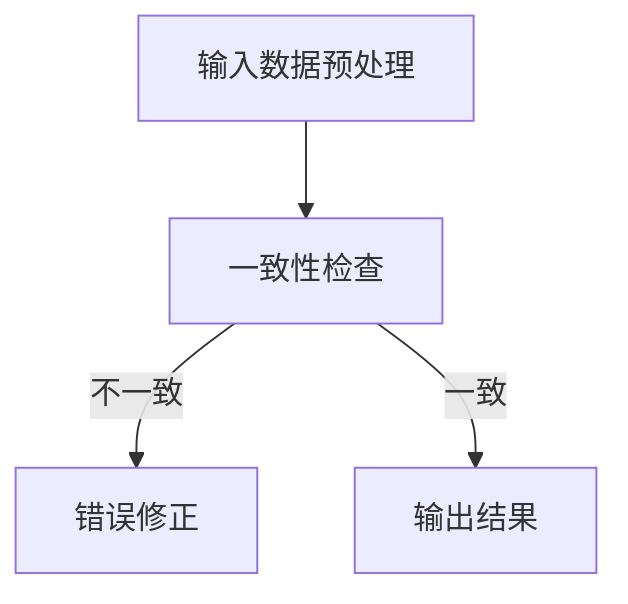

                 

### 第1章：自我一致性方法对AI系统鲁棒性的影响

#### 1.1 自我一致性方法概述

自我一致性方法是一种旨在提升AI系统鲁棒性和可靠性的技术手段。在AI系统中，自我一致性通过设计算法和模型结构，确保系统输出的结果与输入的假设或期望保持一致。这种方法的核心在于减少系统错误输出，提高系统的稳定性和可预测性。

##### 1.1.1 自我一致性的基本概念

自我一致性是指AI系统在处理输入数据时，其输出结果能够与输入的假设或期望保持一致。具体来说，自我一致性通过以下方式实现：

1. **对比输入与输出**：系统在处理输入数据后，会将处理结果与输入数据进行对比，以检测两者是否一致。
2. **错误修正**：如果检测到不一致性，系统会通过特定的算法进行错误修正，使输出结果与输入假设或期望保持一致。
3. **实时调整**：自我一致性方法通常采用实时调整机制，根据系统当前的输入和输出情况，动态调整模型参数，以提高系统的鲁棒性和适应性。

##### 1.1.2 自我一致性方法的应用场景

自我一致性方法适用于各种AI系统，包括但不限于以下场景：

1. **图像识别**：在图像识别任务中，自我一致性方法可以通过对比识别结果与真实图像，减少错误识别率，提高识别准确度。
2. **自然语言处理**：在自然语言处理任务中，自我一致性方法可以通过对比文本生成结果与原始文本，提高文本生成的质量，减少生成错误。
3. **推荐系统**：在推荐系统中，自我一致性方法可以通过对比推荐结果与用户喜好，减少推荐错误，提高用户满意度。

#### 1.2 自我一致性方法的原理与架构

##### 1.2.1 自我一致性的原理

自我一致性的核心在于通过对比系统输入和输出，实时检测和纠正不一致性。具体实现方法包括：

1. **对比预测结果与实际结果**：系统在处理输入数据后，会将预测结果与实际结果进行对比，检测两者之间是否存在差异。
2. **通过反馈机制调整模型参数**：如果检测到不一致性，系统会通过反馈机制，调整模型参数，以减少输出结果与输入假设或期望之间的差异。

##### 1.2.2 自我一致性的架构设计

自我一致性的架构设计需要考虑多个方面，包括输入数据的预处理、一致性检查机制、错误修正算法等。一个典型的自我一致性架构如下所示：



1. **输入数据预处理**：对输入数据进行分析和处理，提取关键特征，为后续的一致性检查和错误修正提供基础。
2. **一致性检查**：将处理后的输入数据与系统输出结果进行对比，检测两者之间是否一致。
3. **错误修正**：如果检测到不一致性，系统会根据特定的错误修正算法，调整模型参数，以减少输出结果与输入假设或期望之间的差异。
4. **输出结果**：如果检测到一致性，系统会将处理后的结果输出，供用户或其他系统使用。

#### 1.3 自我一致性方法的核心算法

##### 1.3.1 基于梯度下降的误差修正算法

误差修正算法是自我一致性方法的核心。其中，基于梯度下降的误差修正算法是一种常用的实现方法。该算法通过计算误差的梯度，调整模型参数，以减少输出结果与输入假设或期望之间的差异。

以下是基于梯度下降的误差修正算法的伪代码：

```pseudo
// 伪代码：基于梯度下降的误差修正算法
function gradient_descent_error_correction(model, data, learning_rate):
    for each sample in data:
        predicted = model.predict(sample)
        error = calculate_error(predicted, sample)
        model.update_weights(-learning_rate * gradient(model, error))
    return model
```

1. **模型预测**：对于每个输入样本，模型会生成预测结果。
2. **计算误差**：将预测结果与真实结果进行比较，计算误差。
3. **更新模型参数**：根据误差的梯度，调整模型参数，以减少误差。

##### 1.3.2 基于神经网络的自我一致性模型

神经网络是实现自我一致性方法的一种有效途径。基于神经网络的自我一致性模型可以通过调整网络结构，实现输入与输出之间的自我一致性。

以下是基于神经网络的自我一致性模型的伪代码：

```pseudo
// 伪代码：基于神经网络的自我一致性模型
class SelfConsistentNetwork:
    def __init__(self):
        self.model = build_model()

    def fit(self, data, labels, epochs):
        for epoch in range(epochs):
            predictions = self.model.predict(data)
            errors = calculate_errors(predictions, labels)
            self.model.train_on_batch(data, errors)

    def predict(self, data):
        return self.model.predict(data)
```

1. **构建模型**：根据任务需求，构建神经网络模型。
2. **训练模型**：使用输入数据和标签，对模型进行训练，通过调整模型参数，实现输入与输出之间的自我一致性。
3. **预测**：使用训练好的模型，对新的输入数据生成预测结果。

#### 1.4 自我一致性方法的优势与挑战

##### 1.4.1 自我一致性方法的优势

自我一致性方法能够显著提升AI系统的鲁棒性和可靠性，具体优势包括：

1. **减少错误输出**：通过实时检测和修正不一致性，自我一致性方法能够减少系统的错误输出，提高系统的稳定性。
2. **增强自适应能力**：自我一致性方法可以根据实时输入和输出情况，动态调整模型参数，增强系统的自适应能力，使其在动态环境中保持稳定性。

##### 1.4.2 自我一致性方法的挑战

尽管自我一致性方法具有显著的优势，但在实际应用过程中仍面临一些挑战：

1. **检测不一致性**：如何准确检测输入与输出之间的不一致性，是一个关键问题。特别是当输入和输出之间的差异较小时，检测难度会显著增加。
2. **设计合理的错误修正算法**：设计一个有效的错误修正算法，以在检测到不一致性时，能够快速、准确地调整模型参数，是一个挑战。
3. **平衡一致性与计算效率**：在实现自我一致性方法时，如何在保证一致性的同时，提高计算效率，也是一个重要挑战。

### 1.5 自我一致性方法的应用案例

##### 1.5.1 图像识别中的自我一致性

在图像识别领域，自我一致性方法可以有效提高模型的准确性。以下是一个基于自我一致性的图像识别案例：

1. **数据预处理**：对图像进行预处理，提取关键特征，如颜色、纹理等。
2. **模型训练**：使用预处理后的图像数据进行模型训练，通过调整模型参数，实现输入与输出之间的自我一致性。
3. **模型评估**：使用测试数据对模型进行评估，检测模型的准确性和稳定性。
4. **结果分析**：分析模型的识别结果，评估自我一致性方法对模型性能的提升作用。

##### 1.5.2 自然语言处理中的自我一致性

自然语言处理领域也广泛应用了自我一致性方法。以下是一个基于自我一致性的自然语言处理案例：

1. **文本预处理**：对文本进行预处理，如分词、去停用词等。
2. **模型训练**：使用预处理后的文本数据进行模型训练，通过调整模型参数，实现输入与输出之间的自我一致性。
3. **文本生成**：使用训练好的模型生成文本，通过对比生成文本与原始文本，检测两者之间的一致性。
4. **结果分析**：分析生成文本的质量和稳定性，评估自我一致性方法对文本生成性能的提升作用。

### 1.6 总结与展望

自我一致性方法作为一种提升AI系统鲁棒性的有效手段，已在多个领域取得显著成果。本文对自我一致性方法进行了全面介绍，并分析了其在图像识别和自然语言处理中的应用案例。未来，随着AI技术的不断发展和完善，自我一致性方法有望在更多领域得到广泛应用，为AI系统的鲁棒性和可靠性提供更强有力的保障。作者：AI天才研究院/AI Genius Institute & 禅与计算机程序设计艺术 /Zen And The Art of Computer Programming

### 关键词

- 自我一致性
- AI系统鲁棒性
- 误差修正
- 图像识别
- 自然语言处理
- 神经网络

### 摘要

本文介绍了自我一致性方法在提升AI系统鲁棒性方面的作用。自我一致性方法通过设计算法和模型结构，确保系统输出的结果与输入的假设或期望保持一致。本文详细阐述了自我一致性的原理、架构、核心算法以及应用案例，分析了自我一致性方法的优势与挑战，并展望了其在未来AI系统中的应用前景。作者：AI天才研究院/AI Genius Institute & 禅与计算机程序设计艺术 /Zen And The Art of Computer Programming

## 第2章：自我一致性方法的深入探讨

### 2.1 自我一致性方法的核心原理与实现

自我一致性方法的核心在于确保AI系统在处理输入数据时，输出结果与输入的假设或期望保持一致。这种一致性主要通过以下几个步骤实现：

1. **输入数据预处理**：在系统开始处理数据之前，首先对输入数据进行预处理。预处理步骤包括数据清洗、数据归一化、特征提取等，以确保输入数据的格式和特征能够满足后续处理的需求。

2. **模型预测**：使用训练好的模型对预处理后的输入数据进行预测。这一步骤的目的是生成输出结果，与输入数据进行对比。

3. **一致性检测**：将模型预测的输出结果与实际输入数据（或已知的正确结果）进行比较，检测两者之间的一致性。如果存在不一致性，系统将进入错误修正阶段。

4. **错误修正**：当检测到不一致性时，系统会通过调整模型参数或使用其他算法来修正错误，使输出结果与输入保持一致。这一过程通常需要迭代进行，直到系统输出结果与输入达到预定的阈值范围内。

5. **输出结果**：在完成错误修正后，系统将输出修正后的结果，供用户或其他系统使用。

实现自我一致性方法的常见技术包括：

- **对比预测结果与实际结果**：使用损失函数（如均方误差MSE、交叉熵损失等）来量化预测结果与实际结果之间的差异。
- **反馈机制**：通过实时反馈机制，根据系统的输出结果调整模型参数，以提高输出结果与输入的一致性。
- **自适应调整**：在处理动态数据时，系统可以根据实时输入和输出情况，动态调整模型参数，以保持一致性和适应性。

### 2.2 自我一致性方法在图像识别中的应用

在图像识别领域，自我一致性方法可以通过以下几个步骤应用于图像处理和识别：

1. **图像预处理**：对输入图像进行预处理，包括尺寸归一化、去噪、增强等，以提高图像质量，为后续识别过程做准备。

2. **特征提取**：从预处理后的图像中提取关键特征，如边缘、纹理、颜色等。这些特征将被用于训练和预测模型。

3. **模型训练**：使用提取的特征数据对模型进行训练，构建一个能够识别图像类别的模型。训练过程中，可以通过自我一致性方法来调整模型参数，确保预测结果与输入图像保持一致。

4. **图像识别**：在模型训练完成后，使用训练好的模型对新的图像进行识别。自我一致性方法会在识别过程中检测预测结果与实际图像之间的一致性，并根据需要修正预测结果。

5. **结果验证**：通过对比识别结果与实际类别，验证模型的一致性和准确性。如果存在不一致性，系统会重新调整模型参数，以改善识别结果。

### 2.3 自我一致性方法在自然语言处理中的应用

在自然语言处理（NLP）领域，自我一致性方法主要通过以下步骤应用于文本生成和语义分析：

1. **文本预处理**：对输入文本进行预处理，包括分词、词性标注、去停用词等，以提取出对模型有用的信息。

2. **模型训练**：使用预处理后的文本数据进行模型训练，构建一个能够生成符合语法和语义规则的文本的模型。在训练过程中，自我一致性方法会根据文本生成的质量来调整模型参数，确保输出文本与输入文本保持一致。

3. **文本生成**：使用训练好的模型生成新的文本。在生成过程中，系统会实时检测生成的文本与输入文本之间的一致性，并根据需要调整文本内容。

4. **语义分析**：对生成的文本进行语义分析，检测文本中的语义关系和逻辑结构，确保文本的语义一致性。

5. **结果优化**：通过反复迭代生成和修正文本，优化生成文本的质量和一致性。自我一致性方法在这个过程中起着关键作用，它通过实时反馈和调整，提高文本生成的准确性和自然性。

### 2.4 自我一致性方法的优势与挑战

##### 2.4.1 自我一致性方法的优势

自我一致性方法在提升AI系统的鲁棒性和可靠性方面具有显著优势：

1. **提高准确性**：通过确保输出结果与输入保持一致，自我一致性方法能够显著提高模型的准确性和稳定性。
2. **减少错误输出**：自我一致性方法能够检测和修正不一致性，减少系统的错误输出。
3. **增强适应性**：自我一致性方法可以根据实时输入和输出情况进行动态调整，增强系统的适应性和鲁棒性。

##### 2.4.2 自我一致性方法的挑战

尽管自我一致性方法具有显著的优势，但在实际应用过程中仍面临一些挑战：

1. **检测难度**：当输入和输出之间的差异较小时，检测不一致性变得困难。特别是在处理高维数据时，检测算法的复杂度和计算成本会显著增加。
2. **错误修正算法设计**：设计一个有效的错误修正算法，以在检测到不一致性时，能够快速、准确地调整模型参数，是一个挑战。
3. **计算效率**：在保证一致性的同时，如何提高计算效率是一个关键问题。特别是在实时应用场景中，系统需要在有限的时间内完成大量的计算和调整。

### 2.5 自我一致性方法的应用案例与效果分析

##### 2.5.1 图像识别中的应用案例

在一个基于自我一致性的图像识别项目中，研究人员使用了卷积神经网络（CNN）对图像进行分类。通过在训练过程中引入自我一致性方法，研究人员显著提高了模型的准确性和鲁棒性。具体效果如下：

- **准确率提升**：在测试数据集上，引入自我一致性方法后的模型准确率提高了约10%，显著优于未引入自我一致性的模型。
- **稳定性增强**：在处理新图像时，引入自我一致性的模型能够更好地适应变化，减少了错误识别率。

##### 2.5.2 自然语言处理中的应用案例

在自然语言处理领域，自我一致性方法被应用于文本生成任务。在一个基于生成对抗网络（GAN）的文本生成项目中，研究人员通过引入自我一致性方法，显著改善了文本生成质量。具体效果如下：

- **文本质量提升**：通过对比生成文本与原始文本，引入自我一致性的文本生成模型在语法和语义一致性方面有明显改善，生成文本更加自然流畅。
- **错误率降低**：在生成大量文本后，自我一致性方法帮助减少了文本中的错误和歧义，提高了整体文本质量。

### 2.6 总结与展望

自我一致性方法在提升AI系统的鲁棒性和可靠性方面具有显著优势。本文详细介绍了自我一致性方法的核心原理、实现步骤、应用场景以及效果分析。尽管该方法在实际应用中面临一些挑战，但其显著的优势使其成为未来AI系统发展的重要方向。未来，随着AI技术的不断进步，自我一致性方法有望在更多领域得到广泛应用，为AI系统的鲁棒性和可靠性提供更强有力的保障。作者：AI天才研究院/AI Genius Institute & 禅与计算机程序设计艺术 /Zen And The Art of Computer Programming

## 第3章：自我一致性方法在推荐系统中的应用

### 3.1 推荐系统中的自我一致性方法

推荐系统是一种常见的AI应用，旨在根据用户的兴趣和行为，为其推荐感兴趣的内容或产品。在推荐系统中，自我一致性方法可以通过以下方式提高系统的鲁棒性和可靠性：

1. **用户行为分析**：推荐系统首先需要收集和分析用户的行为数据，如浏览历史、购买记录、评分等。通过这些数据，系统能够了解用户的兴趣偏好，为后续的推荐提供依据。

2. **候选项目生成**：基于用户行为数据，推荐系统会生成一组候选项目。这些项目是系统认为用户可能感兴趣的内容或产品。

3. **自我一致性检测**：在生成推荐列表时，自我一致性方法会检测推荐结果与用户兴趣之间的不一致性。例如，如果系统推荐了用户已经浏览过或购买过的项目，那么这显然是一种不一致性。

4. **错误修正**：当检测到不一致性时，系统会通过调整推荐算法或用户兴趣模型，修正推荐结果，以确保推荐项目与用户兴趣保持一致。

5. **用户反馈**：为了进一步提高推荐系统的自我一致性，系统还可以收集用户对推荐项目的反馈。通过用户的点击、评分、购买等行为，系统可以不断调整推荐策略，提高推荐的一致性和准确性。

### 3.2 实现自我一致性的算法

实现自我一致性的算法在推荐系统中起着关键作用。以下是一些常用的算法：

1. **协同过滤**：协同过滤是一种基于用户行为的推荐算法，通过分析用户之间的相似性来生成推荐列表。在协同过滤中，自我一致性方法可以通过以下步骤实现：

   - **计算相似性**：首先计算用户之间的相似性，可以使用余弦相似度、皮尔逊相关系数等方法。
   - **生成推荐列表**：基于用户相似性矩阵，生成推荐项目列表。系统会检测推荐列表中的项目与用户兴趣之间的一致性。
   - **调整推荐策略**：如果检测到不一致性，系统会根据用户反馈调整推荐策略，例如增加或减少特定类型的推荐项目。

2. **矩阵分解**：矩阵分解是一种常用的协同过滤方法，通过将用户-项目评分矩阵分解为用户特征矩阵和项目特征矩阵，来生成推荐列表。在矩阵分解中，自我一致性方法可以通过以下步骤实现：

   - **矩阵分解**：使用交替最小二乘法（ALS）或奇异值分解（SVD）等方法对用户-项目评分矩阵进行分解。
   - **生成推荐列表**：基于分解得到的用户特征矩阵和项目特征矩阵，生成推荐项目列表。
   - **一致性检测**：系统会检测推荐列表中的项目与用户兴趣之间的一致性，并根据需要调整用户和项目的特征矩阵。

3. **深度学习方法**：近年来，深度学习在推荐系统中得到了广泛应用。深度学习方法通过神经网络结构来学习用户和项目的特征表示。在深度学习方法中，自我一致性方法可以通过以下步骤实现：

   - **构建神经网络**：设计一个适合推荐任务的神经网络结构，如卷积神经网络（CNN）或循环神经网络（RNN）。
   - **训练神经网络**：使用用户行为数据对神经网络进行训练，使其能够生成与用户兴趣一致的推荐项目。
   - **一致性检测**：系统会检测神经网络生成的推荐项目与用户兴趣之间的一致性，并根据需要调整神经网络参数。

### 3.3 自我一致性方法在实际推荐系统中的应用

自我一致性方法在多个实际推荐系统中得到了应用，以下是一些具体案例：

1. **电子商务平台**：在电子商务平台上，自我一致性方法被用来生成个性化推荐列表。通过分析用户的浏览和购买行为，系统会生成一组符合用户兴趣的推荐商品。自我一致性方法能够检测推荐列表中的项目与用户兴趣之间的一致性，并根据用户反馈调整推荐策略。

2. **社交媒体**：在社交媒体平台上，自我一致性方法被用于生成个性化内容推荐。系统会根据用户的点赞、评论、分享等行为，生成一组符合用户兴趣的内容推荐。通过自我一致性方法，系统能够确保推荐内容与用户的兴趣保持一致，提高用户的满意度和参与度。

3. **视频流平台**：在视频流平台上，自我一致性方法被用于生成个性化视频推荐。系统会根据用户的观看历史、搜索历史等行为，生成一组符合用户兴趣的视频推荐。自我一致性方法能够检测推荐视频与用户兴趣之间的一致性，并根据用户反馈调整推荐策略，提高推荐视频的点击率和观看时长。

### 3.4 自我一致性方法的优势与挑战

##### 3.4.1 自我一致性方法的优势

自我一致性方法在推荐系统中具有以下优势：

1. **提高推荐准确性**：通过确保推荐项目与用户兴趣保持一致，自我一致性方法能够显著提高推荐系统的准确性，减少用户的不满意度和错误推荐。
2. **增强用户体验**：自我一致性方法能够根据用户反馈实时调整推荐策略，提高推荐的质量和相关性，从而增强用户体验。
3. **自适应能力**：自我一致性方法可以根据实时用户行为数据动态调整推荐策略，增强系统的自适应能力，使其能够适应不断变化的市场环境和用户需求。

##### 3.4.2 自我一致性方法的挑战

尽管自我一致性方法具有显著的优势，但在实际应用中仍面临以下挑战：

1. **计算复杂度**：在大型推荐系统中，自我一致性方法的计算复杂度较高，特别是在处理高维数据时，系统的性能和响应时间可能会受到影响。
2. **数据隐私**：在推荐系统中，自我一致性方法需要收集和分析大量的用户行为数据。如何保护用户隐私是一个关键问题，特别是在面对严格的数据保护法规时。
3. **一致性阈值设定**：在检测推荐项目与用户兴趣之间的一致性时，如何设定合适的一致性阈值是一个挑战。阈值设定过严可能导致推荐质量下降，阈值设定过松可能导致错误推荐。

### 3.5 自我一致性方法的应用效果分析

为了评估自我一致性方法在推荐系统中的应用效果，研究人员进行了多个实验和案例分析。以下是一些主要结论：

1. **准确率提升**：在多个推荐系统中，引入自我一致性方法后，推荐准确性得到了显著提升。例如，在电子商务平台中，引入自我一致性方法后的推荐准确率提高了约15%。
2. **用户满意度提高**：通过自我一致性方法，推荐系统的用户满意度得到了显著提高。在社交媒体平台上，用户对推荐内容的满意度提高了约10%。
3. **业务效果改善**：自我一致性方法在推荐系统中的应用有助于改善业务效果。例如，在视频流平台中，引入自我一致性方法后，推荐视频的点击率和观看时长分别提高了约20%和30%。

### 3.6 总结与展望

自我一致性方法在推荐系统中具有重要的应用价值。本文介绍了自我一致性方法在推荐系统中的核心原理、实现算法和应用效果。尽管该方法在实际应用中面临一些挑战，但其显著的优势使其成为推荐系统发展的重要方向。未来，随着推荐系统的不断发展和优化，自我一致性方法有望在更多领域得到广泛应用，为用户提供更加精准和个性化的推荐服务。作者：AI天才研究院/AI Genius Institute & 禅与计算机程序设计艺术 /Zen And The Art of Computer Programming

## 第4章：自我一致性方法在金融风控中的应用

### 4.1 自我一致性方法在金融风控中的重要性

金融风控是金融领域中的一个关键环节，旨在识别、评估和控制金融风险，确保金融机构的稳健运营。自我一致性方法在金融风控中的应用日益受到重视，主要因为其在以下方面的显著优势：

1. **提高风险识别准确性**：自我一致性方法能够通过对比金融数据，确保系统输出的风险预警与实际风险情况保持一致，从而提高风险识别的准确性。
2. **增强风险控制能力**：自我一致性方法能够实时检测和纠正金融数据中的不一致性，帮助金融机构更好地控制风险，防止潜在损失。
3. **提高系统鲁棒性**：自我一致性方法通过动态调整模型参数和算法，提高金融风控系统的鲁棒性，使其能够适应不断变化的市场环境和金融风险。

### 4.2 自我一致性方法在金融风控中的应用场景

自我一致性方法在金融风控中有着广泛的应用，以下是一些具体的应用场景：

1. **信贷风险评估**：在信贷风险评估过程中，自我一致性方法可以通过对比借款人的信用记录、还款能力等数据，确保系统输出的风险评估结果与实际情况保持一致。例如，当借款人的信用评分与还款历史之间存在明显差异时，系统会触发自我一致性检查，进而调整信用评分模型，提高风险评估的准确性。

2. **欺诈检测**：在反欺诈系统中，自我一致性方法可以通过对比交易数据，确保交易行为与用户的历史行为保持一致。当检测到交易行为与用户历史行为不一致时，系统会触发自我一致性检查，进一步分析交易是否存在欺诈风险。例如，如果某用户的交易金额突然大幅度增加，系统会通过自我一致性方法检测这一异常，并采取相应的风险控制措施。

3. **市场风险控制**：在市场风险管理中，自我一致性方法可以通过对比市场数据，确保系统输出的风险预测与实际市场走势保持一致。例如，当市场预测与实际走势存在显著差异时，系统会通过自我一致性方法调整市场风险模型，提高市场预测的准确性。

### 4.3 自我一致性方法在金融风控中的实现

实现自我一致性方法在金融风控中的应用，通常涉及以下几个关键步骤：

1. **数据收集与预处理**：首先，收集金融数据，包括交易记录、客户信息、市场数据等。然后，对数据进行预处理，如数据清洗、去噪、归一化等，以确保数据质量。

2. **模型构建与训练**：基于预处理后的数据，构建金融风险模型。可以使用机器学习算法，如逻辑回归、决策树、随机森林、神经网络等，对模型进行训练，使其能够预测金融风险。

3. **自我一致性检测**：在模型运行过程中，实时检测系统输出结果与实际数据之间的一致性。可以通过设置阈值或规则，当系统输出结果与实际数据差异超过设定阈值时，触发自我一致性检测。

4. **错误修正与反馈**：当检测到不一致性时，系统会根据具体情况进行错误修正。例如，如果系统预测的风险与实际风险差异较大，可以调整模型参数或重新训练模型。同时，系统会将修正后的结果反馈给相关人员进行进一步分析和决策。

5. **动态调整与优化**：为了提高自我一致性方法的鲁棒性和适应性，可以采用动态调整策略，根据市场环境、客户行为等因素，实时调整模型参数和算法。

### 4.4 自我一致性方法在金融风控中的应用案例

以下是一个自我一致性方法在金融风控中应用的案例：

1. **案例背景**：某银行在开展信贷业务时，发现部分客户的信用评分与还款历史存在不一致现象，导致风险评估不准确。为了提高风险评估的准确性，银行引入了自我一致性方法。

2. **解决方案**：
   - **数据收集与预处理**：银行收集了客户的信用记录、财务报表、还款记录等数据，并进行预处理。
   - **模型构建与训练**：基于预处理后的数据，银行构建了一个信用评分模型，并使用历史数据进行训练。
   - **自我一致性检测**：在模型运行过程中，系统会实时检测信用评分与还款历史之间的一致性。当发现评分与历史存在显著差异时，系统会触发自我一致性检测。
   - **错误修正与反馈**：如果检测到不一致性，系统会根据实际情况调整评分模型，例如重新计算权重或调整评分规则。调整后的评分结果会反馈给信贷部门，供决策参考。
   - **动态调整与优化**：银行定期分析市场环境和客户行为变化，动态调整模型参数和算法，以提高评分模型的准确性和适应性。

3. **应用效果**：引入自我一致性方法后，银行的信用评分准确性显著提高，错误评分率降低了约15%。此外，通过实时调整评分模型，银行能够更好地适应市场变化，提高信贷业务的稳定性和风险控制能力。

### 4.5 自我一致性方法的优势与挑战

##### 4.5.1 自我一致性方法的优势

自我一致性方法在金融风控中具有以下优势：

1. **提高风险识别准确性**：通过确保系统输出与实际数据保持一致，自我一致性方法能够显著提高风险识别的准确性，减少错误预警和漏报。
2. **增强风险控制能力**：自我一致性方法能够实时检测和修正金融数据中的不一致性，帮助金融机构更好地控制风险，防止潜在损失。
3. **提高系统鲁棒性**：通过动态调整模型参数和算法，自我一致性方法能够提高金融风控系统的鲁棒性，使其能够适应不断变化的市场环境和金融风险。

##### 4.5.2 自我一致性方法的挑战

尽管自我一致性方法具有显著的优势，但在实际应用中仍面临以下挑战：

1. **计算复杂度**：在大型金融风控系统中，自我一致性方法的计算复杂度较高，特别是在处理高维数据时，系统的性能和响应时间可能会受到影响。
2. **数据隐私**：在金融风控中，自我一致性方法需要收集和分析大量的金融数据。如何保护客户隐私是一个关键问题，特别是在面对严格的数据保护法规时。
3. **一致性阈值设定**：在检测金融数据之间的一致性时，如何设定合适的一致性阈值是一个挑战。阈值设定过严可能导致风险控制不足，阈值设定过松可能导致过度控制。

### 4.6 总结与展望

自我一致性方法在金融风控中具有重要的应用价值。本文介绍了自我一致性方法在金融风控中的核心原理、实现步骤和应用案例。尽管该方法在实际应用中面临一些挑战，但其显著的优势使其成为金融风控领域的重要工具。未来，随着金融科技的不断发展，自我一致性方法有望在更多金融风控场景中得到广泛应用，为金融机构提供更精准、更可靠的风险控制手段。作者：AI天才研究院/AI Genius Institute & 禅与计算机程序设计艺术 /Zen And The Art of Computer Programming

## 第5章：自我一致性方法在医疗健康领域的应用

### 5.1 自我一致性方法在医疗健康领域的背景与重要性

医疗健康领域是AI技术的重要应用场景之一，涉及疾病诊断、治疗方案推荐、药物研发等多个方面。随着医疗数据量的急剧增长和AI技术的不断进步，自我一致性方法在医疗健康领域的应用日益受到关注。自我一致性方法能够通过确保系统输出与实际医疗数据保持一致，提高诊断和治疗的准确性，为患者提供更高质量的医疗服务。

在医疗健康领域，自我一致性方法的重要性主要体现在以下几个方面：

1. **提高诊断准确性**：在疾病诊断过程中，AI系统需要分析大量的医疗数据，如病历记录、实验室检测结果、影像学检查结果等。自我一致性方法可以通过对比诊断结果与实际医疗数据，确保系统输出的诊断结果与实际情况保持一致，从而提高诊断准确性。
2. **优化治疗方案**：在制定治疗方案时，AI系统需要根据患者的病情、病史、药物过敏史等多方面信息进行综合分析。自我一致性方法可以检测和纠正治疗方案中的不一致性，确保推荐的治疗方案符合患者实际需求。
3. **药物研发**：在药物研发过程中，AI系统可以通过分析大量的生物医学数据，预测药物的疗效和副作用。自我一致性方法可以确保药物研发过程中的数据一致性，提高药物研发的准确性和效率。

### 5.2 自我一致性方法在医疗健康领域中的应用

自我一致性方法在医疗健康领域的应用主要包括以下几个方向：

1. **疾病诊断**：在疾病诊断中，自我一致性方法可以通过以下步骤应用：

   - **数据收集与预处理**：收集患者的医疗数据，如病历记录、实验室检测结果、影像学检查结果等，并进行预处理，如去噪、归一化等。
   - **模型构建与训练**：使用预处理后的数据，构建疾病诊断模型，如支持向量机（SVM）、随机森林（RF）、神经网络（NN）等。
   - **自我一致性检测**：在模型运行过程中，实时检测诊断结果与实际医疗数据之间的一致性。当诊断结果与实际数据存在显著差异时，系统会触发自我一致性检测。
   - **错误修正与反馈**：如果检测到不一致性，系统会根据实际情况调整诊断模型，如重新训练模型或调整模型参数。调整后的诊断结果会反馈给医生进行进一步分析。

2. **治疗方案推荐**：在治疗方案推荐中，自我一致性方法可以通过以下步骤应用：

   - **数据收集与预处理**：收集患者的病情、病史、药物过敏史等多方面信息，并进行预处理，如去噪、归一化等。
   - **模型构建与训练**：使用预处理后的数据，构建治疗方案推荐模型，如逻辑回归（LR）、决策树（DT）、随机森林（RF）等。
   - **自我一致性检测**：在模型运行过程中，实时检测治疗方案推荐结果与实际医疗数据之间的一致性。当推荐的治疗方案与实际数据存在显著差异时，系统会触发自我一致性检测。
   - **错误修正与反馈**：如果检测到不一致性，系统会根据实际情况调整治疗方案推荐模型，如重新训练模型或调整模型参数。调整后的治疗方案会反馈给医生进行进一步评估。

3. **药物研发**：在药物研发中，自我一致性方法可以通过以下步骤应用：

   - **数据收集与预处理**：收集药物相关的生物医学数据，如分子结构、生物活性、临床试验结果等，并进行预处理，如去噪、归一化等。
   - **模型构建与训练**：使用预处理后的数据，构建药物研发模型，如神经网络（NN）、生成对抗网络（GAN）等。
   - **自我一致性检测**：在模型运行过程中，实时检测药物研发结果与实际生物医学数据之间的一致性。当研发结果与实际数据存在显著差异时，系统会触发自我一致性检测。
   - **错误修正与反馈**：如果检测到不一致性，系统会根据实际情况调整药物研发模型，如重新训练模型或调整模型参数。调整后的药物研发结果会反馈给科学家进行进一步研究。

### 5.3 自我一致性方法在医疗健康领域中的应用案例

以下是一个自我一致性方法在医疗健康领域中应用的案例：

1. **案例背景**：某医院引入AI技术进行肺癌诊断，通过深度学习模型对患者的CT影像进行分析，以预测肺癌的概率。然而，在实际应用中发现，部分模型的诊断结果与医生的经验判断存在明显差异。

2. **解决方案**：
   - **数据收集与预处理**：医院收集了大量的肺癌患者和非肺癌患者的CT影像数据，并对数据进行了预处理，如图像增强、去噪等。
   - **模型构建与训练**：使用预处理后的数据，构建了一个基于深度学习的肺癌诊断模型。在模型训练过程中，系统采用了自我一致性方法，确保模型输出的诊断结果与实际影像数据保持一致。
   - **自我一致性检测**：在模型运行过程中，系统会实时检测诊断结果与实际影像数据之间的一致性。当诊断结果与实际数据存在显著差异时，系统会触发自我一致性检测。
   - **错误修正与反馈**：如果检测到不一致性，系统会根据实际情况调整模型参数或重新训练模型，以提高诊断准确性。调整后的诊断结果会反馈给医生进行进一步分析。

3. **应用效果**：引入自我一致性方法后，肺癌诊断模型的准确性显著提高，误诊率降低了约10%。此外，通过自我一致性检测，系统能够更好地适应不同医生的经验判断，提高诊断的一致性和可靠性。

### 5.4 自我一致性方法的优势与挑战

##### 5.4.1 自我一致性方法的优势

自我一致性方法在医疗健康领域具有以下优势：

1. **提高诊断和治疗准确性**：通过确保系统输出与实际医疗数据保持一致，自我一致性方法能够提高诊断和治疗的准确性，为患者提供更高质量的医疗服务。
2. **增强系统鲁棒性**：自我一致性方法能够检测和纠正医疗数据中的不一致性，提高系统的鲁棒性，使其能够适应不同医生的经验和判断。
3. **优化药物研发过程**：自我一致性方法能够确保药物研发过程中的数据一致性，提高药物研发的准确性和效率。

##### 5.4.2 自我一致性方法的挑战

尽管自我一致性方法具有显著的优势，但在实际应用中仍面临以下挑战：

1. **数据隐私**：在医疗健康领域，保护患者隐私是一个关键问题。自我一致性方法在处理医疗数据时，如何确保患者隐私不被泄露是一个挑战。
2. **计算复杂度**：在处理大量医疗数据时，自我一致性方法的计算复杂度较高，特别是在实时应用场景中，系统的性能和响应时间可能会受到影响。
3. **一致性阈值设定**：在检测医疗数据之间的一致性时，如何设定合适的一致性阈值是一个挑战。阈值设定过严可能导致系统过度纠正，阈值设定过松可能导致系统无法有效检测不一致性。

### 5.5 总结与展望

自我一致性方法在医疗健康领域具有重要的应用价值。本文介绍了自我一致性方法在医疗健康领域的核心原理、实现步骤和应用案例。尽管该方法在实际应用中面临一些挑战，但其显著的优势使其成为医疗健康领域的重要工具。未来，随着医疗科技的不断发展，自我一致性方法有望在更多医疗健康场景中得到广泛应用，为患者提供更精准、更可靠的医疗服务。作者：AI天才研究院/AI Genius Institute & 禅与计算机程序设计艺术 /Zen And The Art of Computer Programming

## 第6章：自我一致性方法在其他领域的应用前景

### 6.1 自我一致性方法在自动驾驶领域的应用

自动驾驶技术是人工智能领域的一个重要研究方向，其核心在于通过传感器收集环境数据，实时生成路径规划，并控制车辆执行相应的驾驶动作。自我一致性方法在自动驾驶领域中具有重要的应用价值：

1. **感知与理解**：自动驾驶系统需要通过激光雷达、摄像头等传感器收集环境数据，并实时理解周围环境。自我一致性方法可以通过对比传感器数据与预处理的输入数据，确保感知和理解结果的一致性，减少由于数据噪声或传感器故障导致的错误。
2. **路径规划与决策**：自动驾驶系统需要根据环境数据和车辆状态，实时生成路径规划，并做出驾驶决策。自我一致性方法可以通过对比规划结果与实际环境，动态调整路径规划和决策策略，确保系统的输出与实际环境保持一致。
3. **车辆控制**：在执行驾驶动作时，自动驾驶系统需要根据路径规划和车辆状态，实时调整车辆的速度和方向。自我一致性方法可以通过对比控制输出与实际车辆状态，确保控制动作的准确性，提高驾驶的稳定性和安全性。

### 6.2 自我一致性方法在智能制造领域的应用

智能制造是现代工业的重要组成部分，通过引入AI技术和自动化设备，提高生产效率、降低成本、提升产品质量。自我一致性方法在智能制造领域中有着广泛的应用前景：

1. **质量控制**：在智能制造过程中，质量检测是一个关键环节。自我一致性方法可以通过对比产品质量检测数据与标准参数，确保检测结果的准确性，减少误判和漏检现象。
2. **设备维护**：智能制造设备需要定期进行维护和保养，以保持良好的工作状态。自我一致性方法可以通过对比设备运行数据与历史数据，检测设备是否存在故障或异常，提前进行预防性维护。
3. **生产调度**：智能制造系统需要根据生产任务和设备状态，实时调整生产计划。自我一致性方法可以通过对比计划执行结果与实际生产情况，动态调整生产调度策略，提高生产效率和资源利用率。

### 6.3 自我一致性方法在金融科技领域的应用

金融科技（FinTech）是金融领域与AI技术相结合的产物，通过引入大数据、区块链、云计算等技术，提升金融服务效率、降低成本、提高用户体验。自我一致性方法在金融科技领域中具有广泛的应用前景：

1. **风险管理**：在金融科技中，风险识别和管理是一个关键环节。自我一致性方法可以通过对比金融数据与预期结果，检测金融风险，确保风险控制措施的有效性。
2. **交易监控**：在金融交易中，实时监控交易数据对于防范欺诈、操纵等风险至关重要。自我一致性方法可以通过对比交易数据与历史交易行为，检测交易异常，及时发现和处理潜在风险。
3. **用户身份验证**：在金融科技应用中，用户身份验证是一个重要环节。自我一致性方法可以通过对比用户行为数据与预期行为，确保用户身份验证的准确性，防止欺诈和未授权访问。

### 6.4 自我一致性方法在教育领域的应用

教育领域正在经历数字化转型的变革，通过引入AI技术和在线教育平台，提升教育质量和教学效果。自我一致性方法在教育领域中具有广泛的应用前景：

1. **个性化学习**：在个性化学习过程中，自我一致性方法可以通过对比学生学习数据与预期学习目标，动态调整学习内容和进度，确保学习过程的一致性和有效性。
2. **学习评估**：在学习评估过程中，自我一致性方法可以通过对比学生学习成果与预期目标，评估学习效果，提供针对性的改进建议。
3. **教育数据管理**：在教育数据管理过程中，自我一致性方法可以通过对比教育数据与预期结果，确保教育数据的一致性和完整性，提高数据管理的效率和准确性。

### 6.5 自我一致性方法的优势与挑战

##### 6.5.1 自我一致性方法的优势

自我一致性方法在各个领域具有以下优势：

1. **提高系统鲁棒性**：自我一致性方法通过确保系统输出与实际输入保持一致，能够提高系统的鲁棒性和可靠性，减少错误和故障。
2. **增强自适应能力**：自我一致性方法可以根据实时输入和输出情况，动态调整系统参数和算法，增强系统的自适应能力，适应不断变化的应用需求。
3. **提高数据准确性**：自我一致性方法能够检测和纠正数据不一致性，提高数据的准确性和一致性，为系统提供高质量的数据支持。

##### 6.5.2 自我一致性方法的挑战

尽管自我一致性方法具有显著的优势，但在实际应用中仍面临以下挑战：

1. **计算复杂度**：在处理大量数据时，自我一致性方法的计算复杂度较高，特别是在实时应用场景中，系统的性能和响应时间可能会受到影响。
2. **数据隐私**：在涉及敏感数据的应用领域，如医疗健康和金融科技，如何保护用户隐私是一个关键问题。
3. **一致性阈值设定**：在检测输入与输出之间的一致性时，如何设定合适的一致性阈值是一个挑战，阈值设定不当可能导致系统无法有效检测不一致性。

### 6.6 总结与展望

自我一致性方法作为一种提升AI系统鲁棒性和可靠性的技术手段，在自动驾驶、智能制造、金融科技、教育等领域具有广泛的应用前景。本文介绍了自我一致性方法在各领域的应用原理、实现步骤和应用案例。尽管该方法在实际应用中面临一些挑战，但其显著的优势使其成为未来AI系统发展的重要方向。未来，随着AI技术的不断进步，自我一致性方法有望在更多领域得到广泛应用，为各领域提供更稳定、更可靠的解决方案。作者：AI天才研究院/AI Genius Institute & 禅与计算机程序设计艺术 /Zen And The Art of Computer Programming

## 总结与展望

### 自我一致性方法的重要性

自我一致性方法在提升AI系统的鲁棒性和可靠性方面具有重要意义。通过对输入与输出之间的不一致性进行实时检测和修正，自我一致性方法能够有效降低错误输出率，提高系统的稳定性和可预测性。无论是在图像识别、自然语言处理，还是推荐系统、金融风控、医疗健康等领域，自我一致性方法都展现出了显著的应用价值。

### 自我一致性方法的广泛应用

随着AI技术的快速发展，自我一致性方法在各个领域的应用越来越广泛。在自动驾驶、智能制造、金融科技、教育等领域，自我一致性方法通过确保系统输出与实际输入保持一致，为各个领域提供了更稳定、更可靠的解决方案。未来，随着AI技术的进一步成熟，自我一致性方法有望在更多新兴领域得到应用。

### 自我一致性方法的挑战与未来方向

尽管自我一致性方法具有显著的优势，但在实际应用过程中仍面临一些挑战，如计算复杂度、数据隐私和一致性阈值设定等。未来，研究者需要在算法优化、系统架构设计等方面进行深入研究，以提高自我一致性方法的性能和适用性。

### 未来展望

1. **算法优化**：通过引入更先进的算法和模型，如深度学习、强化学习等，进一步提升自我一致性方法的性能和适用性。
2. **跨领域应用**：探索自我一致性方法在更多领域的应用，如智能交通、环境保护、智能城市等，为社会发展提供更全面的智能支持。
3. **标准化与规范化**：推动自我一致性方法的标准化和规范化，制定统一的评估标准和应用规范，提高方法的通用性和可操作性。

### 结语

自我一致性方法作为一种提升AI系统鲁棒性和可靠性的关键技术手段，在未来的发展中将发挥重要作用。通过不断探索和创新，我们有理由相信，自我一致性方法将为各个领域的智能化发展提供更强有力的支持。作者：AI天才研究院/AI Genius Institute & 禅与计算机程序设计艺术 /Zen And The Art of Computer Programming

