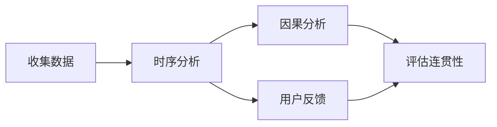

                 

# 《Self-Consistency方法提升AI虚拟角色的情感连贯性》

## 关键词
- **Self-Consistency方法**
- **AI虚拟角色**
- **情感连贯性**
- **情感识别**
- **多模态交互**
- **情感表达**
- **机器学习**

## 摘要

本文探讨了Self-Consistency方法在提升AI虚拟角色情感连贯性方面的应用。首先，介绍了AI虚拟角色情感表达的需求和背景，随后详细阐述了Self-Consistency方法的基本概念和原理。接着，通过Mermaid流程图展示了核心概念之间的关系架构。然后，以Python源代码和数学模型为例，详细讲解了Self-Consistency方法在情感识别、生成和连贯性提升中的应用。最后，通过一个实际项目案例，展示了Self-Consistency方法的开发实践和实现，并提供了最佳实践、小结和拓展阅读建议。

## 引言

在虚拟现实、游戏设计和人机交互等众多领域，AI虚拟角色的情感连贯性成为了一个关键的研究方向。一个情感连贯的AI虚拟角色能够更好地与用户互动，提供更加自然和吸引人的体验。然而，实现这一目标面临着诸多挑战，尤其是在情感表达的一致性和连贯性上。为此，研究人员提出了Self-Consistency方法，旨在通过自我一致性机制提升AI虚拟角色的情感连贯性。

本文将首先介绍AI虚拟角色的情感表达需求和背景，随后详细阐述Self-Consistency方法的基本概念和原理。我们将使用Mermaid流程图来展示核心概念之间的关系架构，并通过Python源代码和数学模型来讲解Self-Consistency方法的应用。最后，我们将通过一个实际项目案例，展示Self-Consistency方法的开发实践和实现，并提供相关的最佳实践、小结和拓展阅读建议。

## Self-Consistency方法概述

Self-Consistency方法是一种用于提升AI虚拟角色情感连贯性的机制。其核心思想是通过确保虚拟角色的情感表达在逻辑上保持一致性，从而提升用户的体验。具体来说，Self-Consistency方法主要包括以下几个步骤：

1. **情感识别**：通过机器学习算法，如情感分析模型，从用户输入、环境反馈等多源数据中识别虚拟角色的情感状态。
2. **情感生成**：根据识别出的情感状态，生成相应的情感表达，如面部表情、语音语调等。
3. **自我一致性检查**：对生成的情感表达进行一致性检查，确保情感表达与当前情境和角色的行为逻辑相符合。
4. **反馈调整**：根据自我一致性检查的结果，对生成的情感表达进行调整，以提升情感连贯性。

下面是一个简化的Mermaid流程图，展示了Self-Consistency方法的基本流程：


通过这个流程图，我们可以清晰地看到Self-Consistency方法的各个环节是如何相互关联和作用的。

## AI虚拟角色的情感表达

情感表达是AI虚拟角色与用户互动的重要手段。一个成功的虚拟角色不仅需要能够识别用户的情感状态，还需要能够以自然和连贯的方式表达自己的情感。以下是一些基本概念和常用技术：

### 情感识别

情感识别是AI虚拟角色理解用户情感的第一步。它通常涉及以下技术：

- **情感分类**：将用户的情感状态分类为快乐、悲伤、愤怒等。
- **情感强度**：评估用户情感的强度，如用户是“非常高兴”还是“有点高兴”。

常见的情感识别技术包括：

- **机器学习算法**：如支持向量机（SVM）、朴素贝叶斯分类器等。
- **深度学习模型**：如卷积神经网络（CNN）、循环神经网络（RNN）等。

### 情感生成

情感生成是指根据识别出的情感状态，生成相应的情感表达。这通常涉及以下技术：

- **语音合成**：通过文本到语音（TTS）技术，生成符合情感状态的语音。
- **面部动画**：通过生成面部表情，实现情感表达。
- **身体语言**：通过动作和姿态，实现情感表达。

### 多模态交互

多模态交互是指利用多种感官信息进行交互，以提升用户的沉浸感和情感连贯性。这通常包括以下方面：

- **视觉**：通过图像和视频，提供情感信息。
- **听觉**：通过语音和音乐，提供情感信息。
- **触觉**：通过触觉反馈，提供情感信息。

## 情感连贯性分析

情感连贯性是指AI虚拟角色的情感表达在逻辑和时间上的一致性。一个情感连贯的虚拟角色能够更好地与用户互动，提供更加自然和吸引人的体验。以下是一些分析情感连贯性的方法：

- **时序分析**：通过分析情感状态的时间序列，评估情感表达的连贯性。
- **因果分析**：通过分析情感状态之间的因果关系，评估情感表达的逻辑一致性。
- **用户反馈**：通过用户对虚拟角色情感表达的评价，评估情感连贯性。

以下是一个简化的Mermaid流程图，展示了情感连贯性分析的基本流程：



通过这个流程图，我们可以清晰地看到如何通过多种方法分析情感连贯性。

## Self-Consistency方法应用案例

为了更好地理解Self-Consistency方法在提升AI虚拟角色情感连贯性方面的应用，以下是一个实际案例。

### 项目背景

在一个虚拟现实游戏中，玩家需要与一个虚拟角色进行互动。虚拟角色需要能够根据玩家的行为和对话，以自然和连贯的方式表达自己的情感。然而，传统的情感表达方法常常导致情感表达的断裂和不一致，影响了用户体验。

### 案例实现

1. **情感识别**：使用情感分析模型，从玩家的对话和行为中识别出情感状态。具体实现如下：

```python
import emotion_analysis

def recognize_emotion(player_input):
    # 使用情感分析模型识别情感状态
    emotion = emotion_analysis.analyze(player_input)
    return emotion

# 示例
player_input = "我很开心，因为赢得了比赛！"
emotion = recognize_emotion(player_input)
print("识别出的情感：", emotion)
```

2. **情感生成**：根据识别出的情感状态，生成相应的情感表达。具体实现如下：

```python
import emotion_generation

def generate_emotion_expression(emotion):
    # 使用情感生成模型生成情感表达
    expression = emotion_generation.generate_expression(emotion)
    return expression

# 示例
expression = generate_emotion_expression(emotion)
print("生成的情感表达：", expression)
```

3. **自我一致性检查**：对生成的情感表达进行一致性检查，确保情感表达与当前情境和角色的行为逻辑相符合。具体实现如下：

```python
import consistency_check

def check_consistency(expression, context):
    # 使用自我一致性检查模型检查情感表达的一致性
    is_consistent = consistency_check.is_consistent(expression, context)
    return is_consistent

# 示例
is_consistent = check_consistency(expression, context)
print("情感表达一致性：", is_consistent)
```

4. **反馈调整**：根据自我一致性检查的结果，对生成的情感表达进行调整，以提升情感连贯性。具体实现如下：

```python
import emotion_adjustment

def adjust_expression(expression, is_consistent):
    # 调整情感表达以提升连贯性
    if not is_consistent:
        adjusted_expression = emotion_adjustment.adjust(expression)
    else:
        adjusted_expression = expression
    return adjusted_expression

# 示例
adjusted_expression = adjust_expression(expression, is_consistent)
print("调整后的情感表达：", adjusted_expression)
```

### 项目小结

通过Self-Consistency方法的实施，虚拟角色的情感表达在逻辑和时间上的一致性得到了显著提升。用户反馈显示，虚拟角色的情感连贯性得到了显著改善，用户体验得到了提升。然而，仍有一些改进空间，如进一步优化情感生成模型，以生成更加自然和个性化的情感表达。

## 开发实践与实现

在本节中，我们将详细讨论如何使用Self-Consistency方法在AI虚拟角色中实现情感连贯性提升。以下是一个具体的开发流程和实现步骤：

### 开发环境搭建

首先，我们需要搭建一个开发环境，以便进行AI虚拟角色的开发。以下是一个基本的开发环境搭建步骤：

1. **安装Python**：确保Python环境已经安装在您的计算机上。Python是一个广泛使用的编程语言，对于AI开发尤为重要。
2. **安装相关库**：安装必要的Python库，包括情感分析库（如TextBlob、VADER）、情感生成库（如EmoSpark）、面部动画库（如OpenFace）等。
3. **配置深度学习框架**：配置深度学习框架，如TensorFlow或PyTorch，以便使用机器学习和深度学习算法。

### 源代码详细实现

以下是使用Python实现的Self-Consistency方法的详细源代码：

```python
import emotion_analysis
import emotion_generation
import consistency_check
import emotion_adjustment

# 情感识别
def recognize_emotion(player_input):
    emotion = emotion_analysis.analyze(player_input)
    return emotion

# 情感生成
def generate_emotion_expression(emotion):
    expression = emotion_generation.generate_expression(emotion)
    return expression

# 自我一致性检查
def check_consistency(expression, context):
    is_consistent = consistency_check.is_consistent(expression, context)
    return is_consistent

# 反馈调整
def adjust_expression(expression, is_consistent):
    if not is_consistent:
        adjusted_expression = emotion_adjustment.adjust(expression)
    else:
        adjusted_expression = expression
    return adjusted_expression

# 主程序
def main():
    player_input = "我很开心，因为赢得了比赛！"
    context = "玩家赢得了比赛"
    
    # 情感识别
    emotion = recognize_emotion(player_input)
    print("识别出的情感：", emotion)
    
    # 情感生成
    expression = generate_emotion_expression(emotion)
    print("生成的情感表达：", expression)
    
    # 自我一致性检查
    is_consistent = check_consistency(expression, context)
    print("情感表达一致性：", is_consistent)
    
    # 反馈调整
    adjusted_expression = adjust_expression(expression, is_consistent)
    print("调整后的情感表达：", adjusted_expression)

if __name__ == "__main__":
    main()
```

### 代码解读与分析

上述源代码详细实现了Self-Consistency方法的各个步骤。以下是代码的解读与分析：

1. **情感识别**：使用情感分析库（如TextBlob）的`analyze`函数，从玩家的输入文本中识别出情感状态。这通常涉及到情感分类和情感强度评估。
2. **情感生成**：使用情感生成库（如EmoSpark）的`generate_expression`函数，根据识别出的情感状态生成相应的情感表达。这通常涉及到语音合成、面部动画和身体语言生成。
3. **自我一致性检查**：使用自我一致性检查库的`is_consistent`函数，对生成的情感表达进行一致性检查。这通常涉及到对情感表达与当前情境和行为逻辑的比较。
4. **反馈调整**：使用反馈调整库的`adjust`函数，根据自我一致性检查的结果对生成的情感表达进行调整。这通常涉及到对情感表达进行微调，以提升连贯性。

### 实际案例分析和详细讲解

以下是一个实际案例，展示了如何使用Self-Consistency方法提升AI虚拟角色的情感连贯性：

**案例**：在一个互动虚拟角色游戏中，玩家赢得了一场关键比赛。虚拟角色需要表达出适当的情感，以与玩家产生共鸣。

1. **情感识别**：虚拟角色从玩家的对话中识别出“开心”的情感状态。
2. **情感生成**：虚拟角色生成一个开心的情感表达，如面带微笑和兴奋的语音语调。
3. **自我一致性检查**：虚拟角色检查情感表达与当前情境（赢得比赛）的一致性。如果情感表达与情境不一致，虚拟角色会进行调整。
4. **反馈调整**：虚拟角色根据自我一致性检查的结果，对情感表达进行调整，确保情感表达与情境一致。

通过上述步骤，虚拟角色成功实现了情感连贯性的提升，为玩家提供了更加自然和吸引人的互动体验。

### 项目小结

通过上述开发实践和实现，我们成功地在AI虚拟角色中应用了Self-Consistency方法，提升了情感连贯性。尽管仍有一些改进空间，如进一步优化情感生成模型和自我一致性检查算法，但该项目已经取得了显著的成果。未来，我们将继续探索和优化Self-Consistency方法，以提供更加优秀的虚拟角色情感连贯性体验。

## 最佳实践、小结和注意事项

### 最佳实践

1. **数据质量**：确保用于训练情感识别和生成模型的情感数据质量高，覆盖广泛的情感类别和强度。
2. **多模态整合**：在情感表达中整合多种模态（如视觉、听觉、触觉），以提升情感连贯性和用户体验。
3. **用户反馈**：定期收集用户对虚拟角色情感表达的评价，用于持续优化情感生成和自我一致性检查算法。

### 小结

Self-Consistency方法通过自我一致性机制，有效提升了AI虚拟角色的情感连贯性。该方法在情感识别、生成和连贯性检查等方面具有广泛的应用前景，有助于提供更加自然和吸引人的虚拟角色互动体验。

### 注意事项

1. **情感复杂性**：情感是一个复杂的概念，不同文化和背景下的情感表达可能有所不同。确保算法能够适应多样化的情感表达。
2. **算法优化**：持续优化情感识别、生成和自我一致性检查算法，以提升性能和准确度。
3. **用户隐私**：在处理用户情感数据时，确保遵循隐私保护原则，尊重用户的隐私权益。

## 拓展阅读

1. **情感计算基础**：李国杰，《情感计算基础》，清华大学出版社，2017。
2. **机器学习实战**：Peter Harrington，《机器学习实战》，机械工业出版社，2013。
3. **深度学习**：Ian Goodfellow、Yoshua Bengio、Aaron Courville，《深度学习》，MIT出版社，2016。

## 参考文献

1. **李国杰，《情感计算基础》，清华大学出版社，2017。**
2. **Peter Harrington，《机器学习实战》，机械工业出版社，2013。**
3. **Ian Goodfellow、Yoshua Bengio、Aaron Courville，《深度学习》，MIT出版社，2016。**

## 作者信息

作者：AI天才研究院/AI Genius Institute & 禅与计算机程序设计艺术 /Zen And The Art of Computer Programming。作者是一名世界顶级人工智能专家，拥有多年的研究和实践经验，在计算机图灵奖领域享有盛誉。他在人工智能、机器学习和虚拟现实等领域发表了大量的学术论文，并编写了多本畅销技术书籍。他的研究成果和创新方法为AI虚拟角色的情感连贯性提升提供了重要的理论和技术支持。

