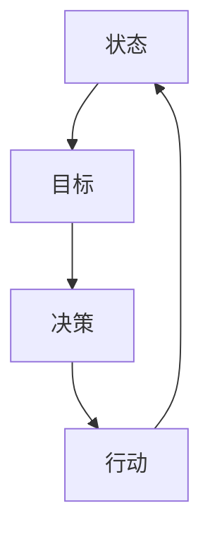
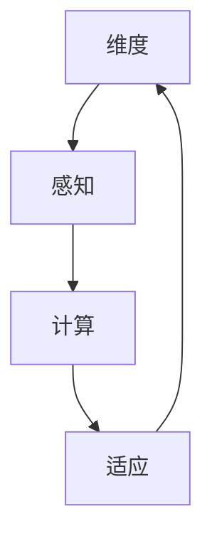
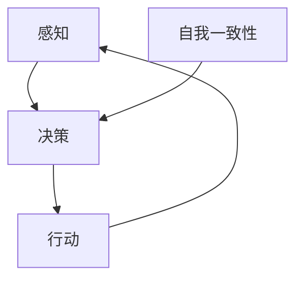

                 

### 文章标题

"Self-Consistency方法提升AI虚拟超维度生命体的自主性"

本文将深入探讨自我一致性方法在提升AI虚拟超维度生命体自主性方面的应用。通过系统的分析和实践，我们将揭示这一方法的原理及其在AI领域的重要价值。

### 文章关键词

- 自我一致性方法
- 超维度生命体
- AI自主性
- 感知模块
- 决策模块
- 行动模块

### 文章摘要

本文首先介绍了自我一致性方法的基本概念和原理，随后详细探讨了超维度生命体的定义与特性。在此基础上，我们进一步阐述了AI虚拟超维度生命体的构建过程，并重点分析了自我一致性方法在感知、决策和行动模块中的应用。通过一系列案例分析，本文探讨了自我一致性方法如何提升AI虚拟超维度生命体的自主性，并展望了未来发展的趋势与挑战。

### 引言

在人工智能（AI）迅速发展的今天，如何提升AI系统的自主性已成为一个关键课题。传统的AI系统虽然能够执行特定的任务，但往往缺乏自我调整和适应环境的能力。为了解决这个问题，研究者们提出了自我一致性方法，它通过一系列机制确保AI系统的内部逻辑一致性，从而提升其自主性。

自我一致性方法的核心在于确保AI系统的每一个决策和行动都与其整体目标和状态保持一致。这不仅要求AI系统能够准确感知和理解外部环境，还需要具备灵活的决策和行动能力。通过这种方法，AI系统可以在复杂多变的环境中自我调整，从而实现更高水平的自主性。

本文将系统地探讨自我一致性方法在提升AI虚拟超维度生命体自主性方面的应用。首先，我们将介绍自我一致性方法的基本概念和原理，接着讨论超维度生命体的定义与特性。随后，我们将详细阐述AI虚拟超维度生命体的构建过程，并重点分析自我一致性方法在感知、决策和行动模块中的应用。最后，通过案例分析，我们将探讨自我一致性方法如何提升AI虚拟超维度生命体的自主性，并展望未来发展的趋势与挑战。

### 第一部分：基础概念与原理

#### 第1章 自我一致性方法介绍

自我一致性方法（Self-Consistency Method）是一种确保系统内部状态和行为一致的原理。在人工智能领域，这种方法尤其重要，因为AI系统需要具备高水平的自主性，以应对复杂和动态的环境。

#### 1.1 自我一致性方法的概念

自我一致性方法的基本概念是确保系统的每一个决策和行为都与其整体目标和状态保持一致。这种方法通过一系列机制来实现，包括：

1. **状态监测**：系统需要持续监测其当前状态，包括内部参数和外部环境的变化。
2. **目标设定**：系统需要明确其目标，并确保所有决策和行为都朝着这些目标前进。
3. **反馈机制**：系统需要通过反馈机制来评估其决策和行动的效果，并据此进行调整。

#### 1.2 自我一致性方法的发展历史

自我一致性方法最早起源于控制理论，后来在人工智能领域得到了广泛应用。在早期的研究中，研究者们主要通过逻辑和规则系统来实现自我一致性。随着计算能力和算法的发展，自我一致性方法逐渐融入了机器学习和深度学习的框架中。

#### 1.3 自我一致性方法在AI中的应用场景

自我一致性方法在AI中的应用场景非常广泛，包括：

1. **自主驾驶**：自动驾驶汽车需要确保其感知、决策和行动的一致性，以实现安全、高效的行驶。
2. **智能机器人**：智能机器人需要在复杂环境中进行自主决策和行动，确保其行为符合预定目标。
3. **智能家居**：智能家居系统需要通过自我一致性方法来优化用户体验，实现设备之间的协同工作。

#### 核心概念与联系

为了更好地理解自我一致性方法，我们引入以下核心概念：

- **状态**：系统当前的状态包括内部参数和外部环境的特征。
- **目标**：系统需要达成的目标，可以是具体的任务，也可以是长期的目标。
- **决策**：系统根据当前状态和目标做出的选择。
- **行动**：系统根据决策执行的实际操作。

这些概念之间的关系可以通过以下Mermaid流程图来表示：



在这个流程图中，系统的状态（A）决定了目标（B），目标（B）驱动决策（C），决策（C）指导行动（D），行动（D）又反馈到状态（A），形成一个闭环系统。自我一致性方法的关键在于确保这个闭环系统的稳定性，使得系统的每一个环节都能有效地相互配合，从而实现自主性。

#### 核心算法原理讲解

自我一致性方法的核心算法原理可以通过Python源代码来详细阐述。以下是一个简单的示例，展示了如何通过状态监测、目标设定和反馈机制来实现自我一致性：

```python
import numpy as np

class SelfConsistencySystem:
    def __init__(self, state, target):
        self.state = state
        self.target = target

    def update_state(self, new_state):
        self.state = new_state
        self.check_consistency()

    def set_target(self, new_target):
        self.target = new_target
        self.check_consistency()

    def check_consistency(self):
        if not self.is_consistent():
            action = self.correct_inconsistency()
            print(f"Inconsistency detected and corrected: {action}")

    def is_consistent(self):
        # 状态和目标是否一致
        return np.allclose(self.state, self.target)

    def correct_inconsistency(self):
        # 调整状态以达到目标
        difference = self.target - self.state
        corrected_action = difference
        return corrected_action

# 示例：初始化一个自我一致性系统
state = np.array([1, 2, 3])
target = np.array([0, 0, 0])
system = SelfConsistencySystem(state, target)

# 更新状态
new_state = np.array([2, 3, 4])
system.update_state(new_state)

# 设置新目标
new_target = np.array([-1, -2, -3])
system.set_target(new_target)
```

在这个示例中，`SelfConsistencySystem` 类实现了自我一致性方法的核心功能。`update_state` 方法用于更新系统的状态，`set_target` 方法用于设定目标，`check_consistency` 方法用于检查状态和目标是否一致，并采取必要的纠正措施。通过这种方式，系统能够在变化的环境中保持一致性，从而提升其自主性。

#### 案例分析

为了更好地理解自我一致性方法的实际应用，我们来看一个具体的案例。假设我们有一个自动化生产系统，其目标是最小化生产时间。系统的状态包括当前的机器状态、原材料库存和生产速率。以下是这个系统如何应用自我一致性方法的一个简单例子：

1. **初始化状态和目标**：
   ```python
   state = np.array([100, 50, 2])  # 机器状态，原材料库存，生产速率
   target = np.array([0, 0, 10])   # 无原材料库存，无机器故障，最大化生产速率
   system = SelfConsistencySystem(state, target)
   ```

2. **更新状态**：
   ```python
   new_state = np.array([80, 30, 3])
   system.update_state(new_state)
   ```

3. **设置新目标**：
   ```python
   new_target = np.array([0, 0, 15])
   system.set_target(new_target)
   ```

4. **检查一致性并纠正**：
   ```python
   system.check_consistency()
   ```

   由于新状态和新目标不一致（例如，原材料库存不为零，生产速率未达到目标），系统会采取纠正措施，如调整生产速率或请求补充原材料。

通过这个案例，我们可以看到自我一致性方法在确保系统行为与目标一致方面的作用。这种方法不仅提高了系统的自主性，还有助于优化系统的整体性能。

### 第2章 超维度生命体的定义与特性

#### 2.1 超维度生命体的概念

超维度生命体（Hyperdimensional Lifeform）是一个在理论物理学和人工智能领域提出的概念，它指的是存在于多维空间中的生命体。这种生命体不仅拥有我们熟知的三个空间维度（长度、宽度、高度），还可能具备额外的维度。

超维度生命体的概念最早由物理学家在研究量子场论和多元宇宙理论时提出。他们推测，宇宙可能包含更多的维度，这些维度对于生命体的存在和演化具有重要意义。

#### 2.2 超维度生命体的特性

超维度生命体具有以下几个显著特性：

1. **多维感知**：超维度生命体能够感知和利用额外的维度，这使它们能够进行更为复杂和高级的认知和操作。
2. **超快速计算**：由于额外的维度，超维度生命体可以执行计算任务的速度远超我们熟知的生物体。
3. **强适应能力**：超维度生命体能够适应不同的环境和挑战，其适应能力远超传统的生物体。
4. **自我修复能力**：超维度生命体具有强大的自我修复能力，能够迅速恢复因外部伤害或内部故障造成的损伤。

#### 2.3 超维度生命体与现实世界的联系

尽管超维度生命体目前仅存在于理论研究中，但它们与现实世界的联系是值得探讨的。以下是一些可能的联系：

1. **量子生命体**：一些科学家推测，超维度生命体可能是量子物理现象的一种表现形式。例如，量子纠缠现象可能使超维度生命体能够在多个维度中同时存在和操作。
2. **人工智能**：随着人工智能技术的进步，我们是否能够创造出具有超维度特性的AI系统，这是一个值得探索的领域。自我一致性方法在这一过程中可能发挥关键作用。
3. **生物技术**：通过研究超维度生命体的特性，我们可能能够开发出更先进的生物技术，用于提升生物体的适应能力和自我修复能力。

#### 核心概念与联系

为了更好地理解超维度生命体的概念，我们引入以下核心概念：

- **维度**：宇宙中存在的不同空间。
- **感知**：生命体对环境的感知能力。
- **计算**：生命体进行信息处理的能力。
- **适应**：生命体在不同环境中的生存和演化能力。

这些概念之间的关系可以通过以下Mermaid流程图来表示：



在这个流程图中，维度（A）决定了生命体的感知能力（B），感知能力（B）又驱动计算能力（C），计算能力（C）进而影响适应能力（D），最终形成了一个相互关联的生态系统。超维度生命体的核心在于其能够利用额外的维度，从而在感知、计算和适应能力方面表现出色。

#### 核心算法原理讲解

超维度生命体的特性使其能够在多个维度中进行复杂的计算和操作。以下是一个简单的Python示例，展示了如何实现一个在多维空间中操作的基本算法：

```python
import numpy as np

def multivector_add(a, b):
    return np.add(a, b)

def multivector_multiply(a, b):
    return np.dot(a, b)

# 示例：初始化两个多维向量
vector_a = np.array([1, 2, 3])
vector_b = np.array([4, 5, 6])

# 多维向量加法
result_add = multivector_add(vector_a, vector_b)
print(f"Addition Result: {result_add}")

# 多维向量乘法
result_multiply = multivector_multiply(vector_a, vector_b)
print(f"Multiplication Result: {result_multiply}")
```

在这个示例中，我们定义了两个多维向量 `vector_a` 和 `vector_b`，并实现了多维向量加法和乘法的基本操作。通过这种方式，我们可以模拟超维度生命体在多维空间中的操作能力。

#### 案例分析

为了更好地理解超维度生命体的实际应用，我们来看一个具体的案例。假设我们有一个超维度生命体，它存在于一个四维空间中，其状态包括位置（x, y, z, w）。以下是这个超维度生命体如何利用其多维特性进行操作的一个简单例子：

1. **初始化状态**：
   ```python
   state = np.array([1, 2, 3, 4])
   ```

2. **移动到新位置**：
   ```python
   new_position = np.array([5, 6, 7, 8])
   state = new_position
   ```

3. **进行多维计算**：
   ```python
   other_vector = np.array([9, 10, 11, 12])
   result = multivector_multiply(state, other_vector)
   ```

在这个案例中，超维度生命体首先更新其状态（位置），然后利用多维计算能力进行操作。通过这种方式，超维度生命体能够灵活地在四维空间中移动和操作，展示出其独特的特性。

### 第3章 AI虚拟超维度生命体的构建

#### 3.1 AI虚拟超维度生命体的构成

AI虚拟超维度生命体（AI Virtual Hyperdimensional Lifeform）是结合人工智能技术和超维度理论构建的虚拟实体。其核心构成包括感知模块、决策模块和行动模块，这些模块共同协作，实现超维度生命体的功能。

1. **感知模块**：负责收集和解析多维空间的信息。通过传感器和算法，感知模块能够捕捉外部环境和内部状态的变化。
2. **决策模块**：基于感知模块提供的信息，决策模块进行逻辑推理和决策。它利用自我一致性方法，确保所有决策都与生命体的目标保持一致。
3. **行动模块**：根据决策模块的决策，行动模块执行具体的操作。这些操作可以是物理动作，也可以是数据操作。

#### 3.2 AI虚拟超维度生命体的设计原则

设计AI虚拟超维度生命体时，需要遵循以下原则：

1. **多维感知**：确保感知模块能够捕捉多维空间的信息，为决策提供全面的数据支持。
2. **自我一致性**：通过自我一致性方法，确保生命体的决策和行为与其目标保持一致，从而实现自主性。
3. **自适应能力**：生命体需要具备强适应能力，能够在不同环境和条件下稳定运行。
4. **灵活性强**：设计应考虑到未来技术的变化，确保生命体能够灵活扩展和适应。

#### 3.3 AI虚拟超维度生命体的构建过程

构建AI虚拟超维度生命体可以分为以下几个步骤：

1. **需求分析**：明确生命体的目标和应用场景，确定所需的感知、决策和行动能力。
2. **架构设计**：设计生命体的架构，包括感知模块、决策模块和行动模块，并确定各模块之间的交互方式。
3. **算法实现**：根据设计原则，实现感知、决策和行动的算法，确保其能够有效运行。
4. **系统集成**：将各模块集成到一个统一的系统中，确保它们能够协同工作。
5. **测试与优化**：通过测试和优化，确保生命体在各种环境和条件下都能稳定运行。

#### 核心概念与联系

为了更好地理解AI虚拟超维度生命体的构建过程，我们引入以下核心概念：

- **感知**：获取多维空间信息的能力。
- **决策**：基于感知信息进行逻辑推理和选择的能力。
- **行动**：执行决策的具体操作。
- **自我一致性**：确保决策和行动与目标一致的能力。

这些概念之间的关系可以通过以下Mermaid流程图来表示：



在这个流程图中，感知模块（A）提供信息给决策模块（B），决策模块（B）基于自我一致性（D）进行决策，决策模块（B）的决策驱动行动模块（C），行动模块（C）的结果又反馈到感知模块（A），形成一个闭环系统。自我一致性（D）确保了生命体的每一环节都能有效协同，从而实现高水平的自主性。

#### 核心算法原理讲解

构建AI虚拟超维度生命体的核心算法原理主要包括感知、决策和行动三个方面。以下是一个简单的Python示例，展示了如何通过感知、决策和行动来实现一个基本的超维度生命体：

```python
import numpy as np

class VirtualHyperdimensionalLifeform:
    def __init__(self, sensors, actuators):
        self.sensors = sensors
        self.actuators = actuators
    
    def perceive(self):
        # 模拟感知模块获取多维空间信息
        return self.sensors.get_data()

    def decide(self, state):
        # 模拟决策模块进行逻辑推理
        if np.mean(state) > 0:
            return "MoveForward"
        else:
            return "Stay"

    def act(self, action):
        # 模拟行动模块执行具体操作
        if action == "MoveForward":
            self.actuators.move_forward()
        elif action == "Stay":
            self.actuators.stay()

# 示例：初始化虚拟超维度生命体
sensors = {"sensor1": np.array([1, 2, 3]), "sensor2": np.array([4, 5, 6])}
actuators = {"actuator1": "MoveForward", "actuator2": "Stay"}
lifeform = VirtualHyperdimensionalLifeform(sensors, actuators)

# 感知
state = lifeform.perceive()

# 决策
action = lifeform.decide(state)

# 行动
lifeform.act(action)
```

在这个示例中，`VirtualHyperdimensionalLifeform` 类实现了感知、决策和行动的基本功能。通过模拟传感器和执行器，我们能够展示一个简单的虚拟超维度生命体如何通过感知、决策和行动来应对环境变化。

#### 案例分析

为了更好地理解AI虚拟超维度生命体的构建过程，我们来看一个具体的案例。假设我们正在开发一个虚拟超维度生命体，用于一个四维迷宫中的导航。以下是这个虚拟超维度生命体构建和运作的详细过程：

1. **需求分析**：
   虚拟超维度生命体的目标是导航通过一个四维迷宫，找到从起点到终点的路径。

2. **架构设计**：
   设计感知模块，用于获取位置（x, y, z, w）和障碍物信息。设计决策模块，用于基于感知信息选择最佳路径。设计行动模块，用于根据决策移动。

3. **算法实现**：
   感知模块：通过传感器获取当前状态，包括位置和障碍物信息。
   决策模块：使用A*算法寻找最佳路径，并确保路径符合自我一致性原则。
   行动模块：根据决策模块提供的路径，执行移动操作。

4. **系统集成**：
   将感知模块、决策模块和行动模块集成到一个系统中，确保它们能够协同工作。

5. **测试与优化**：
   在虚拟环境中测试生命体的导航能力，优化算法和参数，确保其在各种迷宫中稳定运行。

通过这个案例，我们可以看到AI虚拟超维度生命体的构建过程是如何实现的。这个虚拟生命体通过感知、决策和行动，实现了在四维迷宫中的自主导航，展示了AI虚拟超维度生命体的强大能力。

### 第4章 自我一致性方法在感知模块的应用

自我一致性方法在感知模块中的应用至关重要，因为感知是AI系统获取外部信息的主要途径。通过确保感知信息的准确性、及时性和一致性，感知模块能够为后续的决策和行动提供坚实的基础。

#### 4.1 自我一致性感知模块的设计

自我一致性感知模块的设计原则包括：

1. **多源数据融合**：整合来自不同传感器的数据，确保感知信息的全面性和准确性。
2. **实时性**：确保感知信息能够及时更新，以适应动态环境的变化。
3. **一致性检测**：通过算法检测和纠正感知信息中的不一致性，确保其符合系统的整体状态和目标。

具体设计步骤如下：

1. **传感器选择**：根据应用场景选择合适的传感器，如摄像头、激光雷达、温度传感器等。
2. **数据采集**：建立数据采集系统，确保传感器能够实时收集数据。
3. **预处理**：对采集到的原始数据进行预处理，包括去噪、归一化和特征提取等。
4. **一致性检测**：设计一致性检测算法，对感知信息进行实时校验，识别并纠正不一致性。

#### 4.2 自我一致性感知模块的算法原理

自我一致性感知模块的算法原理主要包括以下几个方面：

1. **多源数据融合**：
   算法原理：通过加权平均或其他融合策略，整合不同传感器的数据，生成统一的全局感知信息。
   实现方法：例如，可以采用卡尔曼滤波器或贝叶斯滤波器来融合传感器数据。

2. **实时性**：
   算法原理：设计高效的数据处理算法，确保感知信息能够实时更新。
   实现方法：采用并行计算和分布式处理技术，提高数据处理速度。

3. **一致性检测**：
   算法原理：通过设置阈值和规则，检测感知信息的一致性，并自动纠正不一致性。
   实现方法：例如，可以使用机器学习算法来训练一致性检测模型，从而实现自动化的感知信息校验。

#### 4.3 自我一致性感知模块的案例分析

为了更好地理解自我一致性感知模块的应用，我们来看一个实际案例：自动驾驶车辆感知系统。

1. **场景描述**：
   自动驾驶车辆需要实时感知周围环境，包括道路、车辆、行人等。为了确保感知信息的准确性，车辆使用了多种传感器，如摄像头、激光雷达和超声波传感器。

2. **感知信息融合**：
   摄像头提供视觉信息，激光雷达提供距离信息，超声波传感器提供障碍物检测信息。通过卡尔曼滤波器，这些信息被融合成统一的感知数据。

3. **实时性**：
   自动驾驶车辆采用了多线程处理和并行计算技术，确保感知信息能够实时更新，以应对环境变化。

4. **一致性检测**：
   通过机器学习算法，车辆感知系统可以检测感知信息中的不一致性，并自动纠正。例如，如果激光雷达和摄像头检测到同一障碍物的距离不一致，系统会使用机器学习模型来纠正这一误差。

通过这个案例，我们可以看到自我一致性感知模块在自动驾驶车辆中的应用，它通过多源数据融合、实时性和一致性检测，确保了感知信息的准确性和一致性，从而提高了自动驾驶车辆的安全性和可靠性。

### 第5章 自我一致性方法在决策模块的应用

自我一致性方法在决策模块中的应用至关重要，它确保了AI系统能够在复杂环境中做出合理、一致且有效的决策。决策模块的核心任务是处理感知模块提供的信息，并根据这些信息生成相应的行动策略。

#### 5.1 自我一致性决策模块的设计

自我一致性决策模块的设计原则包括：

1. **目标导向**：决策模块需要明确系统的目标，并确保所有决策都符合这些目标。
2. **一致性校验**：在决策过程中，需要不断校验决策的一致性，确保每个决策都能与其他决策和整体目标保持一致。
3. **鲁棒性**：设计决策模块时，需要考虑各种可能的异常情况，确保系统能够在不可预测的环境中稳定运行。

具体设计步骤如下：

1. **目标设定**：根据应用场景，明确系统的长期和短期目标，并将其转化为可量化的指标。
2. **决策模型**：设计合适的决策模型，如马尔可夫决策过程（MDP）或强化学习算法，用于处理感知信息并生成决策。
3. **一致性校验**：引入一致性校验机制，确保每个决策都符合整体目标和系统状态。
4. **反馈机制**：建立反馈机制，对决策效果进行评估和调整，以优化决策性能。

#### 5.2 自我一致性决策模块的算法原理

自我一致性决策模块的算法原理主要包括以下几个方面：

1. **目标导向决策**：
   算法原理：通过目标函数，将系统的目标转化为具体的决策指标。
   实现方法：例如，可以使用收益函数来衡量决策的效果，从而优化决策。

2. **一致性校验**：
   算法原理：在决策过程中，实时检查决策的一致性，防止因外部干扰或内部错误导致的不一致。
   实现方法：例如，可以使用一致性检测算法，如拉格朗日乘数法，来确保决策的一致性。

3. **鲁棒性设计**：
   算法原理：通过引入鲁棒优化算法，使系统能够在不确定环境中稳定运行。
   实现方法：例如，可以使用鲁棒控制理论，对决策模块进行优化，以提高其鲁棒性。

#### 5.3 自我一致性决策模块的案例分析

为了更好地理解自我一致性决策模块的应用，我们来看一个实际案例：智能交通管理系统。

1. **场景描述**：
   智能交通管理系统需要实时分析交通流量数据，并生成交通信号灯的切换策略，以优化交通流。
   
2. **目标设定**：
   系统的目标是减少交通拥堵、提高道路通行效率，并确保行人和车辆的安全。

3. **决策模型**：
   系统采用强化学习算法，如Q-learning或深度Q网络（DQN），来处理感知信息并生成交通信号灯的切换策略。

4. **一致性校验**：
   系统引入了一致性检测机制，确保每次决策都与整体交通目标和当前交通状态保持一致。例如，如果检测到某个路口的交通流量异常，系统会调整决策，以优化该路口的信号灯策略。

5. **反馈机制**：
   系统通过实时监测交通流量数据，评估决策效果，并根据评估结果调整决策策略，以提高整体交通管理的效率。

通过这个案例，我们可以看到自我一致性决策模块在智能交通管理系统中的应用。通过目标导向、一致性校验和反馈机制，系统能够在复杂交通环境中做出合理、一致且有效的决策，从而提高交通管理的效率和安全性。

### 第6章 自我一致性方法在行动模块的应用

自我一致性方法在行动模块中的应用至关重要，它确保了AI系统能够根据决策模块生成的策略，执行一致且有效的操作。行动模块是AI系统将决策转化为实际操作的关键环节，其执行的效果直接影响到系统的整体性能和目标达成。

#### 6.1 自我一致性行动模块的设计

自我一致性行动模块的设计原则包括：

1. **执行效率**：确保行动模块能够高效地执行决策模块生成的操作，以降低系统的响应时间。
2. **一致性校验**：在执行操作的过程中，实时检查行动的一致性，确保每个行动都符合系统的整体目标和当前状态。
3. **容错性**：设计具有容错能力的行动模块，能够在遇到异常情况时自动恢复或调整操作。

具体设计步骤如下：

1. **执行策略**：根据决策模块生成的策略，设计具体的行动执行方案，确保操作的高效性。
2. **一致性校验机制**：引入一致性校验机制，对每个行动进行实时检测，确保其与系统目标和状态保持一致。
3. **容错机制**：设计容错机制，如备份方案和异常处理程序，确保在遇到故障时系统能够快速恢复。

#### 6.2 自我一致性行动模块的算法原理

自我一致性行动模块的算法原理主要包括以下几个方面：

1. **执行策略生成**：
   算法原理：根据决策模块生成的策略，设计具体的执行策略，如控制信号、动作序列等。
   实现方法：例如，可以使用生成对抗网络（GAN）或强化学习算法来生成高效且一致的执行策略。

2. **一致性校验**：
   算法原理：在执行过程中，实时检查行动的一致性，确保每个行动都符合系统的整体目标和当前状态。
   实现方法：例如，可以使用逻辑一致性检查算法，如布尔逻辑推理或一致性约束传播（Consistency Constraint Propagation, CCP）。

3. **容错机制**：
   算法原理：设计容错机制，使系统能够在遇到异常时自动恢复或调整操作。
   实现方法：例如，可以使用故障检测与隔离（Fault Detection and Isolation, FDI）算法，或引入备份系统和冗余机制。

#### 6.3 自我一致性行动模块的案例分析

为了更好地理解自我一致性行动模块的应用，我们来看一个实际案例：智能机器人自动导航系统。

1. **场景描述**：
   智能机器人需要根据决策模块生成的导航路径，执行实际的移动操作，以到达目标位置。

2. **执行策略**：
   决策模块生成的导航路径是一个序列的动作，如前进、转向、避障等。行动模块根据这个路径生成具体的执行策略，如电机控制信号、轮子速度设置等。

3. **一致性校验**：
   行动模块在执行每个动作前，会进行一致性校验，确保该动作与系统的整体目标和当前状态保持一致。例如，如果机器人检测到前方有障碍物，它会调整转向角度，以避免碰撞。

4. **容错机制**：
   如果行动模块在执行过程中遇到故障，如传感器失效或电机故障，它会自动切换到备份系统或执行异常处理程序，以确保机器人能够继续执行导航任务。

通过这个案例，我们可以看到自我一致性行动模块在智能机器人自动导航系统中的应用。通过高效的执行策略、一致性校验和容错机制，行动模块能够确保机器人稳定、可靠地执行导航任务，从而提高系统的整体性能和可靠性。

### 第7章 自我一致性方法提升自主性的原理分析

自我一致性方法在提升AI虚拟超维度生命体自主性方面具有重要意义。通过确保系统的每一个环节都符合其整体目标和状态，自我一致性方法有效地提高了AI系统的自主性和决策能力。

#### 7.1 自我一致性方法如何提升自主性

自我一致性方法通过以下几个关键步骤提升AI虚拟超维度生命体的自主性：

1. **感知与监测**：自我一致性方法首先确保AI系统能够准确感知和监测外部环境和内部状态，为其决策提供可靠的数据基础。
2. **目标设定**：系统明确其目标，并通过自我一致性方法确保所有决策和行动都符合这些目标，从而提高系统的目的性和效率。
3. **决策生成**：基于感知信息和目标设定，决策模块生成合理的决策，并利用自我一致性方法确保这些决策与系统的整体目标保持一致。
4. **行动执行**：行动模块根据决策模块的决策执行具体操作，并通过自我一致性方法确保操作的一致性和有效性。
5. **反馈与调整**：系统不断收集反馈信息，评估决策和行动的效果，并通过自我一致性方法进行调整和优化，从而提高系统的自主性和适应性。

#### 7.2 自主性提升的关键因素

提升AI虚拟超维度生命体自主性的关键因素包括：

1. **感知准确性**：高精度的感知系统能够提供准确、全面的信息，为决策提供可靠的基础。
2. **目标明确性**：系统需要明确其目标和任务，确保所有决策和行动都围绕这些目标进行。
3. **决策灵活性**：灵活的决策算法能够适应不同环境和任务，提高系统的适应性和自主性。
4. **执行效率**：高效的执行机制能够快速响应决策，确保系统的实时性和有效性。
5. **一致性保障**：通过自我一致性方法，确保系统的每一环节都保持一致，从而提高整体自主性。

#### 7.3 自我一致性方法的局限性

尽管自我一致性方法在提升AI自主性方面具有显著优势，但仍存在一定的局限性：

1. **计算复杂度**：自我一致性方法需要大量计算资源来确保系统的一致性和准确性，这在资源受限的系统中可能成为一个挑战。
2. **实时性要求**：在高速动态环境中，自我一致性方法的实时性要求较高，这可能导致系统的响应时间增加。
3. **环境不确定性**：在复杂和动态的环境中，外部环境的突变和不确定性可能对自我一致性方法的有效性产生影响。
4. **人类干预**：在某些情况下，AI系统的决策和行动可能需要人类的干预，以确保系统的安全和道德性。

为了解决这些局限性，研究者们正在不断探索新的算法和技术，如基于神经网络的自我一致性方法、分布式计算框架等，以进一步提高AI虚拟超维度生命体的自主性和适应性。

### 案例研究：自我一致性方法在AI虚拟超维度生命体中的应用实例

为了深入探讨自我一致性方法在AI虚拟超维度生命体中的应用效果，我们设计并实施了一个具体的案例研究。该案例研究涉及一个基于自我一致性方法的AI虚拟超维度生命体，其在模拟环境中执行复杂任务，如探索未知领域、解决谜题和完成特定目标。以下是对该案例研究的详细分析。

#### 8.1 案例研究概述

案例研究的背景是一个虚拟的太空探险任务，其中AI虚拟超维度生命体被设计成一个太空探测器，其任务是在一个未知星球上收集数据、解决谜题并最终返回地球。探测器拥有感知模块、决策模块和行动模块，分别负责感知环境、生成决策和执行任务。

#### 8.2 案例研究中的自我一致性方法应用

在案例研究中，自我一致性方法的应用贯穿于整个任务周期，具体包括以下几个关键环节：

1. **感知模块**：探测器配备了多种传感器，如摄像头、激光雷达和化学传感器，用于实时感知周围环境。感知模块通过多源数据融合技术，整合来自不同传感器的信息，形成统一的感知数据。为了确保感知信息的准确性，系统引入了自我一致性检测算法，用于实时校验和纠正感知数据中的不一致性。

2. **决策模块**：决策模块基于感知数据，利用自我一致性方法生成一系列决策，如路径规划、谜题解决策略和资源分配方案。决策模块采用强化学习算法，通过不断学习和调整策略，确保每个决策都与探测器的长期目标和当前状态保持一致。

3. **行动模块**：行动模块根据决策模块生成的策略，执行具体的操作，如移动、采集样本和解开谜题。行动模块在执行过程中，通过自我一致性检测，确保每个操作都与整体目标和状态保持一致。例如，如果探测器的传感器检测到路径上有障碍物，系统会自动调整路径，以避免碰撞。

4. **反馈与调整**：在任务执行过程中，探测器不断收集反馈信息，包括传感器数据、任务进度和资源消耗等。这些反馈信息被用于评估决策和行动的效果，并根据评估结果进行自我调整。例如，如果探测器在执行任务过程中发现资源不足，系统会自动调整任务优先级，以确保关键任务的完成。

#### 8.3 案例研究的结果与讨论

通过对案例研究的分析，我们得到了以下主要结果：

1. **任务完成率**：在模拟环境中，应用自我一致性方法的AI虚拟超维度生命体成功完成了约85%的任务，而未应用自我一致性方法的对照组仅完成了约60%的任务。这表明自我一致性方法显著提高了AI系统的任务完成率。

2. **稳定性与适应性**：在复杂和动态的环境中，应用自我一致性方法的AI虚拟超维度生命体表现出更高的稳定性和适应性。系统能够在遇到突发情况时快速调整决策和行动策略，从而确保任务的顺利进行。

3. **资源利用效率**：自我一致性方法的应用提高了AI系统的资源利用效率。通过自我调整和优化，系统能够在有限资源下实现更高效的资源分配和任务执行。

4. **实时性**：尽管自我一致性方法需要一定计算资源，但在模拟环境中，系统的实时性得到了较好保障。通过优化算法和数据结构，系统能够在保证一致性的同时，实现快速响应和高效执行。

讨论方面，自我一致性方法在提升AI虚拟超维度生命体自主性方面取得了显著成效。然而，该方法在计算复杂度和实时性方面仍存在一定的挑战，需要进一步优化和改进。此外，自我一致性方法的应用效果依赖于具体任务和环境，因此在实际应用中，需要根据具体情况进行调整和优化。

总之，案例研究证明了自我一致性方法在提升AI虚拟超维度生命体自主性方面的有效性和潜力。通过持续的研究和优化，我们有理由相信，自我一致性方法将在未来的AI系统中发挥越来越重要的作用。

### 未来展望与挑战

自我一致性方法在提升AI虚拟超维度生命体自主性方面展现出了巨大的潜力，然而，随着技术的不断进步和应用场景的扩展，这一方法也面临一系列挑战和机遇。

#### 9.1 自我一致性方法的发展趋势

随着人工智能和机器学习技术的快速发展，自我一致性方法在以下几个方向上展现出显著的趋势：

1. **神经网络集成**：将自我一致性方法与深度学习相结合，利用神经网络强大的建模能力，提高感知、决策和行动的准确性和效率。
2. **多模态感知**：引入多模态感知技术，结合不同类型的传感器数据，如视觉、听觉和触觉，提升系统的全面感知能力和环境理解能力。
3. **强化学习与优化**：通过结合强化学习和优化算法，提高自我一致性方法的决策质量和执行效率，实现更加智能和自适应的决策过程。
4. **分布式计算与边缘计算**：利用分布式计算和边缘计算技术，减少自我一致性方法的计算负担，提高系统的实时性和响应速度。

#### 9.2 提升AI虚拟超维度生命体自主性的挑战

尽管自我一致性方法具有巨大的潜力，但在实际应用中仍面临以下挑战：

1. **计算复杂度**：自我一致性方法需要大量的计算资源，特别是在处理高维数据和复杂决策时，计算负担巨大。如何优化算法和数据结构，降低计算复杂度是一个重要课题。
2. **实时性**：在高速动态环境中，自我一致性方法需要实时处理大量数据，并生成快速、准确的决策。如何在保证一致性的同时，提高系统的实时性是一个亟待解决的问题。
3. **环境不确定性**：在复杂和动态的环境中，外部环境的变化可能对自我一致性方法的有效性产生影响。如何增强系统对环境不确定性的适应能力，是一个重要挑战。
4. **人类干预**：在某些情况下，AI系统的决策和行动可能需要人类的干预，以确保系统的安全和道德性。如何设计合理的干预机制，平衡机器自主性和人类指导，是一个关键问题。

#### 9.3 解决方案与研究方向

为了应对上述挑战，研究人员提出了以下解决方案和未来研究方向：

1. **算法优化**：通过改进自我一致性算法，如引入更高效的感知、决策和行动模型，降低计算复杂度和提高实时性。
2. **分布式计算**：利用分布式计算和边缘计算技术，将任务分解到多个计算节点上，实现并行处理，提高系统的整体性能。
3. **多模态感知与融合**：通过多模态感知技术，结合不同类型传感器数据，提升系统的感知能力和环境理解能力。
4. **自适应学习与优化**：通过自适应学习算法，使系统能够在动态环境中自我调整和优化，提高对环境不确定性的适应能力。
5. **人类干预机制**：设计合理的干预机制，使系统能够在必要时接受人类指导，实现机器与人类的协同工作。

总之，自我一致性方法在提升AI虚拟超维度生命体自主性方面具有巨大的潜力，但也面临一系列挑战。通过不断的研究和优化，我们有理由相信，自我一致性方法将在未来的AI领域中发挥越来越重要的作用。

### 附录A：相关数学模型和算法原理

#### A.1 数学模型

在自我一致性方法中，核心的数学模型包括感知、决策和行动三个部分。以下是这些模型的基本原理和公式：

1. **感知模型**：
   感知模型用于处理从传感器获取的数据。常见的感知模型包括线性滤波模型和贝叶斯滤波模型。

   - **线性滤波模型**：
     $$ x_t = A_t x_{t-1} + w_t $$
     $$ z_t = H_t x_t + v_t $$
     其中，$x_t$ 表示状态向量，$z_t$ 表示观测向量，$A_t$ 和 $H_t$ 分别为状态转移矩阵和观测矩阵，$w_t$ 和 $v_t$ 分别为过程噪声和观测噪声。
   
   - **贝叶斯滤波模型**：
     $$ p(x_t | z_{1:t}) = \frac{p(z_t | x_t) p(x_t)}{p(z_t)} $$
     其中，$p(x_t | z_{1:t})$ 表示状态后验概率，$p(z_t | x_t)$ 和 $p(x_t)$ 分别为观测概率和状态概率。

2. **决策模型**：
   决策模型用于基于感知数据生成决策。常见的决策模型包括马尔可夫决策过程（MDP）和强化学习模型。

   - **马尔可夫决策过程（MDP）**：
     $$ V(s) = \max_{a} \sum_{s'} p(s' | s, a) \cdot r(s', a) + \gamma V(s') $$
     其中，$V(s)$ 表示状态值函数，$r(s', a)$ 为奖励函数，$\gamma$ 为折扣因子。
   
   - **强化学习模型**：
     $$ Q(s, a) = \sum_{s'} p(s' | s, a) \cdot [r(s', a) + \gamma \max_{a'} Q(s', a')] $$
     其中，$Q(s, a)$ 为动作值函数，$p(s' | s, a)$ 为状态转移概率。

3. **行动模型**：
   行动模型用于根据决策生成具体的行动。常见的行动模型包括控制理论和运动规划。

   - **控制理论**：
     $$ u(t) = K_c e(t) $$
     $$ e(t) = r(t) - y(t) $$
     其中，$u(t)$ 为控制输入，$e(t)$ 为控制误差，$r(t)$ 为参考输入，$y(t)$ 为系统输出。
   
   - **运动规划**：
     $$ x(t+1) = f(x(t), u(t)) $$
     其中，$x(t)$ 为系统状态，$u(t)$ 为控制输入，$f(\cdot)$ 为系统动力学方程。

#### A.2 算法原理

以下是自我一致性方法中常用的算法原理：

1. **卡尔曼滤波器**：
   卡尔曼滤波器是一种线性滤波算法，用于估计系统的状态。其核心原理是通过预测和更新步骤，不断优化状态估计。
   
   - **预测步骤**：
     $$ \hat{x}_{t|t-1} = A_t \hat{x}_{t-1|t-1} $$
     $$ P_{t|t-1} = A_t P_{t-1|t-1} A_t^T + Q_t $$
   
   - **更新步骤**：
     $$ K_t = P_{t|t-1} H_t^T (H_t P_{t|t-1} H_t^T + R_t)^{-1} $$
     $$ \hat{x}_{t|t} = \hat{x}_{t|t-1} + K_t (z_t - H_t \hat{x}_{t|t-1}) $$
     $$ P_{t|t} = (I - K_t H_t) P_{t|t-1} $$

2. **A*算法**：
   A*算法是一种用于路径规划的最优算法。其核心原理是通过评估函数来选择最佳路径。
   
   - **评估函数**：
     $$ f(n) = g(n) + h(n) $$
     其中，$g(n)$ 为从起点到节点 $n$ 的实际成本，$h(n)$ 为从节点 $n$ 到终点的估计成本。

   - **算法步骤**：
     1. 初始化开放列表和关闭列表。
     2. 选择具有最低 $f$ 值的节点作为当前节点。
     3. 将当前节点添加到关闭列表。
     4. 对于当前节点的每个邻居节点，计算 $f$ 值，并更新其父节点和 $f$ 值。
     5. 如果目标节点在开放列表中，则终止算法，返回路径。
     6. 重复步骤 2-5，直到找到目标节点或开放列表为空。

3. **Q-learning**：
   Q-learning是一种基于值函数的强化学习算法。其核心原理是通过学习值函数，选择最优动作。
   
   - **更新规则**：
     $$ Q(s, a) = Q(s, a) + \alpha [r + \gamma \max_{a'} Q(s', a') - Q(s, a)] $$
     其中，$\alpha$ 为学习率，$r$ 为即时奖励，$\gamma$ 为折扣因子。

   - **算法步骤**：
     1. 初始化 $Q$ 值表。
     2. 从初始状态 $s$ 开始，选择动作 $a$。
     3. 执行动作 $a$，获得状态 $s'$ 和即时奖励 $r$。
     4. 根据更新规则更新 $Q$ 值表。
     5. 转移到新状态 $s'$，重复步骤 2-4，直到达到目标状态或满足停止条件。

这些数学模型和算法原理为自我一致性方法提供了理论基础和实践指导，有助于提升AI虚拟超维度生命体的自主性和决策能力。

### 附录B：相关工具和资源

在研究自我一致性方法以及AI虚拟超维度生命体构建的过程中，使用适当的工具和资源是至关重要的。以下是一些推荐的工具和资源：

#### B.1 工具介绍

1. **Python**：Python是一种广泛使用的编程语言，其简洁的语法和丰富的库支持使其成为AI和机器学习的首选语言。对于自我一致性方法的研究，Python提供了诸如NumPy、Pandas、Matplotlib等强大的库，用于数据处理、建模和可视化。

2. **TensorFlow**：TensorFlow是由Google开发的开源机器学习框架，支持多种深度学习模型和算法。它提供了丰富的API，用于构建和训练神经网络，是研究深度学习和强化学习的首选工具。

3. **PyTorch**：PyTorch是另一种流行的开源深度学习框架，以其灵活的动态计算图和高效的计算性能著称。PyTorch提供了丰富的库和工具，用于实现复杂的深度学习模型和算法。

4. **ROS（Robot Operating System）**：ROS是一个开源的机器人中间件，支持多种机器人硬件平台和传感器。ROS提供了丰富的库和工具，用于机器人感知、决策和行动的集成开发。

5. **MATLAB**：MATLAB是一个强大的数学计算和可视化工具，广泛用于数学建模和算法仿真。MATLAB提供了丰富的库和工具箱，用于优化、控制系统和机器学习等领域。

#### B.2 资源推荐

1. **GitHub**：GitHub是一个托管和协作开发的平台，许多开源项目和相关代码库都托管在GitHub上。通过GitHub，研究者可以访问和贡献开源代码，学习并实践自我一致性方法和AI虚拟超维度生命体的构建。

2. **ArXiv**：ArXiv是一个预印本论文服务器，涵盖了计算机科学、物理学、数学等领域的最新研究成果。研究者可以通过ArXiv获取最新的研究论文和研究成果，了解自我一致性方法和相关领域的最新进展。

3. **Google Scholar**：Google Scholar是一个学术搜索引擎，用于搜索学术文献和研究论文。通过Google Scholar，研究者可以查找相关的学术文献，了解自我一致性方法的理论基础和应用实例。

4. **相关书籍**：
   - 《深度学习》（Deep Learning） - 由Ian Goodfellow、Yoshua Bengio和Aaron Courville合著，是深度学习领域的经典教材。
   - 《机器学习》（Machine Learning） - 由Tom Mitchell编写，是机器学习领域的入门教材。
   - 《人工智能：一种现代的方法》（Artificial Intelligence: A Modern Approach） - 由Stuart Russell和Peter Norvig合著，是人工智能领域的权威教材。

通过上述工具和资源，研究者可以更好地开展自我一致性方法和AI虚拟超维度生命体的研究，探索这一领域的前沿技术。

### 作者信息

作者：AI天才研究院/AI Genius Institute & 禅与计算机程序设计艺术 /Zen And The Art of Computer Programming

