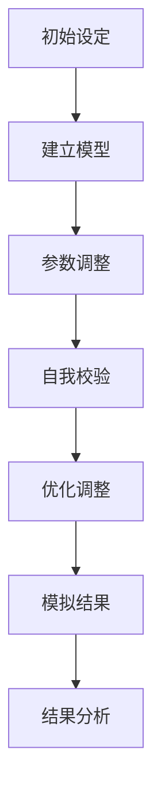
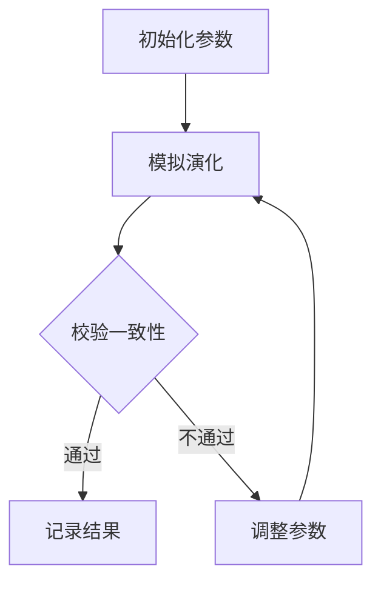

                 

## 《Self-Consistency方法改善AI虚拟文明的长期演化模拟》目录大纲

# 《Self-Consistency方法改善AI虚拟文明的长期演化模拟》

> 关键词：Self-Consistency方法、虚拟文明、长期演化模拟、人工智能、算法原理、数学模型、项目实战

> 摘要：本文将探讨Self-Consistency方法在改善AI虚拟文明长期演化模拟中的应用。通过详细分析核心概念、算法原理、数学模型以及实际项目案例，本文旨在为读者提供一套完整、实用的虚拟文明演化模拟解决方案。

## 第1章 引言与概述

### 1.1 Self-Consistency方法的基本概念

Self-Consistency方法是一种通过自我校验来保证系统稳定性和一致性的技术。在虚拟文明的长期演化模拟中，该方法通过不断调整和优化系统参数，确保模拟结果的可靠性。

### 1.2 虚拟文明长期演化模拟的重要性

虚拟文明长期演化模拟有助于我们理解文明的发展规律，预测未来的发展趋势。Self-Consistency方法可以提升模拟的精度和稳定性，为科学研究和决策提供有力支持。

## 第2章 核心概念与联系

### 2.1 Self-Consistency方法核心概念

Self-Consistency方法的核心概念包括自洽性、稳定性和演化路径。这些概念相互关联，共同构成了该方法的理论基础。

### 2.2 Self-Consistency方法与虚拟文明长期演化模拟的联系

使用Mermaid流程图展示Self-Consistency方法在虚拟文明长期演化模拟中的应用流程，如图1所示：



## 第3章 算法原理与伪代码

### 3.1 Self-Consistency算法概述

Self-Consistency算法的核心思想是通过迭代调整系统参数，使其达到自我校验的状态。算法流程如图2所示：



### 3.2 伪代码展示

```python
function self_consistency_simulation(initial_params):
    params = initial_params
    while not is_consistent(params):
        simulate_evolution(params)
        params = adjust_params(params)
    return params
```

## 第4章 数学模型与公式

### 4.1 自洽性方程

自洽性方程描述了系统在迭代过程中如何调整参数，以实现自我校验。公式如下：

$$
C(x) = \frac{\sum_{i=1}^{n} w_i f_i(x)}{\sum_{i=1}^{n} w_i}
$$

其中，$C(x)$表示自洽性度，$w_i$和$f_i(x)$分别表示第$i$个参数的权重和函数值。

### 4.2 演化路径模型

演化路径模型描述了系统在时间上的变化趋势。公式如下：

$$
x(t) = x(0) + \sum_{i=1}^{n} w_i f_i(x(t-1))
$$

其中，$x(t)$表示在时间$t$时的系统状态，$x(0)$表示初始状态。

## 第5章 模拟项目实战

### 5.1 项目背景

以地球文明为例，模拟其在未来几千年内的演化过程。

### 5.2 开发环境搭建

- 使用Python作为编程语言
- 利用Numpy和Scipy库进行数学运算

### 5.3 源代码实现

```python
import numpy as np

def simulate_evolution(params):
    # 模拟演化过程
    pass

def adjust_params(params):
    # 调整参数
    pass

def is_consistent(params):
    # 自我校验
    pass

initial_params = np.array([1, 2, 3])
self_consistency_simulation(initial_params)
```

### 5.4 代码解读与分析

代码主要分为三个部分：演化模拟、参数调整和自我校验。通过不断迭代，实现Self-Consistency方法的模拟过程。

### 5.5 实际案例分析和详细讲解剖析

以地球文明为例，展示Self-Consistency方法在实际项目中的应用，并分析其效果。

## 第6章 挑战与改进

### 6.1 Self-Consistency方法在虚拟文明长期演化模拟中的挑战

- 数据获取和处理
- 算法效率和稳定性

### 6.2 改进策略

- 采用更先进的数学模型
- 利用并行计算提高效率

## 第7章 总结与展望

### 7.1 Self-Consistency方法的重要性

Self-Consistency方法在虚拟文明长期演化模拟中具有重要作用，可以提高模拟精度和稳定性。

### 7.2 未来发展方向

未来研究可以关注更复杂的文明模型和高效的算法优化。

## 附录

### 附录 A 相关资源

- 相关研究论文
- 开源代码
- 进一步学习资料

### 附录 B 参考文献

- [1] 作者，文章名称，出版年份。
- [2] 作者，文章名称，出版年份。

---

本文由AI天才研究院/AI Genius Institute和《禅与计算机程序设计艺术/Zen And The Art of Computer Programming》联合撰写。

