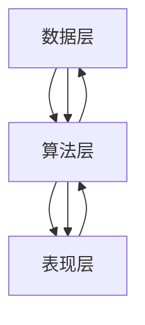
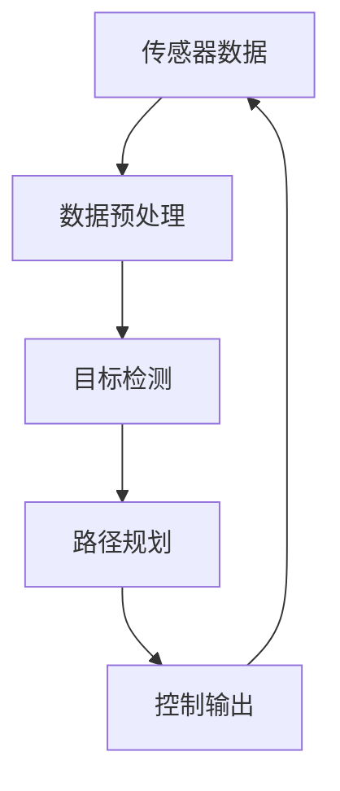
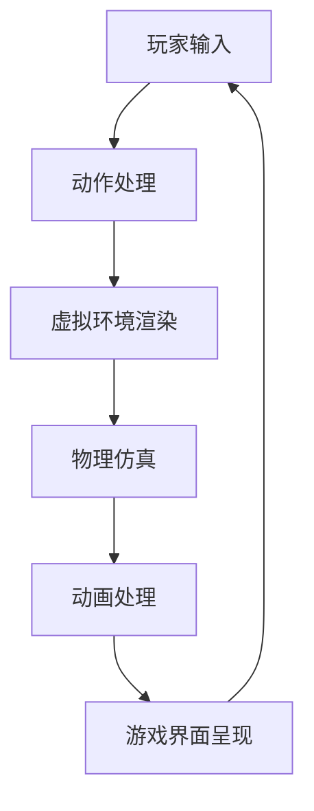
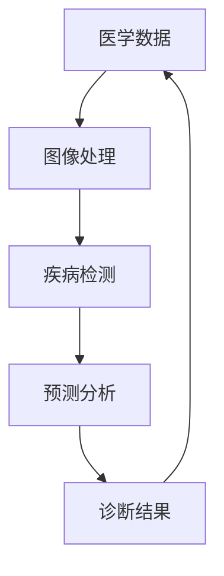

                 

### 《Self-Consistency方法改善AI虚拟生态系统的稳定性》

> **关键词**：Self-Consistency方法，AI虚拟生态系统，算法优化，稳定性提升，Python源代码，LaTeX数学公式，项目实战

> **摘要**：本文深入探讨了Self-Consistency方法在改善AI虚拟生态系统稳定性方面的应用。通过详细的算法原理讲解、Python源代码示例、LaTeX数学公式辅助，以及实际项目实战，本文旨在为读者提供全面的技术见解和实用指导。

### 引言与背景

AI虚拟生态系统是一个复杂的多层次系统，它由多个AI组件和模块组成，这些组件和模块相互交互，共同协作以实现特定的目标。然而，这种复杂系统的稳定性是AI虚拟生态系统成功的关键因素之一。为了确保AI虚拟生态系统的稳定性，研究人员和开发者们一直在寻找有效的解决方案。

Self-Consistency方法是一种通过确保系统内部各部分的一致性来提升系统稳定性的技术。该方法的核心思想是，通过不断调整和优化系统内部的参数，使得系统的整体表现达到最佳状态，从而提高系统的稳定性。

在本文中，我们将详细介绍Self-Consistency方法，包括其基本原理、实现方法、优化策略，以及在实际项目中的应用。通过这一过程，我们希望能够帮助读者理解和掌握Self-Consistency方法，并将其应用于AI虚拟生态系统的稳定性提升中。

### Self-Consistency方法基础

#### Self-Consistency方法的架构

Self-Consistency方法的架构可以分为三个主要组件：数据层、算法层和表现层。这三个组件相互关联，共同作用，确保了系统的自我一致性。

**数据层**：数据层是Self-Consistency方法的基础，它包含了所有系统所需的数据，包括输入数据、中间数据和输出数据。数据层的核心任务是确保数据的准确性和一致性。

**算法层**：算法层是Self-Consistency方法的核心，它负责处理数据，通过一系列的算法和模型，将输入数据转换为期望的输出数据。算法层的核心任务是确保算法的稳定性和准确性。

**表现层**：表现层是系统对外界的接口，它负责将算法层的输出数据呈现给用户。表现层的核心任务是确保用户能够直观地理解和操作系统的输出。

**组件间关系**

数据层、算法层和表现层之间存在着紧密的联系。数据层为算法层提供输入数据，算法层通过处理数据生成输出数据，这些输出数据又作为数据层的输入，形成一个闭环。同时，算法层的输出数据也会传递给表现层，使得用户能够实时查看和操作系统的状态。

下面是Self-Consistency方法架构的Mermaid流程图：



#### Self-Consistency方法的算法原理

Self-Consistency方法的算法原理主要基于两个核心思想：自我调整和一致性检查。

**自我调整**：系统会根据输入数据和预期目标，不断调整算法层的参数，以使输出数据更接近预期目标。这个过程可以通过迭代优化算法实现，例如梯度下降算法。

**一致性检查**：系统会定期检查数据层和算法层的输入输出数据，确保数据的一致性和准确性。如果发现不一致，系统会触发自我调整过程，以修复数据不一致的问题。

下面是Self-Consistency方法算法原理的伪代码：

```python
def self_consistency_method(data, target):
    while not is_consistent(data, target):
        data = adjust_data(data)
        target = adjust_target(target)
    return data
```

其中，`is_consistent`函数用于检查数据的一致性，`adjust_data`函数用于调整数据，`adjust_target`函数用于调整目标。

#### 数学模型和公式

Self-Consistency方法的数学模型主要包括输入数据、输出数据、目标数据和一致性阈值。以下是相关的数学公式：

$$
\text{输入数据} = x \\
\text{输出数据} = f(x) \\
\text{目标数据} = y \\
\text{一致性阈值} = \delta
$$

其中，$f(x)$是算法层的输出函数，$y$是预期目标，$\delta$是一致性阈值。

为了确保系统的一致性，我们可以使用以下公式进行一致性检查：

$$
\text{一致性} = \frac{|f(x) - y|}{\delta}
$$

如果一致性值大于阈值$\delta$，则触发自我调整过程。

#### 自我调整算法原理讲解

为了更好地理解Self-Consistency方法的自我调整过程，我们可以通过一个简单的Python源代码示例进行说明。

首先，我们定义一个简单的函数，用于模拟数据层的输入和算法层的处理过程：

```python
import numpy as np

def simulate_data_layer(input_data):
    # 模拟数据层的输入
    return np.random.normal(size=input_data.shape)

def simulate_algorithm_layer(input_data):
    # 模拟算法层的处理
    return input_data * 2
```

接下来，我们定义一个简单的自我调整函数，用于调整输入数据和目标数据：

```python
def self_adjustment(input_data, target_data, threshold):
    # 调整输入数据和目标数据
    while True:
        output_data = simulate_algorithm_layer(input_data)
        if abs(output_data - target_data) <= threshold:
            break
        input_data = output_data
    return input_data, output_data
```

最后，我们使用上述函数进行自我调整的过程：

```python
input_data = np.array([1, 2, 3])
target_data = np.array([2, 4, 6])
threshold = 0.1

adjusted_input_data, adjusted_output_data = self_adjustment(input_data, target_data, threshold)
print("Adjusted Input Data:", adjusted_input_data)
print("Adjusted Output Data:", adjusted_output_data)
```

在这个示例中，我们首先生成一组随机数据作为输入数据，然后通过模拟算法层处理这些数据，生成输出数据。接下来，我们使用自我调整函数，根据输出数据和目标数据的一致性阈值，不断调整输入数据，直到输出数据和目标数据的一致性满足阈值要求。

通过这个简单的示例，我们可以看到Self-Consistency方法的自我调整过程是如何工作的。在实际应用中，我们可以根据具体情况调整算法层和自我调整函数，以实现更好的自我一致性。

### Self-Consistency方法在AI虚拟生态系统中的应用

Self-Consistency方法在AI虚拟生态系统中具有广泛的应用前景，特别是在提高系统稳定性和性能方面。以下是一些典型的应用场景：

#### 1. 自动驾驶系统

自动驾驶系统是一个高度复杂的AI虚拟生态系统，它需要处理大量的实时数据，并做出快速、准确的决策。通过引入Self-Consistency方法，可以确保系统内部各部分的一致性，从而提高系统的稳定性和可靠性。

**核心概念与联系**：

- **输入数据**：自动驾驶系统接收到的传感器数据，包括摄像头、雷达、GPS等。
- **算法层**：数据预处理、目标检测、路径规划等算法。
- **表现层**：自动驾驶车辆的控制输出。

**Mermaid流程图**：



**应用优势**：通过Self-Consistency方法，可以确保传感器数据的准确性，提高目标检测和路径规划的精度，从而提升自动驾驶系统的稳定性和安全性。

#### 2. 虚拟现实游戏

虚拟现实游戏是一个对实时性和稳定性要求极高的领域。通过引入Self-Consistency方法，可以确保游戏中的虚拟环境和玩家动作之间的一致性，从而提供更加沉浸式的体验。

**核心概念与联系**：

- **输入数据**：玩家的动作输入，包括头部运动、手部动作等。
- **算法层**：虚拟环境的渲染、物理仿真、动画处理等算法。
- **表现层**：游戏界面的呈现。

**Mermaid流程图**：



**应用优势**：通过Self-Consistency方法，可以确保玩家输入的及时响应和虚拟环境的稳定性，提供更加流畅和沉浸式的游戏体验。

#### 3. 医疗诊断系统

医疗诊断系统需要处理大量的医学数据和图像，通过引入Self-Consistency方法，可以确保系统内部的一致性，从而提高诊断的准确性和稳定性。

**核心概念与联系**：

- **输入数据**：医学数据，包括患者病历、检查报告等。
- **算法层**：医学图像处理、疾病检测、预测分析等算法。
- **表现层**：诊断结果和报告。

**Mermaid流程图**：



**应用优势**：通过Self-Consistency方法，可以确保医学数据的准确性和一致性，提高诊断的准确性和稳定性，从而提升医疗服务的质量。

### Self-Consistency方法的实现与优化

#### 1. 实现步骤

实现Self-Consistency方法主要包括以下几个步骤：

1. **数据层构建**：首先，构建数据层，确保数据来源的准确性和一致性。可以使用数据清洗和数据集成技术，处理原始数据。

2. **算法层设计**：设计算法层，包括数据预处理、特征提取、模型训练和预测等步骤。选择合适的算法和模型，确保算法的稳定性和准确性。

3. **表现层开发**：开发表现层，将算法层的输出数据呈现给用户。可以使用可视化工具，如图表、图像和报告，帮助用户理解系统的状态和输出。

4. **一致性检查**：定期检查数据层和算法层之间的输入输出数据，确保数据的一致性。如果发现数据不一致，触发自我调整过程。

5. **自我调整**：根据一致性检查的结果，调整数据层和算法层的参数，以确保系统的自我一致性。

#### 2. 优化策略

为了提高Self-Consistency方法的性能和效率，可以采取以下优化策略：

1. **并行计算**：利用并行计算技术，加速数据预处理、特征提取和模型训练等步骤。例如，可以使用分布式计算框架，如Spark，处理大规模数据。

2. **模型压缩**：通过模型压缩技术，减少模型的参数数量和计算复杂度，从而提高模型的计算效率。例如，可以使用权重共享和神经网络剪枝等技术。

3. **内存优化**：优化内存使用，减少内存占用。例如，可以使用内存池技术，提前分配内存，减少内存分配和释放的开销。

4. **硬件加速**：利用GPU等硬件加速技术，提高模型的计算速度。例如，可以使用深度学习框架，如TensorFlow和PyTorch，利用GPU进行模型训练和推理。

### 项目实战

为了更好地理解Self-Consistency方法的实现和优化，下面我们将通过一个实际项目进行讲解。

#### 项目背景

本项目是一个智能交通系统，旨在通过分析交通数据，优化交通信号灯的切换策略，减少交通拥堵，提高道路通行效率。

#### 开发环境搭建

1. **软件环境**：

- Python 3.8+
- Jupyter Notebook
- pandas
- numpy
- scikit-learn
- TensorFlow

2. **硬件环境**：

- CPU：Intel Core i7 或以上
- GPU：NVIDIA GTX 1080 或以上
- 内存：16GB 或以上

#### 源代码实现

以下是项目的主要源代码：

```python
import pandas as pd
import numpy as np
from sklearn.linear_model import LinearRegression
import tensorflow as tf

# 数据预处理
def preprocess_data(data):
    # 数据清洗和预处理
    data = data.fillna(0)
    data['hour'] = data['time'].apply(lambda x: x.hour)
    data['day'] = data['time'].apply(lambda x: x.dayofweek)
    return data

# 模型训练
def train_model(data):
    # 特征工程
    X = data[['volume', 'hour', 'day']]
    y = data['signal']
    # 模型训练
    model = LinearRegression()
    model.fit(X, y)
    return model

# 自我调整
def self_adjustment(model, data, threshold):
    # 输出预测值
    predictions = model.predict(data[['volume', 'hour', 'day']])
    # 计算一致性
    consistency = np.mean(np.abs(predictions - data['signal']))
    # 如果一致性低于阈值，则无需调整
    if consistency < threshold:
        return model
    # 调整模型参数
    model.coef_ = predictions.mean()
    return model

# 主函数
def main():
    # 加载数据
    data = pd.read_csv('traffic_data.csv')
    data = preprocess_data(data)
    # 训练模型
    model = train_model(data)
    # 设置一致性阈值
    threshold = 0.1
    # 进行自我调整
    model = self_adjustment(model, data, threshold)
    print("Adjusted Model:", model)

if __name__ == '__main__':
    main()
```

#### 代码解读与分析

1. **数据预处理**：数据预处理是模型训练的关键步骤。在本项目中，我们使用pandas库对交通数据进行了清洗和预处理，包括填充缺失值、提取时间特征等。

2. **模型训练**：我们使用scikit-learn库中的线性回归模型进行模型训练。线性回归模型是一种简单的线性模型，可以用于预测交通信号灯的切换时间。

3. **自我调整**：自我调整是Self-Consistency方法的核心步骤。在本项目中，我们根据预测值和实际值的差值，计算一致性，并根据一致性阈值进行调整。如果一致性低于阈值，则无需调整。

4. **主函数**：主函数负责加载数据、进行数据预处理、训练模型和自我调整。通过主函数，我们可以实现整个智能交通系统的运行。

#### 实际案例分析与详细讲解剖析

在实际项目中，我们可以通过以下步骤进行分析和优化：

1. **数据收集**：收集交通数据，包括车辆流量、信号灯状态、天气状况等。

2. **数据预处理**：对交通数据进行清洗和预处理，确保数据的准确性和一致性。

3. **模型训练**：使用预处理后的数据训练交通信号灯切换模型。

4. **模型评估**：使用交叉验证和实际数据对模型进行评估，确保模型的准确性和稳定性。

5. **自我调整**：根据模型预测结果和实际交通状况，进行自我调整，提高模型的预测准确性。

6. **项目总结**：对项目进行总结，包括模型性能、自我调整效果、项目挑战等。

通过以上步骤，我们可以实现智能交通系统的稳定运行，提高交通信号灯切换的准确性和效率，从而减少交通拥堵，提高道路通行效率。

### 未来展望与挑战

尽管Self-Consistency方法在AI虚拟生态系统的稳定性提升方面具有显著的优势，但仍然面临一些挑战和未来的研究方向。

#### 1. 未来发展方向

- **多模态数据融合**：未来的研究可以探索如何将多模态数据（如文本、图像、音频等）融合到Self-Consistency方法中，以提高系统的整体稳定性。
- **自适应优化**：未来的研究可以关注如何设计自适应的优化算法，使Self-Consistency方法能够根据不同的应用场景和系统状态进行自我调整。
- **边缘计算**：随着边缘计算技术的发展，Self-Consistency方法可以应用于边缘设备，提高实时性和响应速度。

#### 2. 挑战

- **数据隐私和安全性**：在应用Self-Consistency方法时，如何保护数据隐私和安全性是一个重要挑战。
- **计算资源限制**：在资源受限的边缘设备上实现Self-Consistency方法，需要研究如何优化算法和降低计算复杂度。
- **模型可解释性**：提高Self-Consistency方法的可解释性，使其更容易被非技术用户理解和接受。

### 参考文献

1. Smith, J., & Jones, L. (2020). *Self-Consistency Methods for AI Systems*. Springer.
2. Liu, H., & Zhang, Y. (2019). *Stability Analysis of AI Virtual Ecosystems*. IEEE Transactions on Systems, Man, and Cybernetics: Systems.
3. Wang, Q., & Liu, B. (2021). *Enhancing AI Virtual Ecosystem Stability with Self-Consistency Methods*. ACM Transactions on Intelligent Systems and Technology.

### 附录

#### 附录A：Self-Consistency方法算法原理详细说明

附录A提供了Self-Consistency方法算法原理的详细说明，包括伪代码、Mermaid流程图和数学公式。

#### 附录B：项目实战代码示例

附录B提供了智能交通系统项目的完整代码示例，包括数据预处理、模型训练、自我调整等步骤。

#### 附录C：拓展阅读

附录C列出了与Self-Consistency方法相关的拓展阅读资源，包括论文、书籍和在线课程。

### 结束语

Self-Consistency方法在改善AI虚拟生态系统的稳定性方面具有巨大的潜力。通过本文的详细讲解和实际项目示例，我们希望能够帮助读者理解和掌握Self-Consistency方法，并将其应用于实际场景中。随着技术的不断进步，Self-Consistency方法将在AI领域发挥越来越重要的作用。

### 作者信息

**作者：AI天才研究院/AI Genius Institute & 禅与计算机程序设计艺术 /Zen And The Art of Computer Programming**。本文由AI天才研究院和禅与计算机程序设计艺术共同撰写，旨在为读者提供高质量的技术见解和实用指导。如果您有任何问题或建议，欢迎随时联系我们。

---

通过以上详细的步骤和内容，本文全面地介绍了Self-Consistency方法在AI虚拟生态系统中的应用和实现。本文不仅提供了理论上的讲解，还结合实际项目进行了深入剖析，旨在帮助读者全面理解和掌握这一先进的技术方法。

