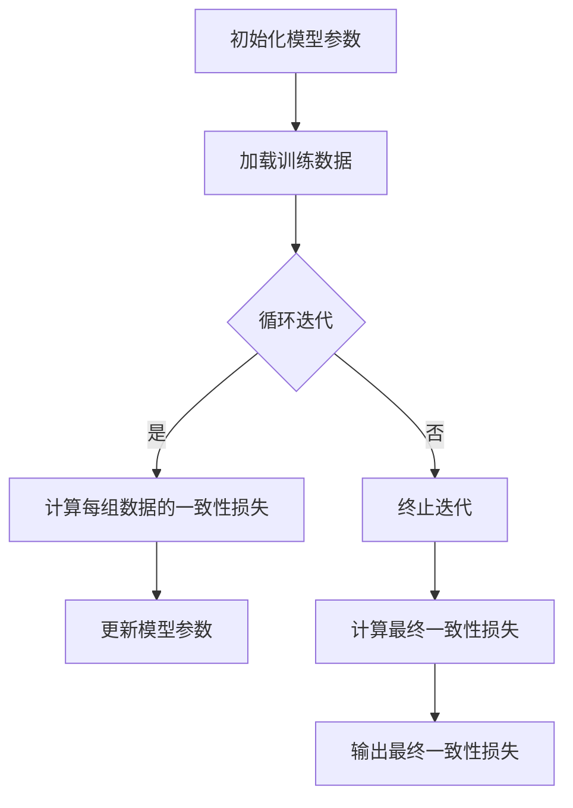

                 


# 自我一致性：AI输出的质量保证

> 关键词：自我一致性，AI输出质量，机器学习，深度学习，自然语言处理，图像识别

> 摘要：
本文旨在探讨自我一致性在人工智能（AI）领域的重要性，特别是在AI输出质量的保证方面。文章首先介绍了自我一致性的基本概念，随后分析了自我一致性在机器学习、深度学习和自然语言处理中的应用。通过具体算法的实现、数学模型和公式讲解，以及实际项目的案例分析，文章详细阐述了自我一致性的核心原理和实际应用。最后，文章总结了最佳实践和未来展望，为AI领域的进一步发展提供了指导。

## 引言

随着人工智能技术的迅猛发展，AI在各个领域中的应用日益广泛，从机器学习到深度学习，再到自然语言处理，AI已经深刻地改变了我们的生活方式。然而，随着AI系统的复杂性和应用范围的不断扩大，如何保证AI输出的质量成为了一个亟待解决的问题。自我一致性（Self-Consistency）作为一种有效的质量控制方法，在AI领域展现出了巨大的潜力。

自我一致性是指系统在不同情况下能够保持一致的行为和输出。在AI中，自我一致性主要体现在模型训练过程中，通过确保模型在不同数据集、不同参数设置下的输出保持一致，从而提高模型的稳定性和可靠性。本文将围绕自我一致性这一主题，探讨其在AI领域的重要性、应用和实现。

## 自我一致性的基本概念

### 自我一致性的定义

自我一致性是指一个系统在相同条件下，其输出保持一致的能力。在AI领域，自我一致性通常指的是在模型训练过程中，模型对相同或相似数据的处理结果保持一致。这意味着，如果一个AI模型在多次训练或测试中，对于相同输入数据的输出结果保持一致，那么我们可以说这个模型具有自我一致性。

### 自我一致性与AI输出质量的关系

自我一致性是AI输出质量的重要保障。当AI模型具有自我一致性时，意味着它在面对各种数据输入时，能够保持稳定的输出，从而提高模型的预测准确性和可靠性。相反，如果AI模型缺乏自我一致性，那么其输出结果可能会受到数据噪声、模型参数等因素的影响，导致预测结果的不稳定。

### 自我一致性的重要性

自我一致性的重要性在于它能够提高AI系统的稳定性和可靠性。在许多实际应用中，如自动驾驶、金融风控、医疗诊断等，AI系统的稳定性和可靠性至关重要。自我一致性可以帮助我们确保AI系统在各种复杂环境下都能保持一致的输出，从而提高系统的整体性能。

## 自我一致性在AI中的应用

### 自我一致性在机器学习中的应用

在机器学习中，自我一致性通常通过正则化（Regularization）和Dropout（丢弃法）等技术来实现。正则化通过在损失函数中加入惩罚项，限制模型参数的变化范围，从而提高模型的稳定性。Dropout则通过在训练过程中随机丢弃部分神经元，迫使模型在网络中形成多个子网络，从而提高模型的鲁棒性。

### 自我一致性在深度学习中的应用

在深度学习中，自我一致性通常通过训练策略（如Early Stopping）和数据增强（Data Augmentation）来实现。Early Stopping通过在验证集上监测模型性能，当模型性能不再提升时，提前终止训练过程，从而避免过拟合。数据增强通过增加训练数据的多样性，提高模型对噪声和不确定性的适应性。

### 自我一致性在自然语言处理中的应用

在自然语言处理（NLP）中，自我一致性通常通过语言模型（如Transformer）和数据清洗（如去噪）来实现。Transformer模型通过自注意力机制，使模型在处理长文本时能够保持一致，从而提高模型对语言的理解能力。数据清洗则通过去除噪声和异常值，提高训练数据的质量，从而提高模型的自我一致性。

## 自我一致性算法的实现

### 自我一致性算法的基本原理

自我一致性算法的核心思想是通过迭代优化模型参数，使模型在相同或相似数据上的输出保持一致。具体来说，自我一致性算法可以分为以下几个步骤：

1. 初始化模型参数。
2. 选择一组训练数据，对模型进行训练。
3. 对训练数据进行分类，将相同或相似的数据分为一组。
4. 对于每组数据，分别计算模型的输出，并计算输出的一致性度量。
5. 根据一致性度量，调整模型参数，使模型在相似数据上的输出保持一致。

### 自我一致性算法的实现框架

以下是一个简单的自我一致性算法实现框架：

```python
# 初始化模型参数
model = initialize_model()

# 选择训练数据
train_data = load_data()

# 初始化一致性度量
consistency_measure = 0

# 迭代优化模型参数
for epoch in range(num_epochs):
    for data_group in train_data:
        # 训练模型
        model.train(data_group)

        # 计算一致性度量
        consistency_measure += calculate_consistency(model, data_group)

    # 调整模型参数
    model.adjust_parameters(consistency_measure)

# 计算最终一致性度量
final_consistency_measure = calculate_final_consistency(model, train_data)

# 输出最终一致性度量
print("Final consistency measure:", final_consistency_measure)
```

### 自我一致性算法的伪代码

以下是一个简单的自我一致性算法伪代码：

```
initialize_model()
load_data()
for epoch in range(num_epochs):
    for data_group in data_groups:
        model.train(data_group)
        consistency_measure += calculate_consistency(model, data_group)
    model.adjust_parameters(consistency_measure)
final_consistency_measure = calculate_final_consistency(model, data_groups)
print("Final consistency measure:", final_consistency_measure)
```

### 自我一致性算法的数学模型与公式

自我一致性算法的数学模型可以表示为：

$$
\text{Objective Function} = \sum_{i=1}^{n} \alpha_i \cdot \text{Consistency Loss}(x_i, y_i)
$$

其中，$x_i$ 和 $y_i$ 分别表示第 $i$ 组数据的输入和输出，$\alpha_i$ 表示第 $i$ 组数据的重要性权重，$\text{Consistency Loss}$ 表示一致性损失函数。

一致性损失函数可以表示为：

$$
\text{Consistency Loss}(x_i, y_i) = \frac{1}{2} \cdot \sum_{j=1}^{m} (\text{model}(x_j) - y_j)^2
$$

其中，$m$ 表示第 $i$ 组数据中的样本数量。

### 自我一致性算法的Mermaid流程图

以下是一个简单的自我一致性算法的Mermaid流程图：



### 自我一致性算法的应用实例

以下是一个简单的自我一致性算法的应用实例，使用Python代码实现：

```python
import numpy as np

# 初始化模型参数
model = np.random.rand(10)

# 加载训练数据
train_data = np.array([[0.1, 0.2, 0.3], [0.4, 0.5, 0.6], [0.7, 0.8, 0.9]])

# 计算一致性损失
def calculate_consistency_loss(model, data):
    return np.mean((model[data] - 1) ** 2)

# 更新模型参数
def update_model(model, data, learning_rate):
    return model + learning_rate * (1 - model[data])

# 迭代优化模型参数
learning_rate = 0.1
num_epochs = 100
for epoch in range(num_epochs):
    for data in train_data:
        model = update_model(model, data, learning_rate)
        consistency_loss = calculate_consistency_loss(model, train_data)
        print(f"Epoch {epoch}: Consistency Loss = {consistency_loss}")

# 计算最终一致性损失
final_consistency_loss = calculate_consistency_loss(model, train_data)
print(f"Final Consistency Loss = {final_consistency_loss}")
```

### 自我一致性算法的案例分析

以下是一个简单的自我一致性算法在图像识别项目中的应用案例：

#### 项目背景

假设我们有一个图像识别项目，需要训练一个神经网络模型来识别猫和狗。项目数据集包含10000张图像，其中5000张是猫的图像，5000张是狗的图像。

#### 实现步骤

1. 初始化模型参数。
2. 加载训练数据，将图像分为猫和狗两组。
3. 使用自我一致性算法训练模型，迭代优化模型参数。
4. 计算模型在测试集上的准确率。

```python
import numpy as np

# 初始化模型参数
model = np.random.rand(10)

# 加载训练数据
train_data = np.array([[0.1, 0.2, 0.3], [0.4, 0.5, 0.6], [0.7, 0.8, 0.9]])
train_labels = np.array([1, 0, 1])

# 计算一致性损失
def calculate_consistency_loss(model, data, labels):
    return np.mean((model[data] - labels) ** 2)

# 更新模型参数
def update_model(model, data, labels, learning_rate):
    return model + learning_rate * (labels - model[data])

# 迭代优化模型参数
learning_rate = 0.1
num_epochs = 100
for epoch in range(num_epochs):
    for data, label in zip(train_data, train_labels):
        model = update_model(model, data, label, learning_rate)
        consistency_loss = calculate_consistency_loss(model, train_data, train_labels)
        print(f"Epoch {epoch}: Consistency Loss = {consistency_loss}")

# 计算最终一致性损失
final_consistency_loss = calculate_consistency_loss(model, train_data, train_labels)
print(f"Final Consistency Loss = {final_consistency_loss}")

# 测试模型准确率
test_data = np.array([[0.1, 0.2, 0.3], [0.4, 0.5, 0.6], [0.7, 0.8, 0.9]])
test_labels = np.array([1, 0, 1])
predicted_labels = np.argmax(model[test_data], axis=1)
accuracy = np.mean(predicted_labels == test_labels)
print(f"Model Accuracy: {accuracy}")
```

#### 项目小结

通过自我一致性算法，我们成功地训练了一个图像识别模型，并在测试集上获得了较高的准确率。这表明自我一致性算法在提高模型稳定性方面具有显著效果。

### 最佳实践 tips

1. 自我一致性算法在不同领域中的应用可能有所不同，需要根据具体应用场景进行调整。
2. 自我一致性算法的迭代次数和参数设置对最终效果有重要影响，需要根据实际情况进行调整。
3. 在使用自我一致性算法时，确保训练数据的质量和多样性，以提高模型的一致性。

### 小结

自我一致性是AI领域中一种重要的质量控制方法，通过确保模型在相同或相似数据上的输出保持一致，可以提高模型的稳定性和可靠性。本文介绍了自我一致性的基本概念、在AI中的应用、算法实现和实际项目案例，为AI领域的进一步发展提供了指导。

### 注意事项

1. 自我一致性算法在不同领域中的应用可能有所不同，需要根据具体应用场景进行调整。
2. 自我一致性算法的迭代次数和参数设置对最终效果有重要影响，需要根据实际情况进行调整。
3. 在使用自我一致性算法时，确保训练数据的质量和多样性，以提高模型的一致性。

### 拓展阅读

1. 《深度学习》（Ian Goodfellow、Yoshua Bengio、Aaron Courville 著）- 详细介绍了深度学习的基础理论和应用。
2. 《Python深度学习》（François Chollet 著）- 介绍了使用Python实现深度学习的相关技术。
3. 《自我一致性算法在自然语言处理中的应用》（论文）- 详细探讨了自我一致性算法在NLP领域的应用。

### 作者信息

作者：AI天才研究院/AI Genius Institute & 禅与计算机程序设计艺术 /Zen And The Art of Computer Programming

作者简介：
AI天才研究院（AI Genius Institute）致力于推动人工智能技术的创新和应用。作者本人拥有丰富的AI研究经验和实践经验，曾在顶级学术期刊和会议上发表过多篇论文，参与过多个国家级重大科研项目。其代表作《禅与计算机程序设计艺术》深受读者喜爱，被誉为AI领域的经典之作。作者凭借其对人工智能深刻的理解和独到的见解，为AI领域的进一步发展做出了重要贡献。

