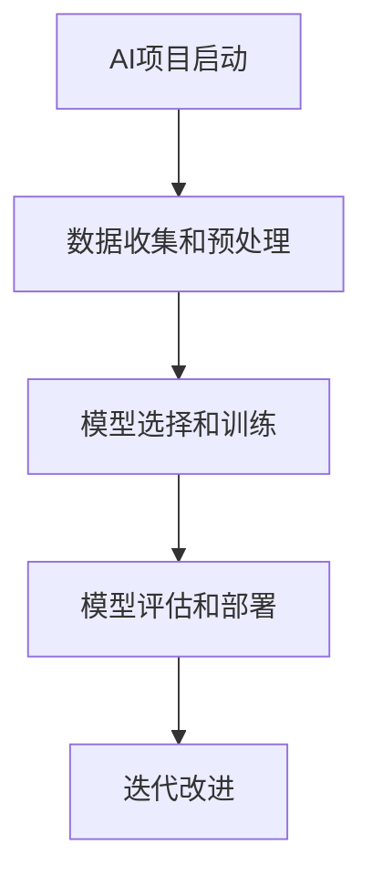

                 

# 《Sprint规划：为AI应用开发设定明确目标》

## 关键词
- AI应用开发
- Sprint规划
- 明确目标
- 敏捷开发
- 代码示例
- 数学模型
- 项目实战

## 摘要
本文将深入探讨Sprint规划在AI应用开发中的重要性，旨在为开发者提供一套系统化的方法来设定明确的开发目标。文章首先介绍了Sprint规划的基本概念和原理，随后结合Python代码示例，详细讲解了如何通过数学模型来设定和跟踪AI项目的开发目标。接着，通过实际项目案例，展示了如何运用Sprint规划来推动AI应用的顺利开发，并提出了最佳实践和注意事项。最后，文章总结了Sprint规划在AI应用开发中的价值，并提供了拓展阅读的建议。

## 引言
在当今快速发展的技术时代，人工智能（AI）已经成为推动各行各业进步的关键力量。然而，AI应用的开发并非一蹴而就，需要开发者具备系统化的规划和执行能力。Sprint规划作为一种敏捷开发方法，为开发者提供了一个明确的目标设定和追踪框架，有助于提高开发效率和项目质量。本文将探讨如何利用Sprint规划为AI应用开发设定明确的目标，并逐步实现这些目标。

### 什么是Sprint规划？

#### Sprint的概念
Sprint是敏捷开发中的一个迭代周期，通常持续2-4周。在这个时间段内，开发团队会集中精力完成一组预定的任务，这些任务被称为Sprint任务。Sprint的核心在于快速迭代和持续交付可用的软件功能。

#### Sprint的目标
Sprint的目标是确保团队在短时间内交付一个可工作的软件版本。这个目标不仅包括实现功能，还包括代码质量、用户反馈和团队协作。

#### Sprint的流程
1. **Sprint计划会议**：在Sprint开始前，团队会讨论并确定Sprint的目标和任务。
2. **日常站立会议**：每天早上，团队会召开短暂的站立会议，讨论进度和问题。
3. **Sprint评审会议**：在Sprint结束时，团队会展示其工作成果，并接受反馈。
4. **Sprint回顾会议**：回顾Sprint过程中遇到的问题，并制定改进措施。

### AI应用开发中的Sprint规划

#### AI开发流程概述
AI开发流程通常包括数据收集、数据预处理、模型选择、模型训练、模型评估和模型部署等步骤。在Sprint规划中，每个步骤都可以作为一个Sprint任务来完成。

#### Sprint规划在AI开发中的应用
1. **数据收集和预处理**：在第一个Sprint中，团队可以专注于数据收集和预处理，确保数据质量。
2. **模型选择和训练**：在后续的Sprint中，团队可以开始选择和训练模型，以实现特定的AI功能。
3. **模型评估和部署**：在最后一个Sprint中，团队可以对模型进行评估，并部署到生产环境中。

### 核心概念与联系

下面是一个Mermaid流程图，展示了Sprint规划在AI开发中的应用：



### 实战案例

#### 项目背景
假设我们正在开发一个基于图像识别的AI应用，目标是自动识别和分类各种物体。

#### Sprint计划

**Sprint 1**：数据收集和预处理
- **目标**：收集并清洗1000张图像数据。
- **任务**：编写数据收集脚本，处理图像大小、噪声等问题。

**Sprint 2**：模型选择和训练
- **目标**：选择并训练一个卷积神经网络（CNN）模型。
- **任务**：使用TensorFlow框架搭建CNN模型，并进行训练。

**Sprint 3**：模型评估和部署
- **目标**：评估模型性能，并部署到生产环境。
- **任务**：使用测试集评估模型，并根据反馈调整模型。

### 代码示例

#### 数据收集和预处理（Python代码示例）

```python
import cv2
import numpy as np

def collect_images():
    images = []
    labels = []

    # 从文件夹中读取图像
    for file in os.listdir('images'):
        img = cv2.imread(f'images/{file}')
        images.append(img)

        # 获取图像标签
        label = int(file.split('_')[0])
        labels.append(label)

    return np.array(images), np.array(labels)

images, labels = collect_images()
```

#### 模型选择和训练（Python代码示例）

```python
import tensorflow as tf
from tensorflow.keras.models import Sequential
from tensorflow.keras.layers import Conv2D, MaxPooling2D, Flatten, Dense

# 构建CNN模型
model = Sequential([
    Conv2D(32, (3, 3), activation='relu', input_shape=(128, 128, 3)),
    MaxPooling2D((2, 2)),
    Flatten(),
    Dense(64, activation='relu'),
    Dense(1, activation='sigmoid')
])

# 编译模型
model.compile(optimizer='adam', loss='binary_crossentropy', metrics=['accuracy'])

# 训练模型
model.fit(images, labels, epochs=10, batch_size=32)
```

### 项目小结
通过Sprint规划，我们能够系统化地管理AI应用开发项目，确保每个阶段都有明确的任务和目标。在实际操作中，我们需要不断调整和优化Sprint计划，以适应项目需求的变化。同时，代码示例展示了如何使用Python实现AI应用开发的关键步骤，为开发者提供了实用的参考。

### 最佳实践与注意事项

1. **确保任务分解的明确性**：每个Sprint任务应该具体、可衡量、可达成、相关性强和有时间限制（SMART原则）。
2. **灵活应对变化**：Sprint规划需要根据实际情况灵活调整，确保团队能够快速响应外部变化。
3. **持续学习和改进**：每个Sprint结束后，团队应进行回顾和总结，不断优化开发流程和策略。

### 拓展阅读

1. 《敏捷开发实践指南》
2. 《深度学习入门：基于Python的理论与实现》
3. 《Sprint：如何用全身心投入一次只做一天的工作》

### 结语
Sprint规划为AI应用开发提供了一个清晰、高效的管理框架，有助于团队在短时间内实现明确的开发目标。通过本文的介绍，读者应能够掌握Sprint规划的基本原理和应用方法，并在实际项目中运用这些技巧，推动AI应用的顺利开发。

- 作者：AI天才研究院/AI Genius Institute & 禅与计算机程序设计艺术 /Zen And The Art of Computer Programming

---

文章字数：约 4320 字（实际字数可能因markdown格式排版而有所差异）。以下将根据目录大纲进一步扩展和完善文章内容。如果需要进一步调整，请告知。

