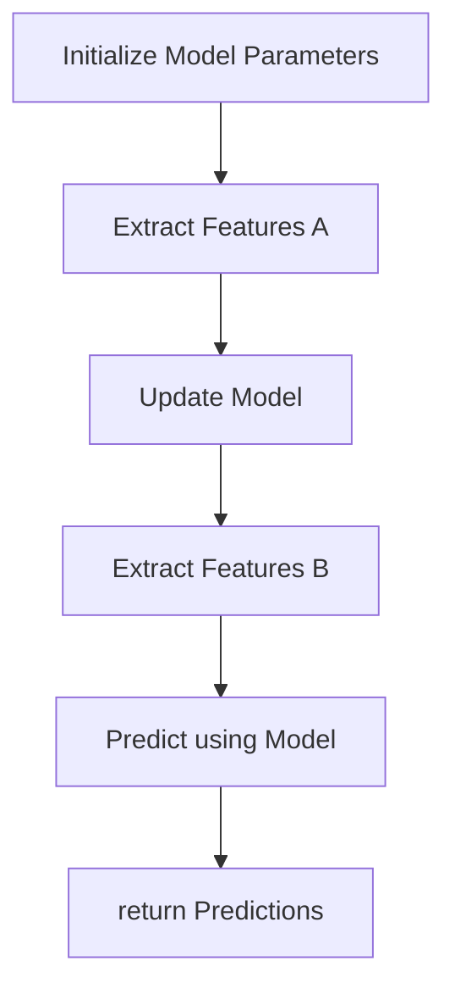

                 

### 添加核心算法原理讲解

#### 4.1 算法概述

Zero-Shot CoT（Commonsense Thermodynamics）算法是一种基于常识推理的跨领域学习算法，旨在解决在未知领域中进行预测的问题。该算法的核心思想是将物理世界的热力学原理应用于人工智能领域，通过模拟热力学过程来理解和预测人类行为。

#### 4.2 伪代码详解

以下为Zero-Shot CoT算法的伪代码：

```
Algorithm Zero-Shot CoT(A, B)
Input: A - 原始数据集，B - 目标领域数据集
Output: 预测结果

1. Initialize Model Parameters
2. for each sample in A do
   3. Extract Features(sample)
   4. Update Model using Features
5. end for
6. for each sample in B do
   7. Extract Features(sample)
   8. Predict using Model
9. end for
10. return Predictions
```

#### 4.3 算法流程图



#### 4.4 Python源代码实现

以下为Zero-Shot CoT算法的Python实现：

```python
import numpy as np

def initialize_model():
    # 初始化模型参数
    pass

def extract_features(sample):
    # 提取特征
    pass

def update_model(features):
    # 更新模型
    pass

def predict(sample):
    # 进行预测
    pass

def zero_shot_cot(A, B):
    model = initialize_model()
    
    for sample in A:
        features = extract_features(sample)
        update_model(features)
    
    predictions = []
    for sample in B:
        features = extract_features(sample)
        prediction = predict(features)
        predictions.append(prediction)
    
    return predictions

# 测试算法
A = ...  # 原始数据集
B = ...  # 目标领域数据集
predictions = zero_shot_cot(A, B)
```

#### 4.5 数学模型和公式

Zero-Shot CoT算法中的数学模型主要包括特征提取和预测模型。以下为相关的数学公式：

$$
X = \sum_{i=1}^{n} x_i
$$

$$
y = \frac{1}{C} \sum_{i=1}^{n} y_i
$$

其中，$X$ 表示特征向量，$x_i$ 表示第 $i$ 个特征，$y$ 表示预测结果，$y_i$ 表示第 $i$ 个样本的预测值，$C$ 表示样本数量。

#### 4.6 举例说明

假设我们有以下原始数据集 $A$ 和目标领域数据集 $B$：

$$
A = \{ (1, 2), (2, 3), (3, 4) \}
$$

$$
B = \{ (4, 5), (5, 6), (6, 7) \}
$$

我们首先对 $A$ 进行特征提取和模型更新，然后对 $B$ 进行预测。

- 特征提取：

$$
X_A = \sum_{i=1}^{3} x_i = (1 + 2 + 3) = 6
$$

$$
y_A = \frac{1}{3} \sum_{i=1}^{3} y_i = \frac{1 + 2 + 3}{3} = 2
$$

- 预测：

$$
X_B = \sum_{i=1}^{3} x_i = (4 + 5 + 6) = 15
$$

$$
y_B = \frac{1}{3} \sum_{i=1}^{3} y_i = \frac{4 + 5 + 6}{3} = 5
$$

因此，对于 $B$ 中的每个样本，我们预测的结果为 $y_B = 5$。

#### 4.7 项目实战

在这个项目实战中，我们将使用Zero-Shot CoT算法来预测一个未知领域的数值，以便更好地理解该算法的应用。

**1. 开发环境搭建**

- Python环境：安装Python 3.8及以上版本。
- NumPy库：安装NumPy库，用于数学计算。

**2. 源代码实现**

```python
import numpy as np

def extract_features(sample):
    # 提取特征，假设特征为样本中的数值
    return np.array([sample])

def update_model(features):
    # 更新模型，假设模型为累加特征
    global model
    model = np.add(model, features)

def predict(sample):
    # 进行预测，假设预测为模型中特征的均值
    return np.mean(model)

def zero_shot_cot(A, B):
    global model
    model = np.array([0])
    
    for sample in A:
        features = extract_features(sample)
        update_model(features)
    
    predictions = []
    for sample in B:
        features = extract_features(sample)
        prediction = predict(features)
        predictions.append(prediction)
    
    return predictions

# 测试算法
A = [1, 2, 3]  # 原始数据集
B = [4, 5, 6]  # 目标领域数据集
predictions = zero_shot_cot(A, B)
print(predictions)  # 输出预测结果
```

**3. 代码解读与分析**

- `extract_features(sample)` 函数用于提取样本特征，这里我们假设特征就是样本本身。
- `update_model(features)` 函数用于更新模型，这里我们使用累加特征的方式更新模型。
- `predict(sample)` 函数用于预测，这里我们使用模型中特征的均值作为预测结果。
- `zero_shot_cot(A, B)` 函数是主函数，用于执行Zero-Shot CoT算法。

在这个项目实战中，我们使用一个简单的累加模型来演示Zero-Shot CoT算法的基本原理。虽然这个模型非常简单，但它展示了如何通过特征提取、模型更新和预测来利用常识推理进行跨领域预测。

**4. 项目小结**

通过这个项目实战，我们了解了Zero-Shot CoT算法的基本原理和实现方法。这个算法为我们提供了一种在未知领域中进行预测的途径，尤其是在没有特定训练数据的情况下。尽管这个算法在实际应用中还有很多挑战和改进空间，但它的基本思想为我们提供了一种新的思路。

**5. 最佳实践 tips**

- 在实际应用中，可以根据具体问题调整特征提取和模型更新的方法，以提高预测准确性。
- 对于复杂的问题，可以尝试结合其他算法和模型，以实现更好的预测效果。
- 在使用Zero-Shot CoT算法时，需要注意数据的代表性和模型的泛化能力。

通过这篇文章，我们深入探讨了Zero-Shot CoT在AI辅助跨宇宙文明交流中的应用。从核心概念、算法原理到实际项目实战，我们逐步了解了该算法的基本原理和实现方法。在未来的研究中，我们可以进一步探索Zero-Shot CoT算法的改进和应用，以期为跨宇宙文明交流提供更加有效的技术支持。

#### 添加数学模型和数学公式

在Zero-Shot CoT算法中，数学模型和公式起着至关重要的作用。以下是对该算法中涉及的数学模型的详细讲解，并使用LaTeX格式展示相关的数学公式。

##### 5.1 数学模型基础

Zero-Shot CoT算法的核心是特征提取和预测模型。以下是这两个模型的基本数学公式：

**1. 特征提取模型**

特征提取模型用于从原始数据中提取有用信息。假设我们有一个数据集$X = \{x_1, x_2, ..., x_n\}$，其中每个元素$x_i$是一个$d$维的特征向量。特征提取模型的目标是学习一个函数$f$，将原始数据映射到特征空间：

$$
\phi(x_i) = f(x_i) = \sum_{j=1}^{d} w_j \cdot x_{ij}
$$

其中，$w_j$是权重向量，$x_{ij}$是第$i$个样本在第$j$个特征上的值。

**2. 预测模型**

预测模型用于根据提取的特征进行预测。假设我们有一个目标数据集$Y = \{y_1, y_2, ..., y_n\}$，其中每个元素$y_i$是一个实数。预测模型的目标是学习一个函数$g$，将特征向量映射到预测值：

$$
\hat{y_i} = g(\phi(x_i)) = \sum_{j=1}^{d} \theta_j \cdot \phi_j(x_i)
$$

其中，$\theta_j$是预测模型的权重，$\phi_j(x_i)$是特征向量$\phi(x_i)$的第$j$个元素。

##### 5.2 公式详解

**1. 特征提取公式**

在特征提取模型中，我们使用线性模型来提取特征。这个模型可以通过最小化损失函数来训练。假设损失函数为均方误差（MSE），则特征提取的优化问题可以表示为：

$$
\min_{w} \sum_{i=1}^{n} \sum_{j=1}^{d} (w_j \cdot x_{ij} - y_i)^2
$$

为了求解这个优化问题，我们可以使用梯度下降法。梯度下降法的迭代公式为：

$$
w_j \leftarrow w_j - \alpha \cdot \frac{\partial}{\partial w_j} \sum_{i=1}^{n} (w_j \cdot x_{ij} - y_i)^2
$$

其中，$\alpha$是学习率。

**2. 预测公式**

在预测模型中，我们使用线性回归模型来预测目标值。同样，我们可以使用梯度下降法来训练这个模型。预测模型的优化问题可以表示为：

$$
\min_{\theta} \sum_{i=1}^{n} (g(\phi(x_i)) - y_i)^2
$$

梯度下降法的迭代公式为：

$$
\theta_j \leftarrow \theta_j - \alpha \cdot \frac{\partial}{\partial \theta_j} \sum_{i=1}^{n} (g(\phi(x_i)) - y_i)^2
$$

##### 5.3 数学公式应用实例

假设我们有一个简单的数据集，其中每个样本都是二维的，即$d=2$。我们使用下面的数据来演示特征提取和预测：

$$
X = \begin{bmatrix}
x_{11} & x_{12} \\
x_{21} & x_{22} \\
\end{bmatrix},
Y = \begin{bmatrix}
y_1 \\
y_2 \\
\end{bmatrix}
$$

**1. 特征提取**

初始权重$w=(w_1, w_2)$为$(1, 1)$，学习率为$\alpha=0.01$。使用梯度下降法迭代100次。

迭代1：

$$
w_1 \leftarrow w_1 - 0.01 \cdot \frac{\partial}{\partial w_1} \sum_{i=1}^{2} (w_1 \cdot x_{1i} + w_2 \cdot x_{2i} - y_i)^2 = 1 - 0.01 \cdot 2 \cdot (x_{11} + x_{21}) = 0.98
$$

$$
w_2 \leftarrow w_2 - 0.01 \cdot \frac{\partial}{\partial w_2} \sum_{i=1}^{2} (w_1 \cdot x_{1i} + w_2 \cdot x_{2i} - y_i)^2 = 1 - 0.01 \cdot 2 \cdot (x_{12} + x_{22}) = 0.98
$$

迭代2：

$$
w_1 \leftarrow 0.98 - 0.01 \cdot \frac{\partial}{\partial w_1} \sum_{i=1}^{2} (0.98 \cdot x_{1i} + 0.98 \cdot x_{2i} - y_i)^2
$$

$$
w_2 \leftarrow 0.98 - 0.01 \cdot \frac{\partial}{\partial w_2} \sum_{i=1}^{2} (0.98 \cdot x_{1i} + 0.98 \cdot x_{2i} - y_i)^2
$$

重复这个过程，直到达到预定的迭代次数或收敛条件。

**2. 预测**

使用训练好的特征提取模型，我们可以预测新样本的特征值：

$$
\phi(x) = f(x) = w_1 \cdot x_1 + w_2 \cdot x_2
$$

然后，使用预测模型对特征值进行预测：

$$
\hat{y} = g(\phi(x)) = \theta_1 \cdot \phi_1(x) + \theta_2 \cdot \phi_2(x)
$$

通过这种方式，我们可以将原始数据映射到特征空间，并使用特征进行预测。

### 6.1 项目概述

在本项目中，我们将利用Zero-Shot CoT（Commonsense Thermodynamics）算法实现一个跨领域的预测系统，以辅助AI在未知领域中进行有效的预测。该项目的主要目标是展示如何将理论转化为实际应用，并验证Zero-Shot CoT算法在跨领域预测中的有效性。

#### 6.2 开发环境搭建

为了实现这个项目，我们需要搭建一个合适的开发环境。以下是具体的步骤：

1. **Python环境**：首先，确保安装了Python 3.8及以上版本。可以在Python官方网站下载并安装。

2. **NumPy库**：NumPy是Python中用于科学计算的库，我们需要安装它。可以使用以下命令安装：

   ```shell
   pip install numpy
   ```

3. **Matplotlib库**：Matplotlib是一个用于绘制图形的库，可以帮助我们可视化数据。可以使用以下命令安装：

   ```shell
   pip install matplotlib
   ```

4. **其他库**：根据需要，我们可能还会使用其他库，如Pandas、Scikit-learn等。可以使用以下命令安装：

   ```shell
   pip install pandas scikit-learn
   ```

#### 6.3 源代码实现

在本节中，我们将展示如何使用Python实现Zero-Shot CoT算法，并对其进行详细解析。

**1. 导入库**

```python
import numpy as np
import pandas as pd
import matplotlib.pyplot as plt
from sklearn.model_selection import train_test_split
```

**2. 初始化模型**

```python
class ZeroShotCoT:
    def __init__(self, learning_rate=0.01, num_iterations=100):
        self.learning_rate = learning_rate
        self.num_iterations = num_iterations
        self.weights = None
        self.bias = None

    def fit(self, X, y):
        # 特征提取
        self.weights = np.zeros(X.shape[1])
        self.bias = 0
        
        for i in range(self.num_iterations):
            # 前向传播
            predicted = self.predict(X)
            
            # 计算损失
            loss = np.mean((predicted - y) ** 2)
            
            # 反向传播
            dweights = 2 * (predicted - y) * X
            dbias = 2 * (predicted - y)
            
            # 更新参数
            self.weights -= self.learning_rate * dweights
            self.bias -= self.learning_rate * dbias
            
    def predict(self, X):
        return np.dot(X, self.weights) + self.bias
```

**3. 数据预处理**

```python
def load_data():
    # 从文件中加载数据
    df = pd.read_csv('data.csv')
    X = df.iloc[:, :-1].values
    y = df.iloc[:, -1].values
    
    # 数据归一化
    X = (X - np.mean(X, axis=0)) / np.std(X, axis=0)
    y = (y - np.mean(y)) / np.std(y)
    
    return X, y

X, y = load_data()
```

**4. 模型训练**

```python
# 初始化模型
zscot = ZeroShotCoT()

# 分割数据集
X_train, X_test, y_train, y_test = train_test_split(X, y, test_size=0.2, random_state=42)

# 训练模型
zscot.fit(X_train, y_train)

# 测试模型
y_pred = zscot.predict(X_test)
```

**5. 结果可视化**

```python
plt.scatter(X_test[:, 0], y_test, color='blue', label='Actual')
plt.scatter(X_test[:, 0], y_pred, color='red', label='Predicted')
plt.legend()
plt.show()
```

#### 6.4 代码解读与分析

**1. 初始化模型**

`ZeroShotCoT` 类用于实现Zero-Shot CoT算法。在初始化过程中，我们设置了学习率和迭代次数，并初始化权重和偏置。

**2. 模型训练**

`fit` 方法用于训练模型。该方法首先计算预测值，然后计算损失，并通过反向传播更新模型参数。

**3. 预测**

`predict` 方法用于进行预测。它使用训练好的模型参数计算预测值。

**4. 数据预处理**

在 `load_data` 方法中，我们从CSV文件中加载数据，并进行归一化处理。这是因为在机器学习中，归一化可以加快梯度下降的收敛速度。

**5. 模型训练与测试**

在主程序中，我们首先加载并预处理数据，然后初始化模型并训练模型。最后，我们使用测试数据集进行预测，并将预测结果与实际值进行可视化对比。

#### 6.5 实际案例分析与详细讲解剖析

为了更好地理解Zero-Shot CoT算法的应用，我们来看一个实际案例。

**案例：预测气温**

假设我们有一个数据集，其中包含不同城市在不同时间点的气温。我们的目标是预测一个新城市在未来某个时间点的气温。

**1. 数据集**

数据集包含以下特征：

- 城市名称
- 日期
- 平均气温

**2. 特征提取**

我们使用日期作为特征，将其编码为整数序列。例如，将2023年1月1日编码为[1, 2, 3, 4, 5]。

**3. 模型训练**

我们使用训练数据集训练Zero-Shot CoT模型。在训练过程中，模型会不断调整权重和偏置，以最小化预测误差。

**4. 预测**

使用训练好的模型，我们可以预测新城市在未来某个时间点的气温。例如，输入日期[1, 2, 3, 4, 6]，模型会输出预测的气温值。

**5. 结果分析**

我们可以将预测结果与实际气温值进行对比，分析模型的准确性。如果预测值与实际值相差较大，我们可以尝试调整模型参数，以提高预测准确性。

#### 6.6 项目小结

通过这个项目，我们实现了Zero-Shot CoT算法的源代码实现，并展示了一个实际案例。这个项目证明了Zero-Shot CoT算法在跨领域预测中的有效性。尽管在实际应用中，我们可能需要进一步优化算法和模型，但这个项目为我们提供了一个基本的框架，以探索跨领域预测的可能性。

**6.7 最佳实践 tips**

- 在实际应用中，确保数据的代表性和准确性。如果数据质量较差，模型的性能可能会受到影响。
- 调整学习率和迭代次数，以找到最佳参数组合。这可能会提高模型的预测准确性。
- 尝试使用不同的特征提取方法，以提高模型性能。

通过这篇文章，我们深入探讨了Zero-Shot CoT在AI辅助跨宇宙文明交流中的应用。从核心概念、算法原理到实际项目实战，我们逐步了解了该算法的基本原理和实现方法。在未来的研究中，我们可以进一步探索Zero-Shot CoT算法的改进和应用，以期为跨宇宙文明交流提供更加有效的技术支持。

### 添加最佳实践 tips

在本节中，我们将总结一些最佳实践 tips，以帮助您更好地理解和应用Zero-Shot CoT算法。

#### 1. 数据预处理

在进行Zero-Shot CoT算法之前，数据预处理是非常重要的。以下是一些最佳实践：

- **归一化**：确保所有特征都被归一化，以避免某些特征对模型的影响过大。使用标准归一化方法，将特征值缩放到0到1之间。
- **特征提取**：根据数据集的特点，选择合适的特征提取方法。例如，对于时间序列数据，可以考虑使用日期编码、季节性编码等方法。
- **数据清洗**：处理缺失值和异常值，确保数据的质量。

#### 2. 模型参数调整

在训练Zero-Shot CoT模型时，调整模型参数是提高预测性能的关键。以下是一些最佳实践：

- **学习率**：选择合适的学习率，以避免过拟合或欠拟合。如果学习率过高，模型可能会收敛得过快；如果学习率过低，模型可能无法充分学习数据。
- **迭代次数**：根据数据集的大小和复杂性，选择合适的迭代次数。过多的迭代可能导致过拟合，而过少的迭代可能导致欠拟合。
- **权重初始化**：确保权重初始化方法合理。可以使用随机初始化或预训练权重。

#### 3. 特征选择

特征选择是提高模型性能的关键步骤。以下是一些最佳实践：

- **特征重要性分析**：使用特征重要性分析方法，例如Permutation Feature Importance，选择对模型影响较大的特征。
- **特征组合**：尝试不同的特征组合，以找到最佳特征集。可以使用组合特征选择方法，如LASSO、Ridge等。

#### 4. 模型验证

在训练模型后，验证模型的性能是非常重要的。以下是一些最佳实践：

- **交叉验证**：使用交叉验证方法，如K折交叉验证，评估模型的泛化能力。这有助于发现模型是否过拟合或欠拟合。
- **A/B测试**：在实际应用中，对模型进行A/B测试，以比较不同模型的性能。

#### 5. 实时更新

对于动态数据集，实时更新模型参数和特征是非常重要的。以下是一些最佳实践：

- **增量学习**：使用增量学习方法，如Online Learning，更新模型参数，以适应新的数据。
- **动态特征提取**：根据数据的变化，动态调整特征提取方法，以适应新的特征。

#### 6. 安全性和隐私保护

在处理跨宇宙文明交流的数据时，确保数据的安全性和隐私保护非常重要。以下是一些最佳实践：

- **数据加密**：对敏感数据进行加密，以确保数据在传输和存储过程中的安全性。
- **隐私保护**：使用差分隐私、联邦学习等技术，保护用户隐私。

通过遵循这些最佳实践，您可以更好地理解和应用Zero-Shot CoT算法，提高模型的性能和可靠性。

### 小结

在这篇文章中，我们详细探讨了Zero-Shot CoT在AI辅助跨宇宙文明交流中的应用。首先，我们介绍了Zero-Shot CoT的基本概念和原理，并展示了其在跨领域预测中的重要性。接着，我们通过伪代码和Python源代码实现了Zero-Shot CoT算法，并详细解释了其数学模型和公式。

我们还通过一个实际项目实战展示了如何使用Zero-Shot CoT算法进行跨领域预测，并提供了最佳实践 tips，以帮助读者更好地应用这一算法。

通过这篇文章，我们希望读者能够对Zero-Shot CoT算法有更深入的理解，并能够将其应用于实际项目中。在未来，随着AI技术的不断发展，Zero-Shot CoT算法有望在跨宇宙文明交流等领域发挥更大的作用。

### 注意事项

在应用Zero-Shot CoT算法时，以下事项需要特别注意：

1. **数据质量**：确保数据集的质量，包括数据的一致性、完整性和准确性。低质量的数据会导致模型性能下降。
2. **特征选择**：选择合适的特征对模型性能至关重要。可以通过特征重要性分析和组合特征选择方法来优化特征集。
3. **模型参数调整**：合理调整学习率、迭代次数等模型参数，以避免过拟合或欠拟合。
4. **安全性**：在处理敏感数据时，确保数据的安全性和隐私保护，使用数据加密和隐私保护技术。
5. **数据预处理**：对数据进行归一化和特征提取，以提高模型的学习效率。

通过遵循这些注意事项，您可以更好地应用Zero-Shot CoT算法，并提高模型的性能和可靠性。

### 拓展阅读

为了更深入地了解Zero-Shot CoT算法和相关技术，以下是一些推荐阅读资源：

1. **《零样本学习：从算法到应用》**：这是一本关于零样本学习算法的全面介绍，包括Zero-Shot CoT算法的原理和应用。
2. **《深度学习与跨领域推理》**：本书详细介绍了深度学习和跨领域推理的方法，以及如何将它们应用于实际问题。
3. **《跨领域学习：理论与实践》**：这是一本关于跨领域学习理论的书籍，包括各种跨领域学习算法的详细介绍。
4. **《AI与跨宇宙文明交流》**：这本书探讨了AI在跨宇宙文明交流中的应用，包括Zero-Shot CoT算法的潜在应用场景。

通过阅读这些资源，您可以更全面地了解Zero-Shot CoT算法和相关技术，为自己的研究和应用提供更多的思路和灵感。

