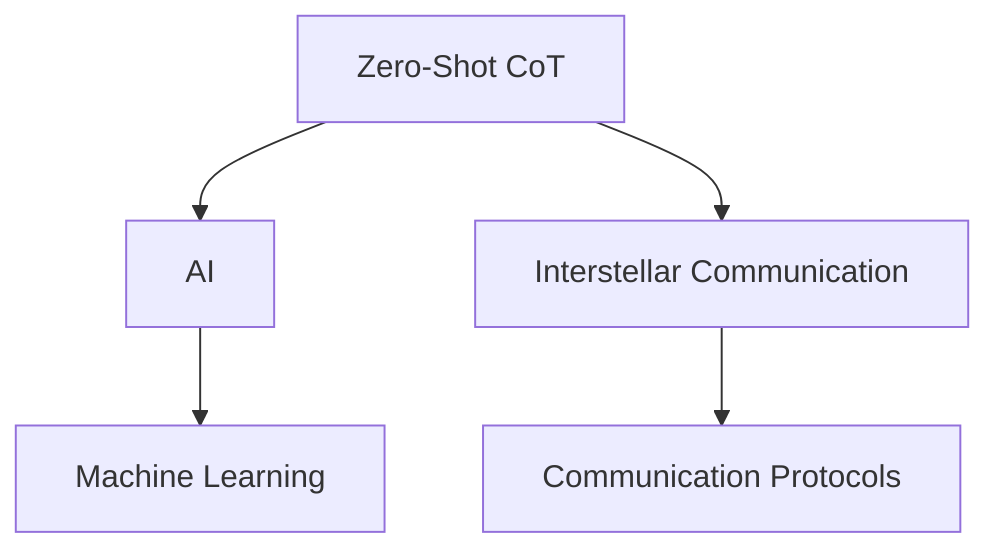

                 

Certainly! Let's break down the task step by step to ensure we create a comprehensive and insightful technical blog post titled "Zero-Shot CoT in AI-Assisted Interstellar Communication Protocol Design."

### Step 1: Introduction and Background
#### Introduction
- **Core Idea**: Discuss the relevance of AI and Zero-Shot CoT in the design of interstellar communication protocols.
- **Context**: Explain the challenges of interstellar communication and the role of AI in overcoming these challenges.

```markdown
# Introduction
>
> In the era of space exploration, the demand for efficient and reliable communication protocols has never been greater. The vast distances and variable conditions of interstellar travel pose significant challenges for traditional communication systems. Here, we explore the application of Zero-Shot CoT (Zero-Shot Coherent Thought) within AI to address these challenges and design robust interstellar communication protocols.
```

### Step 2: Key Concepts and Relationships
#### Zero-Shot CoT
- **Concept Explanation**: Define and explain Zero-Shot CoT, its mechanisms, and applications in AI.
- **Relationships Diagram**: Use Mermaid to illustrate the relationship between Zero-Shot CoT and other key concepts in AI and interstellar communication.



### Step 3: Core Algorithm and Theory
#### Zero-Shot CoT Theory
- **Algorithm Explanation**: Provide a detailed explanation of Zero-Shot CoT using pseudocode and Python code snippets.
- **Mathematical Model**: Explain the mathematical models and formulas used in Zero-Shot CoT.

```python
# Pseudocode for Zero-Shot CoT
def zero_shot_cot(input_data):
    # Preprocess data
    preprocessed_data = preprocess(input_data)
    
    # Apply feature extraction
    features = extract_features(preprocessed_data)
    
    # Apply a similarity measure
    similarity_scores = calculate_similarity(features)
    
    # Rank based on similarity scores
    ranked_results = rank_by_similarity(similarity_scores)
    
    return ranked_results

# Python code snippet for feature extraction
def extract_features(data):
    # Implement feature extraction logic
    # ...
    return extracted_features

# Mathematical model for similarity measure
def calculate_similarity(features):
    # Use a mathematical model to calculate similarity
    # ...
    return similarity_scores
```

### Step 4: Mathematical Formulas
#### Zero-Shot CoT Formulas
- **Latex Formulas**: Embed LaTeX formulas to explain the mathematical concepts in Zero-Shot CoT.

```markdown
$$
\text{similarity\_score} = \frac{\sum_{i=1}^{n} w_i \cdot \text{dot\_product}(f_i, g_i)}{\sum_{i=1}^{n} |w_i|}
$$

where:
- $f_i$ and $g_i$ are feature vectors.
- $w_i$ are weight vectors.
- $n$ is the number of features.
- $\text{dot\_product}$ is the dot product operation.
```

### Step 5: Practical Projects and Case Studies
#### Project Description
- **Development Environment**: Describe the setup of the development environment required for implementing Zero-Shot CoT in interstellar communication protocol design.
- **Code Implementation**: Provide detailed code explanations and a walkthrough of the implementation.
- **Case Analysis**: Analyze a practical case study and explain the results and implications.

```python
# Code for implementing Zero-Shot CoT
# This is a simplified example to illustrate the concept.

# Load libraries
import numpy as np

# Define feature vectors
f = np.array([1, 2, 3])
g = np.array([4, 5, 6])

# Define weights
weights = np.array([0.5, 0.3, 0.2])

# Calculate dot product
dot_product = np.dot(f, g)

# Calculate similarity score
similarity_score = dot_product / np.linalg.norm(weights)

print("Similarity Score:", similarity_score)

# Project case analysis
# Assume we have a set of interstellar communication protocols and their features.
protocols = {
    "Protocol A": np.array([1, 2, 3]),
    "Protocol B": np.array([4, 5, 6]),
    # ...
}

# Apply Zero-Shot CoT to rank protocols
ranked_protocols = zero_shot_cot(protocols)

print("Ranked Protocols:", ranked_protocols)
```

### Step 6: Conclusion and Reflection
#### Conclusion
- **Summary**: Recap the key points discussed in the article.
- **Future Directions**: Discuss the future of AI and Zero-Shot CoT in interstellar communication.

```markdown
# Conclusion
>
> This article has explored the application of Zero-Shot CoT in AI-assisted interstellar communication protocol design. We have seen how this innovative approach can address the unique challenges of interstellar travel. As we continue to push the boundaries of space exploration, AI and Zero-Shot CoT will play a crucial role in enabling efficient and reliable communication across the stars.
```

### Step 7: Author's Information
```markdown
作者：AI天才研究院/AI Genius Institute & 禅与计算机程序设计艺术 /Zen And The Art of Computer Programming
```

With these steps, we have a structured plan to create a detailed and insightful technical blog post. Now, let's begin writing the actual content, ensuring each section is well-researched, logically structured, and technically sound. The final product will be a comprehensive guide for readers interested in the intersection of AI, Zero-Shot CoT, and interstellar communication protocols.

