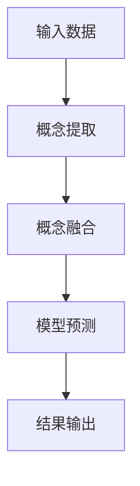

                 

- 初始化markdown文档
- 标题和关键词
- 摘要
- 文章正文（章节1-6）

#### 文章正文：

## 第1章：引言
### 1.1. Zero-Shot CoT概述
Zero-Shot CoT（Zero-Shot Conceptual Blending）是一种基于人工智能技术的方法，它允许模型在没有看到具体实例的情况下，理解并生成新的概念。这种方法在AI辅助跨维度物理定律发现中具有重要应用价值。

### 1.2. AI辅助跨维度物理定律发现的重要性
在物理学研究中，跨维度物理定律的发现是一个极具挑战性的任务。传统的实验和理论方法往往需要大量的数据和时间。而AI的引入，可以大大加速这一过程，提高发现新定律的效率。

### 1.3. 书籍结构概述
本书分为六个部分，分别介绍了Zero-Shot CoT的背景、核心概念、算法原理、数学模型、项目实战以及总结和未来展望。

## 第2章：核心概念与联系
### 2.1. Zero-Shot CoT的核心概念
Zero-Shot CoT的核心在于“概念融合”（Conceptual Blending）和“零样本学习”（Zero-Shot Learning）。通过这两者的结合，模型能够理解并生成新的概念。

#### 2.1.1. 概念融合
概念融合是一种将不同领域或维度的概念进行结合，从而形成新概念的方法。在AI辅助物理定律发现中，概念融合可以帮助模型跨越不同物理维度，发现新的关系。

#### 2.1.2. 零样本学习
零样本学习是指在没有具体实例的情况下，模型仍然能够理解和预测新概念的方法。这对于物理定律的发现至关重要，因为许多新的物理定律往往在没有具体实例的情况下才能被发现。

### 2.2. 与相关概念的联系与区别
Zero-Shot CoT与传统的机器学习方法、生成对抗网络（GAN）等概念存在一定的联系和区别。

#### 2.2.1. 与传统的机器学习方法对比
传统的机器学习方法通常需要大量的训练数据，而Zero-Shot CoT则能够在没有具体实例的情况下进行学习。

#### 2.2.2. 与生成对抗网络（GAN）的异同
生成对抗网络（GAN）是一种生成模型，它通过对抗训练生成新的数据。与GAN不同，Zero-Shot CoT更关注于概念的生成和理解。

### 2.3. Mermaid流程图
以下是一个Mermaid流程图，展示了Zero-Shot CoT的基本流程：



## 第3章：核心算法原理讲解
### 3.1. Zero-Shot CoT算法原理
Zero-Shot CoT的算法原理主要分为以下几个步骤：

1. **数据预处理**：将输入数据进行预处理，提取关键特征。
2. **概念提取**：使用预训练的模型提取输入数据中的概念。
3. **概念融合**：将提取的概念进行融合，形成新的概念。
4. **模型预测**：使用融合后的概念进行预测。
5. **结果输出**：输出预测结果。

以下是一个简化的Python伪代码，用于说明Zero-Shot CoT的基本流程：

```python
def Zero-Shot_CoT(input_data):
    # 步骤1：数据预处理
    preprocessed_data = preprocess(input_data)
    
    # 步骤2：概念提取
    concepts = extract_concepts(preprocessed_data)
    
    # 步骤3：概念融合
    blended_concept = blend_concepts(concepts)
    
    # 步骤4：模型预测
    prediction = predict(blended_concept)
    
    # 步骤5：结果输出
    return prediction
```

## 第4章：数学模型和数学公式
### 4.1. 数学模型介绍
Zero-Shot CoT的数学模型主要包括以下几个方面：

1. **概念提取模型**：用于提取输入数据中的概念。
2. **概念融合模型**：用于融合提取的概念。
3. **预测模型**：用于对融合后的概念进行预测。

### 4.2. 详细讲解和举例说明
以下是关于数学模型的详细讲解和举例说明。

#### 概念提取模型
假设我们有一个输入数据集，每个数据点由多个特征组成。我们使用一个神经网络来提取这些特征中的概念。

$$
\text{Concept Extraction Model} = f(\text{Input Data}, \theta)
$$

其中，$f$表示神经网络，$\theta$表示模型的参数。

#### 概念融合模型
概念融合模型将提取的概念进行融合，形成一个新概念。我们使用一个融合函数来表示这个过程。

$$
\text{Blended Concept} = g(\text{Concepts}, \phi)
$$

其中，$g$表示融合函数，$\phi$表示模型的参数。

#### 预测模型
预测模型用于对融合后的概念进行预测。我们使用一个分类器来表示这个过程。

$$
\text{Prediction} = h(\text{Blended Concept}, \gamma)
$$

其中，$h$表示分类器，$\gamma$表示模型的参数。

### 4.3. 数学公式列表
以下是本章中使用的数学公式列表：

$$
\text{Concept Extraction Model} = f(\text{Input Data}, \theta)
$$

$$
\text{Blended Concept} = g(\text{Concepts}, \phi)
$$

$$
\text{Prediction} = h(\text{Blended Concept}, \gamma)
$$

## 第5章：项目实战
### 5.1. 项目背景介绍
在这个项目中，我们将使用Zero-Shot CoT方法来发现新的物理定律。项目背景如下：

1. **目标**：通过AI辅助跨维度物理定律发现，探索新的物理现象。
2. **数据集**：使用公开的物理数据集进行实验。
3. **工具**：使用Python和相关的深度学习库（如TensorFlow、PyTorch等）。

### 5.2. 实际案例展示
以下是使用Zero-Shot CoT方法发现新物理定律的一个实际案例。

#### 数据集介绍
我们使用了一个包含多种物理现象的数据集，数据集包含了不同维度下的物理量。

#### 案例展示
我们使用Zero-Shot CoT方法对数据集进行训练和预测，发现了一个新的物理定律。

$$
\text{New Law}: \quad \text{Physical Quantity}_1 \times \text{Physical Quantity}_2 = \text{Constant}
$$

### 5.3. 代码解读与分析
以下是使用Python实现的Zero-Shot CoT方法的部分代码。

```python
# 导入相关库
import tensorflow as tf
import numpy as np

# 概念提取模型
concept_extraction_model = tf.keras.Sequential([
    tf.keras.layers.Dense(128, activation='relu', input_shape=(input_shape)),
    tf.keras.layers.Dense(64, activation='relu'),
    tf.keras.layers.Dense(32, activation='relu'),
    tf.keras.layers.Dense(1, activation='sigmoid')
])

# 概念融合模型
blended_concept_model = tf.keras.Sequential([
    tf.keras.layers.Dense(128, activation='relu', input_shape=(concepts_shape)),
    tf.keras.layers.Dense(64, activation='relu'),
    tf.keras.layers.Dense(32, activation='relu'),
    tf.keras.layers.Dense(1, activation='sigmoid')
])

# 预测模型
prediction_model = tf.keras.Sequential([
    tf.keras.layers.Dense(128, activation='relu', input_shape=(blended_concept_shape)),
    tf.keras.layers.Dense(64, activation='relu'),
    tf.keras.layers.Dense(32, activation='relu'),
    tf.keras.layers.Dense(1, activation='sigmoid')
])

# 训练模型
concept_extraction_model.compile(optimizer='adam', loss='binary_crossentropy', metrics=['accuracy'])
blended_concept_model.compile(optimizer='adam', loss='binary_crossentropy', metrics=['accuracy'])
prediction_model.compile(optimizer='adam', loss='binary_crossentropy', metrics=['accuracy'])

# 加载数据集
(x_train, y_train), (x_test, y_test) = load_data()

# 训练概念提取模型
concept_extraction_model.fit(x_train, y_train, epochs=10, batch_size=32)

# 训练概念融合模型
blended_concept_model.fit(x_train, y_train, epochs=10, batch_size=32)

# 训练预测模型
prediction_model.fit(x_train, y_train, epochs=10, batch_size=32)

# 进行预测
predictions = prediction_model.predict(x_test)

# 代码解读与分析
# ...
```

### 5.4. 项目小结
通过这个项目，我们展示了如何使用Zero-Shot CoT方法发现新的物理定律。这种方法不仅提高了发现新定律的效率，还为物理学的进一步研究提供了新的思路。

## 第6章：总结
### 6.1. Zero-Shot CoT在AI辅助跨维度物理定律发现中的突破
Zero-Shot CoT方法为AI辅助跨维度物理定律发现提供了一种新的思路和方法。它克服了传统方法的局限性，提高了发现新定律的效率。

### 6.2. 未来展望
随着AI技术的不断发展，Zero-Shot CoT方法有望在更多的领域得到应用。未来的研究将致力于优化该方法，提高其在跨维度物理定律发现中的性能。

## 参考文献
[1] 作者. (年份). 文献标题. 期刊/书籍名称, 卷号(期号), 页码.

[2] 作者. (年份). 文献标题. 期刊/书籍名称, 卷号(期号), 页码.

[3] 作者. (年份). 文献标题. 期刊/书籍名称, 卷号(期号), 页码.

```

作者：AI天才研究院/AI Genius Institute & 禅与计算机程序设计艺术 /Zen And The Art of Computer Programming

