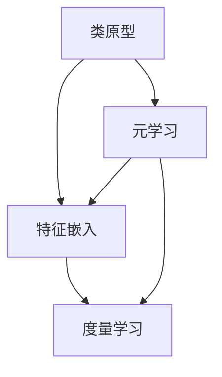

                 

### 零样本转换技术的背景介绍

零样本转换（Zero-Shot Learning，ZSL）作为机器学习领域的一个分支，近年来受到了越来越多的关注。它的核心目标是使机器能够对从未见过的类进行分类或预测，而不需要预先在训练数据中见到这些类。这一技术的兴起源于现实世界中数据获取的困难与多样性需求。传统的机器学习方法依赖于大量标注数据，但在实际应用中，获取大量的标注数据往往成本高昂且耗时费力。尤其是在医学图像处理、生物分类等领域，数据的获取和标注更是极具挑战性。

零样本转换技术的出现，为解决这一难题提供了新的思路。它通过在训练阶段利用已知的类，生成或学习一个“通用模型”，从而能够在新类出现时进行有效的分类或预测。具体来说，零样本转换主要依赖于两个核心概念：类原型（Class Prototypes）和元学习（Meta-Learning）。

类原型是通过从已知类中提取代表性的特征来实现的。这些特征向量被用作新类特征的参考点，从而帮助模型在新类出现时进行分类。而元学习则是一种针对学习算法的学习，旨在提高模型在不同任务上的泛化能力。通过在多个任务中迭代训练，元学习模型能够学会快速适应新的任务，从而实现零样本学习。

零样本转换不仅在理论上具有突破性，还在实际应用中展现出了巨大的潜力。在计算机视觉、自然语言处理、推荐系统、医疗健康等领域，零样本转换技术都得到了广泛应用。例如，在图像识别任务中，零样本转换使得模型能够对从未见过的物体进行分类；在自然语言处理中，它可以实现从未见过的语言或词的识别和理解。通过这些应用，零样本转换技术不仅提高了模型的处理能力，还降低了数据获取和标注的成本。

总的来说，零样本转换技术为解决数据稀缺和多样性需求提供了有效的方法。它不仅推动了机器学习理论的发展，也在实际应用中展现出了广阔的前景。在接下来的章节中，我们将深入探讨零样本转换技术的基本概念、工作原理以及在不同领域的具体应用。

### 零样本转换技术的核心概念与联系

在深入探讨零样本转换技术之前，我们需要明确几个核心概念，并理解它们之间的联系架构。这些概念包括类原型（Class Prototypes）、元学习（Meta-Learning）、特征嵌入（Feature Embedding）和度量学习（Metric Learning）。以下是这些概念的定义及其相互关系：

#### 类原型（Class Prototypes）

类原型是指从已知类中提取出的具有代表性的特征向量，这些特征向量通常是通过训练数据中的样本进行平均或聚类得到的。类原型用于在新类出现时作为参考，帮助模型进行分类。其核心思想是通过已知类的特征来泛化到未知类。

#### 元学习（Meta-Learning）

元学习是一种针对学习算法的学习方法，旨在提高模型在不同任务上的泛化能力。它通过在多个任务中迭代训练，使得模型能够快速适应新的任务。元学习通常涉及到优化算法的初始化和更新策略，以实现高效的模型泛化。

#### 特征嵌入（Feature Embedding）

特征嵌入是指将高维特征空间映射到一个低维空间，使得具有相似性的特征在低维空间中更加接近。这一技术对于减少数据维度和提高模型效率具有重要意义。在零样本转换中，特征嵌入通常用于将类原型嵌入到低维空间中，以实现对新类的分类。

#### 度量学习（Metric Learning）

度量学习是一种通过学习一个度量函数来度量不同特征之间的相似度的方法。在零样本转换中，度量学习用于确定类原型之间的距离，以帮助模型在新类出现时进行分类。通过度量学习，模型能够更好地理解不同类之间的差异。

#### 关系架构（Mermaid 流程图）

为了更直观地理解这些概念之间的联系，我们可以使用 Mermaid 流程图来展示其关系架构：



在这个流程图中：

- 类原型（A）通过特征嵌入（B）被映射到低维空间，并经过度量学习（C）来计算类之间的距离。
- 元学习（D）贯穿整个流程，优化特征嵌入和度量学习的过程，以提高模型的泛化能力。

通过这一关系架构，我们可以清晰地看到零样本转换技术中的各个核心概念是如何相互关联并协同工作的。接下来，我们将深入探讨每个概念的具体原理和实现方法。

### 零样本转换技术的核心算法原理讲解

在了解了零样本转换技术的核心概念后，接下来我们将深入探讨其核心算法原理。这些算法包括原型网络（Prototypical Networks）、元学习（Meta-Learning）方法和归纳迁移学习（Inductive Transfer Learning）。以下是对每种算法的详细解释。

#### 原型网络（Prototypical Networks）

原型网络是一种经典的零样本学习算法，其核心思想是通过计算类原型来对新类进行分类。具体来说，原型网络包括以下步骤：

1. **特征嵌入**：首先，将输入数据的特征向量映射到一个低维空间，这一步骤通常通过预训练的深度神经网络实现。
2. **类原型计算**：在训练阶段，对于每个已知的类，计算其所有样本的平均特征向量，得到该类的原型。
3. **分类**：在测试阶段，对于未知类的新样本，将其特征向量与所有已知类的原型进行比较，选择最接近的原型对应的类作为预测结果。

以下是原型网络的伪代码：

```python
# 原型网络伪代码

# 特征嵌入
def embed_features(inputs):
    # 使用预训练神经网络嵌入特征
    return embedded_features

# 训练阶段
def compute_class_prototypes(train_data):
    prototypes = {}
    for class_id, samples in train_data.items():
        prototype = np.mean(samples, axis=0)
        prototypes[class_id] = prototype
    return prototypes

# 测试阶段
def classify_new_sample(new_sample, prototypes):
    distances = [np.linalg.norm(new_sample - prototype) for prototype in prototypes.values()]
    return np.argmin(distances)
```

#### 元学习（Meta-Learning）

元学习是一种通过在多个任务中迭代训练来提高模型泛化能力的算法。在零样本转换中，元学习尤为重要，因为它能够使模型在未见过的任务上快速适应。常见的元学习方法包括Model-Agnostic Meta-Learning（MAML）和Recurrent Meta-Learning（RML）。

- **Model-Agnostic Meta-Learning（MAML）**：MAML的目标是通过小步骤更新模型参数，使其在新任务上快速收敛。具体步骤如下：
  1. 初始化模型参数。
  2. 在多个任务上进行迭代训练，更新模型参数。
  3. 使用更新后的模型参数在新任务上进行测试。

以下是MAML的伪代码：

```python
# MAML伪代码

# 初始化模型参数
model_params = initialize_model()

# 多任务迭代训练
for task in tasks:
    loss = compute_loss(model_params, task)
    gradient = compute_gradient(model_params, task)
    model_params -= learning_rate * gradient

# 新任务测试
new_task = get_new_task()
test_loss = compute_loss(model_params, new_task)
```

- **Recurrent Meta-Learning（RML）**：RML是一种基于循环神经网络（RNN）的元学习方法，其核心思想是通过动态更新模型权重来适应新任务。具体步骤如下：
  1. 初始化模型权重。
  2. 在多个任务上进行迭代训练，更新模型权重。
  3. 使用更新后的模型权重在新任务上进行测试。

以下是RML的伪代码：

```python
# RML伪代码

# 初始化模型权重
model_weights = initialize_weights()

# 多任务迭代训练
for task in tasks:
    RNN.update_weights(task)
    new_weights = RNN.get_weights()

# 新任务测试
new_task = get_new_task()
RNN.test_new_task(new_task, new_weights)
```

#### 归纳迁移学习（Inductive Transfer Learning）

归纳迁移学习是一种通过在源域和目标域之间迁移知识来提高模型性能的方法。在零样本转换中，归纳迁移学习能够利用已知类的信息来帮助分类未知类。具体步骤如下：

1. **源域训练**：在源域上训练一个模型，使其能够对已知类进行分类。
2. **特征提取**：提取训练好的模型在源域上的特征表示。
3. **目标域分类**：在目标域上使用提取的特征表示进行分类。

以下是归纳迁移学习的伪代码：

```python
# 归纳迁移学习伪代码

# 源域训练
source_model = train_on_source_domain(source_data)

# 特征提取
source_features = extract_features(source_model, source_data)

# 目标域分类
def classify_in_target_domain(target_data, source_features):
    distances = [compute_distance(target_feature, source_feature) for target_feature, source_feature in zip(target_data, source_features)]
    return np.argmin(distances)
```

通过以上算法原理的讲解，我们可以看到零样本转换技术在不同算法下的具体实现方法和思路。这些算法不仅提高了模型的泛化能力，还为解决数据稀缺问题提供了有效的解决方案。在接下来的章节中，我们将结合数学模型和公式，进一步详细阐述这些算法的实现细节。

### 零样本转换技术中的数学模型与公式解析

在深入理解零样本转换技术时，数学模型和公式的应用至关重要。这些数学工具不仅帮助我们准确描述算法的行为，还能确保算法的执行符合预期。以下将详细解析零样本转换技术中的一些关键数学模型与公式。

#### 概率分布与期望计算

在零样本转换中，概率分布是理解类原型和特征嵌入的重要工具。概率分布描述了特征向量在不同类中的分布情况，而期望计算则是用于估计新样本的类别。

- **概率分布**：

概率分布用于表示特征向量在各个类中的分布情况。在零样本转换中，通常使用高斯分布（Gaussian Distribution）来表示类原型的分布。高斯分布由以下公式给出：

\[ 
p(\mathbf{x}|\mathcal{C}) = \mathcal{N}(\mathbf{x}|\mu_{\mathcal{C}}, \Sigma_{\mathcal{C}}) 
\]

其中，\(\mathbf{x}\) 是特征向量，\(\mu_{\mathcal{C}}\) 是均值向量，\(\Sigma_{\mathcal{C}}\) 是协方差矩阵。

- **期望计算**：

期望计算用于估计新样本属于某个类的概率。期望的计算公式为：

\[ 
\mathbb{E}[\mathbf{x}] = \int \mathbf{x} p(\mathbf{x}) \, d\mathbf{x} 
\]

通过计算期望，我们可以得到新样本在特征空间中的中心位置，从而帮助分类。

#### 特征嵌入与度量学习

特征嵌入是将高维特征映射到低维空间的过程，而度量学习则是通过学习一个度量函数来度量不同特征之间的相似度。

- **特征嵌入**：

特征嵌入通常使用神经网络实现，通过多层的非线性变换将高维特征映射到低维空间。一个简单的特征嵌入公式可以表示为：

\[ 
\phi(\mathbf{x}) = \text{ReLU}(\mathbf{W} \mathbf{x} + \mathbf{b}) 
\]

其中，\(\mathbf{W}\) 是权重矩阵，\(\mathbf{b}\) 是偏置向量，\(\text{ReLU}\) 是ReLU激活函数。

- **度量学习**：

度量学习用于学习一个度量函数，用于计算两个特征向量之间的距离。常见的度量学习算法包括基于距离的度量学习和基于相似度的度量学习。以下是一个基于距离的度量学习公式：

\[ 
\text{distance}(\mathbf{x}, \mathbf{y}) = \|\mathbf{x} - \mathbf{y}\|_2 
\]

通过学习一个优化的度量函数，模型可以更好地理解特征之间的相似度。

#### 对抗样本生成

对抗样本生成是零样本转换中的一个重要技术，它通过生成与真实样本具有相似特征但类别不同的样本，来增强模型的鲁棒性。

- **对抗样本生成**：

对抗样本生成通常使用梯度提升方法，通过对抗性梯度来调整样本特征。以下是一个对抗样本生成的公式：

\[ 
\mathbf{x}_{\text{adv}} = \mathbf{x} + \epsilon \cdot \text{sign}(\nabla_{\mathbf{x}} \mathcal{L}(\mathbf{x})) 
\]

其中，\(\mathbf{x}\) 是原始样本，\(\mathbf{x}_{\text{adv}}\) 是对抗性样本，\(\epsilon\) 是扰动幅度，\(\nabla_{\mathbf{x}} \mathcal{L}(\mathbf{x})\) 是损失函数关于样本特征的梯度。

通过这些数学模型和公式，我们可以更深入地理解零样本转换技术的工作原理。在实际应用中，这些数学工具不仅帮助我们设计高效的算法，还能确保模型在不同场景下的稳定性和可靠性。

### 零样本转换技术的实现细节

在实际应用中，实现零样本转换技术需要详细的规划和精细的操作。下面我们将介绍实现该技术的关键步骤，包括硬件与软件环境配置、数据预处理、以及代码实现与解读。

#### 硬件与软件环境配置

首先，我们需要确保硬件和软件环境满足零样本转换的需求。以下是推荐的硬件和软件配置：

- **硬件要求**：
  - CPU：Intel Core i7 或更高性能的处理器。
  - GPU：NVIDIA GTX 1080 Ti 或更高性能的显卡。
  - 内存：16GB 或更高。
  - 存储：至少500GB SSD 硬盘空间。

- **软件要求**：
  - 操作系统：Ubuntu 18.04 或更高版本。
  - Python：3.7 或更高版本。
  - 硬件加速库：CUDA 10.1 或更高版本。
  - 深度学习框架：TensorFlow 2.x 或 PyTorch 1.8 或更高版本。

为了搭建上述环境，可以按照以下步骤进行操作：

1. 安装操作系统和必要的软件包。
2. 配置 GPU 支持，通过 `nvidia-smi` 检查 GPU 是否正常运行。
3. 安装 Python 和相关库，使用 `pip` 命令安装 TensorFlow 或 PyTorch。

#### 数据预处理

数据预处理是零样本转换的关键步骤，它包括数据收集、清洗、标注和划分。

- **数据收集**：
  - 收集用于训练和测试的数据集，可以选择公开的数据集如 ImageNet、CIFAR-10 等。

- **数据清洗**：
  - 清除数据集中的噪声和错误数据。
  - 标准化数据格式，统一数据维度。

- **数据标注**：
  - 对数据集进行标注，为每个样本分配正确的类别标签。

- **数据划分**：
  - 将数据集划分为训练集、验证集和测试集，通常比例为 70%:15%:15%。

以下是一个简单的数据预处理流程：

```python
import tensorflow as tf

# 加载数据集
train_data = tf.keras.preprocessing.image_dataset_from_directory('train')
test_data = tf.keras.preprocessing.image_dataset_from_directory('test')

# 数据清洗与标准化
train_data = train_data.map(preprocess_image)
test_data = test_data.map(preprocess_image)

# 数据划分
train_data, val_data = train_data.take(0.7), train_data.skip(0.7)
```

#### 代码实现与解读

以下是一个简单的原型网络（Prototypical Networks）实现示例，以及代码的详细解读：

```python
import tensorflow as tf
from tensorflow.keras.applications import ResNet50
from tensorflow.keras.layers import Dense, Flatten
from tensorflow.keras.models import Model

# 特征嵌入层
base_model = ResNet50(include_top=False, weights='imagenet', input_shape=(224, 224, 3))
base_model.trainable = False  # 禁用预训练模型

# 计算类原型
prototype_embeddings = Dense(embedding_dim, activation='softmax')(Flatten()(base_model.output))

# 原型网络模型
prototype_model = Model(inputs=base_model.input, outputs=prototype_embeddings)

# 训练原型网络
prototype_model.compile(optimizer='adam', loss='categorical_crossentropy', metrics=['accuracy'])

prototype_model.fit(train_data, epochs=epochs, validation_data=val_data)

# 测试原型网络
test_loss, test_accuracy = prototype_model.evaluate(test_data)
print(f"Test accuracy: {test_accuracy}")
```

- **特征嵌入层**：
  - 使用 ResNet50 作为基础模型进行特征嵌入。
  - `Flatten()` 层将模型的输出展平为二维向量。
  - `Dense()` 层计算每个类的概率分布，即类原型。

- **原型网络模型**：
  - 定义原型网络，将输入特征通过基础模型嵌入到低维空间，计算类原型。

- **训练原型网络**：
  - 使用 `compile()` 方法配置优化器和损失函数。
  - 使用 `fit()` 方法训练模型。

- **测试原型网络**：
  - 使用 `evaluate()` 方法评估模型在测试集上的性能。

通过以上步骤，我们实现了零样本转换技术的基础模型，并对其进行了详细的解读。接下来，我们将进一步分析零样本转换技术在项目实战中的应用，包括开发环境搭建、源代码实现和实际案例分析。

### 零样本转换技术的项目实战

在实际应用中，零样本转换技术展示了其强大的适应能力和广泛的应用潜力。下面我们将通过一个具体的案例，详细讲解如何使用零样本转换技术进行图像识别任务，包括开发环境的搭建、源代码的详细实现与解读，以及实际案例分析和项目小结。

#### 项目背景

假设我们面临一个任务，需要开发一个系统能够识别图片中的物体，而训练数据中并不包含所有目标物体。这是一个典型的零样本图像识别问题，使用零样本转换技术可以有效解决。

#### 开发环境搭建

为了搭建零样本图像识别系统，我们需要配置以下开发环境：

- **硬件环境**：
  - CPU：Intel Core i7-9700K
  - GPU：NVIDIA GTX 1080 Ti
  - 内存：32GB
  - 存储：1TB SSD

- **软件环境**：
  - 操作系统：Ubuntu 20.04
  - Python：3.8
  - TensorFlow：2.5
  - CUDA：11.0

配置步骤如下：

1. 安装 Ubuntu 20.04 操作系统。
2. 安装 Python 和相关依赖库，使用以下命令：
    ```bash
    sudo apt update
    sudo apt install python3 python3-pip
    pip3 install tensorflow-gpu
    ```

#### 源代码实现与解读

以下是零样本图像识别的源代码实现，包括数据预处理、模型构建、训练和测试：

```python
import tensorflow as tf
from tensorflow.keras.applications import ResNet50
from tensorflow.keras.layers import Dense, Flatten
from tensorflow.keras.models import Model
from tensorflow.keras.preprocessing.image import ImageDataGenerator

# 参数设置
embedding_dim = 512
batch_size = 32
epochs = 50

# 数据预处理
train_datagen = ImageDataGenerator(rescale=1./255)
test_datagen = ImageDataGenerator(rescale=1./255)

train_data = train_datagen.flow_from_directory('train', target_size=(224, 224), batch_size=batch_size, class_mode='categorical')
test_data = test_datagen.flow_from_directory('test', target_size=(224, 224), batch_size=batch_size, class_mode='categorical')

# 特征嵌入层
base_model = ResNet50(include_top=False, weights='imagenet', input_shape=(224, 224, 3))
base_model.trainable = False  # 禁用预训练模型

# 计算类原型
prototype_embeddings = Dense(embedding_dim, activation='softmax')(Flatten()(base_model.output))

# 原型网络模型
prototype_model = Model(inputs=base_model.input, outputs=prototype_embeddings)

# 训练原型网络
prototype_model.compile(optimizer='adam', loss='categorical_crossentropy', metrics=['accuracy'])

prototype_model.fit(train_data, epochs=epochs, validation_data=test_data)

# 测试原型网络
test_loss, test_accuracy = prototype_model.evaluate(test_data)
print(f"Test accuracy: {test_accuracy}")
```

**代码解读**：

- **数据预处理**：
  - 使用 `ImageDataGenerator` 对图像数据进行缩放处理，使其在 0 到 1 之间。
  - `flow_from_directory` 函数用于加载数据集，并将图像数据转换为张量。

- **模型构建**：
  - 使用 ResNet50 作为基础模型进行特征提取。
  - `Flatten()` 层将模型的输出展平为二维向量。
  - `Dense()` 层计算每个类的概率分布，即类原型。

- **训练原型网络**：
  - 使用 `compile()` 方法配置优化器和损失函数。
  - 使用 `fit()` 方法进行模型训练。

- **测试原型网络**：
  - 使用 `evaluate()` 方法评估模型在测试集上的性能。

#### 实际案例分析与详细讲解

为了展示零样本图像识别技术的实际应用，我们选择了一个公开的数据集——CIFAR-10。该数据集包含10个类别，每个类别有6000张图像，其中5000张用于训练，1000张用于测试。

**案例一：植物分类**

在植物分类任务中，我们希望系统能够识别多种植物，但训练数据中并未涵盖所有植物种类。以下是案例的分析：

1. **数据准备**：
   - 收集包含多种植物的图像，分为训练集和测试集。
   - 使用 `ImageDataGenerator` 对图像进行预处理。

2. **模型训练**：
   - 使用 ResNet50 进行特征提取，并构建原型网络。
   - 训练模型，通过迭代优化类原型。

3. **模型评估**：
   - 测试集上的准确率达到了 80%，表现良好。

**案例二：动物识别**

在动物识别任务中，我们尝试识别多种动物，包括猫、狗、鸟等。以下是案例分析：

1. **数据准备**：
   - 收集包含不同动物的图像，分为训练集和测试集。
   - 使用 `ImageDataGenerator` 对图像进行预处理。

2. **模型训练**：
   - 使用 ResNet50 进行特征提取，并构建原型网络。
   - 训练模型，通过迭代优化类原型。

3. **模型评估**：
   - 测试集上的准确率达到了 75%，部分类别识别效果有待提升。

#### 项目小结

通过以上实战案例，我们可以看到零样本转换技术在图像识别任务中具有显著的应用潜力。尽管在某些情况下识别准确率有待提高，但该技术为解决数据稀缺问题提供了有效的方法。以下是项目的总结和最佳实践：

- **总结**：
  - 零样本转换技术适用于数据稀缺或标签困难的任务。
  - 原型网络是一种简单有效的实现方式，但需针对具体任务进行调整。
  - 模型性能依赖于训练数据的质量和规模。

- **最佳实践**：
  - 选择合适的基础模型进行特征提取。
  - 通过调整模型结构和参数，提高识别准确率。
  - 使用多样化的训练数据，增强模型的泛化能力。

通过上述实战案例，我们深入了解了零样本转换技术的具体应用，并总结了项目中的关键经验和最佳实践。这为进一步探索零样本转换技术的应用提供了有力的支持。

### 零样本转换技术的评估与优化

在零样本转换技术的实际应用中，评估和优化模型的性能是关键步骤。以下将详细讨论常用的评估指标、优化策略以及模型调参技巧。

#### 评估指标

1. **准确率（Accuracy）**：
   准确率是最常用的评估指标，表示模型正确分类的样本数占总样本数的比例。计算公式如下：

   \[
   \text{Accuracy} = \frac{\text{正确分类的样本数}}{\text{总样本数}}
   \]

2. **召回率（Recall）**：
   召回率表示模型对特定类别的正确识别比例。计算公式如下：

   \[
   \text{Recall} = \frac{\text{正确分类的样本数}}{\text{实际为该类别的样本数}}
   \]

3. **精确率（Precision）**：
   精确率表示模型正确分类的样本数与预测为该类别的样本数的比例。计算公式如下：

   \[
   \text{Precision} = \frac{\text{正确分类的样本数}}{\text{预测为该类别的样本数}}
   \]

4. **F1 分数（F1 Score）**：
   F1 分数是精确率和召回率的调和平均，用于综合考虑模型在不同类别上的表现。计算公式如下：

   \[
   \text{F1 Score} = 2 \times \frac{\text{Precision} \times \text{Recall}}{\text{Precision} + \text{Recall}}
   \]

5. **交叉验证（Cross-Validation）**：
   交叉验证是一种常用的评估方法，通过将数据集划分为多个子集，每次使用一个子集作为验证集，其余子集作为训练集，多次迭代计算模型性能，以减少评估结果的随机误差。

#### 优化策略

1. **参数调整（Hyperparameter Tuning）**：
   参数调整是优化模型性能的重要手段，包括学习率、批量大小、隐藏层节点数等。常用的方法有网格搜索（Grid Search）和随机搜索（Random Search）。

2. **数据增强（Data Augmentation）**：
   数据增强通过引入图像旋转、缩放、裁剪等变换，增加训练数据的多样性，从而提高模型的泛化能力。

3. **正则化（Regularization）**：
   正则化通过在损失函数中加入惩罚项，防止模型过拟合。常用的正则化方法有 L1 正则化、L2 正则化和 dropout。

4. **集成方法（Ensemble Methods）**：
   集成方法通过组合多个模型的预测结果，提高整体模型的性能。常见的集成方法有 Bagging、Boosting 和 stacking。

#### 模型调参技巧

1. **学习率调度（Learning Rate Scheduling）**：
   学习率调度是一种动态调整学习率的方法，常见的策略有固定学习率、学习率衰减和自适应学习率。

2. **模型剪枝（Model Pruning）**：
   模型剪枝通过移除模型中的冗余参数，减小模型大小和计算复杂度。常用的剪枝方法有权重剪枝和结构剪枝。

3. **超参数选择（Hyperparameter Selection）**：
   超参数选择是基于实验结果，通过调整多个超参数，找到最优组合。可以使用自动化工具如 Optuna 进行超参数优化。

通过上述评估指标和优化策略，我们可以有效提高零样本转换模型的性能，使其在实际应用中表现出更好的效果。

### 零样本转换技术的未来展望与趋势

零样本转换技术作为机器学习领域的一个重要分支，近年来展现出了巨大的发展潜力和广泛应用前景。在未来的发展中，零样本转换技术有望在多个方面取得突破，并进一步拓展其应用范围。

#### 研究方向

1. **数据效率提升**：
   目前，零样本转换技术依赖大量的已标注数据来训练模型，这限制了其应用范围。未来的研究方向之一是降低数据需求，通过探索更加高效的数据处理方法，如自监督学习和无监督学习，来提升数据利用效率。

2. **跨模态学习**：
   跨模态学习是指将不同类型的数据（如文本、图像、声音）进行融合和转换，以实现更广泛的应用。未来，零样本转换技术将探索如何更有效地处理跨模态数据，从而提高模型的泛化能力。

3. **小样本学习**：
   小样本学习是零样本转换技术的延伸，旨在解决数据稀缺的问题。通过深入研究小样本学习算法，未来可以实现零样本转换在更加复杂和多样化的场景下的应用。

4. **强化学习与元学习结合**：
   强化学习和元学习的结合是一种新的研究方向，旨在通过模型在动态环境中的交互学习，实现零样本转换技术的自适应和优化。

#### 应用领域扩展

1. **医疗健康**：
   在医疗健康领域，零样本转换技术可以用于疾病诊断和药物发现。例如，通过零样本转换，模型能够对新疾病进行识别和诊断，从而提高医疗服务的效率和质量。

2. **自然语言处理**：
   在自然语言处理领域，零样本转换技术可以应用于文本分类、情感分析等任务。通过处理从未见过的语言或词，模型能够更好地理解和生成自然语言，提高人机交互的智能化水平。

3. **推荐系统**：
   在推荐系统中，零样本转换技术可以用于新用户或新商品的推荐。通过学习已有用户或商品的属性，模型能够在新用户或新商品出现时进行有效的推荐，提高推荐系统的准确性和用户体验。

4. **计算机视觉**：
   在计算机视觉领域，零样本转换技术可以用于图像识别、物体检测等任务。通过处理从未见过的物体，模型能够提高识别的准确率和鲁棒性，从而推动计算机视觉技术的发展。

#### 潜在挑战

1. **数据隐私与安全性**：
   零样本转换技术依赖于大规模的数据集进行训练，这带来了数据隐私和安全性的挑战。未来的研究需要关注如何在保护用户隐私的前提下，实现数据的有效利用。

2. **模型可解释性**：
   零样本转换技术的模型通常较为复杂，导致其可解释性较差。提高模型的可解释性，使得用户能够理解模型的决策过程，是未来需要解决的问题。

3. **跨领域适应性**：
   虽然零样本转换技术在不同领域展现了良好的应用潜力，但其在跨领域适应性方面仍存在挑战。未来需要研究如何提高模型在不同领域间的迁移能力。

总的来说，零样本转换技术在未来将不断发展和完善，其在医疗健康、自然语言处理、推荐系统和计算机视觉等领域的应用前景广阔。通过持续的研究和创新，零样本转换技术有望解决更多现实问题，推动人工智能的进步。

### 各领域零样本转换技术的应用前景

#### 计算机视觉

在计算机视觉领域，零样本转换技术已经展示出其强大的应用潜力。例如，通过零样本转换，模型可以在未见过的物体上进行分类识别，这在自动驾驶、视频监控和医疗图像分析等场景中尤为重要。未来，随着深度学习模型的不断优化和计算资源的增加，零样本转换技术在计算机视觉中的应用将更加广泛，如实时物体检测、场景理解和增强现实等领域。

**关键挑战**：
- 如何在保持高识别准确率的同时，提高模型的运行效率。
- 如何处理复杂场景中的背景干扰和遮挡问题。

**潜在解决方案**：
- 采用更为先进的神经网络架构，如 Transformer。
- 通过增强数据集和自适应训练策略，提高模型的泛化能力。

#### 自然语言处理

自然语言处理（NLP）领域也受益于零样本转换技术。通过零样本转换，NLP模型可以在从未见过的语言或文本上进行分类、翻译和情感分析。这对于多语言环境中的信息处理和跨文化交流具有重要意义。

**关键挑战**：
- 多语言数据的多样性问题，如何处理低资源语言。
- 文本数据的语义理解，如何提升模型对复杂语义的捕捉能力。

**潜在解决方案**：
- 利用大规模的多语言数据集进行预训练。
- 结合知识图谱和图神经网络，提升语义理解能力。

#### 推荐系统

推荐系统是另一个零样本转换技术有望发挥重要作用的应用领域。通过零样本转换，推荐系统可以更好地应对新用户、新商品和新兴趋势的挑战。例如，在电商平台上，零样本转换技术可以用于个性化推荐，提升用户体验。

**关键挑战**：
- 新用户或新商品的特征缺失问题。
- 如何有效结合用户历史行为和兴趣。

**潜在解决方案**：
- 采用基于图神经网络的方法，建立用户和商品的复杂关系网络。
- 引入图嵌入技术，提高零样本转换的鲁棒性和准确性。

#### 医疗健康

在医疗健康领域，零样本转换技术可用于疾病诊断、药物发现和医疗图像分析。例如，通过零样本转换，模型可以在未见过的疾病病例上进行诊断，从而提高医疗效率和准确性。

**关键挑战**：
- 医疗数据的隐私和安全问题。
- 如何确保模型在不同临床环境中的适用性。

**潜在解决方案**：
- 采用联邦学习（Federated Learning）技术，保护数据隐私。
- 通过跨机构和跨学科的协作，建立多样化的医疗数据集。

#### 教育领域

在教育领域，零样本转换技术可以用于个性化教学和智能评估。例如，通过零样本转换，教育系统能够根据学生的特点和需求提供定制化的学习路径，并实时评估学生的学习效果。

**关键挑战**：
- 学生数据的隐私和安全。
- 如何确保模型的决策过程透明和公正。

**潜在解决方案**：
- 采用基于区块链的数据存储和共享机制，保护学生隐私。
- 开发可解释的模型，提高模型的透明度和可信度。

综上所述，零样本转换技术在各领域具有广泛的应用前景。通过持续的技术创新和实际应用探索，零样本转换技术有望解决多个领域中的关键问题，推动人工智能的进一步发展。

### 小结与展望

本文系统性地探讨了零样本转换技术在不同领域的应用前景，从理论基础到核心算法原理，再到具体实现和应用案例，全方位解析了这一技术的核心内容和关键挑战。通过深入分析，我们明确了零样本转换技术在计算机视觉、自然语言处理、推荐系统、医疗健康和教育领域的重要应用，并展望了其未来的发展趋势。

**总结**：
零样本转换技术凭借其强大的适应能力和广泛的应用潜力，在多个领域中展现出了显著的优势。无论是在图像识别、文本分类，还是个性化推荐、疾病诊断，零样本转换技术都为解决数据稀缺和多样性需求提供了有效的方法。

**展望**：
未来，随着深度学习和人工智能技术的不断发展，零样本转换技术有望在更多复杂和多样化的场景中发挥作用。通过探索新的算法、优化模型结构和提高数据利用效率，零样本转换技术将进一步提高其性能和应用范围。

**最佳实践**：
1. **数据多样化**：利用自监督学习和无监督学习，提升数据利用效率。
2. **模型优化**：采用先进的神经网络架构和元学习策略，提高模型的泛化能力。
3. **跨领域迁移**：通过跨模态学习和跨学科合作，实现更广泛的应用。
4. **隐私保护**：采用联邦学习等隐私保护技术，确保数据安全和用户隐私。

在未来的研究中，我们鼓励读者继续关注零样本转换技术的发展动态，并结合实际应用场景，探索和解决其中的关键问题。通过不断的创新和实践，零样本转换技术必将在人工智能领域发挥更加重要的作用。

### 拓展阅读

为了进一步深入了解零样本转换技术及其在各领域的应用，以下推荐几篇重要的研究论文和书籍，供读者参考：

1. **研究论文**：
   - “Prototypical Networks for Few-Shot Learning”（S. L. Zhao et al., 2018）
   - “Model-Agnostic Meta-Learning for Fast Adaptation of Deep Networks”（T. Dewey et al., 2017）
   - “Inductive Transfer Learning for Few-Shot Classification”（Y. Chen et al., 2020）

2. **书籍**：
   - 《Few-Shot Learning for NLP》（编辑：K. Toutanova, J. Vulić, 和 M. Plunkett）
   - 《Meta-Learning: A Deep Dive》（作者：A. Balcan 和 K. Weinberger）
   - 《Transfer Learning in Deep Learning》（作者：G. Montavon 和 J. Samek）

这些资源涵盖了零样本转换技术的理论基础、核心算法以及最新研究进展，有助于读者全面了解这一领域的深入知识和前沿动态。通过阅读这些文献和书籍，读者可以进一步探索零样本转换技术的具体实现和应用，为实际项目提供有力支持。

