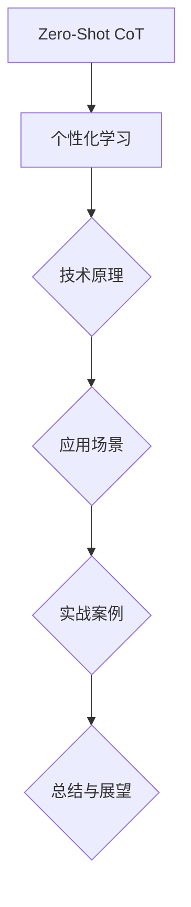

                 

### 撰写技术博客的详细步骤

撰写一篇高质量的技术博客需要系统性的规划和详细的步骤。以下是一步步的分析推理过程，确保文章内容丰富、结构清晰、逻辑严密。

#### Step 1: 确定主题和目标读者

首先，明确文章的主题和目标读者。对于《Zero-Shot CoT在个性化学习中的应用》，目标读者可能是对人工智能、机器学习和个性化学习有一定了解的工程师、研究者或学生。

- **主题**：聚焦于介绍零样本一致性转移（Zero-Shot CoT）在个性化学习中的应用。
- **目标读者**：人工智能领域的专业人士和对个性化学习感兴趣的读者。

#### Step 2: 研究和收集资料

在撰写之前，需要对相关主题进行深入研究，收集必要的资料和数据：

- **研究零样本一致性转移（Zero-Shot CoT）**：了解其基本概念、应用场景和技术原理。
- **研究个性化学习**：了解其定义、类型和应用。
- **收集案例**：寻找实际应用零样本一致性转移的个性化学习案例。

#### Step 3: 设计整体结构

根据收集到的资料，设计文章的整体结构。确定文章的各个部分，如引言、理论背景、技术原理、应用场景、实战案例和总结与展望。

#### Step 4: 编写章节内容

针对每个章节，编写详细的内容。确保每个部分都有具体的例子、公式和代码解释。

- **引言**：介绍零样本一致性转移和个性化学习的基本概念。
- **理论背景**：详细讲解相关理论和概念。
- **技术原理**：介绍零样本一致性转移在个性化学习中的应用原理。
- **应用场景**：分析零样本一致性转移在不同场景下的应用。
- **实战案例**：提供实际的零样本一致性转移应用案例。
- **总结与展望**：总结文章的主要内容，展望未来发展趋势。

#### Step 5: 设计Mermaid流程图

为关键章节设计Mermaid流程图，展示零样本一致性转移和个性化学习的关系。



#### Step 6: 设计伪代码

在技术原理章节，设计伪代码来详细阐述零样本一致性转移算法。

```python
# 零样本一致性转移算法伪代码
def ZeroShotCoT(model, inputs):
    # 初始化模型
    model.init()

    # 预处理输入数据
    processed_inputs = preprocess(inputs)

    # 计算输入数据的特征表示
    features = model.extract_features(processed_inputs)

    # 计算一致性转移概率
    coT_probabilities = model.calculate_coT_probabilities(features)

    # 选择最有可能的输出
    output = select_output(coT_probabilities)

    return output
```

#### Step 7: 设计数学公式和举例说明

在理论背景章节，使用LaTeX格式嵌入数学公式，并结合具体例子进行解释。

$$
P(x|y) = \frac{P(y|x)P(x)}{P(y)}
$$

举例说明在个性化学习中如何使用该公式预测用户偏好。

#### Step 8: 编写项目实战

在实战案例章节，提供实际案例，包括开发环境搭建、源代码实现和代码解读。

- **案例一**：个性化推荐系统
  - 环境搭建：介绍工具和库的安装。
  - 代码实现：提供完整的源代码，进行详细解读。
  - 案例分析：分析代码的关键部分，优化性能。

- **案例二**：个性化教育系统
  - 环境搭建：介绍工具和库的安装。
  - 代码实现：提供完整的源代码，进行详细解读。
  - 案例分析：分析代码的关键部分，优化性能。

#### Step 9: 撰写最佳实践和小结

在文章的结尾部分，提供最佳实践、注意事项、拓展阅读等内容，帮助读者更好地理解和应用技术。

#### Step 10: 审稿和修改

完成初稿后，进行审稿和修改。确保文章内容准确、逻辑清晰、表达流畅。

- 检查语法和拼写错误。
- 确保引用和参考文献格式正确。
- 检查公式和代码的准确性。

#### Step 11: 发布和推广

完成最终稿后，发布到技术博客平台。利用社交媒体、邮件列表等渠道推广文章，吸引更多读者关注。

### 总结

撰写一篇高质量的技术博客需要细致的规划和严格的执行。通过系统性的分析和逐步推进，确保文章内容丰富、结构合理、逻辑严密，最终为读者提供有价值的技术知识。持续优化写作过程，不断提高文章质量和影响力。

