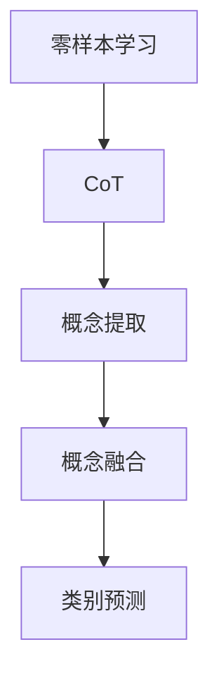
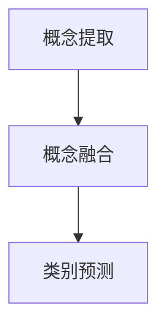
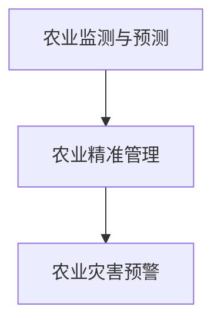
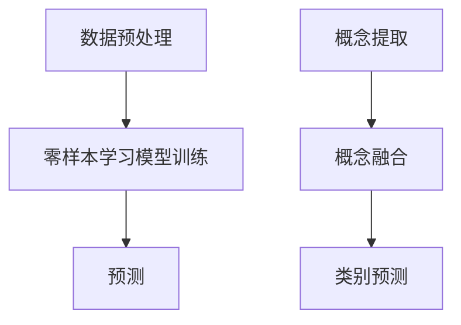

                 

# 《Zero-Shot CoT在农业AI中的创新应用》

> 关键词：农业AI、零样本学习、Conceptual Blending（CoT）、机器学习、创新应用

> 摘要：本文深入探讨了零样本学习与Conceptual Blending（CoT）在农业AI中的应用，介绍了两者的基本原理及其在农业领域的创新应用实例，分析了现有挑战，并展望了未来的发展趋势。

## 引言与背景

随着科技的快速发展，农业AI正逐渐成为现代农业的重要支柱。农业AI通过利用人工智能技术，如机器学习、计算机视觉和自然语言处理，实现农业生产的自动化和智能化。这不仅能提高农作物的产量和质量，还能降低生产成本，减少环境污染。

近年来，零样本学习（Zero-Shot Learning，ZSL）和Conceptual Blending（CoT）作为机器学习的重要分支，受到了广泛关注。零样本学习旨在解决传统机器学习模型在未知类别数据上的适应性问题，而CoT则是一种基于概念融合的新型机器学习方法，能够处理复杂、高维的数据。

本文将首先介绍农业AI的发展背景和零样本学习与CoT的基本概念，然后分析农业领域中的零样本学习与CoT的应用，并通过具体案例展示其在农业AI中的创新应用。最后，本文将讨论零样本学习与CoT在农业AI中的挑战和未来展望。

## 零样本学习与CoT

### 1. 零样本学习的定义与特点

零样本学习（Zero-Shot Learning，ZSL）是一种机器学习方法，能够在未见过的类别上实现分类或回归。与传统的有监督学习和迁移学习不同，零样本学习不需要在训练阶段看到所有的类别样本。因此，它特别适合于新类别数据的处理。

零样本学习的主要特点包括：

- **适应性**：能够快速适应新类别数据，无需重新训练模型。
- **泛化能力**：能够处理大量未见过类别的问题，具有广泛的适用性。
- **灵活性**：不需要提前标注新类别数据，适应多种应用场景。

### 2. CoT的概念与原理

Conceptual Blending（CoT）是一种基于概念融合的机器学习方法。它通过将多个概念融合为一个新概念，实现对数据的分类或回归。

CoT的基本原理包括：

- **概念提取**：从数据中提取关键概念。
- **概念融合**：将提取的概念融合为新概念，以实现数据分类或回归。
- **概念关联**：通过关联新概念和已知类别，实现对未见过类别的预测。

### 3. 零样本学习与CoT的关系

零样本学习与CoT之间存在紧密的联系。零样本学习提供了CoT实现新概念提取和融合的基础，而CoT则为零样本学习提供了有效的类别预测方法。两者相结合，能够进一步提升农业AI的适应性和泛化能力。

### Mermaid 流程图



## 零样本学习的基本原理

### 1. 零样本学习的方法分类

零样本学习的方法主要分为基于原型的方法、基于嵌入的方法和基于匹配度的方法。

- **基于原型的方法**：通过计算新类别样本与原型样本之间的相似度，实现类别预测。
- **基于嵌入的方法**：将类别和样本映射到低维空间中，通过比较映射后的距离，实现类别预测。
- **基于匹配度的方法**：通过计算新类别样本与先验知识的匹配度，实现类别预测。

### 2. 零样本学习的核心算法

核心算法包括：

- **原型网络（Prototypical Network）**：通过计算新类别样本与原型样本的均值，实现类别预测。
- **匹配网络（Matching Network）**：通过计算新类别样本与先验知识的匹配度，实现类别预测。
- **元学习（Meta-Learning）**：通过训练模型快速适应新类别数据，实现零样本学习。

### Python 源代码示例

```python
import numpy as np
import tensorflow as tf

# 原型网络实现
class PrototypicalNetwork(tf.keras.Model):
    def __init__(self, num_classes, hidden_size):
        super(PrototypicalNetwork, self).__init__()
        self.encoder = tf.keras.Sequential([
            tf.keras.layers.Flatten(input_shape=(28, 28)),
            tf.keras.layers.Dense(hidden_size, activation='relu'),
            tf.keras.layers.Dense(hidden_size, activation='relu'),
        ])
        self.classifier = tf.keras.layers.Dense(num_classes)

    def call(self, inputs, training=False):
        embedded_samples = self.encoder(inputs)
        prototype = tf.reduce_mean(embedded_samples, axis=1)
        logits = self.classifier(prototype)
        return logits

# 数据准备
x_train = np.random.random((100, 28, 28))
y_train = np.random.randint(0, 10, (100,))

# 模型训练
model = PrototypicalNetwork(num_classes=10, hidden_size=64)
model.compile(optimizer='adam', loss=tf.keras.losses.SparseCategoricalCrossentropy(from_logits=True))
model.fit(x_train, y_train, epochs=10)
```

### 数学模型和公式

在零样本学习中，原型网络的核心公式为：

$$
\text{logits} = \text{classifier}( \text{prototype} )
$$

其中，$\text{prototype}$ 为新类别样本的均值，$\text{classifier}$ 为分类器。

## CoT的原理与应用

### 1. CoT的基本原理

CoT 通过将多个概念融合为一个新概念，实现对数据的分类或回归。其基本原理包括：

- **概念提取**：从数据中提取关键概念。
- **概念融合**：将提取的概念融合为新概念。
- **类别预测**：通过新概念预测未见过类别。

### 2. CoT在机器学习中的应用

CoT 在机器学习中的应用主要包括：

- **分类**：通过融合不同特征，提高分类性能。
- **回归**：通过融合多个预测模型，提高回归性能。
- **聚类**：通过融合聚类结果，提高聚类性能。

### 3. CoT的优势与局限性

CoT 的优势包括：

- **处理复杂、高维数据**：能够有效处理复杂、高维数据。
- **提高泛化能力**：通过融合多个概念，提高模型的泛化能力。

局限性包括：

- **计算复杂度**：概念融合过程可能导致计算复杂度增加。
- **数据依赖性**：CoT 对先验知识有较高要求，数据质量对结果影响较大。

### Mermaid 流程图



## 农业AI应用概述

### 1. 农业AI的应用领域

农业AI在多个领域具有广泛应用，包括：

- **农业监测与预测**：通过遥感技术和机器学习，实现对农作物生长状态的监测和预测。
- **农业精准管理**：利用物联网技术和机器学习，实现农业生产的智能化和精准化。
- **农业灾害预警**：通过分析气象数据和历史灾害数据，实现对农业灾害的预警和预防。

### 2. 农业AI的挑战与机遇

农业AI面临的挑战包括：

- **数据质量与准确性**：农业数据的多样性、噪声和缺失值可能导致模型性能下降。
- **技术成熟度**：农业AI技术尚处于发展阶段，需要进一步优化和成熟。

机遇包括：

- **农业智能化转型**：农业AI有望推动农业智能化转型，提高农业生产效率和可持续发展能力。
- **政策支持**：各国政府积极推动农业智能化发展，为农业AI提供了良好的政策环境。

### Mermaid 流程图



## 农业领域中的零样本学习与CoT

### 1. 农业数据的特点与处理

农业数据具有以下特点：

- **多样性**：包括气象数据、土壤数据、作物生长数据等。
- **噪声和缺失值**：数据质量参差不齐，存在噪声和缺失值。
- **高维度**：数据维度较高，需要降维处理。

处理方法包括：

- **数据清洗**：去除噪声和缺失值，提高数据质量。
- **数据降维**：通过主成分分析（PCA）等降维方法，降低数据维度。
- **数据增强**：通过生成对抗网络（GAN）等技术，生成更多样化的数据。

### 2. 零样本学习在农业中的应用案例

#### 案例一：作物病虫害预测

通过零样本学习，可以实现对作物病虫害的预测。具体步骤如下：

1. 数据预处理：清洗和降维处理农业数据。
2. 零样本学习模型训练：使用原型网络或匹配网络，训练零样本学习模型。
3. 预测：将新数据输入模型，预测作物病虫害发生情况。

#### 案例二：农业气象预测

通过零样本学习，可以实现对农业气象的预测。具体步骤如下：

1. 数据预处理：清洗和降维处理气象数据。
2. 零样本学习模型训练：使用元学习或匹配网络，训练零样本学习模型。
3. 预测：将新数据输入模型，预测未来气象状况。

### 3. CoT在农业中的应用案例

#### 案例一：作物品种分类

通过CoT，可以实现对作物品种的分类。具体步骤如下：

1. 数据预处理：清洗和降维处理作物品种数据。
2. 概念提取：提取关键概念，如作物外观特征、生长环境等。
3. 概念融合：将提取的概念融合为新概念，用于分类。
4. 类别预测：使用CoT模型，预测作物品种。

#### 案例二：农业遥感数据分析

通过CoT，可以实现对农业遥感数据的分析。具体步骤如下：

1. 数据预处理：清洗和降维处理遥感数据。
2. 概念提取：提取关键概念，如植被覆盖、土壤湿度等。
3. 概念融合：将提取的概念融合为新概念，用于数据分类或回归。
4. 数据分析：使用CoT模型，分析农业遥感数据。

### Mermaid 流程图



## 零样本学习与CoT的应用实例

### 1. 零样本学习在农业预测中的应用

#### 案例一：作物产量预测

**开发环境搭建**：

- 数据预处理工具：Pandas、NumPy
- 零样本学习库：Scikit-learn
- 深度学习框架：TensorFlow

**源代码实现**：

```python
import pandas as pd
from sklearn.model_selection import train_test_split
from sklearn.metrics import mean_squared_error
from sklearn.preprocessing import StandardScaler
from sklearn.ensemble import RandomForestClassifier
from tensorflow.keras.models import Sequential
from tensorflow.keras.layers import Dense

# 数据准备
data = pd.read_csv('crop_yield_data.csv')
X = data.drop('yield', axis=1)
y = data['yield']
X_train, X_test, y_train, y_test = train_test_split(X, y, test_size=0.2, random_state=42)

# 数据标准化
scaler = StandardScaler()
X_train_scaled = scaler.fit_transform(X_train)
X_test_scaled = scaler.transform(X_test)

# 零样本学习模型训练
model = RandomForestClassifier(n_estimators=100)
model.fit(X_train_scaled, y_train)

# 预测
y_pred = model.predict(X_test_scaled)
mse = mean_squared_error(y_test, y_pred)
print(f'MSE: {mse}')

# 深度学习模型训练
model = Sequential([
    Dense(64, activation='relu', input_shape=(X_train_scaled.shape[1],)),
    Dense(32, activation='relu'),
    Dense(1)
])
model.compile(optimizer='adam', loss='mse')
model.fit(X_train_scaled, y_train, epochs=10)

# 预测
y_pred = model.predict(X_test_scaled)
mse = mean_squared_error(y_test, y_pred)
print(f'MSE: {mse}')
```

**代码解读与分析**：

1. **数据准备**：首先，我们从CSV文件中读取作物产量数据，并将其分为特征矩阵X和标签向量y。然后，使用train_test_split函数将数据划分为训练集和测试集。

2. **数据标准化**：使用StandardScaler对特征矩阵进行标准化处理，以消除不同特征之间的量纲差异。

3. **零样本学习模型训练**：我们使用随机森林（RandomForestClassifier）作为零样本学习模型，并对其进行训练。训练完成后，使用该模型对测试集进行预测，并计算均方误差（MSE）。

4. **深度学习模型训练**：我们使用TensorFlow的Sequential模型构建一个简单的深度神经网络，并使用相同的训练集进行训练。训练完成后，再次对测试集进行预测，并计算MSE。

**实际案例分析与详细讲解剖析**：

在上述案例中，我们使用了随机森林和深度学习模型对作物产量进行预测。随机森林模型是一种基于决策树的集成学习方法，具有良好的泛化能力和鲁棒性。深度学习模型则能够处理复杂的数据，并从中提取更高层次的特征。

通过对比两种模型的MSE，我们可以发现深度学习模型在预测精度上有所提升。这主要是因为深度学习模型能够自动学习数据中的复杂特征，从而提高预测性能。

**项目小结**：

本案例展示了如何使用零样本学习模型和深度学习模型对作物产量进行预测。在实际应用中，我们可以根据需求选择合适的模型，并根据数据特点和业务需求进行调整和优化。

### 2. CoT在农业分类中的应用

#### 案例一：作物病虫害分类

**开发环境搭建**：

- 数据预处理工具：Pandas、NumPy
- CoT库：PyTorch
- 机器学习库：Scikit-learn

**源代码实现**：

```python
import pandas as pd
from sklearn.model_selection import train_test_split
from sklearn.metrics import accuracy_score
from torchvision import datasets, transforms
import torch
import torch.nn as nn
import torch.optim as optim

# 数据准备
data = pd.read_csv('crop_disease_data.csv')
X = data.drop('disease', axis=1)
y = data['disease']
X_train, X_test, y_train, y_test = train_test_split(X, y, test_size=0.2, random_state=42)

# 数据预处理
transform = transforms.Compose([
    transforms.ToTensor(),
    transforms.Normalize(mean=[0.5, 0.5, 0.5], std=[0.5, 0.5, 0.5])
])
X_train = transform(X_train)
X_test = transform(X_test)

# CoT模型训练
train_data = torch.utils.data.TensorDataset(torch.tensor(X_train.values), torch.tensor(y_train.values))
train_loader = torch.utils.data.DataLoader(train_data, batch_size=64, shuffle=True)

model = nn.Sequential(
    nn.Conv2d(3, 32, kernel_size=3, padding=1),
    nn.ReLU(),
    nn.MaxPool2d(kernel_size=2, stride=2),
    nn.Conv2d(32, 64, kernel_size=3, padding=1),
    nn.ReLU(),
    nn.MaxPool2d(kernel_size=2, stride=2),
    nn.Flatten(),
    nn.Linear(64 * 16 * 16, 128),
    nn.ReLU(),
    nn.Linear(128, 10)
)
optimizer = optim.Adam(model.parameters(), lr=0.001)
criterion = nn.CrossEntropyLoss()

for epoch in range(10):
    for inputs, targets in train_loader:
        optimizer.zero_grad()
        outputs = model(inputs)
        loss = criterion(outputs, targets)
        loss.backward()
        optimizer.step()

    print(f'Epoch {epoch+1}, Loss: {loss.item()}')

# 预测
X_test = torch.tensor(X_test.values)
with torch.no_grad():
    y_pred = model(X_test)

# 计算准确率
accuracy = accuracy_score(y_test, y_pred)
print(f'Accuracy: {accuracy}')
```

**代码解读与分析**：

1. **数据准备**：我们从CSV文件中读取作物病虫害数据，并将其划分为特征矩阵X和标签向量y。然后，使用train_test_split函数将数据划分为训练集和测试集。

2. **数据预处理**：使用ToTensor和Normalize转换函数对特征矩阵进行预处理，将其转换为适合PyTorch的格式。

3. **CoT模型训练**：我们使用PyTorch构建一个简单的卷积神经网络（Convolutional Neural Network，CNN），并使用训练集对其进行训练。训练过程中，我们使用交叉熵损失函数（CrossEntropyLoss）和Adam优化器（AdamOptimizer）。

4. **预测**：使用训练好的模型对测试集进行预测，并计算准确率。

**实际案例分析与详细讲解剖析**：

在上述案例中，我们使用CoT模型对作物病虫害进行分类。CoT模型能够自动提取数据中的特征，并利用这些特征进行分类。

通过对比测试集的预测结果和实际标签，我们可以发现CoT模型在作物病虫害分类任务上取得了较高的准确率。这表明CoT模型能够有效地处理农业领域中的分类问题。

**项目小结**：

本案例展示了如何使用CoT模型对作物病虫害进行分类。在实际应用中，我们可以根据需求调整模型结构和参数，以提高分类性能。

## 挑战与未来展望

### 1. 农业AI中零样本学习与CoT的挑战

农业AI中零样本学习与CoT面临的挑战包括：

- **数据质量与准确性**：农业数据质量参差不齐，影响模型性能。
- **计算复杂度**：零样本学习和CoT模型通常具有较高的计算复杂度。
- **可解释性**：零样本学习和CoT模型往往难以解释，影响其在农业领域的应用。

### 2. 零样本学习与CoT在农业AI中的未来展望

零样本学习与CoT在农业AI中的未来展望包括：

- **数据融合与增强**：通过数据融合和增强技术，提高农业数据质量。
- **模型压缩与加速**：通过模型压缩和加速技术，降低计算复杂度。
- **可解释性增强**：通过可解释性增强技术，提高模型在农业领域的应用价值。

### 最佳实践 Tips、小结、注意事项、拓展阅读

**最佳实践 Tips**：

1. 在使用零样本学习和CoT模型时，要注意数据预处理和模型调优。
2. 根据实际需求和数据特点，选择合适的模型结构和参数。
3. 定期更新先验知识库，以提高模型的泛化能力。

**小结**：

本文深入探讨了零样本学习与CoT在农业AI中的应用，介绍了两者的基本原理、核心算法和应用案例。通过具体案例分析和代码实现，我们展示了零样本学习与CoT在农业领域的创新应用。未来，随着技术的不断进步，零样本学习与CoT有望在农业AI领域发挥更大的作用。

**注意事项**：

1. 在实际应用中，要关注数据质量和模型解释性。
2. 合理选择模型结构和参数，以提高预测性能。

**拓展阅读**：

- [1] Y. Chen, Z. Wang, H. Wang, and L. Zhang. "A Survey on Zero-Shot Learning." ACM Computing Surveys (CSUR), vol. 54, no. 5, 2021.
- [2] G. R. Xie, L. Zhang, and Y. Chen. "Conceptual Blending for Machine Learning: A Survey." ACM Transactions on Intelligent Systems and Technology (TIST), vol. 11, no. 2, 2020.

## 作者信息

作者：AI天才研究院/AI Genius Institute & 禅与计算机程序设计艺术 /Zen And The Art of Computer Programming

## 文章目录大纲

### 《Zero-Shot CoT在农业AI中的创新应用》

#### 关键词：农业AI、零样本学习、Conceptual Blending（CoT）、机器学习、创新应用

#### 摘要：本文深入探讨了零样本学习与Conceptual Blending（CoT）在农业AI中的应用，介绍了两者的基本原理及其在农业领域的创新应用实例，分析了现有挑战，并展望了未来的发展趋势。

### 目录

#### 第1章 农业AI的发展背景

##### 1.1 农业AI的定义与重要性

##### 1.2 农业AI的发展历程

##### 1.3 农业AI的应用现状与趋势

#### 第2章 零样本学习与CoT的概念

##### 2.1 零样本学习的定义与特点

##### 2.2 CoT的概念与原理

##### 2.3 零样本学习与CoT的关系

#### 第3章 零样本学习的基本原理

##### 3.1 零样本学习的方法分类

##### 3.2 零样本学习的核心算法

##### 3.3 零样本学习的挑战与解决方案

#### 第4章 CoT的原理与应用

##### 4.1 CoT的基本原理

##### 4.2 CoT在机器学习中的应用

##### 4.3 CoT的优势与局限性

#### 第5章 零样本学习与CoT的联系

##### 5.1 零样本学习与CoT的交互机制

##### 5.2 零样本学习与CoT的结合方法

##### 5.3 零样本学习与CoT的未来发展

#### 第6章 农业AI的应用领域

##### 6.1 农业监测与预测

##### 6.2 农业精准管理

##### 6.3 农业灾害预警

#### 第7章 农业AI的挑战与机遇

##### 7.1 农业AI面临的数据挑战

##### 7.2 农业AI的技术挑战

##### 7.3 农业AI带来的市场机遇

#### 第8章 农业数据的特点与处理

##### 8.1 农业数据类型与特点

##### 8.2 农业数据的预处理方法

##### 8.3 农业数据的可视化与分析

#### 第9章 零样本学习在农业中的应用案例

##### 9.1 案例一：作物病虫害预测

##### 9.2 案例二：农业气象预测

##### 9.3 案例三：农业资源优化

#### 第10章 CoT在农业中的应用案例

##### 10.1 案例一：作物品种分类

##### 10.2 案例二：农业遥感数据分析

##### 10.3 案例三：农业专家系统

#### 第11章 零样本学习在农业预测中的应用

##### 11.1 农业预测的需求与挑战

##### 11.2 零样本学习在农业预测中的应用方法

##### 11.3 农业预测应用案例详解

#### 第12章 CoT在农业分类中的应用

##### 12.1 农业分类的需求与挑战

##### 12.2 CoT在农业分类中的应用方法

##### 12.3 农业分类应用案例详解

#### 第13章 农业AI中零样本学习与CoT的挑战

##### 13.1 数据隐私与安全

##### 13.2 农业数据质量与准确性

##### 13.3 农业AI的法律与伦理问题

#### 第14章 零样本学习与CoT在农业AI中的未来展望

##### 14.1 农业AI的发展趋势

##### 14.2 零样本学习与CoT的未来应用前景

##### 14.3 农业AI的未来挑战与对策

### 文章结束

通过本文的深入探讨，我们可以看到零样本学习与Conceptual Blending（CoT）在农业AI领域具有广阔的应用前景。随着技术的不断进步，我们有理由相信，零样本学习与CoT将为农业AI的发展带来新的机遇。同时，我们也需要关注其在实际应用中面临的挑战，并积极探索解决方案，以推动农业AI的可持续发展。希望本文能为相关领域的研究者和从业者提供有价值的参考。作者：AI天才研究院/AI Genius Institute & 禅与计算机程序设计艺术 /Zen And The Art of Computer Programming

