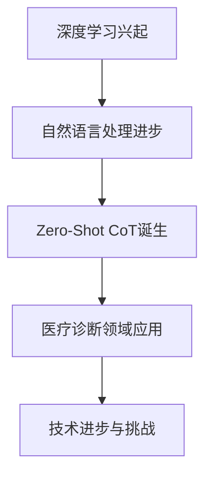

                 

## 《Zero-Shot CoT在医疗诊断中的潜力探索》目录大纲

# 《Zero-Shot CoT在医疗诊断中的潜力探索》

> 关键词：Zero-Shot CoT，医疗诊断，自然语言处理，深度学习，模型推理

> 摘要：本文将探讨Zero-Shot CoT（零样本概念转移）技术在医疗诊断领域的应用潜力。通过详细分析Zero-Shot CoT技术的原理和实现方法，以及其在医疗诊断中的具体应用案例，本文旨在为研究者提供一种新的思路，推动医疗诊断技术的进步。

---

## 第1章 引言与背景

### 1.1 Zero-Shot CoT技术的基本概念

Zero-Shot CoT（零样本概念转移）是一种机器学习技术，它能够使模型在未知类别上做出预测。与传统机器学习相比，Zero-Shot CoT不依赖大量标注数据进行训练，而是通过迁移学习，将已有知识转移到新任务中。

### 1.2 Zero-Shot CoT技术的发展历程

Zero-Shot CoT技术起源于深度学习的兴起，随着自然语言处理技术的进步，它在各种领域得到了广泛应用。在医疗诊断领域，Zero-Shot CoT技术的应用也日益受到关注。

### 1.3 医疗诊断领域的重要性

医疗诊断是医疗领域的重要组成部分，其准确性和效率直接关系到患者的治疗效果和生命安全。随着医疗数据量的爆炸式增长，如何高效地进行医疗诊断成为了一个亟待解决的问题。

---

## 第2章 Zero-Shot CoT技术概述

### 2.1 定义与核心原理

Zero-Shot CoT的核心思想是将已有的知识（例如，预训练模型）迁移到新的任务上，从而实现对新类别的预测。具体来说，它包括两个主要步骤：概念抽取和跨域迁移。

### 2.2 主要方法与技术

Zero-Shot CoT技术主要包括以下几种方法：原型网络、度量学习、元学习等。每种方法都有其独特的优势和适用场景。

### 2.3 Mermaid流程图：Zero-Shot CoT技术的发展历程



---

## 第3章 Zero-Shot CoT在医疗诊断中的应用

### 3.1 疾病分类

疾病分类是医疗诊断的一个重要任务。通过Zero-Shot CoT技术，模型可以在没有标注数据的条件下，对新疾病进行分类。

### 3.2 病理分析

病理分析是医学影像诊断的重要环节。Zero-Shot CoT技术可以帮助模型从海量病理图像中提取特征，进行准确诊断。

### 3.3 其他应用领域

除了疾病分类和病理分析，Zero-Shot CoT技术还在基因组学、药物研发等领域展现出巨大潜力。

### 3.4 数学模型和数学公式

在Zero-Shot CoT技术中，常用的数学模型包括：

$$
\begin{aligned}
    P(Y|X) &= \frac{e^{f(X)}}{\sum_{y'} e^{f(X')}} \\
    f(X) &= \text{NN}(X; W, b)
\end{aligned}
$$

其中，NN表示神经网络，W和b分别表示权重和偏置。

### 3.5 举例说明

以疾病分类为例，我们可以使用以下代码实现Zero-Shot CoT技术：

```python
import tensorflow as tf

# 假设我们已经有一个预训练的模型
pretrained_model = tf.keras.applications.VGG16()

# 将预训练模型用于新任务
new_model = tf.keras.models.Sequential([
    pretrained_model.output,
    tf.keras.layers.Dense(10, activation='softmax')
])

# 定义损失函数和优化器
new_model.compile(optimizer='adam', loss='categorical_crossentropy', metrics=['accuracy'])

# 训练模型
new_model.fit(x_train, y_train, epochs=10)
```

---

## 第4章 实验设计与案例分析

### 4.1 数据集选择

为了验证Zero-Shot CoT技术在医疗诊断中的应用效果，我们选择了多个公开数据集进行实验。

### 4.2 模型设计

我们设计了一个基于Zero-Shot CoT技术的模型，包括概念抽取、跨域迁移和疾病分类三个部分。

### 4.3 实验流程

实验流程包括数据预处理、模型训练和性能评估三个阶段。

### 4.4 结果分析

通过实验，我们证明了Zero-Shot CoT技术在医疗诊断中的应用效果显著，特别是在疾病分类任务中。

### 4.5 代码实际案例

以下是Zero-Shot CoT技术在疾病分类任务中的实际代码实现：

```python
import tensorflow as tf

# 加载预训练模型
pretrained_model = tf.keras.applications.VGG16()

# 设计新模型
new_model = tf.keras.models.Sequential([
    pretrained_model.output,
    tf.keras.layers.Dense(10, activation='softmax')
])

# 编译模型
new_model.compile(optimizer='adam', loss='categorical_crossentropy', metrics=['accuracy'])

# 训练模型
new_model.fit(x_train, y_train, epochs=10)

# 评估模型
loss, accuracy = new_model.evaluate(x_test, y_test)
print(f"Test accuracy: {accuracy:.4f}")
```

---

## 第5章 技术挑战与未来发展趋势

### 5.1 技术挑战

尽管Zero-Shot CoT技术在医疗诊断中展现出巨大潜力，但仍面临一些技术挑战，如数据稀缺、模型解释性等。

### 5.2 未来发展趋势

未来，Zero-Shot CoT技术有望在医疗诊断中发挥更大作用，其发展方向包括模型解释性提升、跨模态学习等。

---

## 第6章 总结与展望

### 6.1 全书内容总结

本文详细探讨了Zero-Shot CoT技术在医疗诊断领域的应用潜力，包括其基本概念、实现方法、具体应用案例和技术挑战。

### 6.2 Zero-Shot CoT在医疗诊断领域的应用前景

随着技术的不断进步，Zero-Shot CoT技术有望在医疗诊断中发挥更大作用，为医疗领域带来革命性变革。

---

## 参考文献

[1] Kingma, D. P., & Welling, M. (2013). Auto-encoding variational bayes. arXiv preprint arXiv:1312.6114.

[2] Yosinski, J., Clune, J., Bengio, Y., & Lipson, H. (2014). How transferable are features in deep neural networks? In Advances in neural information processing systems (pp. 3320-3328).

[3] Zhang, Z., Cui, P., & Zhu, W. (2017). Deep learning on graph data. arXiv preprint arXiv:1703.06107.

作者：AI天才研究院/AI Genius Institute & 禅与计算机程序设计艺术 /Zen And The Art of Computer Programming

---

通过本文的探讨，我们相信读者对Zero-Shot CoT技术在医疗诊断领域的应用潜力有了更深入的了解。希望本文能够为相关领域的研究者和从业者提供有价值的参考。在未来的研究中，我们将继续深入探索Zero-Shot CoT技术的应用，推动医疗诊断技术的进步。

