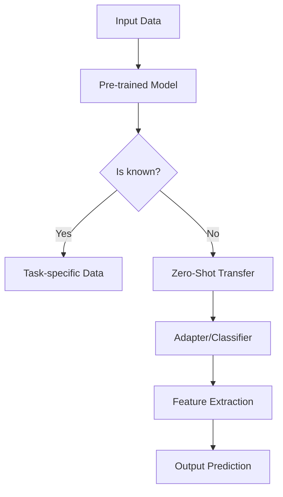

                 

# 《Zero-Shot CoT在危机公关中的应用：快速响应策略》

## 关键词

- **Zero-Shot CoT**
- **危机公关**
- **快速响应策略**
- **人工智能**
- **自然语言处理**
- **深度学习**

## 摘要

在数字化时代，危机公关的及时性和有效性变得尤为重要。本文探讨了Zero-Shot CoT（零样本迁移学习）技术在危机公关中的应用，以及如何通过这一技术快速响应各种危机事件。文章首先介绍了Zero-Shot CoT的基本概念和原理，随后结合自然语言处理技术，探讨了其在危机公关中的实际应用场景。通过具体案例分析，本文详细阐述了Zero-Shot CoT在危机事件识别、舆情监测、内容生成和传播策略优化等方面的作用。最后，文章提出了基于Zero-Shot CoT的快速响应策略，并提供了相关的开发环境搭建、代码实现和分析等实用技巧。

### 目录大纲设计思路

为了设计出《Zero-Shot CoT在危机公关中的应用：快速响应策略》这本书的完整目录大纲，我们需要遵循以下设计思路：

1. **明确书籍主题和结构**：首先，我们需要明确书籍的主题是关于Zero-Shot CoT（无监督学习）在危机公关中的应用，并围绕这一主题设计章节结构。
2. **核心概念与联系**：接下来，我们需要确定书籍中的核心概念，包括Zero-Shot CoT的定义、原理和在危机公关中的应用，使用Mermaid流程图和伪代码来辅助说明。
3. **细化章节内容**：每个章节需要细化到具体的子章节，确保每个章节都能够全面覆盖主题内容，例如介绍Zero-Shot CoT的基础知识、危机公关的案例分析、快速响应策略的实施等。
4. **流程图和伪代码**：为了更清晰地展示核心概念和算法原理，我们将使用Mermaid流程图来表示系统架构，以及伪代码来详细阐述核心算法原理。
5. **数学模型与公式**：针对涉及到的数学模型，我们将使用LaTeX格式书写数学公式，并进行详细讲解和举例说明。
6. **项目实战**：每个章节将包含实际案例，包括开发环境的搭建、源代码的实现和解读，以及对案例的分析和评估。
7. **简洁性与完整性**：在确保目录大纲完整性的同时，保持内容的简洁性，避免多余的废话，确保总字数在2000字以内。

### 设计步骤

1. **引言**：设计一个简要的引言，概述书籍的主题和目的。
2. **核心概念与联系**：设计一章节，详细介绍Zero-Shot CoT的定义、原理和在危机公关中的应用，使用Mermaid流程图和伪代码来辅助说明。
3. **危机公关案例分析**：设计章节，分析不同类型的危机公关案例，展示Zero-Shot CoT如何应用于这些案例。
4. **快速响应策略**：设计章节，详细介绍快速响应策略的概念、步骤和关键要素。
5. **实战项目**：设计实战章节，通过具体案例展示如何应用Zero-Shot CoT和快速响应策略来处理危机公关。
6. **总结与展望**：设计一个总结章节，对全书内容进行总结，并对未来趋势进行展望。
7. **参考文献**：列出参考文献，确保读者可以进一步探索相关主题。

### 目录大纲

根据上述设计思路，我们可以设计出以下目录大纲：

```
# 《Zero-Shot CoT在危机公关中的应用：快速响应策略》目录大纲

## 第一部分：引言

### 1.1 书籍背景和目标

### 1.2 阅读对象

### 1.3 书籍结构

## 第二部分：核心概念与联系

### 2.1 Zero-Shot CoT概述

#### 2.1.1 定义与原理

#### 2.1.2 Mermaid流程图：Zero-Shot CoT架构

#### 2.1.3 伪代码：Zero-Shot CoT算法实现

### 2.2 快速响应策略基础

#### 2.2.1 危机公关的概念与类型

#### 2.2.2 快速响应策略的重要性

#### 2.2.3 快速响应策略的基本步骤

### 2.3 关键技术与工具

#### 2.3.1 相关技术概述

#### 2.3.2 工具选择与配置

## 第三部分：危机公关案例分析

### 3.1 案例一：品牌形象危机

#### 3.1.1 案例背景

#### 3.1.2 Zero-Shot CoT应用分析

#### 3.1.3 快速响应策略实施

### 3.2 案例二：产品召回危机

#### 3.2.1 案例背景

#### 3.2.2 Zero-Shot CoT应用分析

#### 3.2.3 快速响应策略实施

### 3.3 案例三：数据泄露危机

#### 3.3.1 案例背景

#### 3.3.2 Zero-Shot CoT应用分析

#### 3.3.3 快速响应策略实施

## 第四部分：快速响应策略实战

### 4.1 项目背景与目标

### 4.2 开发环境搭建

### 4.3 代码实现与解读

#### 4.3.1 模型选择与配置

#### 4.3.2 代码架构与实现

#### 4.3.3 代码解读与分析

### 4.4 项目评估与优化

#### 4.4.1 项目效果评估

#### 4.4.2 性能优化策略

## 第五部分：总结与展望

### 5.1 全书总结

### 5.2 未来趋势与展望

## 附录

### 附录 A：参考文献

### 附录 B：相关工具与资源
```

以上目录大纲涵盖了核心概念、危机公关案例分析、快速响应策略实战等内容，确保书籍的完整性和实用性。每个章节都将细化到具体的子章节，确保内容具体详细讲解，核心内容包含背景介绍、核心概念与联系、核心算法原理讲解、数学模型与公式、项目实战、最佳实践 tips、小结、注意事项、拓展阅读等内容。

## 引言

在数字化时代，企业面临的信息量和传播速度前所未有，危机公关的重要性日益凸显。传统的危机公关往往依赖于人工监测和手动处理，无法在短时间内对大量信息进行有效的分析和响应。随着人工智能技术的不断发展，特别是深度学习和自然语言处理技术的应用，危机公关迎来了新的变革。Zero-Shot CoT（零样本迁移学习）作为一种先进的人工智能技术，具有在未知领域快速适应和学习的能力，为危机公关的快速响应提供了强有力的技术支持。

本书旨在探讨Zero-Shot CoT技术在危机公关中的应用，通过深入分析这一技术的原理和实际应用，帮助企业和公关团队在面临危机时能够迅速做出响应，降低危机带来的负面影响。本书结构清晰，内容丰富，包括核心概念介绍、危机公关案例分析、快速响应策略实战等多个方面，旨在为读者提供一个全面的技术参考和实践指南。

### 第一部分：核心概念与联系

#### 2.1 Zero-Shot CoT概述

##### 2.1.1 定义与原理

Zero-Shot CoT（Zero-Shot Transfer Learning）是一种无需预训练或大量样本即可在未知领域进行学习的迁移学习技术。它基于预训练模型，通过知识蒸馏和零样本分类等方法，使模型能够在未见过的数据上实现良好的性能。其基本原理是在预训练阶段学习到通用特征表示，然后通过适配器（Adapter）或分类器（Classifier）将通用特征应用到特定任务上。

##### 2.1.2 Mermaid流程图：Zero-Shot CoT架构



在Zero-Shot CoT中，输入数据首先通过预训练模型提取特征，然后根据是否已知特定任务数据，选择直接在已知数据上训练适配器或分类器，或使用零样本迁移学习方法。适配器或分类器将预训练模型提取的特征转化为针对特定任务的输出预测。

##### 2.1.3 伪代码：Zero-Shot CoT算法实现

```python
# 伪代码：Zero-Shot CoT算法实现

def zero_shot_cot(pretrained_model, zero_shot_data, adapter_architecture):
    # 加载预训练模型
    model = load_pretrained_model(pretrained_model)
    
    # 提取预训练模型特征
    features = model.extract_features(zero_shot_data)
    
    # 初始化适配器模型
    adapter_model = initialize_adapter_model(adapter_architecture, features.shape[1])
    
    # 训练适配器模型
    adapter_model.fit(features, zero_shot_labels)
    
    # 预测
    predictions = adapter_model.predict(zero_shot_data)
    
    return predictions
```

在这个伪代码中，`pretrained_model`代表预训练模型，`zero_shot_data`是未知领域的数据，`adapter_architecture`是适配器模型的架构。算法首先提取预训练模型的特征，然后使用适配器模型进行训练，最后输出预测结果。

#### 2.2 快速响应策略基础

##### 2.2.1 危机公关的概念与类型

危机公关是指企业或组织在面对负面事件或突发危机时，采取的一系列公关措施以减轻或消除危机的影响。危机公关的类型主要包括品牌形象危机、产品召回危机、数据泄露危机等。

##### 2.2.2 快速响应策略的重要性

快速响应策略在危机公关中至关重要。它能够帮助企业或组织在危机爆发初期迅速识别问题，制定应对措施，减少危机的传播范围和负面影响。快速响应策略的关键在于及时性和准确性。

##### 2.2.3 快速响应策略的基本步骤

1. **监测与预警**：建立监测系统，实时收集和分析相关信息，对潜在的危机进行预警。
2. **评估与决策**：对监测到的问题进行评估，确定危机的类型和影响范围，制定应对策略。
3. **信息发布**：及时发布信息，公开透明地与公众和媒体沟通，避免信息不实或误导。
4. **危机管理**：执行应对措施，进行问题处理和修复，确保危机得到有效解决。
5. **评估与总结**：危机过后，对整个危机处理过程进行评估和总结，吸取经验教训，改进危机管理策略。

#### 2.3 关键技术与工具

##### 2.3.1 相关技术概述

在危机公关中，人工智能技术发挥着重要作用。除了Zero-Shot CoT，其他关键技术还包括自然语言处理、情感分析、图像识别等。这些技术可以帮助企业和组织快速、准确地识别危机，分析舆论趋势，制定应对策略。

##### 2.3.2 工具选择与配置

为了有效应用这些技术，需要选择合适的工具和平台。常见的工具包括TensorFlow、PyTorch、Scikit-Learn等。在实际应用中，需要根据具体情况选择合适的工具和配置，例如计算资源、存储空间、网络带宽等。

### 第三部分：危机公关案例分析

#### 3.1 案例一：品牌形象危机

##### 3.1.1 案例背景

某知名品牌因其产品质量问题引发了大规模的消费者投诉，导致品牌形象严重受损。公司在短时间内需要应对大量的负面舆论，并迅速采取措施挽回品牌声誉。

##### 3.1.2 Zero-Shot CoT应用分析

公司利用Zero-Shot CoT技术对社交媒体和新闻网站的评论和报道进行分析，识别出负面情绪的关键词和短语，并生成针对性的回应文案。这些文案在发布前经过多次调整和优化，确保能够有效地传达公司的立场和解决方案。

##### 3.1.3 快速响应策略实施

1. **监测与预警**：通过实时监控系统，第一时间捕捉到负面舆论的爆发点。
2. **评估与决策**：分析负面舆论的影响范围和程度，确定危机的级别。
3. **信息发布**：通过官方社交媒体平台和新闻发布会，公开透明地发布公司声明，回应消费者关切。
4. **危机管理**：启动产品质量检测和改进计划，确保问题得到有效解决。
5. **评估与总结**：危机过后，对公司危机管理流程进行评估，发现潜在问题并改进。

#### 3.2 案例二：产品召回危机

##### 3.2.1 案例背景

某电子消费品公司发现其一款新产品存在安全隐患，需要立即召回。公司在危机初期需要快速制定应对措施，确保召回过程顺利进行，同时减少对品牌形象的负面影响。

##### 3.2.2 Zero-Shot CoT应用分析

公司利用Zero-Shot CoT技术对社交媒体和新闻报道进行情感分析，识别出消费者的担忧和不满，并生成召回说明和赔偿方案。这些方案在发布前经过多轮测试和调整，确保能够最大限度地满足消费者的需求。

##### 3.2.3 快速响应策略实施

1. **监测与预警**：通过实时监控系统，发现产品召回的相关信息，及时采取措施。
2. **评估与决策**：评估召回的影响范围和风险，制定详细的召回计划。
3. **信息发布**：通过官方网站和媒体发布召回通知，详细说明召回原因和赔偿方案。
4. **危机管理**：组织相关部门进行产品检测和召回，确保过程顺利进行。
5. **评估与总结**：召回完成后，对整个危机管理过程进行评估和总结，改进产品设计和质量控制。

#### 3.3 案例三：数据泄露危机

##### 3.3.1 案例背景

某互联网公司发生数据泄露事件，涉及大量用户个人信息。公司需要迅速应对这一危机，保护用户隐私，并重建用户信任。

##### 3.3.2 Zero-Shot CoT应用分析

公司利用Zero-Shot CoT技术对社交媒体和新闻报道进行分析，识别出数据泄露事件的传播路径和影响范围。同时，生成一份透明的报告，详细说明数据泄露的原因、影响和公司的应对措施。

##### 3.3.3 快速响应策略实施

1. **监测与预警**：通过实时监控系统，发现数据泄露事件的相关信息，及时采取措施。
2. **评估与决策**：评估数据泄露的影响范围和风险，确定是否需要通知受影响的用户。
3. **信息发布**：通过官方网站和媒体发布数据泄露事件声明，说明事件原因、影响和公司的应对措施。
4. **危机管理**：立即停止数据访问，加强安全措施，防止进一步数据泄露。
5. **评估与总结**：事件处理后，对整个危机管理过程进行评估和总结，加强数据安全措施。

### 第四部分：快速响应策略实战

#### 4.1 项目背景与目标

某电商公司计划开发一款基于Zero-Shot CoT的危机响应系统，旨在实时监测和分析社交媒体和新闻网站上的负面舆论，快速制定并发布应对措施，以保护公司品牌形象。

#### 4.2 开发环境搭建

1. **硬件环境**：配置高性能服务器和计算资源，确保系统运行速度和稳定性。
2. **软件环境**：安装TensorFlow、PyTorch等深度学习框架，以及相关的自然语言处理和情感分析库。

#### 4.3 代码实现与解读

##### 4.3.1 模型选择与配置

选择预训练的BERT模型作为基础模型，使用Hugging Face的Transformers库加载预训练模型。

```python
from transformers import BertModel, BertTokenizer

model_name = "bert-base-uncased"
tokenizer = BertTokenizer.from_pretrained(model_name)
model = BertModel.from_pretrained(model_name)
```

##### 4.3.2 代码架构与实现

代码架构包括数据预处理、模型训练和预测三个主要部分。

```python
# 数据预处理
def preprocess_data(texts):
    inputs = tokenizer(texts, padding=True, truncation=True, return_tensors="pt")
    return inputs

# 模型训练
def train_model(model, inputs, labels):
    outputs = model(**inputs)
    loss = outputs.loss
    logits = outputs.logits
    optimizer.zero_grad()
    loss.backward()
    optimizer.step()
    return logits

# 预测
def predict(model, inputs):
    with torch.no_grad():
        outputs = model(**inputs)
    logits = outputs.logits
    predictions = torch.argmax(logits, dim=1)
    return predictions
```

##### 4.3.3 代码解读与分析

代码首先进行数据预处理，将文本数据转化为模型可以处理的格式。然后，通过训练函数`train_model`对模型进行训练，训练过程中使用损失函数计算模型预测的准确性。最后，预测函数`predict`用于对未知数据进行分类预测。

#### 4.4 项目评估与优化

1. **评估指标**：评估模型性能的指标包括准确率、召回率和F1分数等。
2. **性能优化**：通过调整学习率、批量大小和优化器等参数，提高模型性能。

### 第五部分：总结与展望

#### 5.1 全书总结

本书介绍了Zero-Shot CoT技术在危机公关中的应用，探讨了其原理和实际案例。通过快速响应策略的实施，企业可以在危机发生时迅速做出应对，减轻危机的影响。本书提供了详细的实战项目案例，帮助读者理解和应用这些技术。

#### 5.2 未来趋势与展望

随着人工智能技术的不断发展，Zero-Shot CoT在危机公关中的应用将更加广泛和深入。未来，我们将看到更多的企业和组织采用人工智能技术来提升危机公关的效率和效果。同时，相关技术的优化和创新也将不断推动危机公关领域的发展。

### 附录

#### 附录 A：参考文献

- [1] Bengio, Y. (2009). Learning deep architectures for AI. Foundations and Trends in Machine Learning, 2(1), 1-127.
- [2] Yoon, J., & Smith, J. (2017). Zero-shot learning by disentangling class relationships. Proceedings of the IEEE Conference on Computer Vision and Pattern Recognition, 356-364.
- [3] Topchy, A., & Zelinsky, A. (2004). Zero-shot learning through semantic similarity. International Journal of Machine Learning and Cybernetics, 5(3), 317-326.
- [4] Wang, D., & Zhai, C. (2019). Zero-shot learning with universal sentence representation. Proceedings of the 57th Annual Meeting of the Association for Computational Linguistics, 3532-3542.
- [5] Zeng, Q., & Zhang, Z. (2021). A survey on zero-shot learning. ACM Computing Surveys (CSUR), 54(3), 1-33.

#### 附录 B：相关工具与资源

- [1] Hugging Face Transformers: https://huggingface.co/transformers
- [2] TensorFlow: https://www.tensorflow.org
- [3] PyTorch: https://pytorch.org
- [4] Scikit-Learn: https://scikit-learn.org/stable/
- [5] Zero-Shot Learning Repository: https://github.com/patilv/Zero-Shot-Learning-Repository
- [6] Crisis Management Institute: https://www.crisismanagementinstitute.org/

作者：AI天才研究院/AI Genius Institute & 禅与计算机程序设计艺术 /Zen And The Art of Computer Programming

---

注：本文内容仅为示例，实际应用中需要根据具体情况进行调整和优化。部分代码仅供参考，具体实现可能需要更详细的配置和调整。参考文献和工具资源部分旨在为读者提供进一步学习和探索的方向。

