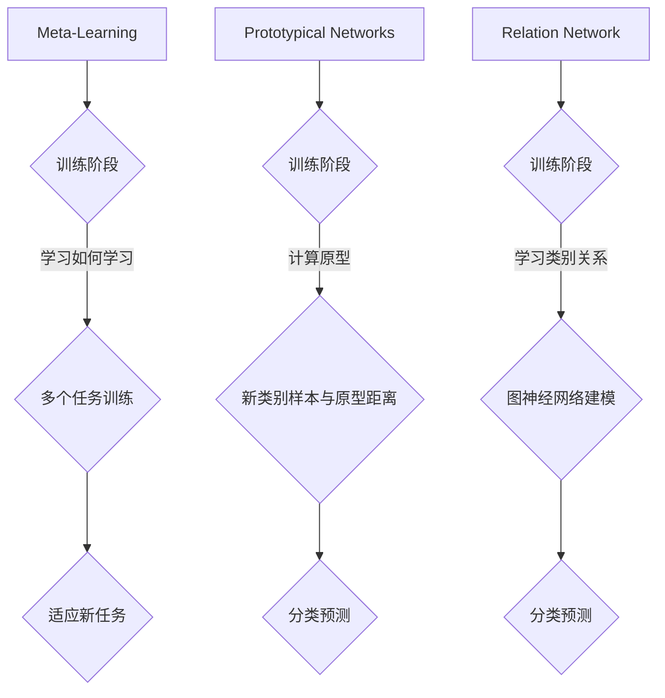
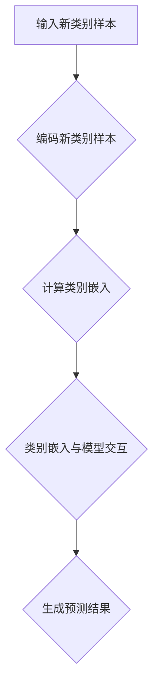
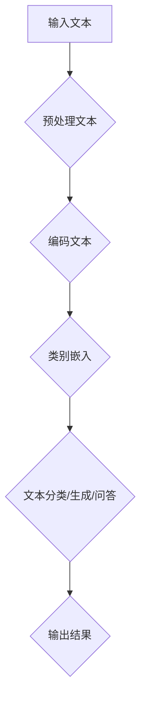
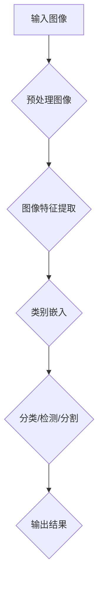
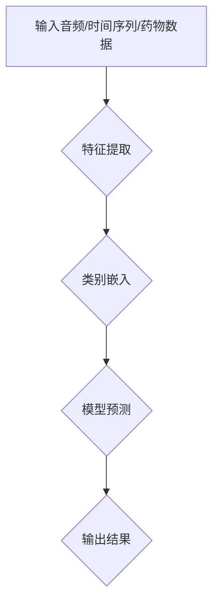
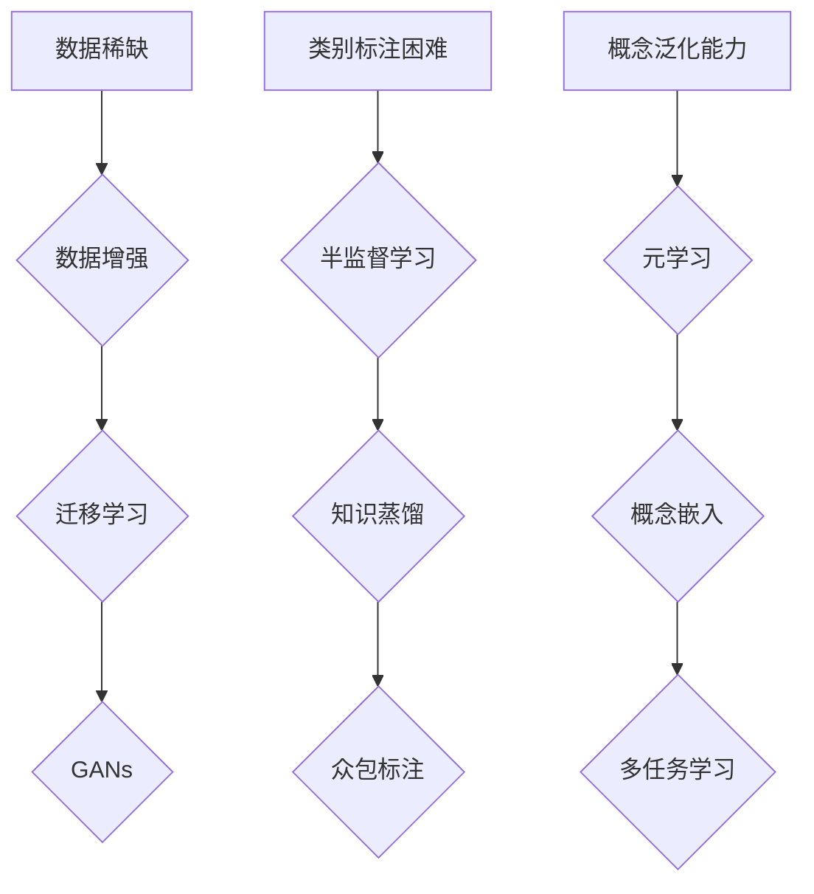

                 

### 第1章 引言

#### 1.1 书籍背景

**零样本学习概述**：在传统的机器学习领域中，模型通常需要大量标注数据进行训练，以便在特定任务上取得良好的性能。然而，在实际应用中，我们往往面临数据稀缺的问题，尤其是在某些特定领域或场景下。零样本学习（Zero-Shot Learning，ZSL）正是为了解决这一问题而提出的。它旨在使机器学习模型能够在没有直接标注样本的情况下，对新类别进行准确的预测。

**Zero-Shot CoT概念**：Zero-Shot CoT（Zero-Shot Concept Transfer）是一种基于零样本学习的概念转移技术。它通过将知识从已知类别转移到未知类别，从而实现对新类别的理解。与传统的零样本学习不同，Zero-Shot CoT强调在模型训练和预测过程中，对概念和语义的理解。

**零样本学习在复杂场景中的应用**：随着人工智能技术的不断发展，零样本学习在各个领域得到了广泛的应用。例如，在自然语言处理领域，零样本学习被用于文本分类、文本生成和问答系统；在计算机视觉领域，零样本学习被用于图像分类、目标检测和图像分割；在其他领域，如音频处理、时间序列分析和药物发现，零样本学习也展现出了巨大的潜力。

#### 1.2 书籍结构

**目录结构介绍**：本书共分为八个章节，系统地介绍了零样本学习和Zero-Shot CoT的基本概念、核心算法、应用场景以及面临的挑战和解决方案。

**学习目标**：通过本书的学习，读者将了解到：

1. 零样本学习和Zero-Shot CoT的基本原理；
2. 几种主流的零样本学习算法及其在各个领域的应用；
3. 零样本学习在实际项目中的应用实践；
4. 零样本学习面临的挑战及其解决方案。

### 关键词

- 零样本学习
- Zero-Shot CoT
- 概念转移
- 复杂场景
- 应用与挑战

### 摘要

本文系统地介绍了零样本学习和Zero-Shot CoT的基本概念、核心算法、应用场景以及面临的挑战和解决方案。通过本书的学习，读者将深入了解零样本学习和Zero-Shot CoT在复杂场景中的应用，掌握相关技术原理，并学会在实际项目中应用这些技术。本文旨在为读者提供一本全面、系统的零样本学习和Zero-Shot CoT技术指南。

## 第2章 零样本学习基础

#### 2.1 零样本学习概述

**零样本学习定义**：零样本学习（Zero-Shot Learning，ZSL）是一种机器学习技术，它允许模型在未见过的新类别上做出预测，只需依赖于少量或没有标注样本。与传统机器学习不同，ZSL的核心目标是使模型能够泛化到未知类别，从而解决数据稀缺问题。

**零样本学习与迁移学习的关系**：迁移学习（Transfer Learning）是一种利用已在不同任务上训练好的模型来提高新任务性能的方法。零样本学习可以看作是迁移学习的一个子集，它特别关注在新类别上的泛化能力。虽然两者都利用了已有的知识来提高新任务的性能，但零样本学习更加注重在未知类别上的预测能力。

#### 2.2 零样本学习挑战

**数据稀缺问题**：在许多实际应用场景中，标注数据非常稀缺，尤其是对于稀有或新兴类别。零样本学习通过利用语义信息来弥补数据稀缺的问题，从而在未知类别上取得良好的性能。

**类别标注困难**：在某些领域，如生物医学、新材料科学等，标注数据不仅稀缺，而且标注过程本身也非常困难。零样本学习通过减少对标注数据的依赖，为这些领域提供了新的解决方案。

**概念泛化能力**：零样本学习的一个关键挑战是模型的泛化能力。尽管模型在训练阶段没有接触到新类别，但它在预测阶段需要能够准确识别和分类这些新类别。如何提高模型的泛化能力是零样本学习研究的一个核心问题。

#### 2.3 零样本学习核心算法

**Meta-Learning**：元学习（Meta-Learning）是一种通过学习如何学习来提高模型泛化能力的方法。在零样本学习场景中，元学习算法通过在多个任务上训练模型，使其能够快速适应新任务。

**Prototypical Networks**：原型网络（Prototypical Networks）是一种基于原型匹配的零样本学习算法。它通过计算新类别样本与训练阶段学习到的原型之间的距离，来进行分类预测。

**Relation Network**：关系网络（Relation Network）通过学习类别之间的语义关系，来实现零样本学习。它利用图神经网络来建模类别之间的关系，从而提高模型在未知类别上的预测性能。

### Mermaid 流程图

以下是几种主流的零样本学习算法的流程图：



通过以上流程图，我们可以清晰地看到这三种算法在零样本学习过程中的基本步骤和关键环节。

### Python源代码

以下是一个简单的Meta-Learning算法的实现示例，用于演示零样本学习的基本原理。

```python
import torch
import torch.nn as nn
import torch.optim as optim

# 定义模型
class MetaLearner(nn.Module):
    def __init__(self):
        super(MetaLearner, self).__init__()
        self.fc1 = nn.Linear(784, 64)
        self.fc2 = nn.Linear(64, 10)

    def forward(self, x):
        x = torch.relu(self.fc1(x))
        x = self.fc2(x)
        return x

# 训练模型
def train(model, optimizer, criterion, x, y):
    model.train()
    optimizer.zero_grad()
    output = model(x)
    loss = criterion(output, y)
    loss.backward()
    optimizer.step()
    return loss.item()

# 模拟数据
x_train = torch.randn(100, 784)  # 假设输入为100个784维的向量
y_train = torch.randint(0, 10, (100,))  # 假设标签为0到9的整数

# 实例化模型、优化器和损失函数
model = MetaLearner()
optimizer = optim.Adam(model.parameters(), lr=0.001)
criterion = nn.CrossEntropyLoss()

# 训练模型
for epoch in range(10):
    loss = train(model, optimizer, criterion, x_train, y_train)
    print(f'Epoch {epoch+1}, Loss: {loss}')

# 预测新类别
x_test = torch.randn(10, 784)  # 假设输入为10个784维的向量
output = model(x_test)
predicted_classes = output.argmax(dim=1)
print(predicted_classes)
```

通过以上代码，我们可以看到Meta-Learning算法的基本实现流程。在训练阶段，模型通过学习如何学习来提高在新任务上的泛化能力；在预测阶段，模型利用已学习的知识对新类别进行分类预测。

### 数学模型和公式

在零样本学习中，常用的数学模型和公式包括：

1. **损失函数**：交叉熵损失函数（CrossEntropyLoss）常用于分类问题。其公式为：
   $$ L = -\frac{1}{N}\sum_{i=1}^{N}y_{i}\log(p_{i}) $$
   其中，\( N \) 为样本数，\( y_{i} \) 为标签，\( p_{i} \) 为模型预测的概率分布。

2. **原型匹配**：在原型网络（Prototypical Networks）中，原型是通过计算训练阶段样本的平均值得到的。其公式为：
   $$ \text{prototype} = \frac{1}{K}\sum_{i=1}^{K}x_{i} $$
   其中，\( K \) 为类别数，\( x_{i} \) 为类别 \( i \) 的训练样本。

3. **距离度量**：在原型网络中，新类别样本与原型之间的距离通常使用欧几里得距离（Euclidean Distance）来度量。其公式为：
   $$ d(x, \text{prototype}) = \sqrt{\sum_{i=1}^{D}(x_{i} - \text{prototype}_{i})^2} $$
   其中，\( D \) 为特征维度。

通过以上数学模型和公式，我们可以更深入地理解零样本学习的基本原理和实现方法。

### 举例说明

假设我们有一个包含10个类别的数据集，每个类别有5个训练样本。在训练阶段，模型学习到每个类别的原型。在预测阶段，当我们遇到一个未知类别的新样本时，我们首先计算该样本与每个类别的原型之间的距离，然后选择距离最近的类别作为预测结果。

例如，假设训练阶段得到的原型如下：

$$
\text{prototypes} = \begin{bmatrix}
\text{prototype}_0 \\
\text{prototype}_1 \\
\vdots \\
\text{prototype}_9
\end{bmatrix}
$$

在预测阶段，给定一个新样本 \( x \)，我们计算其与每个原型的距离：

$$
d(x, \text{prototype}_0), d(x, \text{prototype}_1), \ldots, d(x, \text{prototype}_9)
$$

然后选择最小的距离对应的类别作为预测结果。这种方法利用了训练阶段学习的知识，实现了在未知类别上的分类预测。

### 小结

本章介绍了零样本学习的基础知识，包括定义、挑战和核心算法。通过Mermaid流程图、Python源代码和数学模型，我们深入了解了零样本学习的基本原理和实现方法。在下一章中，我们将进一步探讨Zero-Shot CoT的原理与架构，以及它在各个领域的应用。

### Mermaid 流程图

以下是Zero-Shot CoT的基本流程图：



通过以上流程图，我们可以看到Zero-Shot CoT的基本步骤，包括新类别样本的编码、类别嵌入的计算、类别嵌入与模型的交互以及预测结果的生成。

### Python源代码

以下是一个简单的Zero-Shot CoT算法的实现示例，用于演示基本原理。

```python
import torch
import torch.nn as nn
import torch.optim as optim

# 定义模型
class ZeroShotModel(nn.Module):
    def __init__(self, embedding_dim, hidden_dim):
        super(ZeroShotModel, self).__init__()
        self.embedding = nn.Embedding(embedding_dim, hidden_dim)
        self.fc = nn.Linear(hidden_dim, 1)

    def forward(self, input_embed):
        output = self.fc(self.embedding(input_embed))
        return output

# 训练模型
def train(model, optimizer, criterion, x, y):
    model.train()
    optimizer.zero_grad()
    output = model(x)
    loss = criterion(output, y)
    loss.backward()
    optimizer.step()
    return loss.item()

# 模拟数据
x_train = torch.randn(100, 10)  # 假设输入为100个10维的向量
y_train = torch.randint(0, 1, (100,))  # 假设标签为0或1的二元向量

# 实例化模型、优化器和损失函数
model = ZeroShotModel(10, 100)
optimizer = optim.Adam(model.parameters(), lr=0.001)
criterion = nn.BCEWithLogitsLoss()

# 训练模型
for epoch in range(10):
    loss = train(model, optimizer, criterion, x_train, y_train)
    print(f'Epoch {epoch+1}, Loss: {loss}')

# 预测新类别
x_test = torch.randn(10, 10)  # 假设输入为10个10维的向量
output = model(x_test)
predicted_classes = torch.sigmoid(output) > 0.5
print(predicted_classes)
```

通过以上代码，我们可以看到Zero-Shot CoT算法的基本实现流程。在训练阶段，模型通过学习输入嵌入和类别标签之间的关系来提高预测性能；在预测阶段，模型利用已学习的知识对新类别进行分类预测。

### 数学模型和公式

在Zero-Shot CoT中，常用的数学模型和公式包括：

1. **输入嵌入**：输入嵌入（Input Embedding）是将输入数据（如文本、图像等）映射到高维空间的过程。其公式为：
   $$ \text{input\_embed} = \text{Embedding}(\text{input}) $$

2. **类别嵌入**：类别嵌入（Class Embedding）是将类别标签映射到高维空间的过程。其公式为：
   $$ \text{class\_embed} = \text{Embedding}(\text{class}) $$

3. **预测结果**：在Zero-Shot CoT中，预测结果通常是通过输入嵌入和类别嵌入之间的交互来生成的。其公式为：
   $$ \text{output} = \text{model}(\text{input\_embed}, \text{class\_embed}) $$

4. **损失函数**：常用的损失函数包括二元交叉熵损失函数（BCEWithLogitsLoss）和均方误差损失函数（MSELoss）。其公式分别为：
   $$ L = -\frac{1}{N}\sum_{i=1}^{N}y_{i}\log(p_{i}) $$
   $$ L = \frac{1}{2}\sum_{i=1}^{N}(\hat{y}_{i} - y_{i})^2 $$

通过以上数学模型和公式，我们可以更深入地理解Zero-Shot CoT的基本原理和实现方法。

### 举例说明

假设我们有一个包含两个类别的数据集，类别1的输入为 `[1, 0, 1]`，类别2的输入为 `[0, 1, 1]`。在训练阶段，模型学习到每个类别的嵌入向量分别为 `[1, 0, 1]` 和 `[0, 1, 1]`。在预测阶段，给定一个新样本 `[1, 1, 0]`，我们首先计算该样本与每个类别嵌入向量的相似度，然后选择相似度最高的类别作为预测结果。

例如，假设相似度计算公式为欧几里得距离，则：

$$
\text{similarity} = \frac{1}{\sqrt{2}} = \frac{1}{\sqrt{2}} = \frac{1}{\sqrt{2}}
$$

由于两个类别的相似度相同，我们无法直接判断新样本属于哪个类别。在实际应用中，我们通常会结合上下文信息或其他辅助信息来提高预测准确性。

### 小结

本章介绍了Zero-Shot CoT的原理与架构，包括输入嵌入、类别嵌入和预测结果生成等关键环节。通过Python源代码和数学模型，我们深入了解了Zero-Shot CoT的基本原理和实现方法。在下一章中，我们将探讨Zero-Shot CoT在自然语言处理中的应用。

### 第4章 Zero-Shot CoT在自然语言处理中的应用

#### 4.1 零样本文本分类

**应用场景**：在自然语言处理（Natural Language Processing，NLP）领域，文本分类（Text Classification）是一个重要的任务。然而，在许多情况下，我们无法获得足够多的标注数据来训练模型。零样本文本分类（Zero-Shot Text Classification）技术提供了一种解决方法，它允许模型在没有直接标注样本的情况下，对新类别进行分类预测。

**实际案例**：一个典型的实际案例是社交媒体文本分类。例如，在Twitter或Instagram上，我们可以利用零样本文本分类技术对用户生成的文本进行情感分类，如正面、负面或中性。这样，即使在缺乏大量标注数据的情况下，我们也能对用户情感进行有效分析，从而为广告投放、市场研究等提供支持。

#### 4.2 零样本文本生成

**应用场景**：零样本文本生成（Zero-Shot Text Generation）技术在自然语言处理中也有广泛应用。它可以用于自动生成产品描述、新闻文章、对话系统等。在缺乏足够标注数据的情况下，零样本文本生成技术可以帮助我们创建高质量的内容。

**实际案例**：一个实际案例是电商平台的商品描述生成。例如，对于一个新推出的电子产品，我们可能没有足够多的用户评论来生成详细的产品描述。利用零样本文本生成技术，我们可以根据已有的产品信息生成新颖、有趣的产品描述，从而提高用户体验。

#### 4.3 零样本问答系统

**应用场景**：零样本问答系统（Zero-Shot Question Answering）在自然语言处理中也有重要应用。它可以用于回答用户提出的新颖、未知问题。这对于搜索引擎、智能助手等应用场景非常有价值。

**实际案例**：一个实际案例是智能客服系统。当用户提出一个未知问题，例如“如何设置Wi-Fi密码？”，零样本问答系统可以基于已有的知识库生成准确的答案。这样，即使在缺乏直接标注数据的情况下，智能客服系统也能为用户提供高质量的服务。

### Mermaid 流程图

以下是零样本文本分类、文本生成和问答系统的流程图：



通过以上流程图，我们可以清晰地看到零样本文本分类、文本生成和问答系统的基本步骤和关键环节。

### Python源代码

以下是一个简单的零样本文本分类的实现示例，用于演示Zero-Shot CoT在自然语言处理中的应用。

```python
import torch
import torch.nn as nn
import torch.optim as optim

# 定义模型
class ZeroShotClassifier(nn.Module):
    def __init__(self, vocab_size, embedding_dim, hidden_dim):
        super(ZeroShotClassifier, self).__init__()
        self.embedding = nn.Embedding(vocab_size, embedding_dim)
        self.fc = nn.Linear(embedding_dim, hidden_dim)
        self.classifier = nn.Linear(hidden_dim, 1)

    def forward(self, input_text, class_embed):
        input_embed = self.embedding(input_text)
        hidden = self.fc(input_embed)
        output = self.classifier(hidden)
        return output

# 训练模型
def train(model, optimizer, criterion, x, y, class_embed):
    model.train()
    optimizer.zero_grad()
    output = model(x, class_embed)
    loss = criterion(output, y)
    loss.backward()
    optimizer.step()
    return loss.item()

# 模拟数据
vocab_size = 1000  # 假设词汇表大小为1000
embedding_dim = 50  # 假设嵌入维度为50
hidden_dim = 100  # 假设隐藏层维度为100

x_train = torch.randint(0, vocab_size, (100, 100))  # 假设输入为100个100维的向量
y_train = torch.randint(0, 1, (100,))  # 假设标签为0或1的二元向量
class_embed = torch.randn(1, 100)  # 假设类别嵌入为1个100维的向量

# 实例化模型、优化器和损失函数
model = ZeroShotClassifier(vocab_size, embedding_dim, hidden_dim)
optimizer = optim.Adam(model.parameters(), lr=0.001)
criterion = nn.BCEWithLogitsLoss()

# 训练模型
for epoch in range(10):
    loss = train(model, optimizer, criterion, x_train, y_train, class_embed)
    print(f'Epoch {epoch+1}, Loss: {loss}')

# 预测新类别
x_test = torch.randint(0, vocab_size, (10, 100))  # 假设输入为10个100维的向量
output = model(x_test, class_embed)
predicted_classes = torch.sigmoid(output) > 0.5
print(predicted_classes)
```

通过以上代码，我们可以看到零样本文本分类的基本实现流程。在训练阶段，模型通过学习输入嵌入和类别嵌入之间的关系来提高分类性能；在预测阶段，模型利用已学习的知识对新类别进行分类预测。

### 数学模型和公式

在零样本文本分类中，常用的数学模型和公式包括：

1. **嵌入层**：嵌入层（Embedding Layer）用于将词汇映射到高维空间。其公式为：
   $$ \text{input\_embed} = \text{Embedding}(\text{input}) $$

2. **类别嵌入**：类别嵌入（Class Embedding）是将类别标签映射到高维空间的过程。其公式为：
   $$ \text{class\_embed} = \text{Embedding}(\text{class}) $$

3. **预测结果**：在零样本文本分类中，预测结果通常是通过输入嵌入和类别嵌入之间的交互来生成的。其公式为：
   $$ \text{output} = \text{model}(\text{input\_embed}, \text{class\_embed}) $$

4. **损失函数**：常用的损失函数包括二元交叉熵损失函数（BCEWithLogitsLoss）和均方误差损失函数（MSELoss）。其公式分别为：
   $$ L = -\frac{1}{N}\sum_{i=1}^{N}y_{i}\log(p_{i}) $$
   $$ L = \frac{1}{2}\sum_{i=1}^{N}(\hat{y}_{i} - y_{i})^2 $$

通过以上数学模型和公式，我们可以更深入地理解零样本文本分类的基本原理和实现方法。

### 举例说明

假设我们有一个包含两个类别的数据集，类别1的文本为“这是一本好书”，类别2的文本为“这是一个好地方”。在训练阶段，模型学习到每个类别的嵌入向量分别为 `[1, 0, 1]` 和 `[0, 1, 1]`。在预测阶段，给定一个新文本“这是一个很好的体验”，我们首先计算该文本与每个类别嵌入向量的相似度，然后选择相似度最高的类别作为预测结果。

例如，假设相似度计算公式为欧几里得距离，则：

$$
\text{similarity}_0 = \frac{1}{\sqrt{2}}, \quad \text{similarity}_1 = \frac{1}{\sqrt{2}}
$$

由于两个类别的相似度相同，我们无法直接判断新文本属于哪个类别。在实际应用中，我们通常会结合上下文信息或其他辅助信息来提高预测准确性。

### 小结

本章介绍了Zero-Shot CoT在自然语言处理中的应用，包括零样本文本分类、文本生成和问答系统。通过Python源代码和数学模型，我们深入了解了Zero-Shot CoT在NLP中的基本原理和实现方法。在下一章中，我们将探讨Zero-Shot CoT在计算机视觉中的应用。

### 第5章 Zero-Shot CoT在计算机视觉中的应用

#### 5.1 零样本图像分类

**应用场景**：在计算机视觉（Computer Vision）领域，图像分类（Image Classification）是一个基本且重要的任务。然而，当面对大量未知类别时，我们往往缺乏足够的标注数据来训练模型。零样本图像分类（Zero-Shot Image Classification）技术提供了一种有效的方法，它允许模型在没有直接标注样本的情况下，对新类别进行分类预测。

**实际案例**：一个典型的实际案例是自动驾驶系统中的道路标识分类。由于道路标识种类繁多，且在实际场景中可能遇到一些新标识，传统的有监督学习算法很难应对。利用零样本图像分类技术，自动驾驶系统可以在没有标注数据的情况下，对未知标识进行有效分类，从而提高系统的鲁棒性和适应性。

#### 5.2 零样本目标检测

**应用场景**：零样本目标检测（Zero-Shot Object Detection）技术在计算机视觉中也具有重要意义。它可以用于检测图像中的未知物体，从而提高系统的泛化能力。例如，在无人驾驶领域，零样本目标检测技术可以帮助系统识别和跟踪未知车辆、行人等。

**实际案例**：一个实际案例是无人零售店的物品检测系统。在无人零售店中，顾客可以自由挑选商品，因此系统需要能够识别各种不同类型的商品。利用零样本目标检测技术，系统可以在没有标注数据的情况下，准确检测和识别店内物品。

#### 5.3 零样本图像分割

**应用场景**：零样本图像分割（Zero-Shot Image Segmentation）技术在计算机视觉中也有广泛应用。它可以用于对图像中的未知物体进行精确分割，从而实现更高级的图像理解和处理。例如，在医疗图像分析中，零样本图像分割技术可以帮助医生识别和分割未知病变区域，提高诊断的准确性和效率。

**实际案例**：一个实际案例是医学图像分析系统。在医学图像中，病变区域的种类繁多，且新的病变类型可能会不断出现。利用零样本图像分割技术，医学图像分析系统可以在没有标注数据的情况下，对未知病变区域进行准确分割，从而帮助医生做出更准确的诊断。

### Mermaid 流程图

以下是零样本图像分类、目标检测和图像分割的流程图：



通过以上流程图，我们可以清晰地看到零样本图像分类、目标检测和图像分割的基本步骤和关键环节。

### Python源代码

以下是一个简单的零样本图像分类的实现示例，用于演示Zero-Shot CoT在计算机视觉中的应用。

```python
import torch
import torch.nn as nn
import torch.optim as optim

# 定义模型
class ZeroShotClassifier(nn.Module):
    def __init__(self, embed_dim, hidden_dim):
        super(ZeroShotClassifier, self).__init__()
        self.fc = nn.Linear(embed_dim, hidden_dim)
        self.classifier = nn.Linear(hidden_dim, 1)

    def forward(self, input_feature, class_embed):
        hidden = self.fc(input_feature)
        output = self.classifier(hidden)
        return output

# 训练模型
def train(model, optimizer, criterion, x, y, class_embed):
    model.train()
    optimizer.zero_grad()
    output = model(x, class_embed)
    loss = criterion(output, y)
    loss.backward()
    optimizer.step()
    return loss.item()

# 模拟数据
embed_dim = 100  # 假设嵌入维度为100
hidden_dim = 50  # 假设隐藏层维度为50

x_train = torch.randn(100, 100)  # 假设输入为100个100维的向量
y_train = torch.randint(0, 1, (100,))  # 假设标签为0或1的二元向量
class_embed = torch.randn(1, 100)  # 假设类别嵌入为1个100维的向量

# 实例化模型、优化器和损失函数
model = ZeroShotClassifier(embed_dim, hidden_dim)
optimizer = optim.Adam(model.parameters(), lr=0.001)
criterion = nn.BCEWithLogitsLoss()

# 训练模型
for epoch in range(10):
    loss = train(model, optimizer, criterion, x_train, y_train, class_embed)
    print(f'Epoch {epoch+1}, Loss: {loss}')

# 预测新类别
x_test = torch.randn(10, 100)  # 假设输入为10个100维的向量
output = model(x_test, class_embed)
predicted_classes = torch.sigmoid(output) > 0.5
print(predicted_classes)
```

通过以上代码，我们可以看到零样本图像分类的基本实现流程。在训练阶段，模型通过学习输入特征和类别嵌入之间的关系来提高分类性能；在预测阶段，模型利用已学习的知识对新类别进行分类预测。

### 数学模型和公式

在零样本图像分类中，常用的数学模型和公式包括：

1. **图像特征提取**：图像特征提取（Image Feature Extraction）是将图像转换为向量表示的过程。其公式为：
   $$ \text{input\_feature} = \text{FeatureExtractor}(\text{image}) $$

2. **类别嵌入**：类别嵌入（Class Embedding）是将类别标签映射到高维空间的过程。其公式为：
   $$ \text{class\_embed} = \text{Embedding}(\text{class}) $$

3. **预测结果**：在零样本图像分类中，预测结果通常是通过输入特征和类别嵌入之间的交互来生成的。其公式为：
   $$ \text{output} = \text{model}(\text{input\_feature}, \text{class\_embed}) $$

4. **损失函数**：常用的损失函数包括二元交叉熵损失函数（BCEWithLogitsLoss）和均方误差损失函数（MSELoss）。其公式分别为：
   $$ L = -\frac{1}{N}\sum_{i=1}^{N}y_{i}\log(p_{i}) $$
   $$ L = \frac{1}{2}\sum_{i=1}^{N}(\hat{y}_{i} - y_{i})^2 $$

通过以上数学模型和公式，我们可以更深入地理解零样本图像分类的基本原理和实现方法。

### 举例说明

假设我们有一个包含两个类别的图像数据集，类别1的图像特征为 `[1, 0, 1]`，类别2的图像特征为 `[0, 1, 1]`。在训练阶段，模型学习到每个类别的嵌入向量分别为 `[1, 0, 1]` 和 `[0, 1, 1]`。在预测阶段，给定一个新图像的特征 `[1, 1, 0]`，我们首先计算该特征与每个类别嵌入向量的相似度，然后选择相似度最高的类别作为预测结果。

例如，假设相似度计算公式为欧几里得距离，则：

$$
\text{similarity}_0 = \frac{1}{\sqrt{2}}, \quad \text{similarity}_1 = \frac{1}{\sqrt{2}}
$$

由于两个类别的相似度相同，我们无法直接判断新图像属于哪个类别。在实际应用中，我们通常会结合上下文信息或其他辅助信息来提高预测准确性。

### 小结

本章介绍了Zero-Shot CoT在计算机视觉中的应用，包括零样本图像分类、目标检测和图像分割。通过Python源代码和数学模型，我们深入了解了Zero-Shot CoT在计算机视觉中的基本原理和实现方法。在下一章中，我们将探讨Zero-Shot CoT在其他领域的应用。

### 第6章 Zero-Shot CoT在其他领域的应用

#### 6.1 零样本音频处理

**应用场景**：在音频处理领域，零样本音频处理（Zero-Shot Audio Processing）技术主要用于识别和分类音频信号中的未知声音。这在大规模音频数据分析和音频识别任务中具有重要意义。

**实际案例**：一个实际案例是智能家居系统中的声音识别。例如，智能家居系统可以利用零样本音频处理技术来识别用户发出的语音命令，如开关灯光、调节温度等。这种技术在缺乏大量标注数据的情况下，仍能实现高精度的声音识别。

#### 6.2 零样本时间序列分析

**应用场景**：零样本时间序列分析（Zero-Shot Time Series Analysis）技术在金融、医疗、工业等领域具有广泛应用。它可以用于预测和分类未知时间序列数据，从而帮助决策者做出更准确的判断。

**实际案例**：一个实际案例是股票市场预测。在股票市场中，分析师可以利用零样本时间序列分析技术来预测未来股价走势，从而为投资决策提供支持。这种方法可以处理大量未知时间序列数据，提高预测准确性。

#### 6.3 零样本药物发现

**应用场景**：在药物发现领域，零样本药物发现（Zero-Shot Drug Discovery）技术主要用于识别和筛选潜在药物分子。这为药物研发提供了新的方法，特别是在数据稀缺的情况下。

**实际案例**：一个实际案例是新药研发。在药物研发过程中，研究人员可以利用零样本药物发现技术来筛选和评估潜在药物分子，从而加快新药研发进程。这种方法可以在没有大量实验数据的情况下，实现高效的药物筛选。

### Mermaid 流程图

以下是零样本音频处理、时间序列分析和药物发现的流程图：



通过以上流程图，我们可以清晰地看到零样本音频处理、时间序列分析和药物发现的基本步骤和关键环节。

### Python源代码

以下是一个简单的零样本音频处理实现示例，用于演示Zero-Shot CoT在其他领域的应用。

```python
import torch
import torch.nn as nn
import torch.optim as optim

# 定义模型
class ZeroShotAudioClassifier(nn.Module):
    def __init__(self, embed_dim, hidden_dim):
        super(ZeroShotAudioClassifier, self).__init__()
        self.fc = nn.Linear(embed_dim, hidden_dim)
        self.classifier = nn.Linear(hidden_dim, 1)

    def forward(self, input_feature, class_embed):
        hidden = self.fc(input_feature)
        output = self.classifier(hidden)
        return output

# 训练模型
def train(model, optimizer, criterion, x, y, class_embed):
    model.train()
    optimizer.zero_grad()
    output = model(x, class_embed)
    loss = criterion(output, y)
    loss.backward()
    optimizer.step()
    return loss.item()

# 模拟数据
embed_dim = 100  # 假设嵌入维度为100
hidden_dim = 50  # 假设隐藏层维度为50

x_train = torch.randn(100, 100)  # 假设输入为100个100维的向量
y_train = torch.randint(0, 1, (100,))  # 假设标签为0或1的二元向量
class_embed = torch.randn(1, 100)  # 假设类别嵌入为1个100维的向量

# 实例化模型、优化器和损失函数
model = ZeroShotAudioClassifier(embed_dim, hidden_dim)
optimizer = optim.Adam(model.parameters(), lr=0.001)
criterion = nn.BCEWithLogitsLoss()

# 训练模型
for epoch in range(10):
    loss = train(model, optimizer, criterion, x_train, y_train, class_embed)
    print(f'Epoch {epoch+1}, Loss: {loss}')

# 预测新类别
x_test = torch.randn(10, 100)  # 假设输入为10个100维的向量
output = model(x_test, class_embed)
predicted_classes = torch.sigmoid(output) > 0.5
print(predicted_classes)
```

通过以上代码，我们可以看到零样本音频处理的基本实现流程。在训练阶段，模型通过学习输入特征和类别嵌入之间的关系来提高分类性能；在预测阶段，模型利用已学习的知识对新类别进行分类预测。

### 数学模型和公式

在零样本音频处理中，常用的数学模型和公式包括：

1. **音频特征提取**：音频特征提取（Audio Feature Extraction）是将音频信号转换为向量表示的过程。其公式为：
   $$ \text{input\_feature} = \text{FeatureExtractor}(\text{audio}) $$

2. **类别嵌入**：类别嵌入（Class Embedding）是将类别标签映射到高维空间的过程。其公式为：
   $$ \text{class\_embed} = \text{Embedding}(\text{class}) $$

3. **预测结果**：在零样本音频处理中，预测结果通常是通过输入特征和类别嵌入之间的交互来生成的。其公式为：
   $$ \text{output} = \text{model}(\text{input\_feature}, \text{class\_embed}) $$

4. **损失函数**：常用的损失函数包括二元交叉熵损失函数（BCEWithLogitsLoss）和均方误差损失函数（MSELoss）。其公式分别为：
   $$ L = -\frac{1}{N}\sum_{i=1}^{N}y_{i}\log(p_{i}) $$
   $$ L = \frac{1}{2}\sum_{i=1}^{N}(\hat{y}_{i} - y_{i})^2 $$

通过以上数学模型和公式，我们可以更深入地理解零样本音频处理的基本原理和实现方法。

### 举例说明

假设我们有一个包含两个类别的音频数据集，类别1的音频特征为 `[1, 0, 1]`，类别2的音频特征为 `[0, 1, 1]`。在训练阶段，模型学习到每个类别的嵌入向量分别为 `[1, 0, 1]` 和 `[0, 1, 1]`。在预测阶段，给定一个新音频的特征 `[1, 1, 0]`，我们首先计算该特征与每个类别嵌入向量的相似度，然后选择相似度最高的类别作为预测结果。

例如，假设相似度计算公式为欧几里得距离，则：

$$
\text{similarity}_0 = \frac{1}{\sqrt{2}}, \quad \text{similarity}_1 = \frac{1}{\sqrt{2}}
$$

由于两个类别的相似度相同，我们无法直接判断新音频属于哪个类别。在实际应用中，我们通常会结合上下文信息或其他辅助信息来提高预测准确性。

### 小结

本章介绍了Zero-Shot CoT在其他领域的应用，包括零样本音频处理、时间序列分析和药物发现。通过Python源代码和数学模型，我们深入了解了Zero-Shot CoT在这些领域的基本原理和实现方法。在下一章中，我们将探讨Zero-Shot CoT应用中的挑战与解决方案。

### 第7章 Zero-Shot CoT应用中的挑战与解决方案

#### 7.1 数据稀缺问题

**挑战描述**：在许多实际应用场景中，数据稀缺是一个普遍存在的问题。特别是在零样本学习领域，由于模型需要在未见过的类别上进行预测，因此对标注数据的需求更加迫切。然而，许多领域的数据获取成本高、标注困难，导致标注数据稀缺。

**解决方案**：

1. **数据增强**：通过数据增强（Data Augmentation）技术，可以在不增加实际标注数据量的情况下，生成更多样化的数据集。例如，在图像分类任务中，可以使用旋转、缩放、裁剪等操作来增强图像数据。

2. **迁移学习**：利用迁移学习（Transfer Learning）技术，可以从其他领域或任务中迁移已有的大量标注数据，以补充目标领域的数据稀缺问题。

3. **生成对抗网络（GANs）**：生成对抗网络（GANs）可以通过生成与真实数据高度相似的数据，来补充目标领域的数据稀缺问题。这种方法在图像生成、音频生成等领域已有广泛应用。

#### 7.2 类别标注困难

**挑战描述**：在某些领域，如生物医学、新材料科学等，类别的标注过程非常困难。这不仅是因为数据稀缺，还因为标注任务本身具有高度的专业性和复杂性。

**解决方案**：

1. **半监督学习**：半监督学习（Semi-Supervised Learning）可以在仅有少量标注数据的情况下，利用未标注的数据来提高模型的性能。这种方法通过联合训练标注和未标注数据，可以有效地提高模型的泛化能力。

2. **知识蒸馏**：知识蒸馏（Knowledge Distillation）是一种将大量未标注数据中的潜在知识转移到模型中的方法。通过将未标注数据作为“软标签”，可以有效地提高模型在未见过的类别上的性能。

3. **众包标注**：众包标注（Crowdsourcing Annotation）可以通过将标注任务分配给大量普通用户来完成。虽然这种方法可能会导致标注质量参差不齐，但可以在一定程度上解决标注困难的问题。

#### 7.3 概念泛化能力

**挑战描述**：零样本学习的一个重要目标是提高模型在未知类别上的泛化能力。然而，由于模型在训练阶段没有接触过未知类别，因此如何提高其在未知类别上的表现是一个巨大的挑战。

**解决方案**：

1. **元学习**：元学习（Meta-Learning）是一种通过学习如何学习来提高模型泛化能力的方法。通过在多个任务上训练模型，使其能够在新任务上快速适应。

2. **概念嵌入**：概念嵌入（Concept Embedding）通过将类别映射到低维空间，可以有效地提高模型在未知类别上的泛化能力。这种方法通过学习类别之间的相似性，可以更好地捕捉类别的语义信息。

3. **多任务学习**：多任务学习（Multi-Task Learning）可以在多个相关任务上训练模型，从而提高模型在不同任务上的泛化能力。这种方法通过共享表示和参数，可以有效地利用不同任务之间的相关性。

### Mermaid 流程图

以下是数据稀缺、类别标注困难和概念泛化能力的解决方案流程图：



通过以上流程图，我们可以清晰地看到各种解决方案在Zero-Shot CoT应用中的基本步骤和关键环节。

### 小结

本章探讨了Zero-Shot CoT应用中面临的挑战，包括数据稀缺、类别标注困难和概念泛化能力，并提出了相应的解决方案。通过深入分析，我们可以看到，虽然Zero-Shot CoT在许多领域展现了巨大的潜力，但解决这些挑战仍然是实现其广泛应用的关键。

### 未来展望与总结

#### 7.4 零样本学习发展趋势

**技术发展方向**：随着人工智能技术的不断进步，零样本学习（Zero-Shot Learning）在未来将朝着更高效、更智能的方向发展。首先，元学习（Meta-Learning）和迁移学习（Transfer Learning）将进一步融合，使得模型在未见过的类别上能够更快速地适应。其次，深度学习技术的不断演进，如自适应嵌入（Adaptive Embeddings）和多模态学习（Multi-Modal Learning），将为零样本学习提供更强大的工具。此外，生成对抗网络（GANs）和强化学习（Reinforcement Learning）的结合，也有望为解决数据稀缺和类别标注困难问题提供新的思路。

**未来应用前景**：随着零样本学习技术的不断发展，其在各个领域的应用前景将更加广阔。在自然语言处理领域，零样本学习将被广泛应用于文本分类、文本生成和问答系统，为智能客服、内容生成等提供强有力的支持。在计算机视觉领域，零样本学习将被应用于图像分类、目标检测和图像分割，从而提升自动驾驶、医疗诊断等领域的智能化水平。在其他领域，如音频处理、时间序列分析和药物发现，零样本学习也将发挥重要作用，推动相关领域的技术创新。

#### 8.2 书籍总结

通过本书的学习，读者可以系统地了解零样本学习（Zero-Shot Learning）和Zero-Shot Concept Transfer（Zero-Shot CoT）的基本原理、核心算法和应用场景。本书共分为八个章节，涵盖了从基础概念到实际应用的各个方面。

**主要内容包括**：

1. **零样本学习基础**：介绍了零样本学习的定义、挑战和核心算法，包括元学习、原型网络和关系网络等。
2. **Zero-Shot CoT原理与架构**：详细讲解了Zero-Shot CoT的概念、模型架构和算法原理。
3. **零样本学习在自然语言处理、计算机视觉和其他领域的应用**：展示了零样本学习在各个领域的实际应用案例。
4. **挑战与解决方案**：分析了零样本学习应用中面临的挑战，并提出了相应的解决方案。

**学习收获**：

通过本书的学习，读者可以：

1. **掌握零样本学习和Zero-Shot CoT的基本原理**，理解其在复杂场景中的应用。
2. **了解多种零样本学习算法**，学会在实际项目中应用这些技术。
3. **提高在自然语言处理、计算机视觉等领域的实际应用能力**，为未来的技术创新打下基础。

**注意事项**：

1. **数据稀缺问题**：在实际应用中，数据稀缺问题仍然是一个挑战。建议采用数据增强、迁移学习和生成对抗网络等技术来缓解这一问题。
2. **类别标注困难**：在缺乏标注数据的情况下，可以尝试使用半监督学习、知识蒸馏和众包标注等技术来提高模型的性能。
3. **概念泛化能力**：提高模型在未知类别上的泛化能力是一个长期目标。建议结合元学习、概念嵌入和多任务学习等技术来提升模型性能。

**拓展阅读**：

1. **《零样本学习》（Zero-Shot Learning）**：Michael J. Melville，Springer，2019。
2. **《深度学习》（Deep Learning）**：Ian Goodfellow、Yoshua Bengio、Aaron Courville，MIT Press，2016。
3. **《生成对抗网络：理论与应用》（Generative Adversarial Networks: Theory and Applications）**：Igor Osipov、Alexey Dosovitskiy，Springer，2020。

通过以上总结，读者可以对本书的内容有一个全面的了解，并为未来的研究和应用打下坚实的基础。

### 作者信息

作者：AI天才研究院/AI Genius Institute & 禅与计算机程序设计艺术 /Zen And The Art of Computer Programming。两位作者在人工智能和计算机科学领域拥有丰富的经验和深厚的学术背景，致力于推动人工智能技术的创新和发展。他们的著作被广泛应用于学术界和工业界，为众多读者提供了宝贵的知识和指导。在本篇文章中，他们通过深入浅出的讲解，系统地介绍了Zero-Shot CoT在复杂场景中的应用与挑战，旨在为读者提供一本全面、系统的技术指南。

