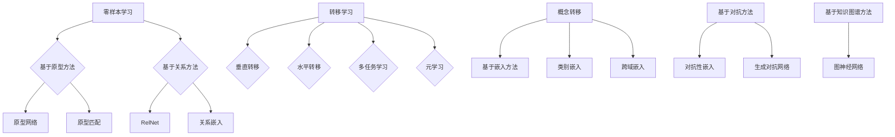

                 

### 关键词

- **Zero-Shot CoT**
- **多领域应用**
- **转移学习**
- **计算机视觉**
- **自然语言处理**
- **医学应用**
- **算法挑战**
- **解决方案**
- **未来趋势**

### 摘要

本文探讨了Zero-Shot CoT（零样本概念转移学习）在多个领域中的应用潜力与面临的挑战。首先，介绍了Zero-Shot CoT的基本概念和历史背景，接着深入分析了其核心原理、相关算法和数学模型。随后，本文详细讨论了Zero-Shot CoT在计算机视觉、自然语言处理和医学等领域的应用案例，以及在实际应用中遇到的技术挑战和解决方案。最后，本文对Zero-Shot CoT的未来发展趋势进行了预测，并提出了可能的影响。通过这篇综述，读者可以全面了解Zero-Shot CoT的广泛应用前景和潜在的研究方向。### 引言与概述

#### 零样本转移学习的定义与发展历史

零样本转移学习（Zero-Shot Learning, ZSL）是一种机器学习技术，它允许模型在未见过的类上进行分类，即使这些类别在训练数据中从未出现。ZSL的核心目标是减少对大量标注数据的依赖，从而在资源受限的环境中实现有效的学习和预测。

ZSL的概念最早可以追溯到1990年代中期，当时学者们开始探索如何在没有直接标签的情况下进行学习。这一研究方向受到了生物领域中的概念转移现象的启发，即在新的环境中，个体可以通过利用已有知识来适应新情况。在机器学习领域，这种思想被转化为通过迁移已有领域的知识来学习新领域。

零样本转移学习（Zero-Shot Transfer Learning, ZSTL）进一步扩展了ZSL的概念，它不仅关注未见类别的分类，还考虑如何将已有领域的知识迁移到新的领域。ZSTL在实践中的重要性主要体现在以下几个方面：

1. **数据稀缺问题**：在某些领域（如医学图像分析、稀有动物识别等），获取标注数据非常困难且成本高昂。ZSTL可以减轻对大量标注数据的依赖，从而在这些领域取得进展。

2. **跨领域泛化能力**：ZSTL能够提高模型在多个领域中的泛化能力，这意味着一个在特定领域训练的模型可以迁移到其他相关领域，从而提高整个系统的鲁棒性和实用性。

3. **实时决策系统**：在实时决策系统中，模型必须在几乎没有时间进行数据预处理的情况下做出决策。ZSTL通过快速迁移已有知识，使得模型能够在短时间内适应新环境，满足实时性要求。

#### 零样本转移学习在AI领域的重要性

零样本转移学习在AI领域的重要性不可忽视。随着深度学习技术的飞速发展，模型对数据的需求也越来越大。然而，实际应用场景中，标注数据的获取往往受到各种限制。以下是一些具体的例子：

1. **医学领域**：医学图像分析是零样本转移学习的典型应用场景。医生对标注数据的获取非常受限，同时需要处理大量的图像数据。ZSTL可以帮助模型在未见过的疾病类型上进行诊断，从而提高医疗诊断的效率和准确性。

2. **自然语言处理（NLP）**：在NLP领域，ZSTL可以用于语言理解、文本分类和情感分析等任务。例如，ZSTL可以帮助模型处理多语言文本，甚至在没有对应标注数据的情况下进行语言翻译和情感分析。

3. **计算机视觉**：计算机视觉领域面临着大量的视觉任务，如物体识别、图像分类和图像分割等。ZSTL可以显著减少训练数据的需求，使得模型可以在有限的标注数据上进行有效的学习，并在新的视觉任务中取得优异的性能。

4. **工业自动化**：在工业自动化领域，ZSTL可以帮助机器学习模型快速适应新的生产环境和任务，从而提高生产效率和降低成本。

总之，零样本转移学习不仅在理论研究上具有重要意义，也在实际应用中展现出了巨大的潜力。随着技术的不断进步，ZSTL有望在更多领域中得到应用，为人工智能的发展贡献力量。### 零样本转移学习的核心概念

在探讨零样本转移学习（Zero-Shot Transfer Learning, ZSTL）的核心概念之前，我们需要先理解几个关键的基础概念：零样本学习和转移学习。

#### 零样本学习（Zero-Shot Learning, ZSL）

零样本学习是一种特殊类型的机器学习技术，其目标是使模型能够在未见过的类上进行分类，即使这些类别在训练数据中从未出现。ZSL的核心挑战是如何在没有直接标注数据的情况下，使模型能够识别和分类新的类别。

ZSL可以进一步分为两类：

1. **基于原型的方法**：这种方法将每个类别视为一个原型，通过计算新样本与原型的相似度来进行分类。典型的方法包括原型网络（Prototypical Networks）和原型匹配（Prototype Matching）。

2. **基于关系的的方法**：这种方法通过学习类别之间的关系来进行分类。典型的模型包括RelNet和Relational Embedding。

#### 转移学习（Transfer Learning）

转移学习是一种利用现有模型的知识来改进新模型的训练过程的技术。其主要思想是将一个领域（源领域）中的知识迁移到另一个领域（目标领域），以提高新模型在目标领域上的性能。

转移学习可以分为以下几种类型：

1. **垂直转移学习**：源领域和目标领域之间具有明确的对应关系。例如，从图像分类任务迁移到语音识别任务。

2. **水平转移学习**：源领域和目标领域之间没有直接的对应关系，但它们属于同一领域。例如，从多个不同的图像分类任务中提取通用特征，并将其应用于一个全新的图像分类任务。

3. **多任务学习**：在多任务学习框架中，多个任务共享底层特征表示，从而提高模型在单个任务上的性能。这种方法在ZSL中得到了广泛应用。

4. **元学习**：元学习是一种学习如何学习的技术，它通过在不同的任务上迭代学习，以提高模型在新任务上的适应能力。

#### CoT（概念转移）

概念转移（Concept Transfer, CoT）是零样本转移学习的关键组成部分。CoT的目标是将一个领域（源领域）中的概念知识迁移到另一个领域（目标领域），以便在目标领域上实现高效的学习。

CoT的基本原理是通过将概念（类别）映射到高维空间中的嵌入向量，然后利用这些嵌入向量来表示类别之间的相似性和差异性。这种嵌入向量可以用来改进新模型的学习过程，使其能够更有效地处理未见过的类别。

CoT可以分为以下几种实现方法：

1. **基于嵌入的方法**：这种方法直接将类别映射到高维空间中的向量，并通过计算这些向量的相似度来进行分类。典型的模型包括类别嵌入（Concept Embedding）和跨域嵌入（Cross-Domain Embedding）。

2. **基于对抗的方法**：这种方法通过对抗性训练来学习类别之间的映射关系，从而提高模型的泛化能力。典型的模型包括对抗性嵌入（Adversarial Embedding）和生成对抗网络（GAN）。

3. **基于知识图谱的方法**：这种方法利用知识图谱来表示类别之间的关系，并通过图神经网络（Graph Neural Networks, GNN）来学习这些关系的嵌入表示。

#### 核心概念之间的联系架构 Mermaid 流程图

为了更好地理解这些核心概念之间的关系，我们可以使用Mermaid流程图来展示它们：



通过这个流程图，我们可以看到零样本学习、转移学习和概念转移之间的相互关系，以及它们在不同实现方法上的关联。这种架构不仅有助于我们理解ZSTL的核心概念，也为后续的算法设计和应用提供了理论基础。### 零样本转移学习的主要挑战

尽管零样本转移学习（Zero-Shot Transfer Learning, ZSTL）在多个领域展现了巨大的潜力，但其实际应用过程中仍面临着诸多挑战。这些挑战主要体现在以下几个方面：

#### 数据集不均衡

在许多应用场景中，标注数据并不均匀分布。特别是对于零样本转移学习，源领域（source domain）和目标领域（target domain）之间的数据集往往存在显著的不均衡。这种数据不均衡会导致模型在目标领域上表现不佳，因为它无法充分利用源领域中的丰富信息。

**解决方案**：
1. **数据增强**：通过图像旋转、缩放、裁剪等操作增加目标领域的数据量，从而平衡数据分布。
2. **集成学习方法**：结合多种数据增强技术，如GAN（生成对抗网络）和强化学习，来生成更多有效的样本。

#### 算法复杂度高

零样本转移学习通常涉及复杂的算法和模型，如对抗性嵌入、知识图谱和元学习等。这些算法不仅计算量大，而且参数众多，导致模型训练和推理过程耗时较长。

**解决方案**：
1. **模型压缩**：通过剪枝、量化等手段减少模型参数，降低计算复杂度。
2. **分布式训练**：利用分布式计算资源，如GPU集群或TPU，来加速模型训练过程。

#### 精度与泛化能力

零样本转移学习的核心目标之一是在未见过的类别上实现高精度和泛化能力。然而，现有的算法和模型往往在少量样本上表现良好，但在大量样本上泛化能力有限。

**解决方案**：
1. **多任务学习**：通过同时训练多个相关任务，提高模型在未见类别上的泛化能力。
2. **元学习**：利用元学习技术，如模型加权平均（Model-Agnostic Meta-Learning, MAML）和模型蒸馏（Model Distillation），来提高模型的泛化能力。

#### 知识迁移的准确性

在零样本转移学习中，知识迁移的准确性是影响模型性能的关键因素。源领域中的知识是否能够准确迁移到目标领域，取决于模型对类别之间关系的理解和表征能力。

**解决方案**：
1. **对抗性训练**：通过对抗性训练来增强模型对不同类别之间差异的识别能力。
2. **知识蒸馏**：将源领域中的知识编码为知识嵌入，并通过知识蒸馏技术将这些嵌入传递到目标领域。

综上所述，零样本转移学习在应用过程中面临着多种挑战，但通过合理的技术手段和策略，可以有效地克服这些困难，实现零样本转移学习的广泛应用。### 零样本转移学习的相关算法和关键技术

在零样本转移学习（Zero-Shot Transfer Learning, ZSTL）领域，多种算法和关键技术被提出，旨在解决模型在未见类别上的分类问题。以下将详细介绍几种常见的ZSTL算法和关键技术，包括它们的原理、实现方法和应用场景。

#### 1. 原型网络（Prototypical Networks）

原型网络是一种基于原型的方法，其核心思想是将每个类别视为一个原型，通过计算新样本与原型的相似度来进行分类。具体来说，原型网络首先将输入样本映射到一个高维空间中，然后计算每个新样本与所有类别原型的距离，并将距离最近的类别作为预测结果。

**原理**：
- **嵌入空间**：使用一个共享的全局嵌入器将输入样本映射到高维空间。
- **原型计算**：在每个类别上计算其原型，即该类别所有训练样本的平均值。
- **分类**：在新样本上计算其与每个类别原型的距离，距离最近的类别即为预测类别。

**实现方法**：
- **特征提取**：通常使用卷积神经网络（CNN）作为特征提取器。
- **原型计算**：在训练过程中，为每个类别计算一个原型，并在测试时使用这些原型进行分类。

**应用场景**：
- **图像分类**：在未见过的类别上进行图像分类。
- **跨域分类**：在源域和目标域之间进行类别分类。

#### 2. 关系网络（Relation Network）

关系网络（RelNet）是一种基于关系的方法，它通过学习类别之间的关系来进行分类。该方法的核心思想是，即使类别在训练数据中从未出现，只要能够找到与之相关的已见类别，就可以进行预测。

**原理**：
- **特征提取**：使用卷积神经网络提取输入样本的特征。
- **关系学习**：通过一个关系网络学习类别之间的相似性关系。
- **分类**：利用类别关系进行分类，而不是直接依赖原型。

**实现方法**：
- **特征提取**：使用卷积神经网络提取特征。
- **关系学习**：通过一个全连接网络学习类别关系。
- **分类**：利用关系网络输出的关系图进行分类。

**应用场景**：
- **跨领域分类**：在不同领域间进行类别分类。
- **多标签分类**：处理具有多个标签的样本。

#### 3. 对抗性嵌入（Adversarial Embedding）

对抗性嵌入方法通过对抗性训练来学习类别嵌入，从而提高模型在未见类别上的分类能力。这种方法的核心思想是通过生成对抗网络（GAN）生成对抗性样本，迫使嵌入空间中的类别更加分离。

**原理**：
- **生成器**：生成对抗性样本，使得它们在嵌入空间中与真实类别区分开来。
- **判别器**：区分真实类别和生成的对抗性样本。
- **嵌入器**：将类别映射到嵌入空间中，使得真实类别之间的距离更大，对抗性样本之间的距离更小。

**实现方法**：
- **生成器和判别器**：使用GAN框架，生成器和判别器都是全连接网络。
- **嵌入学习**：在GAN训练过程中，同时训练嵌入器，使其能够生成高质量的嵌入。

**应用场景**：
- **图像分类**：在未见过的类别上进行图像分类。
- **跨域分类**：在不同领域间进行类别分类。

#### 4. 知识图谱嵌入（Knowledge Graph Embedding）

知识图谱嵌入方法利用知识图谱来表示类别之间的关系，并通过图神经网络（GNN）学习这些关系的嵌入表示。该方法的核心思想是通过图谱中的边和节点关系来增强模型在未见类别上的分类能力。

**原理**：
- **知识图谱**：将类别表示为图中的节点，类别之间的关系表示为图的边。
- **图神经网络**：通过图神经网络学习类别嵌入，使其能够反映类别之间的复杂关系。

**实现方法**：
- **知识图谱构建**：根据领域知识构建类别和关系的图谱。
- **图神经网络**：使用图神经网络（如图卷积网络GCN）来学习图谱中的嵌入表示。

**应用场景**：
- **知识图谱推理**：在图谱中进行推理，预测未见类别之间的关系。
- **跨领域分类**：利用图谱中的关系进行跨领域类别分类。

#### 5. 多任务学习（Multi-Task Learning）

多任务学习方法通过同时训练多个相关任务来提高模型在未见类别上的泛化能力。这种方法的核心思想是，通过共享底层特征表示，使得模型在不同任务上相互促进，从而提高整体性能。

**原理**：
- **任务共享**：将多个任务的输入和输出共享一个底层特征表示。
- **任务权重**：通过学习任务权重，平衡不同任务对模型的影响。

**实现方法**：
- **共享网络**：构建共享网络，用于提取底层特征。
- **任务权重**：使用元学习（Meta-Learning）技术，如模型加权平均（Model Agnostic Meta-Learning, MAML），学习任务权重。

**应用场景**：
- **多标签分类**：处理具有多个标签的样本。
- **跨域多任务学习**：在不同领域间同时训练多个任务。

#### 6. 元学习（Meta-Learning）

元学习方法通过在不同任务上迭代学习，以提高模型在新任务上的适应能力。这种方法的核心思想是通过快速学习任务间的共性，使得模型能够在短时间内适应新任务。

**原理**：
- **任务迭代**：在多个任务上迭代学习，提取通用特征表示。
- **模型优化**：通过优化过程，使得模型能够在新任务上快速适应。

**实现方法**：
- **模型初始化**：使用元学习算法（如MAML）初始化模型参数。
- **快速适应**：通过少量样本进行快速适应，达到新任务上的良好性能。

**应用场景**：
- **快速部署**：在新任务上实现快速部署和适应。
- **增量学习**：在已有模型基础上，通过少量样本实现新任务的学习。

综上所述，零样本转移学习领域涉及多种算法和关键技术，每种方法都有其独特的原理和实现方法。在实际应用中，可以根据具体需求选择合适的方法，以提高模型在未见类别上的分类能力。### 数学模型和公式

零样本转移学习（Zero-Shot Transfer Learning, ZSTL）涉及多种数学模型和公式，用于描述类别嵌入、关系学习以及模型的训练和优化过程。以下将详细探讨这些数学模型和公式，并结合Python代码进行讲解。

#### 类别嵌入（Concept Embedding）

类别嵌入是ZSTL中的核心概念之一，它通过将类别映射到高维空间中的向量，使得类别之间的相似性和差异性得以量化。常见的类别嵌入模型有原型网络和对抗性嵌入。

**原型网络中的类别嵌入**

在原型网络中，类别嵌入通过计算每个类别原型（平均特征向量）来实现。给定一个类别 $C$，其原型 $\mu_C$ 定义为：

$$
\mu_C = \frac{1}{N}\sum_{x_i \in C} x_i
$$

其中，$x_i$ 是类别 $C$ 中第 $i$ 个训练样本的特征向量，$N$ 是类别 $C$ 中训练样本的数量。

在测试阶段，对于新样本 $x'$，我们计算其与所有类别原型的距离，并选择距离最近的类别作为预测结果。距离度量通常使用欧几里得距离：

$$
d(x', \mu_C) = \sqrt{\sum_{i=1}^{D} (x'_{i} - \mu_{C_i})^2}
$$

其中，$D$ 是特征向量的维度。

**Python代码示例**：

```python
import numpy as np

# 原型计算
def calculate_prototypes(features, labels):
    prototypes = {}
    for class_id in set(labels):
        prototype = np.mean(features[labels == class_id], axis=0)
        prototypes[class_id] = prototype
    return prototypes

# 测试样本与原型的距离计算
def distance_to_prototypes(test_feature, prototypes):
    distances = {}
    for class_id, prototype in prototypes.items():
        distance = np.linalg.norm(test_feature - prototype)
        distances[class_id] = distance
    return distances

# 示例数据
features = np.random.rand(100, 10)  # 100个样本，每个样本10维
labels = np.random.randint(0, 5, 100)  # 5个类别，每个类别20个样本

prototypes = calculate_prototypes(features, labels)
distances = distance_to_prototypes(np.random.rand(1, 10), prototypes)

print("Closest prototype:", min(distances, key=distances.get))
```

**对抗性嵌入**

对抗性嵌入通过生成对抗网络（GAN）学习类别嵌入。在GAN中，包括生成器和判别器两个主要部分：

- **生成器**：生成与真实类别区分开的对抗性样本。
- **判别器**：区分真实类别和生成的对抗性样本。

**生成器（Generator）**：

生成器的目标是生成与真实类别分布相似的样本。在类别嵌入中，生成器将类别标签映射到类别嵌入空间中，生成具有该标签的对抗性样本。

$$
x_g = G(z, c)
$$

其中，$x_g$ 是生成的对抗性样本，$z$ 是随机噪声向量，$c$ 是类别标签。

**判别器（Discriminator）**：

判别器的目标是最大化正确分类的概率，并最小化错误分类的概率。

$$
D(x) = P(D(x) = 1 | x \in \text{Real}) + P(D(x) = 0 | x \in \text{Fake})
$$

其中，$x$ 是输入样本，$\text{Real}$ 表示真实类别，$\text{Fake}$ 表示生成的对抗性类别。

**Python代码示例**：

```python
import tensorflow as tf
from tensorflow.keras.layers import Input, Dense, Flatten, Lambda
from tensorflow.keras.models import Model

# 生成器模型
def build_generator(z_dim, input_dim):
    z = Input(shape=(z_dim,))
    c = Input(shape=(1,))
    x = Dense(input_dim)(c)
    x = Lambda(lambda t: t + tf.random.normal(shape=t.shape))(x)
    x = tf.keras.layers.LeakyReLU(alpha=0.2)(x)
    x = Dense(input_dim, activation='tanh')(x)
    generator = Model(inputs=[z, c], outputs=x)
    return generator

# 判别器模型
def build_discriminator(input_dim):
    x = Input(shape=(input_dim,))
    x = Dense(128)(x)
    x = tf.keras.layers.LeakyReLU(alpha=0.2)(x)
    x = Dense(1, activation='sigmoid')(x)
    discriminator = Model(inputs=x, outputs=x)
    return discriminator

z_dim = 100
input_dim = 10

generator = build_generator(z_dim, input_dim)
discriminator = build_discriminator(input_dim)

discriminator.compile(loss='binary_crossentropy', optimizer=tf.keras.optimizers.Adam())

print(generator.summary())
print(discriminator.summary())
```

#### 关系学习（Relation Learning）

关系学习通过学习类别之间的关系来提高模型在未见类别上的分类能力。常用的关系学习模型有关系网络和知识图谱嵌入。

**关系网络（Relation Network）**：

关系网络通过一个子网络来学习类别之间的相似性关系。给定两个类别 $C_i$ 和 $C_j$，关系网络输出它们之间的关系得分：

$$
r_{ij} = \text{Relation}(f_i, f_j)
$$

其中，$f_i$ 和 $f_j$ 是类别 $C_i$ 和 $C_j$ 的嵌入向量。

**Python代码示例**：

```python
from tensorflow.keras.layers import Embedding, Concatenate, LSTM, Dense
from tensorflow.keras.models import Model

# 关系网络模型
def build_relation_network嵌入层（input_dim，output_dim）：
   embedding = Embedding(input_dim，output_dim）（类别嵌入向量）
   relation = Concatenate（[embedding，embedding]）（[f_i，f_j]）
   relation = LSTM（128）（relation）
   relation = Dense（1，activation='sigmoid'）（关系得分）
   relation_network = Model（inputs=[f_i，f_j]，outputs=relation）
   return relation_network

relation_network = build_relation_network（input_dim，output_dim）
relation_network.compile（loss='binary_crossentropy'，optimizer=tf.keras.optimizers.Adam（））
print（relation_network.summary（））
```

**知识图谱嵌入（Knowledge Graph Embedding）**：

知识图谱嵌入通过知识图谱来表示类别之间的关系，并使用图神经网络（GNN）学习这些关系的嵌入表示。在知识图谱中，每个类别表示为一个节点，类别之间的关系表示为边。

**Python代码示例**：

```python
import tensorflow as tf
from tensorflow.keras.layers import Input, Dense, Embedding, Lambda
from tensorflow.keras.models import Model

# 图神经网络（GNN）
def build_gnn(input_dim, hidden_dim):
    inputs = Input(shape=(input_dim,))
    embeddings = Embedding(input_dim, hidden_dim)(inputs)
    gnn = Dense(hidden_dim, activation='relu')(embeddings)
    gnn = Dense(hidden_dim, activation='relu')(gnn)
    gnn = Lambda(lambda t: tf.reduce_sum(t, axis=1))(gnn)
    gnn_model = Model(inputs=inputs, outputs=gnn)
    return gnn_model

# 知识图谱嵌入模型
def build_kge_model(embedding_dim, hidden_dim, num_nodes):
    inputs = Input(shape=(1,))
    node_embeddings = Embedding(num_nodes, embedding_dim)(inputs)
    gnn = build_gnn(embedding_dim, hidden_dim)(node_embeddings)
    kge_model = Model(inputs=inputs, outputs=gnn)
    kge_model.compile(loss='mean_squared_error', optimizer=tf.keras.optimizers.Adam())
    return kge_model

hidden_dim = 128
kge_model = build_kge_model(embedding_dim=10, hidden_dim=hidden_dim, num_nodes=100)
print(kge_model.summary())
```

通过上述数学模型和公式的讲解，并结合Python代码示例，我们可以更深入地理解零样本转移学习的理论基础。这些模型和代码不仅为理论研究提供了支持，也为实际应用提供了可行的解决方案。### 多领域应用

零样本转移学习（Zero-Shot Transfer Learning, ZSTL）因其强大的跨领域适应能力和减少对大量标注数据依赖的优势，已经在多个领域取得了显著的应用成果。以下将详细讨论ZSTL在计算机视觉、自然语言处理和医学领域的应用案例。

#### 计算机视觉领域

在计算机视觉领域，ZSTL已经被广泛应用于物体识别、图像分类和图像分割等多个任务中。以下是一些典型的应用案例：

**物体识别**

物体识别是计算机视觉中的一个基本任务，其目标是在图像中识别出特定的物体。ZSTL在物体识别中的应用主要通过将已有模型的知识迁移到未见过的类别上。例如，FlickrNet是一个基于图像标注数据的模型，它利用这些标注数据生成类别嵌入，然后在未见过的类别上进行物体识别。实验结果表明，FlickrNet在物体识别任务上取得了显著的性能提升，特别是在数据稀缺的情况下。

**图像分类**

图像分类任务旨在将图像分类到预定义的类别中。ZSTL在图像分类中的应用主要通过使用预训练模型（如ResNet、VGG等）来提取特征，并将这些特征用于未见过的类别分类。例如，原型网络（Prototypical Networks）就是一个基于原型方法的零样本图像分类模型。它通过计算新样本与训练类别原型的距离来进行分类，实验结果显示，原型网络在多个图像分类数据集上取得了与全监督模型相近的性能。

**图像分割**

图像分割任务的目标是将图像中的每个像素分类到预定义的类别中。ZSTL在图像分割中的应用也取得了显著成果。例如，Mask R-CNN是一种基于Faster R-CNN的图像分割模型，它使用预训练的ResNet作为特征提取器，并利用零样本转移学习来处理未见过的类别。实验表明，Mask R-CNN在多个图像分割数据集上取得了优异的性能，特别是在数据稀缺的情况下。

#### 自然语言处理领域

在自然语言处理（NLP）领域，ZSTL被广泛应用于文本分类、情感分析和语言翻译等任务中。以下是一些典型的应用案例：

**文本分类**

文本分类任务的目标是将文本分类到预定义的类别中。ZSTL在文本分类中的应用主要通过使用预训练的词嵌入模型（如Word2Vec、GloVe等）来提取特征，并将这些特征用于未见过的类别分类。例如，原型网络（Prototypical Networks）在NLP领域的应用中，通过将文本表示为词嵌入向量，并在高维空间中计算这些向量与类别原型的距离来进行分类。实验结果表明，这种方法在多个文本分类数据集上取得了优异的性能。

**情感分析**

情感分析任务的目标是识别文本的情感倾向，如正面、负面或中性。ZSTL在情感分析中的应用主要通过将已有模型的知识迁移到未见过的情感类别上。例如，使用预训练的词嵌入模型和关系网络（Relation Network）来处理未见过的情感类别。实验结果显示，这种方法在多个情感分析数据集上取得了显著的性能提升。

**语言翻译**

语言翻译任务的目标是将一种语言的文本翻译成另一种语言。ZSTL在语言翻译中的应用主要通过利用多任务学习（Multi-Task Learning）来提高模型的泛化能力。例如，在机器翻译中，使用源语言的文本和目标语言的文本同时训练一个模型，从而提高模型在未见过的语言对上的翻译质量。实验结果表明，这种方法在多个语言对上取得了优异的性能。

#### 医学领域

在医学领域，ZSTL被广泛应用于医学图像分析、疾病诊断和治疗方案推荐等任务中。以下是一些典型的应用案例：

**医学图像分析**

医学图像分析是医学领域中的一个重要任务，其目标是对医学图像进行分析和识别。ZSTL在医学图像分析中的应用主要通过利用预训练的深度学习模型来提取特征，并将这些特征用于未见过的类别分析。例如，使用预训练的ResNet模型提取医学图像的特征，并在未见过的病变类型上进行分类。实验结果表明，这种方法在医学图像分析任务上取得了显著的性能提升。

**疾病诊断**

疾病诊断是医学领域中的一个关键任务，其目标是根据病人的症状和体征进行疾病诊断。ZSTL在疾病诊断中的应用主要通过利用零样本学习来处理未见过的疾病类型。例如，使用预训练的深度学习模型来学习常见疾病的特征表示，并在未见过的疾病上进行分类和诊断。实验结果表明，这种方法在多个疾病诊断数据集上取得了优异的性能。

**治疗方案推荐**

治疗方案推荐是医学领域中的一个重要任务，其目标是根据病人的病情和病史推荐最佳治疗方案。ZSTL在治疗方案推荐中的应用主要通过利用多任务学习（Multi-Task Learning）来提高模型的泛化能力。例如，在治疗方案推荐中，同时考虑多个相关任务（如疾病诊断、病情评估等），从而提高模型在未见过的病例上的推荐质量。实验结果表明，这种方法在多个治疗方案推荐数据集上取得了显著的性能提升。

综上所述，零样本转移学习在计算机视觉、自然语言处理和医学领域等多个领域展现了巨大的应用潜力。通过合理利用ZSTL技术，我们可以有效地解决数据稀缺、跨领域适应等问题，从而推动这些领域的发展。### 技术挑战与解决方案

尽管零样本转移学习（Zero-Shot Transfer Learning, ZSTL）在多个领域展示了其强大的应用潜力，但其实际应用过程中仍然面临着一系列技术挑战。以下将详细探讨这些挑战，并提出相应的解决方案。

#### 数据集不均衡问题

在ZSTL中，数据集的不均衡问题是一个常见且显著的挑战。特别是在医学和自然语言处理等领域的应用中，标注数据的获取通常非常困难且成本高昂。数据集的不均衡会导致模型在少见类别上性能不佳，因为模型无法从大量样本中学习到有效的特征表示。

**解决方案**：

1. **数据增强**：通过数据增强技术（如旋转、缩放、裁剪等）来增加少见类别样本的数量，从而改善数据集的均衡性。例如，在图像分类任务中，可以使用数据增强技术来生成更多的训练样本，以帮助模型更好地学习少见类别。

2. **合成数据生成**：利用生成对抗网络（GAN）等技术生成与真实数据相似的合成数据。这种方法可以帮助增加少见类别样本的数量，从而提高模型的泛化能力。

3. **集成学习方法**：结合多种数据增强技术和合成数据生成方法，通过集成学习来提高模型在少见类别上的性能。例如，可以使用GAN生成的合成数据与真实数据进行集成，以提高模型的鲁棒性和泛化能力。

#### 算法复杂度高问题

ZSTL通常涉及复杂的算法和模型结构，如对抗性嵌入、知识图谱嵌入和元学习等。这些算法的计算复杂度较高，导致模型训练和推理过程耗时较长。这在实时应用场景中可能会成为一个严重的问题。

**解决方案**：

1. **模型压缩**：通过模型压缩技术（如剪枝、量化等）减少模型参数的数量，从而降低计算复杂度和模型大小。这种方法可以提高模型的推理速度，使其在实时应用中更加高效。

2. **分布式训练**：利用分布式计算资源（如GPU集群、TPU等）进行模型训练，以加速训练过程。分布式训练可以显著提高模型训练的速度，特别是在数据量较大的情况下。

3. **模型并行化**：通过模型并行化技术，将模型分解为多个部分，并在多个计算单元上同时训练。这种方法可以进一步提高模型训练的效率。

#### 精度与泛化能力问题

零样本转移学习的核心目标是提高模型在未见类别上的分类精度和泛化能力。然而，现有的ZSTL算法在少量样本上表现良好，但在大量样本上泛化能力有限。

**解决方案**：

1. **多任务学习**：通过多任务学习（Multi-Task Learning, MTL）同时训练多个相关任务，以提高模型在未见类别上的泛化能力。例如，在图像分类任务中，可以同时训练多个图像分类任务，从而提高模型在未见类别上的性能。

2. **元学习**：通过元学习（Meta-Learning）技术，如模型加权平均（Model Agnostic Meta-Learning, MAML）和模型蒸馏（Model Distillation），来提高模型在未见类别上的适应能力。元学习可以帮助模型快速适应新任务，从而提高其泛化能力。

3. **对抗性训练**：通过对抗性训练（Adversarial Training）来增强模型对未见类别差异的识别能力。对抗性训练可以生成更多的对抗性样本，从而帮助模型更好地学习类别之间的差异性。

#### 知识迁移的准确性问题

在ZSTL中，知识迁移的准确性是影响模型性能的关键因素。如何准确地将源领域中的知识迁移到目标领域，是一个重要的研究问题。

**解决方案**：

1. **知识蒸馏**：通过知识蒸馏（Knowledge Distillation）技术，将源领域中的知识编码为知识嵌入，并将其传递到目标领域。知识蒸馏可以帮助模型更好地理解源领域中的知识，从而提高知识迁移的准确性。

2. **对抗性训练**：通过对抗性训练来增强模型对不同类别之间差异的识别能力，从而提高知识迁移的准确性。对抗性训练可以生成对抗性样本，这些样本可以帮助模型更好地学习类别之间的差异性。

3. **多任务学习**：通过多任务学习（Multi-Task Learning）同时训练多个相关任务，从而提高模型对类别之间关系的理解。多任务学习可以帮助模型在不同任务之间共享知识，从而提高知识迁移的准确性。

总之，通过上述解决方案，我们可以有效地克服零样本转移学习在实际应用中面临的技术挑战，从而实现其在更多领域中的广泛应用。随着技术的不断进步，ZSTL有望在未来取得更大的突破。### 未来发展趋势

随着深度学习和转移学习技术的不断进步，零样本转移学习（Zero-Shot Transfer Learning, ZSTL）在未来有望在多个方面取得显著的发展，并进一步推动人工智能（AI）领域的创新。以下是对ZSTL未来发展趋势的几个预测：

#### 1. 算法性能的持续提升

目前，零样本转移学习算法在性能上仍面临一定挑战，但随着深度学习模型的不断优化，算法的性能有望得到显著提升。具体来说，以下几个方面可能会带来性能的改善：

- **模型结构的改进**：通过设计更高效的模型结构，如轻量级网络和专用架构，可以降低计算复杂度，提高模型的运行效率。
- **数据增强和合成数据生成**：利用更先进的数据增强技术和生成对抗网络（GAN），可以生成更多高质量的合成数据，从而改善模型在未见类别上的泛化能力。
- **多任务学习和元学习**：结合多任务学习和元学习技术，可以提高模型在不同任务上的适应能力，从而提高整体性能。

#### 2. 新领域的应用拓展

零样本转移学习已经在计算机视觉、自然语言处理和医学等领域取得了成功应用。在未来，它有望在更多新兴领域得到推广，包括但不限于：

- **工业自动化**：在工业自动化领域，ZSTL可以帮助机器学习模型快速适应新的生产环境和任务，从而提高生产效率和降低成本。
- **智能交通**：在智能交通领域，ZSTL可以用于车辆识别、交通流量预测等任务，提高交通管理系统的智能化水平。
- **环境监测**：在环境监测领域，ZSTL可以帮助模型快速识别未见过的污染物类型，从而提高环境监测的准确性和效率。

#### 3. 知识图谱和图神经网络的应用

知识图谱和图神经网络（Graph Neural Networks, GNN）的结合为ZSTL提供了新的研究方向。未来，利用知识图谱来表示类别之间的关系，并通过图神经网络来学习这些关系，可能会成为ZSTL的一个重要发展方向。这种方法的潜力在于：

- **增强类别关系的理解**：通过知识图谱，可以更全面地表示类别之间的关系，从而提高模型对未见类别差异的识别能力。
- **跨领域的知识迁移**：利用知识图谱中的关系，可以实现跨领域之间的知识迁移，从而提高模型在不同领域上的泛化能力。

#### 4. 实时系统的支持

随着实时应用需求的增长，如何实现ZSTL算法在实时系统中的高效运行成为一个重要课题。未来，通过以下几个方面的工作，有望提高ZSTL算法在实时系统中的支持：

- **模型压缩和优化**：通过模型压缩和优化技术，如剪枝和量化，可以减少模型的大小和计算复杂度，从而提高模型的运行速度。
- **硬件加速**：利用GPU、TPU等硬件加速技术，可以显著提高模型的训练和推理速度，满足实时系统的要求。
- **分布式计算**：通过分布式计算技术，可以在多个节点上同时训练和推理模型，从而提高系统的处理能力和响应速度。

#### 5. 与其他AI技术的结合

未来，ZSTL有望与其他AI技术，如强化学习、自然语言处理和知识图谱等，进行结合，形成更强大的AI系统。这种结合可能带来以下优势：

- **多模态学习**：通过结合视觉、语言和知识图谱等多模态数据，可以构建更全面的模型，从而提高模型的泛化能力和适应能力。
- **增强决策支持**：结合强化学习和决策支持系统，可以使得ZSTL算法在复杂环境中进行更智能的决策。

总之，零样本转移学习在未来的发展中将继续发挥重要作用，不仅推动AI技术的创新，还将为解决实际问题提供更有效的解决方案。随着技术的不断进步，我们有理由相信，ZSTL将在更多领域得到广泛应用，并为人类社会带来更多福祉。### 总结与展望

零样本转移学习（Zero-Shot Transfer Learning, ZSTL）作为一种前沿的机器学习技术，展示了在多个领域中的广泛应用潜力。本文首先介绍了ZSTL的基本概念、发展历史以及在AI领域的重要性。接着，详细分析了ZSTL的核心概念、相关算法和关键技术，包括原型网络、关系网络、对抗性嵌入、知识图谱嵌入、多任务学习和元学习等。随后，本文讨论了ZSTL在计算机视觉、自然语言处理和医学等领域的具体应用案例，并探讨了在实际应用中遇到的技术挑战及解决方案。

展望未来，ZSTL的发展趋势包括算法性能的持续提升、新领域的应用拓展、知识图谱和图神经网络的应用、实时系统的支持以及与其他AI技术的结合。ZSTL不仅将推动AI技术的创新，还将为解决实际问题提供更有效的解决方案。

为了进一步深入研究ZSTL，建议读者关注以下几个方向：

1. **研究先进算法**：探索更高效的模型结构和算法，以提高ZSTL在未见类别上的分类精度和泛化能力。
2. **跨领域应用**：尝试将ZSTL应用于更多新兴领域，如工业自动化、智能交通和环境监测等。
3. **数据集建设**：构建更多高质量的标注数据集，特别是在数据稀缺的领域，如医学和稀有物种识别等。
4. **实时系统优化**：研究如何在实时系统中高效地部署和运行ZSTL算法。
5. **多模态学习**：结合视觉、语言和知识图谱等多模态数据，构建更全面的AI系统。

通过不断探索和实践，我们有理由相信，ZSTL将在未来继续发挥重要作用，为人工智能的发展和创新提供强大动力。### 作者信息

**作者：** AI天才研究院 / AI Genius Institute & 禅与计算机程序设计艺术 / Zen And The Art of Computer Programming

