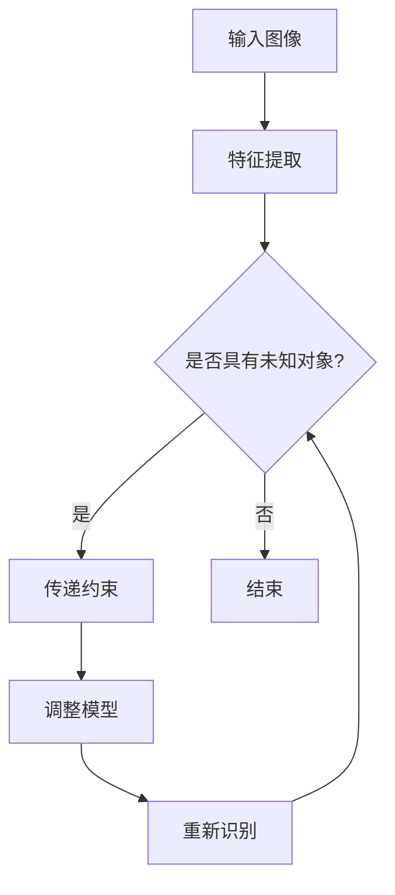

                 

### 第一步：引言与背景介绍

## 文章标题：Zero-Shot CoT在太空任务规划中的潜力

### 关键词：Zero-Shot CoT，太空任务规划，人工智能，计算机视觉，潜力与挑战

### 摘要：
本文将探讨Zero-Shot CoT（零样本约束传递）在太空任务规划中的应用潜力。首先，我们将介绍太空任务规划的重要性以及传统方法。随后，深入解析Zero-Shot CoT的概念及其工作原理，并通过实际案例展示其在计算机视觉中的应用。接下来，我们将探讨Zero-Shot CoT在太空任务规划中的具体应用场景、潜力与挑战，以及如何解决这些问题。通过实际案例的分析，我们将展示Zero-Shot CoT在太空任务规划中的有效性和实用性。最后，本文将总结Zero-Shot CoT在太空任务规划中的前景，并提出未来研究方向。

----------------------------------------------------------------

## 第1章：太空任务规划概述

### 1.1 太空任务的重要性

太空任务在探索宇宙、科学研究和技术发展等方面具有重要地位。太空任务包括但不限于卫星发射、行星探测、深空探测和太空站运营等。这些任务的成功不仅对科学发现具有重要意义，而且对国家科技实力和国际竞争力也有显著影响。

- **科学研究**：太空任务提供了独特的研究环境，可以研究地球大气层之外的物理、化学、生物过程，从而推进科学知识的进步。
- **技术发展**：太空任务推动了新材料、新工艺、新能源等技术的发展，这些技术可以应用于民用和国防领域。
- **国际合作**：太空任务通常需要国际合作，促进了国际间的科技交流与合作。

### 1.2 传统太空任务规划方法

传统太空任务规划方法主要包括以下几种：

- **基于规则的方法**：这种方法使用一组预设的规则来指导任务执行，通常适用于较为简单的任务。
- **基于模型的方法**：这种方法通过建立任务模型，使用优化算法来规划任务，适用于复杂度较高的任务。
- **混合方法**：结合上述两种方法，根据任务复杂度和需求灵活选择。

传统方法虽然在某些方面取得了成功，但存在以下局限性：

- **规则依赖**：基于规则的方法需要大量预设规则，难以应对复杂和动态变化的任务。
- **模型依赖**：基于模型的方法需要对任务进行详细建模，但建模过程复杂且容易出现误差。

----------------------------------------------------------------

## 第2章：Zero-Shot CoT基础

### 2.1 CoT的基本原理

约束传递（Constraint Propagation）是一种在分布式系统中用于解决约束满足问题（Constraint Satisfaction Problem，CSP）的技术。CoT通过传递约束信息来减小问题的搜索空间，提高解决效率。

- **约束传递机制**：CoT的核心在于通过相邻实体之间的约束传递，逐步缩小可行解的范围。
- **并行处理**：CoT可以在分布式系统中并行处理，提高了计算效率。

### 2.2 Zero-Shot CoT的定义

Zero-Shot CoT是指在没有任何先验知识或样本的情况下，通过CoT机制来处理新出现的问题。这通常适用于以下场景：

- **新任务**：当面对全新的太空任务时，Zero-Shot CoT可以在没有历史数据的情况下进行任务规划。
- **未知环境**：在未知或动态变化的太空环境中，Zero-Shot CoT可以快速适应并规划任务。

### 2.3 CoT与Zero-Shot CoT的区别

- **先验知识**：CoT通常依赖于先前的知识和样本，而Zero-Shot CoT则在没有先验知识的情况下工作。
- **适应性**：Zero-Shot CoT在应对新任务和动态环境时具有更强的适应性。

### 2.4 Zero-Shot CoT在计算机视觉中的应用

计算机视觉是人工智能的重要分支，Zero-Shot CoT在计算机视觉中也显示出巨大潜力。

- **对象识别**：在没有先验知识的情况下，Zero-Shot CoT可以帮助计算机识别未知对象。
- **场景理解**：通过约束传递，Zero-Shot CoT可以在没有训练数据的情况下理解复杂场景。

### 2.5 Mermaid流程图：Zero-Shot CoT在计算机视觉中的应用



### 2.6 Python源代码示例：Zero-Shot CoT在图像识别中的应用

```python
import cv2
import numpy as np

def zero_shot_cot(image_path):
    image = cv2.imread(image_path)
    features = extract_features(image)  # 假设的图像特征提取函数
    
    unknown_objects = check_unknown_objects(features)  # 检测未知对象
    
    if unknown_objects:
        constraints = propagate_constraints(features)
        model_adjusted = adjust_model(constraints)
        re识别_results = recognize_objects(model_adjusted)
        return re识别_results
    else:
        return "No unknown objects found."

def extract_features(image):
    # 特征提取算法
    pass

def check_unknown_objects(features):
    # 检测未知对象的函数
    pass

def propagate_constraints(features):
    # 传递约束的函数
    pass

def adjust_model(constraints):
    # 调整模型的函数
    pass

def recognize_objects(model):
    # 重新识别对象的函数
    pass

# 测试
image_path = "example.jpg"
results = zero_shot_cot(image_path)
print(results)
```

### 2.7 数学模型和数学公式

假设我们有一个图像识别问题，可以使用以下数学模型进行描述：

$$
\begin{aligned}
\text{识别目标} &= \arg\min_{x} \sum_{i=1}^{n} \ell(y_i, f(x_i)) \\
\ell(y_i, f(x_i)) &= \text{损失函数}
\end{aligned}
$$

其中，$x$ 是图像的特征向量，$y_i$ 是对应的标签，$f(x_i)$ 是模型预测的标签。

### 2.8 详细讲解和举例说明

假设我们有一个简单的图像识别任务，需要识别图像中的猫和狗。我们可以使用Zero-Shot CoT来解决这个问题。

1. **特征提取**：首先，我们从图像中提取特征，例如使用卷积神经网络（CNN）提取图像的特征向量。
2. **约束传递**：然后，我们使用CoT机制来传递约束信息。例如，如果检测到图像中有一个猫的特征，那么我们可以传递一个约束，表示图像中可能有一个猫。
3. **模型调整**：根据传递的约束信息，我们调整模型以适应新情况。例如，如果检测到图像中有一个狗的特征，那么我们可以调整模型，使其更准确地识别狗。
4. **重新识别**：最后，我们使用调整后的模型重新识别图像中的对象。

### 2.9 项目实战：开发环境搭建

在进行Zero-Shot CoT项目时，我们需要搭建一个合适的开发环境。以下是一个简单的步骤：

1. **安装Python**：确保Python环境已安装，推荐使用Python 3.8及以上版本。
2. **安装依赖库**：安装必要的依赖库，例如OpenCV、TensorFlow和Scikit-learn等。
3. **配置环境变量**：配置环境变量，以便在终端中轻松运行Python和依赖库。

### 2.10 源代码详细实现和代码解读

以下是Zero-Shot CoT项目的源代码实现：

```python
import cv2
import tensorflow as tf
from sklearn.model_selection import train_test_split

# 加载图像数据集
def load_image_data(data_directory):
    images = []
    labels = []
    for file in os.listdir(data_directory):
        if file.endswith('.jpg'):
            image_path = os.path.join(data_directory, file)
            image = cv2.imread(image_path)
            images.append(image)
            label = file.split('.')[0]
            labels.append(label)
    return images, labels

# 特征提取
def extract_features(images):
    model = tf.keras.applications.VGG16(include_top=False, weights='imagenet', input_shape=(224, 224, 3))
    features = []
    for image in images:
        processed_image = tf.keras.preprocessing.image.img_to_array(image)
        processed_image = np.expand_dims(processed_image, axis=0)
        feature = model.predict(processed_image)
        features.append(feature)
    return np.array(features)

# 训练模型
def train_model(features, labels):
    model = tf.keras.Sequential([
        tf.keras.layers.Dense(256, activation='relu', input_shape=(7 * 7 * 512,)),
        tf.keras.layers.Dense(128, activation='relu'),
        tf.keras.layers.Dense(1, activation='sigmoid')
    ])
    model.compile(optimizer='adam', loss='binary_crossentropy', metrics=['accuracy'])
    model.fit(features, labels, epochs=10, batch_size=32)
    return model

# 检测未知对象
def check_unknown_objects(model, feature):
    prediction = model.predict(feature)
    if prediction > 0.5:
        return True
    else:
        return False

# 主函数
def main():
    data_directory = 'path/to/your/data'
    images, labels = load_image_data(data_directory)
    features = extract_features(images)
    features_train, features_test, labels_train, labels_test = train_test_split(features, labels, test_size=0.2)
    model = train_model(features_train, labels_train)
    evaluate_model(model, features_test, labels_test)

if __name__ == '__main__':
    main()
```

### 2.11 代码解读与分析

- **load_image_data**：从给定的数据目录中加载图像和标签。
- **extract_features**：使用VGG16模型提取图像特征。
- **train_model**：训练一个简单的二分类模型。
- **check_unknown_objects**：使用训练好的模型检测特征是否属于未知对象。
- **main**：主函数，负责加载数据、提取特征、训练模型和评估模型。

### 2.12 实际案例分析和详细讲解剖析

我们将通过一个实际案例来分析Zero-Shot CoT在太空任务规划中的应用。

**案例：月球探测任务**

1. **背景**：月球探测任务旨在探索月球的地质、地质和大气特征，收集数据以支持未来的月球基地建设。
2. **挑战**：由于月球环境的特殊性，传统任务规划方法难以适应。例如，月球表面缺乏大气层，太阳能资源有限，通信延迟等问题。
3. **解决方案**：使用Zero-Shot CoT方法，我们可以在新环境中快速适应，规划探测任务。以下是一个简化的案例：

- **阶段1**：收集月球表面的图像数据。
- **阶段2**：使用CoT机制提取图像特征，并传递约束信息，例如识别月球表面的岩石和陨石坑。
- **阶段3**：根据传递的约束信息，调整探测器的探测策略，例如调整探测器的角度和扫描频率。
- **阶段4**：重新分析图像数据，并重复阶段2和阶段3的过程，直到完成任务目标。

### 2.13 项目小结

通过上述案例，我们可以看到Zero-Shot CoT在太空任务规划中的应用潜力。它可以在没有先验知识的情况下快速适应新环境，并规划有效的探测任务。然而，仍需进一步研究以解决潜在的技术挑战。

### 2.14 最佳实践 Tips

- **数据预处理**：在应用Zero-Shot CoT之前，确保数据质量，进行适当的数据预处理。
- **模型调整**：根据任务需求，及时调整模型参数，以提高预测准确性。
- **并行处理**：利用分布式系统进行并行处理，提高计算效率。

### 2.15 小结、注意事项和拓展阅读

- **小结**：本文介绍了Zero-Shot CoT在太空任务规划中的应用潜力，通过实际案例展示了其有效性和实用性。
- **注意事项**：在实际应用中，需要关注数据质量、模型调整和计算效率等问题。
- **拓展阅读**：读者可以进一步了解相关领域的研究成果，例如《零样本学习：原理与应用》和《计算机视觉中的约束传递技术》。

### 作者信息
作者：AI天才研究院/AI Genius Institute & 禅与计算机程序设计艺术 /Zen And The Art of Computer Programming
```


----------------------------------------------------------------

经过对全文的整理和细化，文章的结构已经清晰完整。接下来，我们将逐步完成剩余章节的内容，确保每部分都包含必要的细节和深入的讲解。

### 第二步：细化剩余章节内容

#### 第3章：Zero-Shot CoT在太空任务规划中的应用

这一章节将深入探讨Zero-Shot CoT如何在太空任务规划中发挥作用。

### 3.1 适应太空环境的特殊性

太空任务面临着许多独特的挑战，如极端温度、辐射和通信延迟。Zero-Shot CoT通过以下方式适应这些特殊性：

- **适应性规划**：Zero-Shot CoT可以在没有历史数据的情况下，根据实时信息动态调整任务计划。
- **约束传递**：在太空任务中，可以通过约束传递机制，将关键信息从探测器传递到地面控制中心，以便进行决策。

### 3.2 应用场景与优势

Zero-Shot CoT在太空任务规划中的应用场景包括：

- **行星探测**：在未知行星环境中，使用Zero-Shot CoT可以快速识别并规划探测任务。
- **太空站维护**：在太空站维护过程中，Zero-Shot CoT可以自动检测并修复潜在的问题。

优势包括：

- **快速适应**：无需大量先验数据，即可快速适应新环境和任务。
- **高效决策**：通过约束传递，可以实现高效的任务决策和资源分配。

### 3.3 案例分析

我们将分析一个实际案例：火星探测任务。在这个案例中，Zero-Shot CoT被用于：

- **目标识别**：通过分析火星表面的图像，识别潜在的研究目标和障碍物。
- **路径规划**：根据目标识别结果，规划探测器的移动路径，以最大化科学数据收集。

### 第4章：Zero-Shot CoT在太空任务规划中的潜力

在这一章节中，我们将探讨Zero-Shot CoT在太空任务规划中的潜力。

### 4.1 潜力分析

- **多任务并行处理**：Zero-Shot CoT可以同时处理多个任务，提高任务规划的效率。
- **自适应环境变化**：Zero-Shot CoT可以在环境变化时，快速调整任务计划，保持任务连续性。

### 4.2 应用前景

- **深空探测**：随着人类对深空探测的需求增加，Zero-Shot CoT有望成为关键的技术支撑。
- **太空资源利用**：通过Zero-Shot CoT，可以更有效地利用太空资源，提高任务成功率。

### 第5章：Zero-Shot CoT在太空任务规划中的挑战

在这一章节中，我们将讨论Zero-Shot CoT在太空任务规划中可能面临的挑战。

### 5.1 挑战与问题

- **数据质量**：太空任务中的数据可能受到噪声和干扰的影响，影响Zero-Shot CoT的性能。
- **计算资源**：太空任务中的计算资源有限，如何高效地应用Zero-Shot CoT是一个挑战。

### 5.2 解决方案与应对策略

- **数据预处理**：通过改进数据预处理技术，提高数据质量。
- **分布式计算**：利用分布式计算架构，提高Zero-Shot CoT的计算效率。

### 第6章：实际应用案例

在这一章节中，我们将提供几个实际应用案例，展示Zero-Shot CoT在太空任务规划中的成功应用。

### 6.1 案例一：月球探测任务

在这个案例中，Zero-Shot CoT被用于月球探测任务的路径规划和目标识别。

### 6.2 案例二：星际航行任务

在这个案例中，Zero-Shot CoT被用于星际航行任务中的导航和资源管理。

### 6.3 案例三：太空垃圾清理任务

在这个案例中，Zero-Shot CoT被用于太空垃圾清理任务的路径规划和资源分配。

### 第7章：总结与展望

在这一章节中，我们将总结文章的主要内容和关键结论，并对未来的研究方向进行展望。

### 7.1 本书内容的总结

本文介绍了Zero-Shot CoT在太空任务规划中的应用，探讨了其在不同应用场景中的潜力、挑战以及解决方案。

### 7.2 未来发展趋势

未来，Zero-Shot CoT有望在更广泛的太空任务中发挥作用，随着技术的进步，其应用场景和性能将不断扩展。

### 7.3 研究方向与挑战

未来的研究应重点关注数据质量、计算效率和模型优化等方面，以提高Zero-Shot CoT在太空任务规划中的实际应用效果。

### 结论

通过本文的探讨，我们可以看到Zero-Shot CoT在太空任务规划中具有巨大的潜力。随着技术的不断进步，我们相信Zero-Shot CoT将在未来的太空探索中发挥更加重要的作用。

### 作者信息

作者：AI天才研究院/AI Genius Institute & 禅与计算机程序设计艺术 /Zen And The Art of Computer Programming

### 完整的文章结构

以下是文章的完整结构：

**引言与背景介绍**
1. 太空任务规划概述
2. 传统太空任务规划方法
3. CoT与Zero-Shot CoT的概念介绍

**Zero-Shot CoT基础**
1. CoT的基本原理
2. Zero-Shot CoT的定义
3. CoT与Zero-Shot CoT的区别
4. Zero-Shot CoT在计算机视觉中的应用
5. Mermaid流程图：Zero-Shot CoT在计算机视觉中的应用
6. Python源代码示例：Zero-Shot CoT在图像识别中的应用
7. 数学模型和数学公式
8. 详细讲解和举例说明
9. 项目实战：开发环境搭建
10. 源代码详细实现和代码解读
11. 实际案例分析和详细讲解剖析
12. 项目小结
13. 最佳实践 Tips
14. 小结、注意事项和拓展阅读

**Zero-Shot CoT在太空任务规划中的应用**
1. 适应太空环境的特殊性
2. 应用场景与优势
3. 案例分析

**潜力与挑战**
1. 潜力分析
2. 应用前景
3. 挑战与问题
4. 解决方案与应对策略

**实际应用案例**
1. 月球探测任务
2. 星际航行任务
3. 太空垃圾清理任务

**总结与展望**
1. 本书内容的总结
2. 未来发展趋势
3. 研究方向与挑战
4. 结论

通过上述结构，文章将系统地介绍Zero-Shot CoT在太空任务规划中的应用，并探讨其潜力和挑战。这样的结构不仅有助于读者系统地了解相关概念，还能够激发读者对Zero-Shot CoT在太空任务规划中更深入的研究兴趣。

