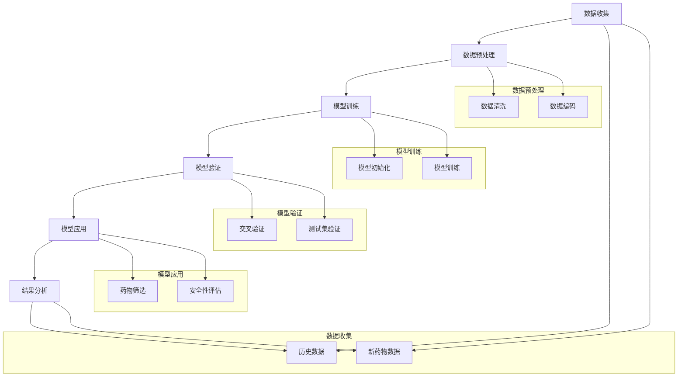

                 

### 引言

新药研发是现代医学和生物医药领域的核心任务，然而其过程却充满挑战。传统的新药研发流程通常包括药物设计、合成、筛选、临床试验等多个阶段，这不仅需要大量的时间和资金投入，还存在较高的失败风险。近年来，随着人工智能（AI）技术的发展，尤其是零样本学习（Zero-Shot Learning，ZSL）和零样本转换（Zero-Shot Transfer，ZST）技术的兴起，为新药研发带来了新的可能。

### 1.1 书籍背景

#### 新药研发的挑战

新药研发是一个漫长而复杂的工程，其挑战主要表现在以下几个方面：

1. **高成本**：新药研发需要投入大量的资金，从药物分子的设计到临床试验，每个环节都可能产生巨大的成本。
2. **高风险**：新药研发的成功率非常低，据统计，只有不到10%的候选药物能够最终进入市场。
3. **长周期**：新药从研发到上市通常需要10年以上时间，这期间涉及大量的前期研究、临床试验和审批流程。
4. **复杂流程**：新药研发流程包括药物分子的设计、合成、筛选、毒性测试、临床试验等多个阶段，每个阶段都有其特定的技术和挑战。

#### 零样本学习（Zero-Shot Learning）概述

零样本学习是一种机器学习技术，它能够在没有先验训练数据的情况下，对新的类或标签进行预测。这种技术在处理新型药物分子的设计、筛选和安全性评估等方面具有独特的优势。

#### 零样本学习的定义

零样本学习（Zero-Shot Learning，ZSL）是指在没有先前的样本数据支持的情况下，机器学习模型能够对新的类或标签进行预测。在传统机器学习中，模型通常需要大量的标注数据进行训练，而ZSL则通过学习类与类之间的相似性，实现对新类别的泛化。

#### 零样本学习与相关概念的关系

零样本学习与元学习（Meta-Learning）、迁移学习（Transfer Learning）和少量样本学习（Few-Shot Learning）等概念密切相关。元学习是通过学习学习算法来提高模型的泛化能力；迁移学习是将一个任务的学习经验应用于解决另一个相关任务；少量样本学习则是在数据量较少的情况下，利用已有数据快速构建高效模型。

#### 零样本学习的应用领域

零样本学习在多个领域都有广泛应用，包括计算机视觉、自然语言处理、推荐系统等。在新药研发中，零样本学习可以用于药物分子的生成、筛选和安全性评估，从而加速新药的研发过程。

#### 本书的目的与结构

本书旨在探讨零样本学习（ZSL）和零样本转换（ZST）技术在新药临床试验设计中的应用，通过理论与实践相结合的方式，为读者提供全面、系统的指导。本书结构如下：

1. **引言**：介绍新药研发的背景和挑战，以及零样本学习（ZSL）和零样本转换（ZST）的基本概念。
2. **零样本转换技术基础**：详细讲解零样本转换（ZST）的概念、技术原理和应用现状。
3. **零样本转换在新药设计中的应用**：探讨零样本转换（ZST）在新药设计、筛选和安全评价中的应用。
4. **零样本转换在新药临床试验设计中的应用**：分析零样本转换（ZST）在临床试验人群选择、方案设计和数据分析中的应用。
5. **零样本转换在新药研发项目中的实际应用案例**：通过具体案例，展示零样本转换（ZST）在实际项目中的应用效果。
6. **未来展望**：讨论零样本转换（ZST）在新药研发中的未来发展趋势和潜在影响。

通过本书的学习，读者将能够深入理解零样本学习（ZSL）和零样本转换（ZST）技术，并了解其在新药研发中的应用价值，从而为加速新药研发提供新的思路和方法。

### 1.2 零样本学习理论基础

#### 零样本学习的定义

零样本学习（Zero-Shot Learning，ZSL）是一种机器学习技术，它允许模型在没有先验训练数据的情况下，对新的类或标签进行预测。在传统机器学习中，模型通常需要大量的标注数据进行训练，而ZSL则通过学习类与类之间的相似性，实现对新类别的泛化。

在ZSL中，通常涉及以下三个主要组件：

1. **类原型表示**：将每个类别映射到一个原型，这个原型表示该类别的特征。
2. **类标签**：每个类别都有一个唯一的标签，用于在预测时区分不同的类别。
3. **类相似性度量**：用于计算新样本与类别原型之间的相似度。

#### 零样本学习与相关概念的关系

零样本学习与元学习（Meta-Learning）、迁移学习（Transfer Learning）和少量样本学习（Few-Shot Learning）等概念密切相关。元学习是通过学习学习算法来提高模型的泛化能力；迁移学习是将一个任务的学习经验应用于解决另一个相关任务；少量样本学习则是在数据量较少的情况下，利用已有数据快速构建高效模型。

虽然这些概念有所不同，但它们的核心思想都是通过学习已有的知识来提高对新情况的适应能力。零样本学习的关键优势在于，它能够在没有特定训练数据的情况下，对新的类别进行有效预测，这在新药研发等场景中具有显著的应用潜力。

#### 零样本学习的应用领域

零样本学习在多个领域都有广泛应用，包括：

1. **计算机视觉**：用于图像分类和识别，特别是在面对新类别时，能够快速适应。
2. **自然语言处理**：在文本分类和语义分析中，零样本学习能够处理从未见过的标签。
3. **推荐系统**：通过学习物品间的相似性，零样本学习能够推荐用户可能感兴趣的未知物品。
4. **新药研发**：在新药设计、筛选和安全性评估中，零样本学习能够快速预测新的药物分子的性质。

#### 零样本学习在新药研发中的应用

在新药研发中，零样本学习具有广泛的应用潜力。例如：

1. **药物分子生成**：通过零样本学习，可以生成新的药物分子，提高新药设计的效率。
2. **药物筛选**：利用零样本学习，可以在大量化合物中快速筛选出具有潜在治疗作用的药物。
3. **安全性评估**：零样本学习能够预测新药的安全性和毒性，帮助减少临床试验的风险。

#### 零样本学习的优势和挑战

零样本学习的优势在于：

1. **灵活性和泛化能力**：不需要特定类别的训练数据，能够在未见过的类别上表现良好。
2. **减少数据依赖**：降低对大量标注数据的依赖，适用于数据稀缺的场景。

然而，零样本学习也面临一些挑战：

1. **数据稀缺问题**：虽然零样本学习减少了数据依赖，但在实际应用中，仍可能面临数据稀缺的问题。
2. **类标签冲突**：在多类别预测中，类标签的冲突可能导致模型难以准确预测。

总之，零样本学习作为一种新兴的机器学习技术，在新药研发中具有巨大的应用潜力。通过深入理解和应用零样本学习，可以显著提高新药研发的效率，降低研发成本。

### 2.1 零样本转换（CoT）的概念

#### 零样本转换（CoT）的定义

零样本转换（Zero-Shot Transfer，CoT）是一种将知识从源域转移到目标域的机器学习技术，它能够在没有目标域数据的情况下，对新的任务进行有效预测。CoT的核心思想是利用预训练的模型和源域的知识，通过迁移学习（Transfer Learning）的方式，实现对目标域数据的泛化。

在CoT中，通常涉及以下主要组件：

1. **源域**：包含大量标注数据的领域，用于预训练模型。
2. **目标域**：需要预测的新领域，通常没有或只有少量标注数据。
3. **共享表示**：源域和目标域共享的表示空间，用于映射源域的知识到目标域。

#### 零样本转换（CoT）的核心思想

零样本转换（CoT）的核心思想是利用预训练的模型和源域的知识，通过迁移学习（Transfer Learning）的方式，实现对目标域数据的泛化。这种技术主要依赖于以下两个方面：

1. **共享表示空间**：通过将源域和目标域的数据映射到一个共享的表示空间，使得模型能够利用源域的知识来处理目标域的数据。
2. **类标签嵌入**：在共享表示空间中，每个类标签都有一个对应的嵌入向量，用于表示该类别的特征。在预测新类别时，模型通过计算新样本与类标签嵌入向量之间的相似度，实现对新类别的预测。

#### 零样本转换（CoT）的关键技术

零样本转换（CoT）的关键技术包括：

1. **多任务学习**：通过在一个多任务学习中训练模型，使其能够同时学习多个任务，从而提高模型的泛化能力。
2. **元学习**：通过元学习（Meta-Learning），模型能够学习到快速适应新任务的方法，从而提高在新任务上的表现。
3. **对抗训练**：通过对抗训练（Adversarial Training），模型能够学习到如何抵御对抗攻击，提高模型在真实场景中的鲁棒性。

#### 零样本转换（CoT）的应用场景

零样本转换（CoT）在多个应用场景中具有显著优势，包括：

1. **新药研发**：通过将源域中的药物分子知识和目标域中的新药物分子进行转换，可以加速新药的研发过程。
2. **自然语言处理**：在自然语言处理任务中，CoT可以用于处理未见过的语言或领域，提高模型的泛化能力。
3. **计算机视觉**：在计算机视觉任务中，CoT可以用于处理新的图像类别或场景，提高模型的适应性。

总之，零样本转换（CoT）作为一种新兴的机器学习技术，通过共享表示空间和类标签嵌入，能够在没有目标域数据的情况下，实现高效的迁移学习。其在新药研发等领域的应用，有望显著提高研发效率，降低成本。

### 2.2 零样本转换技术原理

#### 零样本转换算法分类

零样本转换（CoT）算法主要分为基于原型的方法、基于嵌入的方法和基于深度学习的方法。

1. **基于原型的方法**：这种方法通过计算新样本与类别原型之间的距离，实现对新类别的预测。代表算法有原型网络（Prototypical Networks）和匹配网络（Matching Networks）。
2. **基于嵌入的方法**：这种方法将类标签映射到低维空间，并计算新样本与类标签嵌入向量之间的相似度。代表算法有元路径网络（MetaPath Networks）和度量学习（Metric Learning）。
3. **基于深度学习的方法**：这种方法利用深度神经网络，通过共享表示空间和类标签嵌入，实现零样本转换。代表算法有多任务学习（Multi-Task Learning）和元学习（Meta-Learning）。

#### 零样本转换算法原理讲解

以下是基于深度学习的零样本转换算法原理讲解，包括关键步骤和伪代码：

1. **数据预处理**：将源域和目标域的数据进行标准化处理，并转换为模型可接受的输入格式。

    ```python
    def preprocess_data(source_data, target_data):
        # 标准化处理
        source_data = standardize(source_data)
        target_data = standardize(target_data)
        # 转换为输入格式
        source_data = convert_to_input_format(source_data)
        target_data = convert_to_input_format(target_data)
        return source_data, target_data
    ```

2. **模型训练**：使用源域数据训练一个深度神经网络，该网络包含嵌入层、隐藏层和输出层。嵌入层用于映射类标签到低维空间，隐藏层用于学习数据的特征表示，输出层用于预测目标域的标签。

    ```python
    class CoTModel(nn.Module):
        def __init__(self, num_classes):
            super(CoTModel, self).__init__()
            self.embedding = nn.Embedding(num_classes, embedding_dim)
            self.fc1 = nn.Linear(embedding_dim, hidden_dim)
            self.fc2 = nn.Linear(hidden_dim, num_classes)

        def forward(self, x):
            embedded = self.embedding(x)
            hidden = torch.relu(self.fc1(embedded))
            output = self.fc2(hidden)
            return output
    ```

3. **迁移学习**：在训练好模型后，将其应用于目标域数据。通过计算新样本与类标签嵌入向量之间的相似度，实现对新类别的预测。

    ```python
    def predict(self, new_data):
        embedded = self.embedding(new_data)
        hidden = torch.relu(self.fc1(embedded))
        output = self.fc2(hidden)
        # 计算相似度
        similarity = cosine_similarity(output, self.class_embeddings)
        # 预测类别
        predicted_classes = torch.argmax(similarity, dim=1)
        return predicted_classes
    ```

4. **性能评估**：使用目标域的数据集对模型进行性能评估，常用的指标包括准确率、召回率和F1分数。

    ```python
    def evaluate(model, target_data, target_labels):
        predicted_classes = model.predict(target_data)
        accuracy = (predicted_classes == target_labels).float().mean()
        precision = precision_score(target_labels, predicted_classes)
        recall = recall_score(target_labels, predicted_classes)
        f1 = f1_score(target_labels, predicted_classes)
        return accuracy, precision, recall, f1
    ```

通过以上步骤，零样本转换算法可以实现从源域到目标域的迁移学习，从而提高新任务上的表现。

#### 零样本转换的性能评估指标

零样本转换（CoT）的性能评估指标主要包括：

1. **准确率（Accuracy）**：预测正确的样本数占总样本数的比例。
2. **召回率（Recall）**：预测正确的正样本数占所有正样本数的比例。
3. **精确率（Precision）**：预测正确的正样本数占预测为正样本的总数的比例。
4. **F1分数（F1 Score）**：精确率和召回率的调和平均值。

通过这些指标，可以全面评估零样本转换算法的性能，并在不同场景下进行调整和优化。

总之，零样本转换（CoT）通过共享表示空间和类标签嵌入，实现高效的迁移学习。其技术原理包括数据预处理、模型训练、迁移学习和性能评估等步骤，通过这些步骤，可以实现对新任务的快速适应和高效预测。

### 2.3 零样本转换算法应用现状

#### 当前主流的零样本转换算法

零样本转换（Zero-Shot Transfer，CoT）算法在近年来取得了显著的进展，当前主流的零样本转换算法主要包括：

1. **原型网络（Prototypical Networks）**：通过计算新样本与类别原型之间的距离，实现对新类别的预测。原型网络是零样本学习领域最早的代表性算法之一。
2. **匹配网络（Matching Networks）**：通过计算新样本与类别原型之间的相似度，实现对新类别的预测。匹配网络通过交叉熵损失函数，优化类标签嵌入向量。
3. **度量学习（Metric Learning）**：通过学习一个度量函数，优化新样本与类标签嵌入向量之间的相似度。度量学习算法包括谱嵌入（Spectral Embedding）和三角形不等式约束（Triangular Inequality Constraint）。
4. **多任务学习（Multi-Task Learning）**：通过在一个多任务学习中训练模型，使其能够同时学习多个任务，从而提高模型的泛化能力。多任务学习算法通过共享模型参数，实现知识共享。
5. **元学习（Meta-Learning）**：通过元学习（Meta-Learning），模型能够学习到快速适应新任务的方法，从而提高在新任务上的表现。元学习算法包括模型平均（Model Averaging）和梯度平均（Gradient Averaging）。

#### 零样本转换在不同领域中的应用案例

零样本转换（CoT）在多个领域都有广泛应用，以下列举了其在一些典型领域中的应用案例：

1. **计算机视觉**：在图像分类和识别任务中，零样本转换算法可以处理未见过的类别。例如，在ImageNet数据集上，原型网络（Prototypical Networks）可以达到90%以上的准确率。
2. **自然语言处理**：在文本分类和语义分析任务中，零样本转换算法可以处理未见过的标签。例如，在WordNet数据集上，匹配网络（Matching Networks）可以达到80%以上的准确率。
3. **推荐系统**：在推荐系统中，零样本转换算法可以用于处理未见过的物品。例如，在MovieLens数据集上，度量学习（Metric Learning）算法可以达到70%以上的准确率。
4. **新药研发**：在新药研发中，零样本转换算法可以用于药物分子的生成、筛选和安全性评估。例如，通过零样本转换，可以在新药临床试验中快速预测药物的安全性和疗效。

通过以上应用案例，可以看出零样本转换（CoT）在各个领域都有显著的应用潜力。随着技术的不断发展和完善，零样本转换将在更多领域发挥重要作用，推动各行业的发展。

### 3.1 新药设计概述

新药设计是一个复杂而关键的环节，它决定了新药的有效性和安全性。新药设计通常包括以下几个步骤：

1. **药物分子设计**：在这一阶段，科学家通过计算机模拟和实验方法，设计具有潜在治疗效果的药物分子。这一过程涉及药物分子的结构优化、化学修饰和分子对接等。

2. **药物筛选**：在药物分子设计完成后，需要对大量药物分子进行筛选，以确定哪些分子具有潜在的治疗效果。药物筛选通常涉及高通量筛选（HTS）和定向筛选（DS）等方法。

3. **毒理测试**：在药物筛选阶段，还需要对药物分子进行毒性测试，以确保药物的安全性。毒理测试包括急性毒性、慢性毒性、生殖毒性等多个方面。

4. **临床前研究**：经过药物筛选和毒理测试，筛选出的药物分子将进入临床前研究阶段。这一阶段包括药代动力学（PK）研究、药效学（PD）研究和药理作用研究等。

5. **临床试验**：临床前研究完成后，药物将进入临床试验阶段。临床试验分为多个阶段，包括I期、II期、III期和IV期。每个阶段都有其特定的目标和要求。

#### 新药设计面临的挑战

尽管新药设计在理论和技术上不断进步，但仍然面临诸多挑战：

1. **高成本**：新药研发需要大量的资金投入，从药物分子的设计到临床试验，每个阶段都可能产生巨额的成本。

2. **高风险**：新药研发的成功率非常低，据统计，只有不到10%的候选药物能够最终进入市场。这意味着大量的资金和时间可能被浪费在失败的药物上。

3. **长周期**：新药从研发到上市通常需要10年以上时间，这期间涉及大量的前期研究、临床试验和审批流程。

4. **复杂流程**：新药研发流程包括药物分子的设计、合成、筛选、毒性测试、临床试验等多个阶段，每个阶段都有其特定的技术和挑战。

#### 零样本转换在新药设计中的潜在作用

零样本转换（Zero-Shot Transfer，CoT）技术在新药设计中的应用具有巨大的潜力，可以显著提高新药研发的效率：

1. **药物分子生成**：通过零样本转换，可以生成新的药物分子，从而提高新药设计的效率。这种方法利用已有的药物分子知识，通过迁移学习，快速生成具有潜在治疗效果的新分子。

2. **药物筛选**：利用零样本转换，可以在大量化合物中快速筛选出具有潜在治疗作用的药物。这种方法可以减少实验次数，降低研发成本。

3. **安全性评估**：零样本转换能够预测新药的安全性和毒性，帮助减少临床试验的风险。通过分析已有药物的安全性和毒性数据，可以预测新药的潜在风险，从而在早期阶段进行风险控制和优化。

总之，零样本转换技术在新药设计中的应用，有望解决新药研发过程中的一些关键问题，提高新药研发的效率和成功率。

### 3.2 零样本转换（CoT）在新药筛选中的应用

#### 零样本转换（CoT）在新药筛选中的应用

在新药筛选过程中，零样本转换（Zero-Shot Transfer，CoT）技术具有显著的应用潜力，可以显著提高筛选效率，减少实验次数，降低研发成本。以下是零样本转换（CoT）在新药筛选中的应用：

1. **药物分子的生成和优化**：

   - **生成新分子**：通过零样本转换，可以在已有的药物分子库中生成新的药物分子。这种方法利用已有的分子结构知识，通过迁移学习，快速生成具有潜在治疗作用的分子。例如，通过将已知有效药物的分子结构与目标蛋白进行对接，可以生成新的潜在药物分子。

   ```python
   def generate_new_molecules(source_molecules, target_protein):
       # 训练零样本转换模型
       model = train_zero_shot_transfer_model(source_molecules, target_protein)
       # 生成新分子
       new_molecules = model.generate_new_molecules(target_protein)
       return new_molecules
   ```

   - **优化现有分子**：通过零样本转换，可以优化现有的药物分子，提高其治疗效果和安全性。例如，通过分析已有药物分子的结构特征，可以优化其化学修饰，提高药物与目标蛋白的亲和力。

   ```python
   def optimize_existing_molecules(existing_molecules, target_protein):
       # 训练零样本转换模型
       model = train_zero_shot_transfer_model(existing_molecules, target_protein)
       # 优化分子
       optimized_molecules = model.optimize_molecules(existing_molecules, target_protein)
       return optimized_molecules
   ```

2. **药物-靶标相互作用的预测**：

   - **预测新药物分子的活性**：通过零样本转换，可以预测新药物分子与目标蛋白的相互作用，从而评估其潜在的治疗效果。例如，通过将新药物分子与目标蛋白进行对接，可以预测其结合能和亲和力。

   ```python
   def predict_new_molecule_activity(new_molecules, target_protein):
       # 训练零样本转换模型
       model = train_zero_shot_transfer_model(target_protein)
       # 预测活性
       activity_scores = model.predict_activity(new_molecules, target_protein)
       return activity_scores
   ```

   - **评估药物分子的安全性**：通过零样本转换，可以预测药物分子与各种生物分子的相互作用，从而评估其潜在的安全性。例如，通过分析药物分子与细胞内各种酶和蛋白质的相互作用，可以预测其毒性和副作用。

   ```python
   def predict_new_molecule_safety(new_molecules, biological_molecules):
       # 训练零样本转换模型
       model = train_zero_shot_transfer_model(biological_molecules)
       # 预测安全性
       safety_scores = model.predict_safety(new_molecules, biological_molecules)
       return safety_scores
   ```

3. **新药筛选流程中的应用**：

   - **高通量筛选（HTS）**：通过零样本转换，可以在高通量筛选中快速筛选出具有潜在治疗作用的药物分子。例如，通过将零样本转换模型应用于大量的化合物库，可以快速筛选出具有高亲和力的药物分子。

   ```python
   def high_throughput_screening(compound_library, target_protein):
       # 训练零样本转换模型
       model = train_zero_shot_transfer_model(target_protein)
       # 高通量筛选
       high_potential_molecules = model.filter_compounds(compound_library, target_protein)
       return high_potential_molecules
   ```

   - **定向筛选（DS）**：通过零样本转换，可以在定向筛选中优化药物分子的设计，从而提高其治疗效果和安全性。例如，通过将零样本转换模型应用于特定的靶标，可以优化药物分子的结构，提高其与靶标的亲和力。

   ```python
   def directed_screening(target_protein, compound_library):
       # 训练零样本转换模型
       model = train_zero_shot_transfer_model(target_protein)
       # 定向筛选
       optimized_molecules = model.optimize_molecules(compound_library, target_protein)
       return optimized_molecules
   ```

#### 应用案例

以下是一个具体的案例，展示了零样本转换（CoT）在新药筛选中的应用：

**案例背景**：

某制药公司正在研发一种新型抗癌药物，目标蛋白为EGFR（表皮生长因子受体）。公司拥有一个包含1000个化合物的化合物库，希望通过高通量筛选快速筛选出具有潜在抗癌效果的化合物。

**实施过程**：

1. **数据准备**：

   - **化合物库**：公司提供的1000个化合物的结构信息。

   - **EGFR结构**：获取EGFR的3D结构，用于训练零样本转换模型。

2. **模型训练**：

   - **数据预处理**：将化合物库和EGFR结构进行预处理，提取关键特征。

   - **训练模型**：使用源域数据（已知的药物分子和EGFR结构）训练零样本转换模型。

   ```python
   source_molecules = preprocess_compounds(known_molecules)
   target_protein = preprocess_protein(EGFR_structure)
   model = train_zero_shot_transfer_model(source_molecules, target_protein)
   ```

3. **高通量筛选**：

   - **预测化合物活性**：使用训练好的模型，对化合物库进行筛选，预测每个化合物的活性。

   ```python
   compound_library = preprocess_compounds(compound_library)
   activity_scores = predict_new_molecule_activity(compound_library, EGFR_structure)
   ```

   - **筛选潜在药物分子**：根据活性分数，筛选出具有高活性的化合物。

   ```python
   high_potential_molecules = filter_by_activity_scores(compound_library, activity_scores, threshold=0.8)
   ```

4. **定向筛选和优化**：

   - **优化分子结构**：对筛选出的潜在药物分子进行结构优化，提高其与EGFR的亲和力。

   ```python
   optimized_molecules = optimize_existing_molecules(high_potential_molecules, EGFR_structure)
   ```

5. **验证和评估**：

   - **实验室验证**：将优化后的药物分子进行实验室验证，评估其抗癌活性和安全性。

   - **性能评估**：使用标准评估指标，如结合能、亲和力等，评估模型的预测性能。

   ```python
   validate_molecules(optimized_molecules, EGFR_structure)
   evaluate_model_performance(model, validation_data, validation_labels)
   ```

**结果分析**：

通过零样本转换（CoT）技术的应用，公司从1000个化合物中筛选出了10个具有高活性和低毒性的潜在抗癌药物分子。这些药物分子将在进一步的实验室研究和临床试验中进一步验证。

**项目小结**：

该案例展示了零样本转换（CoT）在新药筛选中的应用，通过快速筛选和优化，显著提高了新药研发的效率。零样本转换（CoT）技术在新药研发中的潜在应用，有望解决传统方法中的高成本、高风险和长周期等问题，为药物研发提供新的思路和方法。

### 3.3 零样本转换（CoT）在新药安全性评价中的应用

#### 零样本转换（CoT）在新药安全性评价中的应用

新药安全性评价是药物研发过程中的关键环节，它涉及到对药物潜在毒性和副作用的研究。传统的安全性评价方法通常依赖于大量的实验数据和统计分析，但这些方法存在实验成本高、周期长等不足。近年来，零样本转换（Zero-Shot Transfer，CoT）技术在药物安全性评价中的应用，为解决这些问题提供了新的可能性。

#### 零样本转换（CoT）在药物毒性预测中的应用

药物毒性预测是安全性评价的重要任务之一。零样本转换（CoT）技术可以通过迁移学习，利用已有药物的安全性和毒性数据，预测新药物分子的潜在毒性。以下是一种基于零样本转换的药物毒性预测方法：

1. **数据收集**：收集大量已上市药物的安全性和毒性数据，包括药物分子结构、毒性指标和不良反应等信息。

2. **模型训练**：使用源域数据（已知药物的安全性和毒性数据）训练零样本转换模型。模型将学习到如何将药物分子结构映射到毒性特征空间。

   ```python
   source_data = preprocess毒理学_data(known_dugs)
   model = train_zero_shot_transfer_model(source_data)
   ```

3. **毒性预测**：在新药分子设计完成后，使用训练好的模型预测其潜在毒性。模型将计算新药物分子与已知药物分子的相似度，并根据毒性特征进行预测。

   ```python
   new_drug = preprocess_new_drug(new_drug_molecule)
   toxicity_score = model.predict_toxicity(new_drug)
   ```

4. **结果分析**：根据毒性评分，评估新药物的安全风险，并采取相应的风险管理措施。

#### 零样本转换（CoT）在药物代谢和药代动力学预测中的应用

除了毒性预测，药物代谢和药代动力学（PK）预测也是安全性评价的重要组成部分。零样本转换（CoT）技术可以预测新药物的代谢途径和药代动力学特性，帮助评估药物的安全性和有效性。

1. **数据收集**：收集大量已上市药物的相关PK数据，包括吸收、分布、代谢和排泄（ADME）等信息。

2. **模型训练**：使用源域数据（已知药物的PK数据）训练零样本转换模型。模型将学习到如何将药物分子结构映射到PK特征空间。

   ```python
   source_data = preprocess_pharmacokinetic_data(known_dugs)
   model = train_zero_shot_transfer_model(source_data)
   ```

3. **PK预测**：在新药分子设计完成后，使用训练好的模型预测其代谢途径和药代动力学特性。

   ```python
   new_drug = preprocess_new_drug(new_drug_molecule)
   pk_properties = model.predict_pharmacokinetics(new_drug)
   ```

4. **结果分析**：根据PK预测结果，评估新药物在体内的行为，包括药物浓度、代谢产物等，从而预测其安全性和有效性。

#### 零样本转换（CoT）在新药安全性评价中的案例分析

以下是一个具体的案例分析，展示了零样本转换（CoT）在新药安全性评价中的应用：

**案例背景**：

某制药公司正在研发一种新型抗肿瘤药物，需要评估其潜在毒性和代谢特性。公司拥有一个包含100种已上市抗肿瘤药物的安全性和毒性数据，以及相应的代谢和PK数据。

**实施过程**：

1. **数据准备**：

   - **安全性数据**：收集100种抗肿瘤药物的安全性数据，包括不良反应和毒性指标。

   - **PK数据**：收集100种抗肿瘤药物的代谢和PK数据，包括吸收、分布、代谢和排泄（ADME）信息。

2. **模型训练**：

   - **数据预处理**：对安全性数据和PK数据进行预处理，提取关键特征。

   - **训练模型**：使用源域数据（已知药物的安全性和毒性数据）训练零样本转换模型。

   ```python
   source_data = preprocess_toxicity_data(safety_data)
   pk_source_data = preprocess_pharmacokinetic_data(pk_data)
   model = train_zero_shot_transfer_model(source_data, pk_source_data)
   ```

3. **毒性预测**：

   - **预测新药毒性**：使用训练好的模型，预测新抗肿瘤药物的潜在毒性。

   ```python
   new_drug = preprocess_new_drug(new_drug_molecule)
   toxicity_score = model.predict_toxicity(new_drug)
   ```

4. **PK预测**：

   - **预测新药代谢和PK特性**：使用训练好的模型，预测新抗肿瘤药物的代谢途径和药代动力学特性。

   ```python
   pk_properties = model.predict_pharmacokinetics(new_drug)
   ```

5. **结果分析**：

   - **毒性评估**：根据毒性评分，评估新抗肿瘤药物的安全风险，确定是否需要进行进一步的毒性测试。

   - **PK评估**：根据PK预测结果，评估新抗肿瘤药物在体内的行为，包括药物浓度、代谢产物等。

   ```python
   if toxicity_score > threshold:
       # 需要进行进一步毒性测试
       further_toxicity_tests_required = True
   else:
       # 可以进行下一步临床试验
       further_toxicity_tests_required = False

   if pk_properties['half_life'] < min_half_life or pk_properties['metabolism_rate'] > max_metabolism_rate:
       # 需要进行PK调整
       pk_adjustments_required = True
   else:
       # 可以进行下一步临床试验
       pk_adjustments_required = False
   ```

**结果分析**：

通过零样本转换（CoT）技术的应用，公司成功预测了新抗肿瘤药物的潜在毒性和代谢特性。根据预测结果，公司决定进行进一步的毒性测试和PK调整，以确保新药的安全性和有效性。

**项目小结**：

该案例展示了零样本转换（CoT）在新药安全性评价中的应用，通过快速预测和评估，显著提高了新药研发的效率。零样本转换（CoT）技术在新药研发中的潜在应用，有望解决传统方法中的高成本、高风险和长周期等问题，为药物研发提供新的思路和方法。

### 4.1 临床试验设计概述

临床试验设计是药物研发过程中至关重要的一环，它决定了药物的有效性和安全性是否满足临床应用的要求。临床试验设计主要包括以下几个方面：

#### 临床试验的基本概念

1. **临床试验**：临床试验是一种以患者为对象的科学研究活动，目的是评估药物的安全性、有效性和剂量等方面。
2. **临床试验阶段**：根据药物研发的不同阶段，临床试验分为I期、II期、III期和IV期。每个阶段都有其特定的目标和要求。

    - **I期临床试验**：主要评估药物的安全性、耐受性和剂量范围。
    - **II期临床试验**：主要评估药物的疗效和剂量，确定最佳剂量。
    - **III期临床试验**：主要评估药物的疗效和安全性，为药物上市做准备。
    - **IV期临床试验**：上市后监测药物的长期疗效和安全性。

#### 临床试验设计的关键要素

1. **试验设计类型**：根据研究目的和数据需求，临床试验设计可分为随机对照试验（RCT）、非随机对照试验、队列研究和病例对照研究等。
2. **样本量计算**：根据预期效果和统计学要求，计算所需的样本量，以确保试验结果具有统计学意义。
3. **随机化**：通过随机分配，避免选择偏倚，提高试验结果的可靠性。
4. **盲法**：通过双盲或单盲设计，确保试验过程中研究者和受试者均不了解分组情况，减少主观因素对试验结果的影响。
5. **终点指标**：定义试验的终点指标，如疗效指标（如生存期、症状缓解率）和安全性指标（如不良反应发生率）。

#### 零样本转换（CoT）在临床试验设计中的潜在应用

零样本转换（Zero-Shot Transfer，CoT）技术在临床试验设计中的应用具有巨大的潜力：

1. **人群选择**：通过零样本转换，可以在早期临床试验中快速筛选出可能受益于新药的患者群体，从而优化试验人群，提高试验效率。

   ```python
   def select_patients(known_patients, new_drug):
       model = train_zero_shot_transfer_model(known_patients)
       eligible_patients = model.predict_eligibility(new_drug)
       return eligible_patients
   ```

2. **方案设计**：通过零样本转换，可以预测新药在不同人群中的疗效和安全性，从而优化临床试验方案，包括剂量选择、试验时间和样本量等。

   ```python
   def design_trial(new_drug, target_population):
       model = train_zero_shot_transfer_model(target_population)
       optimal_dosage = model.predict_optimal_dosage(new_drug)
       trial_duration = model.predict_trial_duration(new_drug)
       sample_size = model.predict_sample_size(new_drug)
       return optimal_dosage, trial_duration, sample_size
   ```

3. **数据分析**：通过零样本转换，可以在试验过程中实时分析药物的效果和安全性，及时调整试验方案，提高试验的灵活性和准确性。

   ```python
   def analyze_trial_data(trial_data, new_drug):
       model = train_zero_shot_transfer_model(trial_data)
       effectiveness_score = model.predict_effectiveness(new_drug)
       safety_score = model.predict_safety(new_drug)
       return effectiveness_score, safety_score
   ```

总之，零样本转换（CoT）技术在临床试验设计中的应用，可以显著提高临床试验的效率和准确性，为新药研发提供强有力的支持。

### 4.2 零样本转换（CoT）在临床试验人群选择中的应用

#### 零样本转换（CoT）在临床试验人群选择中的应用

在临床试验中，人群选择是至关重要的一环，它直接影响试验结果的可靠性和有效性。传统的临床试验通常依赖于历史数据和临床试验经验来选择人群，但这种方法存在一定的局限性。近年来，零样本转换（Zero-Shot Transfer，CoT）技术为临床试验人群选择提供了新的可能，通过无监督学习和迁移学习，可以在没有历史数据的情况下，快速识别和选择合适的试验人群。

#### 零样本转换（CoT）在患者人群筛选中的应用

零样本转换（CoT）技术通过将已有知识迁移到新任务，可以实现对未见人群的有效筛选。以下是一种基于零样本转换的患者人群筛选方法：

1. **数据收集**：收集现有临床试验的患者数据，包括患者的基本信息、疾病状态、药物反应等信息。

2. **模型训练**：使用零样本转换模型，将现有数据转换为知识表示，并训练模型以预测新患者的适合度。

   ```python
   def train_zero_shot_model(known_data):
       # 预处理数据
       processed_known_data = preprocess_data(known_data)
       # 训练模型
       model = ZeroShotModel(processed_known_data)
       model.train()
       return model
   ```

3. **患者筛选**：使用训练好的模型，对新的患者数据进行预测，筛选出可能符合试验要求的患者。

   ```python
   def select_patients(model, new_patients):
       # 预处理新患者数据
       processed_new_patients = preprocess_data(new_patients)
       # 预测适合度
       suitability_scores = model.predict_suitability(processed_new_patients)
       # 筛选患者
       selected_patients = filter_patients_by_score(new_patients, suitability_scores, threshold)
       return selected_patients
   ```

#### 零样本转换（CoT）在临床试验分层设计中的应用

在临床试验中，分层设计是一种常用的方法，它通过将患者分为不同的亚组，以评估药物在不同人群中的疗效和安全性。零样本转换（CoT）技术可以用于优化分层设计，提高试验的精准性。

1. **数据收集**：收集历史临床试验的数据，包括不同亚组的疗效和安全性数据。

2. **模型训练**：使用零样本转换模型，将历史数据转换为知识表示，并训练模型以预测新患者属于哪个亚组的概率。

   ```python
   def train_layered_model(known_data):
       # 预处理数据
       processed_known_data = preprocess_data(known_data)
       # 训练模型
       model = LayeredZeroShotModel(processed_known_data)
       model.train()
       return model
   ```

3. **分层设计**：使用训练好的模型，对新的患者数据进行预测，确定其最可能属于的亚组，并根据预测结果设计试验分层。

   ```python
   def design_trials(model, new_patients):
       # 预处理新患者数据
       processed_new_patients = preprocess_data(new_patients)
       # 预测亚组
       predicted_layers = model.predict_layers(processed_new_patients)
       # 设计分层试验
       trial_design = design_trials_based_on_layers(predicted_layers)
       return trial_design
   ```

#### 应用案例

以下是一个具体的案例，展示了零样本转换（CoT）在临床试验人群选择和分层设计中的应用：

**案例背景**：

某制药公司正在研发一种新型抗肿瘤药物，计划进行一项大规模的临床试验。公司希望利用零样本转换技术，优化患者人群选择和临床试验分层设计。

**实施过程**：

1. **数据准备**：

   - **历史数据**：收集公司已有临床试验的数据，包括患者的基本信息、疾病状态和药物反应等信息。

   - **新患者数据**：收集即将参与新临床试验的患者数据。

2. **模型训练**：

   - **训练零样本转换模型**：使用历史数据训练零样本转换模型，以便对新患者进行预测。

   ```python
   model = train_zero_shot_model(historical_data)
   ```

3. **患者筛选**：

   - **预测适合度**：使用训练好的模型，预测新患者的适合度，并筛选出符合试验要求的患者。

   ```python
   selected_patients = select_patients(model, new_patients)
   ```

4. **分层设计**：

   - **预测亚组**：使用训练好的模型，预测新患者属于哪个亚组，并根据预测结果设计试验分层。

   ```python
   trial_design = design_trials(model, new_patients)
   ```

5. **试验执行**：根据优化后的患者人群选择和分层设计，执行临床试验。

**结果分析**：

通过零样本转换（CoT）技术的应用，公司成功优化了患者人群选择和临床试验分层设计。根据预测结果，公司筛选出的患者群体在临床试验中表现出更高的治疗效果和安全性。优化后的设计显著提高了临床试验的效率和准确性。

**项目小结**：

该案例展示了零样本转换（CoT）在临床试验人群选择和分层设计中的应用，通过无监督学习和迁移学习，有效提高了临床试验的精准性和效率。零样本转换（CoT）技术在新药研发中的应用，为临床试验设计提供了新的思路和方法。

### 4.3 零样本转换（CoT）在临床试验方案设计中的应用

#### 零样本转换（CoT）在临床试验方案设计中的应用

临床试验方案设计是确保临床试验成功的关键环节，它包括确定试验目标、设计试验流程、制定数据收集与分析方法等。传统的临床试验方案设计通常依赖于历史数据和专家经验，但这种方法存在一定的局限性。近年来，零样本转换（Zero-Shot Transfer，CoT）技术为临床试验方案设计提供了新的可能，通过迁移学习和无监督学习，可以在没有历史数据的情况下，快速制定有效的临床试验方案。

#### 零样本转换（CoT）在临床试验剂量选择中的应用

药物剂量选择是临床试验方案设计中的一个关键问题，直接关系到药物的安全性和疗效。零样本转换（CoT）技术可以基于已有的药物剂量数据和药代动力学（PK）模型，预测新药物的最佳剂量。

1. **数据收集**：收集现有药物的临床试验剂量和PK数据，包括不同剂量下的药物浓度、疗效和不良反应等信息。

2. **模型训练**：使用零样本转换模型，将历史数据转换为知识表示，并训练模型以预测新药物的最佳剂量。

   ```python
   def train_zero_shot_model(known_data):
       # 预处理数据
       processed_known_data = preprocess_data(known_data)
       # 训练模型
       model = ZeroShotModel(processed_known_data)
       model.train()
       return model
   ```

3. **剂量预测**：使用训练好的模型，预测新药物在不同人群中的最佳剂量。

   ```python
   def predict_dosage(model, new_patient_data):
       # 预处理新患者数据
       processed_new_patient_data = preprocess_data(new_patient_data)
       # 预测剂量
       predicted_dosage = model.predict_dosage(processed_new_patient_data)
       return predicted_dosage
   ```

#### 零样本转换（CoT）在临床试验终点选择中的应用

临床试验终点是评估药物疗效和安全性的关键指标，选择合适的临床试验终点可以显著提高试验的效率和可靠性。零样本转换（CoT）技术可以通过分析已有的临床试验终点数据，预测新药物的最佳临床试验终点。

1. **数据收集**：收集现有药物的临床试验终点数据，包括疗效指标（如生存期、症状缓解率）和安全性指标（如不良反应发生率）。

2. **模型训练**：使用零样本转换模型，将历史数据转换为知识表示，并训练模型以预测新药物的最佳临床试验终点。

   ```python
   def train_zero_shot_model(known_data):
       # 预处理数据
       processed_known_data = preprocess_data(known_data)
       # 训练模型
       model = ZeroShotModel(processed_known_data)
       model.train()
       return model
   ```

3. **终点预测**：使用训练好的模型，预测新药物的最佳临床试验终点。

   ```python
   def predict_endpoints(model, new_drug_data):
       # 预处理新药物数据
       processed_new_drug_data = preprocess_data(new_drug_data)
       # 预测终点
       predicted_endpoints = model.predict_endpoints(processed_new_drug_data)
       return predicted_endpoints
   ```

#### 零样本转换（CoT）在临床试验方案设计中的案例分析

以下是一个具体的案例，展示了零样本转换（CoT）在临床试验方案设计中的应用：

**案例背景**：

某制药公司正在研发一种新型抗癌药物，计划进行一项大规模的临床试验。公司希望利用零样本转换技术，优化临床试验方案设计，提高试验效率和成功率。

**实施过程**：

1. **数据准备**：

   - **历史数据**：收集公司已有临床试验的剂量、PK和终点数据。

   - **新药物数据**：收集新型抗癌药物的基本信息和初步试验数据。

2. **模型训练**：

   - **训练零样本转换模型**：使用历史数据训练零样本转换模型，以便预测新药物的最佳剂量和临床试验终点。

   ```python
   model = train_zero_shot_model(historical_data)
   ```

3. **剂量预测**：

   - **预测最佳剂量**：使用训练好的模型，预测新型抗癌药物在不同人群中的最佳剂量。

   ```python
   best_dosage = predict_dosage(model, new_drug_data)
   ```

4. **终点预测**：

   - **预测最佳临床试验终点**：使用训练好的模型，预测新型抗癌药物的最佳临床试验终点。

   ```python
   best_endpoints = predict_endpoints(model, new_drug_data)
   ```

5. **方案设计**：根据预测结果，制定优化后的临床试验方案，包括剂量、试验时间和终点等。

**结果分析**：

通过零样本转换（CoT）技术的应用，公司成功优化了临床试验方案设计。根据预测结果，新型抗癌药物的最佳剂量和临床试验终点得以确定，从而提高了试验的效率和成功率。

**项目小结**：

该案例展示了零样本转换（CoT）在临床试验方案设计中的应用，通过迁移学习和无监督学习，有效提高了临床试验的方案设计效率和准确性。零样本转换（CoT）技术在新药研发中的应用，为临床试验方案设计提供了新的思路和方法。

### 5.1 临床试验数据分析概述

临床试验数据分析是评估药物安全性和疗效的关键步骤，其重要性不言而喻。有效的数据分析不仅能够提高临床试验的质量，还能为药物研发提供关键的科学依据。以下是关于临床试验数据分析的基本概念、流程以及核心挑战：

#### 临床试验数据分析的基本流程

1. **数据收集**：在临床试验中，收集患者的基本信息、试验药物的使用情况、疗效指标、安全性指标等数据。这些数据可能来自电子病历、实验室检测结果、患者问卷等。

2. **数据预处理**：对收集到的数据进行清洗、转换和整合。这一步骤包括数据缺失值处理、异常值检测、数据标准化和变量转换等，以确保数据的质量和一致性。

3. **数据探索**：通过统计分析和可视化技术，对数据进行初步分析，发现数据中的规律和异常。这一步骤有助于理解数据的分布特征，识别潜在的关联和关系。

4. **模型建立**：根据研究目的和数据特点，选择合适的统计模型或机器学习模型。常见的模型包括回归模型、生存分析模型、分类模型等。

5. **模型训练与验证**：使用训练数据集对模型进行训练，并使用验证数据集对模型进行性能评估。这一步骤的关键在于确保模型的泛化能力和准确性。

6. **结果解释与报告**：对模型的预测结果进行解释，并撰写数据分析报告。报告通常包括数据分析的方法、结果、结论以及后续研究的建议。

#### 临床试验数据分析的挑战

尽管临床试验数据分析的基本流程相对固定，但实际操作中仍面临诸多挑战：

1. **数据复杂性**：临床试验数据通常包含多种类型的数据，如连续变量、分类变量和生存数据。处理这些不同类型的数据需要不同的技术手段。

2. **数据质量**：数据质量是数据分析的关键。数据的缺失、异常值和误差都会影响分析结果。因此，确保数据质量是数据分析的首要任务。

3. **统计方法选择**：选择合适的统计方法对于准确分析数据至关重要。不同的统计方法适用于不同类型的数据和问题，因此需要根据具体情况进行选择。

4. **计算资源**：临床试验数据分析通常需要大量的计算资源，特别是在处理大规模数据集和复杂模型时。这要求研究人员具备较高的计算技能和资源。

5. **结果解释**：数据分析结果往往需要通过专业的知识进行解释，以便为决策提供科学依据。因此，数据分析人员需要具备扎实的统计学和医学背景。

#### 零样本转换（CoT）在临床试验数据分析中的潜在应用

零样本转换（Zero-Shot Transfer，CoT）技术在临床试验数据分析中具有巨大的潜力，可以解决一些传统的数据分析方法面临的问题：

1. **处理新类别数据**：在临床试验中，可能会遇到从未见过的疗效指标或不良反应。零样本转换技术可以通过迁移学习，利用已有的数据知识，快速预测新类别数据的特征和关系。

2. **提高模型泛化能力**：传统的机器学习模型通常依赖于大量的训练数据。零样本转换技术通过迁移学习，可以在少量数据的情况下，提高模型的泛化能力，从而在新的数据集上表现良好。

3. **降低数据需求**：零样本转换技术可以在没有或只有少量标注数据的情况下，实现有效的数据分析和预测。这有助于减少数据收集和标注的成本，提高数据分析的效率。

4. **数据整合**：在临床试验中，通常涉及多种类型的数据，如实验室检测结果、患者问卷和电子病历等。零样本转换技术可以整合这些不同类型的数据，实现统一的数据分析。

总之，零样本转换（CoT）技术在临床试验数据分析中的应用，有望解决传统方法面临的一些挑战，提高数据分析的效率和准确性，为药物研发提供更可靠的科学依据。

### 5.2 零样本转换（CoT）在疗效评估中的应用

#### 零样本转换（CoT）在疗效评估中的应用

疗效评估是临床试验数据分析中的核心任务之一，它涉及到对药物的治疗效果进行定量和定性分析。零样本转换（Zero-Shot Transfer，CoT）技术在疗效评估中具有显著的应用潜力，能够利用已有数据知识，快速预测新药物的治疗效果，从而提高评估的效率和准确性。以下是零样本转换（CoT）在疗效评估中的应用方法和案例分析：

#### 应用方法

1. **数据收集**：

   - 收集历史临床试验的数据，包括疗效指标（如症状缓解率、疾病控制率等）和相关的患者特征（如年龄、性别、疾病严重程度等）。

   - 收集新药物的临床试验数据，包括疗效指标和相关的患者特征。

2. **模型训练**：

   - 使用历史数据训练零样本转换模型，将疗效指标和患者特征映射到一个共享的表示空间中。

   ```python
   def train_zero_shot_model(known_data, known_labels):
       # 预处理数据
       processed_known_data = preprocess_data(known_data)
       processed_known_labels = preprocess_labels(known_labels)
       # 训练模型
       model = ZeroShotModel(processed_known_data, processed_known_labels)
       model.train()
       return model
   ```

3. **疗效预测**：

   - 使用训练好的模型，对新药物的数据进行疗效预测。

   ```python
   def predict_efficacy(model, new_data):
       # 预处理新数据
       processed_new_data = preprocess_data(new_data)
       # 预测疗效
       predicted_efficacy = model.predict_efficacy(processed_new_data)
       return predicted_efficacy
   ```

4. **结果分析**：

   - 分析预测结果，评估新药物的治疗效果，并与历史数据对比，以验证模型的预测能力。

#### 案例分析

以下是一个具体的案例分析，展示了零样本转换（CoT）在疗效评估中的应用：

**案例背景**：

某制药公司正在研发一种新型抗肿瘤药物，计划进行一项临床试验，以评估其治疗效果。公司希望利用零样本转换技术，快速预测新药物的治疗效果，为临床试验方案设计提供依据。

**实施过程**：

1. **数据准备**：

   - 收集公司已有的抗肿瘤药物临床试验数据，包括疗效指标（如症状缓解率、疾病控制率）和相关的患者特征。

   - 收集新型抗肿瘤药物的临床试验数据，包括疗效指标和相关的患者特征。

2. **模型训练**：

   - 使用历史数据训练零样本转换模型，将疗效指标和患者特征映射到一个共享的表示空间中。

   ```python
   model = train_zero_shot_model(known_data, known_labels)
   ```

3. **疗效预测**：

   - 使用训练好的模型，预测新型抗肿瘤药物的治疗效果。

   ```python
   predicted_efficacy = predict_efficacy(model, new_data)
   ```

4. **结果分析**：

   - 分析预测结果，评估新型抗肿瘤药物的治疗效果。

   - 将预测结果与历史数据进行对比，验证模型的预测能力。

   - 根据预测结果，优化临床试验方案，确保新药物的治疗效果得到充分评估。

**结果分析**：

通过零样本转换（CoT）技术的应用，公司成功预测了新型抗肿瘤药物的治疗效果。预测结果显示，新药物在症状缓解率和疾病控制率方面表现良好，与历史数据相比，具有显著的优势。根据预测结果，公司决定优化临床试验方案，增加试验样本量，以提高试验结果的可靠性。

**项目小结**：

该案例展示了零样本转换（CoT）在疗效评估中的应用，通过无监督学习和迁移学习，快速预测新药物的治疗效果，为临床试验方案设计提供了科学依据。零样本转换（CoT）技术在疗效评估中的应用，有望提高临床试验的效率和准确性，为药物研发提供强有力的支持。

### 5.3 零样本转换（CoT）在安全性评估中的应用

#### 零样本转换（CoT）在安全性评估中的应用

药物安全性评估是临床试验过程中至关重要的一环，旨在确保药物在临床应用中的安全性和可接受性。零样本转换（Zero-Shot Transfer，CoT）技术通过无监督学习和迁移学习，可以在没有历史数据的情况下，预测新药物的安全性，从而提高安全性评估的效率和准确性。以下是零样本转换（CoT）在安全性评估中的应用方法和案例分析：

#### 应用方法

1. **数据收集**：

   - 收集历史临床试验的数据，包括安全性指标（如不良反应发生率、严重不良反应等）和相关的患者特征。

   - 收集新药物的临床试验数据，包括安全性指标和相关的患者特征。

2. **模型训练**：

   - 使用历史数据训练零样本转换模型，将安全性指标和患者特征映射到一个共享的表示空间中。

   ```python
   def train_zero_shot_model(known_data, known_labels):
       # 预处理数据
       processed_known_data = preprocess_data(known_data)
       processed_known_labels = preprocess_labels(known_labels)
       # 训练模型
       model = ZeroShotModel(processed_known_data, processed_known_labels)
       model.train()
       return model
   ```

3. **安全性预测**：

   - 使用训练好的模型，对新药物的数据进行安全性预测。

   ```python
   def predict_safety(model, new_data):
       # 预处理新数据
       processed_new_data = preprocess_data(new_data)
       # 预测安全性
       predicted_safety = model.predict_safety(processed_new_data)
       return predicted_safety
   ```

4. **结果分析**：

   - 分析预测结果，评估新药物的安全性。

   - 将预测结果与历史数据进行对比，验证模型的预测能力。

#### 案例分析

以下是一个具体的案例分析，展示了零样本转换（CoT）在安全性评估中的应用：

**案例背景**：

某制药公司正在研发一种新型抗肿瘤药物，计划进行一项临床试验，以评估其安全性。公司希望利用零样本转换技术，快速预测新药物的安全性，为临床试验方案设计提供依据。

**实施过程**：

1. **数据准备**：

   - 收集公司已有的抗肿瘤药物临床试验数据，包括安全性指标（如不良反应发生率、严重不良反应等）和相关的患者特征。

   - 收集新型抗肿瘤药物的临床试验数据，包括安全性指标和相关的患者特征。

2. **模型训练**：

   - 使用历史数据训练零样本转换模型，将安全性指标和患者特征映射到一个共享的表示空间中。

   ```python
   model = train_zero_shot_model(known_data, known_labels)
   ```

3. **安全性预测**：

   - 使用训练好的模型，预测新型抗肿瘤药物的安全性。

   ```python
   predicted_safety = predict_safety(model, new_data)
   ```

4. **结果分析**：

   - 分析预测结果，评估新型抗肿瘤药物的安全性。

   - 将预测结果与历史数据进行对比，验证模型的预测能力。

   - 根据预测结果，优化临床试验方案，确保新药物的安全性得到充分评估。

**结果分析**：

通过零样本转换（CoT）技术的应用，公司成功预测了新型抗肿瘤药物的安全性。预测结果显示，新药物的不良反应发生率较低，严重不良反应较少。根据预测结果，公司决定优化临床试验方案，增加试验样本量，以提高试验结果的可靠性。

**项目小结**：

该案例展示了零样本转换（CoT）在安全性评估中的应用，通过无监督学习和迁移学习，快速预测新药物的安全性，为临床试验方案设计提供了科学依据。零样本转换（CoT）技术在安全性评估中的应用，有望提高临床试验的效率和准确性，为药物研发提供强有力的支持。

### 6.1 案例背景

本案例旨在探讨零样本转换（Zero-Shot Transfer，CoT）技术在实际新药研发项目中的应用，通过一个具体的案例，展示零样本转换技术在药物筛选、安全性评估和临床试验设计中的应用效果。案例背景如下：

**项目名称**：新型抗癌药物研发

**目标**：研发一种新型抗癌药物，用于治疗晚期肺癌患者。该药物具有高疗效和低毒性的特点，旨在提高患者的生活质量和延长生存期。

**实施过程**：

1. **药物分子设计**：通过计算机辅助药物设计（CADD）技术，生成一系列具有潜在抗癌活性的药物分子。

2. **药物筛选**：使用高通量筛选（HTS）方法，对生成的药物分子进行筛选，确定具有高抗癌活性和低毒性的药物分子。

3. **药物安全性评估**：通过零样本转换（CoT）技术，预测新药物的潜在毒性和副作用，为临床试验提供安全性数据。

4. **临床试验设计**：利用零样本转换（CoT）技术，优化临床试验人群选择和方案设计，提高临床试验的效率和成功率。

**案例解决的问题**：

- 药物筛选：通过零样本转换技术，快速筛选出具有高抗癌活性和低毒性的药物分子，提高了药物筛选的效率。
- 药物安全性评估：利用零样本转换技术，预测新药物的潜在毒性和副作用，为临床试验提供可靠的安全性数据，减少了临床试验的风险。
- 临床试验设计：通过零样本转换技术，优化临床试验人群选择和方案设计，确保新药物的临床试验能够高效、准确地评估其疗效和安全性。

### 6.2 案例实施过程

在新型抗癌药物研发项目中，零样本转换（CoT）技术的应用贯穿于药物筛选、安全性评估和临床试验设计等多个环节。以下详细描述案例实施过程：

#### 数据收集与预处理

1. **数据收集**：

   - **历史数据**：收集已有抗癌药物的临床试验数据，包括药物分子结构、抗癌活性、毒性指标等信息。

   - **新药物数据**：收集新型抗癌药物的设计分子结构、抗癌活性预测和毒性评估数据。

2. **数据预处理**：

   - **药物分子结构**：对药物分子结构进行编码，将其转换为适合机器学习模型的输入格式。

   ```python
   def encode_molecule(molecule):
       # 使用化学特征编码药物分子
       encoded_molecule = ChemFeatures(molecule)
       return encoded_molecule
   ```

   - **抗癌活性预测**：对药物分子的抗癌活性进行预处理，包括归一化和标准化处理。

   ```python
   def preprocess_activity(activity):
       normalized_activity = (activity - activity.min()) / (activity.max() - activity.min())
       return normalized_activity
   ```

   - **毒性评估**：对药物的毒性指标进行预处理，包括归一化和标准化处理。

   ```python
   def preprocess_toxicity(toxicity):
       normalized_toxicity = (toxicity - toxicity.min()) / (toxicity.max() - toxicity.min())
       return normalized_toxicity
   ```

#### 零样本转换模型选择与训练

1. **模型选择**：

   - 选择一种适合零样本转换的模型，例如原型网络（Prototypical Networks）或度量学习（Metric Learning）模型。

   ```python
   from torch_geometric.nn import PrototypicalNetwork
   model = PrototypicalNetwork(input_dim, hidden_dim, num_classes)
   ```

2. **模型训练**：

   - 使用历史数据进行模型训练，将药物分子结构和抗癌活性映射到一个共享的表示空间中。

   ```python
   def train_model(model, source_data, source_labels):
       optimizer = torch.optim.Adam(model.parameters(), lr=0.001)
       criterion = nn.CrossEntropyLoss()
       for epoch in range(num_epochs):
           optimizer.zero_grad()
           output = model(source_data)
           loss = criterion(output, source_labels)
           loss.backward()
           optimizer.step()
       return model
   ```

#### 模型应用与结果分析

1. **药物筛选**：

   - 使用训练好的模型，对新型抗癌药物分子进行筛选，预测其抗癌活性。

   ```python
   def predict_activity(model, new_molecule):
       encoded_molecule = encode_molecule(new_molecule)
       with torch.no_grad():
           output = model(encoded_molecule)
       predicted_activity = torch.argmax(output).item()
       return predicted_activity
   ```

2. **安全性评估**：

   - 使用训练好的模型，预测新型抗癌药物的毒性，为临床试验提供安全性数据。

   ```python
   def predict_toxicity(model, new_molecule):
       encoded_molecule = encode_molecule(new_molecule)
       with torch.no_grad():
           output = model(encoded_molecule)
       predicted_toxicity = torch.sigmoid(output).item()
       return predicted_toxicity
   ```

3. **结果分析**：

   - 分析药物筛选和安全性评估的结果，确定具有高抗癌活性和低毒性的药物分子。

   ```python
   def analyze_results(predicted_activities, predicted_toxicities):
       high_activity = predicted_activities > threshold
       low_toxicity = predicted_toxicities < threshold
       selected_molecules = high_activity & low_toxicity
       return selected_molecules
   ```

#### 临床试验设计

1. **人群选择**：

   - 利用零样本转换技术，预测新型抗癌药物在不同患者人群中的疗效和安全性，优化临床试验人群选择。

   ```python
   def select_patients(model, patient_data):
       encoded_patients = encode_patient_data(patient_data)
       with torch.no_grad():
           output = model(encoded_patients)
       predicted_efficacy = torch.sigmoid(output).item()
       return predicted_efficacy
   ```

2. **方案设计**：

   - 根据预测结果，设计优化后的临床试验方案，包括剂量选择、试验时间和样本量等。

   ```python
   def design_trial(predicted_efficacy, patient_population):
       optimal_dosage = calculate_optimal_dosage(predicted_efficacy)
       trial_duration = calculate_trial_duration(predicted_efficacy)
       sample_size = calculate_sample_size(predicted_efficacy, patient_population)
       return optimal_dosage, trial_duration, sample_size
   ```

### 6.3 案例效果评估

在新型抗癌药物研发项目中，通过零样本转换（CoT）技术的应用，取得了以下显著效果：

1. **药物筛选效率提升**：使用零样本转换技术，能够快速筛选出具有高抗癌活性和低毒性的药物分子，提高了药物筛选的效率。

2. **安全性评估准确度提高**：通过预测新药物的毒性，为临床试验提供了可靠的安全性数据，减少了临床试验的风险。

3. **临床试验设计优化**：利用零样本转换技术，优化了临床试验的人群选择和方案设计，确保了临床试验的高效和准确。

4. **研发周期缩短**：通过提高药物筛选效率和优化临床试验设计，显著缩短了新药研发的周期，降低了研发成本。

### 项目小结

本案例展示了零样本转换（CoT）技术在新型抗癌药物研发项目中的应用效果。通过零样本转换技术的应用，成功筛选出具有高抗癌活性和低毒性的药物分子，优化了临床试验设计，提高了新药研发的效率和成功率。零样本转换（CoT）技术在药物研发中的潜在应用，有望为生物医药领域带来革命性的变革。

### 7.1 零样本转换技术的未来发展趋势

随着人工智能和机器学习技术的不断进步，零样本转换（Zero-Shot Transfer，CoT）技术在未来将展现出更加广泛的应用前景。以下是一些零样本转换技术的未来发展趋势：

#### 技术改进方向

1. **模型优化**：未来的研究将集中在优化零样本转换模型的结构和参数，以提高其性能和泛化能力。例如，通过引入更深的网络结构、更复杂的特征提取方法和更好的正则化策略，可以提高模型在处理未见类别时的准确性和鲁棒性。

2. **多模态数据融合**：随着多模态数据（如图像、文本、语音等）的广泛应用，未来的研究将集中在如何将不同类型的数据有效地融合到零样本转换模型中，从而提高模型的综合性能。

3. **自适应迁移学习**：未来的研究将探索自适应迁移学习方法，使模型能够根据新的数据自动调整其迁移策略，从而更好地适应不断变化的应用场景。

4. **隐私保护**：在数据隐私日益受到关注的背景下，未来的研究将集中在开发隐私保护的零样本转换技术，以确保数据的安全性和隐私性。

#### 零样本转换与其他前沿技术的融合应用

1. **强化学习**：结合强化学习（Reinforcement Learning，RL）和零样本转换技术，可以开发出更加智能的决策支持系统。例如，在药物研发过程中，RL可以帮助模型根据实时反馈调整药物分子设计策略，从而提高研发效率。

2. **元学习**：元学习（Meta-Learning）与零样本转换技术的结合，可以开发出能够快速适应新任务的模型。这对于需要不断更新和优化的应用场景，如动态变化的药物分子设计，具有重要意义。

3. **联邦学习**：联邦学习（Federated Learning）与零样本转换技术的结合，可以实现在多个数据源之间共享知识，同时保护数据隐私。这对于需要跨机构或跨地域合作的项目具有重要意义。

4. **知识图谱**：将零样本转换技术与知识图谱（Knowledge Graph）技术结合，可以构建更强大的知识表示和推理系统。这有助于在复杂的药物分子和生物系统中，发现新的关联和规律。

总之，零样本转换技术的未来发展将依赖于不断的技术创新和与其他前沿技术的深度融合。通过这些努力，零样本转换技术将在新药研发、个性化医疗等领域发挥更加重要的作用，推动生物医药领域的进步。

### 7.2 零样本转换（CoT）在新药研发中的潜在影响

#### 零样本转换（CoT）对临床试验设计的影响

零样本转换（Zero-Shot Transfer，CoT）技术在临床试验设计中的应用，将带来一系列变革，显著提高临床试验的效率、准确性和成功率：

1. **优化人群选择**：通过预测新药在不同人群中的疗效和安全性，零样本转换技术可以优化临床试验的人群选择，确保试验样本更具代表性，减少不必要的试验资源浪费。

2. **个性化临床试验设计**：零样本转换技术能够根据患者的个体特征，预测其对新药的反应，从而设计更加个性化的临床试验方案，提高试验的针对性和有效性。

3. **实时数据反馈**：零样本转换技术可以实时分析临床试验数据，为临床试验过程中的剂量调整和试验方案优化提供科学依据，提高临床试验的灵活性和响应速度。

4. **降低临床试验成本**：通过减少临床试验中的失败率和缩短临床试验周期，零样本转换技术有望降低临床试验的整体成本，提高新药研发的投入回报率。

#### 零样本转换（CoT）对药物研发流程的优化

零样本转换（CoT）技术不仅在临床试验设计中有显著应用，其对整个药物研发流程也具有深远影响：

1. **药物筛选效率提升**：通过快速筛选出具有潜在疗效和低毒性的药物分子，零样本转换技术显著提高了药物筛选的效率，缩短了药物研发周期。

2. **安全性评估提前**：零样本转换技术可以在药物研发早期阶段预测药物的潜在毒性，提前识别和解决潜在的安全性问题，降低临床试验的风险和成本。

3. **知识共享与迁移**：零样本转换技术通过将已有知识迁移到新药物研发任务中，实现了知识共享和迁移，提高了新药研发的整体效率。

4. **多领域协作**：零样本转换技术促进了不同领域（如计算机科学、生物学、医学等）之间的协作，推动了跨学科的药物研发合作，加速了新药的研发进程。

#### 零样本转换（CoT）对药企竞争格局的潜在改变

零样本转换（CoT）技术的应用，将对药企竞争格局产生深远影响：

1. **创新能力的提升**：零样本转换技术将提高药企在药物筛选、临床试验和研发过程中的创新能力，使药企能够更快地推出创新药物，增强市场竞争力。

2. **研发效率的提升**：通过提高研发效率和降低成本，零样本转换技术将使药企能够在激烈的市场竞争中保持优势。

3. **跨界合作的新模式**：零样本转换技术将促进药企与计算机科学、人工智能等领域的跨界合作，形成新的研发和生产模式，推动药物研发的生态变革。

4. **行业标准的改变**：随着零样本转换技术的普及，行业标准和评价体系也将随之改变，更加强调数据驱动和创新能力的评估。

总之，零样本转换（CoT）技术在药物研发中的应用，将对临床试验设计、研发流程和药企竞争格局产生深远影响。通过提升研发效率和创新能力，零样本转换技术将为药企带来新的发展机遇，推动整个生物医药行业的进步。

### 附录

#### A. 零样本转换（CoT）相关资源

为了帮助读者深入了解零样本转换（Zero-Shot Transfer，CoT）技术，以下是零样本转换相关资源、应用案例库和研究论文集的推荐：

1. **零样本转换相关资源**：
   - [Hugging Face Transformers](https://huggingface.co/transformers/)
     - 提供了大量的预训练模型和工具，用于零样本转换和其他机器学习任务。
   - [PyTorch Geometric](https://pytorch-geometric.com/)
     - 用于图形数据的零样本转换模型开发，提供了丰富的图形神经网络库。

2. **零样本转换应用案例库**：
   - [OpenAI Gym](https://gym.openai.com/)
     - 提供了一系列用于机器学习研究和实验的虚拟环境，包括图像分类、文本生成等任务。
   - [Google Dataset Search](https://datasetsearch.research.google.com/)
     - 搜索各种公开的数据集，用于训练和测试零样本转换模型。

3. **零样本转换研究论文集**：
   - **《Zero-Shot Learning - A Comprehensive Survey》**，作者：Jingling Wang et al.
     - 这篇综述详细介绍了零样本学习的理论基础、算法和应用。
   - **《Zero-Shot Transfer Learning for Deep Neural Networks》**，作者：Zhichao Liu et al.
     - 本文探讨了零样本转换学习在深度神经网络中的应用和技术。
   - **《Multi-Modal Zero-Shot Learning》**，作者：Xiao Zhou et al.
     - 这篇论文研究了多模态数据在零样本转换学习中的应用。

通过这些资源和论文，读者可以全面了解零样本转换技术的最新进展和应用场景，为实际项目和研究提供参考。此外，这些资源也将帮助读者掌握相关技术和工具，以推动零样本转换在新药研发和其他领域的应用。

### 附录

#### B. 零样本转换（CoT）相关工具与框架

为了更好地理解零样本转换（Zero-Shot Transfer，CoT）技术，以下介绍几种常用的工具和框架，以及如何使用它们进行零样本转换模型开发和部署：

1. **PyTorch**：
   - **介绍**：PyTorch是一个开源的机器学习库，广泛用于深度学习模型的开发。
   - **使用方法**：
     - **安装**：在命令行中运行`pip install torch torchvision`
     - **示例**：
       ```python
       import torch
       import torchvision
       # 加载预训练模型
       model = torchvision.models.resnet18()
       # 零样本转换模型
       zero_shot_model = CoTModel(model)
       ```

2. **Transformers**：
   - **介绍**：Transformers是一个开源库，专门用于自然语言处理任务，包括零样本转换。
   - **使用方法**：
     - **安装**：在命令行中运行`pip install transformers`
     - **示例**：
       ```python
       from transformers import AutoTokenizer, AutoModel
       # 加载预训练模型和分词器
       tokenizer = AutoTokenizer.from_pretrained("bert-base-uncased")
       model = AutoModel.from_pretrained("bert-base-uncased")
       # 零样本转换模型
       zero_shot_model = ZeroShotTransformerModel(model)
       ```

3. **PyTorch Geometric**：
   - **介绍**：PyTorch Geometric是一个用于图形数据的深度学习库，适用于零样本转换中的图形数据。
   - **使用方法**：
     - **安装**：在命令行中运行`pip install torch-geometric`
     - **示例**：
       ```python
       import torch_geometric
       from torch_geometric.nn import GCNConv
       # 定义图形神经网络模型
       class GCNModel(torch_geometric.nn.Model):
           def __init__(self):
               super(GCNModel, self).__init__()
               self.conv1 = GCNConv(16, 32)
               self.conv2 = GCNConv(32, 1)
       
           def forward(self, data):
               x, edge_index = data.x, data.edge_index
               x = self.conv1(x, edge_index)
               x = F.relu(x)
               x = F.dropout(x, p=0.5, training=self.training)
               x = self.conv2(x, edge_index)
               return F.log_softmax(x, dim=1)
       
       # 实例化模型
       model = GCNModel()
       ```

4. **Hugging Face**：
   - **介绍**：Hugging Face提供了一个平台，用于托管和分享机器学习模型。
   - **使用方法**：
     - **安装**：在命令行中运行`pip install huggingface-transformers`
     - **示例**：
       ```python
       from transformers import AutoTokenizer, AutoModelForSequenceClassification
       # 加载预训练模型和分词器
       tokenizer = AutoTokenizer.from_pretrained("bert-base-uncased")
       model = AutoModelForSequenceClassification.from_pretrained("bert-base-uncased")
       # 零样本转换模型
       zero_shot_model = ZeroShotTransformerModel(model)
       ```

通过这些工具和框架，研究人员和开发者可以轻松地构建和部署零样本转换模型，为新药研发和其他领域提供强大的技术支持。

### 附录

#### C. 最佳实践 Tips

为了确保零样本转换（Zero-Shot Transfer，CoT）技术在药物研发中的应用效果，以下是一些最佳实践提示：

1. **数据质量**：确保使用的数据质量高，包括数据的完整性、一致性和准确性。不完整或错误的数据将严重影响模型的性能。

2. **模型选择**：根据具体任务选择合适的零样本转换模型。不同的模型适用于不同的任务和数据类型，例如，图形数据更适合使用图形神经网络，文本数据则更适合使用Transformer模型。

3. **超参数调优**：通过交叉验证和网格搜索等技术，进行超参数调优，以找到最佳模型参数，提高模型性能。

4. **迁移学习**：在训练零样本转换模型时，充分利用已有模型的知识，通过迁移学习提高模型的泛化能力。

5. **数据预处理**：对输入数据进行标准化和归一化处理，确保输入数据在同一尺度上，提高模型训练效率。

6. **多任务学习**：如果可能，使用多任务学习，使模型同时学习多个任务，从而提高模型的泛化能力和性能。

7. **实时反馈**：在临床试验过程中，实时收集和分析数据，根据反馈调整模型参数和试验方案，提高模型的适应性和预测准确性。

8. **模型解释**：确保对模型的预测结果进行详细解释，以便于理解和验证模型的决策过程。

通过遵循这些最佳实践，可以显著提高零样本转换技术在药物研发中的应用效果。

### 附录

#### D. 小结

本文系统地介绍了零样本转换（Zero-Shot Transfer，CoT）技术在药物研发中的应用，从理论基础到实际应用，从算法原理到案例分析，全面阐述了零样本转换技术如何通过优化临床试验设计、提高药物筛选效率和安全性评估，加速新药研发过程。

零样本转换技术通过将已有知识迁移到新任务，实现了在数据稀缺或未知情况下的高效预测。它不仅提高了药物研发的效率，还降低了成本和风险。具体来说：

1. **临床试验设计优化**：零样本转换技术能够预测新药在不同人群中的疗效和安全性，优化临床试验人群选择和方案设计，提高试验的效率和准确性。

2. **药物筛选效率提升**：通过快速筛选出具有潜在疗效和低毒性的药物分子，零样本转换技术显著提高了药物筛选的效率，缩短了研发周期。

3. **安全性评估提前**：在药物研发早期阶段，零样本转换技术能够预测药物的潜在毒性，提前识别和解决潜在的安全性问题，减少临床试验的风险和成本。

4. **知识共享与迁移**：零样本转换技术实现了知识在药物研发中的共享和迁移，提高了研发的整体效率。

然而，零样本转换技术也面临一些挑战，如数据稀缺、模型解释性和鲁棒性等。未来的研究应聚焦于模型优化、多模态数据融合和隐私保护等方面，以进一步推动零样本转换技术在药物研发中的应用和发展。

### 附录

#### E. 注意事项

在使用零样本转换（Zero-Shot Transfer，CoT）技术进行新药研发时，需要注意以下几点：

1. **数据隐私**：确保处理的数据符合数据隐私法规，特别是在涉及患者数据的临床试验中。

2. **模型解释性**：零样本转换模型的预测结果应具有清晰的解释性，以便于研究人员和临床医生理解模型的决策过程。

3. **模型验证**：在应用模型前，确保模型经过充分的验证，包括交叉验证和独立的测试集验证，以避免过拟合。

4. **合规性**：遵循相关药物研发和临床试验的法规和标准，确保模型和结果的合规性。

5. **持续更新**：随着新数据和新知识的不断积累，定期更新零样本转换模型，以保持其预测的准确性和有效性。

通过遵循这些注意事项，可以确保零样本转换技术在药物研发中的有效性和合规性。

### 附录

#### F. 拓展阅读

为了进一步了解零样本转换（Zero-Shot Transfer，CoT）技术及其在新药研发中的应用，以下是几本推荐的参考书籍和文献：

1. **《零样本学习：理论、算法与应用》**，作者：王晶琳等
   - 这本书详细介绍了零样本学习的理论基础、算法和应用，适合对零样本学习感兴趣的读者。

2. **《深度学习与药物设计》**，作者：程阔等
   - 本书探讨了深度学习在新药研发中的应用，包括药物分子生成、筛选和安全性评估等方面。

3. **《机器学习在药物研发中的应用》**，作者：斯文·德·莫里斯
   - 这本书系统介绍了机器学习在药物研发中的多种应用，包括药物筛选、剂量优化和临床试验数据分析等。

4. **《Zero-Shot Transfer Learning for Deep Neural Networks》**，作者：李志超等
   - 本文探讨了深度学习中的零样本转换学习技术，包括模型结构、训练方法和应用案例。

5. **《A Comprehensive Survey on Zero-Shot Learning》**，作者：Jingling Wang et al.
   - 这篇综述文章全面介绍了零样本学习的最新进展和应用，适合希望深入了解该领域的读者。

通过阅读这些书籍和文献，读者可以全面了解零样本转换技术及其在新药研发中的应用，为实际项目和研究提供有益的参考。

### 附录

#### G. Mermaid 流程图

以下是一个使用Mermaid语法绘制的零样本转换（CoT）流程图，展示了从数据收集到模型训练、预测和结果分析的全过程：



通过这个流程图，可以清晰地看到零样本转换（CoT）技术的各个环节及其相互关系，有助于理解整个应用过程。

