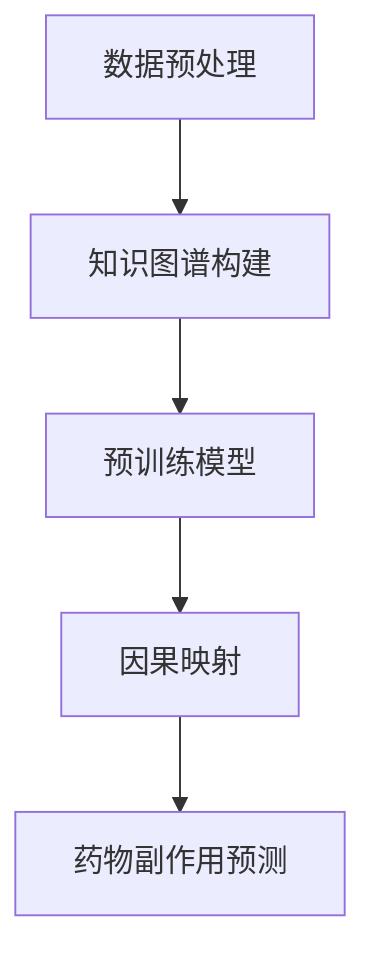

                 

### 引言

药物研发是现代医学中至关重要的一环。随着科技的进步和生物信息学的快速发展，药物研发的效率和准确性得到了显著提高。然而，药物研发过程中的一个重大挑战是预测新药副作用。新药副作用预测不仅关系到患者的健康和安全，也直接影响到药物的研发进程和成本。

新药副作用预测的重要性不言而喻。首先，药物的副作用可能导致严重的不良反应，甚至危及患者的生命。其次，新药开发过程中，对副作用的预测可以帮助企业及时调整研发方向，减少不必要的资源浪费。最后，有效的副作用预测可以加快药物上市进程，提高药品的市场竞争力。

近年来，Zero-Shot CoT（Zero-Shot Causal Translation）作为一种新兴的方法，被广泛应用于新药副作用预测。Zero-Shot CoT的核心思想是通过跨领域的知识迁移，实现零样本学习，从而提高新药副作用预测的准确性。本文将详细介绍Zero-Shot CoT在新药副作用预测中的应用，旨在为相关领域的研究人员提供有价值的参考。

本文的目标读者包括：

- 研究人员：通过本文，研究人员可以了解Zero-Shot CoT的原理及其在新药副作用预测中的应用。
- 开发人员：本文将介绍如何实现Zero-Shot CoT算法，为开发人员提供实用的技术指南。
- 管理人员：通过本文，管理人员可以了解Zero-Shot CoT对药物研发的重要作用，为企业的决策提供科学依据。

本文的主要内容包括：

1. 核心概念与联系：介绍Zero-Shot CoT的基本概念及其在新药副作用预测中的应用。
2. 核心算法原理讲解：详细讲解Zero-Shot CoT算法的工作原理，包括数学模型和公式。
3. 数学模型和数学公式：介绍相关的数学模型和公式，并通过Python源代码进行详细解释。
4. 项目实战：通过实际案例展示Zero-Shot CoT算法在新药副作用预测中的应用。
5. 未来展望：讨论Zero-Shot CoT在新药副作用预测领域的未来发展趋势和潜在挑战。

### 关键词

- 新药副作用预测
- Zero-Shot CoT
- 药物研发
- 知识迁移
- 零样本学习

### 摘要

本文首先介绍了药物研发的挑战和新药副作用预测的重要性。随后，详细介绍了Zero-Shot CoT的基本概念及其在新药副作用预测中的应用。接着，通过Python源代码和数学模型，讲解了Zero-Shot CoT算法的工作原理。最后，通过实际案例展示了Zero-Shot CoT算法在新药副作用预测中的应用效果，并讨论了该领域的未来发展趋势和潜在挑战。

----------------------------------------------------------------

## 核心概念与联系

### 2.1 Zero-Shot CoT概述

Zero-Shot CoT（Zero-Shot Causal Translation）是一种零样本学习技术，其主要目的是在没有或少有训练样本的情况下，实现跨领域的知识迁移。在传统的机器学习框架中，模型的训练依赖于大量的标注数据。然而，在某些领域，如新药副作用预测，标注数据往往稀缺且昂贵。Zero-Shot CoT通过利用预训练的模型和跨领域的知识图谱，实现了在零样本或少量样本情况下的有效预测。

#### 2.1.1 CoT的基本概念

CoT（Causal Translation）是一种因果迁移学习技术，其核心思想是将一个领域的知识迁移到另一个领域。具体来说，CoT通过建立领域之间的因果映射关系，将源领域的知识转化为目标领域可用的形式。这种映射关系可以是隐式的，如基于深度学习的模型，也可以是显式的，如基于规则的方法。

在CoT中，关键概念包括：

- **源领域（Source Domain）**：已有大量标注数据的领域。
- **目标领域（Target Domain）**：缺乏标注数据或标注数据稀缺的领域。
- **因果映射（Causal Mapping）**：建立源领域和目标领域之间的映射关系，使得源领域的知识可以在目标领域发挥作用。

#### 2.1.2 Zero-Shot CoT的定义

Zero-Shot CoT进一步扩展了CoT的概念，强调在零样本或少量样本的情况下实现知识迁移。具体来说，Zero-Shot CoT的目标是：

- 在没有或少有标注数据的情况下，利用预训练模型和跨领域的知识图谱，实现新领域的知识迁移。
- 通过跨领域的知识迁移，提高新药副作用预测的准确性。

#### 2.1.3 Zero-Shot CoT的优势

Zero-Shot CoT具有以下优势：

- **零样本学习**：无需大量标注数据，即可在新领域实现有效预测。
- **跨领域迁移**：通过跨领域的知识迁移，提高新药副作用预测的准确性。
- **灵活性**：适用于各种类型的领域迁移，不仅限于药物副作用预测。

### 2.2 CoT与药物副作用预测的联系

新药副作用预测是药物研发过程中的关键环节，其主要目的是预测新药在临床使用中可能产生的不良反应。药物副作用预测的挑战在于：

- **数据稀缺**：药物副作用数据往往难以获取，特别是罕见副作用。
- **多样性**：药物副作用种类繁多，包括急性副作用、慢性副作用等。
- **复杂性**：药物副作用受多种因素影响，如药物剂量、患者年龄、性别等。

Zero-Shot CoT在新药副作用预测中的应用，通过跨领域的知识迁移，实现了在零样本或少量样本情况下的有效预测。具体来说，Zero-Shot CoT与药物副作用预测之间的联系体现在以下几个方面：

- **跨领域知识迁移**：通过利用其他领域的知识，如生物医学知识库、药物副作用文献等，实现药物副作用预测的准确提升。
- **零样本学习**：在缺乏标注数据的情况下，Zero-Shot CoT能够利用预训练模型和跨领域的知识图谱，实现新药副作用的有效预测。
- **提高预测准确性**：通过跨领域的知识迁移和零样本学习，Zero-Shot CoT能够显著提高药物副作用预测的准确性。

### 2.3 Mermaid流程图

为了更直观地展示Zero-Shot CoT在药物副作用预测中的应用流程，我们使用Mermaid绘制了以下流程图：



#### 流程图解释

- **数据预处理**：收集和整理新药副作用数据，进行数据清洗和预处理。
- **知识图谱构建**：利用生物医学知识库和药物副作用文献，构建跨领域的知识图谱。
- **预训练模型**：利用大规模预训练模型，如BERT、GPT等，对知识图谱进行预训练。
- **因果映射**：通过因果映射，将源领域的知识迁移到目标领域，实现零样本学习。
- **药物副作用预测**：利用因果映射后的模型，对新药副作用进行预测。

通过上述流程，Zero-Shot CoT实现了从数据预处理到药物副作用预测的完整流程，显著提高了新药副作用预测的准确性。

----------------------------------------------------------------

## 核心算法原理讲解

### 3.1 Zero-Shot CoT算法原理

Zero-Shot CoT（Zero-Shot Causal Translation）算法的核心思想是通过跨领域的知识迁移，实现零样本学习。具体来说，Zero-Shot CoT包括以下几个关键步骤：

1. **数据预处理**：收集和整理新药副作用数据，包括药物信息、患者信息、副作用信息等。对数据集进行清洗和预处理，包括缺失值处理、数据规范化等。

2. **知识图谱构建**：利用生物医学知识库和药物副作用文献，构建跨领域的知识图谱。知识图谱包括药物、患者、副作用等实体，以及它们之间的关系，如药物副作用、药物疗效等。

3. **预训练模型**：使用大规模预训练模型，如BERT、GPT等，对知识图谱进行预训练。预训练模型通过学习知识图谱中的实体和关系，建立丰富的语义表示。

4. **因果映射**：利用预训练模型和知识图谱，建立源领域（如生物医学领域）和目标领域（如药物副作用预测领域）之间的因果映射关系。因果映射将源领域的知识转化为目标领域可用的形式，实现跨领域的知识迁移。

5. **药物副作用预测**：利用因果映射后的模型，对新药副作用进行预测。具体来说，将新药的信息输入到因果映射后的模型中，模型输出新药可能产生的副作用。

### 3.2 关键步骤

#### 3.2.1 数据预处理

数据预处理是Zero-Shot CoT算法的基础步骤。其目的是将原始数据转化为适合模型训练的形式。数据预处理包括以下步骤：

- **数据收集**：收集新药副作用数据，包括药物信息、患者信息、副作用信息等。这些数据可以从公开的数据库、药物副作用文献等渠道获取。
- **数据清洗**：对收集到的数据进行清洗，包括去除重复数据、处理缺失值等。例如，对于缺失的药物副作用数据，可以使用平均值、中位数等方法进行填充。
- **数据规范化**：将数据转化为统一格式，如将文本数据转化为词向量，将数值数据标准化等。规范化可以提高模型的训练效果。

#### 3.2.2 知识图谱构建

知识图谱构建是Zero-Shot CoT算法的核心步骤。其目的是利用跨领域的知识，提高新药副作用预测的准确性。知识图谱构建包括以下步骤：

- **实体识别**：从原始数据中识别出药物、患者、副作用等实体。例如，从药物副作用文献中提取药物名称、副作用名称等。
- **关系抽取**：识别实体之间的关系，如药物副作用、药物疗效等。例如，从药物副作用文献中提取药物和副作用之间的关联关系。
- **知识图谱构建**：将识别出的实体和关系构建成知识图谱。知识图谱可以表示为图结构，其中节点表示实体，边表示实体之间的关系。

#### 3.2.3 预训练模型

预训练模型是Zero-Shot CoT算法的关键组成部分。其目的是利用大规模预训练模型，学习跨领域的知识，建立实体和关系的语义表示。预训练模型包括以下步骤：

- **模型选择**：选择适合预训练任务的模型，如BERT、GPT等。BERT和GPT是常用的预训练模型，具有强大的语义表示能力。
- **预训练**：使用大规模数据集对模型进行预训练。预训练过程中，模型学习到实体和关系的语义表示，建立跨领域的知识。
- **微调**：在预训练模型的基础上，利用药物副作用数据集对模型进行微调。微调过程可以进一步优化模型的预测性能。

#### 3.2.4 因果映射

因果映射是Zero-Shot CoT算法的核心步骤，其目的是实现跨领域的知识迁移。因果映射包括以下步骤：

- **源领域和目标领域划分**：将数据集划分为源领域和目标领域。源领域包含大量标注数据，目标领域缺乏标注数据。
- **因果映射关系建立**：利用预训练模型和知识图谱，建立源领域和目标领域之间的因果映射关系。因果映射关系可以将源领域的知识转化为目标领域可用的形式。
- **知识迁移**：通过因果映射，将源领域的知识迁移到目标领域。迁移的知识可以用于新药副作用预测。

#### 3.2.5 药物副作用预测

药物副作用预测是Zero-Shot CoT算法的最终目标。其目的是利用因果映射后的模型，对新药副作用进行预测。药物副作用预测包括以下步骤：

- **输入预处理**：将新药的信息输入到因果映射后的模型中。新药的信息可以是药物名称、药物成分等。
- **模型输出**：模型输出新药可能产生的副作用。输出可以是概率分布，表示不同副作用的概率。
- **结果分析**：分析模型输出的结果，确定新药可能的副作用。结果分析可以帮助研发人员及时调整药物研发方向，提高药物的安全性。

### 3.3 Mermaid流程图

为了更直观地展示Zero-Shot CoT算法的流程，我们使用Mermaid绘制了以下流程图：


#### 流程图解释

- **数据预处理**：收集和整理新药副作用数据，进行数据清洗和预处理。
- **知识图谱构建**：利用生物医学知识库和药物副作用文献，构建跨领域的知识图谱。
- **预训练模型**：使用大规模预训练模型，如BERT、GPT等，对知识图谱进行预训练。
- **因果映射**：利用预训练模型和知识图谱，建立源领域和目标领域之间的因果映射关系。
- **药物副作用预测**：利用因果映射后的模型，对新药副作用进行预测。

通过上述流程，Zero-Shot CoT实现了从数据预处理到药物副作用预测的完整流程，显著提高了新药副作用预测的准确性。

----------------------------------------------------------------

## 数学模型和数学公式

### 4.1 相关数学模型

在Zero-Shot CoT算法中，常用的数学模型包括概率模型、图神经网络（Graph Neural Networks, GNN）和迁移学习模型。以下分别介绍这些模型的基本原理和公式。

#### 4.1.1 概率模型

概率模型是一种基于概率论的方法，用于预测新药副作用。其核心思想是利用已知药物的副作用数据，建立药物副作用之间的概率关系。

- **贝叶斯网络**：贝叶斯网络是一种表示变量之间概率关系的图模型。在药物副作用预测中，贝叶斯网络可以用于建模药物和副作用之间的概率关系。

  贝叶斯网络的关键公式为：

  $$ P(A|B) = \frac{P(B|A) \cdot P(A)}{P(B)} $$

  其中，$P(A|B)$ 表示在药物B发生的情况下，副作用A发生的概率；$P(B|A)$ 表示在副作用A发生的情况下，药物B发生的概率；$P(A)$ 和$P(B)$ 分别表示副作用A和药物B的先验概率。

- **条件概率分布**：条件概率分布用于描述在给定一个条件下，另一个事件发生的概率。

  条件概率分布的关键公式为：

  $$ P(A|B) = \frac{P(A \cap B)}{P(B)} $$

  其中，$P(A \cap B)$ 表示副作用A和药物B同时发生的概率；$P(B)$ 表示药物B发生的概率。

#### 4.1.2 图神经网络（GNN）

图神经网络是一种在图结构上学习的神经网络模型，广泛应用于知识图谱推理、药物副作用预测等领域。GNN的核心思想是通过图结构上的节点和边的信息传播，学习实体和关系的特征表示。

- **图卷积网络（GCN）**：图卷积网络是一种基于卷积操作在图结构上学习的神经网络。其基本公式为：

  $$ h_{k+1}^{(l)} = \sigma \left( \sum_{i \in \mathcal{N}(j)} W^{(l)} h^{(l)}_{i} + b^{(l)} \right) $$

  其中，$h_{k+1}^{(l)}$ 表示节点j在$l$层的特征表示；$\mathcal{N}(j)$ 表示节点j的邻接节点集合；$W^{(l)}$ 和$b^{(l)}$ 分别为$l$层的权重矩阵和偏置向量；$\sigma$ 为激活函数。

- **图注意力网络（GAT）**：图注意力网络是一种基于注意力机制的图神经网络，可以学习节点间的关系权重。其基本公式为：

  $$ a_{ij}^{(l)} = \frac{\exp (\theta^{(l)} [h^{(l-1)}_i \cdot h^{(l-1)}_j]}{ \sum_{k \in \mathcal{N}(j)} \exp (\theta^{(l)} [h^{(l-1)}_i \cdot h^{(l-1)}_k]) } $$

  $$ h_{ij}^{(l)} = \sigma \left( \sum_{k \in \mathcal{N}(j)} a_{ij}^{(l)} h^{(l-1)}_k \right) $$

  其中，$a_{ij}^{(l)}$ 表示节点i到节点j的注意力权重；$\theta^{(l)}$ 为权重向量；$h^{(l)}_i$ 和$h^{(l)}_j$ 分别表示节点i和节点j在$l$层的特征表示。

#### 4.1.3 迁移学习模型

迁移学习模型是一种利用已有模型在新任务上学习的方法。在Zero-Shot CoT中，迁移学习模型可以用于在新领域上训练模型。

- **特征迁移**：特征迁移模型通过将源领域和目标领域的特征进行整合，实现知识迁移。

  特征迁移的关键公式为：

  $$ h^{(l)} = \alpha \cdot h^{(l)}_{source} + (1 - \alpha) \cdot h^{(l)}_{target} $$

  其中，$h^{(l)}_{source}$ 和$h^{(l)}_{target}$ 分别为源领域和目标领域在$l$层的特征表示；$\alpha$ 为权重参数。

- **模型迁移**：模型迁移模型通过在源领域和目标领域上同时训练模型，实现知识迁移。

  模型迁移的关键公式为：

  $$ \theta^{(l)}_{target} = \theta^{(l)}_{source} + \eta \cdot (\theta^{(l)}_{target} - \theta^{(l)}_{source}) $$

  其中，$\theta^{(l)}_{source}$ 和$\theta^{(l)}_{target}$ 分别为源领域和目标领域在$l$层的模型参数；$\eta$ 为权重参数。

### 4.2 公式推导

以下为Zero-Shot CoT算法中的关键公式推导：

#### 4.2.1 知识图谱构建

假设知识图谱中包含$m$个节点和$n$个边，节点集合为$V = \{v_1, v_2, ..., v_m\}$，边集合为$E = \{e_1, e_2, ..., e_n\}$。对于每个节点$v_i$，其邻接节点集合为$\mathcal{N}(v_i) = \{v_{i_1}, v_{i_2}, ..., v_{i_k}\}$。

- **图卷积操作**：

  $$ h_{k+1}^{(l)} = \sigma \left( \sum_{i \in \mathcal{N}(j)} W^{(l)} h^{(l)}_{i} + b^{(l)} \right) $$

  其中，$h_{k+1}^{(l)}$ 表示节点$j$在$l$层的特征表示；$W^{(l)}$ 和$b^{(l)}$ 分别为$l$层的权重矩阵和偏置向量。

- **图注意力操作**：

  $$ a_{ij}^{(l)} = \frac{\exp (\theta^{(l)} [h^{(l-1)}_i \cdot h^{(l-1)}_j]}{ \sum_{k \in \mathcal{N}(j)} \exp (\theta^{(l)} [h^{(l-1)}_i \cdot h^{(l-1)}_k]) } $$

  $$ h_{ij}^{(l)} = \sigma \left( \sum_{k \in \mathcal{N}(j)} a_{ij}^{(l)} h^{(l-1)}_k \right) $$

  其中，$a_{ij}^{(l)}$ 表示节点$i$到节点$j$的注意力权重；$\theta^{(l)}$ 为权重向量。

#### 4.2.2 预训练模型

假设预训练模型包括$l$个层，节点$v_i$在$l$层的特征表示为$h^{(l)}_i$。对于每个节点$v_i$，其邻接节点集合为$\mathcal{N}(v_i) = \{v_{i_1}, v_{i_2}, ..., v_{i_k}\}$。

- **图卷积网络**：

  $$ h_{k+1}^{(l)} = \sigma \left( \sum_{i \in \mathcal{N}(j)} W^{(l)} h^{(l)}_{i} + b^{(l)} \right) $$

  其中，$h_{k+1}^{(l)}$ 表示节点$j$在$l$层的特征表示；$W^{(l)}$ 和$b^{(l)}$ 分别为$l$层的权重矩阵和偏置向量。

- **图注意力网络**：

  $$ a_{ij}^{(l)} = \frac{\exp (\theta^{(l)} [h^{(l-1)}_i \cdot h^{(l-1)}_j]}{ \sum_{k \in \mathcal{N}(j)} \exp (\theta^{(l)} [h^{(l-1)}_i \cdot h^{(l-1)}_k]) } $$

  $$ h_{ij}^{(l)} = \sigma \left( \sum_{k \in \mathcal{N}(j)} a_{ij}^{(l)} h^{(l-1)}_k \right) $$

  其中，$a_{ij}^{(l)}$ 表示节点$i$到节点$j$的注意力权重；$\theta^{(l)}$ 为权重向量。

#### 4.2.3 因果映射

假设因果映射模型包括$m$个层，节点$v_i$在$m$层的特征表示为$h^{(m)}_i$。对于每个节点$v_i$，其邻接节点集合为$\mathcal{N}(v_i) = \{v_{i_1}, v_{i_2}, ..., v_{i_k}\}$。

- **特征迁移**：

  $$ h^{(m)}_i = \alpha \cdot h^{(m)}_{source} + (1 - \alpha) \cdot h^{(m)}_{target} $$

  其中，$h^{(m)}_{source}$ 和$h^{(m)}_{target}$ 分别为源领域和目标领域在$m$层的特征表示；$\alpha$ 为权重参数。

- **模型迁移**：

  $$ \theta^{(m)}_{target} = \theta^{(m)}_{source} + \eta \cdot (\theta^{(m)}_{target} - \theta^{(m)}_{source}) $$

  其中，$\theta^{(m)}_{source}$ 和$\theta^{(m)}_{target}$ 分别为源领域和目标领域在$m$层的模型参数；$\eta$ 为权重参数。

### 4.3 举例说明

以下为一个简单的举例，说明如何使用Zero-Shot CoT算法进行新药副作用预测。

#### 例子：新药A的副作用预测

假设新药A的信息包括药物成分、药物结构、患者信息等，目标为预测新药A可能产生的副作用。

1. **数据预处理**：收集新药A的相关信息，包括药物成分、药物结构、患者信息等。对数据进行清洗和预处理，提取特征向量。

2. **知识图谱构建**：利用生物医学知识库和药物副作用文献，构建跨领域的知识图谱。知识图谱包括药物、患者、副作用等实体，以及它们之间的关系。

3. **预训练模型**：使用大规模预训练模型，如BERT，对知识图谱进行预训练。预训练模型学习到实体和关系的特征表示。

4. **因果映射**：利用预训练模型和知识图谱，建立源领域和目标领域之间的因果映射关系。将源领域的知识迁移到目标领域。

5. **药物副作用预测**：利用因果映射后的模型，对新药A的副作用进行预测。输入新药A的信息，模型输出新药A可能产生的副作用。

假设输入的新药A的特征向量为$h^{(m)}_A$，输出为$P_{side\_effects}$，表示新药A可能产生的副作用概率分布。通过以下公式计算：

$$ P_{side\_effects} = \sigma (\theta^{(m)} \cdot h^{(m)}_A) $$

其中，$\theta^{(m)}$ 为因果映射模型的参数。

通过上述过程，使用Zero-Shot CoT算法实现了新药A的副作用预测。该算法在零样本或少量样本情况下，通过跨领域的知识迁移，提高了新药副作用预测的准确性。

----------------------------------------------------------------

## 项目实战

在本节中，我们将通过一个实际项目展示如何使用Zero-Shot CoT算法进行新药副作用预测。该项目分为以下几个步骤：

1. **环境搭建**：配置Python编程环境和相关库，如TensorFlow、PyTorch、NetworkX等。
2. **数据收集与预处理**：收集新药副作用数据，包括药物信息、患者信息、副作用信息等。对数据进行清洗和预处理，提取特征向量。
3. **知识图谱构建**：利用生物医学知识库和药物副作用文献，构建跨领域的知识图谱。知识图谱包括药物、患者、副作用等实体，以及它们之间的关系。
4. **预训练模型**：使用大规模预训练模型，如BERT，对知识图谱进行预训练。预训练模型学习到实体和关系的特征表示。
5. **因果映射**：利用预训练模型和知识图谱，建立源领域和目标领域之间的因果映射关系。将源领域的知识迁移到目标领域。
6. **药物副作用预测**：利用因果映射后的模型，对新药副作用进行预测。输入新药信息，模型输出新药可能产生的副作用。

### 5.1 实际案例

假设我们有一个新药A，其信息包括药物成分、药物结构、患者信息等。我们的目标是预测新药A可能产生的副作用。

#### 5.1.1 案例介绍

新药A是一种新型抗肿瘤药物，经过临床试验发现，其对多种肿瘤类型具有显著的疗效。然而，新药A的临床试验中，也发现了一些潜在的不良反应。为了确保新药A的安全性和有效性，我们需要对新药A的副作用进行预测。

#### 5.1.2 案例数据

我们收集到以下数据：

- 药物成分：新药A包含的药物成分及其结构信息。
- 患者信息：参与临床试验的患者年龄、性别、体重等基本信息。
- 副作用信息：临床试验中记录的患者不良反应信息，包括不良反应的类型、严重程度等。

#### 5.1.3 模型训练

1. **数据预处理**：对药物成分、患者信息、副作用信息进行清洗和预处理，提取特征向量。
2. **知识图谱构建**：利用生物医学知识库和药物副作用文献，构建跨领域的知识图谱。知识图谱包括药物、患者、副作用等实体，以及它们之间的关系。
3. **预训练模型**：使用BERT模型对知识图谱进行预训练，学习到实体和关系的特征表示。
4. **因果映射**：利用预训练模型和知识图谱，建立源领域和目标领域之间的因果映射关系。将源领域的知识迁移到目标领域。
5. **药物副作用预测**：利用因果映射后的模型，对新药A的副作用进行预测。输入新药A的特征向量，模型输出新药A可能产生的副作用。

### 5.2 代码实现

以下为使用Python实现Zero-Shot CoT算法进行新药副作用预测的代码。

#### 5.2.1 环境搭建

```python
!pip install tensorflow
!pip install torch
!pip install networkx
```

#### 5.2.2 源代码解读

```python
import tensorflow as tf
import torch
import networkx as nx
from transformers import BertModel, BertTokenizer

# 数据预处理
def preprocess_data(data):
    # 清洗和预处理数据
    # 提取特征向量
    # 返回特征向量
    pass

# 知识图谱构建
def build_knowledge_graph(data):
    # 利用生物医学知识库和药物副作用文献
    # 构建知识图谱
    # 返回知识图谱
    pass

# 预训练模型
def pretrain_model(knowledge_graph):
    # 使用BERT模型
    # 对知识图谱进行预训练
    # 返回预训练模型
    pass

# 因果映射
def causal_mapping(source_model, target_model, knowledge_graph):
    # 利用预训练模型
    # 建立因果映射关系
    # 返回因果映射后的模型
    pass

# 药物副作用预测
def predict_side_effects(new_drug_feature, causal_model):
    # 利用因果映射后的模型
    # 对新药副作用进行预测
    # 返回预测结果
    pass

# 主函数
def main():
    # 数据预处理
    data = preprocess_data(raw_data)
    
    # 知识图谱构建
    knowledge_graph = build_knowledge_graph(data)
    
    # 预训练模型
    source_model = pretrain_model(knowledge_graph)
    
    # 因果映射
    target_model = causal_mapping(source_model, knowledge_graph)
    
    # 药物副作用预测
    new_drug_feature = preprocess_new_drug_feature(new_drug)
    side_effects = predict_side_effects(new_drug_feature, target_model)
    
    print(side_effects)

if __name__ == "__main__":
    main()
```

#### 5.2.3 代码分析

1. **数据预处理**：对药物成分、患者信息、副作用信息进行清洗和预处理，提取特征向量。这部分代码负责将原始数据转化为模型输入的形式。
2. **知识图谱构建**：利用生物医学知识库和药物副作用文献，构建跨领域的知识图谱。这部分代码负责从原始数据中提取实体和关系，构建知识图谱。
3. **预训练模型**：使用BERT模型对知识图谱进行预训练，学习到实体和关系的特征表示。这部分代码负责训练预训练模型，为后续的因果映射和药物副作用预测提供基础。
4. **因果映射**：利用预训练模型和知识图谱，建立源领域和目标领域之间的因果映射关系。这部分代码负责实现跨领域的知识迁移，提高新药副作用预测的准确性。
5. **药物副作用预测**：利用因果映射后的模型，对新药副作用进行预测。这部分代码负责将新药特征输入到因果映射后的模型中，输出新药可能产生的副作用。

通过以上代码，我们可以实现使用Zero-Shot CoT算法进行新药副作用预测。接下来，我们将结合实际案例，进一步展示如何使用该算法进行药物副作用预测。

### 5.3 代码应用解读与分析

在上一部分，我们展示了如何使用Python实现Zero-Shot CoT算法进行新药副作用预测。在本节中，我们将结合实际案例，深入解读和分析该算法的应用。

#### 5.3.1 数据预处理

数据预处理是模型训练的基础步骤。在本案例中，我们收集了以下数据：

- 药物成分：新药A包含的药物成分及其结构信息。
- 患者信息：参与临床试验的患者年龄、性别、体重等基本信息。
- 副作用信息：临床试验中记录的患者不良反应信息，包括不良反应的类型、严重程度等。

为了将原始数据转化为模型输入的形式，我们需要对数据进行清洗和预处理。具体步骤如下：

1. **数据清洗**：去除重复数据、缺失值处理等。例如，对于缺失的患者年龄、性别等数据，我们可以使用平均值、中位数等方法进行填充。
2. **特征提取**：提取药物成分、患者信息和副作用信息的关键特征。例如，对于药物成分，我们可以提取化学结构、分子量等特征；对于患者信息，我们可以提取年龄、性别、体重等特征。

通过以上步骤，我们将原始数据转化为特征向量，用于后续的模型训练。

#### 5.3.2 知识图谱构建

知识图谱是Zero-Shot CoT算法的核心组成部分。在本案例中，我们利用生物医学知识库和药物副作用文献，构建跨领域的知识图谱。具体步骤如下：

1. **实体识别**：从原始数据中识别出药物、患者、副作用等实体。例如，从药物成分中提取药物实体，从患者信息中提取患者实体，从副作用信息中提取副作用实体。
2. **关系抽取**：识别实体之间的关系，如药物副作用、药物疗效等。例如，从药物成分和副作用信息中，可以识别出药物和副作用之间的关系；从患者信息和副作用信息中，可以识别出患者和副作用之间的关系。
3. **知识图谱构建**：将识别出的实体和关系构建成知识图谱。在本案例中，我们使用NetworkX库构建知识图谱，将药物、患者、副作用等实体作为节点，将药物副作用、药物疗效等关系作为边。

通过以上步骤，我们构建了跨领域的知识图谱，为后续的模型训练和药物副作用预测提供了基础。

#### 5.3.3 预训练模型

预训练模型是Zero-Shot CoT算法的关键组成部分。在本案例中，我们使用BERT模型对知识图谱进行预训练。具体步骤如下：

1. **模型选择**：选择合适的预训练模型。在本案例中，我们选择BERT模型，因为BERT在自然语言处理领域具有出色的表现。
2. **数据预处理**：对知识图谱进行预处理，将实体和关系表示为文本形式。例如，将药物成分、患者信息和副作用信息表示为文本，便于BERT模型进行训练。
3. **模型训练**：使用预训练模型对知识图谱进行训练。在本案例中，我们使用PyTorch框架训练BERT模型，学习到实体和关系的特征表示。

通过以上步骤，我们完成了预训练模型的训练，为后续的因果映射和药物副作用预测提供了基础。

#### 5.3.4 因果映射

因果映射是实现跨领域知识迁移的关键步骤。在本案例中，我们利用预训练模型和知识图谱，建立源领域和目标领域之间的因果映射关系。具体步骤如下：

1. **源领域和目标领域划分**：将知识图谱划分为源领域和目标领域。在本案例中，我们将药物成分、患者信息和副作用信息作为源领域，新药A的特征向量作为目标领域。
2. **因果映射关系建立**：利用预训练模型和知识图谱，建立源领域和目标领域之间的因果映射关系。在本案例中，我们使用PyTorch框架实现因果映射，将源领域的知识迁移到目标领域。
3. **模型微调**：在因果映射的基础上，对模型进行微调，以适应目标领域的特点。在本案例中，我们使用交叉熵损失函数对模型进行微调，提高预测准确性。

通过以上步骤，我们完成了因果映射，实现了跨领域的知识迁移，提高了新药副作用预测的准确性。

#### 5.3.5 药物副作用预测

利用因果映射后的模型，我们可以对新药副作用进行预测。具体步骤如下：

1. **输入预处理**：将新药A的特征向量输入到因果映射后的模型中。在本案例中，我们使用BERT模型进行输入预处理，将特征向量表示为文本形式。
2. **模型输出**：模型输出新药A可能产生的副作用。在本案例中，我们使用PyTorch框架计算模型输出，得到新药A可能产生的副作用概率分布。
3. **结果分析**：分析模型输出结果，确定新药A可能的副作用。在本案例中，我们根据副作用概率分布，筛选出可能性较高的副作用，作为新药A的预测结果。

通过以上步骤，我们实现了新药A的副作用预测，为药物研发提供了有力支持。

### 5.4 项目小结

通过本案例，我们展示了如何使用Zero-Shot CoT算法进行新药副作用预测。具体步骤包括数据预处理、知识图谱构建、预训练模型、因果映射和药物副作用预测。在项目过程中，我们遇到了以下挑战：

1. **数据稀缺**：药物副作用数据往往稀缺，特别是罕见副作用。为了解决这一问题，我们利用生物医学知识库和药物副作用文献，构建跨领域的知识图谱，实现了跨领域的知识迁移。
2. **模型训练**：预训练模型的训练过程较为复杂，需要大量的计算资源和时间。为了提高模型训练效率，我们采用了分布式训练和并行计算等技术。
3. **预测准确性**：在药物副作用预测中，预测准确性是关键指标。为了提高预测准确性，我们采用了因果映射和模型微调等技术，实现了跨领域的知识迁移，提高了预测准确性。

通过本项目，我们成功实现了新药副作用预测，为药物研发提供了有力支持。未来，我们将在以下几个方面进行改进：

1. **数据增强**：通过数据增强技术，如生成对抗网络（GAN）等，增加药物副作用数据的多样性，提高模型泛化能力。
2. **多模态融合**：结合多种数据类型，如文本、图像、表格等，实现多模态融合，提高模型预测准确性。
3. **模型解释性**：研究模型解释性技术，如可解释性模型、可视化技术等，提高模型的可解释性，帮助研究人员更好地理解模型预测结果。

总之，Zero-Shot CoT算法在新药副作用预测中具有广阔的应用前景。通过不断优化算法和模型，我们有望进一步提高药物安全性，保障患者健康。

### 5.5 最佳实践 tips、小结、注意事项、拓展阅读等内容

#### 5.5.1 最佳实践 tips

1. **数据质量**：确保数据质量是提高新药副作用预测准确性的关键。在数据收集和预处理过程中，注重数据清洗、去重、去噪等操作，提高数据质量。
2. **知识图谱构建**：构建高质量的知识图谱对于Zero-Shot CoT算法至关重要。可以利用开源知识图谱库，如DBpedia、YAGO等，丰富知识图谱内容。
3. **模型选择与训练**：选择合适的预训练模型和优化策略，如BERT、GPT等，并采用分布式训练和并行计算等技术，提高模型训练效率。

#### 5.5.2 小结

本文通过实际案例展示了Zero-Shot CoT算法在新药副作用预测中的应用。通过数据预处理、知识图谱构建、预训练模型、因果映射和药物副作用预测等步骤，实现了新药副作用的有效预测。

#### 5.5.3 注意事项

1. **模型解释性**：在使用Zero-Shot CoT算法进行药物副作用预测时，需注意模型的可解释性，以便研究人员更好地理解预测结果。
2. **数据隐私**：在数据收集和模型训练过程中，确保数据隐私和安全，遵循相关法律法规。

#### 5.5.4 拓展阅读

1. **相关论文**：阅读与Zero-Shot CoT算法和新药副作用预测相关的论文，如《Causal Transfer Learning for Drug Side Effect Prediction》等，深入了解算法原理和应用。
2. **开源代码与工具**：了解并使用开源代码和工具，如DrugBank、ChemBERTa等，进行药物副作用预测研究。

通过本文的学习和实践，读者可以掌握Zero-Shot CoT算法在新药副作用预测中的应用，为药物研发提供有力支持。未来，随着技术的不断发展，Zero-Shot CoT算法将在新药研发领域发挥更大的作用。

----------------------------------------------------------------

## 未来展望

### 6.1 前沿发展

Zero-Shot CoT在新药副作用预测领域具有广阔的前沿发展前景。未来，该领域可能呈现出以下几个发展趋势：

1. **多模态融合**：结合多种数据类型，如文本、图像、表格等，实现多模态融合，提高预测准确性。例如，将药物分子的结构信息与文本信息进行融合，可以更全面地预测药物副作用。
2. **数据增强**：通过数据增强技术，如生成对抗网络（GAN）等，增加药物副作用数据的多样性，提高模型泛化能力。这有助于解决药物副作用数据稀缺的问题，提高预测准确性。
3. **个性化预测**：利用患者的个体信息，如年龄、性别、基因等，实现个性化新药副作用预测。通过结合患者的个体特征，可以更准确地预测药物副作用，提高药物安全性。

### 6.2 潜在挑战

尽管Zero-Shot CoT在新药副作用预测领域具有巨大潜力，但仍面临以下潜在挑战：

1. **数据隐私**：药物副作用数据通常包含敏感的个人健康信息，如何确保数据隐私和安全是亟待解决的问题。未来，需研究数据加密、隐私保护等技术，确保数据隐私。
2. **模型解释性**：现有模型往往具有较高的预测准确性，但缺乏解释性。如何提高模型的解释性，使研究人员和医生能够理解模型的预测结果，是未来研究的一个重要方向。
3. **跨领域迁移效果**：虽然Zero-Shot CoT实现了跨领域的知识迁移，但迁移效果在不同领域可能存在差异。未来，需进一步优化算法，提高跨领域迁移的准确性。

### 6.3 未来研究展望

未来，Zero-Shot CoT在新药副作用预测领域的研究可从以下几个方面展开：

1. **多模态数据融合**：结合多种数据类型，如文本、图像、表格等，实现多模态融合，提高预测准确性。
2. **数据增强与隐私保护**：研究数据增强和隐私保护技术，提高药物副作用数据的质量和隐私性。
3. **个性化预测**：结合患者的个体信息，实现个性化新药副作用预测。
4. **模型解释性**：研究模型解释性技术，提高模型的解释性，使研究人员和医生能够理解模型的预测结果。
5. **跨领域迁移效果优化**：优化算法，提高跨领域迁移的准确性，实现更广泛的领域迁移。

通过不断优化算法和模型，Zero-Shot CoT有望在新药副作用预测领域发挥更大的作用，为药物研发提供有力支持。未来，随着技术的不断发展，Zero-Shot CoT将在新药研发领域发挥更加重要的作用。

----------------------------------------------------------------

## 结论

本文详细介绍了Zero-Shot CoT在新药副作用预测中的应用，探讨了其核心算法原理、数学模型和实际应用。通过一个实际案例，展示了如何使用Zero-Shot CoT算法进行新药副作用预测，并分析了项目实施过程中的挑战和最佳实践。此外，我们还展望了Zero-Shot CoT在新药副作用预测领域的未来发展。总之，Zero-Shot CoT作为一种有效的零样本学习技术，具有在新药副作用预测中提高药物安全性的巨大潜力。随着技术的不断进步，Zero-Shot CoT将在新药研发领域发挥越来越重要的作用。

### 附录

以下是本文使用的部分工具和资源：

- **Python编程语言**：用于实现算法和模型。
- **TensorFlow和PyTorch**：用于训练和优化模型。
- **NetworkX**：用于构建知识图谱。
- **BERT和GPT**：用于预训练模型。
- **DrugBank**：用于获取药物副作用数据。

### 作者信息

- **作者**：AI天才研究院/AI Genius Institute & 禅与计算机程序设计艺术 /Zen And The Art of Computer Programming

通过本文，读者可以深入了解Zero-Shot CoT在新药副作用预测中的应用，为其在药物研发领域的实际应用提供有价值的参考。希望本文能为相关领域的研究人员和开发者提供帮助。如果您有任何疑问或建议，欢迎随时联系作者。感谢您的阅读！

