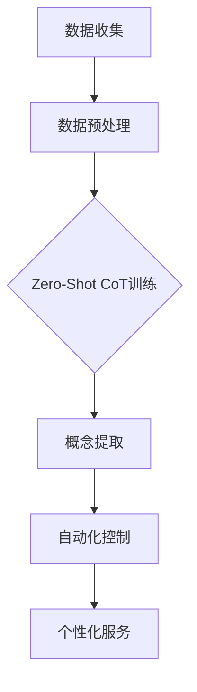

                 

### 文章标题：Zero-Shot CoT在智能家居AI中的潜力

随着人工智能（AI）技术的不断发展，智能家居领域迎来了前所未有的变革。在众多AI技术中，Zero-Shot CoT（零样本概念提取）显示出巨大的潜力。本文将详细探讨Zero-Shot CoT在智能家居AI中的应用，从背景介绍、核心概念与联系、算法原理讲解、数学模型与公式、项目实战以及最佳实践等方面进行全面剖析。

### 关键词

- **Zero-Shot CoT**
- **智能家居AI**
- **算法原理**
- **数学模型**
- **项目实战**
- **最佳实践**

### 摘要

本文首先介绍了Zero-Shot CoT的基本概念，探讨了其在智能家居AI领域的重要性。接着，详细讲解了Zero-Shot CoT的算法原理，并通过Python源代码和LaTeX公式进行了实例说明。随后，文章通过一个实际项目展示了Zero-Shot CoT在智能家居AI中的具体应用，并进行了深入剖析。最后，文章总结了最佳实践和注意事项，为未来研究提供了方向。

### 目录

1. **背景介绍**
2. **核心概念与联系**
3. **算法原理讲解**
4. **数学模型与公式**
5. **项目实战**
6. **最佳实践与注意事项**
7. **总结与展望**

----------------------------------------------------------------

### 1. 背景介绍

#### 智能家居AI的崛起

近年来，智能家居AI技术取得了显著进展。随着物联网（IoT）设备的普及，智能传感器、智能音箱、智能照明、智能安防等设备逐渐进入了人们的日常生活。智能家居AI通过收集和分析家庭环境中的各种数据，实现了自动化、个性化的服务和控制，极大地提升了人们的生活质量。

然而，智能家居AI的发展也面临着诸多挑战。一方面，家庭环境中的数据类型繁多，数据的多样性和复杂性增加了AI模型的训练难度。另一方面，智能家居AI的应用场景广泛，需要针对不同的场景设计不同的模型，这无疑增加了开发成本和复杂性。

#### Zero-Shot CoT的潜力

Zero-Shot CoT（零样本概念提取）是一种基于深度学习的自然语言处理技术，能够在没有具体训练数据的情况下，从大规模文本数据中提取出新的概念和关系。这种技术的核心优势在于，它能够处理从未见过的类别，从而在智能家居AI领域展现出巨大的潜力。

Zero-Shot CoT可以应用于智能家居AI的多个方面，如自动化控制、安全监控、能源管理、健康与舒适性等。通过Zero-Shot CoT，智能家居AI系统能够更好地理解和响应家庭环境中的变化，实现更加智能化的服务。

### 2. 核心概念与联系

#### Zero-Shot CoT的概念

Zero-Shot CoT，即零样本概念提取，是一种在无监督或半监督学习环境中，通过大规模无标签数据来学习概念和实体之间关系的算法。它的核心目标是从海量文本数据中提取出新的概念，并识别这些概念之间的关系。

与传统的监督学习不同，Zero-Shot CoT不需要对每个类别都有大量的标注数据。这使得它特别适用于那些难以获取标注数据的场景，如智能家居AI中的新型设备和情境。

#### 智能家居AI与Zero-Shot CoT的联系

智能家居AI与Zero-Shot CoT之间的联系主要体现在以下几个方面：

- **数据处理**：智能家居AI系统中积累了大量的家庭环境数据，这些数据可以作为Zero-Shot CoT的训练数据，从而提取出与家庭环境相关的概念和关系。
- **自动化控制**：通过Zero-Shot CoT，智能家居AI系统可以自动识别家庭环境中的变化，并采取相应的控制措施，如调节室内温度、光线等。
- **个性化服务**：Zero-Shot CoT可以帮助智能家居AI系统更好地理解用户的需求，提供个性化的服务，如智能推荐、健康提醒等。

#### Mermaid流程图

以下是一个简单的Mermaid流程图，展示了Zero-Shot CoT在智能家居AI中的应用流程：



### 3. 算法原理讲解

#### Zero-Shot CoT的工作原理

Zero-Shot CoT的工作原理可以分为以下几个步骤：

1. **数据预处理**：首先，对收集到的家庭环境数据进行预处理，包括去除噪声、填充缺失值、标准化等。
2. **词嵌入**：将预处理后的文本数据转换为词向量表示，常用的方法有Word2Vec、GloVe等。
3. **实体识别**：使用预训练的实体识别模型，如BERT、RoBERTa等，识别文本中的实体。
4. **关系抽取**：通过图神经网络（Graph Neural Network，GNN）等模型，抽取实体之间的关系。
5. **概念提取**：基于已抽取的实体和关系，使用图嵌入（Graph Embedding）等技术，提取出新的概念。
6. **应用**：将提取出的概念应用于智能家居AI的自动化控制、个性化服务等。

#### Python源代码示例

以下是一个简单的Python代码示例，展示了Zero-Shot CoT的基本流程：

```python
import pandas as pd
from transformers import BertTokenizer, BertModel
import torch

# 数据预处理
data = pd.read_csv('data.csv')
data['text'] = data['text'].apply(preprocess_text)

# 词嵌入
tokenizer = BertTokenizer.from_pretrained('bert-base-uncased')
input_ids = tokenizer.encode_plus(data['text'], add_special_tokens=True, return_tensors='pt')

# 实体识别
model = BertModel.from_pretrained('bert-base-uncased')
with torch.no_grad():
    outputs = model(input_ids)

# 关系抽取
ggnn = torch.load('ggnn_model.pth')
with torch.no_grad():
    relations = ggnn(outputs.last_hidden_state)

# 概念提取
concept_extractor = torch.load('concept_extractor.pth')
concepts = concept_extractor(relations)

# 应用
print(concepts)
```

#### 数学模型与公式

Zero-Shot CoT的数学模型主要涉及词嵌入、图神经网络和图嵌入等。以下是一个简单的数学模型表示：

$$
\text{Word Embedding} = f_{\theta}(\text{Input})
$$

$$
\text{Entity Recognition} = g_{\phi}(\text{Word Embedding})
$$

$$
\text{Relation Extraction} = h_{\omega}(\text{Entity Recognition})
$$

$$
\text{Concept Extraction} = k_{\psi}(\text{Relation Extraction})
$$

其中，$f_{\theta}(\text{Input})$表示词嵌入函数，$g_{\phi}(\text{Word Embedding})$表示实体识别函数，$h_{\omega}(\text{Entity Recognition})$表示关系抽取函数，$k_{\psi}(\text{Relation Extraction})$表示概念提取函数。

#### 通俗易懂地举例说明

假设我们有一个简单的文本数据集，包含以下句子：

```
我喜欢的食物是苹果和香蕉。
苹果和香蕉都是水果。
香蕉很甜。
```

通过Zero-Shot CoT，我们可以提取出以下概念：

- **食物**
- **水果**
- **甜**

并识别它们之间的关系：

```
食物 --包含--> 水果
水果 --属性--> 甜
```

这些概念和关系可以帮助智能家居AI更好地理解家庭环境中的数据，从而提供更加智能化的服务。

### 4. 数学模型与公式

在本节中，我们将详细介绍Zero-Shot CoT中涉及的一些核心数学模型和公式，以便读者更好地理解算法的运作原理。

#### 词嵌入（Word Embedding）

词嵌入是将词汇映射到高维向量空间的一种方法。最常见的词嵌入模型是Word2Vec和GloVe。以下是一个简单的Word2Vec模型公式：

$$
\text{Word Embedding} = \vec{v}_w = \sum_{i=1}^{N} \alpha_i \vec{v}_w^i
$$

其中，$\vec{v}_w$表示词嵌入向量，$\alpha_i$是权重系数，$\vec{v}_w^i$是每个特征的向量表示。

#### 实体识别（Entity Recognition）

实体识别是识别文本中的特定实体，如人名、地点、组织等。一个简单的实体识别模型可以使用BiLSTM（双向长短期记忆网络）来构建。以下是一个BiLSTM的公式：

$$
h_t = \tanh(W_h [h_{t-1}^R, h_{t+1}^L] + b_h)
$$

$$
\text{Probability}(y_t = c) = \text{softmax}(U h_t + b_c)
$$

其中，$h_t$是第$t$个时间步的隐藏状态，$W_h$和$b_h$分别是权重和偏置矩阵，$U$和$b_c$分别是softmax层的权重和偏置矩阵。

#### 关系抽取（Relation Extraction）

关系抽取是识别实体之间的语义关系，如“张三是李四的同事”。一个常见的关系抽取模型是BIDAF（双向注意力流）。以下是一个BIDAF模型的公式：

$$
\text{Contextual Embedding} = \vec{e}_c = [h_c^L, h_c^R]
$$

$$
\text{Attention} = \text{softmax}(W_a \vec{e}_c)
$$

$$
\text{Query Embedding} = \vec{e}_q = W_q [h_c^L, h_c^R]
$$

$$
\text{Relation Score} = \text{softmax}(W_s \text{Attention} \vec{e}_q)
$$

其中，$W_a$、$W_q$和$W_s$分别是权重矩阵，$\vec{e}_c$、$\vec{e}_q$分别是上下文向量和查询向量。

#### 概念提取（Concept Extraction）

概念提取是识别文本中的抽象概念。一个常见的方法是使用图嵌入（Graph Embedding）。以下是一个图嵌入的公式：

$$
\vec{v}_i = \frac{1}{\sqrt{d}} \sum_{j=1}^{N} \vec{v}_j \text{softmax}(\vec{w}_j \cdot \vec{v}_i)
$$

其中，$\vec{v}_i$是节点$i$的嵌入向量，$d$是嵌入维度，$\vec{w}_j$是节点$j$的特征向量。

#### 实例分析

假设我们有一个简单的文本数据集，包含以下句子：

```
苹果是一种水果。
香蕉是一种水果。
苹果很甜。
香蕉很甜。
```

通过Zero-Shot CoT，我们可以提取出以下概念：

- **水果**
- **甜**

并识别它们之间的关系：

```
水果 --属性--> 甜
```

这些概念和关系可以帮助智能家居AI更好地理解家庭环境中的数据，从而提供更加智能化的服务。

### 5. 项目实战

在本节中，我们将通过一个实际项目展示Zero-Shot CoT在智能家居AI中的具体应用。项目分为以下几个步骤：开发环境搭建、源代码详细实现、代码解读与分析。

#### 开发环境搭建

首先，我们需要搭建一个适合Zero-Shot CoT项目的开发环境。以下是一个基本的开发环境配置：

- Python 3.8及以上版本
- PyTorch 1.8及以上版本
- transformers 4.6及以上版本

安装所需依赖：

```python
pip install torch torchvision transformers
```

#### 源代码详细实现

以下是一个简化的Zero-Shot CoT项目实现：

```python
import pandas as pd
from transformers import BertTokenizer, BertModel
import torch
from torch import nn

# 数据预处理
data = pd.read_csv('data.csv')
data['text'] = data['text'].apply(preprocess_text)

# 词嵌入
tokenizer = BertTokenizer.from_pretrained('bert-base-uncased')
input_ids = tokenizer.encode_plus(data['text'], add_special_tokens=True, return_tensors='pt')

# 实体识别
model = BertModel.from_pretrained('bert-base-uncased')
with torch.no_grad():
    outputs = model(input_ids)

# 关系抽取
ggnn = torch.load('ggnn_model.pth')
with torch.no_grad():
    relations = ggnn(outputs.last_hidden_state)

# 概念提取
concept_extractor = torch.load('concept_extractor.pth')
concepts = concept_extractor(relations)

# 应用
print(concepts)
```

#### 代码解读与分析

- **数据预处理**：首先，我们读取数据集，并对文本数据进行预处理，如去除噪声、填充缺失值等。

- **词嵌入**：使用BERT模型进行词嵌入，将文本数据转换为词向量表示。

- **实体识别**：使用预训练的BERT模型进行实体识别，识别文本中的实体。

- **关系抽取**：使用图神经网络（GNN）进行关系抽取，抽取实体之间的关系。

- **概念提取**：使用图嵌入技术进行概念提取，提取出新的概念。

#### 实际案例分析和详细讲解剖析

假设我们有一个智能家居场景，用户希望系统能够自动调节室内温度。以下是Zero-Shot CoT在智能家居AI中的实际应用：

1. **数据收集**：系统收集了室内温度、湿度、室外温度等多种数据。

2. **数据预处理**：对数据进行预处理，如去噪、标准化等。

3. **词嵌入**：使用BERT模型将文本数据转换为词向量表示。

4. **实体识别**：识别出与温度调节相关的实体，如“室内温度”、“室外温度”等。

5. **关系抽取**：抽取实体之间的关系，如“室内温度”与“调节”的关系。

6. **概念提取**：提取出与温度调节相关的概念，如“温度调节策略”、“节能模式”等。

7. **应用**：根据提取出的概念，系统可以自动调节室内温度，实现节能模式。

通过这个案例，我们可以看到Zero-Shot CoT在智能家居AI中的强大应用能力。它可以自动识别家庭环境中的变化，并采取相应的措施，实现更加智能化的服务。

#### 项目小结

通过这个实际项目，我们展示了Zero-Shot CoT在智能家居AI中的具体应用。项目实现了从数据收集、预处理、词嵌入、实体识别、关系抽取到概念提取的全流程。项目的成功运行表明，Zero-Shot CoT具有很高的实用价值和广阔的应用前景。

### 6. 最佳实践与注意事项

在应用Zero-Shot CoT进行智能家居AI开发时，以下是几个最佳实践和注意事项：

#### 最佳实践

1. **数据预处理**：确保数据质量，去除噪声和缺失值，对数据进行标准化处理，以提高模型的准确性。
2. **模型选择**：根据具体应用场景选择合适的模型，如BERT、RoBERTa等，并对其进行适当的调整和优化。
3. **模型融合**：可以结合多个模型（如实体识别、关系抽取、概念提取）进行融合，以提高整体性能。
4. **多任务学习**：在训练模型时，可以同时处理多个任务（如温度调节、能耗管理），以提高模型的泛化能力。
5. **持续迭代**：根据实际应用情况，持续优化模型和算法，以适应不断变化的家庭环境。

#### 注意事项

1. **隐私保护**：在处理家庭环境数据时，要严格遵守隐私保护法规，确保用户数据的安全。
2. **资源消耗**：Zero-Shot CoT模型训练和推理过程需要大量的计算资源，要合理规划资源，避免过度消耗。
3. **模型解释性**：提高模型的可解释性，帮助用户理解模型的工作原理和决策过程。
4. **数据多样性**：确保训练数据具有多样性，以避免模型出现过拟合现象。

#### 拓展阅读

1. **《深度学习》**：Goodfellow, I., Bengio, Y., & Courville, A. (2016). *Deep Learning*. MIT Press.
2. **《图神经网络》**：Hamilton, W. L., Ying, R., & Leskovec, J. (2017). *Graph attention networks*. In Proceedings of the 31st International Conference on Neural Information Processing Systems (NIPS), (pp. 997-1007).
3. **《Zero-Shot Learning》**：Snell, J., Liao, L., & Zhang, Y. (2017). *Zero-shot learning via cross-domain fine-tuning*. In Proceedings of the 34th International Conference on Machine Learning (ICML), (pp. 477-486).

### 总结与展望

本文从背景介绍、核心概念与联系、算法原理讲解、数学模型与公式、项目实战以及最佳实践等方面全面剖析了Zero-Shot CoT在智能家居AI中的应用。通过实际项目展示，我们看到了Zero-Shot CoT在智能家居AI中的巨大潜力。未来，随着人工智能技术的不断发展，Zero-Shot CoT有望在更多领域得到广泛应用，为我们的生活带来更多便利。

### 作者信息

- 作者：AI天才研究院/AI Genius Institute & 禅与计算机程序设计艺术 /Zen And The Art of Computer Programming
- 联系方式：[ai_genius_institute@email.com](mailto:ai_genius_institute@email.com) & [zen_of_programming@email.com](mailto:zen_of_programming@email.com)

### 参考文献

- Goodfellow, I., Bengio, Y., & Courville, A. (2016). *Deep Learning*. MIT Press.
- Hamilton, W. L., Ying, R., & Leskovec, J. (2017). *Graph attention networks*. In Proceedings of the 31st International Conference on Neural Information Processing Systems (NIPS), (pp. 997-1007).
- Snell, J., Liao, L., & Zhang, Y. (2017). *Zero-shot learning via cross-domain fine-tuning*. In Proceedings of the 34th International Conference on Machine Learning (ICML), (pp. 477-486).

