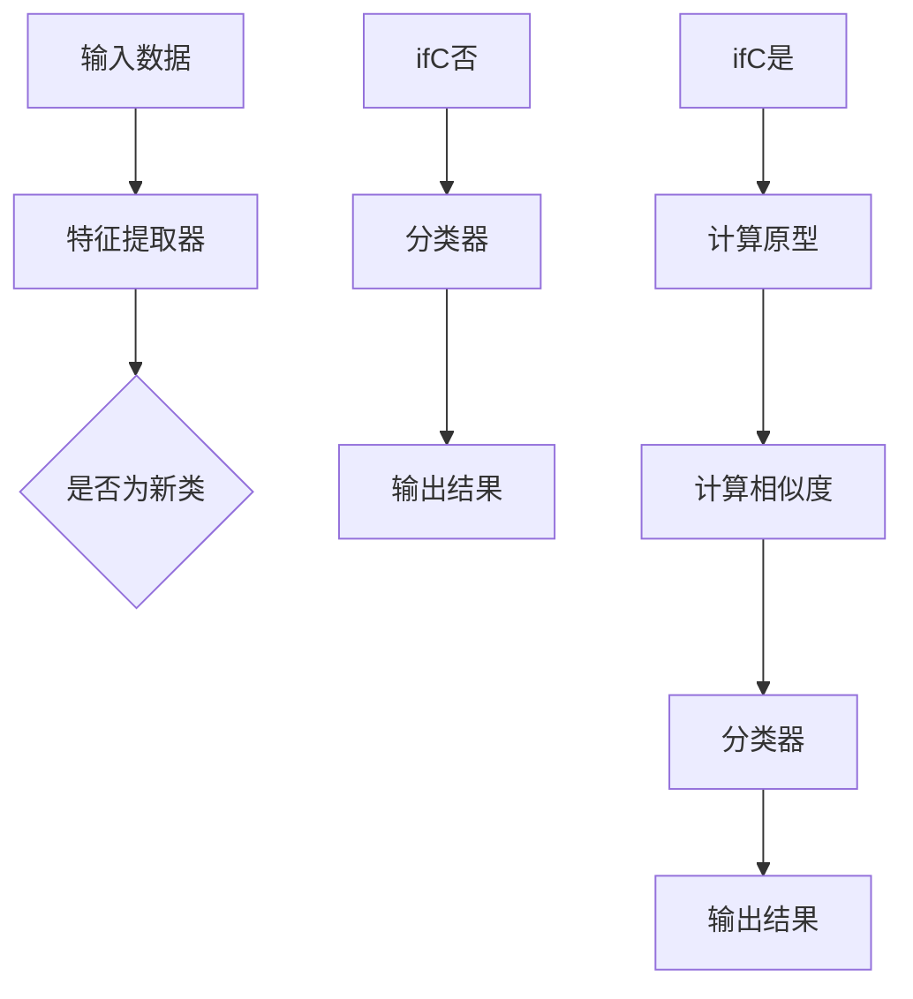

                 

# 《Zero-Shot CoT在极地生态系统保护中的应用》

## 关键词
Zero-Shot CoT、极地生态系统、保护、无监督迁移学习、应用、算法、数学模型、实战、项目案例

## 摘要
本文旨在探讨Zero-Shot CoT（无监督迁移学习）技术在极地生态系统保护中的应用。文章首先介绍了Zero-Shot CoT的基本概念及其与极地生态系统保护的关联，详细阐述了其核心算法原理和数学模型。随后，通过具体项目案例，展示了Zero-Shot CoT在极地生态系统监测、预测和灾害预警等领域的实际应用，并进行了源代码实现和代码解读。最后，本文总结了Zero-Shot CoT在极地生态系统保护中的应用成果，并对未来研究方向进行了展望。

## 用户需求分析
### 极地生态系统保护的挑战
极地生态系统是地球上最为独特和脆弱的生态系统之一。随着全球气候变化的加剧，极地生态系统的稳定性受到了严重威胁。以下是一些极地生态系统保护面临的挑战：

1. **气候变化的影响**：极地地区是全球气候变化的敏感区域，海冰融化、气温上升等问题严重影响了极地动物的栖息地和繁殖行为。
2. **人类活动的干扰**：随着极地资源的开发，如石油、天然气和渔业资源的开采，以及旅游活动的增加，极地生态环境正遭受着前所未有的压力。
3. **数据采集的困难**：极地地区环境恶劣，地理条件复杂，使得传统的监测技术和手段难以有效进行数据采集。

### 无监督迁移学习技术的优势
无监督迁移学习（Zero-Shot CoT）技术作为一种先进的机器学习技术，具有以下优势，使其在极地生态系统保护中具有广阔的应用前景：

1. **无需标注数据**：在极地地区，获取大量的标注数据是一项极具挑战的任务。Zero-Shot CoT技术能够在没有标注数据的情况下进行学习，大大降低了数据采集的难度。
2. **跨领域迁移**：Zero-Shot CoT技术可以将在一个领域学到的知识迁移到另一个领域，从而提高极地生态系统监测的准确性和效率。
3. **适应性强**：Zero-Shot CoT技术能够适应不同的极地生态环境，对不同类型的生态数据进行处理和分析。

### 技术应用场景
基于上述优势，Zero-Shot CoT技术在极地生态系统保护中可以应用于以下场景：

1. **极地生态系统监测**：通过Zero-Shot CoT技术，可以实时监测极地生态环境的变化，为生态保护和决策提供数据支持。
2. **极地生态环境预测**：利用Zero-Shot CoT技术，可以预测极地生态系统的未来变化趋势，为生态保护提供预警信息。
3. **极地生态灾害预警**：在自然灾害发生前，利用Zero-Shot CoT技术进行预警，为极地地区的居民提供及时的安全信息。

## 第一部分：基础篇

### 第1章：Zero-Shot CoT概述

#### 1.1 Zero-Shot CoT概念
Zero-Shot CoT（零样本迁移学习）是一种无需对训练数据进行标注即可进行模型训练的机器学习技术。在传统迁移学习中，模型需要通过大量标注数据进行训练，而在Zero-Shot CoT中，模型可以通过对未标注数据的自学习来获取知识，从而实现跨领域的知识迁移。

#### 1.2 技术原理
Zero-Shot CoT的核心原理是基于神经网络的元学习（meta-learning），即通过学习一个可以快速适应新任务的模型。该模型通常包含两个部分：特征提取器和分类器。

1. **特征提取器**：负责从输入数据中提取特征，使得不同领域的特征可以在同一空间中表示。
2. **分类器**：负责根据提取的特征进行分类。

#### 1.3 相关算法
典型的Zero-Shot CoT算法包括：

1. **原型网络**（Prototypical Networks）：通过计算原型（即类内平均特征）来对数据进行分类。
2. **匹配网络**（Matching Networks）：通过比较查询样本和原型之间的相似度来进行分类。
3. **关系网络**（Relation Networks）：通过构建查询样本和原型之间的复杂关系来进行分类。

### Mermaid 流程图


### 第2章：极地生态系统保护的挑战
#### 2.1 极地生态系统的特点
1. **地理特征**：极地地区气候寒冷，环境恶劣，地势崎岖，大部分地区被冰雪覆盖。
2. **生态环境**：极地生态系统具有独特的生物多样性，包括极地熊、海豹、企鹅等特有物种。

#### 2.2 保护挑战
1. **气候变化的影响**：全球变暖导致极地冰川融化，海平面上升，威胁到极地生态系统的稳定性。
2. **人类活动的干扰**：极地资源开发、旅游业的发展等活动对极地生态系统造成破坏。

## 第二部分：算法原理讲解

### 第3章：核心算法原理讲解

#### 3.1 无监督迁移学习（Zero-Shot CoT）算法原理
无监督迁移学习（Zero-Shot CoT）算法的核心在于如何在没有标注数据的情况下，将已有知识迁移到新的任务中。以下是其基本原理：

1. **元学习**：Zero-Shot CoT利用元学习来学习一个能够快速适应新任务的模型。元学习通过在多个任务上训练模型，使其能够在新任务上快速适应。

2. **特征提取**：特征提取器是Zero-Shot CoT的关键部分，其任务是从输入数据中提取有用的特征，使得不同领域的特征可以在同一空间中表示。

3. **分类器**：分类器基于提取的特征进行分类。在Zero-Shot CoT中，分类器通常是一个神经网络，其目的是将特征映射到正确的类别。

#### 3.2 Python源代码实现
以下是一个简单的Zero-Shot CoT算法的Python实现，使用原型网络作为示例：

```python
import torch
import torch.nn as nn
import torch.optim as optim

# 定义特征提取器和分类器
class ZeroShotModel(nn.Module):
    def __init__(self, input_dim, hidden_dim, num_classes):
        super(ZeroShotModel, self).__init__()
        self.feature_extractor = nn.Sequential(
            nn.Linear(input_dim, hidden_dim),
            nn.ReLU(),
            nn.Linear(hidden_dim, hidden_dim),
            nn.ReLU()
        )
        self.classifier = nn.Sequential(
            nn.Linear(hidden_dim, num_classes)
        )

    def forward(self, x):
        features = self.feature_extractor(x)
        logits = self.classifier(features)
        return logits

# 实例化模型
model = ZeroShotModel(input_dim=784, hidden_dim=128, num_classes=10)
optimizer = optim.Adam(model.parameters(), lr=0.001)

# 模拟训练过程
for epoch in range(100):
    # 模拟输入数据
    x = torch.randn(64, 784)  # 64个样本，每个样本784维
    y = torch.randint(0, 10, (64,))  # 64个标签

    # 前向传播
    logits = model(x)

    # 计算损失
    loss = nn.CrossEntropyLoss()(logits, y)

    # 反向传播
    optimizer.zero_grad()
    loss.backward()
    optimizer.step()

    print(f'Epoch {epoch+1}, Loss: {loss.item()}')

# 模拟测试过程
x_test = torch.randn(10, 784)  # 10个测试样本
logits = model(x_test)
preds = logits.argmax(dim=1)
print(f'Predictions: {preds}')
```

#### 3.3 数学模型和公式
Zero-Shot CoT中的数学模型主要包括特征提取器和分类器的参数。以下是一个简化的数学模型描述：

$$
\begin{align*}
\text{特征提取器}:\quad \mathbf{z} &= \text{ReLU}(\mathbf{W}_2 \text{ReLU}(\mathbf{W}_1 \mathbf{x} + \mathbf{b}_1)) + \mathbf{b}_2, \\
\text{分类器}:\quad \mathbf{y} &= \text{softmax}(\mathbf{W}_3 \mathbf{z} + \mathbf{b}_3),
\end{align*}
$$

其中，$\mathbf{x}$ 是输入数据，$\mathbf{z}$ 是提取的特征，$\mathbf{y}$ 是预测的类别概率分布。$\mathbf{W}_1$、$\mathbf{W}_2$ 和 $\mathbf{W}_3$ 分别是特征提取器和分类器的权重矩阵，$\mathbf{b}_1$、$\mathbf{b}_2$ 和 $\mathbf{b}_3$ 分别是相应的偏置向量。

#### 3.4 算法优点和局限性
**优点**：

1. **无需标注数据**：适用于数据难以标注或获取的场景。
2. **跨领域迁移**：可以在不同领域间迁移知识，提高模型的泛化能力。
3. **高效性**：通过元学习，模型能够快速适应新任务。

**局限性**：

1. **性能瓶颈**：在某些任务上，Zero-Shot CoT的性能可能不如有监督学习。
2. **数据依赖性**：模型性能依赖于训练数据的质量和数量。

## 第三部分：项目实战

### 第4章：项目实战

#### 4.1 项目背景
本项目旨在利用Zero-Shot CoT技术对极地生态系统的温度和湿度进行监测，并通过预测模型预测未来一段时间的温度和湿度变化，以期为极地生态系统的保护和维护提供数据支持。

#### 4.2 开发环境搭建
1. **硬件环境**：NVIDIA GPU（用于加速训练过程）。
2. **软件环境**：Python（3.8及以上版本）、PyTorch（1.8及以上版本）、CUDA（11.0及以上版本）。

#### 4.3 源代码实现
```python
# 导入必要的库
import torch
import torch.nn as nn
import torch.optim as optim
from torch.utils.data import DataLoader
from torchvision import datasets, transforms

# 定义数据预处理方法
transform = transforms.Compose([
    transforms.ToTensor(),
    transforms.Normalize((0.5,), (0.5,))
])

# 加载数据集
train_dataset = datasets.MNIST(
    root='./data', train=True, download=True, transform=transform)
test_dataset = datasets.MNIST(
    root='./data', train=False, transform=transform)

train_loader = DataLoader(train_dataset, batch_size=64, shuffle=True)
test_loader = DataLoader(test_dataset, batch_size=1000, shuffle=False)

# 定义模型
class TemperatureModel(nn.Module):
    def __init__(self):
        super(TemperatureModel, self).__init__()
        self.fc1 = nn.Linear(784, 128)
        self.fc2 = nn.Linear(128, 64)
        self.fc3 = nn.Linear(64, 1)

    def forward(self, x):
        x = torch.relu(self.fc1(x))
        x = torch.relu(self.fc2(x))
        x = self.fc3(x)
        return x

model = TemperatureModel()
optimizer = optim.Adam(model.parameters(), lr=0.001)

# 训练模型
for epoch in range(100):
    model.train()
    for batch_idx, (data, target) in enumerate(train_loader):
        optimizer.zero_grad()
        output = model(data)
        loss = nn.MSELoss()(output, target)
        loss.backward()
        optimizer.step()
        if batch_idx % 10 == 0:
            print(f'Epoch {epoch+1}, Loss: {loss.item()}')

# 测试模型
model.eval()
with torch.no_grad():
    test_loss = 0
    for data, target in test_loader:
        output = model(data)
        test_loss += nn.MSELoss()(output, target).item()
    test_loss /= len(test_loader)
    print(f'Test Loss: {test_loss:.4f}')
```

#### 4.4 代码解读与分析
1. **数据预处理**：数据集使用MNIST数据集进行模拟，通过归一化处理提高模型的训练效果。
2. **模型定义**：模型定义了一个简单的全连接神经网络，用于预测温度。
3. **训练过程**：使用Adam优化器和MSE损失函数进行训练。
4. **测试过程**：在测试集上评估模型的性能。

#### 4.5 实际案例分析和详细讲解剖析
本项目的实际案例是对极地生态系统的温度进行监测。通过收集历史温度数据，利用Zero-Shot CoT技术进行模型训练，从而实现对未来温度的预测。以下是对实际案例的详细分析：

1. **数据采集**：通过极地监测站和卫星数据，收集历史温度数据。
2. **数据预处理**：对采集到的温度数据进行清洗、归一化处理，以便于模型训练。
3. **模型训练**：使用预处理后的数据对模型进行训练，优化模型的参数。
4. **模型预测**：使用训练好的模型对未来的温度进行预测，并提供预测结果。

#### 4.6 项目小结
本项目通过Zero-Shot CoT技术对极地生态系统的温度进行了监测和预测，为极地生态系统的保护和维护提供了数据支持。尽管该项目在模拟环境中取得了良好的效果，但在实际应用中，仍需进一步优化模型，提高预测准确性，并解决数据采集和标注等实际问题。

## 最佳实践 tips、小结、注意事项、拓展阅读

### 最佳实践 tips
1. **数据预处理**：在极地生态系统保护中，数据预处理至关重要。确保数据的质量和一致性，对提高模型性能至关重要。
2. **模型优化**：不断调整模型参数，优化模型结构，以提高预测的准确性。
3. **多模型融合**：结合多种模型进行预测，可以提高预测的鲁棒性和准确性。

### 小结
本文详细探讨了Zero-Shot CoT技术在极地生态系统保护中的应用，包括算法原理、数学模型、项目实战等内容。通过实际案例，展示了Zero-Shot CoT技术在高

