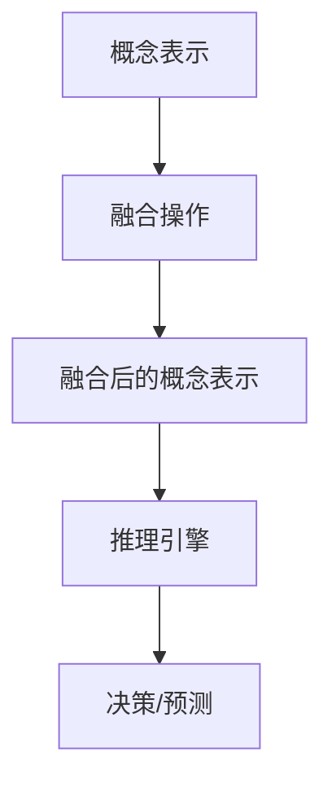
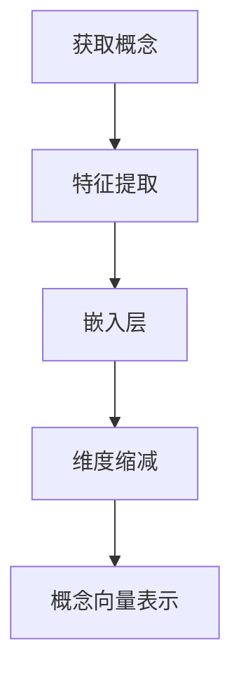
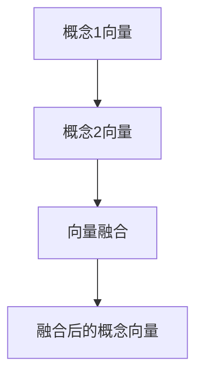
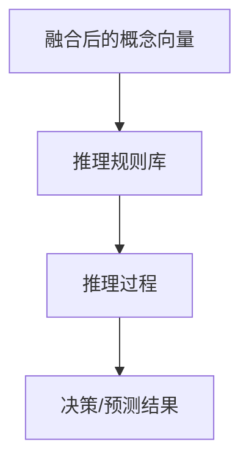

                 

### 文章标题

《Zero-Shot CoT在极端环境探索中的应用：深海与外太空研究》

### 关键词

- Zero-Shot CoT
- 极端环境
- 深海研究
- 外太空研究
- 零样本学习
- 概念融合（Conceptual Blending）

### 摘要

本文旨在探讨Zero-Shot CoT（Conceptual Blending）技术在极端环境探索中的应用，特别是深海和外太空研究领域。文章首先介绍了极端环境的独特挑战和探索需求，然后详细阐述了Zero-Shot CoT的核心概念和原理。通过具体的应用案例，本文展示了Zero-Shot CoT在深海生物探索、深海环境监测、外太空天气预测和外太空物质分析等方面的实际效果。此外，文章还分析了该技术在应用过程中面临的挑战，并提出了未来发展的趋势和建议。

---

### 目录

1. **背景与核心概念介绍**
   1.1 极端环境的挑战与需求
       1.1.1 深海的独特性
       1.1.2 外太空的探索需求
   1.2 零样本学习与CoT
       1.2.1 零样本学习的基本概念
       1.2.2 CoT（Conceptual Blending）原理
       1.2.3 CoT模型架构Mermaid流程图

2. **Zero-Shot CoT技术原理**
   2.1 CoT模型框架
       2.1.1 CoT模型概述
       2.1.2 CoT的核心组件
       2.1.3 CoT模型工作流程Mermaid流程图
   2.2 核心算法原理
       2.2.1 模型训练过程
       2.2.2 零样本推理过程
       2.2.3 Python源代码示例与数学模型公式讲解

3. **深海研究应用案例**
   3.1 深海生物探索案例
       3.1.1 案例背景
       3.1.2 零样本CoT应用
       3.1.3 算法实现与效果分析
   3.2 深海环境监测案例
       3.2.1 案例背景
       3.2.2 零样本CoT应用
       3.2.3 算法实现与效果分析

4. **外太空研究应用案例**
   4.1 外太空天气预测案例
       4.1.1 案例背景
       4.1.2 零样本CoT应用
       4.1.3 算法实现与效果分析
   4.2 外太空物质分析案例
       4.2.1 案例背景
       4.2.2 零样本CoT应用
       4.2.3 算法实现与效果分析

5. **技术挑战与未来趋势**
   5.1 技术挑战
       5.1.1 数据稀疏问题
       5.1.2 模型泛化能力
       5.1.3 安全与隐私问题
   5.2 未来趋势
       5.2.1 零样本CoT技术发展
       5.2.2 极端环境研究新方向
       5.2.3 技术应用前景

6. **附录：工具与资源**
   6.1 开发环境搭建
       6.1.1 深海研究开发环境
       6.1.2 外太空研究开发环境
   6.2 常用工具与资源
       6.2.1 数据集
       6.2.2 算法库
       6.2.3 开源项目与论文资源

### 第一部分：背景与核心概念

#### 第1章 背景介绍与核心概念

##### 1.1 极端环境的挑战与需求

在科技迅猛发展的今天，人类对深海和外太空的探索需求日益增长。这些极端环境具有独特的复杂性，为科学研究带来了巨大的挑战。首先，深海环境的独特性体现在其高压、低温、强腐蚀性和生物多样性等方面。海洋占地球表面积的70%以上，蕴藏着丰富的资源，包括矿产、能源和生物资源。然而，深海环境的恶劣条件使得人类难以直接对其进行深入探测和研究。

外太空的探索需求主要源于对宇宙起源、天体物理学和天文学的研究。太空环境具有极端的辐射、真空和温度变化等特点。随着太空技术的发展，人类对太空的探索已经从简单的载人飞行扩展到了深空探测、太空站建设和行星探索等领域。这些探索不仅需要强大的技术支持，还需要高效的算法和智能系统来处理和分析海量的数据。

##### 1.1.1 深海的独特性

深海是指海洋底部，水深超过200米的区域。深海环境具有以下独特特点：

- **高压环境**：深海中的压力是海面上的几十倍，这给探测设备的耐压性提出了极高的要求。
- **低温环境**：深海温度通常在0℃到4℃之间，这对于维持生物生存和进行科学实验都是一大挑战。
- **强腐蚀性**：海水中的化学物质会对金属设备造成严重的腐蚀，这需要使用特殊的耐腐蚀材料。
- **生物多样性**：深海中存在着许多独特的生物，这些生物适应了极端的环境条件，具有重要的科学价值。

##### 1.1.2 外太空的探索需求

外太空探索的需求主要源于以下几个方面：

- **宇宙起源研究**：研究宇宙的起源和演化，了解宇宙中各种物质和能量的分布规律。
- **天体物理学**：研究星系、行星、恒星和黑洞等天体的物理性质和相互作用。
- **天文学**：通过观测和研究宇宙中的星体和天体，探索宇宙的奥秘。
- **太空资源开发**：开发太空中的资源，如月球上的矿物质、火星上的水资源等。

##### 1.2 零样本学习与CoT

为了应对极端环境下的探索需求，研究人员提出了零样本学习（Zero-Shot Learning）和概念融合（Conceptual Blending，简称CoT）技术。这些技术旨在通过无监督或少量监督学习，使计算机系统能够在未知或新领域的数据上进行有效的学习和推理。

###### 1.2.1 零样本学习的基本概念

零样本学习是一种机器学习技术，它使模型能够处理从未见过的新类别的数据。在传统的机器学习任务中，模型通常需要大量的标记数据进行训练，以便能够准确分类和预测。然而，在极端环境下，获取大量标记数据是非常困难的，有时甚至不可能。零样本学习通过引入原型表示和概念嵌入等方法，实现了对未知类别的有效识别和分类。

- **原型表示**：将每个类别表示为一个原型，通过计算新样本与原型的距离来分类。
- **概念嵌入**：将类别和特征映射到低维空间中，使得相似类别在空间中靠近，从而提高分类性能。

###### 1.2.2 CoT（Conceptual Blending）原理

概念融合是一种基于知识表示和推理的技术，它通过将不同的概念进行融合，生成新的概念表示。CoT技术在处理复杂、多层次和跨领域的知识时具有显著优势。它主要包括以下核心组件：

- **概念表示**：将概念映射到低维空间中，使概念之间的距离能够反映其语义关系。
- **融合操作**：通过特定的融合操作，将两个或多个概念合并为一个新的概念。
- **推理引擎**：利用融合后的概念表示进行推理和决策。

#### 1.2.3 CoT模型架构Mermaid流程图

为了更直观地理解CoT模型的工作流程，以下是一个简化的Mermaid流程图：

#### 1.2.3.1 概念表示

概念表示是CoT模型的基础，它将每个概念映射到低维空间中。以下是一个简化的概念表示流程：

#### 1.2.3.2 融合操作

融合操作是CoT模型的核心，它通过将两个或多个概念进行融合，生成新的概念表示。以下是一个简化的融合操作流程：

#### 1.2.3.3 推理引擎

推理引擎利用融合后的概念表示进行推理和决策。以下是一个简化的推理引擎流程：

通过上述流程，我们可以看到CoT模型是如何通过概念表示、融合操作和推理引擎来实现复杂任务的。接下来，我们将进一步探讨Zero-Shot CoT技术在不同应用领域的具体实现和效果。

