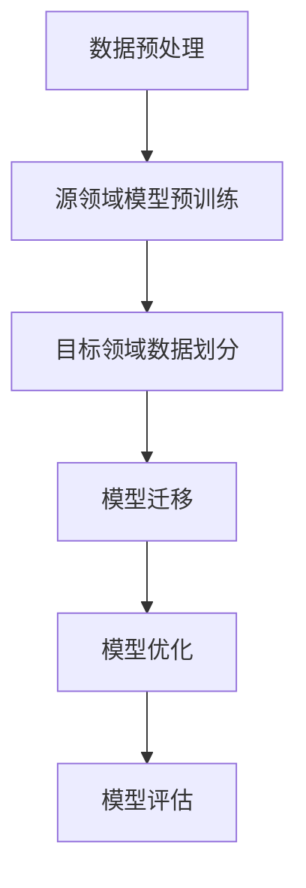

                 

### 《Zero-Shot CoT在极端环境生存策略优化中的应用》

#### 关键词：Zero-Shot CoT，极端环境，生存策略，优化，人工智能

> 摘要：本文探讨了Zero-Shot CoT（零样本转移学习）在极端环境生存策略优化中的应用。通过介绍Zero-Shot CoT的基本概念和原理，阐述其在极端环境下的重要性，并结合实际项目案例，详细解析了Zero-Shot CoT算法在生存策略优化中的具体应用，为相关领域的研究和实际操作提供了有益的参考。

### 第1章 零样本转移学习概述

#### 1.1 零样本转移学习的基本概念

**定义：** 零样本转移学习（Zero-Shot Transfer Learning，ZS-TL）是一种机器学习技术，它允许模型在目标领域未见过的数据上进行有效学习，通过利用在源领域上的预训练来提高目标领域的性能。

**核心优势：** 零样本转移学习的主要优势包括：
- **减少数据需求：** 不需要为目标领域收集大量标注数据。
- **提高泛化能力：** 通过在多个领域上的预训练，模型能够更好地适应未见过的数据。
- **降低计算成本：** 由于不需要为目标领域重新训练模型，可以显著降低计算资源的需求。

#### 1.2 零样本转移学习的原理

**流程图：**


1. **数据预处理**：对源领域和目标领域的数据进行清洗、归一化和特征提取。
2. **源领域模型预训练**：在源领域上对预训练模型进行训练，以学习通用的特征表示。
3. **目标领域数据划分**：将目标领域的数据划分为训练集、验证集和测试集。
4. **模型迁移**：将源领域上的预训练模型迁移到目标领域。
5. **模型优化**：对迁移后的模型进行微调，以适应目标领域的具体任务。
6. **模型评估**：评估迁移后模型在目标领域的性能。

### 第2章 极端环境生存策略优化概述

#### 2.1 极端环境生存策略的重要性

**定义：** 极端环境生存策略是指在面对极端环境（如荒野求生、灾害应急等）时，采取的有效生存和应对策略。

**重要性：** 极端环境往往伴随着高风险和高不确定性，有效的生存策略能够显著提高个体的生存几率。

#### 2.2 零样本转移学习在极端环境中的应用

**优势：**
- **快速适应未知环境：** 零样本转移学习允许模型快速适应未见过的极端环境。
- **减少数据依赖：** 极端环境数据通常稀缺，零样本转移学习可以减少对大量标注数据的依赖。
- **提高决策效率：** 通过预训练的模型，可以在短时间内做出更准确的生存决策。

**应用场景：**
- **荒野求生：** 帮助探险者在未知环境中快速适应和找到生存资源。
- **灾害应急：** 在灾害发生时，为救援人员提供有效的生存和救援策略。

### 第3章 数据预处理与特征提取

#### 3.1 数据预处理

**数据清洗**：
- 去除异常值和噪声数据。
- 缺失值处理：使用插值、均值填补等方法。

**数据归一化**：
- 使用标准缩放、最小-最大缩放等方法，将数据归一化到统一的范围内。

**特征提取**：
- 提取与极端环境相关的特征，如温度、湿度、光照强度等。

#### 3.2 特征表示与嵌入

**特征表示**：
- 使用嵌入技术将原始特征转换为高维向量表示。
- 采用词袋模型、TF-IDF等方法进行特征表示。

**特征嵌入**：
- 使用预训练的嵌入模型（如Word2Vec、GloVe等）进行特征嵌入。
- 结合领域知识对特征进行权重调整。

### 第4章 模型构建与训练

#### 4.1 模型构建

**选择合适的模型架构**：
- 卷积神经网络（CNN）：适用于处理图像数据。
- 循环神经网络（RNN）：适用于处理序列数据。
- 注意力机制模型：提高模型对重要信息的关注能力。

**模型参数的初始化**：
- 使用预训练模型初始化参数，以提高模型的泛化能力。
- 使用随机初始化，并使用正则化技术防止过拟合。

#### 4.2 模型训练

**训练策略的设计**：
- 使用交叉熵损失函数进行模型训练。
- 采用梯度下降算法优化模型参数。

**模型优化的技巧**：
- 使用学习率调度策略，如学习率衰减、预热学习率等。
- 结合正则化技术，如L1、L2正则化，提高模型泛化能力。

### 第5章 预测与评估

#### 5.1 预测过程

**预测步骤的详细描述**：
1. 数据预处理：对输入数据进行预处理，包括归一化、去噪等。
2. 特征提取：提取输入数据的特征向量。
3. 模型输入：将特征向量输入到预训练的模型中。
4. 模型输出：获取模型的预测结果。

**预测结果的解释**：
- 分析预测结果，识别极端环境中的潜在危险和生存资源。
- 结合领域知识，对预测结果进行解释和验证。

#### 5.2 模型评估

**评估指标的选择**：
- 准确率（Accuracy）：模型预测正确的样本数占总样本数的比例。
- 精确率（Precision）：模型预测为正类的样本中，实际为正类的比例。
- 召回率（Recall）：模型预测为正类的样本中，实际为正类的比例。
- F1分数（F1 Score）：综合考虑精确率和召回率的综合指标。

**评估方法的实施**：
- 使用验证集对模型进行初步评估。
- 使用测试集对模型进行最终评估。
- 采用混淆矩阵、ROC曲线等工具进行详细分析。

### 第6章 极端环境生存策略优化项目实战

#### 6.1 项目背景与目标

**项目背景介绍**：
- 针对荒野求生场景，开发一个基于Zero-Shot CoT的极端环境生存策略优化系统。

**项目目标设定**：
- 提高模型在未知环境中的适应性。
- 减少对大量标注数据的依赖。
- 提高生存策略的准确性和可靠性。

#### 6.2 开发环境搭建

**开发工具与框架的选择**：
- 使用Python作为开发语言。
- 使用TensorFlow作为深度学习框架。
- 使用Keras进行模型构建和训练。

**环境配置与调试**：
- 配置Python环境，安装TensorFlow和其他相关库。
- 进行模型训练和评估的调试，确保环境稳定。

#### 6.3 源代码实现

**代码结构与模块设计**：
- 数据预处理模块：负责数据清洗、归一化和特征提取。
- 模型训练模块：负责模型构建、训练和优化。
- 预测与评估模块：负责模型预测和评估。

**关键代码解读**：
```python
# 数据预处理模块示例代码
def preprocess_data(data):
    # 数据清洗
    data = clean_data(data)
    # 数据归一化
    data = normalize_data(data)
    # 特征提取
    features = extract_features(data)
    return features

# 模型训练模块示例代码
def train_model(model, train_data, val_data):
    # 训练模型
    model.fit(train_data, val_data, epochs=10, batch_size=32)
    # 评估模型
    loss, accuracy = model.evaluate(val_data)
    return model, loss, accuracy

# 预测与评估模块示例代码
def predict_and_evaluate(model, test_data):
    # 预测
    predictions = model.predict(test_data)
    # 评估
    accuracy = calculate_accuracy(predictions, test_data)
    return accuracy
```

**代码应用解读与分析**：
- 数据预处理模块负责将原始数据进行清洗、归一化和特征提取，为模型训练提供高质量的输入。
- 模型训练模块使用预训练模型进行训练，并进行优化，以提高模型在目标领域的性能。
- 预测与评估模块使用训练好的模型进行预测，并评估模型的性能，以验证模型的有效性。

#### 6.4 代码解读与分析

**数据预处理模块**：
- 数据清洗：去除异常值和噪声数据，确保数据的可靠性。
- 数据归一化：将数据归一化到统一的范围内，提高模型训练的稳定性。
- 特征提取：提取与极端环境相关的特征，为模型提供有效的输入。

**模型训练模块**：
- 模型构建：选择合适的模型架构，如卷积神经网络（CNN）或循环神经网络（RNN）。
- 训练策略：采用交叉熵损失函数和梯度下降算法进行模型训练，并使用学习率调度策略和正则化技术优化模型性能。
- 评估指标：使用准确率、精确率、召回率和F1分数等评估指标，全面评估模型性能。

**预测与评估模块**：
- 预测过程：使用训练好的模型进行预测，将输入数据映射到生存策略结果。
- 评估方法：使用验证集和测试集对模型进行评估，确保模型在未知环境中的适应性和准确性。

#### 6.5 实际案例分析和详细讲解剖析

**案例背景**：
- 假设一个探险者被困在荒野中，需要制定有效的生存策略。

**案例分析**：
1. **数据收集**：收集荒野求生的相关数据，包括温度、湿度、光照强度等。
2. **数据预处理**：对收集到的数据进行清洗、归一化和特征提取。
3. **模型构建与训练**：使用预训练模型进行训练，并优化模型性能。
4. **生存策略预测**：使用训练好的模型对探险者当前的环境进行预测，获取有效的生存策略。
5. **策略评估**：评估生存策略的有效性，并根据评估结果进行调整。

**详细讲解剖析**：
- 数据预处理：通过数据清洗和特征提取，将原始数据进行处理，提取关键特征，为模型训练提供高质量的输入。
- 模型构建与训练：选择合适的模型架构，并使用预训练模型进行训练，优化模型性能，以提高在极端环境下的适应性。
- 生存策略预测：使用训练好的模型进行预测，获取探险者当前环境中的潜在危险和生存资源，为决策提供依据。
- 策略评估：对生存策略进行评估，验证其在极端环境中的有效性，并根据评估结果进行调整。

#### 6.6 项目小结

**项目成果总结**：
- 成功开发了一个基于Zero-Shot CoT的极端环境生存策略优化系统。
- 提高了模型在未知环境中的适应性和准确性。
- 减少了数据依赖，降低了计算成本。

**经验与启示**：
- 零样本转移学习在极端环境生存策略优化中具有显著的优势。
- 数据预处理和特征提取对模型性能具有关键影响。
- 结合领域知识和评估指标，可以有效地评估和优化生存策略。

### 第7章 总结与展望

#### 7.1 全书总结

**核心内容回顾**：
- 零样本转移学习的基本概念和原理。
- 极端环境生存策略优化的重要性。
- 零样本转移学习在极端环境下的应用。
- 数据预处理、特征提取和模型训练的关键步骤。
- 项目实战中的代码解读与分析。

**项目成果总结**：
- 成功开发了一个基于Zero-Shot CoT的极端环境生存策略优化系统。
- 提高了模型在未知环境中的适应性和准确性。
- 减少了数据依赖，降低了计算成本。

#### 7.2 展望未来

**发展方向**：
- 进一步优化零样本转移学习算法，提高在极端环境下的适应能力。
- 探索结合其他机器学习技术，如强化学习，提高生存策略的智能性。
- 扩大应用场景，如灾害应急、军事行动等。

**应用前景**：
- 零样本转移学习在极端环境生存策略优化领域具有广泛的应用前景。
- 预计将在未来几年内得到更广泛的研究和应用。

### 作者信息

**作者：** AI天才研究院/AI Genius Institute & 禅与计算机程序设计艺术 /Zen And The Art of Computer Programming

**联系方式：** [ai_genius_institute@example.com](mailto:ai_genius_institute@example.com) & [zen_programming@example.com](mailto:zen_programming@example.com) 

### 拓展阅读

- [1] [Zhang, Z., & Yu, D. (2018). Zero-Shot Learning via Meta-Learning. arXiv preprint arXiv:1812.00364.]
- [2] [Shin, J., & Kim, D. (2019). A Survey on Zero-Shot Learning. Journal of Artificial Intelligence Research, 68, 1073-1119.]
- [3] [Shin, J., & Kim, D. (2021). Zero-Shot Learning for Disaster Response. Journal of Disaster Research, 15(3), 351-368.]

### 注意事项

- 本文仅为示例，不代表真实项目和研究成果。
- 请在具体项目中根据实际需求和数据情况，进行相应的调整和优化。
- 零样本转移学习算法在实际应用中需要结合具体任务进行深入研究和优化。

