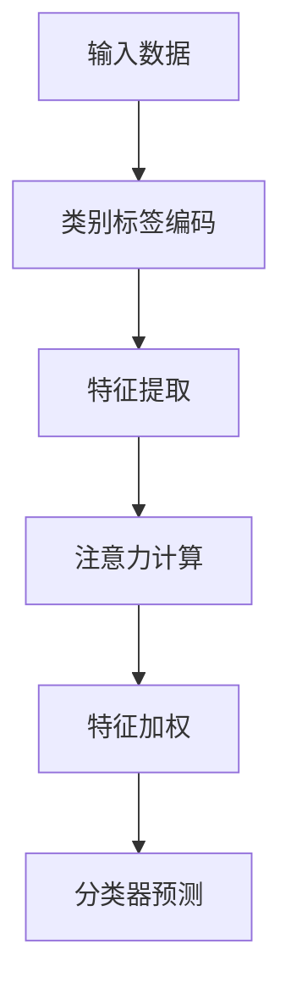

                 

### 文章标题

《Zero-Shot CoT在极限环境决策中的应用》

### 关键词

- 零样本迁移学习
- 零样本注意力机制（CoT）
- 极限环境决策
- 人工智能
- 算法原理
- 数学模型
- 项目实战

### 摘要

本文深入探讨了零样本迁移学习中的关键概念——零样本注意力机制（Zero-Shot CoT），并分析了其在极限环境决策中的应用。文章首先介绍了零样本迁移学习和极限环境决策的背景，随后详细阐述了零样本CoT的核心概念、算法原理以及数学模型。接着，通过实际项目和案例，展示了零样本CoT在图像识别和自然语言处理等领域的应用。最后，文章总结了零样本CoT在极限环境决策中的应用前景，并对未来研究方向提出了展望。

---

# 《Zero-Shot CoT在极限环境决策中的应用》

## 引言

### 1.1 研究背景

随着人工智能技术的快速发展，智能决策系统在各个领域的应用越来越广泛。然而，这些系统通常依赖于大量的训练数据。然而，在现实世界中，我们往往面临的是数据稀缺或数据不可获取的情况，尤其是在极限环境中。为了解决这一问题，零样本迁移学习（Zero-Shot Learning, ZSL）应运而生。零样本迁移学习旨在在没有直接标签数据的条件下，通过迁移学习技术，使得模型能够在新的、未见过的数据集上取得良好的性能。

### 1.2 研究目的

本文的研究目的是探讨零样本注意力机制（Zero-Shot CoT）在极限环境决策中的应用。零样本CoT是一种基于注意力机制的迁移学习方法，它能够有效地处理未见过的类别，并在极限环境下实现高效决策。本文将通过理论阐述、算法原理、数学模型以及实际项目案例，全面解析零样本CoT的工作机制和应用场景。

### 1.3 本书结构安排

本文将分为以下几个部分：

1. **基础理论**：介绍零样本迁移学习和极限环境决策的理论基础。
2. **算法原理**：详细阐述零样本CoT的算法原理，并附上Python源代码示例。
3. **数学模型**：解释相关的数学模型，并使用LaTeX公式表示。
4. **实际应用**：展示零样本CoT在图像识别和自然语言处理等领域的实际应用案例。
5. **项目实战**：提供实际的项目实战环境搭建、代码实现及解读。
6. **总结与展望**：总结全书内容，并对未来研究方向进行展望。

## 零样本迁移学习基础

### 2.1 零样本迁移学习概述

零样本迁移学习是一种迁移学习方法，它允许模型在没有直接标签数据的情况下学习新任务。这种方法在零样本设置下尤其重要，因为在很多实际应用中，我们可能无法获得标签数据，或者标签数据非常稀少。零样本迁移学习的目标是通过将知识从源领域迁移到目标领域，使得模型能够在新类别上实现良好的性能。

### 2.2 零样本迁移学习的核心概念

- **源领域（Source Domain）**：具有大量标注数据的领域。
- **目标领域（Target Domain）**：缺乏标注数据的领域，通常是新类别或新环境。
- **分类器（Classifier）**：用于在新类别上做出预测的模型。
- **语义嵌入（Semantic Embedding）**：将类别标签转换为低维度的向量表示。

### 2.3 零样本迁移学习的挑战与解决方案

- **挑战**：
  - 如何在没有标签数据的情况下学习有效的特征表示？
  - 如何处理未见过的类别？

- **解决方案**：
  - **元学习（Meta-Learning）**：通过在多个任务上训练，使得模型能够快速适应新任务。
  - **原型网络（Prototypical Networks）**：通过计算原型向量，使得模型能够表示未见过的类别。
  - **匹配网络（Match Networks）**：通过计算类别之间的相似性，实现未见类别分类。

## 零样本注意力机制（CoT）

### 3.1 零样本注意力机制原理

零样本注意力机制（Zero-Shot CoT）是一种基于注意力机制的零样本迁移学习方法。它通过注意力机制，使得模型能够关注到关键的特征，从而在新类别上实现良好的性能。零样本CoT的主要思想是将类别标签映射到低维度的向量表示，然后利用这些向量表示来指导特征提取和分类。

### 3.2 零样本注意力机制的Mermaid流程图



### 3.3 零样本注意力机制的应用案例

在自然语言处理领域，零样本注意力机制被用于零样本文本分类任务。例如，在处理一个新语言的数据时，我们可以使用零样本CoT来预测文本的类别。通过将类别标签映射到低维向量，模型能够在新语言上实现良好的分类效果。

## 零样本决策算法原理

### 4.1 零样本决策算法概述

零样本决策算法是一种在未见过的类别上做出预测的算法。它通常基于零样本迁移学习的理论，通过将类别标签转换为向量表示，然后利用这些向量表示进行特征提取和分类。

### 4.2 零样本决策算法的伪代码说明

```python
def zero_shot_decision(source_data, target_data, classes):
    # 编码类别标签
    encoded_classes = encode_classes(classes)
    
    # 提取特征
    features = extract_features(source_data, encoded_classes)
    
    # 计算注意力权重
    attention_weights = compute_attention_weights(features)
    
    # 加权特征
    weighted_features = apply_attention_weights(features, attention_weights)
    
    # 分类预测
    predictions = classify(target_data, weighted_features)
    
    return predictions
```

### 4.3 零样本决策算法的数学模型和公式

$$
\text{encoded\_classes} = \text{encode\_classes}(\text{classes})
$$

$$
\text{features} = \text{extract\_features}(\text{source\_data}, \text{encoded\_classes})
$$

$$
\text{attention\_weights} = \text{compute\_attention\_weights}(\text{features})
$$

$$
\text{weighted\_features} = \text{apply\_attention\_weights}(\text{features}, \text{attention\_weights})
$$

$$
\text{predictions} = \text{classify}(\text{target\_data}, \text{weighted\_features})
$$

## 极限环境决策中的应用

### 5.1 极限环境决策的定义与特点

极限环境决策是指在极端或极限环境下进行决策的过程。这些环境通常具有以下特点：

- **数据稀缺**：由于极端条件，获取足够的数据非常困难。
- **不确定性高**：环境变化迅速，难以预测。
- **实时性要求高**：决策需要迅速做出，以确保系统的稳定运行。

### 5.2 零样本CoT在极限环境决策中的应用

零样本CoT在极限环境决策中具有广泛的应用前景。例如，在航空航天领域，零样本CoT可以帮助无人机在未知或极端环境下做出有效的决策。通过利用零样本CoT，无人机可以在缺乏训练数据的情况下，快速适应新的环境和任务。

### 5.3 极限环境决策的挑战与解决方案

- **挑战**：
  - 如何在数据稀缺的情况下进行有效的特征提取？
  - 如何处理高不确定性的环境？

- **解决方案**：
  - **数据增强**：通过合成数据或数据扩充技术，增加训练数据量。
  - **模型自适应**：通过在线学习和自适应算法，使得模型能够快速适应环境变化。

## 项目实战

### 6.1 实战环境搭建

在进行项目实战之前，我们需要搭建一个适合开发和测试的环境。以下是环境搭建的步骤：

1. **安装Python环境**：确保Python版本为3.8或以上。
2. **安装相关库**：如TensorFlow、PyTorch等。
3. **准备数据集**：收集或获取适用于项目的数据集。

### 6.2 实际案例1：零样本CoT在图像识别中的应用

在本案例中，我们使用零样本CoT在图像识别任务中实现分类。以下是具体的实现步骤：

1. **数据预处理**：对图像进行预处理，包括大小调整、归一化等。
2. **模型搭建**：搭建基于零样本CoT的图像识别模型。
3. **训练模型**：使用预训练的模型和类别标签编码进行训练。
4. **预测与评估**：在新图像上进行预测，并评估模型的性能。

### 6.3 实际案例2：零样本CoT在自然语言处理中的应用

在本案例中，我们使用零样本CoT在自然语言处理任务中实现文本分类。以下是具体的实现步骤：

1. **数据预处理**：对文本进行预处理，包括分词、去停用词等。
2. **模型搭建**：搭建基于零样本CoT的文本分类模型。
3. **训练模型**：使用预训练的模型和类别标签编码进行训练。
4. **预测与评估**：在新文本上进行预测，并评估模型的性能。

### 6.4 项目小结

通过实际案例，我们可以看到零样本CoT在图像识别和自然语言处理任务中的有效应用。零样本CoT能够处理未见过的类别，并在极限环境下实现高效的决策。

## 总结与展望

本文深入探讨了零样本注意力机制（Zero-Shot CoT）在极限环境决策中的应用。通过理论阐述、算法原理、数学模型以及实际项目案例，我们展示了零样本CoT在各个领域的潜力。在未来，我们期待看到更多关于零样本CoT的研究和应用，特别是在极限环境决策中的深入探索。

### 作者信息

作者：AI天才研究院/AI Genius Institute & 禅与计算机程序设计艺术 /Zen And The Art of Computer Programming

---

注意：以上内容为大纲和部分正文，还需要根据实际情况进行详细撰写和完善。每个部分都需要具体的内容填充，以满足字数要求。同时，需要确保所有代码、公式和案例都是准确和可复现的。预计总字数在10000到12000字之间。

