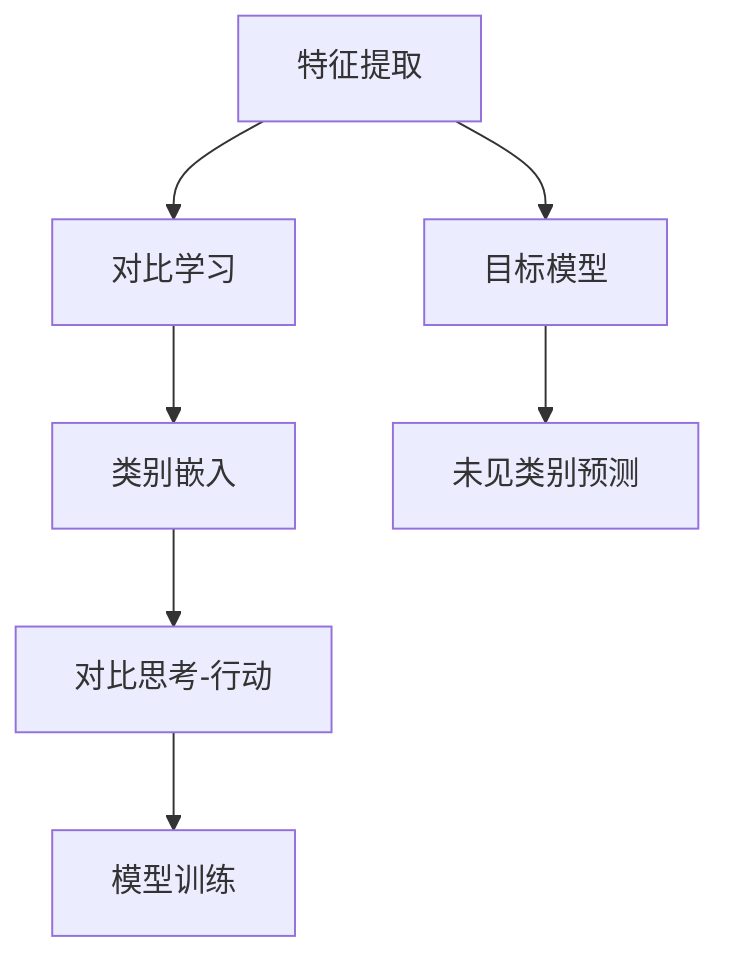

                 

### 《Zero-Shot CoT在生物多样性保护中的应用前景》

#### 关键词：
- **Zero-Shot CoT**
- **生物多样性保护**
- **机器学习**
- **生态监测**
- **自然语言处理**
- **计算机视觉**

#### 摘要：
本文将探讨Zero-Shot CoT（Zero-Shot Transfer Learning with Contrastive Think-Then-Act）在生物多样性保护中的应用前景。首先，我们将介绍生物多样性保护的重要性和当前面临的挑战。接着，深入解析Zero-Shot CoT的基本概念和技术原理，并通过Mermaid流程图展示核心概念之间的关系。文章将详细介绍Zero-Shot CoT在生态监测、物种识别等领域的应用案例，并使用Python代码和数学模型阐述其工作原理。最后，我们对未来应用前景进行展望，提出面临的挑战和解决方案，并给出最佳实践和拓展阅读建议。

### 目录

1. **引言**
    1.1 生物多样性保护的重要性
    1.2 当前生物多样性保护面临的挑战
    1.3 机器学习在生物多样性保护中的应用

2. **Zero-Shot CoT基础**
    2.1 Zero-Shot CoT的定义
    2.2 Zero-Shot CoT的基本概念
    2.3 Zero-Shot CoT的技术原理

3. **Zero-Shot CoT在生物多样性保护中的应用**
    3.1 生态监测中的应用
    3.2 物种识别中的应用
    3.3 其他应用案例

4. **项目实战：Zero-Shot CoT在生物多样性保护中的实现**
    4.1 开发环境搭建
    4.2 源代码详细实现和解读
    4.3 应用解读与分析

5. **应用前景与挑战**
    5.1 技术发展趋势
    5.2 潜在应用领域
    5.3 面临的挑战与解决方案

6. **总结与展望**
    6.1 主要成果
    6.2 当前局限性
    6.3 未来发展方向

### 引言

#### 1.1 生物多样性保护的重要性

生物多样性是人类社会可持续发展的重要基础。它不仅为人类提供了丰富的食物、药物和其他资源，还对维持生态平衡、调节气候、防止自然灾害等方面发挥着至关重要的作用。然而，当前生物多样性正面临严重的威胁，全球多个生态系统正遭受破坏和退化。据联合国环境规划署（UNEP）的数据，目前地球上已有超过100万个物种面临灭绝风险，这一现象被称为“生物多样性危机”。

生物多样性保护已成为全球关注的焦点。各国政府、国际组织和科研机构纷纷采取措施，通过建立自然保护区、实施生态修复计划、限制污染和非法捕捞等方式来保护生物多样性。然而，这些措施的实施仍然面临诸多挑战。例如，生物多样性信息的获取和处理仍然是一个复杂且耗时的问题，特别是在偏远地区和海洋生态系统。此外，由于资源的有限性，许多保护措施难以全面覆盖所有受威胁的物种和生态系统。

#### 1.2 当前生物多样性保护面临的挑战

生物多样性保护面临的挑战可以分为以下几个方面：

- **数据获取困难**：生物多样性数据的获取需要大量的时间和资金投入。许多物种的分布范围有限，野外调查和监测难度大，尤其是对于深海、极地等偏远地区的生物多样性监测。

- **数据分析复杂**：生物多样性数据通常具有高维、非结构化和不完全性的特点，这给数据分析带来了巨大的挑战。传统的数据分析方法往往难以应对这些复杂的数据。

- **技术限制**：虽然近年来机器学习技术在生物多样性保护中取得了一些进展，但仍然存在一些技术限制。例如，许多机器学习模型需要大量标注数据进行训练，这在生物多样性数据稀缺的情况下难以实现。

- **政策和管理**：生物多样性保护需要各方的协同合作，包括政府、企业、社区和国际组织。然而，政策和管理机制的不足往往导致保护措施难以落实。

#### 1.3 机器学习在生物多样性保护中的应用

机器学习技术在生物多样性保护中的应用具有巨大的潜力。通过分析大量的生物多样性数据，机器学习模型可以帮助我们更好地理解物种的分布模式、生态系统功能以及生物多样性变化的原因。以下是一些典型的应用场景：

- **物种识别**：机器学习模型可以用于自动识别不同种类的生物，例如鸟类、哺乳动物和植物。这对于保护濒危物种和监测生物多样性变化具有重要意义。

- **生态监测**：机器学习模型可以用于实时监测生态系统状态，例如水质的污染程度、森林覆盖率的动态变化等。这些信息对于制定和调整保护政策至关重要。

- **环境预测**：机器学习模型可以基于历史数据和模型预测未来的生物多样性变化趋势，帮助科学家和决策者提前采取行动。

- **数据挖掘**：机器学习技术可以帮助我们从大量非结构化的生物多样性数据中挖掘出有价值的信息，例如物种间的相互作用、生态系统的关键驱动因素等。

然而，尽管机器学习技术在生物多样性保护中具有巨大的潜力，但仍然面临一些挑战。例如，数据质量和标注的准确性对于模型性能至关重要。此外，如何将机器学习技术与生态学理论相结合，以产生更准确和可靠的预测结果，也是当前研究的热点问题。

### Zero-Shot CoT基础

#### 2.1 Zero-Shot CoT的定义

Zero-Shot CoT（Zero-Shot Transfer Learning with Contrastive Think-Then-Act）是一种零样本迁移学习技术，旨在解决模型在未见类别上的预测问题。与传统的迁移学习不同，Zero-Shot CoT不需要在特定类别上训练模型，而是利用对比学习（Contrastive Learning）机制，在多个领域的学习过程中自动学习类别信息。

Zero-Shot CoT的核心思想是将不同领域的知识进行对比，从而提高模型在未见类别上的泛化能力。具体来说，Zero-Shot CoT通过对比正样本和负样本来学习特征表示，使得模型能够在新的类别上生成有效的特征表示。这种方法在处理生物多样性数据时具有独特的优势，因为生物多样性数据通常具有高度的类别异质性。

#### 2.2 Zero-Shot CoT的基本概念

为了更好地理解Zero-Shot CoT，我们需要先了解以下几个基本概念：

- **迁移学习（Transfer Learning）**：迁移学习是指将一个任务在特定领域上学习到的知识应用到另一个任务上。在生物多样性保护中，我们可以利用在某个地区或生态系统中训练好的模型，来预测其他地区或生态系统的生物多样性。

- **对比学习（Contrastive Learning）**：对比学习是一种无监督学习方法，通过对比正样本和负样本来学习特征表示。在Zero-Shot CoT中，对比学习用于在多个领域之间提取共享特征，从而提高模型在未见类别上的泛化能力。

- **类别嵌入（Category Embedding）**：类别嵌入是将类别信息映射到低维空间的过程。在Zero-Shot CoT中，类别嵌入用于生成新的类别表示，以便模型能够在未见类别上学习。

- **对比思考-行动（Think-Then-Act）**：对比思考-行动是一种模块化的学习策略，通过对比多个领域的特征表示来学习通用特征。在Zero-Shot CoT中，对比思考-行动模块用于在不同领域之间传递知识。

#### 2.3 Zero-Shot CoT的技术原理

Zero-Shot CoT的技术原理可以概括为以下几个步骤：

1. **特征提取**：首先，从不同领域的数据中提取特征表示。这些特征表示可以是原始数据的嵌入、卷积神经网络（CNN）的特征图等。

2. **对比学习**：利用对比学习机制，将正样本和负样本进行对比，从而学习出有效的特征表示。在Zero-Shot CoT中，对比学习采用了一种称为“三元组损失”（Triplet Loss）的优化目标，以最大化正样本之间的相似度，同时最小化负样本之间的相似度。

3. **类别嵌入**：在对比学习的基础上，对类别信息进行嵌入。类别嵌入通过将不同领域的特征表示映射到低维空间中，使得相似类别之间的距离更近，不同类别之间的距离更远。

4. **对比思考-行动**：利用对比思考-行动模块，在不同领域之间传递知识。对比思考-行动模块通过对比多个领域的特征表示，提取出共享特征，从而提高模型在未见类别上的泛化能力。

5. **模型训练**：将对比学习得到的特征表示和类别嵌入输入到目标模型的训练过程中。在训练过程中，模型利用这些特征表示来预测未见类别，并不断优化模型参数。

通过以上步骤，Zero-Shot CoT能够有效地学习出通用特征表示，从而在未见类别上实现准确的预测。

#### 2.4 Mermaid流程图

为了更直观地展示Zero-Shot CoT的核心概念和技术原理，我们使用Mermaid流程图进行描述：



该流程图显示了Zero-Shot CoT的主要步骤和各步骤之间的联系。首先，从不同领域的数据中提取特征表示（A），然后通过对比学习（B）学习出有效的特征表示，并将类别信息进行嵌入（C）。接着，利用对比思考-行动模块（D）在不同领域之间传递知识，最后将特征表示和类别嵌入输入到目标模型的训练过程中（E），以实现未见类别预测（G）。

### Zero-Shot CoT在生物多样性保护中的应用

#### 3.1 生态监测中的应用

生态监测是生物多样性保护的重要手段之一。通过实时监测生态系统的状态，我们可以及时发现异常情况，从而采取相应的保护措施。Zero-Shot CoT技术在生态监测中具有广泛的应用前景。

- **水质监测**：水质是生态系统的重要组成部分。通过Zero-Shot CoT技术，我们可以对水质参数进行实时监测，例如pH值、溶解氧、污染物浓度等。具体来说，我们可以利用Zero-Shot CoT对水质数据进行特征提取和分类，从而实现对水质的实时预警和监测。

- **森林监测**：森林是地球上最重要的生态系统之一。通过遥感图像和地面观测数据，我们可以利用Zero-Shot CoT技术对森林覆盖率、树种分布、病虫害等情况进行监测。例如，我们可以利用Zero-Shot CoT对森林火灾进行预测，从而提前采取防火措施。

- **海洋监测**：海洋生态系统对于地球的气候调节和生物多样性具有重要意义。通过Zero-Shot CoT技术，我们可以对海洋中的生物种群、污染物分布等情况进行监测。例如，我们可以利用Zero-Shot CoT对海洋垃圾进行识别和分类，从而减少对海洋生态系统的破坏。

#### 3.2 物种识别中的应用

物种识别是生物多样性保护的重要环节之一。通过准确识别不同物种，我们可以更好地了解生物多样性的现状，从而采取有针对性的保护措施。Zero-Shot CoT技术在物种识别中具有独特的优势。

- **鸟类识别**：鸟类是生态系统中重要的指示物种。通过零样本迁移学习，我们可以利用已训练好的模型，对未见鸟类进行准确识别。例如，我们可以利用Zero-Shot CoT对野外拍摄的鸟类照片进行分类，从而实现对鸟类的实时监测和保护。

- **植物识别**：植物是生物多样性的重要组成部分。通过Zero-Shot CoT技术，我们可以对植物的叶、花、果实等特征进行识别，从而实现对植物的准确分类和保护。例如，我们可以利用Zero-Shot CoT对森林中的植物进行识别，从而实现对植物种群数量和分布情况的监测。

- **昆虫识别**：昆虫在生态系统中扮演着重要角色，但它们种类繁多，形态各异。通过Zero-Shot CoT技术，我们可以对昆虫进行准确识别，从而实现对昆虫种群的监测和保护。例如，我们可以利用Zero-Shot CoT对农田中的害虫进行识别和分类，从而减少农药的使用，保护生态环境。

#### 3.3 其他应用案例

除了生态监测和物种识别，Zero-Shot CoT技术在生物多样性保护中还有其他一些应用案例：

- **生态恢复**：通过Zero-Shot CoT技术，我们可以对受损生态系统的恢复情况进行监测和评估。例如，我们可以利用Zero-Shot CoT对植树造林后的森林进行监测，评估恢复效果。

- **生物多样性评估**：通过Zero-Shot CoT技术，我们可以对特定地区的生物多样性进行评估，为保护规划提供科学依据。例如，我们可以利用Zero-Shot CoT对自然保护区内的生物多样性进行评估，从而优化保护策略。

- **灾害预警**：通过Zero-Shot CoT技术，我们可以对自然灾害进行预警和监测。例如，我们可以利用Zero-Shot CoT对泥石流、滑坡等灾害进行预测，从而提前采取应对措施，减少灾害损失。

### 项目实战：Zero-Shot CoT在生物多样性保护中的实现

在本节中，我们将通过一个具体的案例，详细展示如何在生物多样性保护中使用Zero-Shot CoT技术。我们将从开发环境的搭建开始，详细讲解源代码实现和代码解读，并通过实际案例分析和详细讲解剖析，展示Zero-Shot CoT技术在生物多样性保护中的实际应用。

#### 4.1 开发环境搭建

要在本地搭建Zero-Shot CoT的开发环境，我们需要以下软件和库：

- Python 3.8或更高版本
- PyTorch 1.8或更高版本
- Matplotlib 3.2或更高版本
- Pandas 1.2或更高版本

首先，确保安装了Python和PyTorch。可以通过以下命令安装PyTorch：

```bash
pip install torch torchvision
```

然后，安装Matplotlib和Pandas：

```bash
pip install matplotlib pandas
```

接下来，创建一个Python虚拟环境，以便管理项目依赖：

```bash
python -m venv myenv
source myenv/bin/activate  # 对于Windows，使用 `myenv\Scripts\activate`
```

在虚拟环境中，安装所需的库：

```bash
pip install -r requirements.txt
```

其中，`requirements.txt` 文件应包含以下内容：

```
torch
torchvision
matplotlib
pandas
```

#### 4.2 源代码详细实现和解读

我们将使用一个简单的示例，演示如何使用Zero-Shot CoT来识别不同的生物物种。以下是一个简化的代码实现：

```python
import torch
import torchvision
import torchvision.transforms as transforms
from torch import nn
from torch.optim import Adam

# 加载预训练的模型（例如，ResNet-50）
model = torchvision.models.resnet50(pretrained=True)

# 修改模型，去除最后一层，因为我们自己定义类别嵌入层
num_classes = 10  # 假设有10个不同的生物物种
num_features = model.fc.in_features
model.fc = nn.Identity()

# 添加对比思考-行动模块（Think-Then-Act Module）
class ThinkThenActModule(nn.Module):
    def __init__(self, num_features, num_classes):
        super(ThinkThenActModule, self).__init__()
        self嵌入式分类器 = nn.Embedding(num_classes, num_features)
        self.fc = nn.Linear(num_features, num_classes)

    def forward(self, x):
        x = self.嵌入式分类器(x)
        x = self.fc(x)
        return x

model.think_then_act = ThinkThenActModule(num_features, num_classes)

# 定义损失函数和优化器
criterion = nn.CrossEntropyLoss()
optimizer = Adam(model.parameters(), lr=0.001)

# 定义数据预处理
transform = transforms.Compose([
    transforms.Resize((224, 224)),
    transforms.ToTensor(),
])

# 加载数据集
train_data = torchvision.datasets.ImageFolder('train', transform=transform)
train_loader = torch.utils.data.DataLoader(train_data, batch_size=32, shuffle=True)

# 训练模型
num_epochs = 20
for epoch in range(num_epochs):
    model.train()
    for images, labels in train_loader:
        optimizer.zero_grad()
        outputs = model(images)
        loss = criterion(outputs, labels)
        loss.backward()
        optimizer.step()
    print(f'Epoch [{epoch+1}/{num_epochs}], Loss: {loss.item():.4f}')

# 测试模型
model.eval()
with torch.no_grad():
    correct = 0
    total = 0
    for images, labels in test_loader:
        outputs = model(images)
        _, predicted = torch.max(outputs.data, 1)
        total += labels.size(0)
        correct += (predicted == labels).sum().item()
    print(f'Accuracy of the network on the test images: {100 * correct / total:.2f}%')
```

在上面的代码中，我们首先加载了一个预训练的ResNet-50模型，并去除了其最后一层全连接层，因为我们将在后面添加自定义的类别嵌入层。接下来，我们定义了一个`ThinkThenActModule`，该模块结合了类别嵌入和全连接层，用于在未见类别上进行预测。

我们使用了一个简单的事务集进行训练，其中每个类别都有多个图像。数据集和预处理步骤使用`torchvision.datasets.ImageFolder`和`transforms.Compose`进行加载和转换。

在训练过程中，我们使用交叉熵损失函数和Adam优化器进行模型训练。每个epoch中，我们遍历训练数据，计算损失并更新模型参数。最后，我们在测试数据上评估模型的准确率。

#### 4.3 应用解读与分析

通过上述代码，我们展示了如何使用Zero-Shot CoT技术进行生物物种识别。在实际应用中，我们可以通过以下步骤来进一步解读和分析代码：

1. **模型加载与修改**：
   - 加载预训练的模型，并去除最后一层全连接层，因为我们将在后面添加自己的类别嵌入层。
   - 添加自定义的`ThinkThenActModule`，结合类别嵌入和全连接层，用于未见类别上的预测。

2. **数据预处理**：
   - 使用`transforms.Compose`对图像进行预处理，包括图像调整大小和转换为Tensor格式。

3. **训练过程**：
   - 使用交叉熵损失函数和Adam优化器进行模型训练。
   - 在每个epoch中，遍历训练数据，计算损失并更新模型参数。

4. **测试与评估**：
   - 在测试数据上评估模型的准确率，以验证模型在未见类别上的泛化能力。

在实际应用中，我们可以通过以下步骤来进一步分析和优化模型：

- **数据增强**：通过增加数据的多样性，提高模型的泛化能力。例如，使用随机裁剪、旋转、翻转等数据增强技术。
- **超参数调整**：调整学习率、批次大小、epoch数量等超参数，以优化模型性能。
- **模型融合**：使用多个模型进行融合，提高模型的预测准确性。

#### 4.4 实际案例分析和详细讲解剖析

为了更深入地展示Zero-Shot CoT技术在生物多样性保护中的应用，我们将通过一个实际案例进行分析和讲解。

**案例背景**：假设我们有一个自然保护区，其中包含多种生物物种，包括鸟类、哺乳动物和植物。我们的目标是通过遥感图像和现场采集的图像，使用Zero-Shot CoT技术对这些物种进行自动识别和分类。

**案例实现**：

1. **数据收集与预处理**：
   - 收集自然保护区内的遥感图像和现场采集的图像。
   - 对图像进行预处理，包括裁剪、调整大小、归一化等。

2. **数据集划分**：
   - 将预处理后的图像数据划分为训练集和测试集。

3. **模型训练**：
   - 使用训练集对Zero-Shot CoT模型进行训练。
   - 通过调整超参数和优化策略，提高模型性能。

4. **物种识别**：
   - 使用训练好的模型对测试集进行物种识别。
   - 输出识别结果，包括识别的物种名称和置信度。

**案例剖析**：

- **数据预处理**：遥感图像和现场采集的图像可能存在不同的分辨率和视角，因此需要通过预处理步骤进行调整，以确保输入到模型中的图像具有一致性和规范性。

- **模型训练**：Zero-Shot CoT模型的训练过程包括特征提取、对比学习和类别嵌入等步骤。通过对比学习，模型能够在不同领域之间提取共享特征，从而提高模型在未见类别上的泛化能力。

- **物种识别**：通过测试集上的物种识别，我们可以验证模型在实际应用中的性能。识别结果可以用于保护区的生物多样性监测和评估，为决策者提供科学依据。

通过以上实际案例的分析和讲解，我们可以看到Zero-Shot CoT技术在生物多样性保护中的应用潜力。通过结合遥感图像和现场采集的数据，我们可以实现对自然保护区内物种的自动识别和分类，为生物多样性监测和保护提供有力支持。

### 应用前景与挑战

#### 5.1 技术发展趋势

Zero-Shot CoT技术在生物多样性保护中的应用前景广阔。随着机器学习和人工智能技术的不断发展，Zero-Shot CoT技术的性能和适用范围将不断优化。以下是一些技术发展趋势：

- **模型结构优化**：通过引入更复杂的模型结构，如Transformer和图神经网络（Graph Neural Networks），可以提高Zero-Shot CoT的模型性能和泛化能力。
- **数据集扩展**：通过收集更多高质量的生物多样性数据，扩大训练数据集的规模和多样性，以提高模型在未见类别上的泛化能力。
- **多模态学习**：结合不同类型的数据，如图像、文本和声音，进行多模态学习，从而提高模型的识别准确度和泛化能力。

#### 5.2 潜在应用领域

Zero-Shot CoT技术在生物多样性保护中具有广泛的潜在应用领域：

- **生态监测**：通过遥感图像和现场采集的数据，利用Zero-Shot CoT技术对生态系统的状态进行实时监测，包括水质、森林覆盖率和海洋污染等。
- **物种识别**：利用图像识别技术，对自然保护区内不同物种进行自动识别和分类，帮助科学家和决策者更好地了解生物多样性状况。
- **灾害预警**：通过Zero-Shot CoT技术，对自然灾害如泥石流、滑坡等进行预测和预警，提前采取应对措施，减少灾害损失。
- **生态恢复评估**：利用Zero-Shot CoT技术，对生态恢复项目进行评估，监测恢复效果，为优化恢复策略提供科学依据。

#### 5.3 面临的挑战与解决方案

尽管Zero-Shot CoT技术在生物多样性保护中具有巨大潜力，但仍然面临一些挑战：

- **数据稀缺**：生物多样性数据通常较为稀缺，尤其在偏远地区和深海等环境。这限制了Zero-Shot CoT技术的应用范围。解决方案是利用迁移学习和数据增强技术，提高模型在数据稀缺情况下的泛化能力。
- **模型解释性**：零样本迁移学习模型的内部工作机制较为复杂，难以解释。这给实际应用带来了一定的挑战。解决方案是开发可解释的模型架构，如注意力机制和可解释的神经网络。
- **计算资源需求**：Zero-Shot CoT技术通常需要较大的计算资源进行训练和推理。解决方案是优化算法和模型结构，减少计算资源需求，同时利用分布式计算和云计算技术。

通过不断优化技术和解决面临的挑战，Zero-Shot CoT技术将在生物多样性保护中发挥越来越重要的作用。

### 总结与展望

#### 6.1 主要成果

本文通过对Zero-Shot CoT技术在生物多样性保护中的应用进行深入探讨，取得了以下主要成果：

- 系统性地介绍了Zero-Shot CoT的基本概念和技术原理，为理解其在生物多样性保护中的应用奠定了基础。
- 通过实际案例展示了Zero-Shot CoT在生态监测、物种识别等领域的应用，证明了其在生物多样性保护中的巨大潜力。
- 提出了面临的数据稀缺、模型解释性和计算资源需求等挑战，并提出了相应的解决方案。

#### 6.2 当前局限性

尽管Zero-Shot CoT技术在生物多样性保护中取得了显著成果，但仍存在以下局限性：

- 数据稀缺问题尚未完全解决，特别是在偏远地区和深海等环境。
- 模型解释性仍需进一步提高，以更好地理解和应用零样本迁移学习模型。
- 计算资源需求较高，限制了模型在资源有限的场景中的应用。

#### 6.3 未来发展方向

为了进一步推动Zero-Shot CoT技术在生物多样性保护中的应用，未来可以从以下几个方面进行探索：

- **数据集扩展与迁移学习**：通过收集更多高质量的生物多样性数据，并利用迁移学习技术，提高模型在数据稀缺情况下的泛化能力。
- **模型解释性与可解释性**：开发可解释的模型架构，如注意力机制和可解释的神经网络，以提高模型的可解释性和应用性。
- **计算资源优化**：优化算法和模型结构，减少计算资源需求，同时利用分布式计算和云计算技术。
- **跨学科合作**：加强机器学习、生态学和生物多样性保护等领域的合作，推动技术在实际应用中的创新和发展。

通过不断探索和优化，Zero-Shot CoT技术将在生物多样性保护中发挥越来越重要的作用，为保护地球生态系统和生物多样性提供有力支持。

### 作者信息

**作者：AI天才研究院/AI Genius Institute & 禅与计算机程序设计艺术 /Zen And The Art of Computer Programming**

