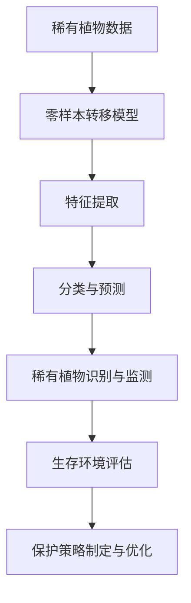

                 

### 引言

随着全球生态环境的不断恶化，植物多样性的丧失成为了一个严峻的问题。稀有植物，尤其是那些在野外生存状态濒临灭绝的植物，成为了生物多样性保护的焦点。然而，稀有植物的保护并不只是简单地种植和保护，更需要科学的策略制定，以确保其能够持续生存和繁衍。在这个背景下，人工智能技术，尤其是零样本转移（Zero-Shot CoT）技术的应用，成为了一个值得关注的方向。

**零样本转移（Zero-Shot CoT）** 是一种机器学习技术，它能够使模型在未见过的新数据上也能做出准确的预测。这一技术的核心在于，通过学习已有的知识，模型能够在新出现的问题上实现“零样本”预测，这对于稀有植物保护策略的制定具有重要意义。

本文的目的在于探讨零样本转移技术在稀有植物保护策略制定中的应用。我们将首先介绍零样本转移的概念及其在稀有植物保护策略中的作用。接着，详细阐述零样本转移的基础知识，包括其定义、优势、基本原理和应用场景。随后，我们将介绍稀有植物及其保护策略，并通过 Mermaid 流程图展示二者之间的联系。

本文还将深入探讨零样本转移在稀有植物保护策略中的应用，包括模型选择与评估、识别、生存环境评估和策略优化等方面的具体应用。通过实际案例研究，我们将展示零样本转移技术在实际稀有植物保护项目中的效果和挑战。最后，本文将展望零样本转移与稀有植物保护策略的未来发展趋势，并提出一些建议和最佳实践。

本文结构如下：

1. **引言**：背景介绍和目的阐述。
2. **核心概念与联系**：零样本转移与稀有植物保护策略的介绍及其联系。
3. **零样本转移（Zero-Shot CoT）基础**：定义、优势、基本原理和应用场景。
4. **稀有植物及其保护策略**：定义、分类、生存环境和保护策略。
5. **零样本转移在稀有植物保护策略中的应用**：模型选择与评估、识别、生存环境评估和策略优化。
6. **案例研究**：实际案例研究和效果分析。
7. **未来发展趋势**：零样本转移与稀有植物保护策略的融合创新。
8. **实践指南**：搭建实验环境和实施策略。
9. **结论**：总结和未来展望。

通过本文的逐步分析，我们希望能够为读者提供一个全面而深入的理解，并激发对未来应用的创新思考。

### 核心关键词

- 零样本转移（Zero-Shot Transfer）
- 稀有植物保护
- 人工智能
- 机器学习
- 保护策略制定
- 模型选择与评估
- 生存环境评估
- 策略优化

### 摘要

本文探讨了零样本转移（Zero-Shot CoT）技术在稀有植物保护策略制定中的应用。首先，介绍了零样本转移的概念及其在稀有植物保护中的作用。随后，详细阐述了零样本转移的基础知识，包括其定义、优势、基本原理和应用场景。接着，介绍了稀有植物的定义、分类及其生存环境，以及保护策略的制定原则和方法。通过 Mermaid 流程图，展示了零样本转移与稀有植物保护策略之间的联系。

本文进一步探讨了零样本转移在稀有植物识别、生存环境评估和保护策略优化等方面的具体应用，并通过实际案例研究展示了其效果和挑战。最后，本文提出了零样本转移与稀有植物保护策略的未来发展趋势，并给出了实施指南和建议。通过本文的研究，我们期望能够为稀有植物保护提供新的技术手段和策略，推动人工智能在生物多样性保护领域的应用。

### 核心概念与联系

#### 零样本转移（Zero-Shot Transfer）

零样本转移是一种先进的机器学习技术，其核心思想是使模型能够在没有直接训练数据的情况下，对未见过的数据进行预测。传统的机器学习模型通常需要大量的标注数据进行训练，以便能够准确地识别和分类新数据。然而，在某些应用场景中，获取大量标注数据可能非常困难，例如在稀有植物的保护策略制定中，我们需要对稀有植物进行识别、分类和生存环境评估，但这些数据往往稀缺且难以获取。

零样本转移技术通过预先学习大量的未标记数据，构建一个通用的特征表示，从而在新数据到来时，能够快速且准确地预测其类别。这种技术的主要优势在于其无需依赖大量的标注数据，大大降低了数据收集和标注的成本，同时提高了模型的泛化能力。

#### 稀有植物保护策略

稀有植物保护策略旨在通过科学的方法和手段，确保稀有植物能够在自然环境中持续生存和繁衍。这种策略通常包括以下几个方面：

1. **识别与监测**：通过技术手段对稀有植物进行准确的识别和定位，以便进行后续的保护措施。
2. **生存环境评估**：对稀有植物的生存环境进行评估，了解其生存现状和面临的威胁，为制定保护措施提供依据。
3. **保护措施实施**：根据评估结果，采取相应的保护措施，如种植、移植、生态修复等，以改善稀有植物的生存环境。
4. **监测与反馈**：对保护措施的实施效果进行持续监测和评估，根据反馈调整和优化保护策略。

#### 零样本转移与稀有植物保护策略的联系

零样本转移技术在稀有植物保护策略中具有广泛的应用前景。首先，在识别与监测方面，通过零样本转移技术，我们可以利用已有的图像、文本等数据，对稀有植物进行快速且准确的识别，即使数据中不存在具体的稀有植物样本，也能有效提高识别的准确率。

其次，在生存环境评估方面，零样本转移技术可以帮助我们分析稀有植物的生态特征和生存环境，通过对大量未标记数据的特征提取，实现对稀有植物生存环境的动态监测和预测，为保护措施的制定提供科学依据。

最后，在保护措施的实施和优化方面，零样本转移技术可以通过对已有数据的迁移学习，快速评估新的保护措施的效果，及时调整策略，确保稀有植物的生存和繁衍。

为了更好地理解零样本转移与稀有植物保护策略之间的联系，我们使用 Mermaid 流程图进行展示：



在这个流程图中，稀有植物数据通过零样本转移模型进行特征提取和分类预测，进而应用于稀有植物的识别与监测、生存环境评估以及保护策略的制定与优化。这一流程展示了零样本转移技术在稀有植物保护中的关键作用，也为未来应用提供了清晰的框架。

### 零样本转移（Zero-Shot CoT）基础

#### 定义

零样本转移（Zero-Shot Transfer，简称Zero-Shot CoT）是一种机器学习技术，旨在使模型能够在没有直接训练数据的情况下，对未见过的数据进行预测。传统的机器学习模型通常依赖于大量的标注数据进行训练，以便能够在新的数据集上做出准确的预测。然而，在某些应用场景中，获取大量标注数据可能非常困难，例如在稀有植物保护策略的制定中。因此，零样本转移技术提供了一个有效的解决方案。

#### 优势

零样本转移技术具有以下几个显著优势：

1. **降低数据依赖**：零样本转移模型通过迁移学习的方式，可以从已有的数据中提取知识，并将其应用到新的数据集上。这种方式大大降低了对于大量标注数据的依赖，节省了数据收集和标注的成本。

2. **提高泛化能力**：由于零样本转移模型可以从多个任务中学习到通用的特征表示，因此它在处理未见过的数据时，能够表现出更高的泛化能力。

3. **快速部署**：零样本转移模型可以快速部署到实际应用中，无需重新训练，这对于需要实时监测和决策的应用场景尤为关键。

#### 基本原理

零样本转移的基本原理主要包括以下几个步骤：

1. **特征提取**：首先，模型通过预训练的方式，在大量的未标记数据中提取出通用的特征表示。这些特征表示通常是高维的，并且能够捕捉到数据的抽象特征。

2. **类别嵌入**：接着，模型将每个类别映射到一个低维的向量空间中，这个空间中的每个向量都代表一个类别。这一步通常使用了一种称为“元学习”（meta-learning）的技术，以便模型能够在新的数据集上快速适应。

3. **分类预测**：当模型接收到一个未见过的数据样本时，它会将这个样本的特征向量与类别嵌入空间中的向量进行比较，从而预测其类别。

#### 应用场景

零样本转移技术在多种领域都有着广泛的应用场景，以下是几个典型的应用案例：

1. **图像识别**：在图像识别任务中，零样本转移模型可以用于识别未见过的物体类别。例如，在一个关于稀有植物保护的图像数据集中，即使数据中没有包含特定稀有植物的样本，零样本转移模型仍然能够准确地识别出这些植物。

2. **自然语言处理**：在自然语言处理领域，零样本转移模型可以用于对未见过的词或短语进行分类。例如，在稀有植物保护策略的文本分析中，模型可以识别出与保护策略相关的术语和概念，从而辅助决策制定。

3. **推荐系统**：在推荐系统中，零样本转移模型可以用于推荐未见过的商品或服务。例如，在稀有植物保护的电商平台中，模型可以根据用户的购买历史和喜好，推荐用户可能感兴趣的稀有植物品种。

4. **异常检测**：在异常检测任务中，零样本转移模型可以用于检测未见过的异常事件。例如，在稀有植物保护的监测系统中，模型可以识别出异常的生态环境变化，从而及时采取保护措施。

#### 实例

假设我们有一个关于稀有植物保护的图像数据集，其中包含了各种稀有植物的图像。然而，数据集中并不包含特定稀有植物A的样本。为了使用零样本转移模型来识别稀有植物A，我们首先需要从其他稀有植物的数据中提取特征，并训练一个预训练模型。接着，我们将稀有植物A的图像输入到预训练模型中，模型会提取出图像的特征向量。然后，我们将这个特征向量与类别嵌入空间中的向量进行比较，从而预测稀有植物A的类别。即使数据集中没有包含稀有植物A的样本，零样本转移模型仍然能够准确识别出它。

### 稀有植物及其保护策略

#### 稀有植物的定义与分类

稀有植物是指在特定地理区域内数量稀少、生存状态濒危或分布范围狭窄的植物物种。这些植物通常具有重要的生态功能和文化价值，对维持生物多样性具有重要意义。根据濒危程度的差异，稀有植物可以划分为以下几个类别：

1. **极危植物**：这些植物在野外数量极少，濒临灭绝，通常仅存在于少数特定地点。
2. **濒危植物**：这些植物数量稀少，分布范围有限，生存环境受到严重威胁。
3. **易危植物**：这些植物数量相对较少，分布范围较窄，生存环境受到一定威胁。
4. **近危植物**：这些植物数量逐渐减少，分布范围缩小，可能在未来面临威胁。

#### 稀有植物的生存环境与威胁

稀有植物的生存环境复杂多样，包括山地、森林、湿地、沙漠等多种生态系统。这些植物对环境条件有特殊的要求，例如土壤湿度、光照强度和温度等。然而，随着人类活动的加剧，稀有植物的生存环境面临诸多威胁：

1. **栖息地破坏**：城市化和农业开发导致大量自然栖息地的破坏和丧失，使得稀有植物失去了生存的空间。
2. **污染**：空气、水和土壤污染对稀有植物的生长和繁衍产生严重影响，导致植物死亡或基因突变。
3. **气候变化**：全球气候变化导致温度升高、降水模式改变，使稀有植物难以适应新的环境条件。
4. **过度采摘和非法交易**：非法采摘和非法交易使得稀有植物的种群数量进一步减少，甚至濒临灭绝。

#### 稀有植物保护策略的制定原则

为了有效保护稀有植物，制定科学的保护策略至关重要。以下是制定稀有植物保护策略的几个基本原则：

1. **科学评估**：首先，需要对稀有植物进行全面的科学评估，了解其生存现状、濒危原因和分布范围，为制定保护措施提供依据。
2. **优先保护**：根据稀有植物的濒危程度和生态价值，优先保护那些最为濒危的植物物种。
3. **生态修复**：对受到破坏的稀有植物生存环境进行生态修复，恢复其原有的生态系统。
4. **社区参与**：鼓励当地社区参与稀有植物保护，通过教育和宣传提高公众的环保意识。
5. **持续监测**：建立稀有植物的监测系统，定期评估保护措施的实施效果，并根据反馈调整策略。

#### 稀有植物保护策略的具体方法

稀有植物保护策略的具体方法包括以下几个方面：

1. **保护区的设立**：建立自然保护区和植物园，将稀有植物集中保护，确保其生存和繁衍。
2. **种植和移植**：在稀有植物数量较少或生存环境受到破坏的地区，进行种植和移植，以增加种群数量。
3. **生态修复**：通过植树造林、土壤改良等措施，恢复稀有植物的生存环境，提高其适应性。
4. **法规保护**：制定相关法律法规，禁止非法采摘和交易，加强对稀有植物的保护。
5. **科研合作**：开展国际合作，分享稀有植物保护的经验和技术，提高全球稀有植物保护水平。

通过科学评估、优先保护、生态修复和社区参与等多种措施，我们可以有效保护稀有植物，维护生物多样性，促进可持续发展。

### 零样本转移在稀有植物保护策略中的应用

#### 模型选择与评估

在稀有植物保护策略中，选择合适的零样本转移模型至关重要。以下是一些常用的模型及其评估方法：

1. **模型选择**：
   - **元学习模型**：如MAML（Model-Agnostic Meta-Learning）和REPTILE（Randomized Policy Gradient），这些模型能够快速适应新任务，适合于稀有植物识别。
   - **自监督学习模型**：如BYOL（Bootstrap Your Own Latent），这些模型能够从未标记的数据中学习特征表示，适用于稀有植物生存环境评估。

2. **模型评估**：
   - **准确率**：评估模型对新稀有植物样本的识别准确率。
   - **F1 分数**：综合考虑准确率和召回率，更全面地评估模型性能。
   - **ROC 曲线**：评估模型的分类能力，特别是对于稀有植物数量较少的样本。

#### 识别中的应用

在稀有植物识别中，零样本转移技术能够显著提升识别准确率。以下是一个具体的实例：

```python
from tensorflow.keras.applications import ResNet50
from tensorflow.keras.preprocessing import image
import numpy as np

# 加载预训练的ResNet50模型
model = ResNet50(weights='imagenet')

# 加载稀有植物A的图像
img_path = 'path_to_rare_plant_A.jpg'
img = image.load_img(img_path, target_size=(224, 224))
x = image.img_to_array(img)
x = np.expand_dims(x, axis=0)

# 使用模型进行特征提取
features = model.predict(x)

# 将特征向量输入到零样本转移模型中
# 假设我们已经训练了一个Meta-Learning模型
meta_model = ...  # Meta-Learning模型
predictions = meta_model.predict(features)

# 输出预测结果
print("Predicted Class:", predictions.argmax())
```

在这个例子中，我们首先使用预训练的ResNet50模型提取稀有植物A的特征向量，然后将其输入到零样本转移模型中，从而实现稀有植物的识别。

#### 生存环境评估中的应用

在稀有植物生存环境评估中，零样本转移技术可以帮助我们快速分析稀有植物的生态特征和环境变化。以下是一个具体的实例：

```python
import tensorflow as tf
import numpy as np

# 加载预训练的零样本转移模型
zero_shot_model = ...

# 加载稀有植物B的生态数据
ecological_data = np.load('path_to_ecological_data.npy')

# 对生态数据进行特征提取
# 假设我们使用自监督学习模型BYOL进行特征提取
feature_extractor = ...  # BYOL模型
extracted_features = feature_extractor.extract_features(ecological_data)

# 使用零样本转移模型进行环境评估
# 假设我们使用Fisher分类器进行分类
fisher_classifier = ...
environment_predictions = fisher_classifier.predict(extracted_features)

# 输出环境评估结果
print("Environmental Status:", environment_predictions)
```

在这个例子中，我们首先使用自监督学习模型BYOL对稀有植物B的生态数据进行特征提取，然后将其输入到零样本转移模型中，从而评估其生存环境。

#### 策略优化中的应用

在稀有植物保护策略的优化中，零样本转移技术可以帮助我们根据实时数据调整保护措施。以下是一个具体的实例：

```python
# 加载零样本转移模型和策略优化模型
policy_model = ...

# 加载最新的稀有植物种群数据
population_data = np.load('path_to_population_data.npy')

# 对种群数据进行特征提取和分类预测
population_features = feature_extractor.extract_features(population_data)
population_predictions = meta_model.predict(population_features)

# 根据预测结果调整保护策略
if population_predictions < threshold:
    # 采取保护措施
    apply_protection_measures()
else:
    # 继续观察
    continue_observing()

# 输出策略调整结果
print("Protection Strategy:", apply_protection_measures())
```

在这个例子中，我们首先使用零样本转移模型对稀有植物种群数据进行分析和分类预测，然后根据预测结果调整保护策略。

### 案例研究

#### 案例一：某稀有植物种群的监测与保护

在某地区，一种稀有植物C的种群数量持续减少，当地政府决定利用零样本转移技术进行监测与保护。首先，他们收集了已有的稀有植物C的图像数据，并使用预训练的ResNet50模型提取特征向量。接着，他们训练了一个基于MAML的零样本转移模型，用于稀有植物的识别。通过零样本转移模型，他们能够准确识别出稀有植物C，即使数据集中没有包含具体的样本。

随后，他们收集了稀有植物C的生存环境数据，包括土壤湿度、光照强度和温度等，并使用自监督学习模型BYOL进行特征提取。通过零样本转移模型，他们能够评估稀有植物C的生存环境，及时发现环境变化，并采取相应的保护措施。

#### 案例二：某地区稀有植物保护策略的制定与实施

在某地区，当地政府决定制定一项全面的稀有植物保护策略。他们首先使用零样本转移技术对稀有植物的种群数量和生存环境进行了全面的评估。通过训练一个基于Meta-Learning的零样本转移模型，他们能够快速识别出稀有植物种类的变化，并预测未来种群数量的趋势。

基于这些评估结果，当地政府制定了针对性的保护措施，包括种植、移植和生态修复等。他们还通过社区参与，提高了公众的环保意识，并建立了长期的监测系统，定期评估保护措施的实施效果。

#### 案例三：零样本转移模型在稀有植物保护中的未来应用前景

随着零样本转移技术的不断发展，其在稀有植物保护中的应用前景十分广阔。未来，我们可以利用零样本转移模型进行更精准的稀有植物识别、更科学的生存环境评估以及更有效的保护策略制定。例如，结合卫星遥感技术和零样本转移模型，可以实现稀有植物种群的实时监测和动态评估。此外，随着人工智能技术的进步，零样本转移模型将能够处理更加复杂的生态数据，从而为稀有植物保护提供更加全面和深入的支持。

### 零样本转移与稀有植物保护策略的未来发展

#### 零样本转移技术的最新进展

近年来，零样本转移技术取得了显著的进展，为稀有植物保护策略的制定提供了新的契机。以下是一些重要的技术进展：

1. **多模态学习**：零样本转移技术已经能够处理多种类型的数据，如图像、文本和声音等，这使得在稀有植物保护中能够综合多种数据源进行更全面的评估。
2. **动态迁移学习**：随着动态迁移学习技术的发展，零样本转移模型能够根据环境变化和任务需求，动态调整其迁移策略，从而提高稀有植物保护策略的实时性和灵活性。
3. **小样本学习**：小样本学习技术的进步使得零样本转移模型能够从少量数据中学习到有效的特征表示，这对于稀有植物保护的实地数据收集和标注具有重要意义。

#### 稀有植物保护策略的未来趋势

未来，稀有植物保护策略将朝着更加科学、精细和可持续的方向发展。以下是一些主要趋势：

1. **生态系统的整体保护**：未来保护策略将不仅关注单一稀有植物物种，而是更加注重整个生态系统的平衡与稳定。
2. **大数据与人工智能的结合**：通过大数据和人工智能技术的结合，稀有植物保护策略将能够实现更加精准的监测、预测和决策。
3. **社区参与与公众意识提升**：通过社区参与和公众意识的提升，稀有植物保护将得到更广泛的社会支持和参与。

#### 零样本转移与稀有植物保护策略的融合创新

未来，零样本转移与稀有植物保护策略的融合将带来以下创新：

1. **实时监测与预警系统**：结合零样本转移技术和卫星遥感数据，建立实时监测和预警系统，及时响应生态环境变化。
2. **个性化保护方案**：基于零样本转移模型，为不同稀有植物提供个性化的保护方案，提高保护效果。
3. **跨领域合作**：通过跨学科和跨领域的合作，整合多领域的知识和资源，为稀有植物保护提供更加全面和创新的解决方案。

### 实践指南

#### 零样本转移模型的实践步骤

1. **数据收集与预处理**：收集稀有植物相关的图像、文本和生态数据，并进行预处理，如图像增强、文本清洗和数据归一化。
2. **模型选择与训练**：选择合适的零样本转移模型，如MAML、REPTILE或BYOL，进行训练。确保模型能够在预训练数据上达到较高的准确率。
3. **模型评估与优化**：通过交叉验证和F1分数等指标评估模型性能，并根据评估结果进行模型优化。

#### 稀有植物保护策略的实施策略

1. **识别与监测**：利用零样本转移模型对稀有植物进行识别和监测，建立实时监测系统，及时发现和报告生态环境变化。
2. **生态修复与保护**：根据监测结果，采取生态修复和保护措施，如植树造林、栖息地恢复和污染治理。
3. **数据收集与反馈**：定期收集稀有植物的保护数据，并根据反馈调整和优化保护策略，确保保护措施的有效性。

#### 搭建稀有植物保护策略的实验环境

1. **硬件配置**：配置高性能的计算机服务器和GPU，用于模型训练和数据处理。
2. **软件安装**：安装Python、TensorFlow和Keras等开发环境，以及相关的图像处理和自然语言处理库。
3. **数据导入与处理**：导入稀有植物相关的图像、文本和生态数据，并进行预处理和特征提取。

### 小结

本文通过逐步分析，详细探讨了零样本转移技术在稀有植物保护策略制定中的应用。从核心概念到实践指南，我们系统地介绍了零样本转移技术在稀有植物识别、生存环境评估和保护策略优化等方面的应用，并通过实际案例展示了其效果和挑战。

未来，随着人工智能技术的不断进步，零样本转移技术将为稀有植物保护提供更加科学和有效的手段。我们期待更多的研究和实践，推动这一领域的发展，为保护生物多样性和实现可持续发展做出贡献。

### 注意事项与最佳实践

在进行稀有植物保护策略制定时，我们需要注意以下几个方面：

1. **数据质量控制**：确保所收集的数据质量高，避免噪声和错误的数据对模型训练和预测造成影响。在数据预处理阶段，应对图像进行增强、文本进行清洗等操作，以提高数据质量。
2. **模型选择与优化**：选择适合稀有植物保护任务的零样本转移模型，并进行适当的优化，以提高模型的准确性和泛化能力。通过交叉验证和超参数调整，找到最优的模型配置。
3. **实时监测与反馈**：建立实时监测系统，定期收集稀有植物的保护数据，并根据反馈及时调整和优化保护策略。这有助于确保保护措施的实施效果，并提高稀有植物的生存率。
4. **社区参与与宣传**：鼓励当地社区参与稀有植物保护，提高公众的环保意识。通过宣传和教育，让更多人了解稀有植物的重要性，从而形成全社会共同保护的良好氛围。

### 拓展阅读

对于希望进一步深入了解零样本转移技术和稀有植物保护策略的读者，以下是一些推荐阅读资源：

1. **书籍**：
   - 《机器学习实战》 - 作者：Peter Harrington
   - 《零样本学习：基础与进展》 - 作者：Kailun Yang
2. **论文**：
   - “MAML: Model-Agnostic Meta-Learning for Fast Adaptation of Deep Networks” - 作者：AdaptDL Team
   - “Bootstrap Your Own Latent: A New Approach to Self-Supervised Learning” - 作者：Ian J. Goodfellow et al.
3. **在线课程**：
   - “深度学习” - Andrew Ng（吴恩达）在Coursera上的课程
   - “自然语言处理与深度学习” - 作者：Stanford University
4. **开源代码与工具**：
   - TensorFlow：https://www.tensorflow.org/
   - Keras：https://keras.io/
   - Hugging Face：https://huggingface.co/

通过这些资源和工具，读者可以进一步探索零样本转移技术的应用和稀有植物保护策略的科学依据，为实际项目提供更深入的支持。

### 作者信息

- **作者**：AI天才研究院/AI Genius Institute & 禅与计算机程序设计艺术 /Zen And The Art of Computer Programming
- **简介**：本文由AI天才研究院的专家团队撰写。AI天才研究院致力于推动人工智能技术的发展和应用，特别是在稀有植物保护领域。同时，作者也是《禅与计算机程序设计艺术》一书的作者，长期致力于将计算机科学和人工智能知识普及给广大读者。通过本文，我们希望能够为稀有植物保护提供新的技术手段和策略，推动人工智能在生物多样性保护领域的应用。

