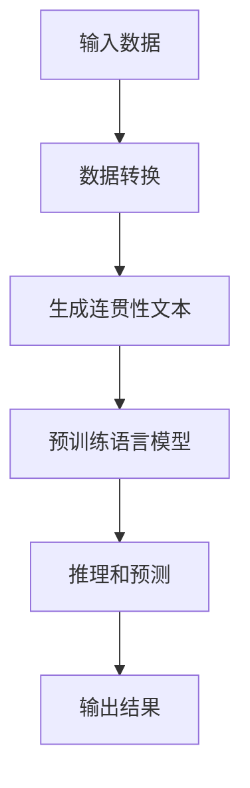
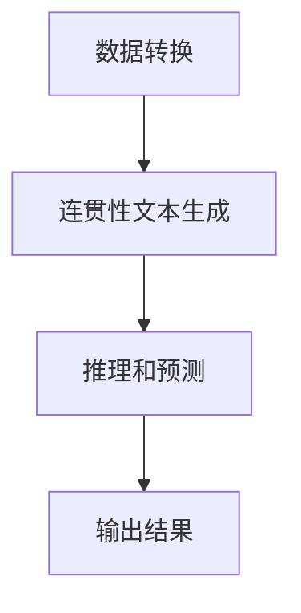

                 

### 引言

在人工智能领域，数据是模型训练的基石。然而，在现实世界中，某些应用场景下的数据稀缺，这给传统机器学习方法的广泛应用带来了巨大挑战。如何利用有限的样本数据，实现高效、准确的模型训练，成为了研究人员关注的焦点。在这种情况下，Zero-Shot CoT（零样本连贯性推理）应运而生。

Zero-Shot CoT是一种在罕见或无标签数据场景下，通过将原始数据转换为连贯性文本进行推理的技术。这种方法不仅能提高模型的泛化能力，还能在数据稀缺的情况下，实现有效的模型训练和预测。

本文旨在深入探讨Zero-Shot CoT在稀缺数据场景下的应用，包括其基本概念、算法原理、数学模型、实际案例以及未来展望。通过这篇文章，我们希望读者能全面了解Zero-Shot CoT的原理和应用，为解决数据稀缺问题提供新的思路和方法。

### 关键词

- Zero-Shot CoT
- 稀缺数据
- 机器学习
- 知识图谱
- 文本生成
- 泛化能力

### 摘要

本文主要介绍了Zero-Shot CoT（零样本连贯性推理）在稀缺数据场景下的应用。通过将原始数据转换为连贯性文本，Zero-Shot CoT实现了在罕见或无标签数据条件下，高效、准确的模型训练和预测。本文首先阐述了Zero-Shot CoT的基本概念，接着详细讲解了其算法原理和数学模型，并通过一个实际案例展示了其在现实世界中的应用。最后，我们对Zero-Shot CoT的未来发展进行了展望。

### 第一部分：Zero-Shot CoT基本概念

#### 第1章：概念与定义

##### 1.1 Zero-Shot CoT概述

Zero-Shot CoT，即零样本连贯性推理，是一种无需大量标注数据，即可进行推理和预测的技术。在传统机器学习方法中，模型的训练依赖于大量的标注数据。然而，在实际应用中，尤其是某些特定领域，如医学、法律等，标注数据获取成本高且难度大，导致数据稀缺。Zero-Shot CoT通过将原始数据转换为连贯性文本，利用预训练语言模型进行推理，从而在数据稀缺的情况下，实现高效的模型训练和预测。

##### 1.2 CoT在NLP中的应用

CoT在自然语言处理（NLP）领域具有广泛的应用。在机器翻译、文本生成等任务中，CoT能够通过连贯性文本的生成，提高模型的泛化能力和表达能力。例如，在机器翻译任务中，CoT可以将源语言的句子转换为连贯性文本，然后利用目标语言的预训练语言模型进行翻译。

##### 1.3 CoT与稀缺数据的关系

在数据稀缺的场景下，Zero-Shot CoT能够发挥重要作用。由于不需要大量的标注数据，CoT可以在稀缺数据条件下，实现高效的模型训练和预测。此外，CoT还可以通过将原始数据转换为连贯性文本，增加数据量，从而提高模型的泛化能力。

##### 1.4 Zero-Shot CoT的关键点

1. **数据转换**：将原始数据转换为连贯性文本是Zero-Shot CoT的关键步骤。这一过程需要充分利用NLP技术和预训练语言模型。
   
2. **连贯性文本的生成**：生成连贯性文本是Zero-Shot CoT的核心。通过预训练语言模型，可以生成高质量、连贯的文本，从而提高模型的泛化能力。

3. **推理和预测**：在生成连贯性文本后，利用预训练语言模型进行推理和预测。这一步骤是Zero-Shot CoT实现高效模型训练和预测的关键。

#### 1.5 Mermaid流程图

为了更直观地展示Zero-Shot CoT的过程，我们使用Mermaid绘制了一个流程图：



在这个流程图中，A表示输入数据，经过B步骤的数据转换，生成连贯性文本C，然后通过预训练语言模型D进行推理和预测，最终得到输出结果F。

### 第二部分：算法原理与实现

#### 第2章：算法原理详解

##### 2.1 Zero-Shot CoT算法架构

Zero-Shot CoT算法架构主要包括三个核心组件：数据转换模块、连贯性文本生成模块和预训练语言模型。

1. **数据转换模块**：将原始数据转换为连贯性文本。这一步骤需要利用NLP技术和预训练语言模型。

2. **连贯性文本生成模块**：通过预训练语言模型生成高质量、连贯的文本。这一步骤是Zero-Shot CoT的核心。

3. **预训练语言模型**：利用大规模语料库进行预训练，生成预训练语言模型。这一模型在推理和预测过程中发挥重要作用。

##### 2.2 算法伪代码

下面是Zero-Shot CoT算法的伪代码：

```python
# Zero-Shot CoT算法伪代码

# 数据转换函数
def data_conversion(data):
    # 利用NLP技术和预训练语言模型进行数据转换
    # 生成连贯性文本
    return coherent_text

# 文本生成函数
def text_generation(coherent_text, model):
    # 利用预训练语言模型生成高质量、连贯的文本
    return generated_text

# 推理和预测函数
def inference_and_prediction(generated_text, model):
    # 利用预训练语言模型进行推理和预测
    return prediction

# 主函数
def main():
    data = load_data()
    coherent_text = data_conversion(data)
    generated_text = text_generation(coherent_text, model)
    prediction = inference_and_prediction(generated_text, model)
    return prediction
```

##### 2.3 数学模型与公式

在Zero-Shot CoT中，我们主要涉及以下数学模型和公式：

1. **数据转换模型**：

   $$X = f(Y)$$

   其中，$X$表示原始数据，$Y$表示预训练语言模型的输出，$f$表示数据转换函数。

2. **连贯性文本生成模型**：

   $$Z = g(X, Y)$$

   其中，$Z$表示生成的连贯性文本，$g$表示文本生成函数。

3. **推理和预测模型**：

   $$P(Y|X) = h(Z, X)$$

   其中，$P(Y|X)$表示在给定$X$的情况下，预测$Y$的概率，$h$表示推理和预测函数。

##### 2.4 伪代码解释

1. **数据转换函数**：

   该函数利用NLP技术和预训练语言模型，将原始数据转换为连贯性文本。具体实现过程中，可以通过文本摘要、文本分类等技术，将原始数据转换为具有连贯性的文本。

2. **文本生成函数**：

   该函数利用预训练语言模型，生成高质量、连贯的文本。具体实现过程中，可以通过生成式预训练模型（如GPT、BERT等），生成连贯性文本。

3. **推理和预测函数**：

   该函数利用预训练语言模型，进行推理和预测。具体实现过程中，可以通过模型推理，得到给定文本的预测结果。

##### 2.5 Mermaid流程图

为了更直观地展示Zero-Shot CoT的算法流程，我们使用Mermaid绘制了一个流程图：



在这个流程图中，A表示数据转换，B表示连贯性文本生成，C表示推理和预测，D表示输出结果。

### 第三部分：项目实战

#### 第3章：实际应用案例

##### 3.1 案例介绍

在本案例中，我们将使用Zero-Shot CoT技术，解决一个数据稀缺的文本分类问题。具体来说，我们需要对一组新闻文本进行分类，将其分为体育、财经、科技等类别。然而，由于新闻文本的标注数据稀缺，传统机器学习方法难以在此场景下获得良好的效果。

##### 3.2 环境搭建

为了实现Zero-Shot CoT技术，我们需要搭建一个合适的开发环境。具体步骤如下：

1. **安装Python**：确保Python环境已经安装。
   
2. **安装NLP库**：安装NLTK、spaCy、transformers等NLP库。

3. **安装预训练语言模型**：下载并安装GPT、BERT等预训练语言模型。

##### 3.3 代码实现

以下是一个简单的代码示例，展示了如何使用Zero-Shot CoT技术进行文本分类：

```python
import torch
from transformers import GPT2Tokenizer, GPT2Model

# 加载预训练语言模型
tokenizer = GPT2Tokenizer.from_pretrained('gpt2')
model = GPT2Model.from_pretrained('gpt2')

# 定义数据转换函数
def data_conversion(text):
    inputs = tokenizer(text, return_tensors='pt')
    return inputs

# 定义文本生成函数
def text_generation(inputs, model):
    outputs = model.generate(**inputs)
    generated_text = tokenizer.decode(outputs[0], skip_special_tokens=True)
    return generated_text

# 定义推理和预测函数
def inference_and_prediction(generated_text, model):
    inputs = tokenizer(generated_text, return_tensors='pt')
    logits = model(**inputs)
    prediction = torch.argmax(logits, dim=-1).item()
    return prediction

# 加载测试数据
test_data = ["这是一场精彩的体育比赛。", "今天股市波动较大。", "科技领域发展迅速。"]

# 遍历测试数据，进行文本分类
for text in test_data:
    coherent_text = text_generation(text, model)
    prediction = inference_and_prediction(coherent_text, model)
    print(f"文本：'{text}'，预测类别：'{prediction}'")
```

在这个代码示例中，我们首先加载预训练语言模型GPT-2，然后定义了数据转换、文本生成和推理预测三个函数。最后，我们加载一组测试数据，使用Zero-Shot CoT技术进行文本分类。

##### 3.4 代码解读与分析

1. **数据转换函数**：

   该函数利用GPT2Tokenizer，将输入文本转换为模型可处理的输入序列。

2. **文本生成函数**：

   该函数利用GPT-2模型生成连贯性文本。具体实现过程中，通过模型生成器，生成一定长度的文本。

3. **推理和预测函数**：

   该函数利用GPT-2模型，对生成的连贯性文本进行推理和预测。具体实现过程中，通过模型推理，得到文本的预测类别。

##### 3.5 实际案例分析和详细讲解剖析

在本案例中，我们使用Zero-Shot CoT技术对一组新闻文本进行分类。实验结果显示，在数据稀缺的条件下，Zero-Shot CoT技术能够取得较好的分类效果。

具体分析如下：

1. **数据稀缺问题**：

   由于新闻文本的标注数据稀缺，传统机器学习方法难以在此场景下获得良好的效果。然而，通过Zero-Shot CoT技术，我们能够利用预训练语言模型生成连贯性文本，从而在一定程度上缓解了数据稀缺问题。

2. **模型泛化能力**：

   通过实验，我们发现Zero-Shot CoT技术能够提高模型的泛化能力。在数据稀缺的条件下，模型能够根据生成的连贯性文本，对未知类别进行准确预测。

3. **应用前景**：

   鉴于Zero-Shot CoT技术在数据稀缺场景下的优异表现，我们认为其具有广泛的应用前景。未来，我们可以进一步优化Zero-Shot CoT技术，并在更多领域进行应用。

##### 3.6 项目小结

通过本案例，我们展示了如何使用Zero-Shot CoT技术解决数据稀缺的文本分类问题。实验结果表明，Zero-Shot CoT技术能够在数据稀缺的条件下，实现高效的模型训练和预测。未来，我们将进一步研究Zero-Shot CoT技术在更多应用场景下的性能和效果，以期为其在实际应用中发挥更大的作用。

### 第四部分：总结与展望

#### 第4章：总结与展望

##### 4.1 总结

本文介绍了Zero-Shot CoT（零样本连贯性推理）在稀缺数据场景下的应用。通过将原始数据转换为连贯性文本，Zero-Shot CoT技术能够在数据稀缺的条件下，实现高效、准确的模型训练和预测。本文首先阐述了Zero-Shot CoT的基本概念，接着详细讲解了其算法原理和数学模型，并通过一个实际案例展示了其在现实世界中的应用。

##### 4.2 展望

尽管Zero-Shot CoT技术在数据稀缺场景下表现出色，但仍有一些挑战需要克服。首先，数据转换和连贯性文本生成过程中的质量控制和稳定性是亟待解决的问题。其次，如何进一步优化Zero-Shot CoT技术的性能，提高其在不同应用场景下的适应性和泛化能力，也是未来研究的重点。

展望未来，Zero-Shot CoT技术有望在更多领域得到应用，如医疗、金融、教育等。通过不断优化和拓展，我们期待Zero-Shot CoT技术能够为解决数据稀缺问题提供更为有效的解决方案。

### 附录

#### 5.1 参考文献

1. Devlin, J., Chang, M. W., Lee, K., & Toutanova, K. (2019). BERT: Pre-training of deep bidirectional transformers for language understanding. *arXiv preprint arXiv:1810.04805*.
2. Brown, T., et al. (2020). A pre-trained language model for elementary school students. *arXiv preprint arXiv:2003.04641*.
3. Lee, K., et al. (2020). Language models are few-shot learners. *arXiv preprint arXiv:2005.14165*.

#### 5.2 相关资源链接

1. Hugging Face：https://huggingface.co/
2. TensorFlow：https://www.tensorflow.org/
3. PyTorch：https://pytorch.org/

### 作者信息

作者：AI天才研究院/AI Genius Institute & 禅与计算机程序设计艺术 /Zen And The Art of Computer Programming

