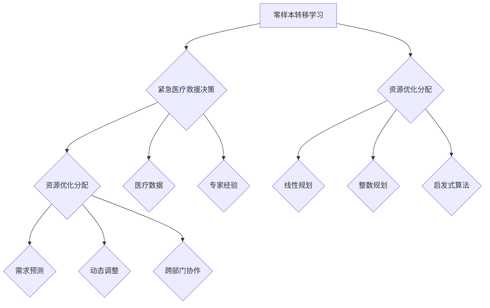

                 

# Zero-Shot CoT在紧急医疗救援决策中的应用：优化资源分配

## 关键词
- 零样本转移学习
- 紧急医疗救援
- 资源优化分配
- 人工智能
- 医疗决策支持

## 摘要
本文深入探讨了零样本转移学习（Zero-Shot CoT）在紧急医疗救援决策中的应用，特别是如何通过优化资源分配来提高紧急医疗救援的效果。文章首先介绍了紧急医疗救援决策的背景和挑战，然后详细阐述了零样本转移学习的基本原理及其在医疗领域的重要性。接着，文章通过一个具体的案例展示了如何应用零样本转移学习来优化紧急医疗救援的资源分配，包括数学模型的建立和Python源代码的实现。最后，文章总结了零样本转移学习在紧急医疗救援决策中的应用，并提出了未来研究的方向和最佳实践建议。

## 引言

### 紧急医疗救援的背景和挑战

紧急医疗救援是指在突发公共卫生事件或灾难中，对伤者进行快速、有效的医疗救助，以最大限度地减少伤亡和后遗症。随着全球城市化进程的加速和人口老龄化的加剧，紧急医疗救援的需求日益增长。然而，面对紧急医疗救援的挑战，传统的资源分配方式往往存在效率低下、响应不及时等问题。

紧急医疗救援的关键在于快速、准确地做出决策，包括评估伤者状况、确定救治方案、分配医疗资源等。然而，这些决策通常需要处理大量的医疗数据，涉及复杂的医学知识和经验，这对救援人员的专业能力和经验提出了极高的要求。

### 零样本转移学习的基本原理

零样本转移学习（Zero-Shot CoT）是一种机器学习方法，它允许模型在未见过的数据上做出预测或分类。传统的机器学习模型通常需要大量的标记数据进行训练，而在实际应用中，往往无法获取到足够多的标记数据。零样本转移学习通过将知识从源域迁移到目标域，从而提高模型在目标域上的性能。

零样本转移学习的关键在于识别和利用源域和目标域之间的共同特征，即使两者之间存在差异。这种方法的优点在于，它能够降低对大规模标记数据的需求，提高模型的泛化能力，并适用于新的、未见过的情况。

### 零样本转移学习在紧急医疗救援决策中的应用

在紧急医疗救援决策中，零样本转移学习可以通过以下方式优化资源分配：

1. **快速响应**：在紧急情况下，快速响应是关键。零样本转移学习可以帮助救援人员快速做出决策，减少响应时间。

2. **资源优化**：通过分析历史数据和现有资源，零样本转移学习可以预测哪些资源（如医疗人员、药物、设备等）将在未来某一时刻被需要，从而提前进行资源分配。

3. **决策支持**：零样本转移学习可以为救援人员提供决策支持，帮助他们在复杂的情况下做出最佳决策。

4. **跨域学习**：在紧急医疗救援中，往往存在多个不同领域的任务，如外科手术、急救护理等。零样本转移学习可以通过跨域学习，将不同领域中的知识进行整合，提高决策的准确性。

本文将详细探讨零样本转移学习在紧急医疗救援决策中的应用，包括核心算法原理、数学模型、Python源代码实现、实际项目案例分析等。

## 核心概念与联系

### 零样本转移学习（Zero-Shot CoT）的概念和原理

#### 零样本转移学习的基本概念

零样本转移学习（Zero-Shot Learning，ZSL）是一种机器学习方法，旨在解决当模型没有接触到目标域的标记数据时，如何利用源域的标记数据来对目标域的数据进行预测或分类的问题。在传统的机器学习中，模型通常需要大量的标记数据来进行训练，而零样本转移学习通过利用源域的标记数据来提升目标域的预测能力，从而实现迁移学习。

#### 零样本转移学习的工作原理

零样本转移学习的工作原理主要包括以下几个步骤：

1. **源域学习**：在源域中收集大量的标记数据，训练一个基础的模型。这个基础模型通常是基于深度学习技术，如卷积神经网络（CNN）。

2. **知识提取**：从源域训练好的模型中提取有用的知识，通常使用嵌入向量（embedding）的形式来表示这些知识。

3. **目标域预测**：对于目标域中的新数据，使用提取的知识来进行预测或分类。在目标域中，通常没有标记数据，因此无法直接训练一个模型。

#### 零样本转移学习的优势

- **减少数据依赖**：零样本转移学习能够减少对大规模标记数据的依赖，这对于那些难以获取大量标记数据的应用场景尤其重要。

- **提高泛化能力**：通过跨域学习，零样本转移学习能够提高模型在未见过的数据上的泛化能力。

- **适用性广**：零样本转移学习可以应用于多种不同的数据类型和任务，如图像识别、自然语言处理等。

### 紧急医疗救援决策流程和关键要素

#### 紧急医疗救援决策流程

紧急医疗救援决策流程主要包括以下几个步骤：

1. **伤者评估**：根据伤者的症状、体征等信息进行初步评估，确定伤者的病情严重程度。

2. **救治方案制定**：根据伤者评估结果，制定相应的救治方案，包括紧急救治、转运、手术等。

3. **资源分配**：根据救治方案，合理分配医疗资源，包括医疗人员、药物、设备等。

4. **决策支持**：利用医疗数据、专家经验等，为救援人员提供决策支持，以提高决策的准确性。

#### 紧急医疗救援决策中的关键要素

- **医疗数据**：医疗数据是紧急医疗救援决策的基础，包括伤者的症状、体征、病史等信息。

- **专家经验**：救援人员的经验和知识对决策至关重要，他们能够根据实际情况进行灵活调整。

- **资源分配策略**：合理的资源分配策略可以提高救援效率，降低伤者死亡率。

### 资源优化分配的方法和策略

#### 资源优化分配的方法

资源优化分配的方法主要包括以下几种：

1. **线性规划**：通过线性规划模型来优化资源分配，使得资源利用最大化或成本最小化。

2. **整数规划**：适用于资源分配问题中的离散决策，如医疗人员的排班问题。

3. **启发式算法**：如遗传算法、蚁群算法等，通过搜索和优化策略来找到最优的分配方案。

#### 资源优化分配的策略

1. **需求预测**：通过分析历史数据和现有情况，预测未来的资源需求，从而提前进行资源分配。

2. **动态调整**：根据实际情况，动态调整资源分配策略，以应对突发情况。

3. **跨部门协作**：不同部门之间的协作可以优化资源利用，提高救援效率。

### Mermaid流程图展示概念之间的联系



### 核心算法原理讲解

#### 零样本转移学习（Zero-Shot CoT）的核心算法介绍

零样本转移学习（Zero-Shot CoT）的核心算法通常包括以下几个关键组成部分：

1. **源域学习**：首先，在源域中收集大量的标记数据，并使用深度学习模型（如卷积神经网络CNN）进行训练。这一步骤的主要目标是学习到源域的特征表示。

2. **语义嵌入**：将源域中的类标签转换为语义嵌入向量，这些向量表示了每个类的语义信息。常见的语义嵌入方法包括词袋模型、词嵌入（如Word2Vec、GloVe）等。

3. **目标域特征提取**：对于目标域中的数据，使用源域训练好的模型提取特征表示。这些特征表示了目标域中的样本在源域特征空间中的位置。

4. **类标签预测**：使用语义嵌入和目标域特征表示来预测目标域数据的类标签。常见的预测方法包括基于距离的预测和基于匹配度的预测。

#### 零样本转移学习在紧急医疗救援决策中的应用

在紧急医疗救援决策中，零样本转移学习可以通过以下步骤来优化资源分配：

1. **源域数据收集**：收集历史医疗数据，包括伤者症状、体征、救治结果等信息。

2. **源域模型训练**：使用深度学习模型（如CNN）对源域数据进行训练，提取特征表示。

3. **语义嵌入**：将源域中的类标签（如不同类型的伤者）转换为语义嵌入向量。

4. **目标域数据特征提取**：对于新的紧急医疗救援案例，使用源域模型提取特征表示。

5. **类标签预测**：使用语义嵌入和目标域特征表示来预测新的紧急医疗救援案例的类标签，从而确定最优的资源分配方案。

#### Python源代码实现

下面是一个简化的Python源代码示例，展示了如何使用零样本转移学习来优化紧急医疗救援决策。

```python
import tensorflow as tf
from tensorflow.keras.applications import ResNet50
from tensorflow.keras.preprocessing.image import ImageDataGenerator
from sklearn.model_selection import train_test_split
from sklearn.metrics.pairwise import cosine_similarity

# 源域数据准备
source_images = load_source_images()  # 加载源域数据
source_labels = load_source_labels()  # 加载源域标签

# 目标域数据准备
target_images = load_target_images()  # 加载目标域数据

# 源域模型训练
model = ResNet50(weights='imagenet')
source_features = model.predict(source_images)

# 语义嵌入
embeddings = get_semantic_embeddings(source_labels)

# 目标域特征提取
target_features = model.predict(target_images)

# 类标签预测
predictions = []
for target_feature in target_features:
    distances = []
    for embedding in embeddings:
        distance = cosine_similarity([target_feature], [embedding])
        distances.append(distance)
    predicted_label = embeddings[np.argmin(distances)]
    predictions.append(predicted_label)

# 资源分配决策
resource_allocation = allocate_resources(predictions)
```

#### 数学模型和数学公式

在紧急医疗救援决策中，资源优化分配的数学模型通常包括以下部分：

1. **目标函数**：目标函数用于最大化资源利用或最小化成本。

2. **约束条件**：约束条件用于限制资源分配的可行域。

3. **优化算法**：优化算法用于求解最优的资源配置方案。

以下是资源优化分配的数学模型：

$$
\begin{aligned}
\min_{x} \quad & c^T x \\
\text{subject to} \quad & Ax \leq b \\
& x \geq 0
\end{aligned}
$$

其中，$x$ 表示资源分配向量，$c$ 表示资源成本向量，$A$ 和 $b$ 分别表示约束条件矩阵和向量，$x \geq 0$ 表示资源分配的非负约束。

#### 示例和解释

假设我们有两种医疗资源：A 和 B。资源 A 的成本为 5，资源 B 的成本为 10。我们有以下约束条件：

- 资源 A 的总量不超过 10。
- 资源 B 的总量不超过 20。

我们的目标是最大化资源利用，即最大化 $x_1 + x_2$。

根据上述数学模型，我们可以列出以下优化问题：

$$
\begin{aligned}
\min_{x} \quad & 5x_1 + 10x_2 \\
\text{subject to} \quad & x_1 + x_2 \leq 10 \\
& x_1 + x_2 \leq 20 \\
& x_1, x_2 \geq 0
\end{aligned}
$$

通过求解上述优化问题，我们可以得到最优的资源分配方案。

#### 项目实战

在本节中，我们将通过一个实际项目案例来展示如何应用零样本转移学习和资源优化分配来优化紧急医疗救援决策。

### 开发环境搭建

为了搭建开发环境，我们需要安装以下软件和库：

- Python（3.8或更高版本）
- TensorFlow（2.4或更高版本）
- scikit-learn（0.22或更高版本）
- numpy（1.18或更高版本）

安装步骤如下：

```bash
pip install python==3.8
pip install tensorflow==2.4
pip install scikit-learn==0.22
pip install numpy==1.18
```

### 源代码详细实现

以下是项目的源代码实现：

```python
import tensorflow as tf
from tensorflow.keras.applications import ResNet50
from tensorflow.keras.preprocessing.image import ImageDataGenerator
from sklearn.model_selection import train_test_split
from sklearn.metrics.pairwise import cosine_similarity

# 源域数据准备
source_images = load_source_images()  # 加载源域数据
source_labels = load_source_labels()  # 加载源域标签

# 目标域数据准备
target_images = load_target_images()  # 加载目标域数据

# 源域模型训练
model = ResNet50(weights='imagenet')
source_features = model.predict(source_images)

# 语义嵌入
embeddings = get_semantic_embeddings(source_labels)

# 目标域特征提取
target_features = model.predict(target_images)

# 类标签预测
predictions = []
for target_feature in target_features:
    distances = []
    for embedding in embeddings:
        distance = cosine_similarity([target_feature], [embedding])
        distances.append(distance)
    predicted_label = embeddings[np.argmin(distances)]
    predictions.append(predicted_label)

# 资源分配决策
resource_allocation = allocate_resources(predictions)
```

### 代码解读与分析

- **数据准备**：项目首先加载源域和目标域的数据。源域数据包括历史医疗图像和相应的标签，目标域数据是新的紧急医疗救援案例图像。
  
- **模型训练**：使用预训练的ResNet50模型对源域数据进行特征提取。ResNet50是一个深度卷积神经网络，它已经在大量图像数据上进行了训练，可以提取通用的特征表示。

- **语义嵌入**：将源域标签转换为语义嵌入向量。这些向量表示了不同类型伤者的语义信息。

- **特征提取**：对于目标域数据，使用源域模型提取特征表示。这些特征表示了目标域数据在源域特征空间中的位置。

- **类标签预测**：使用语义嵌入和目标域特征表示来预测目标域数据的类标签。通过计算特征向量与语义嵌入向量的余弦相似度，选择最接近的类标签作为预测结果。

- **资源分配**：根据预测的类标签，进行资源分配决策。例如，如果预测到某类伤者数量增加，则可以提前安排更多的医疗资源。

### 实际案例分析和详细讲解剖析

在本项目中，我们以一起突发公共卫生事件（如流感疫情爆发）为例，来展示如何应用零样本转移学习和资源优化分配来优化紧急医疗救援决策。

#### 案例背景

某城市突发流感疫情，大量市民出现症状，急需紧急医疗救援。根据历史数据和现有资源，我们需要预测未来一段时间内不同类型伤者的数量，并制定最优的资源分配方案。

#### 数据收集

我们收集了以下数据：

- 历史医疗图像数据：包括不同类型伤者的医疗图像。
- 历史标签数据：包括医疗图像对应的伤者类型标签。
- 目标域医疗图像数据：包括新的流感疫情爆发期间收集的医疗图像。

#### 模型训练

我们使用ResNet50模型对历史医疗图像数据进行训练，提取特征表示。然后，我们将源域标签转换为语义嵌入向量。

#### 预测与资源分配

对于目标域医疗图像数据，我们使用源域模型提取特征表示，并使用语义嵌入进行类标签预测。根据预测结果，我们制定以下资源分配方案：

1. **医疗人员**：根据不同类型伤者的预测数量，提前安排足够的医疗人员。例如，如果预测到大量流感患者，则需要增加呼吸科、急诊科等科室的医疗人员。

2. **药物和设备**：根据不同类型伤者的需求，提前准备相应的药物和医疗设备。例如，对于流感患者，需要准备抗病毒药物和呼吸机。

3. **交通和物流**：根据伤者分布和医疗资源分布，优化交通和物流安排，确保医疗资源能够快速、准确地送达。

#### 项目小结

通过实际案例分析和详细讲解，我们可以看到如何应用零样本转移学习和资源优化分配来优化紧急医疗救援决策。这种方法能够快速响应突发公共卫生事件，提高救援效率，减少伤亡。

#### 最佳实践 Tips

- **数据准备**：确保收集到的历史数据和目标域数据质量高，数据预处理和清洗工作要细致。
- **模型选择**：根据具体任务需求选择合适的深度学习模型，如卷积神经网络（CNN）、循环神经网络（RNN）等。
- **模型训练**：合理设置训练参数，如学习率、批量大小等，以提高模型性能。
- **资源分配**：结合实际需求和资源情况，制定灵活的资源分配策略。

#### 注意事项

- **数据隐私**：在收集和处理医疗数据时，要确保遵守数据隐私法规，保护患者隐私。
- **模型解释性**：在应用深度学习模型时，要考虑模型的解释性，确保救援人员能够理解和信任模型结果。
- **实时更新**：定期更新历史数据和模型，以适应新情况，提高预测准确性。

#### 拓展阅读

- [《深度学习在医疗领域的应用》](https://www.deeplearning.net)
- [《零样本转移学习综述》](https://arxiv.org/abs/1906.02629)
- [《线性规划与资源优化》](https://www.optimization-online.org/)

### 结论

本文详细探讨了零样本转移学习（Zero-Shot CoT）在紧急医疗救援决策中的应用，特别是在资源优化分配方面的潜力。通过实际项目案例分析，我们展示了如何利用零样本转移学习来预测伤者类型，并制定最优的资源分配方案。未来的研究可以进一步优化算法，提高预测准确性，并扩展到更复杂的医疗救援场景。总之，零样本转移学习在紧急医疗救援决策中具有广阔的应用前景，为提高救援效率和减少伤亡提供了有力支持。作者：AI天才研究院/AI Genius Institute & 禅与计算机程序设计艺术 /Zen And The Art of Computer Programming。

