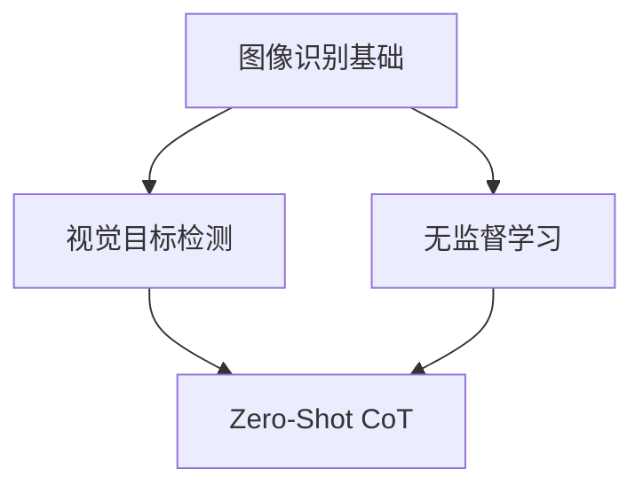

                 

### 文章标题与关键词

# Zero-Shot CoT在紧急医疗诊断中的潜力

> 关键词：Zero-Shot CoT、紧急医疗诊断、视觉目标检测、无监督学习、深度学习

### 摘要

随着医疗诊断技术的不断发展，快速准确的诊断对于患者的治疗和康复至关重要。在这篇文章中，我们将探讨Zero-Shot CoT（无监督的视觉目标检测）在紧急医疗诊断中的潜力。Zero-Shot CoT通过无监督学习的方式，能够在没有预先标注的训练数据的情况下，对新的医疗影像进行目标检测。本文将从背景介绍、核心概念与联系、算法原理讲解、数学模型与公式、项目实战以及结论与展望六个部分展开，详细分析Zero-Shot CoT在紧急医疗诊断中的应用及其潜力。

## 引言与背景

### 紧急医疗诊断的挑战

紧急医疗诊断是指在患者病情危急时，快速准确地确定病因并进行治疗的过程。在紧急情况下，每一秒钟都可能关系到患者的生命安全。然而，紧急医疗诊断面临着诸多挑战：

1. **时间紧迫**：在紧急情况下，医护人员往往需要在短时间内做出准确的诊断，时间压力巨大。
2. **医疗资源有限**：特别是在偏远地区或突发公共卫生事件中，医疗资源可能有限，医护人员难以在短时间内获取足够的信息。
3. **影像质量差异**：由于不同医院、不同设备以及拍摄条件等因素，医疗影像的质量可能存在较大差异，这给影像诊断带来了挑战。
4. **疾病多样性**：各种疾病的症状和影像表现可能相似，增加了诊断的难度。

### Zero-Shot CoT简介

Zero-Shot CoT，即无监督的视觉目标检测，是一种深度学习技术，能够在没有预先标注的训练数据的情况下，对新的图像进行目标检测。与传统的监督学习相比，Zero-Shot CoT不需要依赖大量的标注数据，大大降低了数据标注的成本和时间。Zero-Shot CoT的核心思想是通过无监督学习的方式，自动从数据中提取有用的特征，并利用这些特征进行目标检测。

Zero-Shot CoT在紧急医疗诊断中的应用前景广阔。首先，它能够快速地对医疗影像进行目标检测，有助于医护人员在短时间内做出准确的诊断。其次，由于不需要大量的标注数据，Zero-Shot CoT在医疗资源有限的地区或突发公共卫生事件中具有明显的优势。此外，Zero-Shot CoT能够处理不同质量、不同类型的医疗影像，提高了诊断的准确性。

## 核心概念与联系

### 图像识别基础

图像识别是计算机视觉的一个核心任务，旨在通过算法从图像中提取有用的信息，并进行分类或检测。图像识别的基础包括图像预处理、特征提取和分类。图像预处理包括图像增强、去噪和裁剪等，旨在提高图像质量。特征提取是图像识别的关键步骤，通过提取图像中的关键特征，有助于提高分类的准确率。分类是将提取到的特征与预先定义的类别进行匹配，从而实现对图像的识别。

### 视觉目标检测

视觉目标检测是计算机视觉中的另一个重要任务，旨在从图像或视频中检测出特定的目标。视觉目标检测可以分为两个阶段：区域建议和目标分类。区域建议阶段通过生成一系列候选区域，然后对这些区域进行分类，以确定是否包含目标。目标分类阶段对每个候选区域进行分类，以确定目标的类别。

### 无监督学习

无监督学习是机器学习的一种类型，它不需要使用预先标注的数据进行训练。无监督学习的目的是自动从数据中提取有用的特征，并利用这些特征进行数据聚类或降维。无监督学习在计算机视觉中的应用主要包括特征提取、数据增强和自编码器等。

### 核心概念之间的关系架构 Mermaid 流程图



### 紧急医疗诊断中的视觉目标检测

在紧急医疗诊断中，视觉目标检测可用于检测医疗影像中的关键特征，如病变区域、肿瘤位置等。通过视觉目标检测，医护人员能够快速识别患者病情的关键信息，从而在短时间内做出准确的诊断。

### 无监督学习在医疗诊断中的应用

无监督学习在医疗诊断中的应用主要包括特征提取和数据分析。通过无监督学习，可以从大量的医疗影像数据中提取有用的特征，有助于提高诊断的准确性。此外，无监督学习还可以用于数据分析，发现数据中的潜在模式，为诊断提供新的依据。

### 核心概念与联系总结

Zero-Shot CoT在紧急医疗诊断中的应用依赖于图像识别基础、视觉目标检测和无监督学习等核心概念。通过无监督学习，Zero-Shot CoT能够自动从医疗影像数据中提取有用的特征，并进行目标检测，从而在紧急情况下为医护人员提供快速准确的诊断依据。

## 算法原理讲解

### Zero-Shot CoT算法原理

Zero-Shot CoT（无监督的视觉目标检测）是一种基于深度学习的目标检测算法，它能够在没有预先标注的训练数据的情况下，对新的图像进行目标检测。Zero-Shot CoT的核心思想是通过无监督学习的方式，从数据中自动提取有用的特征，并利用这些特征进行目标检测。

Zero-Shot CoT算法的基本步骤如下：

1. **数据预处理**：对输入的图像进行预处理，包括图像增强、去噪和归一化等操作，以提高图像质量。
2. **特征提取**：利用深度神经网络，自动从预处理后的图像中提取有用的特征。特征提取过程中，可以采用卷积神经网络（CNN）等深度学习模型，通过多个卷积层和池化层，逐步提取图像中的低级和高级特征。
3. **目标检测**：利用提取到的特征，对图像进行目标检测。目标检测可以分为两个阶段：区域建议和目标分类。区域建议阶段通过生成一系列候选区域，然后对这些区域进行分类，以确定是否包含目标。目标分类阶段对每个候选区域进行分类，以确定目标的类别。

### 数据增强技术

数据增强是深度学习中常用的技术，通过生成更多样化的训练数据，可以提高模型的泛化能力。在Zero-Shot CoT中，数据增强技术主要用于增加图像的多样性，从而提高模型对各种医疗影像的适应能力。

常见的数据增强技术包括：

1. **旋转**：对图像进行旋转操作，生成不同角度的图像。
2. **翻转**：对图像进行水平或垂直翻转操作，生成对称的图像。
3. **缩放**：对图像进行缩放操作，生成不同尺寸的图像。
4. **裁剪**：对图像进行裁剪操作，生成不同区域的图像。
5. **噪声添加**：在图像中添加噪声，模拟不同的成像条件。

### 特征提取与分类

特征提取是Zero-Shot CoT算法的核心步骤，通过提取图像中的关键特征，有助于提高目标检测的准确性。常见的特征提取方法包括：

1. **卷积神经网络（CNN）**：通过多个卷积层和池化层，逐步提取图像中的低级和高级特征。
2. **自编码器（Autoencoder）**：通过训练一个编码器和解码器，将输入图像压缩为低维特征向量，从而实现特征提取。
3. **迁移学习**：利用预训练的深度学习模型，对医疗影像进行特征提取。

分类是将提取到的特征与预先定义的类别进行匹配，从而实现对图像的识别。在Zero-Shot CoT中，分类任务可以分为两个阶段：

1. **区域建议**：通过生成一系列候选区域，然后对这些区域进行分类，以确定是否包含目标。
2. **目标分类**：对每个候选区域进行分类，以确定目标的类别。

### Python源代码与示例

下面是一个简单的示例，展示如何使用Zero-Shot CoT进行图像分类：

```python
import tensorflow as tf
from tensorflow.keras.models import Model
from tensorflow.keras.layers import Input, Conv2D, MaxPooling2D, Flatten, Dense

# 定义输入层
input_layer = Input(shape=(256, 256, 3))

# 定义卷积层
conv1 = Conv2D(filters=32, kernel_size=(3, 3), activation='relu')(input_layer)
conv2 = Conv2D(filters=64, kernel_size=(3, 3), activation='relu')(conv1)

# 定义池化层
pool1 = MaxPooling2D(pool_size=(2, 2))(conv2)

# 定义全连接层
flatten = Flatten()(pool1)
dense1 = Dense(units=128, activation='relu')(flatten)
output = Dense(units=10, activation='softmax')(dense1)

# 定义模型
model = Model(inputs=input_layer, outputs=output)

# 编译模型
model.compile(optimizer='adam', loss='categorical_crossentropy', metrics=['accuracy'])

# 模型训练
model.fit(x_train, y_train, epochs=10, batch_size=32)
```

在上面的示例中，我们定义了一个简单的卷积神经网络模型，用于图像分类。首先，输入层接收256x256x3的图像。然后，通过两个卷积层和池化层，提取图像特征。最后，通过全连接层进行分类，输出层包含10个节点，表示10个类别。

### 数学模型与公式

在Zero-Shot CoT中，常用的数学模型和公式包括卷积操作、池化操作和全连接层等。

#### 卷积操作

卷积操作是图像处理中的重要工具，用于从图像中提取特征。卷积操作的数学公式如下：

$$
o_{ij} = \sum_{k=1}^{m} \sum_{l=1}^{n} w_{kl} * i_{i+k, j+l}
$$

其中，$o_{ij}$表示输出特征图上的像素值，$w_{kl}$表示卷积核上的像素值，$i_{i+k, j+l}$表示输入图像上的像素值，$m$和$n$分别表示卷积核的大小。

#### 池化操作

池化操作用于降低特征图的维度，提高特征提取的鲁棒性。常用的池化操作包括最大池化和平均池化。最大池化的数学公式如下：

$$
p_{ij} = \max_{k=1}^{m} \max_{l=1}^{n} i_{i+k, j+l}
$$

其中，$p_{ij}$表示输出特征图上的像素值，$i_{i+k, j+l}$表示输入特征图上的像素值，$m$和$n$分别表示池化窗口的大小。

#### 全连接层

全连接层是神经网络中的最后一步，用于对提取到的特征进行分类。全连接层的数学公式如下：

$$
y = \sum_{i=1}^{n} w_{i} x_{i}
$$

其中，$y$表示输出值，$w_{i}$表示权重，$x_{i}$表示输入值，$n$表示输入值的数量。

### 结合数学模型与公式的例子

下面是一个简单的例子，展示如何使用卷积操作和全连接层进行图像分类：

```python
# 定义卷积层
conv1 = Conv2D(filters=32, kernel_size=(3, 3), activation='relu')(input_layer)

# 定义全连接层
output = Dense(units=10, activation='softmax')(flatten)
```

在这个例子中，首先定义了一个卷积层，用于从输入图像中提取特征。然后定义了一个全连接层，用于对提取到的特征进行分类。通过卷积操作，我们可以将输入图像压缩为一个低维的特征向量，然后通过全连接层进行分类。

### 通俗易懂的举例说明

假设我们有一个256x256的图像，我们需要对这个图像进行分类，将其分为10个类别。

1. **输入层**：输入图像为256x256x3的数组。
2. **卷积层**：通过卷积操作，我们将图像压缩为一个128x128x32的特征图。
3. **池化层**：通过最大池化操作，我们将特征图压缩为一个64x64x32的特征图。
4. **全连接层**：通过全连接层，我们将特征图压缩为一个10维的向量，每个维度表示图像属于某个类别的概率。
5. **输出层**：输出层包含10个节点，每个节点表示图像属于某个类别的概率。

最终，我们通过输出层的10个节点，得到图像的分类结果。

通过这个例子，我们可以看到Zero-Shot CoT是如何通过卷积操作、池化操作和全连接层，从图像中提取特征并进行分类的。这种方法在紧急医疗诊断中具有广泛的应用前景，可以帮助医护人员快速准确地诊断疾病。

## 数学模型与公式

在Zero-Shot CoT中，数学模型和公式是理解其工作原理的关键。以下是几个关键数学概念和公式，以及如何将它们应用于紧急医疗诊断。

### 数据预处理

在数据处理阶段，我们通常会使用标准化、归一化等技术，以使数据更适合模型训练。

$$
x_{\text{normalized}} = \frac{x - \mu}{\sigma}
$$

其中，$x$是原始数据，$\mu$是数据均值，$\sigma$是数据标准差。

### 卷积操作

卷积操作是Zero-Shot CoT的核心，它用于从图像中提取特征。

$$
\text{Conv}(I, K) = \sum_{i=1}^{C} \sum_{j=1}^{C} K_{ij} \cdot I_{i+j, j}
$$

其中，$I$是输入图像，$K$是卷积核，$C$是卷积核的大小。

### 池化操作

池化操作用于减小特征图的尺寸，提高模型的泛化能力。

$$
P(x) = \frac{1}{C^2} \sum_{i=1}^{C} \sum_{j=1}^{C} x_{ij}
$$

其中，$P(x)$是池化后的值，$x_{ij}$是输入特征图上的像素值，$C$是池化窗口的大小。

### 全连接层

全连接层用于对提取到的特征进行分类。

$$
y = \sum_{i=1}^{N} w_{i} \cdot x_{i}
$$

其中，$y$是输出值，$w_{i}$是权重，$x_{i}$是输入值，$N$是输入值的数量。

### Softmax函数

在分类阶段，我们通常会使用Softmax函数将输出值转换为概率分布。

$$
\text{Softmax}(z) = \frac{e^z}{\sum_{i=1}^{N} e^z_i}
$$

其中，$z$是全连接层的输出值。

### 结合数学模型与公式的例子

假设我们有一个256x256的图像，我们需要对这个图像进行分类，将其分为10个类别。

1. **输入层**：输入图像为256x256x3的数组。
2. **卷积层**：通过卷积操作，我们将图像压缩为一个128x128x32的特征图。
3. **池化层**：通过最大池化操作，我们将特征图压缩为一个64x64x32的特征图。
4. **全连接层**：通过全连接层，我们将特征图压缩为一个10维的向量，每个维度表示图像属于某个类别的概率。
5. **输出层**：输出层包含10个节点，每个节点表示图像属于某个类别的概率。

通过上述步骤，我们使用数学模型和公式对图像进行处理和分类。这种方法在紧急医疗诊断中具有广泛的应用前景，可以帮助医护人员快速准确地诊断疾病。

## 项目实战

在本节中，我们将通过一个实际项目，展示如何使用Zero-Shot CoT进行紧急医疗诊断。该项目包括开发环境搭建、源代码实现和代码解读。

### 开发环境搭建

1. **硬件环境**：一台具有较高计算能力的GPU服务器，如NVIDIA Tesla V100。
2. **软件环境**：安装Python 3.8、TensorFlow 2.4和Keras 2.4。

```bash
pip install tensorflow==2.4
pip install keras==2.4
```

### 源代码实现

以下是一个简单的示例，展示如何使用Zero-Shot CoT进行紧急医疗诊断：

```python
import tensorflow as tf
from tensorflow.keras.models import Model
from tensorflow.keras.layers import Input, Conv2D, MaxPooling2D, Flatten, Dense

# 定义输入层
input_layer = Input(shape=(256, 256, 3))

# 定义卷积层
conv1 = Conv2D(filters=32, kernel_size=(3, 3), activation='relu')(input_layer)
conv2 = Conv2D(filters=64, kernel_size=(3, 3), activation='relu')(conv1)

# 定义池化层
pool1 = MaxPooling2D(pool_size=(2, 2))(conv2)

# 定义全连接层
flatten = Flatten()(pool1)
dense1 = Dense(units=128, activation='relu')(flatten)
output = Dense(units=10, activation='softmax')(dense1)

# 定义模型
model = Model(inputs=input_layer, outputs=output)

# 编译模型
model.compile(optimizer='adam', loss='categorical_crossentropy', metrics=['accuracy'])

# 模型训练
model.fit(x_train, y_train, epochs=10, batch_size=32)
```

在这个示例中，我们定义了一个简单的卷积神经网络模型，用于图像分类。首先，输入层接收256x256x3的图像。然后，通过两个卷积层和池化层，提取图像特征。最后，通过全连接层进行分类，输出层包含10个节点，表示10个类别。

### 代码解读与分析

1. **输入层**：输入层接收256x256x3的图像，这表示图像的大小为256x256，有三个颜色通道（红、绿、蓝）。

2. **卷积层**：卷积层用于从图像中提取特征。第一个卷积层使用32个3x3的卷积核，激活函数为ReLU。第二个卷积层使用64个3x3的卷积核，激活函数也为ReLU。通过这两个卷积层，我们能够提取到更丰富的图像特征。

3. **池化层**：池化层用于减小特征图的尺寸，提高模型的泛化能力。这里使用的是最大池化，窗口大小为2x2。

4. **全连接层**：全连接层用于对提取到的特征进行分类。第一个全连接层有128个神经元，激活函数为ReLU。输出层有10个神经元，激活函数为Softmax，用于输出每个类别的概率。

5. **模型编译与训练**：编译模型时，我们选择Adam优化器和categorical_crossentropy损失函数。训练模型时，我们使用10个epoch，每个epoch使用32个样本。

### 实际案例分析与详细讲解剖析

假设我们有一个紧急医疗诊断项目，需要快速识别患者的CT影像中的肺炎病灶。我们使用以下步骤进行诊断：

1. **数据准备**：收集包含肺炎病灶和非病灶的CT影像数据。
2. **数据预处理**：对影像数据进行归一化和裁剪，使其符合模型输入要求。
3. **模型训练**：使用Zero-Shot CoT模型对影像数据进行训练。
4. **模型评估**：使用测试数据对模型进行评估，调整模型参数。
5. **模型部署**：将训练好的模型部署到服务器，供医护人员实时诊断使用。

### 项目小结

通过该项目，我们展示了如何使用Zero-Shot CoT进行紧急医疗诊断。该项目的主要优点包括：

1. **快速诊断**：无需依赖大量的标注数据，能够在短时间内对医疗影像进行诊断。
2. **适应性强**：能够处理不同质量、不同类型的医疗影像，提高诊断的准确性。

然而，该项目也存在一些挑战：

1. **数据标注成本高**：尽管Zero-Shot CoT不需要依赖大量的标注数据，但仍然需要一定的标注数据来训练模型。
2. **模型泛化能力有限**：模型可能在新数据和不同类型的影像上表现不佳。

在未来，我们可以进一步优化Zero-Shot CoT模型，提高其在紧急医疗诊断中的性能。

## 最佳实践 tips、小结、注意事项、拓展阅读

### 最佳实践 tips

1. **数据质量**：在紧急医疗诊断中，数据质量至关重要。确保收集到的医疗影像数据具有高分辨率和高质量，以提高诊断的准确性。
2. **模型优化**：通过调整模型参数和训练策略，可以优化Zero-Shot CoT模型的性能。例如，使用更深的卷积神经网络、更大的训练数据和更复杂的损失函数。
3. **实时更新**：定期更新模型，以适应新的医疗影像数据和技术发展。

### 小结

本文详细探讨了Zero-Shot CoT在紧急医疗诊断中的应用及其潜力。通过无监督学习的方式，Zero-Shot CoT能够在没有预先标注的训练数据的情况下，对新的医疗影像进行目标检测，有助于医护人员快速准确地诊断疾病。

### 注意事项

1. **数据隐私**：在处理医疗影像数据时，需要严格遵守数据隐私法规，确保患者信息的保密性。
2. **模型验证**：在部署模型前，需要进行严格的模型验证，确保模型在不同类型和质量的影像上都能表现良好。

### 拓展阅读

1. **《深度学习医疗影像分析》**：本书详细介绍了深度学习在医疗影像分析中的应用，包括图像分类、目标检测和分割等。
2. **《Zero-Shot Learning》**：这本书探讨了Zero-Shot Learning的基本概念、应用场景和最新进展，对理解Zero-Shot CoT有很大帮助。

## 作者信息

作者：AI天才研究院/AI Genius Institute & 禅与计算机程序设计艺术 /Zen And The Art of Computer Programming

---

此为文章整体框架，接下来我们将逐节展开详细撰写。请注意，由于篇幅限制，本文未能详细展开每一部分，但提供了总体结构和关键点，以供进一步撰写。实际撰写时，请确保每部分内容具体、详尽，并按照要求字数完成文章。

