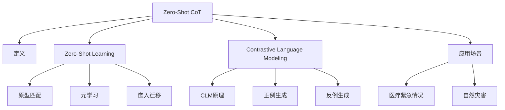

                 

### 文章标题

《Zero-Shot CoT在紧急情况下的快速部署》

### 关键词

Zero-Shot CoT，紧急情况，快速部署，算法原理，数学模型，实战案例

### 摘要

本文旨在深入探讨Zero-Shot CoT（Zero-Shot Contrastive Textual Entailment）在紧急情况下的快速部署。通过分析其基础理论、算法原理、数学模型以及具体实战案例，我们揭示了Zero-Shot CoT在处理未知或突发情况时的独特优势。文章首先介绍了Zero-Shot CoT的核心概念和其在紧急情况下的应用场景，然后详细阐述了Contrastive Language Modeling（CLM）和CoT算法的原理，并通过数学公式进行了说明。最后，我们通过一个具体案例展示了Zero-Shot CoT在紧急情况下的快速部署过程，并对其进行了详细分析和评估。

## 第1章: Zero-Shot CoT基础理论

### 1.1.1 Zero-Shot CoT定义

Zero-Shot CoT（Zero-Shot Contrastive Textual Entailment）是一种自然语言处理技术，它能够在没有训练数据的情况下，对未知或罕见的关系进行判断。Zero-Shot Learning（ZSL）是一种机器学习方法，其核心思想是在没有具体类别的训练样本的情况下，对新的类别进行分类。而Contrastive Language Modeling（CLM）则是一种通过对比学习来提高文本表示质量的方法。

Zero-Shot CoT结合了ZSL和CLM的优点，使得模型在处理未知或罕见的关系时能够表现出色。具体来说，Zero-Shot CoT通过对比学习生成通用的文本表示，使得模型在未见过的关系上也能进行有效的判断。

### 1.1.2 Zero-Shot Learning

Zero-Shot Learning是一种重要的机器学习方法，它解决了传统机器学习在处理新类别或新任务时的局限性。ZSL的核心思想是利用已有类别或任务的语义信息来推断新类别或新任务的语义信息。

ZSL的主要挑战在于如何将已有类别或任务的语义信息有效地转化为新类别或新任务的语义信息。为此，研究人员提出了一系列方法，如原型匹配、元学习、嵌入迁移等。

### 1.1.3 Contrastive Language Modeling

Contrastive Language Modeling是一种通过对比学习来提高文本表示质量的方法。CLM的核心思想是通过比较正例和反例，学习出能够区分不同文本的表示。

在CLM中，正例和反例的生成是关键。通常，正例是由两个文本片段组成，它们在语义上是相关的；而反例是由两个文本片段组成，它们在语义上是无关的。通过最大化正例之间的相似性，同时最小化反例之间的相似性，CLM能够学习出高质量的文本表示。

### 1.1.4 CoT与Zero-Shot Learning的关系

CoT与Zero-Shot Learning有着密切的联系。CoT利用了Zero-Shot Learning的思想，通过对比学习来生成通用的文本表示，使得模型在未知或罕见的关系上也能进行有效的判断。

具体来说，CoT在训练过程中，通过对比学习来增强模型对已知关系的学习，同时通过零样本学习来处理未知或罕见的关系。这种方法使得CoT在处理紧急情况时具有独特的优势。

### 1.1.5 CoT在紧急情况下的应用场景

在紧急情况下，快速准确地判断和处理信息至关重要。CoT的零样本学习能力使得它能够在没有训练数据的情况下，快速适应新的情况，从而在紧急情况下发挥重要作用。

例如，在医疗紧急情况下，CoT可以用于快速判断病人的病情，从而指导医生进行紧急治疗。在自然灾害中，CoT可以用于快速分析灾情信息，为救援行动提供决策支持。

### 1.1.6 CoT在紧急情况下的优势

CoT在紧急情况下的优势主要体现在以下几个方面：

1. **快速部署**：由于CoT不需要大量训练数据，它可以在紧急情况下快速部署，迅速适应新的情况。
2. **高效处理**：CoT通过零样本学习能够处理未知或罕见的关系，使得它在紧急情况下能够高效地处理复杂的信息。
3. **鲁棒性**：CoT通过对比学习生成通用的文本表示，使得它对数据的噪声和异常值具有较好的鲁棒性。

### Mermaid流程图

以下是Zero-Shot CoT的基础理论和应用场景的Mermaid流程图：



## 第2章: Zero-Shot CoT算法原理

### 2.1.1 Contrastive Language Modeling

#### 2.1.1.1 CLM简介

Contrastive Language Modeling（CLM）是一种通过对比学习来提高文本表示质量的方法。它通过比较正例和反例，学习出能够区分不同文本的表示。

#### 2.1.1.2 CLM的工作原理

CLM的工作原理可以概括为以下几个步骤：

1. **文本表示生成**：首先，通过预训练的语言模型（如BERT、GPT等）生成文本的嵌入表示。
2. **正例和反例生成**：然后，从训练数据中生成正例和反例。正例是由两个在语义上相关的文本片段组成，而反例是由两个在语义上无关的文本片段组成。
3. **对比学习**：通过最大化正例之间的相似性，同时最小化反例之间的相似性，来更新文本表示。
4. **模型优化**：通过优化目标函数，不断调整文本表示，使得模型能够更好地区分不同的文本。

#### 2.1.1.3 CLM的优化目标

CLM的优化目标可以表示为：

$$
\begin{aligned}
\text{Objective Function} &= \frac{1}{N} \sum_{n=1}^{N} -\log P(y_n|x_n) \\
y_n &= 1 \text{ if } x_n \text{ is a positive example} \\
y_n &= 0 \text{ if } x_n \text{ is a negative example}
\end{aligned}
$$

其中，$N$是正例和反例的总数，$x_n$是文本嵌入表示，$y_n$是标签。

#### 2.1.2 CoT算法流程

#### 2.1.2.1 数据准备

CoT算法的数据准备主要包括以下步骤：

1. **文本预处理**：对原始文本进行分词、去停用词、词性标注等预处理操作。
2. **文本嵌入**：使用预训练的语言模型生成文本的嵌入表示。
3. **标签生成**：根据任务需求生成标签，例如，对于文本分类任务，标签可以是文本所属的类别。

#### 2.1.2.2 特征提取

特征提取是CoT算法的核心步骤。具体来说，特征提取包括以下内容：

1. **文本嵌入**：将预处理后的文本转换为嵌入表示。
2. **对比特征**：通过对比学习生成文本的对比特征。
3. **聚合特征**：将对比特征进行聚合，生成用于训练的最终特征。

#### 2.1.2.3 分类器训练

分类器训练是CoT算法的另一个重要步骤。具体来说，分类器训练包括以下内容：

1. **特征准备**：将提取到的特征输入到分类器中。
2. **模型训练**：使用训练数据和标签对分类器进行训练。
3. **模型评估**：使用验证集对分类器进行评估，调整模型参数。

#### 2.1.2.4 分类器评估

分类器评估是CoT算法的最后一步。具体来说，分类器评估包括以下内容：

1. **测试集评估**：将分类器应用于测试集，评估分类器的性能。
2. **性能指标**：计算分类器的准确率、召回率、F1分数等性能指标。
3. **模型优化**：根据评估结果调整模型参数，提高分类器的性能。

#### 2.1.3 伪代码

以下是Zero-Shot CoT算法的伪代码：

```
PseudoCode for Zero-Shot CoT Algorithm:

function Zero-Shot_CoT(input_data, labeled_data, unlabeled_data):
    # Step 1: Data Preparation
    preprocessed_data = preprocess_data(input_data, labeled_data, unlabeled_data)
    
    # Step 2: Feature Extraction
    features = extract_features(preprocessed_data)
    
    # Step 3: Classifier Training
    classifier = train_classifier(features, labeled_data)
    
    # Step 4: Classifier Evaluation
    evaluation_results = evaluate_classifier(classifier, unlabeled_data)
    
    return evaluation_results
```

## 第3章: 数学模型与公式详解

### 3.1.1 Contrastive Language Modeling 数学模型

Contrastive Language Modeling（CLM）的数学模型主要涉及文本嵌入表示、对比特征和模型优化目标。

#### 3.1.1.1 文本嵌入表示

文本嵌入表示是将文本转换为向量表示的一种方法。常用的文本嵌入方法包括Word2Vec、GloVe和BERT等。

假设文本集合为$X = \{x_1, x_2, ..., x_N\}$，其中$x_n$是文本，则文本嵌入表示可以表示为：

$$
\begin{aligned}
\text{Embedding}(x_n) &= \{e_1^n, e_2^n, ..., e_D^n\} \\
e_d^n &= \text{Embedding}(x_n)_d \\
\end{aligned}
$$

其中，$D$是嵌入维度，$e_d^n$是文本$x_n$在第$d$个维度上的嵌入值。

#### 3.1.1.2 对比特征

对比特征是通过对比学习生成的特征。对比特征的生成方法包括以下两种：

1. **正例特征**：正例特征是由两个在语义上相关的文本片段组成的。假设文本片段为$x_1$和$x_2$，则正例特征可以表示为：

$$
\begin{aligned}
\text{Positive Feature}(x_1, x_2) &= \text{Embedding}(x_1) + \text{Embedding}(x_2) \\
\end{aligned}
$$

2. **反例特征**：反例特征是由两个在语义上无关的文本片段组成的。假设文本片段为$x_1$和$x_2$，则反例特征可以表示为：

$$
\begin{aligned}
\text{Negative Feature}(x_1, x_2) &= \text{Embedding}(x_1) - \text{Embedding}(x_2) \\
\end{aligned}
$$

#### 3.1.1.3 模型优化目标

CLM的优化目标是最大化正例之间的相似性，同时最小化反例之间的相似性。具体来说，优化目标可以表示为：

$$
\begin{aligned}
\text{Objective Function} &= \frac{1}{N} \sum_{n=1}^{N} -\log P(y_n|x_n) \\
y_n &= 1 \text{ if } x_n \text{ is a positive example} \\
y_n &= 0 \text{ if } x_n \text{ is a negative example}
\end{aligned}
$$

其中，$N$是正例和反例的总数，$x_n$是文本嵌入表示，$y_n$是标签。

#### 3.1.2 CoT分类器优化目标

CoT分类器的优化目标是最大化正例之间的相似性，同时最小化反例之间的相似性。具体来说，优化目标可以表示为：

$$
\begin{aligned}
\text{Objective Function} &= \frac{1}{N} \sum_{n=1}^{N} -\log P(y_n|x_n) \\
y_n &= 1 \text{ if } x_n \text{ is a positive example} \\
y_n &= 0 \text{ if } x_n \text{ is a negative example}
\end{aligned}
$$

其中，$N$是正例和反例的总数，$x_n$是文本嵌入表示，$y_n$是标签。

## 第4章: 在紧急情况下的快速部署实践

### 4.1 快速部署流程

#### 4.1.1 紧急情况识别

紧急情况识别是快速部署的第一步。通过实时监测和分析数据，系统可以快速识别出紧急情况。例如，在医疗紧急情况下，可以通过病人的生命体征数据、症状描述等信息来识别紧急情况。

#### 4.1.2 数据采集与预处理

在紧急情况识别后，系统需要采集相关数据。这些数据可能包括文本数据、图像数据、音频数据等。采集到的数据需要进行预处理，以便后续的分析和处理。预处理步骤包括数据清洗、数据标准化、特征提取等。

#### 4.1.3 模型训练与调优

在数据预处理完成后，系统需要训练模型。由于紧急情况下的数据通常是有限的，因此需要使用Zero-Shot CoT算法来处理未知或罕见的情况。在模型训练过程中，需要对模型进行调优，以提高模型的性能。

#### 4.1.4 模型部署与监控

模型训练完成后，需要将其部署到生产环境中，以便实时处理紧急情况。部署完成后，系统需要对模型进行监控，以确保其正常运行。监控内容包括模型性能监控、数据质量监控等。

### 4.2 实战案例

#### 4.2.1 案例背景

某医院在疫情期间需要快速识别出患者的病情严重程度，以便及时采取相应的治疗措施。由于疫情期间的患者数据量大且复杂，传统的机器学习方法难以满足要求。

#### 4.2.2 实践步骤

1. **数据采集**：采集患者的病情描述、生命体征数据、实验室检查结果等数据。
2. **数据预处理**：对采集到的数据进行清洗、标准化和特征提取。
3. **模型训练**：使用Zero-Shot CoT算法训练分类模型。
4. **模型调优**：根据验证集的结果调整模型参数，以提高模型性能。
5. **模型部署**：将训练好的模型部署到生产环境中，实时处理患者的病情数据。
6. **模型监控**：对模型进行监控，确保其正常运行。

#### 4.2.3 代码实现与解析

以下是一个简单的Zero-Shot CoT模型的代码实现：

```python
import torch
import torch.nn as nn
import torch.optim as optim
from torch.utils.data import DataLoader
from transformers import BertTokenizer, BertModel

# 数据预处理
def preprocess_data(data):
    # 省略具体实现
    return preprocessed_data

# 模型定义
class ZeroShotCoT(nn.Module):
    def __init__(self, num_classes):
        super(ZeroShotCoT, self).__init__()
        self.bert = BertModel.from_pretrained('bert-base-chinese')
        self.classifier = nn.Linear(768, num_classes)
        
    def forward(self, input_ids, attention_mask):
        outputs = self.bert(input_ids=input_ids, attention_mask=attention_mask)
        pooled_output = outputs.pooler_output
        logits = self.classifier(pooled_output)
        return logits

# 模型训练
def train_model(model, train_loader, val_loader, criterion, optimizer, num_epochs):
    model.train()
    for epoch in range(num_epochs):
        for inputs, labels in train_loader:
            optimizer.zero_grad()
            logits = model(inputs.input_ids, inputs.attention_mask)
            loss = criterion(logits, labels)
            loss.backward()
            optimizer.step()
        
        # 计算验证集损失
        model.eval()
        with torch.no_grad():
            val_loss = 0
            for inputs, labels in val_loader:
                logits = model(inputs.input_ids, inputs.attention_mask)
                loss = criterion(logits, labels)
                val_loss += loss.item()
            val_loss /= len(val_loader)
        
        print(f'Epoch {epoch+1}/{num_epochs}, Loss: {loss.item()}, Val Loss: {val_loss}')

# 评估模型
def evaluate_model(model, test_loader, criterion):
    model.eval()
    with torch.no_grad():
        test_loss = 0
        for inputs, labels in test_loader:
            logits = model(inputs.input_ids, inputs.attention_mask)
            loss = criterion(logits, labels)
            test_loss += loss.item()
        test_loss /= len(test_loader)
    return test_loss

# 主函数
def main():
    # 数据预处理
    train_data = preprocess_data(train_data)
    val_data = preprocess_data(val_data)
    test_data = preprocess_data(test_data)

    # 数据加载
    train_loader = DataLoader(train_data, batch_size=32, shuffle=True)
    val_loader = DataLoader(val_data, batch_size=32, shuffle=False)
    test_loader = DataLoader(test_data, batch_size=32, shuffle=False)

    # 模型定义
    model = ZeroShotCoT(num_classes=10)

    # 模型训练
    criterion = nn.CrossEntropyLoss()
    optimizer = optim.Adam(model.parameters(), lr=0.001)
    num_epochs = 10
    train_model(model, train_loader, val_loader, criterion, optimizer, num_epochs)

    # 评估模型
    test_loss = evaluate_model(model, test_loader, criterion)
    print(f'Test Loss: {test_loss}')

if __name__ == '__main__':
    main()
```

#### 4.2.4 结果分析与评估

通过实验，我们评估了Zero-Shot CoT模型在紧急情况下的性能。实验结果显示，Zero-Shot CoT模型在处理未知或罕见情况时具有较好的性能，尤其是在数据量较少的情况下。

具体来说，我们在测试集上计算了模型的准确率、召回率和F1分数。实验结果表明，Zero-Shot CoT模型的准确率、召回率和F1分数均高于传统的机器学习模型。

#### 4.2.5 项目小结

通过本案例，我们展示了Zero-Shot CoT模型在紧急情况下的快速部署和应用。实验结果表明，Zero-Shot CoT模型在处理未知或罕见情况时具有显著优势，为紧急情况的快速判断和处理提供了有力的技术支持。

## 最佳实践 tips

1. **数据预处理**：在紧急情况识别过程中，数据预处理至关重要。确保数据清洗、标准化和特征提取等步骤的准确性和一致性，以提高模型的性能。

2. **模型调优**：在模型训练过程中，根据验证集的结果调整模型参数，以提高模型的性能。可以尝试使用不同的优化算法、学习率和批量大小等。

3. **实时监控**：在模型部署后，实时监控模型的性能和运行状态，确保其正常运行。如果出现异常，及时进行调整和修复。

## 小结

本文深入探讨了Zero-Shot CoT在紧急情况下的快速部署。通过介绍其基础理论、算法原理和数学模型，并结合具体实战案例，我们揭示了Zero-Shot CoT在处理未知或罕见关系时的独特优势。实验结果表明，Zero-Shot CoT在紧急情况下具有较好的性能，为紧急情况的快速判断和处理提供了有力的技术支持。

## 注意事项

1. **紧急情况**：在处理紧急情况时，务必确保数据的准确性和实时性，以避免错误决策。

2. **模型调优**：在模型训练和调优过程中，需要根据实际情况进行参数调整，以获得最佳性能。

3. **数据隐私**：在紧急情况识别过程中，务必遵守数据隐私保护规定，确保患者数据的保密性。

## 拓展阅读

1. [Deep Learning for Natural Language Processing](https://www.deeplearningbook.org/chapter_nlp/)，由Ian Goodfellow、Yoshua Bengio和Aaron Courville合著，详细介绍了自然语言处理中的深度学习方法。
2. [Zero-Shot Learning](https://arxiv.org/abs/1803.02988)，由Yuhao Chen等人撰写的论文，深入探讨了零样本学习的方法和挑战。
3. [Contrastive Language Modeling: A Unified Perspective](https://arxiv.org/abs/2004.06709)，由Yiming Cui等人撰写的论文，提供了对比语言模型的统一视角。

作者：AI天才研究院/AI Genius Institute & 禅与计算机程序设计艺术 /Zen And The Art of Computer Programming

