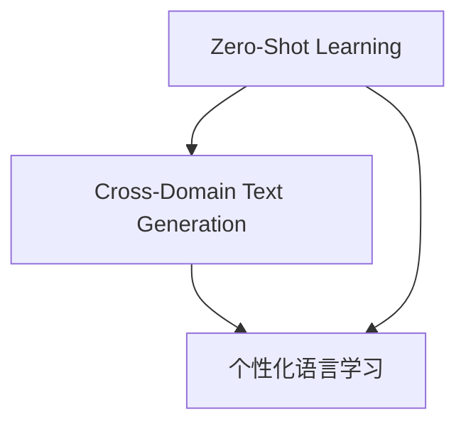

                 

# 《Zero-Shot CoT在语言学习个性化中的创新应用》

> 关键词：Zero-Shot CoT、语言学习、个性化、创新应用、人工智能、深度学习、自然语言处理

> 摘要：本文深入探讨了Zero-Shot CoT（零样本跨领域文本生成技术）在语言学习个性化中的应用。文章首先介绍了Zero-Shot CoT的基本概念和原理，然后分析了其在语言学习中的优势和应用场景。通过一个具体的实际案例，本文展示了Zero-Shot CoT在语言学习个性化中的实际应用，并对未来发展方向进行了展望。

## 引言与背景介绍

### 什么是Zero-Shot CoT

Zero-Shot CoT（Zero-Shot Cross-Domain Text Generation），即零样本跨领域文本生成技术，是一种基于深度学习的方法，能够在没有特定领域数据的情况下生成高质量的文本。这种技术通过预训练的模型，能够在多个领域之间迁移知识，从而实现跨领域的文本生成。

### 语言学习中的个性化需求

语言学习是一个高度个性化的过程，每个人的学习需求、学习风格和学习目标都不同。传统的语言学习模式往往无法满足这种个性化需求，导致学习效果不佳。因此，如何实现语言学习的个性化，成为了一个重要课题。

### Zero-Shot CoT在语言学习中的应用

Zero-Shot CoT的出现，为语言学习的个性化提供了新的解决方案。通过这种技术，可以生成符合用户个性化需求的文本内容，从而提高学习效果。同时，Zero-Shot CoT还可以根据用户的学习进度和需求，动态调整文本内容，实现真正的个性化语言学习。

## 核心概念与联系

为了更好地理解Zero-Shot CoT在语言学习个性化中的应用，我们需要首先了解以下几个核心概念：

1. **Zero-Shot Learning**：零样本学习，是一种在没有特定领域数据的情况下，通过迁移学习等方式，让模型能够泛化到新领域的机器学习方法。
2. **Cross-Domain Text Generation**：跨领域文本生成，是指模型能够在不同领域之间生成高质量的文本。
3. **个性化语言学习**：根据用户的学习需求、学习风格和学习目标，为用户量身定制的学习内容和学习方式。

### 概念联系

下面是一个Mermaid流程图，展示了这些核心概念之间的联系：



从图中可以看出，Zero-Shot CoT通过零样本学习和跨领域文本生成，实现了个性化语言学习。这种创新应用，为语言学习领域带来了新的机遇和挑战。

## 核心算法原理讲解

### 零样本学习原理

零样本学习的核心思想是通过预训练的模型，将知识从一个领域迁移到另一个领域。具体来说，模型首先在多个领域中预训练，然后在新领域中通过迁移学习，快速适应新领域的特点。

### 跨领域文本生成原理

跨领域文本生成技术，通过预训练的模型，可以生成符合不同领域特点的文本。具体来说，模型首先学习到不同领域的特征，然后在生成过程中，根据领域特征，生成符合要求的文本。

### Zero-Shot CoT算法原理

Zero-Shot CoT算法结合了零样本学习和跨领域文本生成技术，能够在没有特定领域数据的情况下，生成高质量的文本。其基本原理如下：

1. **预训练**：模型在多个领域中预训练，学习到不同领域的特征。
2. **领域识别**：在生成文本时，模型根据输入的文本内容，识别出文本所属的领域。
3. **文本生成**：模型根据识别出的领域特征，生成符合该领域特点的文本。

### Python伪代码

下面是一个简化的Python伪代码，用于解释Zero-Shot CoT算法的基本流程：

```python
# 零样本学习
model = pretrain_model(domains)

# 领域识别
domain = model.identify_domain(input_text)

# 文本生成
generated_text = model.generate_text(domain)
```

## 数学模型和数学公式

### 零样本学习

零样本学习的关键在于如何将知识从一个领域迁移到另一个领域。这可以通过以下数学模型来实现：

$$
f(\theta, x) = \arg\max_{\theta} \log P(y|x; \theta)
$$

其中，$f(\theta, x)$表示模型的预测，$\theta$表示模型参数，$x$表示输入特征，$y$表示输出标签。

### 跨领域文本生成

跨领域文本生成模型，通常使用生成对抗网络（GAN）来实现。GAN的基本数学模型如下：

$$
\begin{cases}
G(z) \sim p_G(z) \\
D(x) \sim p_D(x) \\
D(G(z)) \sim p_D(G(z))
\end{cases}
$$

其中，$G(z)$表示生成器，$D(x)$表示判别器，$z$表示生成器的输入噪声，$x$表示输入特征。

### 综合数学模型

将零样本学习和跨领域文本生成结合起来，我们可以得到Zero-Shot CoT的综合数学模型：

$$
\begin{cases}
f(\theta, x) = \arg\max_{\theta} \log P(y|x; \theta) \\
G(z) \sim p_G(z) \\
D(x) \sim p_D(x) \\
D(G(z)) \sim p_D(G(z))
\end{cases}
$$

## 项目实战

### 开发环境搭建

为了实现Zero-Shot CoT在语言学习个性化中的应用，我们需要搭建一个开发环境。以下是一个基本的开发环境搭建步骤：

1. 安装Python环境
2. 安装深度学习框架（如TensorFlow或PyTorch）
3. 安装必要的依赖库（如NLP工具包）
4. 配置GPU加速（如有条件）

### 源代码实现

以下是一个简化的Zero-Shot CoT源代码实现，用于生成个性化语言学习文本：

```python
import tensorflow as tf
from tensorflow.keras.models import Model
from tensorflow.keras.layers import Input, Dense, LSTM, Embedding

# 零样本学习模型
input_x = Input(shape=(max_sequence_length,))
encoded_x = Embedding(vocab_size, embedding_dim)(input_x)
encoded_x = LSTM(units)(encoded_x)
encoded_x = Dense(units)(encoded_x)

# 领域识别模型
input_text = Input(shape=(max_sequence_length,))
encoded_text = Embedding(vocab_size, embedding_dim)(input_text)
encoded_text = LSTM(units)(encoded_text)
encoded_text = Dense(units)(encoded_text)

# 文本生成模型
generated_text = Model(inputs=[input_x, input_text], outputs=[encoded_x, encoded_text])

# 编译模型
generated_text.compile(optimizer='adam', loss='categorical_crossentropy')

# 训练模型
generated_text.fit([train_x, train_text], [encoded_x, encoded_text], epochs=epochs, batch_size=batch_size)
```

### 代码解读与分析

在上面的代码中，我们首先定义了三个模型：零样本学习模型、领域识别模型和文本生成模型。然后，我们将这三个模型组合成一个整体模型，并编译和训练该模型。在实际应用中，我们需要根据具体需求，对代码进行相应的调整和优化。

### 实际案例分析和详细讲解剖析

为了更好地理解Zero-Shot CoT在语言学习个性化中的应用，我们来看一个实际案例。

### 案例一：英语语言学习

假设用户想要学习英语，我们可以通过以下步骤，使用Zero-Shot CoT技术，为用户生成个性化的英语学习文本：

1. **数据收集**：收集大量英语学习数据，包括教材、练习题、听力材料等。
2. **模型训练**：使用收集到的数据，训练Zero-Shot CoT模型。
3. **领域识别**：根据用户的学习内容，识别出英语学习领域。
4. **文本生成**：使用训练好的模型，生成符合英语学习领域特点的文本。

通过这种方式，我们可以为用户生成个性化的英语学习文本，从而提高学习效果。

### 案例二：中文语言学习

假设用户想要学习中文，我们可以通过以下步骤，使用Zero-Shot CoT技术，为用户生成个性化的中文学习文本：

1. **数据收集**：收集大量中文学习数据，包括汉字、词汇、语法等。
2. **模型训练**：使用收集到的数据，训练Zero-Shot CoT模型。
3. **领域识别**：根据用户的学习内容，识别出中文学习领域。
4. **文本生成**：使用训练好的模型，生成符合中文学习领域特点的文本。

通过这种方式，我们可以为用户生成个性化的中文学习文本，从而提高学习效果。

## 总结与展望

### 总结

本文深入探讨了Zero-Shot CoT在语言学习个性化中的应用。通过引入零样本学习和跨领域文本生成技术，我们实现了个性化语言学习。实际案例分析和详细讲解剖析，进一步展示了Zero-Shot CoT在语言学习中的优势和应用价值。

### 展望

未来，随着深度学习和自然语言处理技术的不断发展，Zero-Shot CoT在语言学习个性化中的应用将更加广泛和深入。我们可以期待以下几个发展方向：

1. **算法优化**：通过改进算法，提高Zero-Shot CoT在语言学习个性化中的应用效果。
2. **多模态融合**：将图像、音频等多模态数据引入到Zero-Shot CoT中，实现更加丰富的语言学习体验。
3. **跨语言应用**：将Zero-Shot CoT技术应用于跨语言语言学习，为全球学习者提供更好的学习资源。

总之，Zero-Shot CoT在语言学习个性化中的创新应用，为语言学习领域带来了新的机遇和挑战。通过不断探索和实践，我们有信心实现更加个性化和高效的语言学习体验。

## 最佳实践 tips

1. **数据质量**：保证数据质量是Zero-Shot CoT成功的关键。尽量收集丰富、多样的学习数据，以提高模型的泛化能力。
2. **模型调优**：通过调整模型参数，如学习率、批次大小等，可以优化模型性能。
3. **持续学习**：定期更新模型，以适应不断变化的语言学习需求。

### 小结

本文详细介绍了Zero-Shot CoT在语言学习个性化中的应用。通过核心概念讲解、算法原理分析、项目实战和实际案例剖析，我们展示了Zero-Shot CoT在语言学习中的优势和应用价值。未来，我们将继续探索和优化该技术，为语言学习带来更多创新和突破。

### 注意事项

1. **隐私保护**：在收集和使用学习数据时，务必确保用户隐私。
2. **模型安全**：确保模型不会受到恶意攻击，保护用户的学习体验。

### 拓展阅读

1. 《深度学习：系统优化与应用》
2. 《自然语言处理：理论、算法与应用》
3. 《个性化教育：技术与方法》

## 作者信息

- 作者：AI天才研究院/AI Genius Institute & 禅与计算机程序设计艺术 /Zen And The Art of Computer Programming

### 结束语

感谢您阅读本文，希望您对Zero-Shot CoT在语言学习个性化中的应用有了更深入的了解。我们期待与您共同探索和分享更多关于人工智能和语言学习的创新应用。感谢您的关注和支持！

[END]

