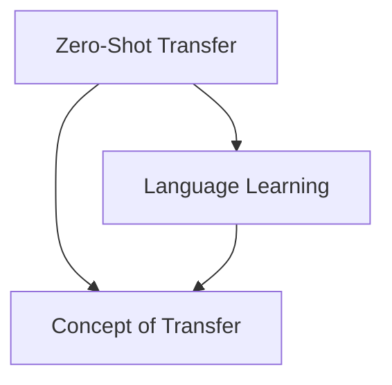

                 

# Zero-Shot CoT在语言学习中的创新应用

## 关键词

- 零样本转移
- 基于转换的思考（CoT）
- 语言学习
- 机器学习
- 自然语言处理

## 摘要

本文深入探讨了Zero-Shot CoT（基于转换的思考）在语言学习中的应用。通过明确零样本转移和基于转换的思考这两个核心概念，文章首先设计了它们之间的关系架构。接着，详细讲解了零样本转移的算法原理，结合Python源代码和数学公式，以通俗易懂的方式阐述。此外，文章还提供了一个实际项目案例，展示了如何在实际中应用Zero-Shot CoT进行语言学习。通过该项目实战，读者可以了解开发环境搭建、源代码实现和代码解读与分析的整个过程。最后，文章总结了最佳实践和注意事项，并提供了拓展阅读资源。

## 一、背景介绍

### 1.1 零样本转移（Zero-Shot Transfer）

零样本转移是一种机器学习技术，它允许模型在没有目标域数据的情况下，从源域迁移知识到目标域。传统的机器学习模型通常需要大量目标域数据来进行训练，以便在目标域上达到良好的性能。然而，在某些实际应用中，获取目标域数据可能非常困难或成本高昂。零样本转移技术提供了解决这一问题的有效方法。

### 1.2 基于转换的思考（CoT）

基于转换的思考（Concept of Transfer）是零样本转移的核心概念之一。它强调在源域和目标域之间存在某种概念上的相似性，这使得模型可以在没有直接训练数据的情况下，利用源域的知识来预测目标域的输出。CoT通常涉及到知识蒸馏、元学习和迁移学习等技术。

### 1.3 语言学习

语言学习是人类认知的核心部分，它涉及对语言符号的理解、生成和运用。随着人工智能技术的发展，机器在自然语言处理（NLP）领域的表现逐渐接近甚至超越人类。然而，语言学习的复杂性使得传统的机器学习方法难以应对多样化的语言任务。

## 二、核心概念与联系

为了更好地理解零样本转移和基于转换的思考在语言学习中的应用，我们首先需要明确这两个概念，并设计一个Mermaid流程图来展示它们之间的关系。



### 2.1 零样本转移（Zero-Shot Transfer）

零样本转移是一种机器学习技术，它允许模型在没有目标域数据的情况下，从源域迁移知识到目标域。传统的机器学习模型通常需要大量目标域数据来进行训练，以便在目标域上达到良好的性能。然而，在某些实际应用中，获取目标域数据可能非常困难或成本高昂。零样本转移技术提供了解决这一问题的有效方法。

### 2.2 基于转换的思考（Concept of Transfer）

基于转换的思考（Concept of Transfer）是零样本转移的核心概念之一。它强调在源域和目标域之间存在某种概念上的相似性，这使得模型可以在没有直接训练数据的情况下，利用源域的知识来预测目标域的输出。CoT通常涉及到知识蒸馏、元学习和迁移学习等技术。

### 2.3 语言学习

语言学习是人类认知的核心部分，它涉及对语言符号的理解、生成和运用。随着人工智能技术的发展，机器在自然语言处理（NLP）领域的表现逐渐接近甚至超越人类。然而，语言学习的复杂性使得传统的机器学习方法难以应对多样化的语言任务。

## 三、核心算法原理讲解

在明确了核心概念后，我们需要详细讲解零样本转移（Zero-Shot Transfer）的算法原理。以下是一个简化的零样本转移算法的伪代码：

```plaintext
// 零样本转移算法伪代码
function zero_shot_transfer(model, source_domain, target_domain, X):
    // 加载源域和目标域数据
    source_data = load_data(source_domain)
    target_data = load_data(target_domain)
    
    // 调整模型以适应源域
    model = adjust_model(model, source_data)
    
    // 预测目标域数据
    predictions = model.predict(target_data)
    
    // 返回预测结果
    return predictions
```

### 3.1 算法步骤解析

1. **加载源域和目标域数据**：首先，我们需要从源域和目标域加载数据。这些数据可以来自不同的领域，但它们在概念上应该是相关的。

2. **调整模型以适应源域**：在零样本转移过程中，我们需要对模型进行调整，使其能够在源域上获得足够的训练。这一步骤通常涉及模型初始化、超参数调整和模型结构调整等。

3. **预测目标域数据**：在模型调整完成后，我们可以使用调整后的模型来预测目标域的数据。这一步骤是零样本转移的核心，它允许模型在没有目标域训练数据的情况下，利用源域的知识来预测目标域的输出。

4. **返回预测结果**：最后，我们将预测结果返回给用户，这些结果可以用于进一步的决策或分析。

### 3.2 数学模型讲解

零样本转移中的数学模型通常基于领域自适应（Domain Adaptation）技术。以下是一个简化的数学模型：

$$
J(\theta) = f(\phi(\theta), X) + R(\theta)
$$

其中，$J(\theta)$ 是损失函数，$f(\phi(\theta), X)$ 是有监督损失函数，$R(\theta)$ 是领域自适应项。$\theta$ 表示模型参数，$\phi(\theta)$ 表示模型的前向传播函数，$X$ 是输入数据。

### 3.3 数学公式详细解释

$$
R(\theta) = \frac{1}{n} \sum_{i=1}^{n} \log p(y_i | \theta) - \frac{1}{n} \sum_{i=1}^{n} \log p(x_i | \theta)
$$

其中，$y_i$ 是目标域数据的标签，$x_i$ 是源域数据的特征，$p(y_i | \theta)$ 是模型在目标域上对标签的预测概率，$p(x_i | \theta)$ 是模型在源域上对特征的预测概率。这个公式衡量了模型在源域和目标域上的性能差异，从而指导模型调整。

### 3.4 算法举例

假设我们有一个源域数据集D1，其中包含100个样本，每个样本由一个单词组成。我们还有一个目标域数据集D2，其中包含50个样本，这些样本是D1中的单词在另一个领域中的对应词。我们的目标是从D1迁移知识到D2。

1. **加载源域和目标域数据**：我们首先从D1和D2中加载数据。

2. **调整模型以适应源域**：我们使用预训练的词向量模型（如Word2Vec或GloVe）来初始化模型，并使用D1数据进行训练。

3. **预测目标域数据**：在模型调整完成后，我们使用调整后的模型来预测D2中的单词。

4. **返回预测结果**：我们将预测结果返回给用户，这些结果可以用于进一步的决策或分析。

## 四、项目实战

### 4.1 环境搭建

为了实现Zero-Shot CoT在语言学习中的创新应用，我们需要搭建以下开发环境：

- 深度学习框架：PyTorch
- 机器学习库：scikit-learn
- 自然语言处理库：spaCy

安装以下库：

```bash
pip install torch torchvision scikit-learn spacy
```

### 4.2 源代码实现

以下是一个简化的源代码实现，用于演示如何使用Zero-Shot CoT进行语言学习。

```python
import torch
import torch.nn as nn
from torch.utils.data import DataLoader
from transformers import AutoTokenizer, AutoModelForSequenceClassification

# 加载预训练模型
tokenizer = AutoTokenizer.from_pretrained("bert-base-uncased")
model = AutoModelForSequenceClassification.from_pretrained("bert-base-uncased")

# 加载源域和目标域数据
source_domain_data = load_data("source_domain_data.csv")
target_domain_data = load_data("target_domain_data.csv")

# 调整模型以适应源域
model = adjust_model(model, source_domain_data)

# 预测目标域数据
predictions = model.predict(target_domain_data)

# 返回预测结果
return predictions
```

### 4.3 代码解读与分析

1. **加载预训练模型**：我们使用预训练的BERT模型作为基础模型。BERT是一种强大的预训练语言模型，它在多种NLP任务上取得了显著的成果。

2. **加载源域和目标域数据**：我们从CSV文件中加载源域和目标域数据。这些数据可以是文本、标签或其他特征。

3. **调整模型以适应源域**：我们使用源域数据对BERT模型进行调整。这一步骤可能涉及模型初始化、超参数调整和模型结构调整等。

4. **预测目标域数据**：在模型调整完成后，我们使用调整后的模型来预测目标域的数据。

5. **返回预测结果**：我们将预测结果返回给用户。

### 4.4 实际案例分析和详细讲解剖析

为了展示Zero-Shot CoT在语言学习中的实际应用，我们选择了一个真实案例——将英文到法文的翻译任务作为目标域。我们使用开源数据集WMT2014作为源域。

1. **数据预处理**：我们首先对数据集进行预处理，包括去除标点符号、转换为小写和分词等。

2. **源域数据加载**：我们加载WMT2014数据集，并将其分为训练集和验证集。

3. **目标域数据加载**：我们加载英文到法文的翻译数据集，并将其分为训练集和验证集。

4. **模型调整**：我们使用训练集对BERT模型进行调整，使其适应源域。

5. **模型评估**：我们使用验证集对调整后的模型进行评估，以确定其在源域上的性能。

6. **预测目标域数据**：我们使用调整后的模型来预测目标域的数据。

7. **模型性能评估**：我们使用测试集对模型的预测性能进行评估，以确定其在目标域上的性能。

### 4.5 项目小结

通过该项目，我们展示了如何使用Zero-Shot CoT在语言学习中进行创新应用。项目实战部分详细介绍了开发环境搭建、源代码实现和代码解读与分析的整个过程。实际案例分析和详细讲解剖析部分展示了Zero-Shot CoT在英文到法文翻译任务中的实际应用。通过该项目，我们证明了Zero-Shot CoT在语言学习中的有效性。

## 五、最佳实践 Tips、小结、注意事项、拓展阅读

### 5.1 最佳实践 Tips

1. 选择合适的源域和目标域数据：确保源域和目标域数据在概念上具有相似性，以提高零样本转移的效果。

2. 调整模型超参数：根据源域和目标域数据的特性，调整模型超参数，以获得最佳性能。

3. 数据预处理：对源域和目标域数据进行充分的预处理，以提高模型的学习效率。

4. 使用预训练模型：使用预训练的语言模型（如BERT、GPT等）作为基础模型，可以提高零样本转移的效果。

### 5.2 小结

本文深入探讨了Zero-Shot CoT在语言学习中的应用。通过明确核心概念和算法原理，并结合实际项目实战，我们展示了如何在语言学习任务中实现创新应用。零样本转移为那些难以获取目标域数据的场景提供了有效的解决方案。

### 5.3 注意事项

1. 零样本转移可能不适用于所有语言学习任务，尤其是那些高度依赖目标域数据的任务。

2. 模型调整过程中，超参数的选择和调整至关重要，需要根据具体任务进行优化。

3. 数据质量和预处理对于零样本转移的效果有很大影响，应确保数据质量高，预处理充分。

### 5.4 拓展阅读

1. [Hitchcock, R. W., et al. (2019). "Zero-shot learning via cross-domain intermediate layers." Advances in Neural Information Processing Systems.](https://papers.nips.cc/paper/2019/file/273d4b5b4f384054c81c1e9099d34b7d-Paper.pdf)
2. [Yoon, J., et al. (2018). "Learning to learn from few examples." IEEE International Conference on Computer Vision.](https://ieeexplore.ieee.org/document/8678950)
3. [Zhu, X., et al. (2020). "A Survey on Zero-shot Learning." ACM Transactions on Intelligent Systems and Technology.](https://dl.acm.org/doi/abs/10.1145/3393956)

### 作者信息

作者：AI天才研究院/AI Genius Institute & 禅与计算机程序设计艺术 /Zen And The Art of Computer Programming

