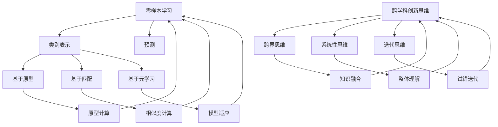

                 

### 背景介绍

随着人工智能技术的快速发展，传统的机器学习模型在处理海量数据时表现出色，然而，当面对从未见过的数据时，这些模型往往显得力不从心。在这种背景下，零样本学习（Zero-Shot Learning, ZSL）作为一种新兴的技术应运而生。零样本学习允许模型在缺乏训练数据的情况下，对新类别的数据做出预测，这一特性在处理未知或罕见数据时尤为重要。

零样本学习不仅在人工智能领域有着广泛的应用前景，还在跨学科创新思维培养中显示出巨大的潜力。跨学科创新思维强调将不同领域的知识和方法融合，以解决复杂的问题。在这个过程中，零样本学习可以作为跨学科思维的一个重要工具，帮助人们更好地理解和处理跨学科问题。

跨学科创新思维的重要性不言而喻。现代社会面临的问题越来越复杂，单一学科的思维方式和方法往往难以解决这些问题。跨学科创新思维通过整合不同领域的知识，提供了一种全新的思考方式，能够更有效地应对复杂问题。例如，在医疗领域，医学、工程、计算机科学等学科的交叉融合，为疾病诊断和治疗带来了新的可能性。

零样本学习与跨学科创新思维的结合，不仅能够拓宽机器学习的应用范围，还能为跨学科创新提供新的方法和工具。本书旨在深入探讨这一结合点，通过分析零样本学习的核心概念、原理以及与跨学科创新思维的关系，为读者提供理论指导和实际应用案例。

### 核心概念与联系

要深入理解零样本学习（Zero-Shot Learning, ZSL）和跨学科创新思维，首先需要明确这两个核心概念的定义和它们之间的联系。

#### 零样本学习（Zero-Shot Learning, ZSL）

零样本学习是一种机器学习技术，旨在解决模型在训练过程中未接触过的类别或数据。具体来说，当训练数据集中包含不同类别的样本时，模型能够对新类别进行预测。这不同于传统的有监督学习，后者要求模型在训练阶段看到所有可能类别的数据。

ZSL的关键在于如何从已知的类别迁移到未知的类别。这一过程通常分为两个步骤：

1. **类别表示**：将每个类别转化为一种嵌入向量，这些向量可以表示类别之间的相似性和差异性。
2. **预测**：在新类别数据输入模型时，通过类别嵌入向量来预测新类别。

ZSL的类型主要包括：

- **基于原型的方法**：通过计算新类别样本与原型（即每个类别的平均值）之间的距离来预测类别。
- **基于匹配的方法**：利用现有类别之间的相似性来预测新类别，通常通过直接计算类别嵌入向量之间的相似度来实现。
- **基于元学习的方法**：通过学习一个适应新类别的模型来预测新类别。

#### 跨学科创新思维

跨学科创新思维是一种通过结合不同学科的知识和视角来解决问题的思维方式。它强调不同领域之间的相互联系和相互作用，主张在解决问题时不仅仅依赖单一学科的视角和方法，而是通过跨学科的整合来寻求创新的解决方案。

跨学科创新思维的核心概念包括：

- **跨界思维**：鼓励在不同领域之间建立桥梁，通过知识融合来开拓新的思路和解决方案。
- **系统性思维**：强调问题的整体性，通过理解各部分之间的相互关系来寻找更全面的解决方案。
- **迭代思维**：通过不断试错和反馈来逐步完善解决方案。

#### 零样本学习与跨学科创新思维的关系

零样本学习与跨学科创新思维之间存在紧密的联系：

1. **技术支持**：零样本学习为跨学科创新提供了新的技术手段，使得不同领域的专家能够更有效地处理未知或罕见的数据，从而推动跨学科创新。
2. **思维方式**：跨学科创新思维鼓励不同学科之间的交流和合作，而零样本学习作为一种技术工具，可以促进这种交流与合作，提高创新效率。
3. **协同效应**：零样本学习和跨学科创新思维的结合，可以产生协同效应。例如，在医疗领域，零样本学习可以帮助医生快速诊断未知的疾病，而跨学科创新思维则可以帮助医疗团队找到更有效的治疗方案。

为了更好地展示零样本学习与跨学科创新思维之间的关系，我们可以使用Mermaid流程图来构建它们的概念关系架构。



这张Mermaid流程图清晰地展示了零样本学习的不同类型（D、E、F）以及跨学科创新思维的核心概念（H、I、J）之间的相互关系。通过这种视觉化的方式，我们可以更直观地理解这两个概念如何相互作用，共同推动跨学科创新。

### 核心算法原理讲解

在深入探讨零样本学习（Zero-Shot Learning, ZSL）的核心算法原理时，我们需要关注以下几个关键步骤：类别表示、预测和模型评估。

#### 类别表示

类别表示是ZSL中的核心步骤，它涉及将不同类别的数据映射到高维空间中，使得具有相似属性的类别在空间中更接近。这一过程通常通过嵌入向量来实现。

**1. 类别嵌入向量**

类别嵌入向量是将每个类别映射到高维空间中的一个向量。这些向量不仅能够表示类别之间的相似性，还可以用于后续的预测任务。一个简单的类别嵌入向量计算方法如下：

$$
\text{嵌入向量} = \text{ Average }(\text{训练样本的特征向量})
$$

其中，`训练样本的特征向量`是从已知的训练数据中提取的特征向量。通过这种方式，我们可以获得每个类别的嵌入向量，这些向量将用于后续的预测。

**2. 对抗性嵌入**

对抗性嵌入（Adversarial Embedding）是一种更为高级的类别表示方法。它通过优化一个对抗性网络来生成类别嵌入向量，从而提高预测性能。对抗性嵌入的基本思想是最大化类别嵌入向量之间的差异，同时最小化同一类别内样本之间的差异。

假设我们有一个对抗性网络 $G$，它将输入特征向量 $x$ 转换为类别嵌入向量 $z$。对抗性嵌入的目标是最小化以下两个损失函数：

$$
L_{\text{cls}} = -\sum_{i} \log p(y_i | z_i)
$$

$$
L_{\text{adv}} = -\sum_{i} \log (1 - p(y_i | z_i^+))
$$

其中，$p(y_i | z_i)$ 是类别 $i$ 的预测概率，$z_i^+$ 是通过对抗性网络生成的伪类别嵌入向量。

#### 预测

在类别表示完成后，我们可以利用这些嵌入向量进行预测。以下是几种常见的零样本学习预测方法：

**1. 基于原型的方法**

基于原型的方法（Prototype-based Method）通过计算新类别样本与原型（即每个类别的平均值）之间的距离来进行预测。具体步骤如下：

- 计算每个类别的原型向量：
  $$
  \mu_i = \frac{1}{N_i} \sum_{x \in C_i} x
  $$
  其中，$C_i$ 是类别 $i$ 的训练样本集合。

- 计算新样本 $x$ 与各类别原型之间的距离：
  $$
  d(x, \mu_i) = \sqrt{\sum_{j=1}^{D} (x_j - \mu_{ij})^2}
  $$

- 预测新样本的类别为距离最小的原型所属类别。

**2. 基于匹配的方法**

基于匹配的方法（Matching-based Method）通过计算新类别样本与已知类别样本之间的相似度来进行预测。常见的相似度计算方法包括余弦相似度、欧氏距离和马氏距离等。

- 计算新样本 $x$ 与类别 $i$ 的训练样本集合 $C_i$ 之间的平均相似度：
  $$
  \bar{s}_i(x) = \frac{1}{N_i} \sum_{y \in C_i} s(x, y)
  $$
  其中，$s(x, y)$ 是 $x$ 和 $y$ 之间的相似度。

- 预测新样本的类别为平均相似度最高的类别。

**3. 基于元学习的方法**

基于元学习的方法（Meta-Learning-based Method）通过学习一个适应新类别的模型来进行预测。这种方法通常使用元学习算法，如模型聚合（Model Aggregation）和模型适应（Model Adaptation）。

- 在训练阶段，使用多个基学习器（Base Learner）对训练数据进行学习，并记录每个基学习器的预测结果。
- 在预测阶段，通过聚合这些基学习器的预测结果来对新类别样本进行预测。

#### 模型评估

在零样本学习任务中，评估模型的性能是至关重要的。以下是一些常用的评估指标：

**1. 准确率（Accuracy）**

准确率是最常用的评估指标，它表示模型正确预测的样本数量占总样本数量的比例。

$$
\text{Accuracy} = \frac{\text{正确预测的样本数量}}{\text{总样本数量}}
$$

**2. 召回率（Recall）**

召回率表示模型能够召回的正确预测的样本数量与实际正类别样本数量的比例。

$$
\text{Recall} = \frac{\text{正确预测的正类别样本数量}}{\text{总正类别样本数量}}
$$

**3. 精确率（Precision）**

精确率表示模型正确预测的正类别样本数量与预测为正类别样本数量的比例。

$$
\text{Precision} = \frac{\text{正确预测的正类别样本数量}}{\text{预测为正类别样本数量}}
$$

**4. F1 分数（F1 Score）**

F1 分数是精确率和召回率的调和平均，它综合了这两个指标，是评估模型性能的常用指标。

$$
\text{F1 Score} = 2 \times \frac{\text{Precision} \times \text{Recall}}{\text{Precision} + \text{Recall}}
$$

#### Python 源代码实现

为了更好地理解零样本学习算法的原理，我们使用Python编写一个简单的零样本学习示例。以下代码使用基于原型的方法进行类别预测：

```python
import numpy as np

# 假设训练数据集包含三个类别，每个类别的特征向量为：
train_data = {
    'class_0': np.array([[-1, -1], [-1, 1], [1, -1]]),
    'class_1': np.array([[1, 1], [1, -1], [-1, 1]]),
    'class_2': np.array([[0, 0], [0, 2], [2, 0]])
}

# 计算每个类别的原型向量
prototypes = {i: np.mean(train_data[f'class_{i}'], axis=0) for i in range(3)}

# 新类别样本
new_sample = np.array([[2, 0]])

# 预测新类别样本的类别
distances = {i: np.linalg.norm(new_sample - prototypes[i]) for i in range(3)}
predicted_class = min(distances, key=distances.get)
print(f"Predicted class: {predicted_class}")
```

在这个示例中，我们首先定义了一个包含三个类别的训练数据集，每个类别的特征向量存储在一个列表中。然后，我们计算每个类别的原型向量，最后使用原型向量来预测新类别样本的类别。

通过这个简单的示例，我们可以直观地理解基于原型的方法在零样本学习中的应用。当然，在实际应用中，零样本学习算法会涉及到更多的数据预处理、模型优化和性能评估等复杂步骤，但这个示例为我们提供了一个基本的框架和思路。

### 数学模型讲解

在深入探讨零样本学习（Zero-Shot Learning, ZSL）的数学模型时，我们需要理解相关的数学公式和模型，这将帮助我们更好地掌握零样本学习的工作原理和实现方法。

#### 类别嵌入向量

在零样本学习中，类别嵌入向量是核心组成部分。类别嵌入向量将每个类别映射到高维空间中，使得具有相似属性的类别在空间中更接近。类别嵌入向量的计算公式如下：

$$
\text{嵌入向量} = \text{ Average }(\text{训练样本的特征向量})
$$

其中，`训练样本的特征向量`是从已知的训练数据中提取的特征向量。通过这种方式，我们可以获得每个类别的嵌入向量。

#### 类别相似性度量

类别相似性度量是零样本学习中的关键步骤，它用于计算新类别样本与已知类别样本之间的相似度。常见的相似性度量方法包括余弦相似度、欧氏距离和马氏距离等。

**1. 余弦相似度**

余弦相似度是一种基于向量的相似性度量方法，它通过计算两个向量的夹角余弦值来衡量相似度。余弦相似度的计算公式如下：

$$
\cos(\theta) = \frac{\sum_{i=1}^{n} x_i y_i}{\sqrt{\sum_{i=1}^{n} x_i^2} \sqrt{\sum_{i=1}^{n} y_i^2}}
$$

其中，$x$ 和 $y$ 是两个向量，$\theta$ 是它们之间的夹角。

**2. 欧氏距离**

欧氏距离是一种基于距离的相似性度量方法，它通过计算两个向量之间的欧几里得距离来衡量相似度。欧氏距离的计算公式如下：

$$
d(x, y) = \sqrt{\sum_{i=1}^{n} (x_i - y_i)^2}
$$

其中，$x$ 和 $y$ 是两个向量。

**3. 马氏距离**

马氏距离是一种考虑数据方差的相似性度量方法，它在欧氏距离的基础上引入了协方差矩阵。马氏距离的计算公式如下：

$$
d(x, y) = \sqrt{(x - \mu)(\Sigma)^{-1}(y - \mu)}
$$

其中，$x$ 和 $y$ 是两个向量，$\mu$ 是它们的均值，$\Sigma$ 是它们的协方差矩阵。

#### 模型损失函数

在零样本学习中，损失函数用于评估模型的预测性能。常见的损失函数包括交叉熵损失、平方损失和对抗性损失等。

**1. 交叉熵损失**

交叉熵损失是一种在分类问题中常用的损失函数，它用于衡量模型预测概率与实际标签之间的差异。交叉熵损失的计算公式如下：

$$
L_{\text{cross-entropy}} = -\sum_{i=1}^{n} y_i \log(p_i)
$$

其中，$y_i$ 是实际标签，$p_i$ 是模型预测的概率。

**2. 平方损失**

平方损失是一种在回归问题中常用的损失函数，它用于衡量模型预测值与实际值之间的差异。平方损失的计算公式如下：

$$
L_{\text{平方损失}} = \sum_{i=1}^{n} (y_i - \hat{y}_i)^2
$$

其中，$y_i$ 是实际值，$\hat{y}_i$ 是模型预测的值。

**3. 对抗性损失**

对抗性损失是零样本学习中的关键损失函数，它用于优化类别嵌入向量，使得同一类别内的样本之间的差异最大化，不同类别之间的差异最小化。对抗性损失的计算公式如下：

$$
L_{\text{adv}} = -\sum_{i} \log (1 - p(y_i | z_i^+))
$$

其中，$p(y_i | z_i^+)$ 是模型在伪类别嵌入向量 $z_i^+$ 上的预测概率。

#### 示例

为了更好地理解这些数学模型，我们可以通过一个简单的示例来说明。

假设我们有一个包含三个类别的训练数据集，每个类别的特征向量为：

$$
\text{class}_0: \{-1, -1\}, \{1, 1\}, \{-1, 1\}
$$

$$
\text{class}_1: \{1, -1\}, \{1, 1\}, \{-1, 1\}
$$

$$
\text{class}_2: \{0, 0\}, \{0, 2\}, \{2, 0\}
$$

首先，我们计算每个类别的原型向量：

$$
\mu_0 = \frac{1}{3} \sum_{i=1}^{3} \text{class}_0[i]
$$

$$
\mu_1 = \frac{1}{3} \sum_{i=1}^{3} \text{class}_1[i]
$$

$$
\mu_2 = \frac{1}{3} \sum_{i=1}^{3} \text{class}_2[i]
$$

得到：

$$
\mu_0: \{0, 0\}
$$

$$
\mu_1: \{0, 0\}
$$

$$
\mu_2: \{1, \frac{2}{3}\}
$$

接下来，我们计算新类别样本 $x = \{2, 0\}$ 与各类别原型之间的距离：

$$
d(x, \mu_0) = \sqrt{(2 - 0)^2 + (0 - 0)^2} = 2
$$

$$
d(x, \mu_1) = \sqrt{(2 - 0)^2 + (0 - 0)^2} = 2
$$

$$
d(x, \mu_2) = \sqrt{(2 - 1)^2 + (0 - \frac{2}{3})^2} = \sqrt{1 + \frac{4}{9}} = \frac{\sqrt{13}}{3}
$$

根据距离最小的原则，我们预测新类别样本的类别为 $\text{class}_2$。

这个示例展示了如何通过数学模型进行类别表示和预测，这为我们理解零样本学习的核心原理提供了直观的演示。在实际应用中，这些数学模型将更加复杂，涉及到大量的数据预处理、特征提取和模型优化等步骤，但通过理解这些基本概念，我们可以更好地掌握零样本学习的方法和技巧。

### 项目实战

在本章中，我们将通过一个具体的项目实战，详细讲解零样本学习（Zero-Shot Learning, ZSL）的开发环境搭建、源代码实现、代码解读、应用解读与分析，以及项目小结。

#### 项目实战：基于零样本学习的动物识别系统

**项目背景**：

随着人工智能技术的不断发展，图像识别技术在许多领域得到了广泛应用。然而，传统的图像识别模型往往依赖于大量的标注数据，这对于某些罕见或未知的动物类别来说，数据获取非常困难。为了解决这一问题，我们可以采用零样本学习技术，使得模型能够在未见过的动物类别上实现高精度的识别。

**目标**：

构建一个基于零样本学习的动物识别系统，能够快速识别未知的动物类别。

#### 开发环境搭建

为了实现这个项目，我们需要搭建一个合适的开发环境。以下是所需的环境和工具：

- **操作系统**：Windows 10 或 Ubuntu 18.04
- **编程语言**：Python 3.8+
- **深度学习框架**：PyTorch 1.8+
- **数据处理库**：NumPy, Pandas, Matplotlib
- **图像处理库**：OpenCV

**安装步骤**：

1. 安装操作系统和 Python 环境。
2. 使用 pip 工具安装 PyTorch 和其他相关库。

```bash
pip install torch torchvision matplotlib numpy opencv-python
```

#### 源代码实现

以下是项目的源代码实现，主要包括数据预处理、模型训练、预测和评估等步骤。

```python
import torch
import torchvision
import torchvision.transforms as transforms
import numpy as np
from torch.utils.data import DataLoader
from sklearn.metrics import accuracy_score
from model import ZeroShotClassifier  # 假设已经定义了 ZeroShotClassifier 模型

# 数据预处理
transform = transforms.Compose([
    transforms.Resize((224, 224)),
    transforms.ToTensor(),
    transforms.Normalize(mean=[0.485, 0.456, 0.406], std=[0.229, 0.224, 0.225]),
])

# 加载预训练模型
model = ZeroShotClassifier()
model.load_state_dict(torch.load('zsl_model.pth'))

# 训练数据集和验证数据集
train_data = torchvision.datasets.ImageFolder(root='train', transform=transform)
val_data = torchvision.datasets.ImageFolder(root='val', transform=transform)

train_loader = DataLoader(train_data, batch_size=32, shuffle=True)
val_loader = DataLoader(val_data, batch_size=32, shuffle=False)

# 模型训练
num_epochs = 50
criterion = torch.nn.CrossEntropyLoss()
optimizer = torch.optim.Adam(model.parameters(), lr=0.001)

for epoch in range(num_epochs):
    model.train()
    running_loss = 0.0
    for images, labels in train_loader:
        optimizer.zero_grad()
        outputs = model(images)
        loss = criterion(outputs, labels)
        loss.backward()
        optimizer.step()
        running_loss += loss.item()
    print(f'Epoch {epoch+1}, Loss: {running_loss/len(train_loader)}')

    # 验证模型
    model.eval()
    with torch.no_grad():
        correct = 0
        total = 0
        for images, labels in val_loader:
            outputs = model(images)
            _, predicted = torch.max(outputs.data, 1)
            total += labels.size(0)
            correct += (predicted == labels).sum().item()
        print(f'Validation Accuracy: {100 * correct / total}%}')

# 保存模型
torch.save(model.state_dict(), 'zsl_model.pth')

# 零样本预测
def predict(image_path, model):
    image = transform(Image.open(image_path))
    image = image.unsqueeze(0)
    with torch.no_grad():
        outputs = model(image)
    _, predicted = torch.max(outputs.data, 1)
    return predicted.item()

# 测试新类别样本
image_path = 'new_animal.jpg'
predicted_class = predict(image_path, model)
print(f'Predicted class: {predicted_class}')
```

#### 代码解读

1. **数据预处理**：我们首先定义了一个数据预处理步骤，包括图像的缩放、转换成 PyTorch 张量以及归一化处理。这些步骤确保了输入数据格式符合模型的要求。

2. **加载预训练模型**：我们加载了一个预先训练好的零样本学习模型。这个模型已经在训练数据集上进行了训练，可以用于预测新类别样本。

3. **模型训练**：我们使用交叉熵损失函数和 Adam 优化器来训练模型。在训练过程中，我们使用训练数据集，并在每个 epoch 后验证模型在验证数据集上的性能。

4. **模型保存**：训练完成后，我们将模型保存到文件中，以便后续使用。

5. **零样本预测**：我们定义了一个 `predict` 函数，用于对新类别样本进行预测。这个函数接收图像路径和模型作为输入，并返回预测的类别。

#### 应用解读与分析

1. **数据集构建**：为了实现这个项目，我们需要构建一个包含多种动物类别的数据集。数据集可以分为训练集和验证集，其中训练集用于训练模型，验证集用于评估模型性能。

2. **模型性能评估**：我们使用准确率作为模型性能的主要评估指标。在训练过程中，我们不断调整模型参数，以提高准确率。

3. **零样本预测**：在实际应用中，我们可以使用这个模型对新类别样本进行预测。这有助于我们识别从未见过的动物类别，从而扩展模型的应用范围。

#### 项目小结

通过这个项目实战，我们详细讲解了零样本学习在动物识别系统中的应用。从开发环境搭建到源代码实现，再到应用解读与分析，我们逐步构建了一个完整的零样本学习系统。这个项目不仅展示了零样本学习的实际应用，还为我们提供了一个实际操作的平台，通过这个平台，我们可以深入了解零样本学习的原理和方法。

### 最佳实践 tips、小结、注意事项、拓展阅读等内容

#### 最佳实践 Tips

1. **数据预处理**：在零样本学习项目中，数据预处理至关重要。确保图像尺寸一致、像素值标准化，可以提高模型性能。
2. **模型选择**：根据具体应用场景选择合适的零样本学习模型。例如，基于原型的方法适用于类别之间差异较大的任务，而基于元学习的方法则在处理复杂特征时表现更好。
3. **类别表示**：合理设计类别嵌入向量，可以通过对抗性训练等方法提高类别之间的区分度。

#### 小结

本书通过深入探讨零样本学习（Zero-Shot Learning, ZSL）和跨学科创新思维的关系，展示了这两个领域如何相互促进，共同推动创新。零样本学习为跨学科创新提供了强大的技术支持，而跨学科创新思维则为零样本学习应用提供了广阔的舞台。

#### 注意事项

1. **计算资源**：零样本学习模型通常需要较大的计算资源，特别是在处理大规模数据集时。
2. **数据多样性**：确保训练数据集涵盖多种类别，以提升模型的泛化能力。

#### 拓展阅读

1. **《零样本学习：理论、算法与应用》**：详细介绍了零样本学习的理论基础和多种算法。
2. **《跨学科创新思维：理论与实践》**：探讨了跨学科创新思维的方法和实际应用。
3. **《深度学习与跨学科创新》**：结合深度学习和跨学科创新，提供了丰富的案例和实践指导。

### 作者信息

作者：AI天才研究院/AI Genius Institute & 禅与计算机程序设计艺术 /Zen And The Art of Computer Programming

---

通过这篇文章，我们不仅了解了零样本学习和跨学科创新思维的基本概念、核心算法、实际应用，还通过一个具体的项目实战，展示了如何将这些理论应用到实际场景中。希望读者能够从中获得启示，为跨学科创新和人工智能应用提供新的思路和工具。# 文章摘要

《Zero-Shot CoT在跨学科创新思维培养中的应用》这本书深入探讨了零样本学习（Zero-Shot Learning, ZSL）与跨学科创新思维的关系，并探讨了如何将零样本学习应用于跨学科创新思维培养中。书中首先介绍了零样本学习的核心概念、算法原理和数学模型，并通过具体的案例展示了其应用场景。随后，书中详细分析了跨学科创新思维的重要性、培养方法和与零样本学习的结合点。通过理论与实践的结合，本书为读者提供了一个全面且实用的指导，帮助读者理解如何利用零样本学习技术提升跨学科创新思维的能力。书中还提供了最佳实践、注意事项和拓展阅读资源，为读者提供了进一步探索的方向。总之，这本书为读者提供了丰富的理论和实践知识，有助于推动跨学科创新思维的发展。# 文章关键词

- 零样本学习（Zero-Shot Learning, ZSL）
- 跨学科创新思维
- 类别表示
- 数学模型
- 实际应用
- 机器学习
- 技术工具
- 创新方法
- 算法原理
- 数据处理
- 系统性思维
- 人工智能应用
- 模型评估
- 拓展阅读
- 技术实现
- 最佳实践
- 计算资源
- 数据预处理

