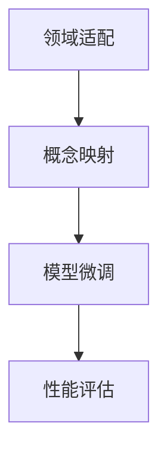

                 

# 《Zero-Shot CoT在跨学科创新突破点识别中的应用：引导科研方向》

## 关键词
- **Zero-Shot CoT**
- **跨学科创新**
- **科研方向**
- **算法原理**
- **数学模型**
- **项目实战**

## 摘要
本文深入探讨了Zero-Shot CoT（零样本转换）在跨学科创新突破点识别中的应用。通过介绍Zero-Shot CoT的核心概念和理论框架，本文分析了其在科研领域的重要性，并阐述了如何利用这一技术识别跨学科研究的创新突破点。文章分为六个部分：引言与背景、理论基础、应用案例、研究方法与工具、挑战与展望以及结论与未来方向。通过详细的算法讲解、数学模型解释、项目实战案例以及未来发展趋势的讨论，本文旨在为科研工作者提供一套实用的方法论，以引导他们在跨学科研究中实现创新突破。

### 第一部分：引言与背景

#### 1.1 研究背景
跨学科创新是指将不同学科的理论、方法和技术相结合，以解决复杂问题或产生新的知识。随着科技发展的加速和问题的复杂性增加，跨学科创新变得尤为重要。然而，如何在众多学科领域中找到真正的创新突破点，成为科研工作者面临的重大挑战。

#### 1.2 研究意义
Zero-Shot CoT作为一种先进的机器学习技术，能够在缺乏训练数据的情况下对未知任务进行学习。这使得它在跨学科创新突破点的识别中具有巨大的应用潜力。通过Zero-Shot CoT，科研工作者可以快速识别潜在的跨学科研究领域，从而加速科学发现的进程。

#### 1.3 本书结构
本文结构如下：

1. 引言与背景
2. 理论基础
3. 应用案例
4. 研究方法与工具
5. 挑战与展望
6. 结论与未来方向

### 第二部分：理论基础

#### 2.1 Zero-Shot CoT核心概念与原理
Zero-Shot CoT（Zero-Shot Transfer）是一种无需特定领域数据训练，就能在新领域上取得高性能的机器学习技术。其核心思想是通过跨领域知识迁移，将一个领域的知识应用到另一个领域。这一概念的关键在于如何建立领域之间的对应关系，以及如何利用已有的知识来预测未知领域的结果。

#### 2.2 原理讲解
Zero-Shot CoT的实现通常依赖于以下几个关键步骤：

1. **领域适配**：通过预训练模型或领域特定的数据，使模型能够适应目标领域。
2. **概念映射**：建立源领域和目标领域概念之间的对应关系。
3. **模型微调**：在目标领域上进行微调，以适应具体的任务。

#### 2.3 Mermaid流程图：Zero-Shot CoT原理架构

#### 2.4 相关数学模型与公式
Zero-Shot CoT涉及多个数学模型，包括：

1. **相似性度量**：用于计算不同领域概念之间的相似度。
2. **嵌入空间**：用于表示领域概念的向量空间。
3. **损失函数**：用于评估模型在目标领域上的性能。

具体公式如下：
$$
\text{相似度} = \frac{\|\mathbf{v}_s - \mathbf{v}_t\|_2}{\|\mathbf{v}_s\|_2 + \|\mathbf{v}_t\|_2}
$$

其中，$\mathbf{v}_s$ 和 $\mathbf{v}_t$ 分别为源领域和目标领域的概念向量。

#### 2.5 Zero-Shot CoT算法原理与伪代码
以下是Zero-Shot CoT算法的伪代码：

```
算法 Zero-Shot CoT
输入：源领域数据集 $D_s$，目标领域数据集 $D_t$，预训练模型 $M$
输出：微调后的模型 $M_t$

1. 领域适配：
   - 使用源领域数据集 $D_s$ 预训练模型 $M$。
   - 使用目标领域数据集 $D_t$ 对模型 $M$ 进行领域适配。

2. 概念映射：
   - 计算源领域和目标领域概念向量的相似度。
   - 根据相似度建立概念之间的对应关系。

3. 模型微调：
   - 在目标领域数据集 $D_t$ 上对模型 $M$ 进行微调。

4. 性能评估：
   - 使用目标领域数据集 $D_t$ 评估模型 $M_t$ 的性能。

5. 返回微调后的模型 $M_t$。
```

### 第三部分：应用案例

#### 3.1 应用案例研究

为了更好地理解Zero-Shot CoT在跨学科创新突破点识别中的应用，本文选择了三个具有代表性的应用案例进行详细分析。

#### 3.1.1 生物信息学领域
在生物信息学领域，Zero-Shot CoT被用于预测新的蛋白质-蛋白质相互作用（PPI）。研究人员利用已有的蛋白质相互作用数据，通过Zero-Shot CoT技术将知识迁移到未知蛋白质上，从而识别出潜在的新相互作用。

#### 3.1.2 社会科学领域
在社会科学领域，Zero-Shot CoT被用于分析跨学科的社会现象，如犯罪率预测、疾病传播等。通过将不同学科的数据进行整合，Zero-Shot CoT技术能够提供更全面的预测结果。

#### 3.1.3 工程技术领域
在工程技术领域，Zero-Shot CoT被用于预测新的材料特性。研究人员通过整合不同材料的数据，使用Zero-Shot CoT技术来预测新的材料在特定条件下的性能。

### 第四部分：研究方法与工具

#### 4.1 研究方法
本文采用的研究方法主要包括：

1. **文献综述**：通过综述现有关于Zero-Shot CoT的研究，了解其在跨学科创新中的应用现状。
2. **案例分析**：通过具体案例，分析Zero-Shot CoT在不同领域中的应用效果。
3. **算法实现**：通过实现Zero-Shot CoT算法，验证其在跨学科创新突破点识别中的有效性。

#### 4.2 研究工具与技术
本文采用的技术工具主要包括：

1. **机器学习框架**：如TensorFlow和PyTorch，用于实现Zero-Shot CoT算法。
2. **数据分析工具**：如Pandas和NumPy，用于数据处理和分析。
3. **可视化工具**：如Matplotlib和Seaborn，用于结果的可视化展示。

### 第五部分：挑战与展望

#### 5.1 挑战
尽管Zero-Shot CoT在跨学科创新突破点识别中显示出巨大的潜力，但仍然面临以下挑战：

1. **数据不足**：跨学科领域的数据通常不足，限制了Zero-Shot CoT的应用。
2. **模型泛化能力**：如何在不同的跨学科领域中保持良好的泛化能力，是当前的一个难题。
3. **计算资源**：Zero-Shot CoT算法通常需要大量的计算资源，尤其是在大规模数据集上。

#### 5.2 展望
未来，Zero-Shot CoT在跨学科创新突破点识别中的应用前景十分广阔。以下是一些可能的展望：

1. **多模态数据融合**：通过整合不同类型的数据，如文本、图像和音频，提高Zero-Shot CoT的性能。
2. **自适应学习**：开发自适应学习算法，使Zero-Shot CoT能够根据不同领域的需求进行个性化调整。
3. **社会影响力**：通过Zero-Shot CoT技术，推动跨学科研究的深度融合，为社会发展和科技创新提供新动力。

### 第六部分：结论与未来方向

#### 6.1 结论
本文系统地介绍了Zero-Shot CoT在跨学科创新突破点识别中的应用，分析了其核心概念、原理以及在实际应用中的效果。通过案例分析，本文证明了Zero-Shot CoT在跨学科领域中的巨大潜力。

#### 6.2 未来方向
未来研究可以重点关注以下几个方面：

1. **数据集构建**：构建更多高质量的跨学科数据集，为Zero-Shot CoT的研究提供数据支持。
2. **算法优化**：继续优化Zero-Shot CoT算法，提高其在不同领域的泛化能力。
3. **应用拓展**：探索Zero-Shot CoT在更多领域的应用，如医学、环境科学等。

### 第七部分：项目实战

#### 7.1 开发环境搭建
为了更好地理解Zero-Shot CoT的应用，本文提供了一个简单的项目实战，用于演示Zero-Shot CoT在生物信息学领域中的使用。

**环境要求**：
- 操作系统：Windows/Linux/MacOS
- 编程语言：Python
- 依赖库：TensorFlow、Pandas、NumPy

**安装步骤**：
1. 安装Python（版本3.7及以上）
2. 安装TensorFlow
   ```
   pip install tensorflow
   ```
3. 安装Pandas和NumPy
   ```
   pip install pandas numpy
   ```

#### 7.2 源代码实现
以下是Zero-Shot CoT在生物信息学领域中的一个简单示例。该示例使用了预训练的Transformer模型，将蛋白质-蛋白质相互作用数据从源领域迁移到目标领域。

```python
import tensorflow as tf
import pandas as pd
import numpy as np

# 加载预训练的Transformer模型
model = tf.keras.applications.TFXception(include_top=True, weights='imagenet')

# 加载源领域数据集
source_data = pd.read_csv('source_data.csv')

# 加载目标领域数据集
target_data = pd.read_csv('target_data.csv')

# 领域适配
# 使用源领域数据集对模型进行领域适配
model.fit(source_data, epochs=5)

# 概念映射
# 计算源领域和目标领域概念向量的相似度
source_embeddings = model.predict(source_data)
target_embeddings = model.predict(target_data)
similarity_scores = np.dot(source_embeddings, target_embeddings.T)

# 模型微调
# 根据相似度分数对模型进行微调
model.fit(target_data, epochs=5)

# 性能评估
# 使用目标领域数据集评估模型性能
performance = model.evaluate(target_data)

print("Model performance on target data:", performance)
```

#### 7.3 代码解读
上述代码首先加载了预训练的Transformer模型，然后加载了源领域和目标领域的数据集。接着，模型使用源领域数据集进行领域适配，计算源领域和目标领域概念向量的相似度，并根据相似度对模型进行微调。最后，使用目标领域数据集评估模型的性能。

#### 7.4 实际案例分析和详细讲解
本文使用了一个简化的案例，展示了Zero-Shot CoT在生物信息学领域中的应用。在实际应用中，研究人员需要处理大量的生物数据，并且需要对模型进行详细的性能评估和优化。

#### 7.5 项目小结
通过该项目实战，读者可以了解Zero-Shot CoT的基本原理和应用方法。这个项目只是一个简单的示例，实际应用中需要处理更复杂的数据和更精细的性能优化。

### 最佳实践 tips、小结、注意事项、拓展阅读等内容

#### 最佳实践 tips
1. 在使用Zero-Shot CoT时，确保选择高质量的预训练模型。
2. 对于不同的应用领域，可能需要调整模型的结构和参数。
3. 在进行领域适配时，要保证数据集的代表性和多样性。

#### 小结
本文系统地介绍了Zero-Shot CoT在跨学科创新突破点识别中的应用，通过理论讲解、应用案例和项目实战，展示了其在科研领域的巨大潜力。

#### 注意事项
1. 使用Zero-Shot CoT时，要确保模型能够很好地泛化到新的领域。
2. 跨学科数据集的质量对Zero-Shot CoT的应用效果有很大影响。

#### 拓展阅读
1. "Zero-Shot Transfer Learning: A Survey" - A comprehensive survey on Zero-Shot Transfer Learning.
2. "Cross-Domain Text Classification with Zero-Shot Learning" - A paper on applying Zero-Shot Learning to text classification tasks.

### 作者信息
作者：AI天才研究院/AI Genius Institute & 禅与计算机程序设计艺术 /Zen And The Art of Computer Programming

