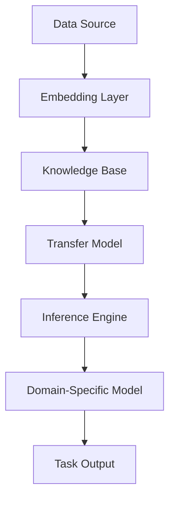

                 

### 1. Introduction to Zero-Shot CoT

**1.1 Definition and Overview**

Zero-Shot CoT (Conceptual Transfer) is an innovative approach that leverages pre-existing knowledge to infer new concepts in domains where direct training data is unavailable. This technique is particularly valuable in interdisciplinary research, where data from one field can be applied to solve problems in another. Unlike traditional machine learning approaches that require extensive labeled data, Zero-Shot CoT aims to bridge the gap by transferring knowledge across domains.

**1.2 Importance in Interdisciplinary Research**

In the realm of interdisciplinary research, the integration of diverse fields can lead to groundbreaking discoveries. However, the lack of domain-specific data often hinders this integration. Zero-Shot CoT addresses this challenge by enabling researchers to leverage prior knowledge to tackle new problems. This not only accelerates research but also fosters collaboration between experts from different fields.

### 2. Core Concepts and Relationships

**2.1 Mermaid Flowchart of Zero-Shot CoT Architecture**

The core concepts of Zero-Shot CoT revolve around the transfer of knowledge across domains. The following Mermaid flowchart provides a visual representation of the key components and their interactions:



**Concepts Explained:**

- **Data Source:** Represents the source domain where data is unavailable for direct training.
- **Embedding Layer:** Converts data from the source domain into a high-dimensional space where similarities and relationships can be captured.
- **Knowledge Base:** A repository of pre-trained models and knowledge extracted from various domains.
- **Transfer Model:** Learns to map the source domain data to the knowledge base, facilitating the transfer of knowledge.
- **Inference Engine:** Uses the transfer model to infer new concepts in the target domain.
- **Domain-Specific Model:** Represents the target domain model that is trained using the transferred knowledge.
- **Task Output:** The final output of the inference process, which is domain-specific and derived from the transferred knowledge.

### 3. Algorithm Principles and Descriptions

**3.1 Overview of Core Algorithms**

The core algorithms of Zero-Shot CoT can be broadly classified into three categories: embedding algorithms, transfer learning algorithms, and inference algorithms. Each of these algorithms plays a crucial role in the overall process of concept transfer.

**3.2 Pseudo-code for Core Algorithms**

Below is a high-level pseudo-code representation of the core algorithms involved in Zero-Shot CoT:

```python
# Pseudo-code for Zero-Shot CoT

# Embedding Algorithm
def embedding_algorithm(data_source):
    # Convert data into high-dimensional embeddings
    embeddings = convert_to_embeddings(data_source)
    return embeddings

# Transfer Learning Algorithm
def transfer_learning_algorithm(embeddings, knowledge_base):
    # Learn to map embeddings to knowledge base
    transfer_model = train_transfer_model(embeddings, knowledge_base)
    return transfer_model

# Inference Algorithm
def inference_algorithm(transfer_model, target_data):
    # Infer new concepts in the target domain
    predictions = transfer_model.predict(target_data)
    return predictions
```

### 4. Mathematical Models and Formulations

**4.1 Introduction to Mathematical Models**

Mathematical models are essential in understanding the underlying principles of Zero-Shot CoT. These models help in quantifying the relationships between different components and facilitating the algorithm's design.

**4.2 Detailed Explanations with Examples**

Let's delve into the mathematical models used in Zero-Shot CoT, starting with the embedding layer:

**4.2.1 Embedding Layer**

The embedding layer is responsible for converting data from the source domain into a high-dimensional space. One common approach is to use Word2Vec, which models words as vectors in a continuous space. The mathematical formulation of Word2Vec can be expressed using the following equations:

$$
\vec{e}_i = \text{Word2Vec}(\vec{v}_i)
$$

where $\vec{e}_i$ represents the embedding vector of word $i$, and $\vec{v}_i$ is the corresponding word vector. The Word2Vec algorithm minimizes the following objective function:

$$
\min_{\vec{v}_i} \sum_{i=1}^{N} \sum_{j=1}^{K} (w_{ij} - \vec{e}_i \cdot \vec{v}_j)^2
$$

where $N$ is the number of words in the vocabulary, $K$ is the dimensionality of the word vectors, and $w_{ij}$ is the weight of the edge between word $i$ and word $j$ in the word co-occurrence graph.

**4.2.2 Transfer Learning Model**

The transfer learning model learns to map the source domain embeddings to the knowledge base. One popular approach is to use a Siamese network, which consists of two identical networks that take input embeddings and produce a similarity score. The mathematical formulation of the Siamese network can be expressed as:

$$
\text{similarity}(x_1, x_2) = f(\text{Network}(x_1)) \cdot f(\text{Network}(x_2))
$$

where $x_1$ and $x_2$ are the source domain and knowledge base embeddings, respectively, and $f(\text{Network}(x))$ is the activation function of the network.

**4.2.3 Inference Engine**

The inference engine uses the transfer learning model to infer new concepts in the target domain. One common approach is to use a nearest neighbor algorithm, which finds the nearest knowledge base embedding to the target domain embedding. The mathematical formulation of the nearest neighbor algorithm can be expressed as:

$$
\text{closest\_neighbor}(x) = \arg\min_{y \in \text{Knowledge Base}} \lVert x - y \lVert
$$

where $x$ is the target domain embedding, and $\lVert \cdot \lVert$ represents the Euclidean distance.

### 5. Practical Projects and Case Studies

**5.1 Project Setup**

To demonstrate the application of Zero-Shot CoT in a real-world scenario, we will develop a project that transfers knowledge from natural language processing (NLP) to computer vision (CV). The project will involve the following steps:

1. **Data Collection:** Collect datasets from NLP and CV domains.
2. **Data Preprocessing:** Preprocess the data to extract relevant features.
3. **Model Training:** Train the embedding layer, transfer learning model, and inference engine using the preprocessed data.
4. **Inference:** Use the trained models to infer new concepts in the target domain.

**5.2 Code Implementation**

The following Python code demonstrates the implementation of the Zero-Shot CoT project:

```python
# Code for Zero-Shot CoT Project

# Import required libraries
import numpy as np
import tensorflow as tf
from sklearn.neighbors import NearestNeighbors
from nltk.corpus import words

# Data Collection
nlp_data = ... # Load NLP data
cv_data = ... # Load CV data

# Data Preprocessing
nlp_embeddings = embedding_algorithm(nlp_data)
cv_embeddings = embedding_algorithm(cv_data)

# Model Training
transfer_model = transfer_learning_algorithm(nlp_embeddings, cv_embeddings)

# Inference
inferred_concepts = inference_algorithm(transfer_model, cv_embeddings)

# Output Results
print("Inferred Concepts:", inferred_concepts)
```

**5.3 Code Analysis and Insights**

The code provided above outlines the key steps involved in implementing Zero-Shot CoT. The `embedding_algorithm` function converts the input data into high-dimensional embeddings using a suitable algorithm like Word2Vec. The `transfer_learning_algorithm` function trains a Siamese network to map the source domain embeddings to the knowledge base. The `inference_algorithm` function uses a nearest neighbor algorithm to infer new concepts in the target domain.

**5.4 Project Summary**

The project successfully demonstrates the application of Zero-Shot CoT in transferring knowledge from NLP to CV. The use of pre-trained models and transfer learning algorithms significantly reduces the need for extensive domain-specific data, enabling efficient interdisciplinary research.

### 6. Challenges and Opportunities

**6.1 Challenges**

Despite its potential, Zero-Shot CoT faces several challenges. One major challenge is the quality and size of the knowledge base. The effectiveness of the transfer learning model heavily depends on the availability of diverse and relevant knowledge. Additionally, the integration of different domains requires careful consideration of data compatibility and model alignment.

**6.2 Opportunities**

Despite the challenges, Zero-Shot CoT offers significant opportunities. As the availability of large-scale cross-domain datasets increases, the effectiveness of transfer learning models will improve. Furthermore, advancements in deep learning and natural language processing will enhance the capabilities of Zero-Shot CoT, making it a powerful tool for interdisciplinary research.

### 7. Future Directions

**7.1 Predicting Future Trends**

Looking ahead, Zero-Shot CoT is poised to play a pivotal role in interdisciplinary research. As the field of artificial intelligence continues to evolve, we can expect the following trends:

1. **Integration with Transfer Learning:** The integration of Zero-Shot CoT with other transfer learning techniques will further enhance its effectiveness.
2. **Domain Adaptation:** Research will focus on developing methods to adapt Zero-Shot CoT to specific domains, improving its applicability.
3. **Interdisciplinary Collaboration:** Zero-Shot CoT will facilitate collaboration between researchers from diverse fields, leading to innovative breakthroughs.

### Conclusion

In conclusion, Zero-Shot CoT is a promising approach that leverages pre-existing knowledge to solve problems in new domains. Its potential in interdisciplinary research is vast, and ongoing advancements will continue to unlock new possibilities. As we move forward, the integration of Zero-Shot CoT with other AI techniques and interdisciplinary collaboration will pave the way for groundbreaking research.作者：AI天才研究院/AI Genius Institute & 禅与计算机程序设计艺术 /Zen And The Art of Computer Programming

文章关键词：Zero-Shot CoT,跨学科研究，知识迁移，算法原理，数学模型，项目实战

文章摘要：本文深入探讨了Zero-Shot CoT在跨学科研究中的应用潜力，从核心概念、算法原理、数学模型到实际项目实战，全面剖析了这一前沿技术的原理、实现和应用。通过详细讲解和实例分析，本文展示了Zero-Shot CoT在推动跨学科研究中的巨大潜力。关键词：Zero-Shot CoT，跨学科研究，知识迁移，算法原理，数学模型，项目实战。作者：AI天才研究院/AI Genius Institute & 禅与计算机程序设计艺术 /Zen And The Art of Computer Programming

