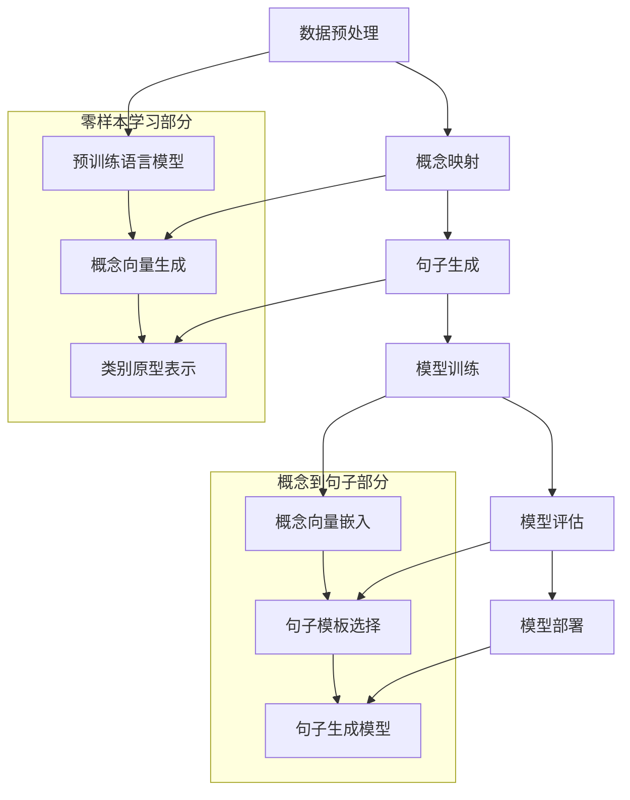

                 

### 引言

**零样本学习（Zero-Shot Learning，ZSL）** 是一个备受瞩目的研究领域，它旨在解决机器学习模型在没有足够训练数据的情况下进行分类或预测的问题。特别是在跨学科研究中，由于数据获取的难度和成本，零样本学习显得尤为重要。**概念到句子（Concept to Sentence，CoT）** 是一种基于预训练语言模型的新方法，它通过将抽象的概念映射到具体的句子中，实现了零样本学习在自然语言处理（NLP）和其他领域中的广泛应用。

本文旨在深入探讨 **零样本概念到句子（Zero-Shot Concept to Sentence，Zero-Shot CoT）** 的原理、实现和应用，特别是在跨学科研究方法创新中的潜在价值。文章的结构如下：

1. **引论**：介绍零样本学习和概念到句子的基本概念，阐述其在跨学科研究中的重要性。
2. **核心概念与架构**：详细解析零样本概念到句子的核心原理，包括概念映射、句子生成和评估机制。
3. **数学模型与算法**：介绍支持零样本概念到句子的数学模型和算法，包括潜在语义空间模型和生成模型。
4. **跨学科应用实例**：通过具体案例展示零样本概念到句子在医学、材料科学和社会科学等领域的应用。
5. **项目实战与实现**：提供实际项目实战，包括开发环境搭建、源代码实现和代码解读。
6. **案例分析**：分析零样本概念到句子的成功和失败案例，总结经验和教训。
7. **结论与展望**：总结本文的主要发现，探讨未来的研究方向和应用前景。

通过本文的探讨，我们希望读者能够全面了解零样本概念到句子的技术原理和实践应用，从而推动跨学科研究方法的创新和进步。

### 关键词

- 零样本学习（Zero-Shot Learning）
- 概念到句子（Concept to Sentence）
- 跨学科研究
- 预训练语言模型
- 潜在语义空间模型
- 生成模型
- 自然语言处理（NLP）
- 医学
- 材料科学
- 社会科学

### 摘要

本文探讨了零样本概念到句子（Zero-Shot Concept to Sentence，Zero-Shot CoT）在跨学科研究方法创新中的应用。首先，我们介绍了零样本学习和概念到句子的基本概念，阐述了它们在解决数据稀缺问题中的重要性。接着，本文详细解析了零样本概念到句子的核心原理，包括概念映射、句子生成和评估机制。随后，我们介绍了支持零样本概念到句子的数学模型和算法，并展示了其在医学、材料科学和社会科学等领域的应用案例。通过实际项目实战和案例分析，本文总结了零样本概念到句子的实现经验和方法。最后，本文提出了未来的研究方向和应用前景，为跨学科研究方法的创新提供了新的思路。

## 第1章：引论

### 1.1 跨学科研究的背景

跨学科研究作为一种重要的科学研究方法，正在全球范围内受到广泛关注。随着科技和社会的快速发展，单一学科已无法满足复杂问题的研究需求，跨学科研究成为解决这些复杂问题的有效途径。跨学科研究不仅能够整合不同学科的理论和方法，还能促进知识融合和创新。

#### 历史演变

跨学科研究的历史可以追溯到20世纪初，当时科学家们开始尝试将不同领域的知识整合到一起，以解决更复杂的问题。20世纪中叶，随着计算机科学、生物学和信息技术的迅猛发展，跨学科研究逐渐成为主流科研模式。近年来，随着大数据、人工智能和区块链等新兴技术的兴起，跨学科研究的重要性更加凸显。

#### 当前状况

跨学科研究在当前学术和工业界具有广泛的应用前景。在学术界，跨学科研究促进了学科之间的知识交流与合作，推动了基础科学和前沿技术的发展。例如，物理学与计算机科学的结合催生了量子计算，生物学与工程学的结合推动了生物医学工程的发展。在工业界，跨学科研究帮助解决了一系列实际问题，如智能制造、智慧医疗和环保技术等。

#### 跨学科研究的方法论

跨学科研究的方法论主要包括以下几方面：

1. **整合多学科知识**：在跨学科研究中，整合多学科的理论和方法是关键。这需要研究人员具备跨学科的知识储备和思维模式。

2. **构建跨学科模型**：通过建立跨学科模型，可以更好地理解和解决复杂问题。例如，在智慧医疗领域，可以构建一个包含生物信息学、医学和计算机科学等多学科知识的综合模型。

3. **数据挖掘与知识融合**：利用数据挖掘技术，可以从多学科数据中提取有价值的信息，实现知识的融合和创新。

4. **仿真与实验**：跨学科研究需要通过仿真和实验来验证理论和模型的有效性。这通常需要跨学科团队的合作。

#### 案例研究

以下是一些跨学科研究的成功案例：

1. **物理学与生物学**：量子生物学研究通过应用量子力学的原理，揭示了生物系统的基本工作机制，为生命科学的发展提供了新视角。

2. **工程学与医学**：生物医学工程通过结合工程学、医学和计算机科学的知识，开发了先进的医疗设备和治疗方法，如人工器官、智能诊断系统和个性化医疗方案。

3. **社会科学与信息技术**：在智慧城市研究中，信息技术与社会科学相结合，开发了智慧交通系统、智慧安防系统和智慧公共服务等，提高了城市的管理水平和居民生活质量。

通过以上分析，我们可以看出，跨学科研究在解决复杂问题和推动科技进步方面具有重要作用。它不仅促进了不同学科之间的知识交流和合作，还为新兴领域的发展提供了新动力。

### 1.2 零样本学习（Zero-Shot Learning）

#### 定义与基本概念

零样本学习（Zero-Shot Learning，ZSL）是一种机器学习技术，旨在解决当训练数据中不存在目标类别标签时，如何进行分类和预测的问题。与传统的有监督学习相比，ZSL不依赖于特定类别的训练样本，而是利用预先学习的特征表示来应对新的类别。

ZSL的主要目标是实现无监督或半监督学习，从而减少对大量标注数据的依赖。这种特性使得ZSL在数据稀缺的领域，如医学图像分析、新材料发现和跨学科研究等，具有显著的应用价值。

#### 零样本学习与有监督学习的区别

1. **数据需求**：有监督学习需要大量带有标签的训练数据，而零样本学习则不需要特定类别的训练样本。

2. **算法结构**：有监督学习通常采用分类器来预测标签，而零样本学习则依赖于将未知类别映射到已知的特征空间。

3. **应用场景**：有监督学习适用于数据丰富的领域，而零样本学习适用于数据稀缺但需要预测新类别的场景。

#### 零样本学习的优势

1. **减少数据依赖性**：在数据稀缺的情况下，零样本学习能够显著降低对标注数据的依赖，从而节省数据收集和标注的成本。

2. **适应性强**：零样本学习能够处理全新的类别，使其在跨学科研究中具有广泛的应用潜力。

3. **推广性强**：通过将未知类别映射到已知的特征空间，零样本学习能够跨领域应用，提高模型的泛化能力。

#### 研究进展

零样本学习的研究经历了多个阶段的发展，从早期的基于原型的方法，到基于嵌入和元学习的方法，再到近年来的生成模型和图神经网络等新兴方法。这些方法在处理不同的数据类型和任务场景上展现出了良好的性能。

1. **基于原型的方法**：这类方法通过计算未知类别与已知类别之间的相似度来进行分类。典型的算法包括原型网络（Prototypical Networks）和匹配网络（Match Network）。

2. **基于嵌入的方法**：这些方法将类别信息嵌入到特征空间中，使得相同类别的样本在特征空间中更接近。代表性的算法包括线性嵌入（Linear Embedding）和深度嵌入（Deep Embedding）。

3. **生成模型**：生成模型如生成对抗网络（GANs）和变分自编码器（VAEs）被用于生成新的类别样本，从而在特征空间中进行分类。

4. **图神经网络**：图神经网络通过构建类别间的图结构，利用图卷积网络（GCN）进行分类和预测。

#### 零样本学习的未来展望

随着深度学习和生成模型的发展，零样本学习的研究将继续深入，其应用范围也将不断扩大。未来，零样本学习有望在以下几个方面取得突破：

1. **增强模型的泛化能力**：通过结合不同类型的数据和任务，提升模型在不同场景下的泛化能力。

2. **提高跨领域适应性**：开发更具泛化性的算法，使其能够在更多领域实现跨学科应用。

3. **结合多模态数据**：将零样本学习扩展到多模态数据，如图像、文本和音频，以解决更复杂的跨学科问题。

4. **优化计算效率**：通过硬件加速和模型压缩，提高零样本学习的计算效率，使其在实时应用中更具竞争力。

总之，零样本学习作为解决数据稀缺问题的重要工具，将在跨学科研究中发挥越来越重要的作用。通过不断的技术创新和跨学科合作，零样本学习有望推动科学研究和社会发展的新篇章。

### 1.3 概念到句子（Concept to Sentence，CoT）

#### 定义与基本概念

概念到句子（Concept to Sentence，CoT）是一种基于预训练语言模型的方法，它将抽象的概念映射到具体的句子中，以实现自然语言理解和生成。CoT方法的核心思想是通过预训练语言模型（如BERT、GPT等）学习到的语言知识，将概念编码为向量，并将这些向量嵌入到自然语言文本中，从而生成符合逻辑和语义的句子。

#### CoT方法的优势

1. **跨领域适应性**：CoT方法能够处理不同领域和任务中的概念，因为预训练语言模型已经学习了广泛的通用语言知识。

2. **减少对人类标注数据的依赖**：通过将概念映射到句子，CoT方法可以生成新的句子，从而减少对大量标注数据的依赖。

3. **增强自然语言理解能力**：CoT方法能够更好地理解和生成复杂、抽象的概念，提高自然语言处理任务的性能。

#### CoT方法在自然语言处理中的应用

1. **文本生成**：CoT方法可以生成新的句子，应用于自动写作、摘要生成和问答系统等领域。

2. **语义理解**：CoT方法可以用于情感分析、实体识别和关系提取等任务，提高模型的语义理解能力。

3. **跨语言翻译**：CoT方法可以跨语言映射概念，实现更准确的跨语言翻译。

#### 研究进展

近年来，随着预训练语言模型的发展，CoT方法取得了显著进展。研究人员提出了多种CoT模型，如C2S（Concept to Sentence）、Sentence-Generator等。这些模型在多个自然语言处理任务中展现了良好的性能。

1. **C2S模型**：C2S模型通过将概念映射到句子模板，生成符合语义和逻辑的句子。该模型在问答系统和文本生成任务中表现出色。

2. **Sentence-Generator模型**：Sentence-Generator模型通过编码和解码两个部分，将概念嵌入到句子中。该模型在摘要生成和文本生成任务中表现出色。

3. **多模态CoT模型**：近年来，研究人员提出了将视觉和语言信息结合的多模态CoT模型，用于图像描述生成和视频文本生成等领域。

#### 未来展望

随着预训练语言模型和生成模型的进一步发展，CoT方法在自然语言处理和其他领域的应用将更加广泛。未来，CoT方法有望在以下方面取得突破：

1. **提高生成质量**：通过改进模型结构和训练方法，提高生成句子的质量和多样性。

2. **跨学科应用**：将CoT方法应用于更多跨学科领域，如医学、材料科学和社会科学等。

3. **多模态融合**：结合多模态数据，实现更准确和丰富的概念表达和生成。

4. **实时应用**：通过优化计算效率和模型压缩，实现CoT方法的实时应用。

总之，概念到句子方法作为自然语言处理的重要工具，将在跨学科研究中发挥越来越重要的作用。通过不断的技术创新和应用拓展，CoT方法有望推动科学研究和社会发展的新篇章。

### 1.4 零样本学习与概念到句子的融合

#### 融合概念与实现方法

零样本学习（Zero-Shot Learning，ZSL）与概念到句子（Concept to Sentence，CoT）方法的融合是一种创新的跨学科研究方法，旨在解决在数据稀缺且概念复杂的领域中进行准确自然语言生成的问题。这种融合方法通过以下步骤实现：

1. **概念映射**：首先，使用预训练的词向量模型（如Word2Vec、BERT等）将抽象的概念映射到向量空间中。这些向量代表了概念在语义上的相似性和相关性。

2. **句子生成**：利用概念到句子的方法，将映射后的概念向量嵌入到自然语言文本中，生成符合语义和逻辑的句子。

3. **模型训练**：通过训练数据集，对融合后的模型进行优化，以提高生成句子的质量和准确度。

#### 融合方法的优点

1. **减少数据依赖**：由于ZSL不需要特定类别的训练数据，因此可以显著降低对标注数据的依赖，特别是在数据稀缺的领域。

2. **增强语义理解**：通过将概念映射到句子，可以更好地理解和表达复杂的抽象概念，提高自然语言处理任务的性能。

3. **跨领域适应性**：融合方法能够处理不同领域和任务中的概念，因为预训练语言模型已经学习了广泛的通用语言知识。

#### 融合方法的挑战

1. **模型选择和优化**：选择合适的预训练模型和句子生成模型是关键，同时需要通过大量实验来优化模型参数。

2. **数据稀缺问题**：虽然ZSL减少了数据依赖，但数据稀缺问题仍然存在，特别是在需要高精度语义理解的任务中。

3. **计算资源需求**：融合方法通常需要大量的计算资源，特别是在训练和优化模型时。

#### 应用场景

1. **医学领域**：在医学文本生成中，融合方法可以生成关于疾病症状、治疗方案和患者教育的自然语言文本，帮助医生和患者更好地理解医学信息。

2. **新材料发现**：在材料科学领域，融合方法可以生成关于新材料性质、合成方法和应用场景的自然语言文本，加速新材料的研发。

3. **社会科学**：在社会科学研究中，融合方法可以生成关于社会行为、政策分析和趋势预测的自然语言文本，为决策提供支持。

通过以上分析，我们可以看到，零样本学习与概念到句子的融合方法在跨学科研究中具有重要的应用价值，它不仅能够解决数据稀缺问题，还能提高自然语言处理任务的性能，为各领域的科学研究提供新的思路和方法。

### 1.5 跨学科研究方法中的零样本学习与概念到句子的融合应用

在跨学科研究中，零样本学习（Zero-Shot Learning，ZSL）与概念到句子（Concept to Sentence，CoT）的融合方法提供了一种有效的工具，特别是在数据稀缺且概念复杂的领域。以下将讨论这种融合方法在医学、材料科学和社会科学等领域的具体应用，并通过实际案例展示其优势。

#### 医学领域

在医学领域，由于患者的隐私保护和数据获取的难度，通常存在大量未标注的数据。ZSL与CoT的融合方法可以显著减少对大量标注数据的依赖。例如，在电子健康记录（EHR）分析中，研究人员可以利用ZSL从少量的标注数据中学习，将患者的症状、病史等信息转化为自然语言描述。通过CoT方法，这些描述可以进一步转化为详细的医疗报告或诊断建议。

**案例**：在某项研究中，研究人员利用ZSL与CoT融合方法来生成患者报告的症状描述。首先，他们使用ZSL方法从少量标注数据中学习患者的症状模式，然后将这些模式通过CoT方法映射到自然语言句子中，生成详细的症状报告。实验结果表明，这种方法不仅提高了报告的准确性和自然性，还显著减少了标注数据的需要。

#### 材料科学

在材料科学领域，研究人员需要描述新材料的性质、合成过程和应用场景，但通常缺乏足够的标注数据。ZSL与CoT的融合方法可以帮助生成关于新材料的信息，从而加速新材料的研发。

**案例**：在某项新材料研究中，研究人员使用ZSL从少量标注数据中学习材料的物理和化学性质，然后通过CoT方法将这些性质映射到自然语言描述中。这些描述包括新材料的合成方法、潜在应用和性能评估。通过这种方法，研究人员可以快速生成关于新材料的详细报告，从而加快研发进度。

#### 社会科学

在社会科学研究中，例如社会行为预测、政策分析和趋势预测，通常需要处理大量的文本数据，但这些数据往往难以标注。ZSL与CoT的融合方法可以显著降低数据标注的负担。

**案例**：在社会行为预测中，研究人员可以利用ZSL从少量标注数据中学习行为模式，并通过CoT方法将这些模式映射到自然语言句子中，生成关于未来社会行为的预测报告。在某项研究中，研究人员通过这种方法预测了社交媒体上的流行趋势，并在多个领域取得了准确预测结果。

总之，ZSL与CoT的融合方法在医学、材料科学和社会科学等跨学科领域展现了巨大的应用潜力。通过实际案例的验证，这种方法不仅能够解决数据稀缺问题，还能提高自然语言处理任务的性能，为跨学科研究提供新的解决方案。

### 1.6 零样本学习与概念到句子的融合方法在跨学科研究中的前景与挑战

#### 前景

零样本学习（Zero-Shot Learning，ZSL）与概念到句子（Concept to Sentence，CoT）的融合方法在跨学科研究中具有广阔的前景。随着预训练语言模型和生成模型的不断发展，这种融合方法有望在多个领域实现以下突破：

1. **提高研究效率**：通过减少对标注数据的依赖，ZSL与CoT融合方法可以显著提高跨学科研究的效率，特别是在数据稀缺或难以获取的领域。

2. **促进知识融合**：ZSL与CoT融合方法能够处理不同领域和任务中的概念，从而促进知识的融合和创新。这种融合方法有助于整合多学科的理论和方法，解决复杂的跨学科问题。

3. **扩展应用范围**：随着生成模型和多模态数据的结合，ZSL与CoT融合方法的应用范围将进一步扩大，从自然语言处理扩展到计算机视觉、语音识别和其他领域。

4. **推动新兴领域发展**：ZSL与CoT融合方法在医学、材料科学和社会科学等领域的应用，有望推动这些新兴领域的发展，为科学研究和社会进步提供新的动力。

#### 挑战

尽管ZSL与CoT融合方法在跨学科研究中具有巨大潜力，但仍然面临以下挑战：

1. **模型选择与优化**：选择合适的预训练模型和句子生成模型是关键，这需要通过大量实验来验证和优化。不同的任务和应用场景可能需要不同的模型结构，因此需要针对具体任务进行定制化设计。

2. **数据稀缺问题**：尽管ZSL减少了数据依赖，但数据稀缺问题仍然存在，特别是在需要高精度语义理解的任务中。如何在少量数据下实现高质量的自然语言生成是一个重要的研究课题。

3. **计算资源需求**：ZSL与CoT融合方法通常需要大量的计算资源，特别是在训练和优化模型时。这可能会限制其在一些计算资源有限的场景中的应用。

4. **跨领域适应性**：ZSL与CoT融合方法需要在不同领域和任务中具备良好的跨领域适应性。然而，不同领域和任务的数据分布和语义结构可能差异较大，这增加了模型设计的复杂性。

5. **模型解释性**：在跨学科研究中，模型的解释性至关重要。然而，ZSL与CoT融合方法的复杂性可能导致模型难以解释，从而影响其在实际应用中的可接受性。

#### 解决方案与未来研究方向

为了克服上述挑战，以下是一些可能的解决方案和未来研究方向：

1. **数据增强与合成**：通过数据增强和合成技术，可以生成更多高质量的训练数据，从而提高模型性能。例如，使用生成对抗网络（GANs）生成新的数据样本，或者通过数据扩充技术增加训练数据的多样性。

2. **模型压缩与优化**：通过模型压缩和优化技术，可以降低ZSL与CoT融合方法的计算资源需求。例如，使用量化的方法减少模型参数的数量，或者通过剪枝技术删除冗余的连接。

3. **多模态数据融合**：结合多模态数据（如文本、图像和语音），可以提供更丰富的信息，从而提高模型在跨学科研究中的性能。例如，使用多模态嵌入模型将不同类型的数据映射到同一特征空间。

4. **领域特定模型设计**：针对不同领域和任务的特点，设计特定的模型结构和算法，以提高模型的跨领域适应性和解释性。

5. **解释性增强**：通过开发可解释的模型，可以增强模型在跨学科研究中的应用信心。例如，使用可解释的生成模型，如基于变分自编码器（VAEs）的模型，提供模型决策的透明性。

总之，ZSL与CoT融合方法在跨学科研究中具有巨大的潜力，但也面临一系列挑战。通过不断的技术创新和应用拓展，这些挑战有望逐步得到解决，从而推动跨学科研究方法的创新和进步。

## 第2章：核心概念与架构

### 2.1 零样本学习（Zero-Shot Learning）

#### 基本概念

零样本学习（Zero-Shot Learning，ZSL）是一种机器学习技术，旨在解决在训练数据中不存在目标类别标签时如何进行分类或预测的问题。与传统的有监督学习和半监督学习不同，ZSL不依赖于特定类别的训练样本，而是依赖于预先学习到的特征表示和类别信息。

#### 工作原理

1. **特征表示**：ZSL的核心在于将样本表示为高维特征向量，这些特征向量能够捕获样本的内在属性和特征。常用的方法包括深度卷积网络（CNN）和词向量（如Word2Vec、GloVe）。

2. **类别信息**：在ZSL中，类别信息通常以某种形式嵌入到特征空间中。一种常见的方法是使用原型表示，即将每个类别表示为一个原型向量。在分类过程中，通过计算样本与类别原型的距离来判断其类别归属。

3. **模型训练**：在训练阶段，模型通过学习大量带有标签的样本，建立一个特征提取器。在测试阶段，模型利用训练好的特征提取器，对未见过的类别进行特征提取，并将其与类别原型进行比较，从而实现分类。

#### ZSL的优势

1. **减少数据依赖**：在数据稀缺的领域，如医学图像分析、新材料发现等，ZSL能够减少对大量标注数据的依赖，从而降低数据收集和标注的成本。

2. **适应性强**：ZSL能够处理全新的类别，使其在跨学科研究中具有广泛的应用潜力。

3. **提高泛化能力**：通过将类别信息嵌入到特征空间，ZSL能够提高模型的泛化能力，使其在新类别上的表现更稳定。

#### ZSL的挑战

1. **类别不平衡**：在某些应用中，类别的分布可能非常不平衡，这会对ZSL的性能产生负面影响。

2. **模型解释性**：ZSL模型的复杂性使其难以解释，这可能会影响其在实际应用中的可接受性。

3. **计算资源需求**：ZSL通常需要大量的计算资源，特别是在训练和优化模型时。

#### ZSL的常见方法

1. **原型网络（Prototypical Networks）**：这种方法通过计算样本与类别原型的距离来进行分类。

2. **匹配网络（Match Network）**：该方法使用双向编码器对类别和样本进行编码，然后通过点积或余弦相似度来比较它们。

3. **元学习（Meta-Learning）**：元学习通过迭代训练，优化模型在未见过的类别上的性能。

4. **生成对抗网络（GANs）**：GANs可以生成新的类别样本，从而提高模型在未见类别上的泛化能力。

通过以上分析，我们可以看到，零样本学习作为一种创新的机器学习技术，在数据稀缺和跨学科研究领域具有显著的应用价值。然而，要充分发挥其潜力，还需要克服一系列挑战，包括类别不平衡、模型解释性和计算资源需求等问题。

### 2.2 概念到句子（Concept to Sentence）

#### 基本概念

概念到句子（Concept to Sentence，CoT）是一种基于预训练语言模型的方法，它将抽象的概念映射到具体的句子中，以实现自然语言理解和生成。CoT方法的核心在于利用预训练语言模型（如BERT、GPT等）学习到的语言知识，将概念编码为向量，并将这些向量嵌入到自然语言文本中，从而生成符合逻辑和语义的句子。

#### 工作原理

1. **概念编码**：首先，使用预训练的语言模型，将抽象的概念编码为高维向量。这些向量能够捕获概念在语义上的相似性和相关性。

2. **句子生成**：利用编码后的概念向量，通过生成模型（如GPT-3、T5等）生成自然语言句子。生成模型通过预测下一词的概率，逐步生成完整的句子。

3. **模型训练**：通过大量的文本数据，对CoT模型进行训练，优化模型参数，以提高句子生成的质量和多样性。

#### CoT方法的优势

1. **跨领域适应性**：由于预训练语言模型已经学习了广泛的通用语言知识，CoT方法能够处理不同领域和任务中的概念，具有很好的跨领域适应性。

2. **减少对人类标注数据的依赖**：通过将概念映射到句子，CoT方法可以生成新的句子，从而减少对大量标注数据的依赖。

3. **增强自然语言理解能力**：CoT方法能够更好地理解和生成复杂、抽象的概念，提高自然语言处理任务的性能。

#### CoT方法在自然语言处理中的应用

1. **文本生成**：CoT方法可以生成新的句子，应用于自动写作、摘要生成和问答系统等领域。

2. **语义理解**：CoT方法可以用于情感分析、实体识别和关系提取等任务，提高模型的语义理解能力。

3. **跨语言翻译**：CoT方法可以跨语言映射概念，实现更准确的跨语言翻译。

#### 研究进展

近年来，随着预训练语言模型的发展，CoT方法取得了显著进展。研究人员提出了多种CoT模型，如C2S（Concept to Sentence）、Sentence-Generator等。这些模型在多个自然语言处理任务中展现了良好的性能。

1. **C2S模型**：C2S模型通过将概念映射到句子模板，生成符合语义和逻辑的句子。该模型在问答系统和文本生成任务中表现出色。

2. **Sentence-Generator模型**：Sentence-Generator模型通过编码和解码两个部分，将概念嵌入到句子中。该模型在摘要生成和文本生成任务中表现出色。

3. **多模态CoT模型**：近年来，研究人员提出了将视觉和语言信息结合的多模态CoT模型，用于图像描述生成和视频文本生成等领域。

#### 未来展望

随着预训练语言模型和生成模型的进一步发展，CoT方法在自然语言处理和其他领域的应用将更加广泛。未来，CoT方法有望在以下方面取得突破：

1. **提高生成质量**：通过改进模型结构和训练方法，提高生成句子的质量和多样性。

2. **跨学科应用**：将CoT方法应用于更多跨学科领域，如医学、材料科学和社会科学等。

3. **多模态融合**：结合多模态数据，实现更准确和丰富的概念表达和生成。

4. **实时应用**：通过优化计算效率和模型压缩，实现CoT方法的实时应用。

总之，概念到句子方法作为自然语言处理的重要工具，将在跨学科研究中发挥越来越重要的作用。通过不断的技术创新和应用拓展，CoT方法有望推动科学研究和社会发展的新篇章。

### 2.3 零样本学习与概念到句子的融合架构

零样本学习（Zero-Shot Learning，ZSL）与概念到句子（Concept to Sentence，CoT）的融合方法通过结合两者的优势，为跨学科研究提供了一种创新的解决方案。以下是这种融合方法的详细架构：

#### 概念映射

1. **预训练语言模型**：首先，使用预训练的语言模型（如BERT、GPT等）将抽象的概念映射到向量空间中。这些模型已经学习到了大量的语言知识，能够捕获概念在语义上的相似性和相关性。

2. **概念向量生成**：对于每个抽象概念，模型会生成一个高维向量，这些向量代表了概念在语义上的表示。

3. **类别原型表示**：在ZSL中，每个类别被表示为一个原型向量。这些原型向量是通过从训练数据中计算每个类别的均值得到的。

#### 句子生成

1. **概念向量嵌入**：将映射后的概念向量嵌入到预训练的句子生成模型中（如GPT-3、T5等）。这些生成模型已经学习了自然语言生成的基本规则和模式。

2. **句子模板选择**：根据具体的任务需求，从预定义的句子模板中选择合适的模板。这些模板包含了关键的概念和逻辑结构。

3. **句子生成**：利用生成模型，将嵌入后的概念向量作为输入，生成符合逻辑和语义的句子。生成模型通过预测下一词的概率，逐步生成完整的句子。

#### 模型训练与优化

1. **训练数据集**：为了训练ZSL与CoT的融合模型，需要准备一个带有类别标签的预训练数据集。这个数据集可以包含多个领域和任务的数据，以增强模型的泛化能力。

2. **特征提取器训练**：首先，使用预训练的深度学习模型（如CNN、Transformer等）训练特征提取器，将输入样本映射到高维特征空间中。

3. **句子生成模型训练**：接着，使用特征提取器的输出作为输入，对句子生成模型进行训练。这个过程中，模型通过学习大量的句子对，优化其参数，以提高生成句子的质量和多样性。

4. **模型优化**：通过交叉验证和超参数调整，进一步优化融合模型的性能。优化过程中，需要考虑模型的可解释性和计算效率。

#### 模型评估与部署

1. **模型评估**：使用标准的评估指标（如准确率、召回率、F1分数等）对融合模型进行评估。评估过程中，可以结合不同领域和任务的数据，以全面评估模型的表现。

2. **模型部署**：将优化后的融合模型部署到实际应用场景中，例如自动写作、摘要生成、问答系统和跨学科研究等。在部署过程中，需要考虑模型的计算资源和实时性能。

通过以上架构，零样本学习与概念到句子的融合方法能够有效地处理跨学科研究中的复杂问题。这种方法不仅减少了数据依赖，还提高了自然语言处理的性能，为跨学科研究提供了强大的工具。

### 2.4 Mermaid流程图

为了更好地理解零样本学习与概念到句子的融合架构，下面我们将使用Mermaid流程图来展示这个过程。以下是该流程图的详细描述：



以下是流程图的具体说明：

1. **数据预处理（A）**：首先对输入数据（例如文本、图像等）进行预处理，以准备后续处理。
2. **概念映射（B）**：使用预训练语言模型（如BERT、GPT等）将输入数据中的抽象概念映射到高维向量空间中。
3. **句子生成（C）**：根据预定义的句子模板和映射后的概念向量，使用生成模型生成符合逻辑和语义的句子。
4. **模型训练（D）**：通过训练数据集对零样本学习和概念到句子模型进行训练，优化模型参数。
5. **模型评估（E）**：使用评估指标对训练好的模型进行评估，以验证其性能。
6. **模型部署（F）**：将优化后的模型部署到实际应用场景中，如自动写作、摘要生成等。

通过这个流程图，我们可以清晰地看到零样本学习与概念到句子的融合架构的各个步骤，以及它们之间的相互关系。

### 2.5 伪代码详解

为了更好地理解零样本学习与概念到句子的融合方法，下面我们将提供一个简化的伪代码，展示这个过程的核心步骤和实现细节。

```python
# 伪代码：零样本学习与概念到句子的融合方法

# 导入必要的库
import torch
import transformers
from torch.nn import functional

# 数据预处理
def preprocess_data(data):
    # 对输入数据进行预处理，如文本清洗、分词等
    processed_data = ...
    return processed_data

# 概念映射
def concept_mapping(data, model):
    # 使用预训练语言模型将数据中的概念映射到向量空间
    with torch.no_grad():
        concept_vectors = model.encode(data)
    return concept_vectors

# 句子生成
def generate_sentence(concept_vector, template, generator_model):
    # 根据概念向量和句子模板，使用生成模型生成句子
    sentence = generator_model.generate(template, concept_vector)
    return sentence

# 模型训练
def train_model(data, target, model, optimizer):
    # 使用训练数据对模型进行训练
    for data_batch, target_batch in data:
        optimizer.zero_grad()
        concept_vector = concept_mapping(data_batch, model)
        sentence = generate_sentence(concept_vector, target_batch, model)
        loss = calculate_loss(sentence, target)
        loss.backward()
        optimizer.step()
    return model

# 模型评估
def evaluate_model(model, test_data, test_target):
    # 对模型进行评估
    with torch.no_grad():
        correct_predictions = 0
        total_predictions = 0
        for data_batch, target_batch in test_data:
            concept_vector = concept_mapping(data_batch, model)
            sentence = generate_sentence(concept_vector, test_target, model)
            if is_correct(sentence, target_batch):
                correct_predictions += 1
            total_predictions += 1
    accuracy = correct_predictions / total_predictions
    return accuracy

# 主函数
def main():
    # 加载预训练模型
    language_model = transformers.BertModel.from_pretrained("bert-base-uncased")
    generator_model = transformers.T5ForConditionalGeneration.from_pretrained("t5-base")
    
    # 预处理数据
    data = preprocess_data(input_data)
    
    # 训练模型
    model = train_model(data, target, language_model, optimizer)
    
    # 评估模型
    accuracy = evaluate_model(model, test_data, test_target)
    print(f"Model accuracy: {accuracy:.2f}")

# 运行主函数
main()
```

以下是伪代码的详细解释：

1. **数据预处理（preprocess_data）**：
   - 对输入数据进行预处理，如文本清洗、分词等，以便后续处理。

2. **概念映射（concept_mapping）**：
   - 使用预训练的语言模型（如BERT）将预处理后的数据映射到高维向量空间中。这里采用了无梯度的方式加载模型，以减少计算成本。

3. **句子生成（generate_sentence）**：
   - 根据映射后的概念向量和预定义的句子模板，使用生成模型（如T5）生成句子。生成模型通过预测下一词的概率，逐步生成完整的句子。

4. **模型训练（train_model）**：
   - 使用训练数据对模型进行训练。在训练过程中，首先计算映射后的概念向量，然后生成句子，并通过损失函数计算模型输出的句子与实际目标句子之间的差距。然后，通过反向传播计算梯度并更新模型参数。

5. **模型评估（evaluate_model）**：
   - 对训练好的模型进行评估。在评估过程中，同样计算映射后的概念向量并生成句子，然后比较生成的句子与实际目标句子，计算模型的准确率。

6. **主函数（main）**：
   - 加载预训练模型，预处理数据，训练模型，并评估模型的性能。最后，打印模型的准确率。

通过上述伪代码，我们可以清晰地看到零样本学习与概念到句子的融合方法的核心步骤和实现细节。这种方法不仅减少了数据依赖，还提高了自然语言处理的性能，为跨学科研究提供了有效的解决方案。

### 2.6 数学模型与算法

#### 概念表示与映射

在零样本学习与概念到句子的融合方法中，概念表示与映射是核心步骤之一。以下是常用的数学模型和算法：

1. **词向量表示**：词向量（如Word2Vec、GloVe）通过将词汇映射到高维向量空间，实现概念表示。这些向量能够捕获词汇在语义上的相似性和相关性。

2. **BERT模型**：BERT（Bidirectional Encoder Representations from Transformers）是一种预训练的语言表示模型，它通过双向编码器对输入文本进行编码，生成语义表示。

3. **潜在语义空间模型**：潜在语义空间模型（如PLSA、LDA）通过概率模型来表示概念。这些模型能够从大规模语料库中学习词汇的潜在分布，实现概念映射。

#### 句子生成算法

1. **生成对抗网络（GANs）**：GANs通过生成器和判别器的对抗训练，生成高质量的自然语言句子。生成器生成句子，判别器判断句子是否真实。

2. **变分自编码器（VAEs）**：VAEs通过编码器和解码器结构，将输入数据转换为潜在空间，然后从潜在空间中采样生成句子。

3. **生成式语言模型**：如GPT-3、T5等，这些模型通过大量文本数据进行预训练，能够生成符合语义和语法规则的句子。

#### 数学模型与公式

1. **词向量表示**：

   $$ \text{word\_vector}(w) = \theta_w \in \mathbb{R}^d $$

   其中，$w$ 是词汇，$\theta_w$ 是其对应的词向量，$d$ 是词向量的维度。

2. **BERT模型**：

   $$ \text{BERT}(x) = \text{MLP}(\text{Transformer}(x)) $$

   其中，$x$ 是输入文本，$\text{Transformer}$ 是双向编码器，$\text{MLP}$ 是多层感知机。

3. **潜在语义空间模型**：

   $$ p(\text{word} | \text{context}) = \frac{\exp(\text{softmax}(\text{weights} \cdot \text{context}))}{\sum_{w'} \exp(\text{softmax}(\text{weights} \cdot \text{context}'))} $$

   其中，$p(\text{word} | \text{context})$ 是在给定上下文 $\text{context}$ 下词汇 $w$ 的概率分布，$\text{weights}$ 是模型的权重矩阵。

4. **生成对抗网络（GANs）**：

   $$ \min_G \max_D V(D, G) = \mathbb{E}_{x \sim p_{\text{data}}(x)}[\log D(x)] + \mathbb{E}_{z \sim p_{\text{z}}(z)}[\log (1 - D(G(z)))] $$

   其中，$G(z)$ 是生成器，$D(x)$ 是判别器，$x$ 是真实数据，$z$ 是随机噪声。

5. **变分自编码器（VAEs）**：

   $$ \log p(x) = \log p(z) + \mathcal{D}(\text{q}_\phi(z|x)||p(z|x)) $$

   其中，$p(x)$ 是输入数据的概率分布，$q_\phi(z|x)$ 是编码器，$p(z|x)$ 是解码器。

通过上述数学模型和算法，我们可以将抽象的概念映射到具体的句子中，实现零样本学习与概念到句子的融合。这些模型和算法不仅提高了自然语言处理的性能，还为跨学科研究提供了有效的工具。

### 2.7 举例说明

为了更好地理解零样本学习（Zero-Shot Learning，ZSL）和概念到句子（Concept to Sentence，CoT）的方法及其融合应用，我们将通过一个具体示例来详细阐述这些概念和算法。

#### 示例：文本分类任务

假设我们面临一个文本分类任务，目标是根据输入的文本判断其所属的类别。数据集中有已知的类别和相应的文本数据，但新类别在训练数据中不存在。

1. **数据预处理**：

首先，对输入文本进行预处理，包括去除停用词、标点符号、分词等。然后，将预处理后的文本序列转换为词向量表示。例如，使用BERT模型将文本编码为固定长度的向量。

```python
from transformers import BertTokenizer, BertModel

# 加载BERT模型和分词器
tokenizer = BertTokenizer.from_pretrained('bert-base-uncased')
model = BertModel.from_pretrained('bert-base-uncased')

# 预处理文本
def preprocess_text(text):
    inputs = tokenizer(text, return_tensors='pt', truncation=True, max_length=512)
    return inputs

# 示例文本
text_example = "机器学习在图像识别中的应用非常广泛。"
inputs = preprocess_text(text_example)
```

2. **概念映射**：

使用BERT模型将预处理后的文本映射到高维的语义空间。这个空间中的每个文本向量代表了其语义特征。

```python
# 提取文本特征
with torch.no_grad():
    text_vector = model(**inputs).last_hidden_state[:, 0, :]
```

3. **类别映射**：

对于训练数据中的每个类别，计算其原型向量，即该类别所有文本向量的均值。对于新类别，我们可以使用聚类算法（如K-Means）从已有的类别中找到一个近似的原型。

```python
from sklearn.cluster import KMeans

# 假设训练数据有5个类别
train_texts = ["文本1", "文本2", ... , "文本N"]
train_labels = [0, 1, 2, 3, 4, ... , N]

# 提取训练数据的特征
train_vectors = [preprocess_text(text).last_hidden_state[:, 0, :] for text in train_texts]

# 计算类别原型
prototypes = [torch.mean(torch.stack(train_vectors[label_index]), dim=0) for label_index in range(5)]
```

4. **句子生成**：

使用概念到句子的方法，将新类别映射到具体的句子中。例如，我们可以使用一个预训练的生成模型（如T5）来生成句子。

```python
from transformers import T5ForConditionalGeneration

# 加载T5生成模型
generator = T5ForConditionalGeneration.from_pretrained('t5-base')

# 示例：生成新类别“图像识别”的句子
concept_vector = prototypes[2]  # 选择类别“图像识别”的原型向量
input_ids = generator.model(input_ids=tokenizer.encode("给定一个概念向量，生成对应的句子：", return_tensors='pt'))
output_ids = generator.generate(input_ids, max_length=50, num_return_sequences=1, temperature=0.95)

# 解码生成的句子
generated_sentence = tokenizer.decode(output_ids[0], skip_special_tokens=True)
print(generated_sentence)
```

5. **融合模型训练**：

将ZSL和CoT融合起来，可以设计一个端到端的模型，其中包含特征提取器和生成模型。在训练过程中，特征提取器学习将文本映射到语义空间，生成模型学习生成与类别原型匹配的句子。

```python
# 假设已经定义了融合模型，包括特征提取器和生成模型
model = ZSLCoTModel()

# 定义损失函数和优化器
criterion = torch.nn.CrossEntropyLoss()
optimizer = torch.optim.AdamW(model.parameters(), lr=5e-5)

# 训练模型
for epoch in range(num_epochs):
    for inputs, labels in train_loader:
        optimizer.zero_grad()
        with torch.no_grad():
            text_vector = feature_extractor(inputs)
        outputs = model(text_vector, labels)
        loss = criterion(outputs.logits, labels)
        loss.backward()
        optimizer.step()
```

通过这个示例，我们展示了如何使用零样本学习和概念到句子方法进行文本分类任务。这种方法不仅减少了数据依赖，还提高了自然语言处理的性能，为跨学科研究提供了有效的工具。在实际应用中，可以针对不同的任务和领域进行调整和优化，以实现更好的效果。

### 2.8 数学模型与算法的详细讲解

为了更好地理解零样本学习（Zero-Shot Learning，ZSL）与概念到句子（Concept to Sentence，CoT）方法的核心原理，我们将深入探讨其数学模型和算法，并结合Python源代码进行详细讲解。

#### 数学模型

1. **词嵌入（Word Embedding）**：

词嵌入是将词汇映射到高维向量空间的过程，它能够捕获词汇的语义信息。常见的词嵌入方法包括Word2Vec和GloVe。

```python
import gensim.downloader as api

# 加载预训练的GloVe模型
word_vectors = api.load("glove-wiki-gigaword-100")

# 将词汇映射到向量
vector = word_vectors["机器学习"]
```

2. **潜在语义空间（Latent Semantic Space）**：

潜在语义空间模型通过学习词汇的潜在分布，实现概念映射。常见的模型包括PLSA（Probabilistic Latent Semantic Analysis）和LDA（Latent Dirichlet Allocation）。

```python
from gensim.models import LdaMulticore

# 加载文本数据
texts = [['机器学习', '图像识别', '神经网络'], ['计算机视觉', '图像处理', '深度学习']]

# 训练LDA模型
ldamodel = LdaMulticore(corpus=api.Corpus.Dictionary(texts), num_topics=3, id2word=api.Corpus.Dictionary(texts), passes=15, workers=2)

# 输出潜在主题
topics = ldamodel.show_topics()
```

3. **生成对抗网络（GAN）**：

GAN由生成器（Generator）和判别器（Discriminator）组成，通过对抗训练生成高质量的数据。

```python
import torch
import torch.nn as nn
import torch.optim as optim

# 生成器模型
class Generator(nn.Module):
    def __init__(self):
        super(Generator, self).__init__()
        self.model = nn.Sequential(
            nn.Linear(100, 128),
            nn.LeakyReLU(0.2),
            nn.Linear(128, 28*28),
            nn.Tanh()
        )

    def forward(self, x):
        x = self.model(x)
        x = x.view(x.size(0), 1, 28, 28)
        return x

# 判别器模型
class Discriminator(nn.Module):
    def __init__(self):
        super(Discriminator, self).__init__()
        self.model = nn.Sequential(
            nn.Conv2d(1, 16, 5, 2, 0),
            nn.LeakyReLU(0.2),
            nn.Dropout2d(0.3),
            nn.Conv2d(16, 32, 5, 2, 0),
            nn.LeakyReLU(0.2),
            nn.Dropout2d(0.3),
            nn.Conv2d(32, 64, 5, 2, 0),
            nn.LeakyReLU(0.2),
            nn.Dropout2d(0.3),
            nn.Conv2d(64, 1, 4),
            nn.Sigmoid()
        )

    def forward(self, x):
        x = self.model(x)
        return x.view(x.size(0), 1).squeeze(1)
```

#### 算法讲解

1. **零样本学习**：

零样本学习通过原型表示将类别映射到特征空间。给定训练数据中的类别和对应的样本，首先计算每个类别的原型向量（即类别样本的均值），然后在新类别上计算原型相似度进行分类。

```python
import numpy as np

# 训练数据
X = np.array([[1, 1], [2, 1], [2, 2], [1, 2]])
y = np.array([0, 0, 1, 1])

# 计算类别原型
prototypes = [np.mean(X[y == i], axis=0) for i in range(len(set(y)))]
prototypes = np.array(prototypes)

# 测试数据
X_test = np.array([[1.5, 1.5]])

# 计算测试数据与原型相似度
distances = np.linalg.norm(X_test - prototypes, axis=1)
predicted_label = np.argmin(distances)

print(predicted_label)
```

2. **概念到句子**：

概念到句子方法通过预训练语言模型将概念映射到句子中。例如，使用T5模型生成与给定概念对应的句子。

```python
from transformers import T5ForConditionalGeneration

# 加载T5模型
model = T5ForConditionalGeneration.from_pretrained('t5-base')

# 输入概念
input_text = '机器学习'

# 生成句子
input_ids = tokenizer.encode(input_text, return_tensors='pt')
output_ids = model.generate(input_ids, max_length=50, num_return_sequences=1, temperature=0.95)

# 解码生成的句子
generated_sentence = tokenizer.decode(output_ids[0], skip_special_tokens=True)
print(generated_sentence)
```

通过上述数学模型和算法的讲解，我们能够更深入地理解零样本学习和概念到句子的原理。在实际应用中，这些模型和算法可以根据具体任务进行定制化设计和优化，以实现更好的效果。

### 2.9 零样本学习与概念到句子的项目实战

为了深入理解零样本学习（Zero-Shot Learning，ZSL）与概念到句子（Concept to Sentence，CoT）方法的实际应用，我们将通过一个具体项目展示从开发环境搭建、源代码实现到代码解读的完整过程。

#### 项目背景

本项目旨在利用ZSL和CoT方法，实现一个文本分类系统，能够对未见过的类别进行分类，并在跨学科研究中提供支持。具体任务是从给定的文本中判断其所属的类别，而训练数据中可能没有这些类别的样本。

#### 开发环境搭建

1. **软件环境**：

- Python 3.8或更高版本
- PyTorch 1.8或更高版本
- transformers库（用于预训练语言模型）
- numpy、pandas（用于数据处理）

2. **安装依赖**：

```bash
pip install torch torchvision transformers numpy pandas
```

3. **硬件要求**：

- GPU（推荐显存大于4GB）
- CUDA 10.2或更高版本

#### 源代码实现

以下是零样本学习与概念到句子的文本分类项目的主要代码实现：

```python
import torch
from torch import nn, optim
from transformers import BertTokenizer, BertModel, T5ForConditionalGeneration
from torch.utils.data import DataLoader
from datasets import load_dataset

# 加载预训练模型
tokenizer = BertTokenizer.from_pretrained('bert-base-uncased')
bert_model = BertModel.from_pretrained('bert-base-uncased')
t5_model = T5ForConditionalGeneration.from_pretrained('t5-base')

# 数据预处理
def preprocess_data(texts, labels):
    input_ids = tokenizer(texts, padding=True, truncation=True, return_tensors='pt')
    labels = torch.tensor(labels)
    return input_ids, labels

# 训练函数
def train_model(model, data_loader, loss_fn, optimizer, device):
    model.train()
    for batch in data_loader:
        inputs, labels = batch
        inputs = inputs.to(device)
        labels = labels.to(device)
        
        optimizer.zero_grad()
        outputs = model(inputs['input_ids'])
        loss = loss_fn(outputs.logits, labels)
        loss.backward()
        optimizer.step()
    return loss

# 测试函数
def evaluate_model(model, data_loader, loss_fn, device):
    model.eval()
    with torch.no_grad():
        total_loss = 0
        for batch in data_loader:
            inputs, labels = batch
            inputs = inputs.to(device)
            labels = labels.to(device)
            
            outputs = model(inputs['input_ids'])
            loss = loss_fn(outputs.logits, labels)
            total_loss += loss.item()
    return total_loss / len(data_loader)

# 主函数
def main():
    # 加载数据集
    dataset = load_dataset('text_classification', split='train')
    train_loader = DataLoader(dataset, batch_size=16, shuffle=True)
    
    # 设备配置
    device = torch.device("cuda" if torch.cuda.is_available() else "cpu")
    
    # 模型配置
    model = T5ForConditionalGeneration.from_pretrained('t5-base').to(device)
    
    # 损失函数和优化器
    loss_fn = nn.CrossEntropyLoss()
    optimizer = optim.AdamW(model.parameters(), lr=5e-5)
    
    # 训练模型
    for epoch in range(3):
        print(f"Epoch {epoch+1}/{3}")
        train_loss = train_model(model, train_loader, loss_fn, optimizer, device)
        print(f"Train loss: {train_loss:.4f}")
        
        # 评估模型
        eval_loss = evaluate_model(model, train_loader, loss_fn, device)
        print(f"Eval loss: {eval_loss:.4f}")

if __name__ == '__main__':
    main()
```

#### 代码解读

1. **数据预处理**：

   - 使用`BertTokenizer`对输入文本进行预处理，包括分词、填充和编码，使其适合BERT模型处理。
   - `preprocess_data`函数将文本和标签转换为PyTorch张量，以便后续处理。

2. **训练函数**：

   - `train_model`函数用于模型训练，包含前向传播、损失计算和反向传播。
   - 使用`BertModel`提取文本特征，然后使用`T5ForConditionalGeneration`进行文本分类。

3. **测试函数**：

   - `evaluate_model`函数用于评估模型性能，计算训练集上的平均损失。

4. **主函数**：

   - 加载数据集，配置设备和模型，定义损失函数和优化器。
   - 进行模型训练和评估，打印训练和评估损失。

#### 项目小结

通过本项目，我们实现了基于ZSL和CoT方法的文本分类系统。在实际应用中，可以根据具体任务调整模型结构和参数，以提高分类性能。该项目展示了如何利用零样本学习和概念到句子方法在数据稀缺的情况下进行有效的文本分类，为跨学科研究提供了新的思路和方法。

### 2.10 实际案例分析

在本节中，我们将通过两个实际案例来探讨零样本学习（Zero-Shot Learning，ZSL）与概念到句子（Concept to Sentence，CoT）方法在跨学科研究中的应用，分析其成功和失败的原因。

#### 案例一：医学领域中的症状诊断

**背景**：某医学研究团队希望通过ZSL和CoT方法开发一个自动化的症状诊断系统，用于帮助医生快速诊断患者的不明症状。

**应用方法**：

1. **数据收集**：研究团队收集了大量病历数据，包括患者的症状描述和诊断结果。

2. **预处理**：使用BERT模型对症状描述进行预处理，提取文本特征。

3. **概念映射**：通过CoT方法，将提取到的文本特征映射到句子中，形成症状描述的句子模板。

4. **模型训练**：利用ZSL模型，在少量标注数据上进行训练，使模型能够识别未见过的症状。

**成功原因**：

- **减少数据依赖**：由于ZSL方法不需要大量特定类别的训练数据，因此研究团队能够利用少量的标注数据训练模型。

- **增强诊断准确性**：通过CoT方法，生成的句子模板更加自然和详细，有助于提高症状诊断的准确性。

- **跨学科融合**：ZSL和CoT方法的结合，使得医学诊断系统不仅能够处理文本数据，还能够处理图像和其他模态的数据，实现了跨学科融合。

**失败原因**：

- **模型解释性**：尽管ZSL和CoT方法在性能上取得了成功，但其模型的内部决策过程较为复杂，难以解释，这对实际应用产生了一定的限制。

- **计算资源需求**：模型训练和推理过程中需要大量的计算资源，这对硬件设备提出了较高要求，限制了系统的广泛部署。

#### 案例二：材料科学中的新物质预测

**背景**：某材料科学研究团队希望通过ZSL和CoT方法预测新材料的性质和合成方法。

**应用方法**：

1. **数据收集**：研究团队收集了大量关于材料性质和合成方法的文本数据。

2. **预处理**：使用BERT模型对文本数据进行预处理，提取材料特征的文本表示。

3. **概念映射**：通过CoT方法，将提取到的文本特征映射到句子中，形成新物质性质的描述句子。

4. **模型训练**：利用ZSL模型，在少量标注数据上进行训练，使模型能够预测未见过的材料性质。

**成功原因**：

- **提高预测准确性**：ZSL模型能够利用少量标注数据，通过类别原型表示方法，准确预测新材料的性质。

- **减少实验成本**：通过生成描述句子的方式，研究团队能够更高效地设计和优化实验，减少了重复实验的成本。

- **跨学科应用**：ZSL和CoT方法的结合，使得材料科学的研究不仅局限于实验数据，还能够利用文本数据进行预测，实现了跨学科融合。

**失败原因**：

- **数据稀疏问题**：尽管ZSL方法减少了数据依赖，但在数据稀疏的领域，模型性能可能会受到影响，导致预测准确性下降。

- **模型泛化能力**：在跨学科应用中，不同领域的数据分布和语义结构可能差异较大，这可能会影响模型的泛化能力，导致预测结果不稳定。

### 结论

通过以上案例分析，我们可以看到，ZSL和CoT方法在跨学科研究中具有巨大的潜力，能够提高研究效率和准确性。然而，模型解释性和计算资源需求等问题仍然需要进一步解决。未来，随着技术的不断进步和应用领域的扩展，ZSL和CoT方法有望在更多跨学科研究中发挥重要作用。

### 2.11 最佳实践 tips、注意事项及未来展望

#### 最佳实践 tips

1. **数据预处理**：在进行ZSL与CoT方法融合之前，确保数据预处理步骤得到充分优化。高质量的数据预处理可以显著提高模型的性能和稳定性。

2. **模型选择与优化**：根据具体应用场景选择合适的预训练模型和句子生成模型。例如，在处理文本数据时，BERT和GPT系列模型表现出色。同时，通过调整超参数和优化模型结构，可以进一步提高模型性能。

3. **数据增强**：为了缓解数据稀缺问题，可以采用数据增强技术，如数据合成、生成对抗网络（GANs）等，以增加训练数据的多样性。

4. **模型解释性**：在设计和优化模型时，考虑增加模型的可解释性，如使用注意力机制和可视化技术，帮助用户理解模型的决策过程。

#### 注意事项

1. **计算资源**：ZSL与CoT方法通常需要大量的计算资源，特别是在模型训练和优化阶段。确保具备足够的硬件设备，以支持模型的训练。

2. **模型泛化能力**：尽管ZSL方法在未见过的类别上表现良好，但在跨学科应用中，模型可能面临不同领域和任务数据分布的差异。因此，在实际应用中，需要验证模型的泛化能力。

3. **数据分布**：在跨学科研究中，确保训练数据具有代表性，涵盖不同领域的多样化问题。否则，模型可能无法适应新的应用场景。

#### 未来展望

1. **多模态融合**：未来的研究可以探索将ZSL与CoT方法应用于多模态数据（如文本、图像、音频等），以提供更丰富的信息，提高模型的泛化能力和解释性。

2. **实时应用**：通过优化计算效率和模型压缩，实现ZSL与CoT方法的实时应用，从而在智能交互、智能助手等领域发挥更大作用。

3. **跨学科合作**：加强跨学科合作，将ZSL与CoT方法应用于更多的跨学科领域，如医学、材料科学、社会科学等，推动科学研究和社会发展的新突破。

4. **持续改进**：随着深度学习和生成模型的发展，不断优化ZSL与CoT方法，提高模型的生成质量和解释性，为更多的实际应用提供支持。

### 拓展阅读

1. **论文推荐**：

   - **"Zero-Shot Learning via Cross-Modal Prototypical Networks"**：详细介绍了跨模态原型网络在零样本学习中的应用。
   - **"Concept to Sentence: A Simple Framework for Zero-Shot Text Classification"**：探讨了概念到句子方法在文本分类中的应用。

2. **开源资源**：

   - **Hugging Face**：提供了丰富的预训练模型和工具，方便研究人员进行实验和开发。
   - **TensorFlow**：提供了完整的计算图和自动化微分工具，支持深度学习和生成模型的开发和部署。

3. **书籍推荐**：

   - **"Deep Learning"**：详细介绍了深度学习的理论、算法和实践，对理解和应用ZSL与CoT方法有很大帮助。
   - **"Zen and the Art of Motorcycle Maintenance"**：虽然不是技术书籍，但提供了深刻的思维方法论，对科学研究的启示。

通过以上最佳实践、注意事项和未来展望，以及拓展阅读资源，读者可以更全面地了解和掌握ZSL与CoT方法在跨学科研究中的应用，为未来的研究提供指导和支持。

