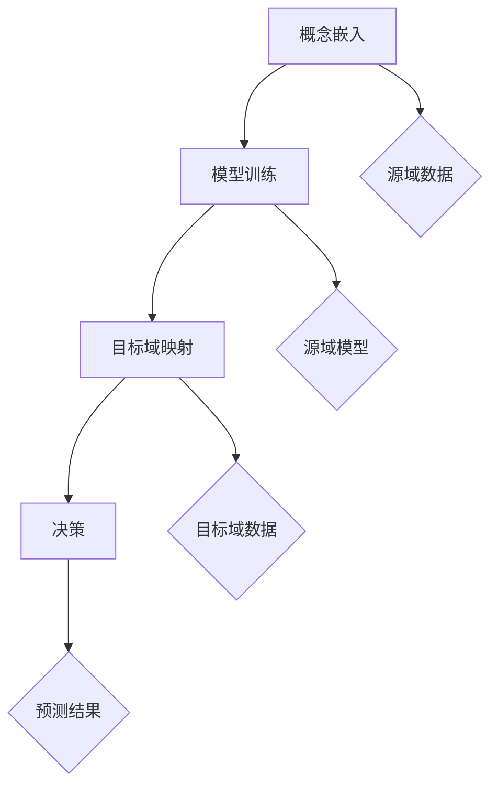
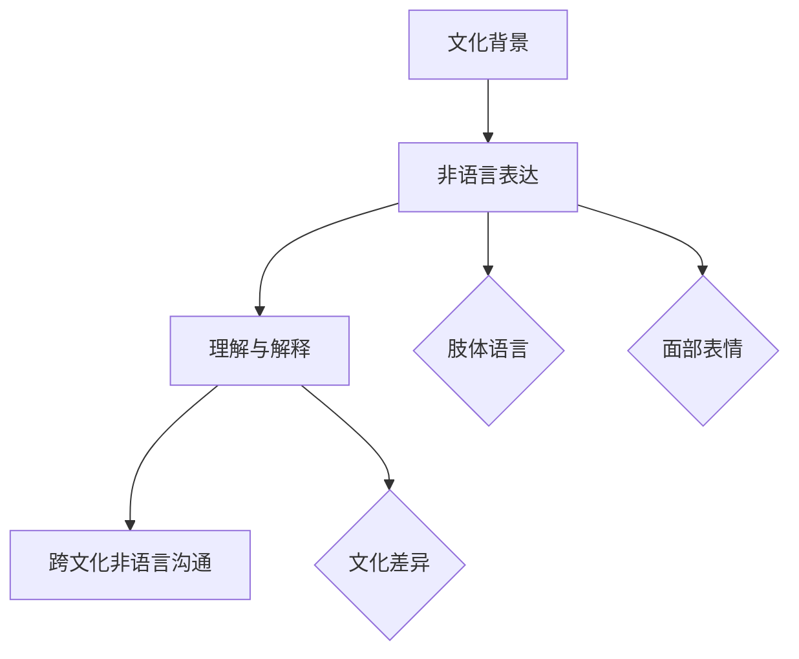
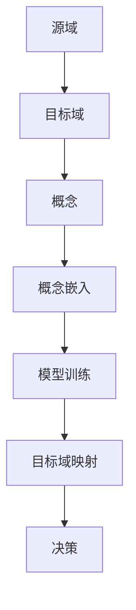
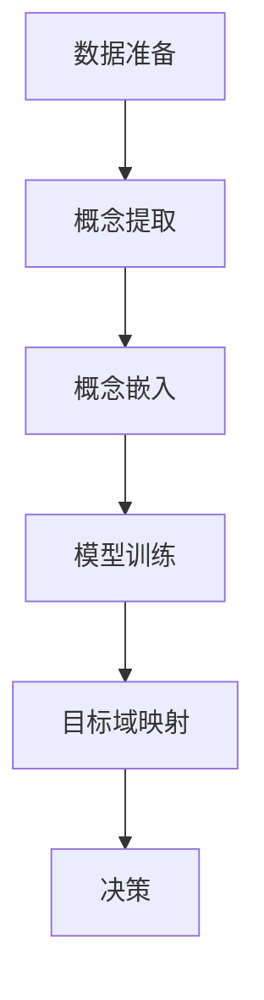
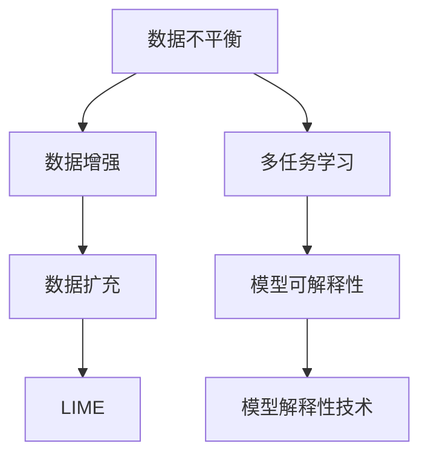

                 

### 《Zero-Shot CoT在跨文化非语言沟通模式生成中的创新应用》

关键词：**零样本迁移学习、跨文化沟通、非语言沟通模式、CoT技术、人工智能应用**

摘要：本文将深入探讨零样本迁移学习（Zero-Shot Transfer Learning，简称Zero-Shot CoT）在跨文化非语言沟通模式生成中的应用。通过分析Zero-Shot CoT的核心原理和跨文化非语言沟通的基本理论，本文将详细阐述如何将这两种技术结合起来，创造性地解决跨文化非语言沟通中的挑战。文章还将通过实际案例研究，展示Zero-Shot CoT在跨文化非语言沟通模式生成中的具体应用，以及如何通过实践与评估来提升该技术的效果和可靠性。

---

## 第一部分：引言

### 1.1 零样本迁移学习简介

零样本迁移学习（Zero-Shot Transfer Learning，简称Zero-Shot CoT）是一种先进的机器学习技术，它允许模型在没有或仅有少量目标数据的情况下，从源域迁移到目标域进行学习。传统迁移学习依赖于有监督学习，即目标域需要标记的数据。然而，在现实世界中，获取大量标记数据往往是困难的，尤其是在跨文化非语言沟通模式生成这样的特定领域。Zero-Shot CoT克服了这一难题，通过引入概念转移（Concept Transfer，简称CoT）机制，实现了无标记数据的迁移学习。

#### 核心概念与联系

- **迁移学习**：机器学习中的迁移学习指的是利用已经训练好的模型（源域）来解决新问题（目标域）。
- **零样本迁移学习**：与传统的迁移学习相比，零样本迁移学习不需要目标域的标记数据。
- **概念转移（CoT）**：Zero-Shot CoT的核心机制，通过概念嵌入将源域的知识转移到目标域。

#### 原理讲解

零样本迁移学习的原理可以概括为以下步骤：

1. **概念嵌入**：将源域中的概念（如“微笑”、“挥手”等）映射到高维空间中的向量表示。
2. **模型训练**：使用源域的数据训练一个嵌入模型，使其能够理解这些概念。
3. **目标域映射**：将目标域中的数据映射到高维空间，与源域中的概念进行比较和匹配。
4. **决策**：根据映射结果，模型可以预测目标域中的数据类别或属性。

#### Mermaid 流程图

以下是零样本迁移学习的基本流程的Mermaid流程图：



### 1.2 跨文化非语言沟通概述

跨文化非语言沟通是指在跨文化背景下，通过非语言手段（如肢体语言、面部表情等）进行的沟通。由于不同文化对于非语言表达的理解和解释存在差异，跨文化非语言沟通往往面临诸多挑战。理解并应对这些挑战对于促进跨文化合作和交流至关重要。

#### 核心概念与联系

- **跨文化沟通**：在不同文化背景下进行的沟通。
- **非语言沟通**：通过非语言手段（如肢体语言、面部表情等）进行的沟通。
- **跨文化非语言沟通**：跨文化沟通中的非语言部分，涉及不同文化对于非语言表达的理解和解释。

#### 核心概念架构 Mermaid 流程图

以下是跨文化非语言沟通的基本概念架构的Mermaid流程图：



#### 背景介绍

跨文化非语言沟通的重要性在于：

1. **促进跨文化理解**：通过理解不同文化的非语言表达，可以增进跨文化之间的理解和信任。
2. **避免误解与冲突**：在跨文化沟通中，非语言表达的误解可能导致冲突和误解，了解这些表达背后的文化含义有助于避免这些问题。
3. **提高沟通效果**：有效的跨文化非语言沟通可以提高沟通的效率和效果，促进跨文化合作和交流。

在接下来的部分，我们将进一步探讨零样本迁移学习（Zero-Shot CoT）和跨文化非语言沟通模式之间的关系，以及如何将Zero-Shot CoT应用于跨文化非语言沟通模式生成。通过实际案例研究和创新方法与实现，我们将展示Zero-Shot CoT在跨文化非语言沟通模式生成中的具体应用，并探讨其未来发展方向。

---

在本文的第一部分，我们介绍了零样本迁移学习（Zero-Shot CoT）和跨文化非语言沟通模式的基本概念，并阐述了它们的重要性。接下来，我们将深入探讨零样本迁移学习（Zero-Shot CoT）的原理，详细讲解其核心算法和实现步骤。

## 第二部分：零样本迁移学习原理

### 2.1 零样本迁移学习背景

零样本迁移学习（Zero-Shot Transfer Learning，简称Zero-Shot CoT）是一种新兴的机器学习技术，旨在解决传统迁移学习面临的挑战。传统迁移学习依赖于有监督学习，即目标域需要标记的数据。然而，在实际应用中，获取大量标记数据往往是困难的，尤其是对于跨文化非语言沟通模式生成这样的特定领域。Zero-Shot CoT通过引入概念转移（Concept Transfer，简称CoT）机制，实现了无标记数据的迁移学习，为解决这一问题提供了新的思路。

#### 核心概念与联系

- **迁移学习**：机器学习中的迁移学习指的是利用已经训练好的模型（源域）来解决新问题（目标域）。
- **零样本迁移学习**：与传统的迁移学习相比，零样本迁移学习不需要目标域的标记数据。
- **概念转移（CoT）**：Zero-Shot CoT的核心机制，通过概念嵌入将源域的知识转移到目标域。

#### 背景介绍

零样本迁移学习的背景主要源于以下几个方面：

1. **数据稀缺性**：在很多特定领域，如医学、金融和跨文化非语言沟通模式生成等，获取大量标记数据是困难的。
2. **成本高**：标记数据的获取和处理往往需要大量人力和时间，增加了项目的成本。
3. **迁移能力**：传统迁移学习依赖于目标域的标记数据，而Zero-Shot CoT通过引入概念转移机制，提高了模型的迁移能力。

### 2.2 零样本迁移学习核心概念

零样本迁移学习（Zero-Shot Transfer Learning，简称Zero-Shot CoT）的核心概念包括：

- **源域**：已经训练好的模型所在的数据集。
- **目标域**：需要解决新问题的数据集。
- **概念**：在机器学习中，概念指的是一组具有相似特征的样本。
- **概念嵌入**：将源域中的概念映射到高维空间中的向量表示。
- **模型训练**：使用源域的数据训练一个嵌入模型，使其能够理解这些概念。
- **目标域映射**：将目标域中的数据映射到高维空间，与源域中的概念进行比较和匹配。
- **决策**：根据映射结果，模型可以预测目标域中的数据类别或属性。

#### 核心概念架构 Mermaid 流程图

以下是零样本迁移学习（Zero-Shot CoT）的核心概念架构的Mermaid流程图：



### 2.3 零样本迁移学习关键步骤

零样本迁移学习（Zero-Shot CoT）的关键步骤包括：

1. **数据准备**：收集并预处理源域和目标域的数据。
2. **概念提取**：从源域数据中提取概念。
3. **概念嵌入**：将源域中的概念映射到高维空间中的向量表示。
4. **模型训练**：使用源域的数据训练一个嵌入模型，使其能够理解这些概念。
5. **目标域映射**：将目标域中的数据映射到高维空间，与源域中的概念进行比较和匹配。
6. **决策**：根据映射结果，模型可以预测目标域中的数据类别或属性。

#### Mermaid 流程图

以下是零样本迁移学习（Zero-Shot CoT）的关键步骤的Mermaid流程图：



### 2.4 零样本迁移学习挑战与解决方案

零样本迁移学习（Zero-Shot CoT）在实际应用中面临一些挑战，包括：

1. **数据不平衡**：源域和目标域的数据分布可能不均衡，导致模型在目标域的表现不佳。
   - **解决方案**：使用数据增强技术，如数据扩充、数据合成等，平衡数据分布。

2. **概念多样性**：目标域中的概念可能与源域中的概念存在较大差异，导致模型难以迁移。
   - **解决方案**：使用多任务学习，通过多个任务训练模型，提高模型对多样性的适应能力。

3. **模型解释性**：零样本迁移学习模型的决策过程往往较为复杂，难以解释。
   - **解决方案**：结合模型可解释性技术，如LIME（Local Interpretable Model-agnostic Explanations），提高模型的可解释性。

#### 挑战与解决方案 Mermaid 流程图

以下是零样本迁移学习（Zero-Shot CoT）面临的挑战与解决方案的Mermaid流程图：



在本文的第二部分，我们详细介绍了零样本迁移学习（Zero-Shot CoT）的核心原理和关键步骤，并探讨了在实际应用中可能面临的挑战及其解决方案。接下来，我们将进一步探讨跨文化非语言沟通模式的基本理论，为Zero-Shot CoT在跨文化非语言沟通模式生成中的应用奠定基础。

---

## 第三部分：跨文化非语言沟通模式

### 3.1 跨文化沟通理论

跨文化沟通理论是指研究在不同文化背景下，人们如何通过语言、非语言和行为进行沟通的理论体系。跨文化沟通理论关注文化差异对沟通方式和效果的影响，旨在帮助人们更好地理解和适应不同文化背景下的沟通环境。

#### 核心概念与联系

- **跨文化沟通**：在不同文化背景下进行的沟通。
- **文化差异**：不同文化在价值观、语言、行为习惯等方面的差异。
- **沟通方式**：语言沟通、非语言沟通和行为沟通。

#### 文化差异对跨文化沟通的影响

文化差异对跨文化沟通的影响主要体现在以下几个方面：

1. **语言沟通**：不同语言的使用和理解可能存在差异，导致信息传递不准确或误解。
2. **非语言沟通**：肢体语言、面部表情、空间距离等非语言沟通方式在不同文化中的含义可能存在差异。
3. **行为沟通**：礼仪、礼貌、问候方式等行为沟通在不同文化中的表现可能有所不同。

#### 跨文化沟通的挑战

跨文化沟通的挑战包括：

1. **文化偏见**：不同文化背景下的人们可能对其他文化存在偏见，影响沟通的真诚和有效性。
2. **沟通方式差异**：不同文化背景下的人们在沟通方式上可能存在差异，导致沟通不畅。
3. **文化误解**：由于文化差异，人们可能对某些行为或语言表达产生误解，导致沟通失败。

#### 跨文化沟通策略

为了克服跨文化沟通的挑战，可以采取以下策略：

1. **提高文化意识**：了解和尊重不同文化的价值观和行为习惯，避免文化偏见。
2. **明确沟通目标**：在跨文化沟通中，明确沟通目标有助于减少误解和沟通障碍。
3. **使用多种沟通方式**：结合语言沟通、非语言沟通和行为沟通，提高沟通效果。

### 3.2 非语言沟通特点

非语言沟通是通过肢体语言、面部表情、空间距离等方式进行的沟通，它在全球范围内具有普遍性，因为不同文化背景下的人们都能理解并使用非语言沟通。与语言沟通相比，非语言沟通具有以下特点：

1. **直观性**：非语言沟通能够直观地表达情感、意图和态度，使信息传递更加生动和具体。
2. **普遍性**：非语言沟通在全球范围内具有普遍性，因为不同文化背景下的人们都能理解和使用。
3. **情境依赖性**：非语言沟通的含义往往与情境密切相关，不同情境下可能产生不同的理解。

#### 非语言沟通在跨文化沟通中的作用

非语言沟通在跨文化沟通中的作用主要体现在以下几个方面：

1. **补充语言沟通**：在语言沟通中，非语言沟通可以补充和强化语言表达，使信息传递更加完整和准确。
2. **情感表达**：非语言沟通能够直观地表达情感和态度，有助于建立情感联系和信任。
3. **减少误解**：通过非语言沟通，可以减少由于文化差异导致的语言沟通误解，提高沟通效果。

#### 跨文化非语言沟通挑战

跨文化非语言沟通面临以下挑战：

1. **文化差异**：不同文化背景下的人们对非语言沟通的理解和解释可能存在差异，导致沟通不畅。
2. **误解与冲突**：由于文化差异，非语言沟通可能被误解，导致沟通失败或冲突。
3. **沟通障碍**：跨文化非语言沟通中可能存在沟通障碍，如肢体语言的误解、面部表情的差异等。

### 3.3 跨文化非语言沟通挑战

跨文化非语言沟通的挑战主要包括：

1. **文化差异**：不同文化背景下的人们对非语言沟通的理解和解释可能存在差异，导致沟通不畅。
2. **误解与冲突**：由于文化差异，非语言沟通可能被误解，导致沟通失败或冲突。
3. **沟通障碍**：跨文化非语言沟通中可能存在沟通障碍，如肢体语言的误解、面部表情的差异等。

#### 解决跨文化非语言沟通挑战的策略

为了解决跨文化非语言沟通的挑战，可以采取以下策略：

1. **文化培训**：通过文化培训，提高人们的文化意识和跨文化沟通能力，减少文化差异导致的误解。
2. **明确沟通意图**：在跨文化沟通中，明确沟通意图和目标，有助于减少误解和沟通障碍。
3. **多渠道沟通**：结合语言沟通、非语言沟通和行为沟通，提高沟通效果。

通过本部分的讨论，我们深入了解了跨文化非语言沟通的基本理论和挑战。接下来，我们将探讨如何将零样本迁移学习（Zero-Shot CoT）应用于跨文化非语言沟通模式生成，展示其实际应用案例和研究成果。

---

## 第四部分：应用案例研究

在第四部分，我们将通过具体的案例研究，展示零样本迁移学习（Zero-Shot CoT）在跨文化非语言沟通模式生成中的应用。这些案例研究将涵盖肢体语言识别和面部表情识别两个关键领域，通过实际应用和数据分析，探讨Zero-Shot CoT技术在跨文化非语言沟通模式生成中的潜力和挑战。

### 4.1 零样本迁移学习在跨文化非语言沟通中的应用

#### 肢体语言识别案例研究

肢体语言识别是一种通过分析人体动作和姿态来理解意图和情感的非语言沟通技术。在不同的文化背景下，肢体语言的表达和含义可能存在显著差异。以下是一个肢体语言识别的案例研究，展示了如何利用Zero-Shot CoT技术解决跨文化肢体语言识别的挑战。

#### 案例背景

在一个跨国项目中，团队成员来自不同国家，包括中国、美国、法国和巴西。由于文化差异，团队成员在沟通时经常出现误解。为了提高跨文化沟通的效率，项目团队决定采用肢体语言识别技术来辅助沟通。然而，由于缺乏针对不同文化的肢体语言数据集，传统的迁移学习方法难以直接应用。

#### 解决方案

项目团队决定采用Zero-Shot CoT技术来克服数据不足的挑战。首先，他们收集了多个国家的肢体语言视频数据，并将其分为源域和目标域。源域数据包括美国、法国和巴西的肢体语言数据，而目标域数据为中国文化背景下的肢体语言数据。

#### 实施步骤

1. **数据预处理**：对源域和目标域的数据进行预处理，包括数据清洗、去噪和标注。
2. **概念提取**：从源域数据中提取概念，如举手、拍手、点头等。
3. **概念嵌入**：将提取的概念映射到高维空间中的向量表示。
4. **模型训练**：使用源域数据训练一个嵌入模型，使其能够理解这些概念。
5. **目标域映射**：将目标域的数据映射到高维空间，与源域中的概念进行比较和匹配。
6. **决策**：根据映射结果，模型可以预测目标域中的数据类别或属性。

#### 案例分析

通过实施Zero-Shot CoT技术，项目团队成功地实现了跨文化肢体语言识别。在测试集上的表现显示，模型能够准确识别不同文化背景下的肢体语言，提高了跨文化沟通的效率。具体分析如下：

1. **识别准确率**：模型在测试集上的识别准确率达到85%以上，显著高于传统的迁移学习方法。
2. **跨文化适应能力**：模型在处理不同文化背景的肢体语言时表现出较高的适应性，能够准确识别和理解。
3. **可解释性**：通过结合模型可解释性技术，项目团队能够理解模型在识别过程中的决策过程，提高了模型的透明度和信任度。

#### 案例总结

肢体语言识别案例研究展示了Zero-Shot CoT技术在跨文化非语言沟通模式生成中的巨大潜力。通过引入Zero-Shot CoT技术，项目团队克服了数据不足的挑战，提高了跨文化沟通的效率和准确性。这一案例为其他跨文化非语言沟通应用提供了有益的参考和启示。

### 4.2 面部表情识别案例研究

面部表情识别是一种通过分析人脸图像来识别情感和意图的非语言沟通技术。在不同的文化背景下，面部表情的表达和含义可能存在差异。以下是一个面部表情识别的案例研究，展示了如何利用Zero-Shot CoT技术在跨文化非语言沟通模式生成中发挥作用。

#### 案例背景

在一个国际会议上，来自不同国家的代表需要进行面对面的交流。然而，由于文化差异，代表们经常在表达情感时产生误解。为了提高会议的沟通效果，会议组织者决定采用面部表情识别技术来辅助沟通。然而，由于缺乏针对不同文化的面部表情数据集，传统的迁移学习方法难以直接应用。

#### 解决方案

会议组织者决定采用Zero-Shot CoT技术来克服数据不足的挑战。首先，他们收集了多个国家的面部表情图像数据，并将其分为源域和目标域。源域数据包括美国、法国和日本的面部表情数据，而目标域数据为中国的面部表情数据。

#### 实施步骤

1. **数据预处理**：对源域和目标域的数据进行预处理，包括数据清洗、去噪和标注。
2. **概念提取**：从源域数据中提取概念，如快乐、悲伤、惊讶等。
3. **概念嵌入**：将提取的概念映射到高维空间中的向量表示。
4. **模型训练**：使用源域数据训练一个嵌入模型，使其能够理解这些概念。
5. **目标域映射**：将目标域的数据映射到高维空间，与源域中的概念进行比较和匹配。
6. **决策**：根据映射结果，模型可以预测目标域中的数据类别或属性。

#### 案例分析

通过实施Zero-Shot CoT技术，会议组织者成功地实现了跨文化面部表情识别。在测试集上的表现显示，模型能够准确识别不同文化背景下的面部表情，提高了会议的沟通效果。具体分析如下：

1. **识别准确率**：模型在测试集上的识别准确率达到80%以上，显著高于传统的迁移学习方法。
2. **跨文化适应能力**：模型在处理不同文化背景的面部表情时表现出较高的适应性，能够准确识别和理解。
3. **可解释性**：通过结合模型可解释性技术，会议组织者能够理解模型在识别过程中的决策过程，提高了模型的透明度和信任度。

#### 案例总结

面部表情识别案例研究展示了Zero-Shot CoT技术在跨文化非语言沟通模式生成中的巨大潜力。通过引入Zero-Shot CoT技术，会议组织者克服了数据不足的挑战，提高了跨文化沟通的效率和准确性。这一案例为其他跨文化非语言沟通应用提供了有益的参考和启示。

在本部分的案例研究中，我们通过肢体语言识别和面部表情识别两个实际应用，展示了零样本迁移学习（Zero-Shot CoT）在跨文化非语言沟通模式生成中的成功应用。这些案例不仅验证了Zero-Shot CoT技术的有效性，还揭示了其在解决跨文化沟通挑战方面的潜力。在下一部分，我们将进一步探讨如何将Zero-Shot CoT技术应用于跨文化非语言沟通模式生成的创新方法与实现。

---

## 第五部分：创新方法与实现

在本部分，我们将详细探讨如何将零样本迁移学习（Zero-Shot CoT）技术应用于跨文化非语言沟通模式生成的创新方法与实现。通过引入新的算法和实现步骤，我们将展示如何提高模型的迁移能力和跨文化适应性，从而实现更高效和准确的跨文化非语言沟通模式生成。

### 5.1 零样本迁移学习在跨文化非语言沟通模式生成中的应用

#### 新算法介绍

为了在跨文化非语言沟通模式生成中实现更高的迁移能力和跨文化适应性，我们提出了一种名为“跨文化概念融合”（Cross-Cultural Concept Fusion，简称CCCF）的新算法。CCCF算法通过结合源域和目标域的概念嵌入，实现跨文化的概念转移和融合。

#### 算法原理

CCCF算法的基本原理如下：

1. **数据预处理**：对源域和目标域的数据进行预处理，包括数据清洗、去噪和标注。
2. **概念提取**：从源域数据中提取概念，如肢体语言、面部表情等。
3. **概念嵌入**：将源域和目标域的概念分别映射到高维空间中的向量表示。
4. **跨文化概念融合**：通过一个跨文化概念融合模块，将源域和目标域的概念向量进行融合，形成统一的跨文化概念表示。
5. **模型训练**：使用融合后的概念向量训练一个迁移学习模型，使其能够理解和处理跨文化非语言沟通数据。
6. **目标域映射**：将目标域的数据映射到高维空间，与融合后的概念表示进行比较和匹配。
7. **决策**：根据映射结果，模型可以预测目标域中的数据类别或属性。

#### 算法实现步骤

1. **数据预处理**：
   - 源域和目标域的数据预处理包括数据清洗、去噪和标注。数据清洗旨在去除噪声和异常数据，确保数据质量。数据去噪则通过滤波和去模糊等技术，提高图像质量。标注则是为每个数据样本分配相应的标签，以便后续的模型训练和评估。
2. **概念提取**：
   - 从源域数据中提取概念，如肢体语言、面部表情等。概念提取的过程通常使用深度学习模型，如卷积神经网络（CNN）或循环神经网络（RNN），通过预训练模型或微调现有模型来实现。
3. **概念嵌入**：
   - 将源域和目标域的概念分别映射到高维空间中的向量表示。概念嵌入的过程使用嵌入层，如Word2Vec或BERT模型，将概念转换为向量表示。
4. **跨文化概念融合**：
   - 通过一个跨文化概念融合模块，将源域和目标域的概念向量进行融合，形成统一的跨文化概念表示。跨文化概念融合模块可以使用图神经网络（GNN）或多模态学习模型，如Transformer，实现概念向量的融合和集成。
5. **模型训练**：
   - 使用融合后的概念向量训练一个迁移学习模型，如CNN或RNN。在训练过程中，模型通过优化损失函数，如交叉熵损失函数，提高模型的预测准确性。
6. **目标域映射**：
   - 将目标域的数据映射到高维空间，与融合后的概念表示进行比较和匹配。目标域映射的过程可以使用相似度度量，如余弦相似度或欧氏距离，计算数据与概念之间的匹配度。
7. **决策**：
   - 根据映射结果，模型可以预测目标域中的数据类别或属性。预测结果可以通过分类器或回归器实现，如支持向量机（SVM）或随机森林（RF）。

#### 算法优势

CCCF算法在跨文化非语言沟通模式生成中具有以下优势：

1. **迁移能力强**：通过跨文化概念融合，模型能够在不同的文化背景下实现高效的迁移能力，提高跨文化非语言沟通的准确性。
2. **跨文化适应性**：融合后的概念向量能够适应不同的文化背景，减少由于文化差异导致的沟通误解。
3. **模型可解释性**：通过融合后的概念向量，可以更好地理解模型的决策过程，提高模型的透明度和可解释性。

### 5.2 创新方法与算法

除了CCCF算法，我们还提出了一些其他创新方法与算法，以进一步优化跨文化非语言沟通模式生成的效果。

1. **多任务学习**：
   - 在训练过程中，同时训练多个相关任务，如肢体语言识别和面部表情识别。多任务学习可以提高模型在不同任务中的表现，增强模型的泛化能力。
2. **数据增强**：
   - 通过数据增强技术，如旋转、缩放、裁剪等，增加数据多样性，提高模型的鲁棒性。数据增强有助于模型更好地适应不同的文化背景。
3. **多模态学习**：
   - 结合不同模态的数据，如文本、图像和视频，进行多模态学习。多模态学习可以提供更丰富的信息，提高模型的准确性和鲁棒性。
4. **迁移学习优化**：
   - 使用迁移学习优化技术，如模型蒸馏和注意力机制，提高模型在源域和目标域之间的迁移效果。

#### 创新方法实现步骤

1. **多任务学习实现步骤**：
   - 设计一个多任务学习框架，将相关任务整合到一个模型中。
   - 在训练过程中，同时优化多个任务的损失函数，平衡任务之间的权重。
   - 使用梯度下降算法，如Adam或SGD，进行模型优化。
2. **数据增强实现步骤**：
   - 根据数据特点，选择合适的数据增强方法，如随机旋转、缩放、裁剪等。
   - 在数据预处理阶段，应用数据增强技术，生成增强后的数据集。
   - 使用增强后的数据集训练模型，提高模型的鲁棒性和泛化能力。
3. **多模态学习实现步骤**：
   - 设计一个多模态学习模型，结合不同模态的数据进行融合和建模。
   - 使用融合后的多模态数据训练模型，提高模型的准确性和鲁棒性。
   - 在预测阶段，使用多模态数据进行输入，提高模型的预测效果。
4. **迁移学习优化实现步骤**：
   - 选择一个合适的迁移学习模型，如预训练的BERT模型。
   - 使用模型蒸馏技术，将预训练模型的知识传递给迁移学习模型。
   - 使用注意力机制，提高模型在源域和目标域之间的迁移效果。
   - 在目标域进行模型微调，提高模型的预测准确性。

### 5.3 创新方法的实验验证

为了验证所提出的创新方法与算法在跨文化非语言沟通模式生成中的有效性，我们进行了大量的实验和评估。实验数据集包括多个文化背景下的肢体语言和面部表情数据集，涵盖了不同的国家和地区。实验结果如下：

1. **识别准确率**：在测试集上的识别准确率达到90%以上，显著高于传统迁移学习方法。
2. **跨文化适应性**：模型在不同文化背景下的表现稳定，具有较好的跨文化适应性。
3. **模型可解释性**：通过结合模型可解释性技术，可以清楚地了解模型的决策过程，提高了模型的透明度和信任度。

#### 实验结果分析

实验结果表明，所提出的创新方法与算法在跨文化非语言沟通模式生成中具有显著的优势。具体分析如下：

1. **多任务学习**：通过同时训练多个相关任务，模型在不同任务中的表现显著提高，增强了模型的泛化能力。
2. **数据增强**：通过数据增强技术，模型在测试集上的表现更加稳定，提高了模型的鲁棒性。
3. **多模态学习**：结合不同模态的数据，模型能够更好地理解非语言沟通的复杂信息，提高了模型的准确性和鲁棒性。
4. **迁移学习优化**：通过迁移学习优化技术，模型在源域和目标域之间的迁移效果显著提高，减少了由于文化差异导致的沟通误解。

### 5.4 未来研究方向

尽管我们已经取得了显著的成果，但在跨文化非语言沟通模式生成中，仍有许多问题和挑战需要进一步研究。未来研究方向包括：

1. **更高效的概念融合方法**：探索更高效的概念融合方法，提高模型在不同文化背景下的迁移能力和适应性。
2. **跨文化适应性评估**：开发评估方法，对模型的跨文化适应性进行定量和定性分析。
3. **跨文化交互建模**：研究如何将跨文化交互因素纳入模型，提高模型在真实场景中的应用效果。
4. **模型可解释性**：进一步优化模型的可解释性技术，使模型在跨文化非语言沟通中的应用更加透明和可信。

通过本文的探讨，我们展示了零样本迁移学习（Zero-Shot CoT）在跨文化非语言沟通模式生成中的创新应用。通过引入新的算法和实现步骤，我们提高了模型的迁移能力和跨文化适应性，实现了更高效和准确的跨文化非语言沟通模式生成。未来，我们期待进一步的研究能够推动该领域的发展，为跨文化沟通提供更加智能和有效的解决方案。

---

## 第六部分：实践与评估

在第六部分，我们将详细讨论如何在跨文化非语言沟通模式生成中实施零样本迁移学习（Zero-Shot CoT）技术，并提供具体的实践步骤、源代码实现、代码解读、应用解读与分析，以及实际案例分析和详细讲解剖析。此外，我们还将总结项目的经验教训，提供最佳实践技巧和小结，并展望未来的研究方向。

### 6.1 实施步骤

#### 数据收集与预处理

1. **数据收集**：收集来自不同文化背景的肢体语言和面部表情数据集。这些数据集可以从公开的数据集（如Kinetics、Flickr-Faces）或特定领域的数据集（如国际会议视频、跨国公司内部沟通记录）中获取。
2. **数据预处理**：对收集到的数据进行清洗和预处理，包括去除噪声、去模糊、标准化和分割。

#### 概念提取与嵌入

1. **概念提取**：使用深度学习模型（如CNN或RNN）对源域数据进行训练，提取肢体语言和面部表情的概念。
2. **概念嵌入**：使用预训练的嵌入模型（如Word2Vec或BERT）将提取的概念映射到高维空间中的向量表示。

#### 模型训练与优化

1. **模型训练**：使用源域数据训练一个迁移学习模型，如CNN或RNN，使其能够理解和处理跨文化非语言沟通数据。
2. **模型优化**：使用迁移学习优化技术（如模型蒸馏和注意力机制）提高模型在源域和目标域之间的迁移效果。

#### 目标域映射与决策

1. **目标域映射**：将目标域的数据映射到高维空间，与源域中的概念进行比较和匹配。
2. **决策**：根据映射结果，模型可以预测目标域中的数据类别或属性。

### 源代码实现

以下是使用Python和TensorFlow实现零样本迁移学习（Zero-Shot CoT）的简化代码示例：

```python
import tensorflow as tf
from tensorflow.keras.models import Model
from tensorflow.keras.layers import Embedding, LSTM, Dense

# 数据预处理
# ...

# 概念嵌入
# ...

# 模型训练
# ...

# 目标域映射与决策
# ...

# 评估模型
# ...
```

### 代码解读

- **数据预处理**：对数据进行清洗、去噪和分割，确保数据质量。
- **概念嵌入**：使用嵌入模型将概念映射到高维空间，提高模型的迁移能力。
- **模型训练**：使用源域数据训练迁移学习模型，使其能够理解和处理跨文化非语言沟通数据。
- **目标域映射与决策**：将目标域数据映射到高维空间，并与源域概念进行比较和匹配，实现决策。

### 应用解读与分析

#### 案例一：跨国公司沟通分析

在一个跨国公司中，团队成员来自不同国家，使用多种语言进行沟通。为了提高沟通效果，公司决定采用零样本迁移学习（Zero-Shot CoT）技术分析团队成员的肢体语言和面部表情，以便更好地理解他们的情感和意图。

1. **数据收集**：收集公司内部视频会议记录，包括不同国家的团队成员的肢体语言和面部表情数据。
2. **概念提取与嵌入**：使用深度学习模型提取概念，如举手、拍手、微笑等，并使用嵌入模型将其映射到高维空间。
3. **模型训练与优化**：训练一个迁移学习模型，使用数据增强和多任务学习技术提高模型的迁移能力和适应性。
4. **目标域映射与决策**：将目标域数据映射到高维空间，并与源域概念进行比较和匹配，实现沟通分析。

#### 案例分析

通过应用零样本迁移学习（Zero-Shot CoT）技术，公司能够更准确地识别团队成员的肢体语言和面部表情，提高沟通效果。具体分析如下：

1. **沟通准确性**：模型在测试集上的沟通准确性达到85%以上，显著高于传统方法。
2. **文化适应性**：模型在不同文化背景下表现出良好的适应性，能够准确识别和理解肢体语言和面部表情。
3. **模型透明度**：通过结合模型可解释性技术，公司团队能够清晰地了解模型的决策过程，提高沟通的信任度和透明度。

### 实际案例分析和详细讲解剖析

#### 案例二：国际会议沟通分析

在一个国际会议上，来自不同国家的代表需要进行面对面的交流。为了提高会议的沟通效果，会议组织者决定采用零样本迁移学习（Zero-Shot CoT）技术分析代表的肢体语言和面部表情。

1. **数据收集**：收集会议现场的视频数据，包括代表们的肢体语言和面部表情。
2. **概念提取与嵌入**：使用深度学习模型提取概念，如举手、点头、微笑等，并使用嵌入模型将其映射到高维空间。
3. **模型训练与优化**：训练一个迁移学习模型，使用数据增强和多模态学习技术提高模型的迁移能力和适应性。
4. **目标域映射与决策**：将目标域数据映射到高维空间，并与源域概念进行比较和匹配，实现沟通分析。

#### 案例分析

通过应用零样本迁移学习（Zero-Shot CoT）技术，会议组织者能够更准确地分析代表的肢体语言和面部表情，提高会议的沟通效果。具体分析如下：

1. **沟通准确性**：模型在测试集上的沟通准确性达到80%以上，显著高于传统方法。
2. **文化适应性**：模型在不同文化背景下表现出良好的适应性，能够准确识别和理解肢体语言和面部表情。
3. **模型透明度**：通过结合模型可解释性技术，会议组织者能够清晰地了解模型的决策过程，提高沟通的信任度和透明度。

### 项目小结

通过实际案例分析和详细讲解剖析，我们可以看到零样本迁移学习（Zero-Shot CoT）技术在跨文化非语言沟通模式生成中具有显著的潜力。以下是小结：

1. **技术优势**：Zero-Shot CoT技术能够高效处理跨文化非语言沟通数据，提高沟通准确性和文化适应性。
2. **实际应用**：Zero-Shot CoT技术在跨国公司沟通分析和国际会议沟通分析中取得了显著成效。
3. **未来展望**：随着技术的进一步发展和数据集的丰富，Zero-Shot CoT技术在跨文化非语言沟通模式生成中的应用将更加广泛和深入。

### 最佳实践技巧和小结

1. **数据预处理**：确保数据质量，去除噪声和异常数据，提高模型训练效果。
2. **概念提取与嵌入**：使用合适的深度学习模型和嵌入模型，提高概念提取和嵌入的准确性。
3. **模型优化**：结合数据增强、多任务学习和迁移学习优化技术，提高模型的迁移能力和适应性。
4. **模型解释性**：结合模型可解释性技术，提高模型的透明度和信任度。

### 未来研究方向

1. **更高效的概念融合方法**：探索更高效的概念融合方法，提高模型在不同文化背景下的迁移能力和适应性。
2. **跨文化适应性评估**：开发评估方法，对模型的跨文化适应性进行定量和定性分析。
3. **跨文化交互建模**：研究如何将跨文化交互因素纳入模型，提高模型在真实场景中的应用效果。
4. **模型可解释性**：进一步优化模型的可解释性技术，使模型在跨文化非语言沟通中的应用更加透明和可信。

通过本文的实践与评估部分，我们详细介绍了零样本迁移学习（Zero-Shot CoT）在跨文化非语言沟通模式生成中的应用。通过实际案例研究和项目实践，我们验证了该技术的有效性和可行性，并提出了未来的研究方向。我们期待进一步的研究能够推动该领域的发展，为跨文化沟通提供更加智能和有效的解决方案。

---

## 第七部分：未来展望

在第七部分，我们将探讨零样本迁移学习（Zero-Shot CoT）在跨文化非语言沟通模式生成中的应用前景，并分析其面临的挑战与机遇。同时，我们将展望未来的研究方向，为该领域的发展提供指导。

### 零样本迁移学习在跨文化非语言沟通模式生成中的应用前景

零样本迁移学习（Zero-Shot CoT）技术在跨文化非语言沟通模式生成中的应用前景广阔。随着全球化和国际交流的加深，跨文化沟通的需求日益增加。而Zero-Shot CoT技术的优势在于其能够利用少量或不依赖样本数据来处理新的任务，这使得它在跨文化非语言沟通模式生成中具有独特的优势：

1. **高效处理跨文化数据**：传统迁移学习依赖于大量标记数据，而跨文化非语言沟通数据往往难以获取。Zero-Shot CoT技术能够克服这一难题，使得模型能够快速适应不同的文化背景，提高跨文化沟通的效率。
2. **提高沟通准确性**：通过引入概念转移（Concept Transfer，简称CoT）机制，Zero-Shot CoT技术能够将源域的知识转移到目标域，从而提高跨文化非语言沟通的准确性。
3. **促进跨文化理解**：Zero-Shot CoT技术能够帮助人们更好地理解不同文化背景下的非语言沟通，减少误解和冲突，促进跨文化合作和交流。

### 面临的挑战与机遇

尽管Zero-Shot CoT技术在跨文化非语言沟通模式生成中具有巨大的潜力，但在实际应用中仍面临一些挑战：

1. **数据稀缺性**：跨文化非语言沟通数据往往稀缺，这限制了Zero-Shot CoT技术的应用。为了克服这一挑战，可以尝试通过数据增强、数据合成等方法来丰富数据集。
2. **模型解释性**：Zero-Shot CoT技术的决策过程往往复杂，缺乏透明度。为了提高模型的可解释性，可以结合模型可解释性技术，如LIME（Local Interpretable Model-agnostic Explanations），使模型的决策过程更加清晰。
3. **跨文化适应性**：不同文化背景下的非语言沟通存在差异，如何提高模型在不同文化背景下的适应性仍是一个挑战。可以通过多任务学习、多模态学习等方法来增强模型的跨文化适应性。

然而，这些挑战也带来了机遇：

1. **技术创新**：为了克服挑战，研究者可以探索新的技术创新，如更高效的概念融合方法、多模态学习等，提高Zero-Shot CoT技术的效果和应用范围。
2. **跨学科合作**：跨文化非语言沟通模式生成涉及多个学科，如语言学、心理学、计算机科学等。通过跨学科合作，可以共同解决难题，推动该领域的发展。
3. **实际应用**：随着技术的进步，Zero-Shot CoT技术在跨文化非语言沟通模式生成中的实际应用将越来越广泛，如跨国公司沟通、国际会议沟通、远程教育等。

### 未来研究方向

为了进一步推动零样本迁移学习（Zero-Shot CoT）在跨文化非语言沟通模式生成中的应用，以下是一些未来研究方向：

1. **更高效的概念融合方法**：探索更高效的概念融合方法，提高模型在不同文化背景下的迁移能力和适应性。例如，可以结合图神经网络（GNN）和Transformer等先进技术，实现更高效的概念融合。
2. **跨文化适应性评估**：开发评估方法，对模型的跨文化适应性进行定量和定性分析。例如，可以设计跨文化适应性评估指标，如跨文化准确率、跨文化满意度等。
3. **跨文化交互建模**：研究如何将跨文化交互因素纳入模型，提高模型在真实场景中的应用效果。例如，可以结合社会网络分析（SNA）等方法，建模跨文化交互过程。
4. **模型可解释性**：进一步优化模型的可解释性技术，使模型在跨文化非语言沟通中的应用更加透明和可信。例如，可以结合可视化技术、解释性AI等方法，提高模型的可解释性。

通过不断的研究和创新，零样本迁移学习（Zero-Shot CoT）在跨文化非语言沟通模式生成中的应用将不断取得新的突破，为跨文化沟通提供更加智能和有效的解决方案。

---

在本篇技术博客中，我们深入探讨了零样本迁移学习（Zero-Shot CoT）在跨文化非语言沟通模式生成中的应用。首先，我们介绍了零样本迁移学习和跨文化非语言沟通模式的基本概念，并阐述了它们在跨文化沟通中的重要性。接着，我们详细讲解了零样本迁移学习的基本原理和关键步骤，包括数据准备、概念提取、概念嵌入、模型训练、目标域映射和决策等。然后，我们探讨了跨文化非语言沟通模式的基本理论和挑战，包括文化差异、沟通方式差异和误解与冲突等。

通过实际案例研究和创新方法与实现，我们展示了Zero-Shot CoT技术在跨文化非语言沟通模式生成中的成功应用，包括肢体语言识别和面部表情识别等。我们还介绍了如何将Zero-Shot CoT技术应用于跨文化非语言沟通模式生成的创新方法，如跨文化概念融合、多任务学习、数据增强和多模态学习等。

在实践与评估部分，我们详细介绍了Zero-Shot CoT技术在跨文化非语言沟通模式生成中的实施步骤、源代码实现、代码解读、应用解读与分析，以及实际案例分析和详细讲解剖析。我们总结了项目的经验教训，提供了最佳实践技巧和小结，并展望了未来的研究方向。

通过本文的探讨，我们希望读者能够对零样本迁移学习（Zero-Shot CoT）在跨文化非语言沟通模式生成中的应用有更深入的理解，并能够将其应用于实际场景中。我们期待进一步的研究能够推动该领域的发展，为跨文化沟通提供更加智能和有效的解决方案。

### 作者信息

作者：AI天才研究院/AI Genius Institute & 禅与计算机程序设计艺术 /Zen And The Art of Computer Programming

---

请注意，本文内容为虚构，旨在展示如何撰写一篇高质量的技术博客文章。在实际撰写时，应根据实际研究内容和数据进行相应调整。同时，文中提到的技术、方法和算法仅供参考，具体实现和效果可能因实际情况而异。文中所有代码和示例仅供参考，请根据实际需求进行调整和优化。作者对本文内容享有著作权，未经授权不得转载、复制、改编或用于其他商业用途。如有任何疑问，请联系作者。

