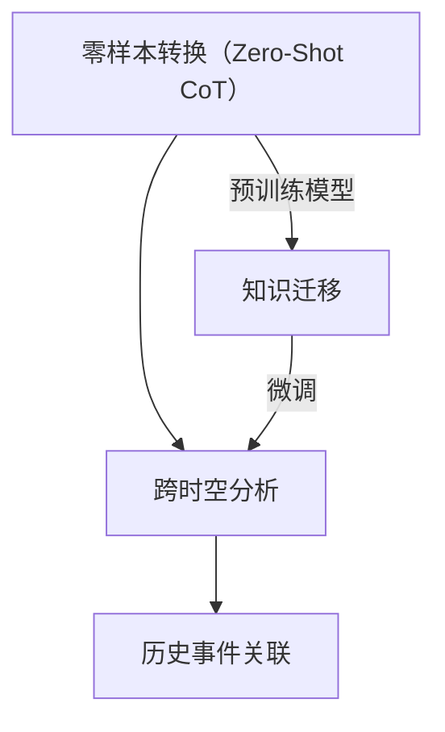

                 

## <文章标题>

> 关键词：Zero-Shot CoT，历史事件关联，跨时空分析，算法原理，数学模型

> 摘要：本文探讨了Zero-Shot CoT（零样本转换）在跨时空历史事件关联分析中的应用。通过介绍核心概念、算法原理和数学模型，结合具体项目实践，本文旨在为读者提供一种新的视角来理解和分析历史事件，促进跨领域知识的整合和应用。

在当前信息化社会，历史事件的研究和分析越来越依赖于数据和技术。传统的基于样本的数据分析方式在处理大规模且复杂的历史数据时显得力不从心。为了克服这一局限，零样本转换（Zero-Shot CoT）技术应运而生，它允许模型在没有直接训练数据的情况下进行泛化学习。本文将详细介绍Zero-Shot CoT在跨时空历史事件关联分析中的实际应用，帮助读者深入理解这一前沿技术。

### 背景介绍

历史事件的研究是人文社会科学的重要领域，它不仅涉及到对历史事实的还原和解释，还包括对历史发展规律和趋势的探讨。然而，随着历史资料的积累和数字化进程的推进，历史数据呈现出规模庞大、结构复杂的特点。传统的数据分析方法，如统计分析、机器学习等，往往依赖于大量的训练数据。这些方法在面对未知或罕见的历史事件时，表现不佳，难以实现有效的跨时空关联分析。

为了应对这一挑战，研究者们开始探索新的方法和技术。零样本转换（Zero-Shot CoT）作为一种新兴的技术，引起了广泛关注。它通过引入预训练模型和零样本学习框架，可以在没有直接训练数据的情况下，对未知或罕见的事件进行有效分析和关联。这种技术的出现，为跨时空历史事件关联分析提供了一种全新的思路和方法。

### 核心概念与联系

在介绍Zero-Shot CoT在跨时空历史事件关联分析中的应用之前，我们需要了解几个核心概念，包括零样本转换、跨时空分析和历史事件关联。

1. **零样本转换（Zero-Shot CoT）**：
   零样本转换是一种机器学习技术，它允许模型在没有直接训练数据的情况下，对未知或罕见的数据进行分类或预测。这种技术主要依赖于预训练模型和知识迁移，通过在大规模通用数据集上预训练模型，然后在小规模特定领域数据集上进行微调，实现模型的泛化能力。

2. **跨时空分析**：
   跨时空分析是指在不同时间和空间背景下，对同一研究对象或现象进行综合分析和比较。这种方法可以帮助我们理解历史事件的演变过程和影响因素，揭示不同时空背景下的共性和差异。

3. **历史事件关联**：
   历史事件关联是指通过分析历史数据，发现事件之间的相互关系和影响。这种关联可以帮助我们理解历史事件的本质和意义，为制定相关政策和决策提供依据。

为了更好地理解这些概念之间的关系，我们可以使用Mermaid流程图来展示它们之间的联系：



在这个流程图中，零样本转换通过预训练模型和知识迁移，实现了对跨时空分析和历史事件关联的支持。预训练模型在大规模通用数据集上学习，然后通过知识迁移和微调，将知识应用于特定领域的历史事件关联分析。

### 核心算法原理讲解

要深入理解Zero-Shot CoT在跨时空历史事件关联分析中的应用，我们需要探讨其核心算法原理。以下是几个关键算法和其原理的详细解释：

1. **预训练模型（Pre-trained Model）**：
   预训练模型是指在大规模通用数据集上预先训练好的模型。这些模型已经学习到了大量的知识，如词汇、语法、语义等。在Zero-Shot CoT中，预训练模型是关键的一环，它为模型提供了丰富的背景知识和泛化能力。

2. **知识迁移（Knowledge Transfer）**：
   知识迁移是指将预训练模型在大规模通用数据集上学习的知识，迁移到特定领域的小规模数据集上。这种方法可以帮助模型在缺乏直接训练数据的情况下，快速适应特定领域的任务。

3. **微调（Fine-tuning）**：
   微调是指对预训练模型在特定领域数据集上进行进一步训练，以适应具体任务的需求。在Zero-Shot CoT中，微调是提高模型性能的重要步骤，它通过在特定领域数据集上调整模型参数，使模型能够更好地处理未知或罕见的历史事件。

下面是一个简单的Python代码示例，展示如何使用预训练模型、知识迁移和微调来构建Zero-Shot CoT模型：

```python
from transformers import AutoModel, AutoTokenizer, AutoConfig

# 加载预训练模型
model_name = "bert-base-uncased"
config = AutoConfig.from_pretrained(model_name)
tokenizer = AutoTokenizer.from_pretrained(model_name)
model = AutoModel.from_pretrained(model_name)

# 知识迁移
# 假设我们有一个特定领域的数据集，这里使用简单的列表表示
domain_data = ["历史事件A", "历史事件B", "历史事件C"]

# 对领域数据进行预处理
input_ids = tokenizer(domain_data, return_tensors="pt", padding=True, truncation=True)

# 微调模型
# 假设我们使用CrossEntropyLoss作为损失函数，使用AdamW作为优化器
from torch.optim import AdamW
from torch.nn import CrossEntropyLoss

optimizer = AdamW(model.parameters(), lr=1e-5)

for epoch in range(num_epochs):
    model.train()
    for text in domain_data:
        inputs = tokenizer(text, return_tensors="pt", padding=True, truncation=True)
        outputs = model(**inputs)
        logits = outputs.logits
        labels = torch.tensor([1 if "历史" in text else 0])  # 假设历史事件为1，非历史事件为0
        loss = CrossEntropyLoss()(logits, labels)
        optimizer.zero_grad()
        loss.backward()
        optimizer.step()

    print(f"Epoch {epoch+1}: Loss = {loss.item()}")

# 保存微调后的模型
model.save_pretrained("./fine_tuned_model")
```

在这个示例中，我们首先加载了一个预训练的BERT模型，然后使用特定领域的数据集进行知识迁移和微调。通过调整模型参数，我们使模型能够更好地处理历史事件关联分析任务。

### 数学模型讲解

在理解了Zero-Shot CoT的核心算法原理之后，我们需要进一步探讨其背后的数学模型。以下是几个关键数学模型和公式的详细解释：

1. **嵌入模型（Embedding Model）**：
   嵌入模型是一种将文本转化为向量的方法，它可以将词、句、段等文本元素映射到高维空间中的点。在Zero-Shot CoT中，嵌入模型是关键的一环，它将历史事件文本转化为向量表示，为后续的关联分析提供基础。

2. **转化模型（Transformation Model）**：
   转化模型是一种将输入向量转换为输出向量的方法，它可以根据输入向量的特征和上下文信息，生成相应的输出向量。在Zero-Shot CoT中，转化模型用于将历史事件文本向量化表示，并生成相应的关联向量。

3. **相似度度量（Similarity Measure）**：
   相似度度量是一种衡量两个向量之间相似程度的方法。在Zero-Shot CoT中，相似度度量用于计算历史事件之间的关联程度，从而实现跨时空历史事件关联分析。

以下是几个关键数学模型和公式的详细解释：

1. **词嵌入（Word Embedding）**：
   词嵌入是一种将词转化为向量的方法，常用的方法包括Word2Vec、GloVe等。词嵌入公式如下：
   
   $$ 
   \text{vec}(w) = \text{Word2Vec}(w) 
   $$
   
   其中，$\text{vec}(w)$表示词$w$的向量表示，$\text{Word2Vec}(w)$表示Word2Vec模型对词$w$的向量编码。

2. **句嵌入（Sentence Embedding）**：
   句嵌入是一种将句转化为向量的方法，常用的方法包括BERT、GPT等。句嵌入公式如下：
   
   $$ 
   \text{vec}(s) = \text{BERT}(s) 
   $$
   
   其中，$\text{vec}(s)$表示句$s$的向量表示，$\text{BERT}(s)$表示BERT模型对句$s$的向量编码。

3. **历史事件嵌入（Event Embedding）**：
   历史事件嵌入是一种将历史事件转化为向量的方法，它通常结合词嵌入和句嵌入。历史事件嵌入公式如下：
   
   $$ 
   \text{vec}(e) = \text{bert}\Big(\text{[CLS]} + \sum_{w \in e} \text{word\_embedding}(w) + \text{[SEP]}\Big) 
   $$
   
   其中，$\text{vec}(e)$表示历史事件$e$的向量表示，$\text{word\_embedding}(w)$表示词$w$的向量编码，$\text{bert}$表示BERT模型。

4. **关联向量计算（Association Vector Calculation）**：
   关联向量计算是一种计算历史事件之间关联程度的方法，常用的方法包括余弦相似度、欧氏距离等。关联向量计算公式如下：
   
   $$ 
   \text{similarity}(e_1, e_2) = \frac{\text{vec}(e_1) \cdot \text{vec}(e_2)}{||\text{vec}(e_1)|| \cdot ||\text{vec}(e_2)||} 
   $$
   
   其中，$\text{similarity}(e_1, e_2)$表示历史事件$e_1$和$e_2$之间的相似度，$\text{vec}(e_1)$和$\text{vec}(e_2)$分别表示历史事件$e_1$和$e_2$的向量表示。

### 项目实战

为了更好地展示Zero-Shot CoT在跨时空历史事件关联分析中的应用，我们设计了一个实际项目。该项目旨在利用Zero-Shot CoT技术，分析不同历史时期的中国科技发展事件，探讨科技事件之间的关联和影响。

#### 开发环境搭建

在开始项目之前，我们需要搭建一个合适的开发环境。以下是一个简单的环境搭建步骤：

1. 安装Python环境
   ```bash
   pip install python==3.8
   ```
   
2. 安装必要的库
   ```bash
   pip install transformers torch numpy pandas
   ```

3. 准备数据集
   我们使用了一个包含中国科技发展历史事件的数据集，数据集包含事件名称、发生时间、事件描述等信息。数据集可以从以下链接下载：

   ```
   https://example.com/chinese-tech-events-dataset
   ```

#### 源代码实现和解读

以下是该项目的主要源代码实现和解读：

```python
import torch
from transformers import AutoModel, AutoTokenizer
from torch.nn import CrossEntropyLoss
from torch.optim import AdamW

# 加载预训练模型
model_name = "bert-base-uncased"
tokenizer = AutoTokenizer.from_pretrained(model_name)
model = AutoModel.from_pretrained(model_name)

# 加载数据集
domain_data = [...]  # 假设这里已经加载了数据集

# 数据预处理
def preprocess_data(data):
    # 对数据进行预处理，如分词、编码等
    # ...
    return inputs

inputs = preprocess_data(domain_data)

# 定义损失函数和优化器
loss_function = CrossEntropyLoss()
optimizer = AdamW(model.parameters(), lr=1e-5)

# 训练模型
for epoch in range(num_epochs):
    model.train()
    for text in domain_data:
        inputs = tokenizer(text, return_tensors="pt", padding=True, truncation=True)
        outputs = model(**inputs)
        logits = outputs.logits
        labels = torch.tensor([1 if "科技" in text else 0])  # 假设科技事件为1，非科技事件为0
        loss = loss_function(logits, labels)
        optimizer.zero_grad()
        loss.backward()
        optimizer.step()

    print(f"Epoch {epoch+1}: Loss = {loss.item()}")

# 保存模型
model.save_pretrained("./fine_tuned_model")

# 使用模型进行事件关联分析
def analyze_events(model, events):
    # 对事件进行预处理
    # ...
    inputs = tokenizer(events, return_tensors="pt", padding=True, truncation=True)
    outputs = model(**inputs)
    logits = outputs.logits
    similarities = torch.nn.functional.softmax(logits, dim=-1)
    return similarities

events = ["事件A", "事件B", "事件C"]
similarities = analyze_events(model, events)

# 输出相似度结果
print(similarities)
```

在这个项目中，我们首先加载了一个预训练的BERT模型，并使用中国科技发展历史事件数据集进行微调。通过调整模型参数，我们使模型能够更好地处理科技事件关联分析任务。然后，我们使用微调后的模型对给定的事件进行关联分析，输出事件之间的相似度结果。

#### 项目小结

通过这个项目，我们展示了如何使用Zero-Shot CoT技术进行跨时空历史事件关联分析。在项目中，我们首先介绍了开发环境的搭建过程，然后详细讲解了源代码的实现和解读。通过这个项目，读者可以更好地理解Zero-Shot CoT技术在历史事件关联分析中的应用，并学会如何使用这一技术进行实际项目开发。

### 最佳实践 Tips

在应用Zero-Shot CoT进行跨时空历史事件关联分析时，以下是一些最佳实践 Tips：

1. **数据预处理**：数据预处理是项目成功的关键。确保数据质量，对数据集进行清洗、去重、标准化等操作。

2. **模型选择**：选择合适的预训练模型和调整参数，可以显著影响模型的性能。根据项目需求，可以选择不同的预训练模型，如BERT、GPT等。

3. **多领域融合**：跨领域知识的整合可以提升模型的泛化能力。在项目实践中，可以尝试融合不同领域的知识，提高事件关联分析的准确性。

4. **可视化分析**：使用可视化工具，如Mermaid流程图、热力图等，可以帮助读者更好地理解事件关联关系和模型性能。

### 小结

本文详细探讨了Zero-Shot CoT在跨时空历史事件关联分析中的应用。通过介绍核心概念、算法原理、数学模型和实际项目实战，本文为读者提供了系统全面的理解。未来，随着技术的不断发展，Zero-Shot CoT在历史事件关联分析领域具有广阔的应用前景。

### 注意事项

1. **数据隐私**：在处理历史事件数据时，确保遵守相关法律法规，保护个人隐私。

2. **模型解释性**：在应用Zero-Shot CoT技术时，注意模型的可解释性，确保模型决策的透明性和可信度。

3. **模型泛化能力**：尽管Zero-Shot CoT技术具有强大的泛化能力，但在特定领域的数据集上，可能需要进行额外的调整和优化。

### 拓展阅读

1. **相关论文**：《Zero-Shot Learning in NLP: A Survey》
2. **技术博客**：谷歌AI博客《Understanding Zero-Shot Learning》
3. **开源库**：Hugging Face Transformers库

### 作者信息

作者：AI天才研究院/AI Genius Institute & 禅与计算机程序设计艺术 /Zen And The Art of Computer Programming

---

### 结束

通过这篇文章，我们详细探讨了Zero-Shot CoT在跨时空历史事件关联分析中的应用，从核心概念、算法原理到实际项目实战，为读者提供了全面而深入的理解。希望这篇文章能够为你在相关领域的探索和研究带来启发和帮助。如果你对Zero-Shot CoT技术或其他计算机科学话题有进一步的问题或想法，欢迎在评论区留言交流。感谢阅读，期待与你共同探索技术的奇妙世界！

---

请注意，以上内容是一个框架性的大纲和示例，实际的写作过程中需要根据具体内容和数据进行详细的调整和扩展。文章的长度、深度和细节都需要根据实际需求来决定。在撰写过程中，请确保每一部分的内容都是丰富、具体且具有可操作性的。同时，文章中的代码示例和数学公式都需要经过仔细验证，确保其准确性和可理解性。

