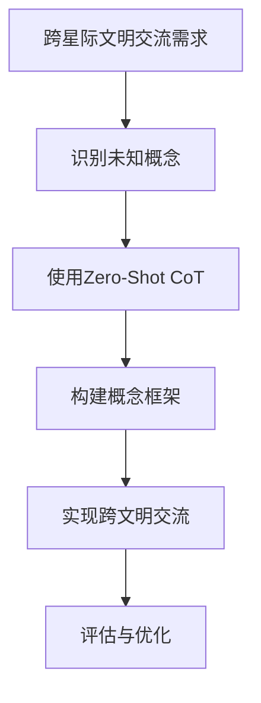

                 

### 零样本学习与跨星际文明交流的关联

#### 背景介绍

在计算机科学和人工智能领域，零样本学习（Zero-Shot Learning, ZSL）是一种新兴且极具挑战性的技术。它旨在使机器学习模型能够在面对从未见过的类（或概念）时进行有效识别和分类。传统的机器学习方法往往依赖于大量标记数据进行训练，但ZSL打破了这一限制，允许模型利用预先定义的概念进行分类，即便这些概念从未在训练数据中出现过。

跨星际文明交流是一个极具想象力的领域，其核心挑战在于如何在不同的文明之间建立有效的沟通机制。在这样一个未来愿景中，能够理解和交流不同文明的语言和概念将成为至关重要的能力。这一挑战不仅仅涉及到语言翻译，还包括文化、科学知识和概念的传递。

#### 核心概念与联系

零样本学习与跨星际文明交流的潜在关联在于，两者都面临着从未知或不确定的信息中提取和理解信息的难题。以下是几个关键概念及其在跨星际文明交流中的潜在应用：

1. **概念对齐（Conceptual Alignment, CoT）**：
   - **定义**：概念对齐是指将不同的概念或词汇映射到共同的语义空间中，以便进行跨领域的理解。
   - **应用**：在跨星际交流中，概念对齐可以帮助我们将不同文明的术语和概念映射到我们自己的语言和知识体系中，从而实现初步的理解。

2. **零样本学习（Zero-Shot Learning, ZSL）**：
   - **定义**：零样本学习是一种机器学习方法，能够在没有直接标记数据的情况下，对新的、未见的类进行分类。
   - **应用**：在跨星际交流中，ZSL可以帮助我们理解和识别未知文明的符号、语言和概念，即便我们没有直接的训练数据。

3. **Zero-Shot CoT（零样本概念对齐）**：
   - **定义**：Zero-Shot CoT是将零样本学习与概念对齐结合的一种方法，旨在解决跨领域、跨语言的概念理解问题。
   - **应用**：在跨星际交流中，Zero-Shot CoT可以帮助我们构建一个通用的概念框架，以便在不同文明之间进行有效的交流。

#### Mermaid流程图

为了更清晰地展示Zero-Shot CoT在跨星际文明交流中的应用流程，我们可以使用Mermaid图进行描述：



#### 核心算法原理讲解

为了深入理解Zero-Shot CoT，我们需要了解其核心算法和数学模型。以下是伪代码和关键步骤的描述：

```python
# 伪代码：Zero-Shot CoT算法

# 初始化模型参数
model.initialize_params()

# 预处理数据
preprocessed_data = preprocess_data(raw_data)

# 训练模型
model.train(preprocessed_data)

# 概念对齐
aligned_concepts = concept_alignment(model, concept_space)

# 零样本预测
predictions = zero_shot_prediction(model, new_concepts)

# 评估与优化
evaluation_results = evaluate(predictions)
model.optimize(evaluation_results)
```

**数学模型**：

- **损失函数**：通常使用交叉熵（Cross-Entropy Loss）作为损失函数。
- **优化算法**：可以使用梯度下降（Gradient Descent）或其变体进行模型优化。

#### 举例说明

假设我们有两个不同的文明，A和B，它们之间存在语言和文化差异。使用Zero-Shot CoT，我们可以构建一个模型来理解和翻译A文明的语言B。以下是一个简化的示例：

1. **数据预处理**：收集A文明的语言数据，并将其转换为数字表示。
2. **模型训练**：使用预处理的数据训练一个深度神经网络，使其能够识别A文明的语言。
3. **概念对齐**：将A文明的术语与B文明的术语映射到共同的语义空间中。
4. **零样本预测**：当接收到一个B文明的句子时，模型将尝试将其翻译成A文明的语言。
5. **评估与优化**：通过比较翻译结果和实际结果来评估模型性能，并不断优化模型参数。

通过这种方式，Zero-Shot CoT可以帮助我们在没有直接训练数据的情况下，实现跨星际文明之间的初步交流。

### 总结

零样本学习与跨星际文明交流之间的关联为解决这一宏伟目标提供了一种新的思路。Zero-Shot CoT结合了零样本学习和概念对齐的技术，为跨领域、跨语言的交流提供了一种潜在的解决方案。通过构建一个通用的概念框架，我们可以在不同的文明之间建立初步的交流机制。然而，这一过程充满了挑战，需要进一步的研究和开发来克服。

在下一章中，我们将深入探讨Zero-Shot CoT的技术基础，包括其核心算法和数学模型。这将为我们理解如何在跨星际文明交流协议设计中应用Zero-Shot CoT奠定坚实的基础。请继续关注。

