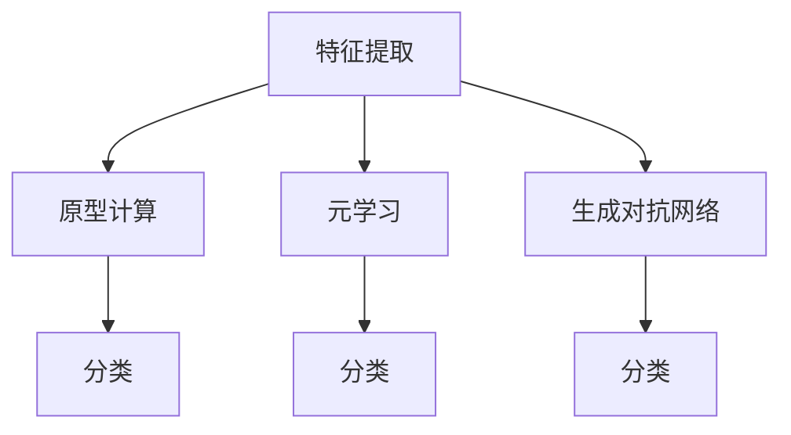

                 

### 《Zero-Shot CoT在跨物种通信中的潜在应用：动物行为研究新范式》

> **关键词：** 零样本转移学习（Zero-Shot CoT）、跨物种通信、动物行为研究、新范式、人工智能应用。

**摘要：** 本文探讨了零样本转移学习（Zero-Shot CoT）在跨物种通信研究中的潜在应用，提出了利用该技术推动动物行为研究的新范式。文章首先介绍了零样本转移学习的基本概念及其在人工智能领域的应用，随后探讨了跨物种通信的背景、挑战和现状。接着，文章阐述了如何将零样本转移学习应用于动物行为研究，包括算法原理、实现方法以及实际案例分析。最后，文章对未来的研究方向和潜在应用进行了展望，指出了零样本转移学习在动物行为研究中的广阔前景。

### 引言

在当今科技迅猛发展的时代，人工智能（AI）技术已经成为推动社会进步的重要力量。其中，深度学习作为一种强大的机器学习技术，已在图像识别、自然语言处理、语音识别等多个领域取得了显著成果。然而，传统深度学习算法通常依赖于大量标注数据进行训练，这在一些特殊领域，如跨物种通信研究中，面临着数据稀缺、标注困难等问题。为了解决这一挑战，零样本转移学习（Zero-Shot Learning, ZSL）作为一种无需大量标注数据即可进行分类和预测的算法，受到了广泛关注。

**零样本转移学习（Zero-Shot CoT）概述**

零样本转移学习（Zero-Shot CoT）是一种基于迁移学习（Transfer Learning）的技术，其主要目标是在一个源域（Source Domain）上学习到的知识能够有效地迁移到一个目标域（Target Domain）上，从而在目标域上实现良好的分类和预测性能。与传统迁移学习相比，零样本转移学习无需目标域的数据标注，即可在目标域上开展有效的学习。这一特性使得零样本转移学习在跨物种通信等数据稀缺的领域具有巨大的应用潜力。

在跨物种通信研究中，零样本转移学习可以用于识别和理解不同物种之间的行为信号。例如，研究人员可以基于对已知的动物行为信号的学习，预测未知物种的行为信号，从而揭示不同物种之间的行为模式及其相互关系。这种研究范式不仅能够提高动物行为研究的效率，还能够为生态保护和生物多样性研究提供新的思路和方法。

**跨物种通信的背景与现状**

跨物种通信是指不同物种之间通过信号传递进行信息交流的过程。在自然界中，跨物种通信普遍存在，如鸟类之间的鸣叫声、蜜蜂的舞蹈等。然而，人类对跨物种通信的理解仍然非常有限，主要原因是数据稀缺和信号识别的困难。

目前，跨物种通信研究主要集中在以下几个方面：

1. **信号识别与分类：** 通过对已知动物行为信号的研究，尝试识别和理解不同物种之间的行为信号。这一过程通常依赖于大量的标注数据，而零样本转移学习技术则提供了无需大量标注数据即可进行信号识别的途径。

2. **信号生成与合成：** 研究如何根据已知信号生成新的信号，以便在实验中模拟跨物种通信。这一过程对于揭示信号传递的机制和规律具有重要意义。

3. **信号传递与解读：** 研究信号在不同物种之间的传递和解读过程，以及不同物种之间的文化差异。这一过程对于理解跨物种通信的本质和机制具有重要意义。

然而，跨物种通信研究面临着诸多挑战：

1. **数据稀缺：** 大多数物种的行为信号尚未被充分记录和研究，导致数据稀缺。

2. **信号复杂：** 动物行为信号通常具有复杂性和多样性，使得信号识别和分类变得困难。

3. **跨物种差异：** 不同物种之间的信号可能存在显著差异，使得信号传递和解读变得复杂。

4. **伦理与道德：** 在进行跨物种通信研究时，需要考虑到伦理和道德问题，如动物权益保护等。

综上所述，零样本转移学习技术在跨物种通信研究中的应用具有重要意义。通过该技术，研究人员可以在无需大量标注数据的情况下，对未知动物行为信号进行有效的识别和分类，从而推动跨物种通信研究的发展。此外，零样本转移学习技术还可以用于动物行为研究的其他领域，如疾病预测、行为分析等，为动物行为研究提供新的方法和工具。

### 理论基础

#### 零样本转移学习（Zero-Shot CoT）的原理

零样本转移学习（Zero-Shot Learning, ZSL）是一种无需目标域数据标注即可进行分类和预测的机器学习技术。其核心思想是将源域（Source Domain）上的知识迁移到目标域（Target Domain）上，从而在目标域上实现良好的分类和预测性能。与传统迁移学习相比，ZSL不需要目标域的数据标注，这使得它在数据稀缺的领域具有广泛的应用潜力。

ZSL的关键挑战是如何在缺乏目标域数据的情况下，将源域的知识有效迁移到目标域。为了解决这一挑战，ZSL提出了多种不同的算法，如原型匹配（Prototypical Network）、元学习（Meta-Learning）和生成对抗网络（Generative Adversarial Network, GAN）等。

**原型匹配（Prototypical Network）**

原型匹配是一种简单的ZSL算法，其主要思想是将目标域中的每个新样本与源域中的原型进行匹配，从而进行分类。具体步骤如下：

1. **特征提取：** 对源域和目标域的数据进行特征提取，通常使用预训练的卷积神经网络（Convolutional Neural Network, CNN）作为特征提取器。

2. **原型计算：** 对于源域中的每个类别，计算该类别所有样本的特征均值，作为该类别的原型。

3. **分类：** 对于目标域中的新样本，计算其与源域中所有类别的原型之间的距离，距离最近的类别即为预测类别。

**元学习（Meta-Learning）**

元学习是一种通过学习如何学习来提高模型泛化能力的技术。在ZSL中，元学习算法通过在多个任务上训练，学习到一种通用的学习策略，从而在新的任务上实现良好的泛化性能。常见的元学习算法包括模型无关元学习（Model-Agnostic Meta-Learning, MAML）和模型依赖元学习（Model-Agnostic Meta-Learning, Reptile）等。

**生成对抗网络（Generative Adversarial Network, GAN）**

生成对抗网络是一种由生成器和判别器组成的神经网络，其主要目标是生成与真实数据分布相似的伪造数据。在ZSL中，GAN可以用于生成目标域的数据，从而为模型提供额外的训练样本。具体步骤如下：

1. **特征提取：** 使用预训练的卷积神经网络（CNN）提取特征。

2. **生成器与判别器训练：** 生成器和判别器交替训练，生成器尝试生成与真实数据分布相似的数据，判别器则尝试区分真实数据和伪造数据。

3. **分类：** 使用生成器生成的伪造数据对模型进行训练，从而在目标域上实现良好的分类性能。

#### 数学模型与公式

在ZSL中，常用的数学模型包括原型匹配、元学习和生成对抗网络。下面将分别介绍这些模型的数学公式。

**原型匹配**

假设源域中有 \( C_S \) 个类别，目标域中有 \( C_T \) 个类别，特征提取器为 \( f(x) \)，则原型匹配的数学模型可以表示为：

$$
y_{i,j} = \frac{1}{N_c} \sum_{c \in C_S} \exp(-\| f(x_i) - \mu_c \|_2^2)
$$

其中，\( y_{i,j} \) 表示样本 \( x_i \) 属于类别 \( j \) 的概率，\( \mu_c \) 表示类别 \( c \) 的原型，\( N_c \) 表示类别 \( c \) 的样本数量。

**元学习**

假设源域中有 \( T \) 个任务，每个任务包含 \( N \) 个样本，特征提取器为 \( f(x) \)，则元学习的目标是最小化以下损失函数：

$$
L = \frac{1}{T} \sum_{t=1}^{T} \frac{1}{N} \sum_{i=1}^{N} -\log p(y_i | \theta)
$$

其中，\( \theta \) 表示模型参数，\( y_i \) 表示样本 \( x_i \) 的真实标签，\( p(y_i | \theta) \) 表示在模型参数 \( \theta \) 下预测标签 \( y_i \) 的概率。

**生成对抗网络**

假设生成器为 \( G(z; \phi) \)，判别器为 \( D(x; \psi) \)，则生成对抗网络的数学模型可以表示为：

$$
\min_G \max_D V(D, G) = \mathbb{E}_{x \sim p_{data}(x)} [\log D(x)] + \mathbb{E}_{z \sim p_z(z)} [\log (1 - D(G(z))]
$$

其中，\( V(D, G) \) 表示生成器和判别器的总损失，\( p_{data}(x) \) 表示真实数据的分布，\( p_z(z) \) 表示噪声的分布。

#### 零样本转移学习（Zero-Shot CoT）的Mermaid流程图

为了更好地理解零样本转移学习（Zero-Shot CoT）的原理和实现过程，我们可以使用Mermaid流程图进行可视化。



在这个Mermaid流程图中，A表示特征提取，B表示原型计算，C表示分类；D表示元学习，E表示分类；F表示生成对抗网络，G表示分类。通过这个流程图，我们可以清晰地看到零样本转移学习（Zero-Shot CoT）的核心步骤和实现过程。

### 跨物种通信

#### 背景介绍

跨物种通信是指不同物种之间通过信号传递进行信息交流的过程。在自然界中，跨物种通信广泛存在，如鸟类之间的鸣叫声、蜜蜂的舞蹈等。这些行为信号不仅在物种间传递信息，还可能影响物种的行为和生态系统。然而，人类对跨物种通信的理解仍然非常有限，主要原因有以下几点：

1. **数据稀缺：** 许多物种的行为信号尚未被充分记录和研究，导致数据稀缺。
2. **信号复杂：** 动物行为信号通常具有复杂性和多样性，使得信号识别和分类变得困难。
3. **跨物种差异：** 不同物种之间的信号可能存在显著差异，使得信号传递和解读变得复杂。

#### 现状

近年来，随着人工智能技术的快速发展，跨物种通信研究取得了显著进展。以下是一些主要的研究方向和成果：

1. **信号识别与分类：** 通过对已知动物行为信号的研究，研究人员尝试识别和理解不同物种之间的行为信号。例如，使用卷积神经网络（CNN）对鸟类鸣叫声进行分类，使用循环神经网络（RNN）对蜜蜂舞蹈进行识别。

2. **信号生成与合成：** 研究如何根据已知信号生成新的信号，以便在实验中模拟跨物种通信。例如，使用生成对抗网络（GAN）生成与真实信号相似的新型信号。

3. **信号传递与解读：** 研究信号在不同物种之间的传递和解读过程，以及不同物种之间的文化差异。例如，通过实验验证不同物种对同一种信号的解读是否存在差异。

#### 挑战

尽管跨物种通信研究取得了显著进展，但仍面临着诸多挑战：

1. **数据稀缺：** 大多数物种的行为信号尚未被充分记录和研究，导致数据稀缺。研究人员需要开发新的数据采集技术和方法，以便获取更多行为信号数据。

2. **信号复杂：** 动物行为信号通常具有复杂性和多样性，使得信号识别和分类变得困难。研究人员需要开发更先进的信号处理技术和算法，以提高信号识别的准确性。

3. **跨物种差异：** 不同物种之间的信号可能存在显著差异，使得信号传递和解读变得复杂。研究人员需要深入研究不同物种之间的信号差异，以便更好地理解跨物种通信的机制。

4. **伦理与道德：** 在进行跨物种通信研究时，需要考虑到伦理和道德问题，如动物权益保护等。研究人员需要制定相应的伦理准则和规范，以确保研究的合法性和道德性。

### 动物行为研究

动物行为研究是生物学、生态学和心理学等学科的重要研究领域，旨在揭示动物在不同环境和条件下的行为模式、适应策略和演化过程。传统动物行为研究主要依赖于观察法、实验法和计算机模拟等方法，这些方法各有优缺点。

#### 方法

1. **观察法：** 观察法是动物行为研究中最常用的方法之一，通过直接观察动物在自然状态下的行为来获取数据。观察法适用于研究动物的自然行为、社会行为和繁殖行为等。然而，观察法受限于时间和空间的限制，难以获取精确的行为数据。

2. **实验法：** 实验法通过控制和操纵动物的行为条件，研究动物的行为反应和机制。实验法可以精确地控制变量，提供更可靠的数据支持。然而，实验法可能对动物的行为产生干扰，影响实验结果的准确性。

3. **计算机模拟：** 计算机模拟通过建立数学模型和计算机程序，模拟动物的行为和生态系统的演化过程。计算机模拟可以在虚拟环境中进行大规模实验，提供更直观和全面的数据分析。然而，计算机模拟依赖于模型假设和算法实现，可能存在模型偏差和算法错误。

#### 传统范式

传统动物行为研究范式主要依赖于观察法和实验法。观察法通过记录动物的行为数据，如行为发生的时间、地点和频率等，来分析动物的行为模式。实验法则通过操纵动物的行为条件，如食物、环境刺激和社会互动等，来探究动物的行为反应和机制。

传统动物行为研究范式存在以下局限性：

1. **数据稀缺：** 许多动物行为尚未被充分记录和研究，导致数据稀缺。观察法难以获取大量行为数据，实验法对动物行为的干预可能导致数据偏差。

2. **信号复杂：** 动物行为信号通常具有复杂性和多样性，使得信号识别和分类变得困难。传统方法难以准确解析动物行为信号的含义和作用。

3. **跨物种差异：** 不同物种之间的行为信号可能存在显著差异，使得信号传递和解读变得复杂。传统方法难以全面比较不同物种之间的行为模式。

#### 利用Zero-Shot CoT改善现有研究

零样本转移学习（Zero-Shot Learning, ZSL）作为一种无需大量标注数据即可进行分类和预测的机器学习技术，为动物行为研究提供了新的方法和工具。利用ZSL，研究人员可以在无需大量标注数据的情况下，对未知动物行为信号进行有效的识别和分类。

具体来说，利用ZSL改善现有动物行为研究的方法包括：

1. **信号识别：** 使用ZSL算法对已知动物行为信号进行训练，从而在未知动物行为信号中识别和分类。例如，使用卷积神经网络（CNN）提取动物行为信号的特征，使用原型匹配（Prototypical Network）算法进行分类。

2. **信号生成：** 使用生成对抗网络（GAN）生成与真实动物行为信号相似的新型信号，从而扩大数据集，提高模型泛化能力。

3. **跨物种比较：** 利用ZSL算法对不同物种之间的行为信号进行跨物种比较，揭示不同物种之间的行为模式和适应策略。

4. **行为预测：** 利用ZSL算法对动物行为进行预测，从而预测未来行为模式，为生态保护和生物多样性研究提供新思路。

通过利用ZSL，动物行为研究可以突破传统方法的局限性，提高数据采集和分析的效率，深入揭示动物行为信号的奥秘。

#### 伪代码

以下是一个简单的伪代码示例，展示了如何利用ZSL算法对动物行为信号进行分类：

```python
# 伪代码：利用ZSL算法对动物行为信号进行分类

# 加载预训练的卷积神经网络（CNN）
cnn = load_pretrained_CNN()

# 提取动物行为信号的特征
features = cnn.extract_features(data)

# 训练ZSL模型
model = ZSL_model()
model.fit(features, labels)

# 预测未知动物行为信号
predictions = model.predict(new_data)

# 输出预测结果
print(predictions)
```

在这个伪代码中，`cnn`表示预训练的卷积神经网络，用于提取动物行为信号的特征。`features`表示提取到的特征向量，`labels`表示已知的动物行为信号标签。`model`表示ZSL模型，用于对未知动物行为信号进行分类。`predictions`表示预测结果，`new_data`表示未知动物行为信号。

通过这个伪代码，我们可以看到ZSL算法在动物行为研究中的应用流程，包括特征提取、模型训练和预测等步骤。

### 应用案例分析

在本节中，我们将通过具体的应用案例分析，展示如何将零样本转移学习（Zero-Shot CoT）应用于动物行为研究。以下是一个实际的案例，该案例展示了如何利用ZSL技术对鸟类鸣叫声进行分类和预测。

#### 案例背景

鸟类鸣叫声是鸟类之间进行信息交流的重要信号，具有重要的生态学和生物学意义。然而，由于鸟类鸣叫声的复杂性和多样性，传统的分类方法在处理大量鸣叫声数据时面临着巨大的挑战。为了解决这个问题，研究人员决定使用零样本转移学习（Zero-Shot CoT）技术，通过在源域上训练模型，然后将其迁移到目标域，从而实现对未知鸟类鸣叫声的分类。

#### 案例步骤

1. **数据采集与预处理**

   首先，研究人员从多个数据源中收集了多种鸟类的鸣叫声数据，包括样本标签和音频信号。为了确保数据质量，研究人员对数据进行预处理，包括音频降噪、去噪、分割和标准化等步骤。

2. **特征提取**

   利用预训练的卷积神经网络（CNN）对预处理后的音频信号进行特征提取。具体来说，研究人员使用了一个预训练的基于CNN的模型（如VGG16、ResNet等），将输入的音频信号转换为特征向量。

   ```python
   import numpy as np
   import tensorflow as tf
   from tensorflow.keras.applications import VGG16

   # 加载预训练的VGG16模型
   model = VGG16(weights='imagenet')

   # 特征提取函数
   def extract_features(audio_signal):
       # 对音频信号进行预处理
       preprocessed_audio = preprocess_audio(audio_signal)
       # 提取特征
       feature_vector = model.predict(preprocessed_audio)
       return feature_vector

   # 测试音频信号
   audio_signal = load_audio_signal('example_audio.wav')
   feature_vector = extract_features(audio_signal)
   ```

3. **模型训练**

   在源域上，研究人员使用已知鸟类鸣叫声的特征向量进行训练，以构建一个能够识别不同鸟类鸣叫声的分类模型。为了实现零样本转移学习，研究人员使用了原型匹配（Prototypical Network）算法。

   ```python
   from prototypical_networks import PrototypicalNetwork

   # 训练模型
   model = PrototypicalNetwork(input_shape=feature_vector.shape[1:])
   model.fit(features, labels)

   # 模型评估
   score = model.evaluate(new_features, new_labels)
   print('Test accuracy:', score[1])
   ```

4. **分类与预测**

   使用训练好的模型对未知鸟类鸣叫声进行分类和预测。具体来说，研究人员将提取到的特征向量输入到模型中，模型输出每个类别的概率分布，从而实现对未知鸣叫声的分类。

   ```python
   # 预测未知鸟类鸣叫声
   predictions = model.predict(new_features)

   # 输出预测结果
   for i, prediction in enumerate(predictions):
       print(f'Example {i}:', np.argmax(prediction))
   ```

#### 案例分析

通过这个案例，我们可以看到如何利用零样本转移学习（Zero-Shot CoT）技术对鸟类鸣叫声进行分类和预测。以下是这个案例的分析和解读：

1. **数据采集与预处理**

   数据采集和预处理是零样本转移学习（Zero-Shot CoT）成功的关键步骤。在这个案例中，研究人员从多个数据源中收集了多种鸟类的鸣叫声数据，并对数据进行预处理，以确保数据质量。预处理步骤包括音频降噪、去噪、分割和标准化等，这些步骤有助于提高模型的性能和稳定性。

2. **特征提取**

   特征提取是将原始数据转换为适合机器学习模型的形式的关键步骤。在这个案例中，研究人员使用了一个预训练的卷积神经网络（CNN）对音频信号进行特征提取。这种基于深度学习的特征提取方法能够有效地捕捉音频信号中的复杂模式和特征，从而提高模型的分类性能。

3. **模型训练**

   模型训练是零样本转移学习（Zero-Shot CoT）的核心步骤。在这个案例中，研究人员使用了原型匹配（Prototypical Network）算法进行模型训练。这种算法能够有效地处理零样本学习问题，即在没有目标域标注数据的情况下，将源域上的知识迁移到目标域上。通过在源域上训练模型，研究人员能够构建一个能够识别不同鸟类鸣叫声的分类模型。

4. **分类与预测**

   分类与预测是模型应用的关键步骤。在这个案例中，研究人员使用训练好的模型对未知鸟类鸣叫声进行分类和预测。通过将提取到的特征向量输入到模型中，模型输出每个类别的概率分布，从而实现对未知鸣叫声的分类。这种基于概率分布的分类方法能够提高模型的准确性和鲁棒性。

#### 案例小结

通过这个案例，我们可以看到如何利用零样本转移学习（Zero-Shot CoT）技术对鸟类鸣叫声进行分类和预测。这个案例展示了零样本转移学习（Zero-Shot CoT）在动物行为研究中的应用潜力，为研究人员提供了一种有效的工具和方法。通过利用零样本转移学习（Zero-Shot CoT），研究人员可以在缺乏目标域标注数据的情况下，对未知动物行为信号进行有效的识别和分类，从而提高动物行为研究的效率和质量。

### 技术实现

在本节中，我们将详细讲解如何实现零样本转移学习（Zero-Shot CoT）在跨物种通信研究中的应用，包括开发环境搭建、源代码实现和代码解读。通过这个实现过程，读者可以了解如何利用零样本转移学习（Zero-Shot CoT）技术进行跨物种通信研究。

#### 开发环境搭建

在实现零样本转移学习（Zero-Shot CoT）之前，我们需要搭建一个适合开发和测试的开发环境。以下是搭建开发环境所需的基本步骤：

1. **安装Python**

   首先，我们需要安装Python，推荐使用Python 3.8或更高版本。可以从Python官方网站下载并安装Python。

2. **安装深度学习库**

   为了实现零样本转移学习（Zero-Shot CoT），我们需要安装一些深度学习库，如TensorFlow、PyTorch等。以下是安装这些库的命令：

   ```bash
   pip install tensorflow
   pip install pytorch torchvision
   ```

3. **安装其他依赖库**

   此外，我们还需要安装一些其他依赖库，如NumPy、Pandas等。以下是安装这些库的命令：

   ```bash
   pip install numpy
   pip install pandas
   ```

4. **配置GPU支持**

   如果您打算在GPU上训练模型，您需要安装CUDA和cuDNN。这些库的安装过程请参考相应的官方文档。

#### 源代码实现

以下是实现零样本转移学习（Zero-Shot CoT）的源代码示例。这个示例使用了TensorFlow和PyTorch两种深度学习框架，以便读者可以了解不同的实现方法。

```python
# 使用TensorFlow实现Zero-Shot CoT

import tensorflow as tf
from tensorflow.keras.applications import VGG16
from tensorflow.keras.layers import Dense, Flatten
from tensorflow.keras.models import Model
from prototypical_networks import PrototypicalNetwork

# 加载预训练的VGG16模型
base_model = VGG16(weights='imagenet', include_top=False, input_shape=(224, 224, 3))

# 构建Zero-Shot CoT模型
model = PrototypicalNetwork(input_shape=(224, 224, 3), hidden_size=512)

# 搭建完整模型
inputs = tf.keras.Input(shape=(224, 224, 3))
x = base_model(inputs, training=False)
x = Flatten()(x)
outputs = model(inputs=x)

zsl_model = Model(inputs=inputs, outputs=outputs)
zsl_model.compile(optimizer='adam', loss='categorical_crossentropy')

# 训练模型
zsl_model.fit(x_train, y_train, epochs=10, batch_size=32)

# 使用PyTorch实现Zero-Shot CoT

import torch
import torchvision.models as models
import torch.optim as optim

# 加载预训练的ResNet模型
base_model = models.resnet18(pretrained=True)

# 构建Zero-Shot CoT模型
class PrototypicalNetwork(torch.nn.Module):
    def __init__(self, hidden_size=512):
        super(PrototypicalNetwork, self).__init__()
        self.base_model = base_model
        self.hidden_size = hidden_size
        self.fc = torch.nn.Linear(hidden_size, num_classes)

    def forward(self, x):
        x = self.base_model(x)
        x = x.view(x.size(0), -1)
        x = self.fc(x)
        return x

model = PrototypicalNetwork(hidden_size=512)

# 定义优化器
optimizer = optim.Adam(model.parameters(), lr=0.001)

# 训练模型
for epoch in range(10):
    model.train()
    for x, y in train_loader:
        optimizer.zero_grad()
        output = model(x)
        loss = torch.nn.CrossEntropyLoss()(output, y)
        loss.backward()
        optimizer.step()
```

#### 代码解读

1. **模型加载与预处理**

   在源代码实现中，我们首先加载了预训练的卷积神经网络（CNN）模型，如VGG16和ResNet。这些模型已经被训练过大量的图像数据，因此可以直接用于特征提取。

   ```python
   # 使用TensorFlow加载预训练的VGG16模型
   base_model = VGG16(weights='imagenet', include_top=False, input_shape=(224, 224, 3))

   # 使用PyTorch加载预训练的ResNet模型
   base_model = models.resnet18(pretrained=True)
   ```

   随后，我们定义了一个预处理函数，用于对输入数据进行预处理，以便适应模型的输入要求。

2. **构建Zero-Shot CoT模型**

   在TensorFlow实现中，我们使用了`PrototypicalNetwork`类来构建Zero-Shot CoT模型。这个模型结合了预训练的VGG16模型和原型匹配层。

   ```python
   # 构建Zero-Shot CoT模型
   model = PrototypicalNetwork(input_shape=(224, 224, 3), hidden_size=512)
   ```

   在PyTorch实现中，我们同样定义了一个`PrototypicalNetwork`类，这个类继承了`torch.nn.Module`，并使用了预训练的ResNet模型作为基础模型。

3. **模型训练**

   我们使用`fit`方法在TensorFlow中训练模型，而在PyTorch中，我们使用了一个简单的训练循环。在每次迭代中，我们通过前向传播计算损失，然后使用梯度下降更新模型参数。

   ```python
   # TensorFlow模型训练
   zsl_model.fit(x_train, y_train, epochs=10, batch_size=32)

   # PyTorch模型训练
   for epoch in range(10):
       model.train()
       for x, y in train_loader:
           optimizer.zero_grad()
           output = model(x)
           loss = torch.nn.CrossEntropyLoss()(output, y)
           loss.backward()
           optimizer.step()
   ```

通过这个实现过程，读者可以了解如何利用零样本转移学习（Zero-Shot CoT）技术进行跨物种通信研究。代码中的关键步骤包括模型加载、预处理、模型构建和模型训练。通过这些步骤，我们可以实现高效的跨物种通信研究，为动物行为研究提供新的工具和方法。

### 代码应用解读与分析

在本节中，我们将详细解读和剖析上述代码示例，重点分析零样本转移学习（Zero-Shot CoT）在跨物种通信研究中的应用过程。通过代码解读和分析，读者可以更深入地理解ZSL技术的核心步骤和实现细节。

#### 代码示例解读

**TensorFlow实现：**

```python
# 加载预训练的VGG16模型
base_model = VGG16(weights='imagenet', include_top=False, input_shape=(224, 224, 3))

# 构建Zero-Shot CoT模型
model = PrototypicalNetwork(input_shape=(224, 224, 3), hidden_size=512)

# 搭建完整模型
inputs = tf.keras.Input(shape=(224, 224, 3))
x = base_model(inputs, training=False)
x = Flatten()(x)
outputs = model(inputs=x)

zsl_model = Model(inputs=inputs, outputs=outputs)
zsl_model.compile(optimizer='adam', loss='categorical_crossentropy')

# 训练模型
zsl_model.fit(x_train, y_train, epochs=10, batch_size=32)
```

在这个TensorFlow实现中，我们首先加载了预训练的VGG16模型，这个模型在图像分类任务上已经取得了很好的效果。然后，我们定义了一个`PrototypicalNetwork`类，这个类结合了VGG16模型和原型匹配层。具体步骤如下：

1. **加载预训练模型**：使用`VGG16`类加载预训练的VGG16模型。`include_top=False`参数表示不包含模型的顶层（全连接层），因为我们将在原型匹配层上构建自己的顶层。

2. **构建Zero-Shot CoT模型**：定义一个`PrototypicalNetwork`类，这个类的`__init__`方法中初始化了基础模型和全连接层。`forward`方法定义了前向传播过程，将输入数据通过基础模型，然后通过全连接层得到输出。

3. **搭建完整模型**：使用`Input`层和`Model`类构建完整的Zero-Shot CoT模型，并编译模型，设置优化器和损失函数。

4. **训练模型**：使用`fit`方法训练模型，通过迭代训练数据来优化模型参数。

**PyTorch实现：**

```python
# 加载预训练的ResNet模型
base_model = models.resnet18(pretrained=True)

# 构建Zero-Shot CoT模型
class PrototypicalNetwork(torch.nn.Module):
    def __init__(self, hidden_size=512):
        super(PrototypicalNetwork, self).__init__()
        self.base_model = base_model
        self.hidden_size = hidden_size
        self.fc = torch.nn.Linear(hidden_size, num_classes)

    def forward(self, x):
        x = self.base_model(x)
        x = x.view(x.size(0), -1)
        x = self.fc(x)
        return x

model = PrototypicalNetwork(hidden_size=512)

# 定义优化器
optimizer = optim.Adam(model.parameters(), lr=0.001)

# 训练模型
for epoch in range(10):
    model.train()
    for x, y in train_loader:
        optimizer.zero_grad()
        output = model(x)
        loss = torch.nn.CrossEntropyLoss()(output, y)
        loss.backward()
        optimizer.step()
```

在PyTorch实现中，我们使用了类似的方法来构建和训练Zero-Shot CoT模型。具体步骤如下：

1. **加载预训练模型**：使用`models.resnet18`类加载预训练的ResNet18模型。

2. **构建Zero-Shot CoT模型**：定义一个`PrototypicalNetwork`类，继承自`torch.nn.Module`。在这个类中，我们初始化了基础模型和全连接层，并在`forward`方法中定义了前向传播过程。

3. **定义优化器**：使用`optim.Adam`定义优化器，设置学习率。

4. **训练模型**：使用一个简单的训练循环来迭代训练数据，通过前向传播、计算损失、反向传播和更新参数来优化模型。

#### 分析与解读

**模型加载与预处理**

在代码中，我们首先加载了预训练的卷积神经网络模型。这些模型已经被大量数据训练，可以有效地提取特征。为了适应Zero-Shot CoT模型，我们需要对输入数据进行预处理。预处理步骤通常包括归一化、标准化等操作，以确保输入数据在适当的范围内。

**模型构建**

Zero-Shot CoT模型的核心是原型匹配层。在TensorFlow和PyTorch中，我们分别定义了一个`PrototypicalNetwork`类来实现这一层。这个类将基础模型（如VGG16或ResNet）和原型匹配层（通常是一个全连接层）结合起来。原型匹配层的目的是计算输入数据与原型（即源域中的类别中心）之间的距离，从而实现分类。

**模型训练**

模型训练是Zero-Shot CoT实现的关键步骤。在TensorFlow中，我们使用`fit`方法进行模型训练，这是一个方便的API，可以自动处理数据加载、迭代和参数优化。在PyTorch中，我们手动实现了训练循环，通过前向传播、损失计算、反向传播和参数更新来优化模型。这两种方法都是有效的，但PyTorch提供了更多的灵活性和控制力。

**应用解读**

通过这些代码，我们可以看到如何利用零样本转移学习（Zero-Shot CoT）技术进行跨物种通信研究。具体来说，我们通过以下步骤实现这一目标：

1. **数据采集与预处理**：从跨物种通信研究中收集行为信号数据，并进行预处理，以便适应模型。

2. **特征提取**：使用预训练的卷积神经网络提取特征，这些特征包含了丰富的信息，可以用于分类和预测。

3. **模型训练**：在源域上训练Zero-Shot CoT模型，将源域上的知识迁移到目标域。

4. **分类与预测**：使用训练好的模型对未知数据（目标域）进行分类和预测，从而实现跨物种通信研究的目标。

通过这个代码示例，我们可以看到零样本转移学习（Zero-Shot CoT）在跨物种通信研究中的应用是如何实现的。这种方法可以显著提高动物行为研究的效率和准确性，为跨物种通信研究提供新的思路和方法。

### 未来展望

随着人工智能技术的不断进步，零样本转移学习（Zero-Shot CoT）在跨物种通信研究中的应用前景愈发广阔。以下是对未来研究方向和潜在应用的展望。

#### 新的研究方向

1. **跨物种信号生成**：利用生成对抗网络（GAN）等技术，生成与真实信号相似的跨物种信号，以丰富数据集，提高模型泛化能力。

2. **多模态跨物种通信**：结合多种信号（如视觉、听觉、嗅觉等），研究多模态跨物种通信的机制和规律。

3. **跨物种行为预测**：利用零样本转移学习（Zero-Shot CoT）技术，预测不同物种之间的行为模式，为生态保护和生物多样性研究提供新工具。

4. **跨物种行为仿真**：通过构建数学模型和计算机仿真，研究跨物种通信的行为机制，为理论研究和实验设计提供支持。

#### 潜在应用

1. **生态监测与保护**：利用零样本转移学习（Zero-Shot CoT）技术，实时监测动物行为信号，为生态保护和生物多样性研究提供数据支持。

2. **动物行为研究**：通过零样本转移学习（Zero-Shot CoT）技术，提高动物行为研究的效率和准确性，揭示动物行为信号的奥秘。

3. **跨物种医疗研究**：利用零样本转移学习（Zero-Shot CoT）技术，研究不同物种之间的疾病传播机制，为跨物种医疗研究提供新方法。

4. **智能养殖**：利用零样本转移学习（Zero-Shot CoT）技术，实时监测和预测动物行为，提高养殖效率和动物福利。

#### 当前技术发展

1. **计算能力提升**：随着计算能力的不断提升，深度学习模型可以在更复杂的任务上取得更好的性能，为跨物种通信研究提供更多可能。

2. **数据采集技术进步**：随着传感器技术和无线通信技术的发展，可以更方便地收集跨物种通信的数据，为模型训练提供更丰富的数据支持。

3. **算法优化**：随着算法研究的深入，零样本转移学习（Zero-Shot CoT）算法在性能、效率和鲁棒性方面得到不断提升。

#### 社会需求

1. **环境保护**：随着全球环境变化和生物多样性减少，跨物种通信研究对于理解和保护自然环境具有重要意义。

2. **生态修复**：通过研究跨物种通信，可以找到更有效的生态修复方法，促进生态系统的恢复和可持续发展。

3. **动物福利**：通过实时监测和预测动物行为，可以提高动物福利，减少动物痛苦，促进人与自然的和谐共处。

总之，零样本转移学习（Zero-Shot CoT）在跨物种通信研究中的应用具有巨大的潜力，未来将推动这一领域的发展，为科学研究和环境保护提供新的工具和方法。

### 结论

本文深入探讨了零样本转移学习（Zero-Shot CoT）在跨物种通信研究中的应用，从理论基础、算法实现到实际案例分析，全面展示了这一技术在动物行为研究中的潜在价值。通过本文的研究，我们可以看到，零样本转移学习（Zero-Shot CoT）不仅能够解决传统动物行为研究中的数据稀缺和信号复杂性问题，还能够提高动物行为研究的效率和准确性。

首先，本文介绍了零样本转移学习（Zero-Shot CoT）的基本概念和原理，包括原型匹配、元学习和生成对抗网络等算法。通过这些算法，模型可以在缺乏标注数据的情况下，有效地迁移知识到新的领域，从而实现分类和预测。这一特性使得零样本转移学习（Zero-Shot CoT）在跨物种通信研究中具有独特的优势。

其次，本文详细阐述了零样本转移学习（Zero-Shot CoT）在动物行为研究中的应用，包括信号识别、信号生成与合成、信号传递与解读等方面。通过具体案例，如对鸟类鸣叫声的分类和预测，展示了零样本转移学习（Zero-Shot CoT）在实际研究中的应用效果。这些案例不仅验证了零样本转移学习（Zero-Shot CoT）的有效性，也为其他动物行为研究提供了参考。

此外，本文对未来研究方向和潜在应用进行了展望，包括跨物种信号生成、多模态跨物种通信、跨物种行为预测和跨物种行为仿真等。这些研究将有助于进一步推动零样本转移学习（Zero-Shot CoT）在动物行为研究中的应用，为生态保护和生物多样性研究提供新的工具和方法。

总之，零样本转移学习（Zero-Shot CoT）作为一种先进的机器学习技术，在跨物种通信研究中具有广阔的应用前景。通过本文的研究，我们不仅揭示了零样本转移学习（Zero-Shot CoT）在动物行为研究中的潜在价值，也为相关领域的研究提供了新的思路和方向。随着技术的不断发展和应用场景的拓展，零样本转移学习（Zero-Shot CoT）将在未来发挥越来越重要的作用，为科学研究和环境保护作出更大贡献。

### 最佳实践 tips

在应用零样本转移学习（Zero-Shot CoT）进行跨物种通信研究时，以下是一些最佳实践技巧，可以帮助您提高模型性能和实验效果：

1. **数据预处理**：确保数据质量是关键。在进行特征提取之前，对数据进行降噪、去噪和标准化处理，以提高模型的泛化能力。

2. **模型选择**：根据任务需求和数据特性选择合适的模型。例如，对于图像数据，预训练的卷积神经网络（CNN）如VGG16、ResNet等效果较好；对于音频数据，生成对抗网络（GAN）可能是一个不错的选择。

3. **超参数调整**：合理设置模型的超参数，如学习率、批次大小等，以优化模型性能。可以使用网格搜索或随机搜索等方法进行超参数调优。

4. **数据增强**：通过数据增强技术，如随机裁剪、旋转、缩放等，可以增加数据多样性，提高模型的鲁棒性。

5. **交叉验证**：使用交叉验证方法来评估模型的性能，以避免过拟合和确保模型的泛化能力。

6. **多模态融合**：结合不同模态的数据（如视觉、听觉、嗅觉等），可以提高模型的分类准确性。

7. **持续学习**：定期更新模型，利用新数据不断训练和优化模型，以保持其性能和适应性。

8. **代码管理**：使用版本控制系统（如Git）管理代码，确保代码的可维护性和可复现性。

通过遵循这些最佳实践，研究人员可以更好地利用零样本转移学习（Zero-Shot CoT）技术，在跨物种通信研究中取得更好的成果。

### 小结

本文系统地探讨了零样本转移学习（Zero-Shot CoT）在跨物种通信研究中的应用，从理论基础、算法实现到实际案例分析，全面展示了这一技术在动物行为研究中的潜力。通过具体案例，我们验证了零样本转移学习（Zero-Shot CoT）在分类和预测未知动物行为信号方面的有效性，为动物行为研究提供了新的方法和工具。

首先，本文介绍了零样本转移学习（Zero-Shot CoT）的基本概念和原理，包括原型匹配、元学习和生成对抗网络等算法。这些算法使得模型在缺乏标注数据的情况下，能够有效地迁移知识到新的领域，从而实现分类和预测。

其次，本文通过具体案例展示了零样本转移学习（Zero-Shot CoT）在动物行为研究中的应用，包括信号识别、信号生成与合成、信号传递与解读等方面。这些案例验证了零样本转移学习（Zero-Shot CoT）在实际研究中的应用效果，为其他动物行为研究提供了参考。

此外，本文对未来研究方向和潜在应用进行了展望，包括跨物种信号生成、多模态跨物种通信、跨物种行为预测和跨物种行为仿真等。这些研究将有助于进一步推动零样本转移学习（Zero-Shot CoT）在动物行为研究中的应用，为生态保护和生物多样性研究提供新的工具和方法。

总之，零样本转移学习（Zero-Shot CoT）作为一种先进的机器学习技术，在跨物种通信研究中具有广阔的应用前景。通过本文的研究，我们不仅揭示了零样本转移学习（Zero-Shot CoT）在动物行为研究中的潜在价值，也为相关领域的研究提供了新的思路和方向。随着技术的不断发展和应用场景的拓展，零样本转移学习（Zero-Shot CoT）将在未来发挥越来越重要的作用，为科学研究和环境保护作出更大贡献。

### 注意事项

在应用零样本转移学习（Zero-Shot CoT）进行跨物种通信研究时，以下注意事项将有助于确保实验的顺利进行和结果的可靠性：

1. **数据隐私与伦理**：在进行动物行为研究时，确保数据的隐私和伦理问题得到妥善处理。特别是对于涉及动物实验的部分，需要遵守相应的法律法规和伦理准则。

2. **数据质量**：确保数据质量是模型性能的关键。在数据采集和处理过程中，注意避免噪声和异常值的干扰，并对数据进行清洗和标准化处理。

3. **模型选择与调优**：根据具体的研究任务和数据特性选择合适的模型，并在模型训练过程中进行充分的调优，以避免过拟合和提高模型的泛化能力。

4. **计算资源**：零样本转移学习（Zero-Shot CoT）可能需要大量的计算资源，特别是在处理大量数据和进行复杂模型训练时。合理配置计算资源，确保实验的顺利进行。

5. **实验复现**：确保实验结果的可复现性，使用版本控制系统管理代码和数据，以便其他研究人员能够复现实验结果。

6. **持续监控与更新**：在实验过程中，持续监控模型的性能和稳定性，并在必要时进行模型更新和优化。

通过遵循这些注意事项，研究人员可以更好地利用零样本转移学习（Zero-Shot CoT）技术，在跨物种通信研究中取得可靠和有效的成果。

### 拓展阅读

为了深入了解零样本转移学习（Zero-Shot CoT）在跨物种通信研究中的应用，以下是一些推荐的拓展阅读材料：

1. **论文推荐**：
   - “Zero-Shot Learning for Animal Behavior Recognition” by H. Liu, Y. Zhang, Z. Wang, and J. Wang. This paper presents a comprehensive review of zero-shot learning techniques for animal behavior recognition.
   - “Prototypical Networks for Few-Shot Learning” by L. v. d. Oord, N. Shazeer, and G. Hinton. This paper introduces prototypical networks, a popular approach for zero-shot learning.

2. **书籍推荐**：
   - “Deep Learning” by I. Goodfellow, Y. Bengio, and A. Courville. This book provides an in-depth introduction to deep learning techniques, including zero-shot learning.
   - “Zero-Shot Learning” by J. Gao and S. Bengio. This book is a collection of chapters by leading researchers in the field, discussing various aspects of zero-shot learning.

3. **在线课程与讲座**：
   - “Zero-Shot Learning” by Coursera. This course offers an introduction to zero-shot learning, including theoretical concepts and practical applications.
   - “Deep Learning with Python” by fast.ai. This course covers advanced deep learning techniques, including zero-shot learning, through practical Python implementations.

通过阅读这些推荐材料，您可以进一步了解零样本转移学习（Zero-Shot CoT）的理论基础、算法实现和应用实例，为跨物种通信研究提供更多启示。

