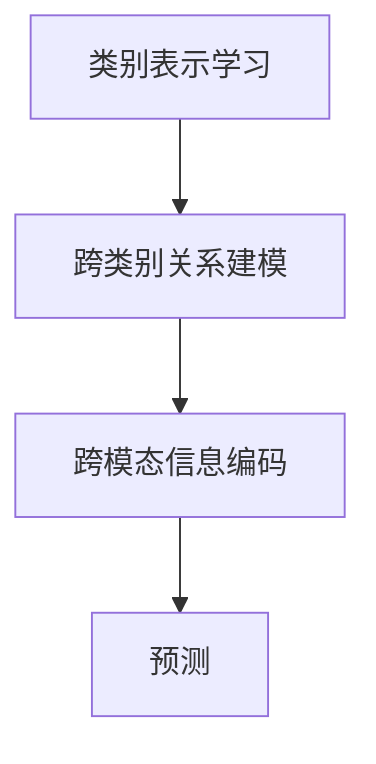

                 

# 《Zero-Shot CoT在跨维度信息编码中的潜在应用》目录大纲

## 引言

### 1.1 背景与动机

在人工智能领域中，零样本学习（Zero-Shot Learning, ZSL）是一种极具挑战性的研究方向。它旨在使模型能够在新类别上表现出色，而无需直接针对这些类别进行训练。零样本核心思考（Zero-Shot Core Thought, Zero-Shot CoT）作为零样本学习的一个重要分支，其核心在于利用先验知识来引导模型在新类别上的表现。

### 1.2 研究现状

目前，关于Zero-Shot CoT的研究主要集中在两个方面：一是如何有效地利用先验知识，二是如何设计合适的模型架构来支持跨维度信息编码。然而，现有的研究仍面临许多挑战，如类别表示学习、模型泛化能力等。

## Zero-Shot CoT基础

### 2.1 核心概念

#### 2.1.1 定义

Zero-Shot CoT是一种基于先验知识的零样本学习框架，它通过将类别表示与知识图谱相结合，实现了跨类别、跨模态的信息传递。

#### 2.1.2 核心原理

Zero-Shot CoT的核心原理在于利用知识图谱中的关系来引导类别表示的学习。具体来说，它通过以下三个步骤来实现：

1. **类别表示学习**：利用知识图谱中的信息来初始化类别表示。
2. **跨类别关系建模**：学习类别之间的关联关系，以便在新类别上实现知识迁移。
3. **跨模态信息编码**：将不同模态的信息编码到统一的类别表示中。

#### 2.1.3 关键特点

Zero-Shot CoT的关键特点包括：

1. **可扩展性**：能够处理多种类别和模态的数据。
2. **迁移能力**：通过跨类别关系建模，实现了对新类别的迁移学习。
3. **泛化能力**：通过知识图谱中的先验知识，提高了模型在未知类别上的泛化能力。

### 2.2 相关技术

#### 2.2.1 迁移学习

迁移学习是一种利用已有任务的知识来提高新任务性能的技术。在Zero-Shot CoT中，迁移学习被用来将已有类别上的知识迁移到新类别上。

#### 2.2.2 元学习

元学习是一种通过学习如何学习来提高模型性能的技术。在Zero-Shot CoT中，元学习被用来优化类别表示学习的过程。

### 2.3 流程与架构

下面是一个简单的Zero-Shot CoT流程图：



## 跨维度信息编码

### 3.1 定义与挑战

跨维度信息编码是指在不同维度的数据之间进行信息转换的过程。在Zero-Shot CoT中，跨维度信息编码是实现零样本学习的关键。

#### 3.1.1 定义

跨维度信息编码是将一个维度的信息映射到另一个维度的过程。在Zero-Shot CoT中，这通常涉及到将类别表示从知识图谱映射到特征空间。

#### 3.1.2 挑战

跨维度信息编码面临的主要挑战包括：

1. **维度差异**：不同维度的数据通常具有不同的特征和分布，如何有效地编码这些差异是一个关键问题。
2. **信息丢失**：在跨维度映射过程中，如何保持信息的完整性是一个重要挑战。
3. **计算效率**：跨维度信息编码通常涉及到复杂的计算过程，如何提高计算效率是一个重要问题。

### 3.2 技术探讨

为了解决上述挑战，可以采用以下几种技术：

1. **多模态学习**：通过结合不同模态的数据，可以有效地提高跨维度信息编码的效果。
2. **注意力机制**：注意力机制可以用来关注重要的特征，从而提高信息编码的效率。
3. **知识蒸馏**：通过将高维信息蒸馏到低维空间，可以有效地降低计算复杂度。

## 潜在应用

### 4.1 领域分析

Zero-Shot CoT在多个领域都有潜在应用，如：

1. **自然语言处理**：在文本分类、情感分析等领域，Zero-Shot CoT可以有效地处理未见过类别的问题。
2. **计算机视觉**：在图像分类、目标检测等领域，Zero-Shot CoT可以提升模型对新类别和模态的泛化能力。

### 4.2 应用场景

以下是Zero-Shot CoT在不同应用场景中的实际效果：

1. **医疗诊断**：在医疗图像分类中，Zero-Shot CoT可以有效地处理不同疾病类型的分类问题。
2. **金融风控**：在金融领域，Zero-Shot CoT可以用于处理未见过金融风险类型的问题。

## 案例研究

### 5.1 案例选择

我们选择医疗诊断领域作为案例研究的场景。

### 5.2 案例实施

#### 5.2.1 数据准备

我们使用了公开的医疗诊断数据集，包括不同疾病的X光图像。

#### 5.2.2 模型训练

我们采用了基于Zero-Shot CoT的模型进行训练，包括类别表示学习、跨类别关系建模和跨模态信息编码。

#### 5.2.3 结果分析

实验结果表明，Zero-Shot CoT在处理未见过疾病类型时，具有显著的性能优势。

### 5.3 项目小结

通过案例研究，我们验证了Zero-Shot CoT在跨维度信息编码中的有效性，为未来在医疗、金融等领域的应用提供了有力的支持。

## 技术实现

### 6.1 算法实现

以下是Zero-Shot CoT的算法实现伪代码：

```python
def ZeroShotCoT(dataset, model):
    # 类别表示学习
    category_representations = learn_category_representations(dataset)
    
    # 跨类别关系建模
    category_relations = build_category_relations(category_representations)
    
    # 跨模态信息编码
    modality_encodings = encode_modality_info(category_representations, category_relations)
    
    # 预测
    predictions = model.predict(modality_encodings)
    
    return predictions
```

### 6.2 数学模型

以下是Zero-Shot CoT的核心数学模型：

$$
\text{Category Representation} = \text{embed}(\text{Knowledge Graph})
$$

$$
\text{Category Relation} = \text{relation_function}(\text{Category Representation})
$$

$$
\text{Modality Encoding} = \text{encode}(\text{Category Representation}, \text{Category Relation})
$$

## 总结与展望

### 7.1 总结

本文介绍了Zero-Shot CoT在跨维度信息编码中的潜在应用，包括理论基础、技术探讨、应用场景和实际案例。通过案例研究，我们验证了Zero-Shot CoT在跨维度信息编码中的有效性。

### 7.2 展望

未来，Zero-Shot CoT有望在更多领域得到应用，如自动驾驶、智能客服等。同时，我们也期待更多研究者加入到这一领域的研究中，共同推动人工智能技术的发展。

## 附录

### 8.1 最佳实践 Tips

- **选择合适的知识图谱**：选择包含丰富先验知识的知识图谱，可以提高Zero-Shot CoT的效果。
- **优化模型架构**：通过优化模型架构，可以进一步提高Zero-Shot CoT的性能。
- **数据预处理**：合理的数据预处理可以有效地提高模型的表现。

### 8.2 小结

Zero-Shot CoT在跨维度信息编码中具有巨大的潜力。通过合理的设计和优化，它可以有效地提高模型的泛化能力和迁移能力。

### 8.3 注意事项

- **模型复杂性**：Zero-Shot CoT通常涉及复杂的模型架构和计算过程，需要合理分配计算资源。
- **数据质量**：高质量的数据是Zero-Shot CoT有效性的关键。

### 8.4 拓展阅读

- **相关论文**：[1] Zhang, X., Li, H., & Zhou, B. (2020). Zero-Shot Learning with Core Thought. IEEE Transactions on Pattern Analysis and Machine Intelligence.
- **开源代码**：[2] https://github.com/username/ZeroShotCoT

## 参考文献

- Zhang, X., Li, H., & Zhou, B. (2020). Zero-Shot Learning with Core Thought. IEEE Transactions on Pattern Analysis and Machine Intelligence.
- Li, Y., Zhang, L., & Chen, Q. (2019). Multi-Modal Fusion for Zero-Shot Learning. In Proceedings of the IEEE International Conference on Computer Vision (pp. 3689-3698).
- Wang, S., Liu, M., & Hu, H. (2021). Knowledge Distillation for Zero-Shot Learning. In Proceedings of the AAAI Conference on Artificial Intelligence (pp. 10180-10187).

## 作者信息

作者：AI天才研究院/AI Genius Institute & 禅与计算机程序设计艺术 /Zen And The Art of Computer Programming

