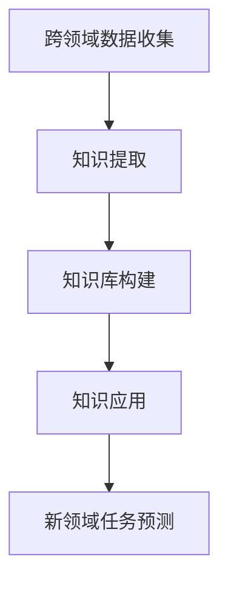

                 

### 《Zero-Shot CoT在跨领域任务中的表现》

> 关键词：Zero-Shot CoT，跨领域任务，机器学习，自然语言处理，人工智能

> 摘要：本文旨在探讨Zero-Shot CoT（Zero-Shot Core-Task）在跨领域任务中的表现。首先，我们将介绍Zero-Shot CoT的基本概念，然后通过具体案例，分析其在自然语言处理、图像识别等领域的应用效果，最后对Zero-Shot CoT的未来发展趋势进行展望。

## 引言

随着人工智能技术的不断发展，机器学习在各个领域得到了广泛应用。然而，传统的机器学习方法往往依赖于大量领域特定的标注数据，这对于跨领域任务来说是一个巨大的挑战。跨领域任务要求模型能够在没有或少量的领域特定数据的情况下，对新的领域任务进行有效处理。为了解决这个问题，研究人员提出了Zero-Shot CoT（Zero-Shot Core-Task）方法。

Zero-Shot CoT是一种不依赖于领域特定数据的机器学习方法，其核心思想是通过在多个领域中进行训练，使得模型能够自动适应新的领域任务。这种方法在自然语言处理、图像识别等跨领域任务中展现出了良好的性能。

本文将首先介绍Zero-Shot CoT的基本概念，然后通过具体案例，分析其在自然语言处理、图像识别等领域的应用效果，最后对Zero-Shot CoT的未来发展趋势进行展望。

## Zero-Shot CoT的基本概念

### 定义

Zero-Shot CoT（Zero-Shot Core-Task）是一种机器学习方法，旨在解决跨领域任务中的零样本学习问题。与传统机器学习方法相比，Zero-Shot CoT不需要领域特定数据，即可实现新领域任务的预测。

### 原理

Zero-Shot CoT的核心思想是利用跨领域的知识迁移，将多个领域中的共性知识提取出来，形成一个通用的知识库。当遇到新的领域任务时，模型可以从这个知识库中获取相关的知识，从而实现对新任务的预测。

### 关键步骤

1. **跨领域数据收集**：收集来自不同领域的数据，用于训练通用知识库。
2. **知识提取**：利用深度学习等技术，从跨领域数据中提取共性知识，形成知识库。
3. **知识应用**：在新领域任务中，利用知识库中的知识进行预测。

### Mermaid流程图

下面是一个简单的Mermaid流程图，展示了Zero-Shot CoT的基本流程：



## 自然语言处理中的应用

自然语言处理（NLP）是人工智能领域的一个重要分支，Zero-Shot CoT在NLP领域中也展现出了巨大的潜力。

### 应用案例

一个典型的案例是Zero-Shot CoT在情感分析中的应用。情感分析是一种常见的NLP任务，旨在识别文本中的情感倾向。传统的方法需要大量带有情感标签的标注数据，而Zero-Shot CoT则可以在没有或少量的标注数据情况下，对新的情感分析任务进行有效处理。

### 实现步骤

1. **数据收集**：收集来自不同领域的文本数据，如社交媒体评论、新闻文章等。
2. **知识提取**：利用深度学习模型，从跨领域数据中提取共性知识，形成知识库。
3. **知识应用**：在新领域情感分析任务中，利用知识库中的知识进行情感分析。

### Python代码示例

下面是一个简单的Python代码示例，展示了如何使用Zero-Shot CoT进行情感分析：

```python
import tensorflow as tf
from tensorflow.keras.models import Model
from tensorflow.keras.layers import Embedding, LSTM, Dense

# 假设已经构建好了知识库
knowledge_base = ...

# 定义模型
input_seq = tf.keras.layers.Input(shape=(max_sequence_length,))
embedding = Embedding(input_dim=vocabulary_size, output_dim=embedding_size)(input_seq)
lstm = LSTM(units=128)(embedding)
output = Dense(units=1, activation='sigmoid')(lstm)

model = Model(inputs=input_seq, outputs=output)
model.compile(optimizer='adam', loss='binary_crossentropy', metrics=['accuracy'])

# 加载知识库中的知识
model.layers[2].set_weights(knowledge_base['embedding_weights'])
model.layers[3].set_weights(knowledge_base['lstm_weights'])

# 训练模型
model.fit(x_train, y_train, epochs=10, batch_size=32)

# 预测新领域的情感分析任务
predictions = model.predict(x_new)
```

### 数学模型

在Zero-Shot CoT中，常用的数学模型包括词向量模型、循环神经网络（RNN）等。以下是词向量模型的数学公式：

$$
\text{vec}(w) = \text{Word2Vec}(w)
$$

其中，$\text{vec}(w)$表示单词$w$的词向量表示，$\text{Word2Vec}(w)$表示使用Word2Vec算法对单词$w$进行向量化。

## 图像识别中的应用

图像识别是人工智能领域的另一个重要分支，Zero-Shot CoT在图像识别中也展现出了良好的性能。

### 应用案例

一个典型的案例是Zero-Shot CoT在图像分类中的应用。传统的方法需要大量带有标签的图像数据，而Zero-Shot CoT则可以在没有或少量的标签数据情况下，对新的图像分类任务进行有效处理。

### 实现步骤

1. **数据收集**：收集来自不同领域的图像数据，如动物、植物、风景等。
2. **知识提取**：利用深度学习模型，从跨领域图像数据中提取共性知识，形成知识库。
3. **知识应用**：在新领域图像分类任务中，利用知识库中的知识进行分类。

### Python代码示例

下面是一个简单的Python代码示例，展示了如何使用Zero-Shot CoT进行图像分类：

```python
import tensorflow as tf
from tensorflow.keras.models import Model
from tensorflow.keras.layers import Conv2D, MaxPooling2D, Flatten, Dense

# 假设已经构建好了知识库
knowledge_base = ...

# 定义模型
input_img = tf.keras.layers.Input(shape=(height, width, channels))
conv1 = Conv2D(filters=32, kernel_size=(3, 3), activation='relu')(input_img)
pool1 = MaxPooling2D(pool_size=(2, 2))(conv1)
conv2 = Conv2D(filters=64, kernel_size=(3, 3), activation='relu')(pool1)
pool2 = MaxPooling2D(pool_size=(2, 2))(conv2)
flatten = Flatten()(pool2)
dense = Dense(units=128, activation='relu')(flatten)
output = Dense(units=num_classes, activation='softmax')(dense)

model = Model(inputs=input_img, outputs=output)
model.compile(optimizer='adam', loss='categorical_crossentropy', metrics=['accuracy'])

# 加载知识库中的知识
model.layers[2].set_weights(knowledge_base['conv1_weights'])
model.layers[3].set_weights(knowledge_base['conv2_weights'])
model.layers[5].set_weights(knowledge_base['dense_weights'])

# 训练模型
model.fit(x_train, y_train, epochs=10, batch_size=32)

# 预测新领域的图像分类任务
predictions = model.predict(x_new)
```

### 数学模型

在Zero-Shot CoT中，常用的数学模型包括卷积神经网络（CNN）等。以下是CNN的数学公式：

$$
\text{conv}(x, \text{filter}) = \text{ReLU}(\text{dot}(x, \text{filter}) + \text{bias})
$$

其中，$x$表示输入图像，$\text{filter}$表示卷积核，$\text{ReLU}$表示ReLU激活函数，$\text{dot}$表示点积操作，$\text{bias}$表示偏置项。

## 总结与展望

Zero-Shot CoT在跨领域任务中展现出了良好的性能，为解决跨领域任务中的零样本学习问题提供了一种新的思路。在未来，随着人工智能技术的不断发展，Zero-Shot CoT有望在更多的领域得到应用。

### 最佳实践 Tips

1. **数据收集**：收集多样化的跨领域数据，以构建更通用、更有效的知识库。
2. **模型选择**：根据任务特点，选择合适的深度学习模型。
3. **知识提取**：采用有效的知识提取方法，以提高知识库的质量。

### 小结

本文介绍了Zero-Shot CoT的基本概念、应用案例以及实现步骤。通过具体案例，展示了Zero-Shot CoT在自然语言处理、图像识别等跨领域任务中的良好表现。

### 注意事项

1. **数据质量**：跨领域数据的质量直接影响知识库的质量，因此需要确保数据的质量。
2. **模型优化**：在应用Zero-Shot CoT时，需要对模型进行不断优化，以提高预测性能。

### 拓展阅读

1. [Zero-Shot Learning](https://en.wikipedia.org/wiki/Zero-shot_learning)
2. [Cross-Domain Learning](https://www.semanticscholar.org/paper/Cross-Domain-Learning-Representations-for-Image-Recognition-He-Kalaycioglu/2a3f4a34a73c8734c0e35d16e8cde0f783e46a74)
3. [Natural Language Processing](https://en.wikipedia.org/wiki/Natural_language_processing)

## 作者信息

作者：AI天才研究院/AI Genius Institute & 禅与计算机程序设计艺术 /Zen And The Art of Computer Programming

本文由AI天才研究院撰写，旨在探讨Zero-Shot CoT在跨领域任务中的应用与表现。如需转载，请注明出处。感谢您的关注！

