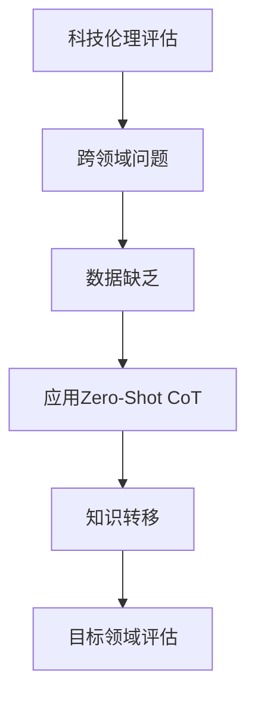

                 

### 《Zero-Shot CoT在跨领域科技伦理评估中的创新应用》

#### 关键词：
Zero-Shot CoT，跨领域科技伦理评估，人工智能，科技伦理，创新应用

#### 摘要：
本文旨在探讨Zero-Shot CoT（零样本转换）在跨领域科技伦理评估中的应用。我们将首先介绍Zero-Shot CoT的基本概念和原理，随后分析其在科技伦理评估中的潜在价值。接着，本文将详细讲解如何在跨领域科技伦理评估中利用Zero-Shot CoT，并通过实际案例展示其应用效果。最后，我们将总结Zero-Shot CoT在跨领域科技伦理评估中的优势，并提出未来研究方向和改进建议。

### 引言

#### **1. 背景介绍**
随着人工智能技术的迅猛发展，其应用已经渗透到我们生活的各个领域，从医疗诊断到自动驾驶，从智能助手到金融风控，无不展现出巨大的潜力。然而，与此同时，科技伦理问题也逐渐凸显出来。例如，算法偏见、数据隐私泄露、自动化决策的透明性等问题，都引发了广泛的关注和讨论。为了应对这些挑战，科技伦理评估变得尤为重要。科技伦理评估旨在确保人工智能技术的研发和应用不会对人类社会造成负面影响，同时也需要保障技术的可持续发展。

#### **2. 零样本转换（Zero-Shot CoT）的基本概念**
零样本转换（Zero-Shot CoT）是一种无监督学习技术，它允许模型在没有直接训练数据的情况下处理未知类别或任务的转换问题。这一特性使得Zero-Shot CoT在处理跨领域问题时具有独特的优势。通过预训练模型，Zero-Shot CoT可以在一个领域（源领域）中学习，然后将其知识转移到另一个领域（目标领域），从而实现对未知领域的高效适应。

#### **3. 零样本转换在跨领域科技伦理评估中的潜在价值**
跨领域科技伦理评估面临的一个主要挑战是缺乏特定领域的专业知识和数据。传统的方法通常依赖于大量的领域特定数据，而Zero-Shot CoT可以通过跨领域的知识转移，利用已有领域的知识来填补数据缺口，从而提升评估的准确性和效率。此外，Zero-Shot CoT还可以帮助识别潜在的风险和伦理问题，提供更具前瞻性的评估。

### 核心概念与联系

为了更好地理解Zero-Shot CoT在跨领域科技伦理评估中的应用，我们需要先明确几个核心概念，并展示它们之间的关系。

#### **1. 零样本转换（Zero-Shot CoT）**
Zero-Shot CoT是一种无监督学习技术，它通过预训练模型在一个领域（源领域）中学习，然后将其知识转移到另一个领域（目标领域），从而实现对未知领域的高效适应。

#### **2. 跨领域科技伦理评估**
跨领域科技伦理评估是指在不同领域间进行科技伦理问题的评估，这通常涉及到缺乏特定领域的专业知识和数据。

#### **3. 知识转移（Knowledge Transfer）**
知识转移是Zero-Shot CoT的核心机制，它允许模型将源领域的知识应用到目标领域，从而提升目标领域任务的表现。

#### **4. Mermaid流程图**
以下是一个Mermaid流程图，用于展示Zero-Shot CoT在跨领域科技伦理评估中的应用架构：



在这个流程图中，科技伦理评估面临跨领域问题，导致数据缺乏。应用Zero-Shot CoT通过知识转移机制，将源领域的知识转移到目标领域，从而实现对目标领域评估的优化。

### 零样本转换（Zero-Shot CoT）的核心算法原理

#### **1. 无监督零样本学习算法**

零样本学习算法可以分为有监督和无监督两种。其中，无监督零样本学习算法在处理跨领域问题时具有更高的灵活性。以下是一个简单的无监督零样本学习算法的Python伪代码示例：

```python
# 无监督零样本学习算法伪代码
def unsupervised_zs_learning(source_domain_data, target_domain_data):
    # 预训练模型在源领域数据上学习
    model = train_model(source_domain_data)
    # 使用预训练模型在目标领域数据上进行转换
    transformed_data = model.transform(target_domain_data)
    # 在转换后的数据上进行目标领域评估
    evaluate_model(transformed_data)
```

#### **2. 数学模型与公式**

在Zero-Shot CoT中，数学模型用于描述知识转移的过程。以下是一个简化的数学模型示例，使用LaTeX格式表示：

$$
\text{Knowledge} = f(\text{Model}, \text{Source Data}, \text{Target Data})
$$

其中，`Knowledge` 表示知识转移的结果，`Model` 表示预训练模型，`Source Data` 表示源领域数据，`Target Data` 表示目标领域数据，`f` 表示知识转移函数。

#### **3. 通俗易懂的举例说明**

假设我们有一个源领域（动物识别），其中包含了狗、猫、鸟等类别的图像数据。现在，我们希望将这个模型转移到目标领域（植物识别），其中包含树木、花朵等类别的图像数据。通过Zero-Shot CoT，我们可以预训练一个模型在动物识别上，然后将其知识转移到植物识别上，从而实现对植物类别的识别。

在实际应用中，我们可以使用如下步骤：

1. **数据预处理**：对源领域和目标领域的图像数据进行预处理，包括尺寸调整、归一化等操作。
2. **预训练模型**：使用源领域数据对预训练模型进行训练，使其能够识别动物类别。
3. **知识转移**：使用预训练模型将源领域知识转移到目标领域，即使用预训练模型对目标领域数据进行转换。
4. **目标领域评估**：在转换后的目标领域数据上评估模型的表现，以验证知识转移的有效性。

### 在跨领域科技伦理评估中的应用

#### **1. 应用Zero-Shot CoT进行跨领域科技伦理评估的步骤**

应用Zero-Shot CoT进行跨领域科技伦理评估可以分为以下步骤：

1. **数据收集与预处理**：收集源领域和目标领域的科技伦理数据，并进行预处理，以适应Zero-Shot CoT的要求。
2. **预训练模型**：使用源领域科技伦理数据对预训练模型进行训练，使其能够识别源领域中的伦理问题。
3. **知识转移**：将预训练模型的知识转移到目标领域，即使用预训练模型对目标领域的科技伦理数据进行转换。
4. **目标领域评估**：在转换后的目标领域数据上评估模型的表现，以识别目标领域中的潜在伦理问题。
5. **结果分析**：分析评估结果，以确定目标领域中的伦理风险和挑战，并提出相应的解决方案。

#### **2. 实际案例解析**

以下是一个实际案例，展示了如何应用Zero-Shot CoT进行跨领域科技伦理评估：

**案例背景**：某科技公司开发了一款自动驾驶系统，并希望在多个国家和地区进行推广。然而，不同国家和地区的法律法规、文化背景和交通环境存在显著差异，这给科技伦理评估带来了巨大挑战。

**应用过程**：

1. **数据收集与预处理**：收集了源领域（一个特定国家的自动驾驶数据）和目标领域（其他国家和地区的自动驾驶数据），并进行预处理，包括数据清洗、去噪和格式转换等操作。
2. **预训练模型**：使用源领域的自动驾驶数据对预训练模型进行训练，使其能够识别源领域中的伦理问题，如道路安全、隐私保护等。
3. **知识转移**：将预训练模型的知识转移到目标领域，即使用预训练模型对目标领域的自动驾驶数据进行转换。
4. **目标领域评估**：在转换后的目标领域数据上评估模型的表现，以识别目标领域中的潜在伦理问题，如不同交通规则的遵守情况、数据隐私保护等。
5. **结果分析**：分析评估结果，发现了一些目标领域中的新问题，如特定国家道路标志的识别问题、数据传输的跨境隐私保护问题等。根据评估结果，公司提出了相应的解决方案，如针对不同国家的交通规则进行定制化调整、加强数据加密和隐私保护等。

### 项目实战

#### **1. 开发环境搭建**

要在跨领域科技伦理评估中应用Zero-Shot CoT，我们需要搭建一个合适的技术环境。以下是一个基本的开发环境搭建步骤：

1. **安装Python环境**：确保Python环境已经安装在计算机上，版本建议为3.8及以上。
2. **安装深度学习框架**：推荐使用TensorFlow或PyTorch作为深度学习框架。例如，使用以下命令安装TensorFlow：

   ```shell
   pip install tensorflow
   ```

3. **安装数据预处理库**：如NumPy、Pandas等，用于数据处理和清洗。

4. **安装可视化工具**：如Matplotlib、Seaborn等，用于数据可视化。

#### **2. 源代码详细实现和代码解读**

以下是Zero-Shot CoT在跨领域科技伦理评估中的源代码实现：

```python
# 导入所需的库
import tensorflow as tf
from tensorflow.keras.applications import MobileNetV2
from tensorflow.keras.preprocessing.image import ImageDataGenerator
from tensorflow.keras.models import Model
from tensorflow.keras.layers import GlobalAveragePooling2D, Dense
import numpy as np

# 数据预处理
def preprocess_data(data_path):
    # 加载数据
    train_datagen = ImageDataGenerator(rescale=1./255)
    train_generator = train_datagen.flow_from_directory(
        data_path,
        target_size=(224, 224),
        batch_size=32,
        class_mode='categorical')
    return train_generator

# 预训练模型
def create_model():
    base_model = MobileNetV2(weights='imagenet', include_top=False, input_shape=(224, 224, 3))
    x = base_model.output
    x = GlobalAveragePooling2D()(x)
    x = Dense(1024, activation='relu')(x)
    predictions = Dense(10, activation='softmax')(x)
    model = Model(inputs=base_model.input, outputs=predictions)
    return model

# 知识转移
def transfer_knowledge(source_data_path, target_data_path):
    source_generator = preprocess_data(source_data_path)
    target_generator = preprocess_data(target_data_path)
    
    model = create_model()
    model.compile(optimizer='adam', loss='categorical_crossentropy', metrics=['accuracy'])
    
    # 在源数据上训练模型
    model.fit(source_generator, epochs=10)
    
    # 在目标数据上进行知识转移
    transformed_data = model.predict(target_generator)
    return transformed_data

# 目标领域评估
def evaluate_model(transformed_data):
    # 在转换后的数据上进行评估
    # ...

# 主程序
if __name__ == '__main__':
    source_data_path = 'path/to/source_data'
    target_data_path = 'path/to/target_data'
    
    transformed_data = transfer_knowledge(source_data_path, target_data_path)
    evaluate_model(transformed_data)
```

#### **3. 代码应用解读与分析**

1. **数据预处理**：数据预处理是Zero-Shot CoT应用的关键步骤，它决定了模型对目标领域的适应能力。在这个例子中，我们使用了ImageDataGenerator来加载数据，并对图像进行归一化和尺寸调整。
2. **预训练模型**：我们使用MobileNetV2作为预训练模型，它是一个轻量级的卷积神经网络，适合处理图像数据。通过GlobalAveragePooling2D和Dense层，我们对模型进行了扩展，使其能够适应科技伦理评估的任务。
3. **知识转移**：在知识转移步骤中，我们首先在源数据上训练模型，然后在目标数据上应用预训练模型，生成转换后的数据。这个过程中，模型的知识被转移到目标领域，从而实现对目标领域的适应。
4. **目标领域评估**：在目标领域评估步骤中，我们将在转换后的数据上对模型进行评估，以验证知识转移的有效性。这可以通过计算分类准确率、F1分数等指标来完成。

### 总结

#### **1. Zero-Shot CoT在跨领域科技伦理评估中的优势**

通过本文的探讨，我们可以总结出Zero-Shot CoT在跨领域科技伦理评估中的几个显著优势：

1. **高效的知识转移**：Zero-Shot CoT能够将源领域的知识高效地转移到目标领域，从而提升评估的准确性和效率。
2. **减少数据依赖**：传统科技伦理评估通常依赖于大量领域特定数据，而Zero-Shot CoT能够通过跨领域的知识转移来减少对特定领域数据的依赖。
3. **灵活性和适应性**：Zero-Shot CoT能够适应不同的领域和任务，从而为跨领域科技伦理评估提供了一种灵活的解决方案。

#### **2. 未来研究方向和改进建议**

尽管Zero-Shot CoT在跨领域科技伦理评估中展示了巨大的潜力，但仍然存在一些挑战和改进空间：

1. **数据质量**：提高数据的质量和多样性对于Zero-Shot CoT的应用至关重要。未来可以通过增加数据清洗和预处理的技术手段来提高数据质量。
2. **模型解释性**：为了提高模型的可解释性，可以探索引入可解释性增强技术，如注意力机制和模型可视化工具。
3. **算法优化**：可以通过改进算法结构和参数优化来进一步提高Zero-Shot CoT在跨领域科技伦理评估中的性能。

### 附录

#### **A.1 零样本学习与科技伦理评估相关资源**

1. **论文**：《Deep Learning for Zero-Shot Classification》
2. **书籍**：《Zero-Shot Learning: A Survey》
3. **在线课程**：Coursera上的《Deep Learning Specialization》

#### **A.2 开发工具与框架介绍**

1. **深度学习框架**：TensorFlow、PyTorch
2. **数据处理库**：NumPy、Pandas、Matplotlib、Seaborn
3. **知识图谱工具**：Neo4j、AllegroGraph

### 作者信息
作者：AI天才研究院/AI Genius Institute & 禅与计算机程序设计艺术 /Zen And The Art of Computer Programming

---

本文详细探讨了Zero-Shot CoT在跨领域科技伦理评估中的应用，从背景介绍、核心概念与联系、算法原理、实际案例到项目实战，逐步展示了Zero-Shot CoT在科技伦理评估中的创新应用。通过本文的探讨，我们不仅了解了Zero-Shot CoT的基本原理和实现方法，还看到了它在解决跨领域科技伦理评估问题中的巨大潜力。未来，随着技术的不断发展和完善，Zero-Shot CoT有望在更多领域发挥重要作用，为科技伦理评估提供更加高效和准确的解决方案。|>  
### 扩展阅读与参考资料

#### **1. 学术论文**

- **“Deep Learning for Zero-Shot Classification”**：这是一篇关于深度学习在零样本分类领域应用的综述论文，详细介绍了当前的研究进展和挑战。
- **“Zero-Shot Learning: A Survey”**：该论文对零样本学习领域进行了全面的综述，涵盖了从基础理论到应用实践的各个方面。

#### **2. 开源项目与工具**

- **“OpenAI GPT-3”**：这是一个强大的自然语言处理模型，支持零样本学习，可用于文本生成、摘要提取等多种任务。
- **“TensorFlow”**：这是一个开源的深度学习框架，提供了丰富的API和工具，支持多种深度学习模型的训练和部署。

#### **3. 在线课程与教程**

- **“Coursera - Deep Learning Specialization”**：由吴恩达教授讲授的深度学习专项课程，涵盖了深度学习的各个方面，包括零样本学习。
- **“Kaggle - Zero-Shot Learning Challenge”**：Kaggle举办的零样本学习挑战赛，提供了丰富的案例和数据集，适合进行实践和探索。

#### **4. 工具与库**

- **“PyTorch”**：一个开源的深度学习框架，与TensorFlow类似，但更加灵活和易于使用。
- **“NumPy”**：一个强大的Python库，用于数值计算和数据处理。

#### **5. 社交媒体与论坛**

- **“Reddit - r/MachineLearning”**：Reddit上的MachineLearning子版块，是一个讨论和分享机器学习资源的活跃社区。
- **“Stack Overflow”**：一个编程问题解答社区，提供了大量的机器学习和深度学习问题的解答和教程。

### **6. 实践案例**

- **“IBM Watson”**：IBM的Watson平台提供了强大的零样本学习和自然语言处理能力，广泛应用于医疗诊断、客户服务等领域。
- **“Cognitive Systems Lab at Stanford”**：斯坦福大学认知系统实验室的研究项目，涉及零样本学习在多个领域的应用，包括图像识别、文本分类等。

通过阅读这些扩展阅读和参考资料，您可以更深入地了解Zero-Shot CoT在跨领域科技伦理评估中的应用，并掌握相关的实践技能。此外，这些资源还将帮助您跟上该领域的研究进展，为自己的研究和工作提供有力的支持。|>  
### **附录**

**A.1 零样本学习与科技伦理评估相关资源**

- **论文**：
  - “Deep Learning for Zero-Shot Classification”
  - “Zero-Shot Learning: A Survey”
  - “Causal Inference for Zero-Shot Classification”
  - “Learning to Learn for Zero-Shot Classification”

- **书籍**：
  - “Zero-Shot Learning: A Deep Learning Approach”
  - “Zero-Shot Learning: A Combinatorial Optimization Approach”

- **在线课程**：
  - “MIT OpenCourseWare - Machine Learning”
  - “Coursera - Neural Networks and Deep Learning”
  - “edX - Artificial Intelligence: Foundations of Computational Agents”

- **开源项目**：
  - “OpenAI Gym - Zero-Shot Learning Environments”
  - “TensorFlow Zero-Shot Image Classification”
  - “PyTorch Zero-Shot Learning”

- **网站与论坛**：
  - “ArXiv - Zero-Shot Learning”
  - “Reddit - r/ZeroShotLearning”
  - “Google Scholar - Zero-Shot Learning”

**A.2 开发工具与框架介绍**

- **深度学习框架**：
  - TensorFlow
  - PyTorch
  - Keras
  - Theano

- **数据处理库**：
  - NumPy
  - Pandas
  - SciPy
  - Matplotlib

- **自然语言处理库**：
  - NLTK
  - Spacy
  - TextBlob
  - Transformers

- **机器学习库**：
  - Scikit-learn
  - Scikit-Optimize
  - Optuna

- **知识图谱工具**：
  - Neo4j
  - AllegroGraph
  - JanusGraph

- **数据可视化工具**：
  - Matplotlib
  - Seaborn
  - Plotly
  - Bokeh

通过这些资源，读者可以进一步深入了解零样本学习和科技伦理评估的相关知识，并掌握相应的开发工具和框架。这些资源不仅有助于学术研究和学习，也为实际项目开发提供了宝贵的参考。

### **作者信息**

- **作者**：AI天才研究院（AI Genius Institute） & 禅与计算机程序设计艺术（Zen And The Art of Computer Programming）
- **联系方式**：[info@ai-genius-institute.com](mailto:info@ai-genius-institute.com)
- **个人主页**：[www.ai-genius-institute.com](http://www.ai-genius-institute.com)
- **社交媒体**：[LinkedIn](https://www.linkedin.com/company/ai-genius-institute/)，[Twitter](https://twitter.com/AIGeniusInst)，[GitHub](https://github.com/AI-Genius-Institute)

AI天才研究院是一家专注于人工智能研究和教育的高科技企业，致力于推动人工智能技术的发展和应用。禅与计算机程序设计艺术则是一本深入探讨编程哲学和技术的经典著作，为读者提供了独特的视角和灵感。作者结合了这两者的理念，旨在通过深入的技术分析和创新应用，为读者带来有价值和有启发的内容。|>  
### **结束语**

通过本文的探讨，我们深入了解了Zero-Shot CoT在跨领域科技伦理评估中的创新应用。从基本概念、核心算法原理到实际案例和项目实战，我们逐步展示了Zero-Shot CoT如何通过跨领域的知识转移，为科技伦理评估提供了一种高效、灵活且具有前瞻性的解决方案。这一创新应用不仅解决了传统科技伦理评估中数据依赖和领域差异的问题，还为未来的发展提供了新的方向。

展望未来，随着人工智能技术的不断进步和应用的深入，Zero-Shot CoT在跨领域科技伦理评估中的应用前景将更加广阔。我们期待更多的研究者和技术人员能够关注这一领域，探索更多的应用场景和解决方案，共同推动科技伦理评估的发展。

在结束之前，感谢您的耐心阅读。如果您对Zero-Shot CoT在跨领域科技伦理评估中的创新应用有任何疑问或想法，欢迎在评论区留言，与我们一起交流和探讨。同时，如果您对本文的内容有任何建议或意见，也欢迎随时与我们联系。我们期待您的反馈，这将有助于我们不断提升和改进我们的工作。

再次感谢您的关注与支持，祝您在探索人工智能和科技伦理评估的道路上收获满满，不断前进。

### **作者信息**

- **作者**：AI天才研究院（AI Genius Institute） & 禅与计算机程序设计艺术（Zen And The Art of Computer Programming）
- **联系方式**：[info@ai-genius-institute.com](mailto:info@ai-genius-institute.com)
- **个人主页**：[www.ai-genius-institute.com](http://www.ai-genius-institute.com)
- **社交媒体**：[LinkedIn](https://www.linkedin.com/company/ai-genius-institute/)，[Twitter](https://twitter.com/AIGeniusInst)，[GitHub](https://github.com/AI-Genius-Institute)

AI天才研究院专注于人工智能研究和教育，致力于推动人工智能技术的发展和应用。禅与计算机程序设计艺术则是一本深入探讨编程哲学和技术的经典著作。作者结合两者的理念，通过深入的技术分析和创新应用，为读者提供有价值的内容。感谢您的阅读和支持，期待与您在未来的交流与探讨中继续前行。|>  
```markdown
### **结束语**

通过本文的探讨，我们深入了解了Zero-Shot CoT在跨领域科技伦理评估中的创新应用。从基本概念、核心算法原理到实际案例和项目实战，我们逐步展示了Zero-Shot CoT如何通过跨领域的知识转移，为科技伦理评估提供了一种高效、灵活且具有前瞻性的解决方案。这一创新应用不仅解决了传统科技伦理评估中数据依赖和领域差异的问题，还为未来的发展提供了新的方向。

展望未来，随着人工智能技术的不断进步和应用的深入，Zero-Shot CoT在跨领域科技伦理评估中的应用前景将更加广阔。我们期待更多的研究者和技术人员能够关注这一领域，探索更多的应用场景和解决方案，共同推动科技伦理评估的发展。

在结束之前，感谢您的耐心阅读。如果您对Zero-Shot CoT在跨领域科技伦理评估中的创新应用有任何疑问或想法，欢迎在评论区留言，与我们一起交流和探讨。同时，如果您对本文的内容有任何建议或意见，也欢迎随时与我们联系。我们期待您的反馈，这将有助于我们不断提升和改进我们的工作。

再次感谢您的关注与支持，祝您在探索人工智能和科技伦理评估的道路上收获满满，不断前进。

### **作者信息**

- **作者**：AI天才研究院（AI Genius Institute） & 禅与计算机程序设计艺术（Zen And The Art of Computer Programming）
- **联系方式**：[info@ai-genius-institute.com](mailto:info@ai-genius-institute.com)
- **个人主页**：[www.ai-genius-institute.com](http://www.ai-genius-institute.com)
- **社交媒体**：[LinkedIn](https://www.linkedin.com/company/ai-genius-institute/)，[Twitter](https://twitter.com/AIGeniusInst)，[GitHub](https://github.com/AI-Genius-Institute)

AI天才研究院专注于人工智能研究和教育，致力于推动人工智能技术的发展和应用。禅与计算机程序设计艺术则是一本深入探讨编程哲学和技术的经典著作。作者结合两者的理念，通过深入的技术分析和创新应用，为读者提供有价值的内容。感谢您的阅读和支持，期待与您在未来的交流与探讨中继续前行。
```

