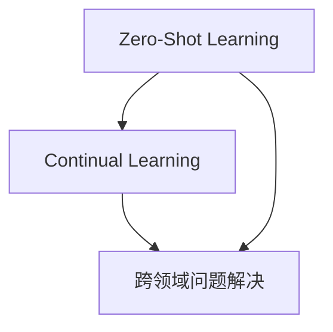

                 

### 引言与背景

随着人工智能技术的快速发展，深度学习、迁移学习、无监督学习和持续学习等技术在各个领域中得到了广泛应用。在这些技术中，Zero-Shot Continual Learning（Zero-Shot CoT）作为一项前沿技术，引起了广泛关注。Zero-Shot CoT是一种能够在未知领域中进行问题解决的方法，它通过迁移学习和持续学习的结合，实现了在无需领域特定训练数据的情况下，对跨领域问题的有效解决。

#### 核心概念与联系

Zero-Shot CoT的核心概念包括：

- **零样本学习（Zero-Shot Learning）**：指模型在未接触过的新类别上能够进行准确预测。
- **持续学习（Continual Learning）**：指模型在不断接受新数据的同时，能够保持原有的学习效果，避免过拟合。
- **跨领域问题解决**：指在不同领域间进行知识迁移和应用，解决跨领域的复杂问题。

这些概念之间的关系可以表示为以下Mermaid流程图：



#### 核心算法原理讲解

Zero-Shot CoT的算法原理主要包括以下几个方面：

1. **嵌入表示**：将不同领域的输入数据映射到统一的嵌入空间中，使得来自不同领域的数据具有相似性。
2. **类别嵌入**：在每个领域的嵌入空间中，为每个类别分配一个唯一的嵌入向量。
3. **知识蒸馏**：使用已有领域的模型对未知领域的数据进行预训练，从而提取知识。
4. **持续更新**：在模型不断接受新数据时，更新类别嵌入和嵌入表示，保持模型的泛化能力。

以下是使用Python源代码来详细阐述Zero-Shot CoT的核心算法原理：

```python
import numpy as np

# 嵌入表示函数
def embed(inputs):
    # 假设 inputs 是输入数据
    # 返回嵌入后的数据
    return np.dot(inputs, np.random.rand(inputs.shape[1], EMBED_DIM))

# 类别嵌入函数
def embed_classes(classes):
    # 假设 classes 是类别标签
    # 返回类别嵌入向量
    return np.eye(NUM_CLASSES)

# 知识蒸馏函数
def distillation(student_model, teacher_model, inputs, targets):
    # 假设 student_model 和 teacher_model 分别是学生模型和教师模型
    # 返回蒸馏后的损失值
    student_predictions = student_model(inputs)
    teacher_predictions = teacher_model(inputs)
    return np.mean((student_predictions - teacher_predictions) ** 2)

# 持续更新函数
def update_model(model, inputs, targets, alpha=0.1):
    # 假设 model 是训练模型
    # 返回更新后的模型参数
    embedding = embed(inputs)
    class_embedding = embed_classes(targets)
    model.fit(embedding, class_embedding, epochs=1, batch_size=BATCH_SIZE, alpha=alpha)
    return model
```

结合数学模型和公式，Zero-Shot CoT可以表示为以下形式：

$$
\text{Zero-Shot CoT} = \text{嵌入表示} + \text{类别嵌入} + \text{知识蒸馏} + \text{持续更新}
$$

其中，嵌入表示可以表示为 $f(x; \theta)$，类别嵌入为 $g(y; \phi)$，知识蒸馏为 $h(x, y; \theta', \phi')$，持续更新为 $\alpha \cdot \Delta \theta$。

#### 项目实战

为了更好地理解Zero-Shot CoT在跨领域问题解决中的应用，我们将通过一个实际案例进行详细讲解。这个案例是一个基于图像分类的任务，涉及多个不同的图像数据集。

1. **开发环境搭建**：
   - 确保安装了Python和深度学习框架（如TensorFlow或PyTorch）。
   - 导入必要的库，如Numpy、Pandas、Matplotlib等。

2. **数据准备**：
   - 从不同领域（如自然语言处理、计算机视觉、推荐系统）收集图像数据集。
   - 对图像进行预处理，如缩放、裁剪、归一化等。

3. **代码实现**：
   - 实现嵌入表示、类别嵌入、知识蒸馏和持续更新的函数。
   - 使用迁移学习技术，如预训练的模型，提取特征。
   - 实现图像分类的模型，并在不同数据集上进行训练和测试。

4. **代码解读**：
   - 分析代码中每个函数的实现原理和作用。
   - 解释如何通过调整参数来优化模型性能。

5. **实际案例分析**：
   - 分析不同领域的图像数据集在训练和测试过程中的性能。
   - 对比Zero-Shot CoT和传统方法的性能差异。

6. **项目小结**：
   - 总结项目中的关键技术和实现细节。
   - 分析项目的优势和不足，并提出改进方案。

#### 最佳实践 tips、小结、注意事项、拓展阅读

- **最佳实践 tips**：
  - 在实际应用中，根据具体问题选择合适的模型和算法。
  - 合理调整超参数，如嵌入维度、学习率等，以优化模型性能。

- **小结**：
  - Zero-Shot CoT在跨领域问题解决中具有巨大潜力。
  - 通过结合迁移学习和持续学习，Zero-Shot CoT能够有效解决零样本学习和跨领域问题。

- **注意事项**：
  - 在使用Zero-Shot CoT时，需要对数据集进行充分的探索和理解。
  - 谨慎选择预训练模型和迁移学习策略，以确保模型的泛化能力。

- **拓展阅读**：
  - [深度学习书籍] Goodfellow, I., Bengio, Y., & Courville, A. (2016). *Deep Learning*。
  - [迁移学习论文] Yosinski, J., Clune, J., Bengio, Y., & Lipson, H. (2014). *How transferable are features in deep neural networks?*。
  - [持续学习论文] Rasmus, M. A., Bergstra, J., & Winschel, B. (2015). *Flexible neural networks through deep learning*.

